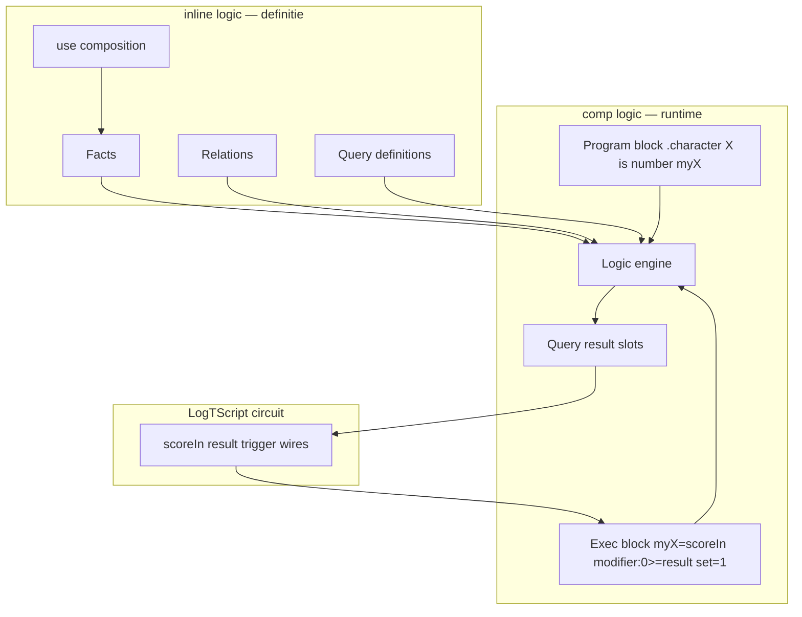
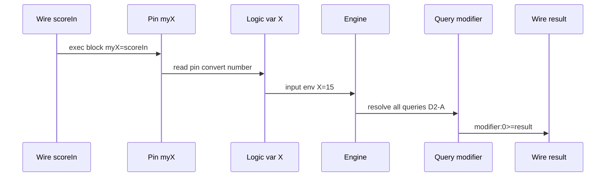
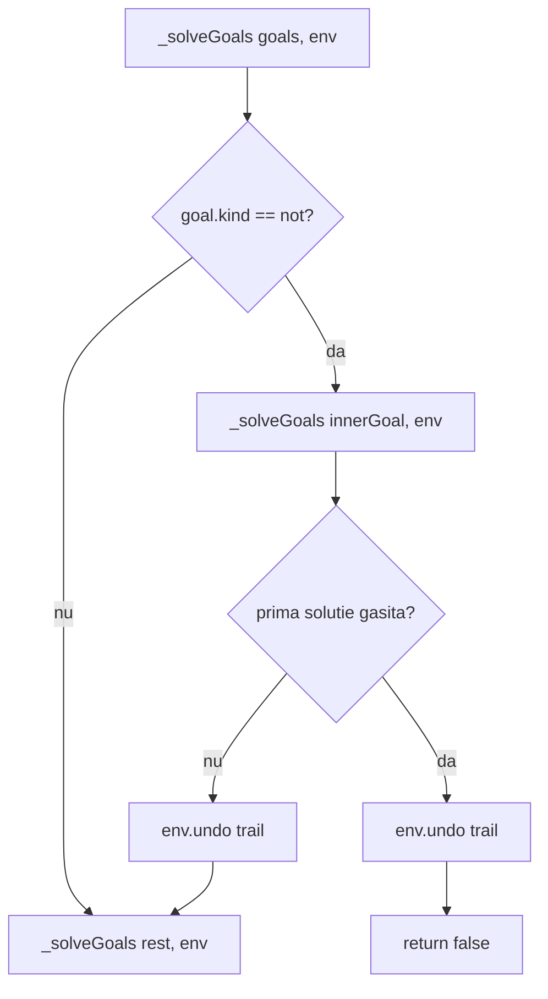

# Plan: `inline [logic]` + `comp [logic]` — motor relațional declarativ

## Legenda

| Marcaj | Semnificație |
|--------|--------------|
| **(recommended)** | Opțiunea recomandată de analiză |
| **(change)** | Alternativă validă, dar diferă de sketch / preferință arhitecturală |
| **(ready-to-implement)** | Faza poate începe după ce deciziile ei sunt confirmate |
| **(completed)** | Decizie luată / implementată |

---

## Context — analogii cu module existente

Sketch v2 clarifică: **logic ≠ protocol ≠ asm**, dar **logic ≈ asm** ca separare inline/comp.

| | **Protocol** | **ASM** | **Logic (sketch v2)** |
|---|-------------|---------|------------------------|
| **inline** | Rețetă: input → output | Definiție ISA / opcodes | Spațiu de cunoștințe: facts, relations, queries |
| **Execuție inline?** | Da (invoke `{ }`) | Nu (doar definiție) | **Nu** — definiția nu rulează |
| **comp** | — | `comp [cpu]` execută prog | **`comp [logic]`** execută query-uri |
| **Legătură cu fire** | args invoke | pin/pout CPU | program block + exec block + `query:N >= wire` |
| **Model** | Transformare | Cod mașină | Rezolvare declarativă |



**Ce există azi** în [`v0_3_2`](../v0_3_2):

- Inline-uri: `asm`, `lut`, `protocol`, `plc`.
- Pattern **`inline [plc]` + `comp [plc]`** — cel mai apropiat ca exec pe componentă ([`plc.md`](../v0_3_2/doc/plc.md)).
- Pattern **`inline [asm]` + `comp [cpu]`** — cel mai apropiat ca „inline = definiție, comp = runtime” ([`asm.md`](../v0_3_2/doc/asm.md)).
- Property blocks pe **componente** — `.characterLogic:{ … set = 1 }` funcționează fără extindere inline-native.

---

## Obiectiv

1. **`inline [logic]`** — parsează facts, relations (`<-`), queries (`query name:`), opțional `use .module`; **nu se execută**.
2. **`comp [logic]`** — leagă o definiție logică prin **program block** (`.character { … }`), primește inputs externe, rulează query-uri la `set = 1`, expune rezultate spre fire LogTScript.
3. **Motor** — unificare, backtracking, aritmetică (`+ - * /`), comparații Prolog-style (`>=`, `=<`, `=:=`, `=\=`), termeni simbolici (`john`, `chevy`).

---

## D1 — REZOLVAT **(completed)**

| | |
|---|---|
| **Decizie** | **Two-layer ASM-like:** `inline [logic]` (definiție) + `comp [logic]` (runtime) |
| **Respinge** | Inline-native (sketch v1: `.people:johnOwns:0` direct pe inline) |
| **Respinge** | Model protocol (inline ca rețetă input→output) |
| **Motiv** | Feedback user: logic = lume de facts/relations; query-urile se fac în componentă, ca asm + cpu |

**Exemplu canonic (sketch v2):**

```logts
inline [logic] .character:

    modifier2(X, -4) <- X >= 1, X =< 2
    modifier2(X,  0) <- X >= 9, X =< 12
    modifier2(X,  2) <- X >= 15, X =< 16

    query modifier:
        modifier2(X, Y)

:

comp [logic] .characterLogic:
    on: raise

    .character {
        X is number myX
    }

:

8wire scoreIn = \15
8wire result = \0
1wire trigger = 0

.characterLogic:{
    myX = scoreIn
    modifier:0 >= result
    set = trigger
}
; scoreIn=15 → pin myX → logic X=15 → modifier2(15,Y) → Y=2 → result=2
```

---

## D2 — REZOLVAT **(completed)**

| | |
|---|---|
| **Decizie MVP** | **A** — la fiecare `set = 1`, rulează **toate** query-urile declarate în inline (după merge `use`) |
| **Amânat** | **C** — listă explicită `query = modifier, johnOwns` — vezi **1+l** (Faza post-MVP) |
| **Motiv user** | MVP simplu; când multe query-uri încetinesc exec-ul, specificarea explicită **nu e redundantă** — e optimizare intenționată, nu duplicare inutilă a redirect-urilor `modifier:0 >=` |

**MVP:**

```logts
; inline declară: query modifier, query backup, query audit, …
.characterLogic:{ myX = scoreIn, modifier:0 >= result, set = trigger }
; → toate query-urile se rezolvă; exec block citește doar modifier:0
```

**Faza amânată (1+l / D2-C):**

```logts
.characterLogic:{
    query = modifier
    myX = scoreIn
    modifier:0 >= result
    set = 1
}
; → doar query modifier — mai rapid când inline are multe query-uri
```

---

## D3 — REZOLVAT **(completed)**

| | |
|---|---|
| **Decizie** | **A** — program block + exec block, cu **pin-uri comp** distincte de variabile logică și de fire LogTScript |
| **Corecție față de draft plan** | Exec block: **`myX = scoreIn`** (pin ← wire), **NU** `X = myX` (var logică ← pin) |

### Modelul în trei straturi

```text
LogTScript wire     comp [logic] pin     logic variable (motor)
─────────────────   ─────────────────   ───────────────────────
scoreIn (N bit)  →  myX              →  X   (is number)
nameWire (ASCII) →  myName           →  Name (is text)
aliveWire (1 bit)→  myAlive          →  Alive (is bool)
```

| Strat | Nume exemplu | Rol |
|-------|--------------|-----|
| **Wire LogTScript** | `scoreIn`, `nameWire` | Semnal în circuit — sursa reală |
| **Pin comp** | `myX`, `myName`, `myAlive` | Interfața externă a `comp [logic]` — declarat în program block |
| **Variabilă logică** | `X`, `Name`, `Alive` | Folosită în facts/relations/queries — **nu** apare în exec block |

### Program block (declarație în `comp [logic]`)

```logts
comp [logic] .characterLogic:

    .character {
        X is number myX
        Name is text myName
        Alive is bool myAlive
    }

:
```

- `X is number myX` — variabila logică **X**, interpretată ca **number**, expusă pe pinul comp **myX**.
- Valid **doar** în body-ul `comp [logic]` — nu e expresie LogTScript normală.

### Exec block (property block — wiring runtime)

```logts
8wire scoreIn = \15
8wire nameWire = "Alice"
1wire aliveWire = 1
8wire result = \0
1wire trigger = 0

.characterLogic:{
    myX = scoreIn
    myName = nameWire
    myAlive = aliveWire
    modifier:0 >= result
    set = trigger
}
```

- **`myX = scoreIn`** — assign LogTScript standard: valoarea wire-ului **scoreIn** alimentează pinul **myX** al componentei.
- La trigger, comp citește pin **myX** → convertește (number) → leagă variabila logică **X** → rezolvă query-uri.
- **`modifier:0 >= result`** — redirect rezultat query → wire (simetric: output pin/slot → wire).

### De ce nu e ca PLC (D3-B) — tabel comparativ

| | **PLC** | **Logic (D3-A)** |
|---|---------|------------------|
| **Unde se mapează** | `comp` header: `inputs: { START = startIn }` | **Program block**: `X is number myX`; **exec block**: `myX = scoreIn` |
| **Ce e `startIn` / `myX`** | Wire LogTScript | **Pin comp** (myX) ← wire în exec block |
| **Ce intră în motor** | Simbol PLC `START` | Variabilă logică `X` (via pin + tip) |
| **Tip la frontieră** | Width simbol | **`number` / `text` / `bool`** explicit |

PLC mapează **simbol program → wire** la elaborare. Logic mapează **var logică → pin comp** la elaborare (program block), apoi **pin → wire** la runtime (exec block) — două pași, dar pin-ul comp e entitatea intermediară clară.

### Flux la trigger



---

---

## Rezumat decizii D4–D19 **(completed)**

| ID | Decizie | Notă |
|----|---------|------|
| **D4** | **A** | Exec blocks multiple — slot-uri partajate, last-write-wins |
| **D5** | **A** | Backtracking DFS Prolog-like |
| **D6** | **A** | Operatori logică dedicati (`>=`, `=<`, `=:=`, aritmetică) |
| **D7** | **A** MVP | Redirect `query:N >= wire`; **B** POUT declarate → **1+k** (low priority, probabil never) |
| **D8** | **A** | Convenție **Prolog standard** — vezi [Prolog naming](#conventie-prolog-d8-d9-d18) |
| **D9** | **A** | Clauze multiple = **OR**, ca Prolog |
| **D10** | **A** | Ordinea soluțiilor = discovery order (backtracking) |
| **D11** | **comp `on:`** | `on: raise` / `edge` / `1` în **definiția** `comp [logic]`; exec block respectă același model ca alte componente |
| **D12** | **amânat 1+f** | MVP: max 1 var liberă per query (nespecificat explicit — păstrăm default plan) |
| **D13** | **A** | Parser principal = **`logic-assembler.js`** pentru **`inline [logic]`**; program block = parse auxiliar mic în comp |
| **D14** | **A** | MVP: **number + bool + text** — conversie la frontieră pin/wire |
| **D15** | **A** | **Atom table** (symbol→id) + integers — performanță unificare/index |
| **D16** | **A** | `use` merge **facts + relations**; **queries nu se importă**; module folosite n-au queries „vizibile” prin use |
| **D17** | **A** | `=` bind/calc vs `=:=` test numeric — Prolog |
| **D18** | **A** | Facts + rules același predicate — **ca Prolog** (clauze OR) |
| **D19** | **amânat** | `query = …` → **1+l** (cu D2-C) |

### Convenție Prolog (D8, D9, D18)

În **Prolog standard** (ISO/SWI):

| Sintaxă | Rol | Exemplu |
|---------|-----|---------|
| **Uppercase** sau **`_`** start | Variabilă | `X`, `Person`, `_` |
| **lowercase** identificator | Atom (constantă simbolică) | `john`, `chevy`, `might` |
| **Quote** | Atom arbitrar | `'John Doe'`, `'X'` |
| **Număr** | Integer/float | `15`, `-4` |
| **Fapt + reguli** același functor | **Clauze alternative (OR)** | `parent(tom, bob).` + `parent(X,Y) :- mother(X,Y).` |
| **Ordinea clauzelor** | Prima potrivire în backtracking | discovery order |

**D8 decis:** adoptăm convenția Prolog (**A**) — `owns(john, chevy)` + `owns(Person, Vehicle)`.

**D8 / D9 / D18:** confirmat explicit user — **ca Prolog** (convenție vars/atoms, OR clauze, facts+rules același predicate).

---

## Decizii de luat — tabel rezumat

> **D1–D32:** D25–D29 **confirmed** (Faza 8). **D30–D32 confirmed** (Faza 9). **Fazele 0–8 (completed).** **Faza 9 (ready-to-implement).**

| ID | Subiect | Decizia ta |
|----|---------|------------|
| **D1** | Model runtime | **Two-layer ASM** **(completed)** |
| **D2** | Query-uri la `set = 1` | **A** MVP; **C** → 1+l **(completed)** |
| **D3** | Inputs program + exec | **A** pin ← wire **(completed)** |
| **D4** | Blocuri exec multiple | **A** last-write-wins **(completed)** |
| **D5** | Algoritm rezolvare | **A** backtracking **(completed)** |
| **D6** | Sintaxă constrângeri | **A** Prolog-style **(completed)** |
| **D7** | Rezultate query | **A** redirect; B → 1+k **(completed)** |
| **D8** | Variabile vs atomi | **A** convenție Prolog **(completed, confirmat user)** |
| **D9** | Clauze multiple | **A** OR ca Prolog **(completed, confirmat user)** |
| **D10** | Ordinea soluțiilor | **A** discovery **(completed)** |
| **D11** | `on:` trigger | **`on:` pe comp** (raise/edge/1) **(completed)** |
| **D12** | Multi-var query | **F3:** 1 var; **F5:** 2 vars matrix/vector; **>2** eroare **(completed)** |
| **D13** | Parser | **A** logic-assembler inline; aux program block **(completed)** |
| **D14** | Tipuri frontieră | **A** number+bool+text MVP **(completed)** |
| **D15** | Reprezentare internă | **A** atom table **(completed)** |
| **D16** | `use` | **A** merge facts/relations; fără queries import **(completed)** |
| **D17** | `=` vs `=:=` | **A** **(completed)** |
| **D18** | Facts + rules mixte | **A** ca Prolog **(completed, confirmat user)** |
| **D19** | `query = …` | **amânat 1+l** |

---

## Decizii de luat — detaliu per ID

### D2 — Ce query-uri rulează la `set = 1` **(completed: A MVP; C amânat 1+l)**

**Decizie luată:** MVP = **A**. Post-MVP = **C** (query explicit), nu **B** (infer din redirect).

| Opțiune | Status | Pe scurt |
|---------|--------|----------|
| **A** | **MVP (completed)** | Toate query-urile din definiție |
| **B** | respins / nefolosit | Doar query-uri referite în `modifier:N >=` |
| **C** | **amânat 1+l** | Listă explicită `query = modifier, johnOwns` |

#### A — Toate query-urile (MVP)

La fiecare exec, rezolvă **fiecare** `query name:` din inline. Rezultatele în slot-uri interne; exec block citește ce redirecționează.

- **Pro:** simplu, predictibil, toate slot-urile fresh.
- **Contra:** cost când sunt multe query-uri — motiv pentru **C** amânat.

#### C — Explicit `query = …` (Faza post-MVP, **1+l**)

```logts
.characterLogic:{
    query = modifier, audit
    myX = scoreIn
    modifier:0 >= result
    set = 1
}
```

- **Pro:** optimizare când A e prea lent — **util chiar dacă** există deja `modifier:0 >=` (A rulează tot, C limitează munca motorului).
- **Nu e redundant** cu redirect-urile: redirect = unde scrii output; `query =` = ce calculezi.

---

### D3 — Legarea inputs: program block + exec block **(completed: A — pin comp ← wire)**

**Decizie luată:** program block leagă **var logică → pin comp**; exec block leagă **pin comp → wire LogTScript**.

| Opțiune | Status |
|---------|--------|
| **A** | **(completed)** — vezi secțiunea [D3 REZOLVAT](#d3--rezolvat-completed) |
| **B** | respins — map PLC în header; `myX` acolo e wire, nu pin |
| **C** | respins — prea rigid |

#### Exec block corect (confirmed user)

```logts
.characterLogic:{
    myX = scoreIn
    myName = nameWire
    myAlive = aliveWire
    modifier:0 >= result
    set = 1
}
```

#### Greșeală de evitat (draft anterior)

```logts
; GREȘIT — X e variabilă logică, nu pin comp
.characterLogic:{ X = myX, ... }

; GREȘIT — confundă pin cu wire de același nume fără model clar
8wire myX = \15
.characterLogic:{ myX = myX, ... }
```

Folosește nume wire distincte (`scoreIn`, `nameWire`) sau pin comp (`myX`) assignat explicit la wire.

#### B — Map stil PLC **(change)** — de ce diferă

```logts
comp [logic] .characterLogic:
    program: .character
    inputs: { X = scoreIn }
:
```

Aici `scoreIn` e **wire** mapat direct la simbol — **fără pin intermediar `myX`**. Logic D3-A preferă pin comp explicit + tip (`is number`) în program block.

---

### D4 — Blocuri exec multiple **(completed: A)**

**Decizie:** slot-uri query partajate; ultima exec reușită suprascrie (last-write-wins).

---

### D5 — Algoritm rezolvare MVP **(completed: A)**

**Decizie:** backtracking DFS Prolog-like; limite `maxSolutions` / `maxDepth` documentate.

---

### D6 — Sintaxă constrângeri / aritmetică **(completed: A)**

**Decizie:** operatori în **`logic-assembler.js`** — nu builtins LogTScript `GT`/`GE`.

| Operator logic | Semnificație |
|----------------|--------------|
| `>=`, `=<`, `>`, `<` | comparație numerică |
| `=:=` / `=\=` | egalitate / inegalitate numerică (test) |
| `=` | bind / calcul aritmetic |
| `+`, `-`, `*`, `/` | aritmetică |

---

### D7 — Expunere rezultate query **(completed: A MVP; B → 1+k low priority)**

**Decizie MVP:** redirect în exec block — `modifier:0 >= result`, `isJohnOwner >= flagWire`.

**Sub-decizie D7a (completed):** boolean query → **`queryName >= wire`** (1 bit).

**Amânat 1+k:** POUT declarate explicit în header comp — **probabil never** (user); păstrăm în listă low priority pentru probe/debug dacă apare nevoie.

---

### D8 — Variabile vs atomi simbolici **(completed: A — Prolog standard)**

**Regula Prolog:** identificator care **începe cu literă mare** (sau `_`) = **variabilă**; **lowercase** = **atom** (constantă simbolică); numere = integer.

```logts
owns(john, chevy)       ; atoms ground
owns(Person, Vehicle)   ; vars în query/rule
attribute(might)        ; atom (might e constantă, nu Might)
```

**Excepție Prolog:** atom cu majuscule → quote: `'John'`. MVP: **fără quote** inițial; atoms lowercase only (sketch v2).

**Implementare:** lexer în `logic-assembler.js` — `plcTokenize`-style, clasificare var/atom/number.

---

### D9 — Clauze multiple aceeași relație **(completed: A — OR ca Prolog)**

În Prolog, mai multe clauze cu același functor/arity sunt **alternative (OR)** — motorul le încearcă pe rând cu backtracking.

```logts
parent(tom, bob)                    ; fact
parent(X, Y) <- mother(X, Y)        ; rule — OR cu factul de mai sus
```

Aplicat la logic: `modifier2(1,-4)` + `modifier2(X,0) <- …` = același predicate `modifier2/2`.

---

### D10 — Ordinea soluțiilor **(completed: A)**

**Decizie:** discovery order — ordinea backtracking-ului (clauze + ordinea facts), ca Prolog.

---

### D11 — `on:` pentru exec blocks **(completed: pe definiția comp)**

**Decizie:** atribut **`on:`** în header-ul **`comp [logic]`** — aceleași valori ca alte componente: **`raise`** / **`edge`** / **`1`** (level). Exec block folosește același mecanism property-block ca PLC/chip.

```logts
comp [logic] .characterLogic:
    on: raise
    .character {
        X is number myX
    }
:
```

| `on:` | Comportament |
|-------|--------------|
| **`raise`** / **`edge`** | Exec la front `0→1` pe `set` |
| **`1`** / **`level`** | Exec cât timp `set=1` (Load & Run imediat dacă trigger=1) |

- **Nu** pe `inline [logic]` — inline nu execută.
- Property block `.characterLogic:{ … set = trigger }` respectă `on:` de pe comp (ca [`plc.md`](../v0_3_2/doc/plc.md)).

---

### D12 — Query output: index, vector, matrix **(Faza 3 MVP + Faza 5)**

| Vars libere | Fază | Redirect exec block (`>=`) |
|-------------|------|----------------------------|
| **0** (`_`) | 3 | `queryName >= wire` (boolean 1 bit) |
| **1** | 3 | `queryName:N >= wire`; **5:** + `queryName >= vector` |
| **2** | **5** | `queryName >= matrix`; `queryName:r`, `queryName::c`, `queryName:r:c` |
| **≥3** | — | **eroare** elaborare |

**Layout matrix (2 vars):** **rând** = soluție (discovery order); **coloană** = variabilă liberă (ordinea în query, stânga→dreapta).

```text
query allPairs: owns(X, Y)
Soluții → matrix [rows, 2]:
  row0: john, chevy
  row1: john, ford
  row2: mary, bike
```

#### Faza 3 — 1 var: index per soluție

```logts
query johnOwns:
    owns(john, X)

.peopleLogic:{
    johnOwns:0 >= firstCar
    johnOwns:1 >= secondCar
    set = trigger
}
```

#### Faza 5 — 1 var: vector bulk

```logts
8wire[4] allCars = \0

.peopleLogic:{
    johnOwns >= allCars
    set = trigger
}
```

`johnOwns >= allCars` — întreg vectorul soluțiilor (rows ≤ `elementCount` declarat).

#### Faza 5 — 2 vars: matrix + slice (**similitudine [`wire-vectors.md`](../v0_3_2/doc/wire-vectors.md)**)

| Redirect | Țintă | Conținut |
|----------|-------|----------|
| `allPairs >= pairMatrix` | `16wire[R,2]` | matrix completă |
| `allPairs:0 >= row0` | `16wire[2]` vector | **rând** 0 (`:r` = rând, ca LogTScript) |
| `allPairs::0 >= col0` | `16wire[R]` vector | **coloană** 0 (`::c` = coloană) |
| `allPairs:0:1 >= cell` | `16wire` scalar | celula `(0,1)` |

```logts
query allPairs:
    owns(X, Y)

16wire[10, 2] pairMatrix = \0
16wire[2] row0 = \0
16wire[10] colX = \0

.pairsLogic:{
    allPairs >= pairMatrix
    allPairs:0 >= row0
    allPairs::0 >= colX
    set = trigger
}
```

> Indexare **aliniată LogTScript:** `:r` = rând, `::c` = coloană ([`wire-vectors.md` — Indexing 2D](../v0_3_2/doc/wire-vectors.md#indexing-2d)).

#### ≥3 vars — eroare permanentă

```text
query fullRecord: something(X, Y, Z, T)
→ elaboration error: more than two free variables
```

**Fazele 1–4:** max **1** var liberă. **Faza 5:** max **2**. Motorul Prolog poate rezolva N vars; limita e la **interfața redirect**.

---

### D12a — Vector/matrix fill, truncate, count **(Faza 5 — completed decizie)**

**Principiu:** redirect `query >= vector|matrix` **nu** folosește operatorii `:=` / `=:` ai init-ului wire (`=`, `:=`, `=:` rămân doar pentru assign LogTScript). Pack/fill la redirect are **o singură regulă fixă**, indiferent cum a fost declarat wire-ul.

#### Pack layout (fix)

| Regulă | Comportament |
|--------|--------------|
| **Ordine soluții** | Discovery order → element **`:0`, `:1`, …** (stânga→dreapta în listă) |
| **Underfill** | Sloturi `:k` … `:N−1` (coadă) = **fill** |
| **Overflow** | k > N (vector) sau k > R (matrix) → **truncate** primele N/R rânduri — **fără eroare** |
| **0 soluții** | **Tot buffer-ul** = fill (vector sau matrix) |

Analogie: soluțiile ocupă **prefixul** din stânga; padding-ul e **la dreapta** (tail) — ca „valori la stânga, zerouri la dreapta” pe listă, **nu** legat de `wire =:` la declarare.

```text
8wire[4] allCars — john are chevy, ford (k=2):

  :0      :1      :2      :3
 chevy   ford    FILL    FILL
```

#### Valoare fill (sentinel)

| Sursă | Fill per slot nefolosit |
|-------|-------------------------|
| **Elaborare:** init literal pe declarație (`\0`, `0000…`, `\FF`, …) | Acel pattern **per element** (capturat la parse, nu recitit la RUN) |
| **Fără init** / init strict `=` blob complet | **`\0`** pe `elementWidth` |

**Respinge:** fill derivat din `:`/`:=`/`=:` la init; fill din valoarea **runtime** a wire-ului (wire poate fi modificat între RUN-uri).

#### Count redirect

| Țintă | `query:count >= wire` | `query:width >= wire` |
|-------|----------------------|------------------------|
| **Vector** (1 var) | k = soluții scrise (0…N) | — |
| **Matrix** (2 vars) | k = **rânduri** scrise (0…R) | C = cols (= 2) — **constantă** la elaborare |

**Respinge:** `query:0:count` pentru „număr coloane” — cols e fix din query; slice coloană `::c` are lungime utilă = k (același `:count`).

```logts
8wire[10] allCars = 00000000000000000000000000000000   # strict =, 32 bit — OK
8wire[10] allCars := \0                                 # idem fill \0 per element la elaborare
8wire numRows = \0

.peopleLogic:{
    johnOwns >= allCars
    johnOwns:count >= numRows
    set = trigger
}
```

---

### D12b — Encoding celule (atom → ASCII, nu hash) **(Faza 5 — completed decizie)**

**Problema hash (MVP Fazele 1–4):** `logicTermToWireValue` cu `bindType number` hash-uiește atomii la redirect scalar (`johnOwns:0 >= firstCar`) — **round-trip imposibil** (`firstCar` / `table:0:0` → `myX` → `X = john`).

**Decizie F5 (confirmată):** **toate** redirect-urile care scriu termeni `atom` pe wire — scalar `:N >=`, vector bulk, matrix, slice, celulă — folosesc **ASCII + `\0` padding**, **nu hash**. `number` rămâne binary unsigned pe lățimea celulei/wire-ului.

#### Lățime uniformă (constraint LogTScript)

| Construct | Regulă |
|-----------|--------|
| **`Wwire[N]`** / **`Wwire[R,C]`** | **Un singur `elementWidth` (= W)** pentru toate celulele — nu există coloane cu biți diferiți |
| **Schema variable matrix** | Variabil **număr rânduri/coloane** (`8[1-3,2]`) — **nu** lățimi diferite per celulă |
| **Declarare** | User alege W suficient (ex. `32wire[5,2]` → 4 caractere ASCII / număr până la 32 bit per celulă) |

**Elaborare (lint opțional):** max lungime atom din inline vs `W` (caractere × 8 ≤ W); warning/error dacă `"john"` nu încape.

#### Encoding per coloană / celulă (la scriere redirect)

| Termen soluție | Encoding în celulă de W biți |
|----------------|--------------------------------|
| **`atom`** | **ASCII**, octet per caracter, **padding `\0`** la dreapta în celulă |
| **`number`** | **Unsigned binary** pe W biți |
| **Fill slot** | `\0` pe întreaga celulă (D12a) |

Exemplu `32wire[5,2] table` — query `age(X,Y)`:

```text
row  col0 (X)              col1 (Y)
 0   "john\0\0\0\0" (32b)   \25 (32b)
 1   "mary\0\0\0\0"         \30
 2   "joe\0\0\0\0\0"        \22
```

#### Citire înapoi (round-trip)

| Direcție | Regulă |
|----------|--------|
| **Pin `text`** | **`logicPinToInputValue`:** oprește la octet **`0`** → `"joe"` ≡ atom `joe` |
| **Wire → pin** | `myX = table:0:0` → pin; program block `X is text myX` |
| **Prolog** | `age(john,25)` din facts ≡ X citit `"john"` după trim `\0` |

**Respinge:** hash pe orice redirect logic atom→wire; celule cu W diferit per coloană pe tensor simplu; W auto la runtime.

**F5 aliniază MVP:** teste **3504** (`firstCar`) hash → ASCII; doc `comp-logic.md` actualizat — **fără** limbaj „breaking change” față de user (feature încă neadoptat).

---

### D13 — Parser: inline vs comp **(completed: A — logic-assembler pentru inline)**

**Clarificare user:** parserul principal este al **`inline [logic]`**, nu al comp.

| Modul | Ce parsează |
|-------|-------------|
| **`logic-assembler.js`** | **Tot body-ul `inline [logic]`:** facts, relations, queries, `use`, operatori, aritmetică |
| **`logic-comp-bind.js`** (sau secțiune în `components/logic.js`) | **Doar program block** din `comp [logic]`: `.character { X is number myX }` |

`comp [logic]` **nu** are un al doilea limbaj logic — doar binding syntax (program block) + reutilizează AST-ul inline deja parsat din `inlineInstances`.

---

### D14 — Tipuri la frontieră **(completed: A — number + bool + text MVP)**

**Decizie:** toate trei tipurile în MVP; conversie la citire pin (comp → motor).

| Tip program block | Wire LogTScript → valoare logică |
|-------------------|----------------------------------|
| **`number`** | binary unsigned → integer (width pin) |
| **`bool`** | `0` → false, altfel true (1 bit efectiv) |
| **`text`** | binary → string ASCII (width pin; padding/zero trim ca LogTScript text) |

**Respinge C** (binary opaque) — contrazice `is number` / `is text` / `is bool`.

**D14a (decis):** text = **ASCII pe width wire** — aceleași convenții ca assign string/ascii în LogTScript.

**D14b (Faza 5+ — completed):** lățime pin **variabilă de la wire** la assign (`myX = wire`), nu fixă la elaborare.

| Tip pin | Default elaborare | La assign | Min | Max |
|---------|-------------------|-----------|-----|-----|
| **`number`** | 64 biți (zero) | lățime wire | 8 | **64** |
| **`text`** | 8 biți (gol) | lățime wire | 8 | **256** |
| **`bool`** | 1 bit | 1 bit | 1 | 1 |

Decode: `number` → unsigned binary; `text` → ASCII, oprire la `\0` → atom; inputEnv internează atomii pin (`logicPrepareInputEnv`) pentru unificare cu facts.

---

### D15 — Reprezentare internă termeni **(completed: A — atom table)**

**Decizie:** **atom table** (interned symbols, `Map<string, atomId>`) + **integers** pentru numere.

| Term | Reprezentare | Performanță |
|------|--------------|-------------|
| Atom `john` | `atomId` (small int) | unificare O(1), index predicate rapid |
| Number `15` | JS number / int32 | comparații aritmetice native |
| Var `X` | binding env slot | backtracking cu trail |
| Anon `_` | fresh slot per occurrence | Prolog semantics |

**Respinge B** (bit-strings) — lent la unificare/index. **Respinge C** (string compare) — același motiv.

Index facts: `Map<predicate/arity, Clause[]>` cu termeni ca atomId/number.

---

### D16 — Composiție `use .module` **(completed: A — merge facts/relations; fără queries)**

**Decizie:**

- `use .vehicles` — **merge facts + relations** din `.vehicles` în namespace-ul curent.
- **Queries din modulele used NU se importă** — nu există caz „query prin use”.
- Fiecare `inline [logic]` definește **propriile** query-uri; `comp [logic]` leagă program block la **un** inline (direct sau merged).

```logts
inline [logic] .vehicles:
    car(10)
    wheeled(X) <- car(X)
    ; fără query aici — doar knowledge
:

inline [logic] .world:
    use .vehicles
    query available:
        wheeled(X)
:
```

**Lint:** `use` circular → eroare elaborare (**1+g** pentru detectare avansată).

---

### D17 — `=` vs `=:=` **(completed: A)**

**Decizie:** semantică Prolog — `=` bind/calc/unify; `=:=` test numeric după eval.

---

### D18 — Facts ground + rules mixte **(completed: A — ca Prolog)**

**În Prolog:** facts (`modifier2(1,-4).`) și rules (`modifier2(X,0) :- …`) cu **același functor/arity** sunt **clauze ale aceluiași predicate**. La apel `modifier2(15, Y)`, motorul:

1. Încearcă fact ground — match dacă există.
2. Dacă nu (sau backtrack), încearcă rules — unifică head, execută body.
3. **OR** între toate clauzele — prima soluție găsită nu exclude celelalte la backtracking.

**Decizie logic:** identic — `modifier2(1,-4)` fact + `modifier2(X,0) <- …` rule în același namespace.

---

### D19 — `query = …` în exec block **(amânat — același scope ca D2-C / 1+l)**

Legat de **D2 completed**: MVP folosește **A** (toate query-urile). **D19 = C** amânat ca **1+l**.

```logts
.characterLogic:{
    query = modifier, audit
    myX = scoreIn
    modifier:0 >= result
    set = 1
}
```

| Opțiune | Status |
|---------|--------|
| **A/C amânat** | **1+l** — post-MVP optimizare |
| **B** | respins — obligatoriu prea strict |

---

## Decizii Faza 7 — negație `\+` (D20–D24)

> **Sursă:** item **1+c** promovat din backlog post-MVP.  
> **Stare:** **D20=A, D21=A, D23=A (confirmed).** **D22=A** — confirmat după clarificare output (vezi secțiunea D22). **D24=A (confirmed)** — folosește `maxDepth` existent; tuning avansat → **Faza 8 / 1+d**.

### Rezumat D20–D24

| ID | Subiect | Decizie |
|----|---------|---------|
| **D20** | Sintaxă negație | **A (confirmed)** — `\+ goal` |
| **D21** | Unde e permis | **A (confirmed)** — body + query |
| **D22** | Query multi-goal | **A (confirmed)** — comma = AND; output = soluții vars libere, **nu** vector de booleeni per goal |
| **D23** | Semantica NAF | **A (confirmed)** — Prolog NAF |
| **D24** | Depth / soluții în negat | **A (confirmed)** — inner respectă `maxDepth` (256); oprește la prima soluție inner |

---

### D20 — Sintaxă negație **(completed: A)**

**Decizie țintă:** operator prefix **`\+`** în [`logic-assembler.js`](../v0_3_2/core/logic-assembler.js), ca Prolog.

```logts
eligible(X) <- person(X), \+ banned(X)

query noAgeForJohn:
    \+ age(john, _)
```

| Opțiune | Pro | Contra |
|---------|-----|--------|
| **A — `\+ goal` (recommended)** | Familiar Prolog; aliniat cu sketch 1+c | Tokenizer nou (`\` + `+`); atenție la `=\\=` existent |
| **B — `not goal`** | Lizibil fără escape | Nu e Prolog; `not` ar putea confunda cu atom |
| **C — `!goal`** | Scurt | Coliziune semantică cu negare LogTScript built-in `!` |

**Implementare tokenizer (A):** în `logicTokenize`, înainte de `OP '+'`, recunoaște `\` + `+` → token `NOT` / valoare `\\+`.

**AST:** `{ kind: 'not', goal: <BodyGoal> }` — recursiv (suportă `\+ \+ goal`).

---

### D21 — Unde e permis `\+` **(completed: A)**

| Opțiune | Scope |
|---------|-------|
| **A — body + query (recommended)** | `parseBodyGoal` + goals în `query` (vezi D22) |
| **B — doar body** | Negație doar după `<-`; query-uri boolean doar via predicate auxiliar |

**Fără schimbări comp:** redirect boolean (`query >= wire`) funcționează deja când query are **0** vars libere — ex. `query ok: \+ age(peter, _)`.

---

### D22 — Query multi-goal **(completed: A)**

**Ce înseamnă `person(X), \+ age(X, _)` — NU e output „11” / două booleeni**

Virgula = **AND** (ca în body de regulă). Motorul caută **o singură legare pentru X** care satisface **ambele** goals în secvență:

1. `person(X)` — găsește un X care e persoană
2. `\+ age(X, _)` — **același X**: nu se poate demonstra că are vârstă

`_` e variabilă anonimă — **nu** apare la output.

**Vars libere la output:** doar **`X`** (1 var). Goals intermediare / negația **nu** produc biți separați pe wire.

**Soluții (discovery order):**

| X încercat | person(X) | \+ age(X, _) | Rezultat |
|------------|-----------|--------------|----------|
| john | ok | eșuează (john are age) | respins |
| mary | ok | eșuează | respins |
| peter | ok | reușește | **soluție** `{ X: peter }` |

Dacă ar exista mai mulți oameni fără vârstă → **mai multe soluții**, fiecare cu câte un `X`.

**Ce merge pe wire (comp redirect) — același model ca azi:**

| Redirect | Ce primești |
|----------|-------------|
| `personWithoutAge >= flag` (0 vars) | **1 bit:** `1` dacă există ≥1 soluție, altfel `0` — **nu** `"11"` |
| `personWithoutAge:0 >= who` (1 var, scalar) | **Valoarea lui X** din soluția 0 — atom `peter` → ASCII pe wire (ex. `8wire`) |
| `personWithoutAge >= vector` (1 var) | **Vector de X-uri** — câte un slot per soluție: `[peter, …]` encoded |
| `personWithoutAge:1 >= who2` | A doua soluție X (dacă există) |

**Contrast — query cu 0 vars (boolean pur):**

```logts
query johnHasNoAge:
    \+ age(john, _)
```

→ 0 vars libere → `johnHasNoAge >= flag` = **`0`** (john are age), un singur bit.

**Problemă actuală:** parserul acceptă la `query` **un singur** compound:

```123:124:v0_3_2/core/logic-assembler.js
        const goal = this.parseCompound();
        queries.push({ name: qName, goal });
```

Pattern canonical Prolog **nu compilează** azi:

```logts
query personWithoutAge:
    person(X), \+ age(X, _)
```

| Opțiune | Schimbare | Pro | Contra |
|---------|-----------|-----|--------|
| **A — extend query (recommended)** | `queries.push({ name, goals: parseBodyGoals() })`; migrare `q.goal` → `q.goals[]` | Direct, ca body regulă | Mic breaking change intern (3–4 fișiere) |
| **B — un singur compound** | Fără schimbare query | Minim diff | Nu acoperă exemplul user fără predicate wrapper |
| **C — wrapper predicate (change)** | `noAge(X) <- person(X), \+ age(X, _)` + `query q: noAge(X)` | Query syntax neschimbat | Verbozitate; predicate „artificial” |

**Impact D22-A:**

| Fișier | Change |
|--------|--------|
| [`logic-assembler.js`](../v0_3_2/core/logic-assembler.js) | `parseProgram` query → `parseBodyGoals()`; `logicListFreeVarsInGoal` → walk pe toate goals; `logicFormatGoal` / validate |
| [`logic-engine.js`](../v0_3_2/core/logic-engine.js) | `solveQuery(goals[])` → `_solveGoals(goals, …)` |
| [`components/logic.js`](../v0_3_2/core/components/logic.js) | free-var count pe `q.goals` |

---

### D23 — Semantica negation as failure **(completed: A)**

**Definiție (A — recommended):** `\+ G` reușește ⟺ `_solveGoals([G], env, …)` nu produce **nicio** soluție. Nu e negare logică clasică — e test procedural (ca SWI-Prolog).

**Algoritm engine (schimbare în `_solveGoals`):**

```javascript
if (g0.kind === 'not') {
  const trail = env.trailLength();
  let found = false;
  this._solveGoals([g0.goal], env, depth + 1, () => { found = true; return false; });
  env.undo(trail);           // obligatoriu — nu propagă legări din inner
  if (found) return false;
  return this._solveGoals(rest, env, depth + 1, onSuccess);
}
```

| Opțiune | Comportament |
|---------|--------------|
| **A — NAF Prolog (recommended)** | Ca mai sus; documentăm caveat-uri vars libere în negat |
| **B — safe negation (change)** | Înainte de inner solve, verifică vars din `G` sunt ground; altfel `fail` sau eroare |
| **C — static ground** | Respinge la parse dacă negated goal conține vars |

**Exemplu referință (user):**

```logts
person(john). person(mary). person(peter).
age(john, 25). age(mary, 30).
; query: person(X), \+ age(X, _)  →  X = peter
```

---

### D24 — `maxDepth` / `maxSolutions` în negat **(completed: A)**

| Opțiune | Comportament |
|---------|--------------|
| **A (confirmed)** | Inner solve respectă `maxDepth` (256 azi); oprește la **prima** soluție inner |
| **B** | Inner fără limită depth — risc stack/recursiv infinit în negat |
| **C** | Inner caută toate soluțiile — inutil pentru NAF, mai lent |

**Ce există deja (Faza 2):** `LogicEngine.maxDepth = 256`, `maxSolutions = 64`. Faza 7 doar **aplică** aceleași limite în branch-ul `not` — fără API nou.

**Faza 8 / 1+d (amânat — după F7):** recursivitate + depth tuning avansat:

- `maxDepth` / `maxSolutions` configurabile per comp sau inline
- mesaje eroare clare când depth depășit (nu doar `fail` silent)
- lint recursivitate / documentare pattern-uri sigure
- interacțiune **1+i** cut + depth

**Recomandare:** **1+d NU blochează Faza 7.** NAF are nevoie doar să contorizeze depth la inner solve (D24-A). Tuning-ul poate fi **Faza 8** imediat după `\+`.

**Legat de amânate:** **1+i** (cut în negat) — post-F7.

---

## Decizii Faza 8 — depth tuning (D25–D29)

> **Sursă:** item **1+d** promovat din backlog.  
> **Stare:** **D25=A, D26=A, D27=A1, D28=A, D29=A (confirmed).**

### Rezumat D25–D29

| ID | Subiect | Decizie |
|----|---------|---------|
| **D25** | Unde se configurează | **A (confirmed)** — atribute pe **`comp [logic]`**: `maxDepth:`, `maxSolutions:` |
| **D26** | Ce limite | **A (confirmed)** — ambele |
| **D27** | Observabilitate depășire | **A1 (confirmed)** — pout comp-level **`truncated`**, **`depthExceeded`** (OR pe toate query-urile din pass) |
| **D28** | Recursivitate | **A (confirmed)** — runtime only + doc; **fără** lint/respingere (ca Prolog) |
| **D29** | Default | **A (confirmed)** — **256** / **64** (ca azi) |

**Amânat (D27):** **A2** flag per query (`johnOwns:truncated >= wire`) — post-F8 dacă e nevoie.

---

### D25 — Unde se configurează **(completed: A)**

```logts
comp [logic] .peopleLogic:
    on: 1
    maxDepth: 128
    maxSolutions: 16

    .people { }
:
```

| Opțiune | Status |
|---------|--------|
| **A — pe comp** | **confirmed** |
| B — pe inline | amânat |
| C — exec block | amânat |

---

### D26 — Ce limite **(completed: A)**

| Limită | Rol |
|--------|-----|
| **`maxDepth`** | Plafon pași goal în `_solveGoals` (inclusiv inner la `\+`) |
| **`maxSolutions`** | Plafon soluții colectate per query |

Transmis la engine via `executeLogicQueries(..., { maxDepth, maxSolutions })`.

---

### D27 — Pout-uri observabilitate **(completed: A1)**

**Sintaxă exec block** — la fel ca query redirect: **`pout >= wire`**, nu `wire = pout`:

```logts
comp [logic] .peopleLogic:
    on: 1
    maxSolutions: 2
    .people { }
:

8wire car0 = 0
8wire car1 = 0
1wire wasTruncated = 0
1wire trigger = 1

.peopleLogic:{
    johnOwns:0 >= car0
    johnOwns:1 >= car1
    truncated >= wasTruncated
    set = trigger
}
```

**`truncated`:** `1` dacă **orice** query din pass a avut mai multe soluții decât `maxSolutions` (lista tăiată).

**`depthExceeded`:**

```logts
comp [logic] .graphLogic:
    on: 1
    maxDepth: 5
    .graph { }
:

1wire hitDepth = 0
8wire dest = 0
1wire trigger = 1

.graphLogic:{
    reach:0 >= dest
    depthExceeded >= hitDepth
    set = trigger
}
```

**`depthExceeded`:** `1` dacă **orice** query a lovit `maxDepth` (fail silent pe ramura respectivă).

| Pout | Biți | Semnificație pass curent |
|------|------|--------------------------|
| **`truncated`** | 1 | OR — cel puțin un query capped la `maxSolutions` |
| **`depthExceeded`** | 1 | OR — cel puțin un query a atins `maxDepth` |
| **`execCount`** | 16 | (existent) număr solve passes |

**Notă:** cu mai multe query-uri nu se știe **care** a declanșat flag-ul — doar că s-a întâmplat. Per-query → **A2** amânat.

Comportament la depășire: **fail silent** pe goal (Prolog-like) + flag pentru UI/debug — **nu** eroare runtime.

---

### D28 — Recursivitate **(completed: A)**

| Opțiune | Comportament | Prolog? |
|---------|--------------|---------|
| **A — runtime only** | Reguli recursive permise; limite D25–D27 | **Da** (SWI: `call_with_depth_limit`, fără lint compile) |
| B — lint warning | Avertisment direct self-recursion | Mai strict |
| C — respinge recursive | Elaboration error | Mult mai strict |

**Exemplu valid (ca Prolog):**

```logts
path(X, Y) <- edge(X, Y)
path(X, Z) <- edge(X, Y), path(Y, Z)
```

**Occurs check** (ex. `X = f(X)`) — **out of scope** F8; alt subiect.

---

### D29 — Default **(completed: A)**

| Parametru | Default | Dacă omis pe comp |
|-----------|---------|-------------------|
| `maxDepth` | **256** | engine default |
| `maxSolutions` | **64** | engine default |

---

## Amânate (post-MVP)

| ID | Subiect | Detaliu | Legat de |
|----|---------|---------|----------|
| **1+a** | Inline-native (sketch v1) | `.people:johnOwns:0` direct pe inline, fără comp | D1 respins |
| **1+b** | ~~Result policies~~ | **Promovat → Faza 10** (`;unique`, `first`, `last`, `;all`) | D10, D12a |
| **1+c** | ~~Negation~~ | **Promovat → Faza 7** (`\+ goal`) | D5, D20–D24 |
| **1+d** | ~~Recursivitate + depth limit~~ | **Promovat → Faza 8** (D25–D29) | D5 |
| **1+e** | Facts dinamice runtime | assert/retract | |
| **1+f** | ~~Multi-var vague~~ | **Mutat în Faza 5** — redirect matrix/vector | D12 |
| **1+g** | `use` nested profund / circular deps | lint la elaborare | D16 |
| **1+h** | ~~Invoke `.world:query({ goal })`~~ | **Promovat → Faza 9** (D30–D32) | D12, D30–D32 |
| **1+i** | Cut | | D5 |
| **1+j** | Integrare PHZ | | |
| **1+k** | POUT declarate pe comp (D7-B) | Low priority — user: „nu prea il vad ca va fi facut”; probe/debug | D7 |
| **1+l** | **`query = …` explicit** (D2-C) | Optimizare când A (toate query-urile) e prea lent; **nu redundant** cu redirect | D2 |

### Note backlog — explicații (fără fază încă)

#### **1+e** — Facts dinamice runtime (`assert` / `retract`)

**Ce e în Prolog (pe scurt):**

| Comandă | Semnificație |
|---------|--------------|
| **`assert(Fact)`** | Adaugă un **fapt** în baza de cunoștințe **la runtime** (ex. `assert(owns(john, tesla))`) |
| **`retract(Goal)`** | Șterge **prima** clauză/fapt care se potrivește cu `Goal` (ex. `retract(owns(john, chevy))`) |

După `assert`, query-urile văd faptul nou; după `retract`, dispare. Baza **nu** mai e doar ce ai scris în fișier la compile.

**Exemplu Prolog — inventar:**

```prolog
owns(john, chevy).          % static la load

?- assert(owns(john, tesla)).
?- retract(owns(john, chevy)).
?- owns(john, X).
X = tesla.
```

**Unde ar avea sens în LogTScript (dacă s-ar face vreodată):**

- **Nu** în exec block (`.logic:{ … }`) — acolo e frontiera **circuit** (pin ↔ wire, redirect, `set`), nu motor Prolog.
- Natural: **goal în body de regulă** — ex. `sell(Car) <- owns(john, Car), retract(owns(john, Car))`.
- Sau API intern / persistență între `set`-uri pe comp — **neconfirmat**.

**Ce avem azi:** facts/rules **statice** din `inline [logic]`; `comp [logic]` **citește** la fiecare solve. **Fără** assert/retract.

**Status:** rămâne în **Amânate** — decizii viitoare (persistență, sintaxă, interacțiune cu `use` / `\+`).

#### ~~**1+h**~~ → **Faza 9**

Decizii **D30–D32** și detaliu implementare: vezi **Faza 9** mai jos.

---

## Mapare decizii → faze

| Fază | Decizii | Status |
|------|---------|--------|
| **Faza 0** | D1–D19 **(completed)**; D12/D19 amânate | **(completed)** |
| **Faza 1** parse inline | D8, D9, D12, D16, D18 | **(completed)** |
| **Faza 2** engine | D5, D6, D15, D17 | **(completed)** |
| **Faza 3** comp runtime | D2–D4, D7, D11, D13, D14 | **(completed)** |
| **Faza 4** docs/tests | — | **(completed)** |
| **Faza 5** matrix/vector output | 2 vars max, redirect ca [`wire-vectors.md`](../v0_3_2/doc/wire-vectors.md) + extensii pin/round-trip | **(completed)** |
| **Faza 6** Allow/NotAllow | `inline.type{logic}`, `comp.type{logic}` | **(completed)** |
| **Faza 7** Negation `\+` | D20–D24 | **(completed)** |
| **Faza 8** Depth tuning | D25–D29 | **(completed)** |
| **Faza 9** Inline query invoke `.world:query({ })` | D30–D32 | **(completed)** |
| **Faza 10** Result policies (1+b) | D34–D38 | **(ready-to-implement)** — D34–D37 confirmed |

---

## Faze de implementare

### Rezumat livrare MVP **(2026-08-19)**

| Fază | Livrat |
|------|--------|
| **1** | [`logic-assembler.js`](../v0_3_2/core/logic-assembler.js), whitelist parser, `execInline`, `INLINE_KINDS` |
| **2** | [`logic-engine.js`](../v0_3_2/core/logic-engine.js) — backtracking, atom table, `executeLogicQueries` |
| **3** | [`components/logic.js`](../v0_3_2/core/components/logic.js), program block în comp header, redirect `query:N >=`, `query >=` boolean |
| **4** | [`doc/inline-logic.md`](../v0_3_2/doc/inline-logic.md), [`doc/comp-logic.md`](../v0_3_2/doc/comp-logic.md), teste **3500–3505**, doc-viewer |
| **6** | [`allow-notallow.md`](../v0_3_2/doc/allow-notallow.md), teste **3506–3507** |
| **5** | F5 vector/matrix, **3512–3520**, pin limits, round-trip |

**Teste:** 2682/2682 trec (inclusiv grupul `logic` + `allow-notallow`).

**Notă:** `logic-comp-bind.js` planificat separat → integrat în `logic-assembler.js` (`parseLogicProgramBlock`) + `components/logic.js`.

---

### Faza 0 — Spec **(completed)**

Toate deciziile D1–D19 confirmate. **Fazele 0–6 (completed).** **Faza 7** așteaptă confirmare **D20–D24**. Amânate: **1+l**, **1+k**, **1+b** opțional.

---

### Faza 1 — `inline [logic]` parse + registry **(completed)**

| Fișier | Rol |
|--------|-----|
| [`logic-assembler.js`](../v0_3_2/core/logic-assembler.js) | **Parser principal inline:** facts, relations, queries, `use`, operatori Prolog, var/atom; `parseLogicProgramBlock` pentru comp |
| [`policy-type-modules.js`](../v0_3_2/core/policy-type-modules.js) | `'logic'` în `INLINE_KINDS` |
| [`parser.js`](../v0_3_2/core/parser.js) | Whitelist `inline [logic]`; program block `.module { }` în comp header |
| [`interpreter.js`](../v0_3_2/core/interpreter.js) | `execInline` → `inlineInstances`; `doc(inline.logic)` |

**Validare D16:** parse acceptă `query` în orice inline; la `use` merge doar facts/relations — queries din module used rămân neexportate.

**Validare D12:** la elaborare comp, max **2** vars de output per query (vars din program block excluse). **(completed — Faza 5)**

---

### Faza 2 — `logic-engine.js` **(completed)**

- Atom table (D15) + integers.
- Index clauses per `predicate/arity` (D18).
- Backtracking DFS (D5); OR între clauze (D9).
- Eval operatori logic (D6); `=` vs `=:=` (D17).
- Discovery order solutions (D10).
- `executeLogicQueries(def, inputEnv)` — toate query-urile (D2-A).

---

### Faza 3 — `comp [logic]` **(completed)**

| Fișier | Rol |
|--------|-----|
| [`components/logic.js`](../v0_3_2/core/components/logic.js) | Elaborare (`earlyReturn`), pin storage, `on:`, exec, redirect |
| [`parser.js`](../v0_3_2/core/parser.js) | Property block: `logicQuery>` (`query:N >=`), `pout>` (boolean `query >=`) |
| [`interpreter.js`](../v0_3_2/core/interpreter.js) | Property block: pin←wire, `_logicRedirects`, trigger la `set` |

Flux:

1. Elaborare: program block → pin-uri + tip + vars logică; **`on:`** pe comp (D11).
2. Exec block: `myX = scoreIn` → la `set` (per `on:`) → resolve toate query-urile → `modifier:0 >= result` (D7).

---

### Faza 4 — Docs + teste **(completed)**

- [`doc/inline-logic.md`](../v0_3_2/doc/inline-logic.md) — definiție inline, sintaxă Prolog, diferențe față de Prolog, exemple `logts-play`.
- [`doc/comp-logic.md`](../v0_3_2/doc/comp-logic.md) — pipeline runtime, program/exec block, redirect, exemple `logts-play`.
- Teste **3500–3511**, **3512–3520** (`logic`): parse, engine, comp, wave redirect, F5 vector/matrix/`::c`, round-trip, pin width limits.
- `doc(inline.logic)`, `doc(comp.logic)`; secțiuni în doc-viewer.

---

### Faza 5 — Matrix / vector query output **(completed)**

**Scop:** 2 vars libere max; redirect aliniat cu [`wire-vectors.md`](../v0_3_2/doc/wire-vectors.md). **>2 vars** → eroare. **Fill/truncate/count:** D12a. **Encoding ASCII:** D12b (inclusiv scalar `:N >=` MVP — același encoding, fără hash).

| Vars libere | Redirect nou | Validare țintă wire |
|-------------|--------------|---------------------|
| **1** | `query >= vector` | `Wwire[N]` — soluții ≤ N |
| **1** | `query:count >= wire` | scalar — k soluții scrise |
| **2** | `query >= matrix` | `Wwire[R,C]` — rânduri ≤ R, C = nr. vars |
| **2** | `query:r >= vector` | rând `r` — width `C×W` |
| **2** | `query::c >= vector` | coloană `c` — width `R×W` (k celule utile) |
| **2** | `query:r:c >= scalar` | celulă `(r,c)` |
| **2** | `query:count >= wire` | k rânduri scrise |
| **2** | `query:width >= wire` | C cols (constante elaborare) |

**Implementat (core):**

| Fișier | Ce |
|--------|-----|
| [`parser.js`](../v0_3_2/core/parser.js) | `tryParseLogicQueryRedirect`: `>=`, `:N`, `:r:c`, `::c`, `:count`, `:width` |
| [`logic-engine.js`](../v0_3_2/core/logic-engine.js) | Pack vector/matrix/row/col; atom→ASCII; `logicPrepareInputEnv` |
| [`logic.js`](../v0_3_2/core/components/logic.js) | `_applyRedirects` extins; tensor 1D `[N]` = vector; max 2 vars |
| [`interpreter.js`](../v0_3_2/core/interpreter.js) | `_captureLogicElementFill` la declarare wire |

**Teste F5:** **3512–3516** (vector bulk, matrix, cell, ASCII show, column slice `::c`); **3504** actualizat ASCII; **3517–3520** (round-trip text, pin width text/number).

**Exemple `logts-play`:** [`doc/comp-logic.md`](../v0_3_2/doc/comp-logic.md) — vector, matrix, `::c`, round-trip.

#### Faza 5+ — extensii pin frontieră + round-trip **(completed)**

| Topic | Decizie / implementare |
|-------|------------------------|
| **Slice coloană `::c`** | `allAges::0 >= col0` — pack coloană variabilă liberă; test **3516** |
| **Round-trip pin `text`** | wire (ASCII redirect) → `myX = wire` → pin → motor (`logicPinToInputValue` + internare atom); pattern **două comp-uri** (fetch fără pin legat + lookup cu `X is text myX`); test **3517** |
| **Pin `text` — limită** | Lățime de la wire la assign; min 8, **max 256** biți (D14b); test **3518** (`myWickedLongName` pe `160wire`) |
| **Pin `number` — limită** | Default elaborare **64** biți; la assign lățime wire, min 8, **max 64** biți (D14b); teste **3519**, **3520** |

**Notă round-trip:** comp cu `X is text myX` legat dar pin gol (`\0…`) constrânge query-urile la prima rulare — separă fetch (program block gol) de lookup (pin populat din wire).

**Legat de 1+b:** filtrare/policies (`;unique`, cap rows) — amânat post-F5.

---

### Faza 6 — Allow / NotAllow pentru `logic` **(completed)**

**Scop:** expune tipurile noi în sistemul de policy Allow/NotAllow, aliniat cu pattern-ul existent (`inline.type{asm protocol}`, `comp.type{reg}`, …) — vezi [`allow-notallow.md`](../v0_3_2/doc/allow-notallow.md).

**Prerequisite (Fazele 1 + 3):**

- `'logic'` în `INLINE_KINDS` din [`policy-type-modules.js`](../v0_3_2/core/policy-type-modules.js) — `resolveTypeToken` pentru `inline.type{logic}`.
- `comp [logic]` înregistrat în `componentRegistry` — `resolveCompTypeToken` recunoaște `logic` pentru `comp.type{logic}`.

**Implementare Faza 6:**

| Fișier | Rol |
|--------|-----|
| [`allow-notallow.md`](../v0_3_2/doc/allow-notallow.md) | Secțiune nouă + exemple: `inline.type{logic}`, `comp.type{logic}`; combinații `Allow NONE …` |
| [`policy-type-modules.js`](../v0_3_2/core/policy-type-modules.js) | Verificare finală: `logic` listat în `doc(inline.type)` / mesaje eroare neutre |
| [`interpreter.js`](../v0_3_2/core/interpreter.js) | Policy check la `execInline` (inline) și la instanțiere/exec comp (logic) — același pattern ca asm/plc |
| [`test_suite.js`](../v0_3_2/tests/test_suite.js) + manifest | Grup `allow-notallow`: teste noi |

**Token-uri policy:**

| Token | Allow | NotAllow |
|-------|-------|----------|
| `inline.type{logic}` | permite doar `inline [logic]` | blochează `inline [logic]` |
| `comp.type{logic}` | permite doar `comp [logic]` | blochează `comp [logic]` |
| `inline` / `comp` (categorie) | toate inline/comp, inclusiv logic | blochează tot modulul |

**Exemple țintă:**

```logts
NotAllow inline.type{logic}
inline [logic] .x:    # eroare la execInline / parse policy

Allow NONE comp.type{logic}
comp [logic] .ok:      # permis
comp [reg] .bad:       # blocat
```

**Mesaje eroare (neutre, ca restul policy):**

- `Inline kind 'logic' is not allowed (NotAllow policy)`
- `Component type 'logic' is not allowed (NotAllow policy)`

**Teste minime:**

1. `NotAllow inline.type{logic}` → `inline [logic] .t:` eșuează; `inline [asm] .a:` merge.
2. `NotAllow comp.type{logic}` → `comp [logic] .t:` eșuează; `comp [reg] .r:` merge.
3. `Allow NONE inline.type{logic} comp.type{logic}` → doar logic permis pe ambele module.
4. `doc(Allow)` / `doc(inline.type)` listează `logic` după înregistrare.

**Notă:** wiring-ul (`INLINE_KINDS`, registry comp) a fost făcut în Fazele 1/3; Faza 6 a adăugat doc + teste policy (**3506–3507**).

---

### Faza 7 — Negation `\+` **(completed)**

**Scop:** extinde motorul D5-A cu **negation as failure** (`\+ goal`), promovat din **1+c**. Permite query-uri de tip „cine nu are X?” și filtrare în body de regulă.

**Prerequisite:** Fazele 1–2 (parser + engine); Faza 3 (redirect boolean 0 vars deja funcțional).

**Decizii de confirmat:** **D20–D24** (tabel + secțiuni de mai sus).

#### Ce lipsește azi

| Layer | Stare actuală | Faza 7 |
|-------|---------------|--------|
| Tokenizer | `\` folosit doar în `=\\=` | Token **`\+`** |
| `parseBodyGoal` | call / cmp / unify | Branch **`not`** |
| `query` | un singur `parseCompound()` | **D22:** `parseBodyGoals()` |
| `_solveGoals` | call, cmp, unify | Branch **`not`** + undo trail |
| `logicInternGoal` / free-vars walk | fără `not` | Recursiv pe inner goal |
| Docs | „Not built-in — use facts” | Secțiune NAF + exemple |
| Teste | — | **3521+** |

#### Fișiere de modificat

| Fișier | Rol |
|--------|-----|
| [`logic-assembler.js`](../v0_3_2/core/logic-assembler.js) | Token `\\+`; AST `kind:'not'`; query → `goals[]`; format/validate/free-vars |
| [`logic-engine.js`](../v0_3_2/core/logic-engine.js) | NAF în `_solveGoals`; `logicInternGoal(not)`; `logicCollectFreeVarsInGoal(not)` |
| [`components/logic.js`](../v0_3_2/core/components/logic.js) | Elaborare: free vars din `q.goals` (dacă D22-A) |
| [`doc/inline-logic.md`](../v0_3_2/doc/inline-logic.md) | Sintaxă `\\+`, semantica NAF, diferențe Prolog, query multi-goal |
| [`doc/comp-logic.md`](../v0_3_2/doc/comp-logic.md) | Exemplu comp: boolean + vector „person fără age” |
| [`test_suite.js`](../v0_3_2/tests/test_suite.js) | Grup `logic` **3536–3539** |

**Fără schimbări:** [`parser.js`](../v0_3_2/core/parser.js) redirect, [`components/logic.js`](../v0_3_2/core/components/logic.js) `_applyRedirects` — negația e transparentă la runtime comp.

#### Flux NAF (mermaid)



#### Exemplu țintă inline + comp

```logts
inline [logic] .world:

    person(john)
    person(mary)
    person(peter)

    age(john, 25)
    age(mary, 30)

    query personWithoutAge:
        person(X), \+ age(X, _)

    query johnHasNoAge:
        \+ age(john, _)

:

comp [logic] .worldLogic:
    on: 1
    .world { }
:

8wire who = \0
1wire flag = 0
1wire trigger = 1

.worldLogic:{
    personWithoutAge:0 >= who
    johnHasNoAge >= flag
    set = trigger
}
; who = ASCII peter (primul index); flag = 0 (john are age)
```

#### Teste minime propuse

| ID | Scop |
|----|------|
| **3521** | Engine unit: `executeLogicQueries` — `\\+ age(peter, _)` → soluție booleană (0 vars) |
| **3522** | Engine: `\\+ age(john, _)` → **zero** soluții (john are age) |
| **3523** | Regulă: `eligible(X) <- person(X), \\+ banned(X)` |
| **3524** | Comp boolean redirect: `johnHasNoAge >= flag` |
| **3525** | Comp scalar/vector: `personWithoutAge:0 >= who` → `peter` |

#### Criterii done

- [x] ~~D20–D24 confirmate~~ **(completed)**
- [x] Parser + engine + internare AST `not`
- [x] Query multi-goal (D22-A)
- [x] Teste **3536–3539**; suite **2701/2701**
- [x] Doc inline-logic + comp-logic

**Amânate legate (nu F7):** **1+i** cut, **1+b** filtrare soluții după NAF.

---

### Faza 8 — Depth tuning + pout observabilitate **(completed)**

**Scop:** promovat din **1+d** — limite configurabile pe comp, pout **`truncated`** / **`depthExceeded`**, doc recursivitate Prolog-like.

**Decizii:** **D25–D29 confirmed** (vezi secțiuni de mai sus).

#### Ce lipsește azi

| Layer | Stare | Faza 8 |
|-------|-------|--------|
| `maxDepth` / `maxSolutions` | hardcodat 256/64 în engine | citit din atribute **`comp [logic]`** |
| `executeLogicQueries` options | doar `maxSolutions` | + `maxDepth` |
| Pout-uri comp | doar `execCount` | + **`truncated`**, **`depthExceeded`** (1 bit) |
| Exec redirect | query → wire | **`truncated >= wire`**, **`depthExceeded >= wire`** |
| Doc | absent | limite + exemple `logts-play` |

#### Fișiere de modificat

| Fișier | Change |
|--------|--------|
| [`components/logic.js`](../v0_3_2/core/components/logic.js) | Parse `maxDepth`/`maxSolutions`; pout defs; set flags după exec; redirect pout |
| [`logic-engine.js`](../v0_3_2/core/logic-engine.js) | Raportează `truncated`/`depthExceeded` per query sau callback; options `maxDepth` |
| [`parser.js`](../v0_3_2/core/parser.js) | Recunoaște redirect `truncated >=`, `depthExceeded >=` (ca query pout) |
| [`doc/comp-logic.md`](../v0_3_2/doc/comp-logic.md) | Atribute, pout, exemple Load & Run |
| [`doc/inline-logic.md`](../v0_3_2/doc/inline-logic.md) | Secțiune limite engine + recursivitate |
| [`test_suite.js`](../v0_3_2/tests/test_suite.js) | **3540+** truncated, depthExceeded, defaults |

#### Exemplu țintă (exec block — sintaxă corectă)

```logts
comp [logic] .peopleLogic:
    on: 1
    maxSolutions: 2
    .people { }
:

.peopleLogic:{
    johnOwns:0 >= car0
    johnOwns:1 >= car1
    truncated >= wasTruncated
    depthExceeded >= hitDepth
    set = trigger
}
```

#### Criterii done

- [x] Atribute `maxDepth` / `maxSolutions` pe comp (default D29)
- [x] Pout `truncated`, `depthExceeded` + redirect în exec block
- [x] Teste **3540–3543** + doc + manifest

**Amânat post-F8:** D27 **A2** (flag per query), D28 **B** (lint warning).

---

## Decizii Faza 9 — inline query invoke (D30–D32)

> **Sursă:** item **1+h** promovat din backlog.  
> **Stare:** **D30=A, D31=A, D32=A (confirmed).**

### Rezumat D30–D32

| ID | Subiect | Decizie |
|----|---------|---------|
| **D30** | Return expresie | **A (confirmed)** — aceeași formă/encoding ca redirect comp (D12/D12a/D12b); LHS wire fixează scalar vs vector vs matrix |
| **D31** | Conținut bloc `{ }` | **A (confirmed)** — goals Prolog (body query), **nu** nume query / selector redirect |
| **D32** | Input trailing | **A (confirmed)** — `, Var=expr` opțional; decode number/text/bool ca pin boundary comp |

### D31 — Bloc = goals Prolog **(confirmed)**

**Exemple canonice:**

```logts
1wire y = .world:query({ owns(john, X) }, X=car)

8wire[10] y = .world:query({ owns(john, _) })
```

| În `{ }` | Semnificație |
|----------|--------------|
| `goal1, goal2, …` | Gramatică ca body `query` / regulă — comma = AND, `\+`, `=:=`, etc. |
| **`_`** | Poziție colectată la bulk output (vector/matrix) |
| **Respins** | `{ queryName }`, `{ queryName:0 }`, `.world:available(...)` |

### D32 — Binding-uri `Var=expr` **(confirmed)**

`, X=car, Item=itemWire` — variabile Prolog legate **înainte** de solve (fără comp / program block).

### D30 — Return **(confirmed)**

| Vars libere (după goals + bind) | LHS | Return |
|---------------------------------|-----|--------|
| **0** | scalar / `1wire` | **`1`** / **`0`** |
| **1** (inclusiv `_`) | `8wire[N]` | vector soluții |
| **2** | `32wire[R,C]` | matrix soluții |
| **1** + scalar (fără `[N]`) | `8wire` / `40wire` / … | prima soluție pe lățimea wire-ului (ASCII + pad) **(completed — teste 3550–3553, doc)** |

**D33 (recommended):** `maxDepth` / `maxSolutions` — default engine (**256** / **64**, D29) la invoke inline; fără atribute pe inline (spre deosebire de comp F8).

---

### Faza 9 — Inline query invoke `.world:query({ })` **(completed)**

**Scop:** promovat din **1+h** — apel expresie **`.inline:query({ goals }, Var=wire, …)`** pe `inline [logic]`, fără `comp [logic]`.

#### Livrat

| Fișier | Change |
|--------|--------|
| [`parser.js`](../v0_3_2/core/parser.js) | `.logic:query({ … } [, Var=expr …])` — bloc goals + binding-uri |
| [`logic-assembler.js`](../v0_3_2/core/logic-assembler.js) | `parseLogicGoalsBlock(raw)` |
| [`logic-engine.js`](../v0_3_2/core/logic-engine.js) | `executeLogicGoals`, `logicEncodeInlineQueryResult`, `_` → collect |
| [`interpreter.js`](../v0_3_2/core/interpreter.js) | `evalLogicInlineQuery`, `_inlineLogicAssignWire`, `_logicShapeFromDecl` |
| [`logic.js`](../v0_3_2/core/components/logic.js) | export `logicWireShape` |
| [`doc/logic-query-exec.md`](../v0_3_2/doc/logic-query-exec.md) | Pagină nouă + exemple `logts-play` Load & Run |
| [`test_suite.js`](../v0_3_2/tests/test_suite.js) | **3544–3547**, **3548–3549** (limits), **3550–3553** (scalar width) |

#### Criterii done

- [x] Parser + `evalInlineMethod` logic `query`
- [x] `executeLogicGoals` + encode partajat cu comp redirect
- [x] Teste **3544–3553**; suite verde
- [x] Doc `logic-query-exec.md` — scalar width + vector cell width + manifest

**Post-F9 (completed):** scalar `8wire`/`40wire`/… fără `[N]` → prima soluție pe lățimea wire-ului; `40wire[N]` pentru nume atom complete. ~~Atribute `maxDepth` pe inline~~ **(done — per-call options)**.

---

## Decizii Faza 10 — result policies (D34–D38)

> **Sursă:** item **1+b** promovat din backlog post-MVP.  
> **Stare:** **D34–D37 confirmed**, **D38=A (confirmed)**. Gata de implementare.

### Context — ce există deja (fără policies)

| Nevoie | Acoperire azi |
|--------|----------------|
| Prima soluție scalar | `query:0 >= wire`, `40wire = .world:query({ … })` (F5/F9) |
| Toate soluțiile (prefix) | `query >= vector` — discovery order, truncate la N (D12a); **fără `;unique`** = toate (până la cap) |
| Număr soluții | `query:count >= wire` |
| Cap colectare | `maxSolutions` pe comp / per-call la `:query` (F8/F9) |

**Lacuna 1+b:** dedupe (`;unique`), cap listă orientat (`;first`), ultima soluție discovery (`;last`).

---

### D34 — Sintaxă **(confirmed: A)**

**Redirect comp** — policy ca **suffix pe nume query**, înainte de `>=`:

```logts
johnOwns;unique >= allCars
johnOwns;last >= lastCar
```

**Inline `:query`** — policy **după binding-uri** (trailing), nu imediat după `{ }`:

```logts
40wire[4] cars = .world:query({ owns(john, _) }, X=car, Y=year;unique)
1wire ok = .world:query({ owns(john, X) }, X=car;unique)
```

| Formă | Verdict |
|-------|---------|
| `.world:query({ … };unique, X=val)` | **Respins** — ciudat; policy după args |
| `.world:query({ … }, X=val, Y=val;unique)` | **Confirmed** |
| `johnOwns;unique >= wire` | **Confirmed** |

Aliniat cu `SORT(m; col=2)` — `;` introduce modiferi trailing.

---

### D35 — `;unique` **(confirmed: A)**

| Regulă | Comportament |
|--------|--------------|
| **Vector** (1 var) | Dedupe după valoarea encodată a var-ului liber (tuple 1-coloană) |
| **Matrix** (2 vars) | Dedupe după **întreg rândul** (tuple ambele cols) — același `(X,Y)` pe rânduri diferite → **o singură** păstrată |
| **Ordine** | Păstrează **prima** apariție în discovery order (D10) |
| **`:count`** | Numără soluțiile **după** dedupe |

**Duplicate pe rânduri diferite — da, se poate:** același binding poate proveni din căi de demonstrație diferite (clauze/fapte duplicate, reguli overlap). `;unique` comprimă lista înainte de pack pe wire.

---

### D36 — `;first` / `;last` **(confirmed parțial)**

#### `;first`

| Context | Semnificație |
|---------|--------------|
| **Scalar** | Redundant cu `maxSolutions=\1` / `:0 >=` — **nu e focus MVP** |
| **Vector / matrix** | **Nu e redundant** — limitează **pack-ul** la prima soluție în buffer (slot `:0` / rând 0), chiar dacă motorul a colectat mai multe; util când vrei listă dar doar primul element semnificativ |

#### `;last`

| Regulă | Comportament |
|--------|--------------|
| **Semantica** | Ultima soluție în **discovery order** (ordinea backtracking Prolog), **nu** sortare arbitrară |
| **vs MySQL `ORDER BY id DESC LIMIT 1`** | **Nu** există „găsim ultima direct” fără enumerare — motorul explorează în ordine fixă; `;last` = colectează (până la `maxSolutions` / epuizare) → ia **ultimul** element |
| **Optimizare viitoare** | Index / ordine inversă pe facts — **out of scope** F10; eventual notă 1+b+ |

**MVP F10:** `;unique` obligatoriu; `;first` + `;last` dacă timp — prioritate **`;unique`**, apoi **`;last`**.

---

### D37 — `;all` **(confirmed: respins)**

**Fără policy** = deja „all” în limitele D12a / `maxSolutions`:

- vector: prefix soluții + fill tail
- truncate silent dacă k > N slots (comp: pout `truncated`)

**`;all` nu se implementează** — lipsește `;unique` ⇒ nu dedupe; colectare normală.

---

### D38 — Unde se aplică **(confirmed: A)**

**Ambele** — același post-procesor după `executeLogicGoals`:

- redirect `query;policy >= wire` în exec block comp
- trailing `;policy` pe `.inline:query({ }, …;policy)`

---

### Exemple țintă

```logts
inline [logic] .world:

    owns(john, chevy)
    owns(john, chevy)    # duplicate fact — demo ;unique
    owns(john, ford)

:

40wire[4] uniq = .world:query({ owns(john, _) };unique)

40wire car = 01100011'01101000'01100101'01110110'01111001
1wire ok = .world:query({ owns(john, X) }, X=car;unique)

comp [logic] .peopleLogic:
    on: 1
    .people { }
:

8wire[4] allCars = 00000000
1wire trigger = 1

.peopleLogic:{
    johnOwns;unique >= allCars
    johnOwns;last >= lastCar
    set = trigger
}
```

---

### Criterii done

- [ ] Parser `;unique` / `;first` / `;last` — redirect + inline query (trailing după bindings)
- [ ] `logicApplyResultPolicy(solutions, policy, freeVars)` — dedupe tuple, first/last pack rules
- [ ] Teste **3554+** — duplicate facts + `;unique`; matrix duplicate rows; `:count` după dedupe; `;last` cu 3 soluții
- [ ] Doc `comp-logic.md` + `logic-query-exec.md`

**Amânat post-F10:** `;unique` + NAF; sort key invers (non-discovery `last`).

---

## Exemplu țintă complet (sketch v2, D1 completed)

```logts
inline [logic] .people:

    owns(john, chevy)
    owns(john, ford)
    owns(mary, bike)

    query isJohnOwner:
        owns(john, _)

    query johnOwns:
        owns(john, X)

:

inline [logic] .character:

    modifier2(1, -4)
    modifier2(X,  0) <- X >= 9,  X =< 12
    modifier2(X,  2) <- X >= 15, X =< 16

    query modifier:
        modifier2(X, Y)

:

comp [logic] .characterLogic:
    on: raise

    .character {
        X is number myX
    }

:

comp [logic] .peopleLogic:
    on: raise

    .people {
    }

:

8wire scoreIn = \15
8wire result = \0
8wire firstCar = \0
1wire trigger = 0

.characterLogic:{
    myX = scoreIn
    modifier:0 >= result
    set = trigger
}

.peopleLogic:{
    johnOwns:0 >= firstCar
    set = trigger
}
```

---

## Comparație sketch v1 → v2 ( ce s-a schimbat )

| Topic | Sketch v1 | Sketch v2 (current) |
|-------|-----------|---------------------|
| Runtime | Inline-native `.people:…` | **`comp [logic]`** |
| Exec block | `.people:{ set }` | **`.characterLogic:{ set }`** |
| Results | POUT `.people:johnOwns:0` | **`johnOwns:0 >= wire`** în exec block |
| Inputs | `X = age` direct | **Program:** `X is number myX`; **Exec:** `myX = scoreIn` (pin ← wire) |
| Constants | Numeric IDs `owns(1,10)` | **Simboluri** `owns(john, chevy)` |
| Comparisons | `GE(A, 18)` LogTScript | **`X >= 9`, `X =< 12`** logic syntax |
| Composition | — | **`use .vehicles`** |
| Analogie | — | **ASM-like**, not protocol |

---

## Riscuri / neclarități rămase

| Topic | Status |
|-------|--------|
| `query = …` | **1+l** amânat |
| Multi-var query | **Faza 5 (completed):** max 2 vars; matrix/vector + D12a + D12b + `::c` |
| POUT declarate comp | **1+k** low priority |
| `use` circular | lint la elaborare **1+g** |
| boolean redirect | **D7a completed:** `isJohnOwner >= wire` |
| Quoted atoms `'John'` | amânat post-MVP (D8) |
| Negation `\+` | **Faza 7 (completed)** |
| Depth / truncated / depthExceeded | **Faza 8 (completed)** |
| Inline query `.world:query({ })` | **Faza 9 (completed)** — D30–D32 |
| Result policies `;unique` / `;first` / `;last` | **Faza 10 (ready)** — D34–D38 confirmed; fără `;all` |

---

## Ordine recomandată

1. ~~Faza 0~~ → ~~Faza 9~~ **(completed)**
2. **Faza 10 (1+b)** — D34–D37 confirmed → implementare
3. Opțional: **1+l**, **1+k**, **1+e**, **1+i**
