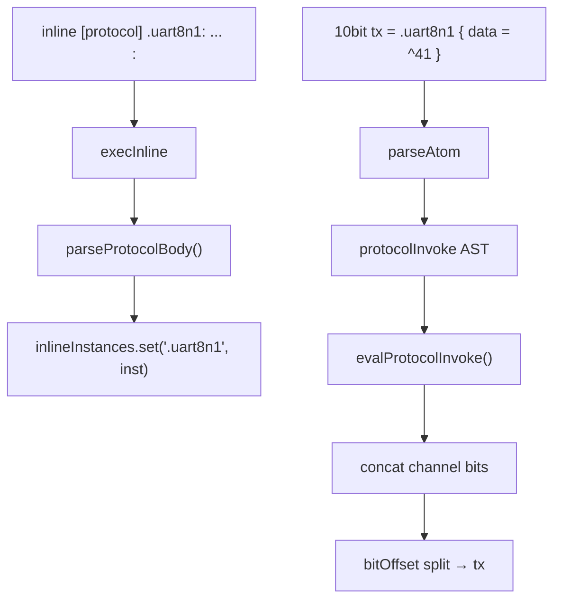

# Plan: inline [protocol] + doc() + teste + documentație

## Context

Implementarea urmează același model ca [`inline [asm]`](v0_3_2/doc/asm.md) și [`inline [lut]`](v0_3_2/doc/lut.md):

- **Declarație:** `inline [protocol] .name: ... :` → parsată în `parseInline()`, stocată în `Parser.inlines` la parse-time
- **Utilizare:** doar prin assignment (`10bit tx = .uart8n1 { data = ^41 }` sau multi-output `8bit mosi, 8bit sclk, 8bit cs = .spi { ... }`)
- **Fără UI panel** — logică pură, ca asm/lut inline

Multi-output split-ul există deja în interpreter prin `bitOffset` în loop-ul de assignment ([`interpreter.js` ~3573–3644](v0_3_2/core/interpreter.js)) — protocolul returnează un blob concatenat `<ch1><ch2>...` și assignment-ul îl împarte automat.



---

## 1. Modul nou: `core/protocol-assembler.js`

Fișier dedicat (ca [`asm-assembler.js`](v0_3_2/core/asm-assembler.js)), fără component registry / device UI.

### 1.1 `parseProtocolBody(bodyRaw)` — la declarație

Parsează corpul protocolului în structură:

```javascript
{
  attributes: { clockType: 'lowFirst' },  // opțional
  channels: [
    { name: 'tx', segments: [...], sourceLines: [...] },
    { name: 'sda', segments: [...] },
    ...
  ],
  parameters: { data: 8, address: 7, ... },  // declarați implicit la primul use
  channelOrder: ['tx'] | ['mosi','sclk','cs'],
  bodyRaw
}
```

**Reguli de parsare:**
- Linii `key: value` înainte de primul canal → **attributes** (`clockType: lowFirst` / `highFirst`)
- Linii `label:` (fără valoare pe aceeași linie) → început canal de output
- Sub un canal: **segmente** pe linii separate (concatenate în ordine)
- Comentarii `#` ignorate

**Tipuri de segmente (AST):**

| Segment | Sintaxă | Exemple |
|---------|---------|---------|
| `literal` | `0`, `1`, `0101`, `^AA`, `\42` | biți fixi |
| `param` | `data 8b` | declară + referă param |
| `reverse` | `reverse(data)` sau `reverse(data 8b)` | |
| `parityEven` / `parityOdd` | `parityEven(data)` | 1 bit |
| `clock` | `clock 8b` | folosește `clockType` |
| `repeat` | `repeat 0 8b` | constant bit repetat |

**Validări la parse:**
- `clockType` necunoscut → `Unknown protocol attribute` / `clockType must be 'lowFirst' or 'highFirst'`
- Parametru redeclarat cu lățime diferită → `Parameter 'data' was previously declared as 8b but is used here as 7b`
- `reverse()` / `parityEven()` fără parametru → erori conform spec

### 1.2 `parseProtocolInvokeRaw(raw)` — la invocare

Parsează interiorul `{ }`:

```text
data = ^41
address = ^42
rw = 0
```

→ `{ args: { data: rawText, ... } }` (text brut; expresiile sunt evaluate la runtime de interpreter, ca la asm args)

Alternativ: reutilizare tokenizer pentru `name = expr` pairs (similar [`parseCompInvoke`](v0_3_2/core/parser.js) dar multi-arg).

### 1.3 `generateProtocol(inst, args, options)` — la evaluare

- Pentru fiecare canal în `channelOrder`, evaluează segmentele → string de biți
- Concatenează canalele → blob total
- Returnează `{ blob, channelWidths: [10], totalWidth: 10 }`

**Implementare generatoare:**

| Generator | Logică |
|-----------|--------|
| `reverse(param)` | inversează biții valorii parametrului |
| `parityEven/Odd(param)` | `popcount(val) % 2` → `0` sau `1` |
| `clock Nb` | `lowFirst`: `01` repetat; `highFirst`: `10` repetat |
| `repeat bit Nb` | `bit.repeat(N)` |

**Validări la generare:**
- Param lipsă → `Unknown parameter 'data'`
- Total generat ≠ suma lățimilor din stânga → `Protocol output width mismatch` (verificat și în interpreter la assignment)

### 1.4 Formatare `doc()`

Funcții globale (pattern asm):

- `formatProtocolTypeDoc()` → template declarație + built-in generators + attributes (conform spec user)
- `formatProtocolInstanceDoc(alias, inst)` → header, `outputs:`, canale cu segmente, `parameters:`

---

## 2. Modificări parser — [`core/parser.js`](v0_3_2/core/parser.js)

### 2.1 `parseInline()` (~2491)

```javascript
if (kind !== 'asm' && kind !== 'lut' && kind !== 'protocol') {
  throw Error(`Unknown inline kind '${kind}' ... (supported: asm, lut, protocol)`);
}
```

### 2.2 Disambiguare `.name { }` în `atom()` (~2178)

La `{` după `.name`, consultă `this.inlines.get(compName)?.kind`:

- `'protocol'` → `parseProtocolInvokeRaw()` → AST `{ protocolInvoke: { kind:'protocolInvoke', raw, protocolRef } }`
- altfel (asm / necunoscut) → comportament actual `asmProgram`

**Notă:** declarația trebuie să apară **înainte** de utilizare în același script (același comportament ca asm — `Parser.inlines` se populează în timpul `parse()`).

### 2.3 `parseProtocolInvokeRaw(bracePos)`

Similar `parseAsmProgramRaw` — extrage textul din `{ }`, fără nesting complex (parametrii sunt expresii simple pe linii).

### 2.4 Eroare fără punct

Deja există la ~2301; mesajul rămâne: `Expected '.' before inline instance name (use '.uart8n1' not 'uart8n1')`.

---

## 3. Modificări interpreter — [`core/interpreter.js`](v0_3_2/core/interpreter.js)

### 3.1 `execInline()` (~398)

Ramură nouă `inline.kind === 'protocol'`:

```javascript
const proto = parseProtocolBody(inline.bodyRaw);
this.inlineInstances.set(inline.name, {
  kind: 'protocol',
  name: inline.name,
  ...proto,
  bodyRaw: inline.bodyRaw,
});
```

### 3.2 `evalProtocolInvoke(invoke, computeRefs)`

- Rezolvă instanța din `inlineInstances`
- Evaluează fiecare arg (`data = expr`) via `evalExpr` → string binar
- Apelează `generateProtocol(inst, argValues)`
- Returnează `{ value: blob, bitWidth: totalWidth, protocolBlob: true }` (flag similar `asmBlob` pentru erori de width)

### 3.3 `evalAtom()` (~1313)

```javascript
if (a.protocolInvoke) return this.evalProtocolInvokeAtom(a.protocolInvoke, computeRefs);
```

### 3.4 Width mismatch la assignment (~3650)

Extinde verificarea `asmBlob` cu `protocolBlob`:

```javascript
const hasBlob = exprResult.some(p => p.asmBlob || p.protocolBlob);
```

### 3.5 `getDocLines()` (~8592)

Adaugă ramuri `kindName === 'protocol'`:

```javascript
if (kindName === 'protocol' && typeof formatProtocolTypeDoc === 'function') {
  return formatProtocolTypeDoc();
}
if (kindName === 'protocol' && typeof formatProtocolInstanceDoc === 'function') {
  return formatProtocolInstanceDoc(alias || instName, inst);
}
```

---

## 4. Încărcare script

Adaugă `<script src="core/protocol-assembler.js"></script>` după `asm-assembler.js` în:

- [`script_editor_v0_3_2.html`](v0_3_2/script_editor_v0_3_2.html)
- [`run_tests.html`](v0_3_2/run_tests.html)
- [`_run_suite_node.js`](v0_3_2/_run_suite_node.js) (lista de fișiere)
- [`_compare_tests.js`](v0_3_2/_compare_tests.js)

---

## 5. Teste — [`test_suite_ported.js`](v0_3_2/test_suite_ported.js)

Grup nou `protocol`, ID-uri **914–935** (după ultimul 913 lut).

Strategie: **protocoale minimale dedicate** per built-in (izolat), apoi **protocoale compuse** (UART / SPI / I2C), apoi erori și `doc()`.

### Constante de test — built-in izolat

```javascript
// reverse — singurul segment
const INLINE_REV = `inline [protocol] .revtest:
  out:
    reverse(data 8b)
  :`;

// parityEven — 1 bit paritate
const INLINE_PAR_EVEN = `inline [protocol] .pareven:
  out:
    parityEven(data 8b)
  :`;

// parityOdd — 1 bit paritate
const INLINE_PAR_ODD = `inline [protocol] .parodd:
  out:
    parityOdd(data 8b)
  :`;

// clock + lowFirst
const INLINE_CLK_LOW = `inline [protocol] .clklow:
  clockType: lowFirst
  out:
    clock 8b
  :`;

// clock + highFirst
const INLINE_CLK_HIGH = `inline [protocol] .clkhigh:
  clockType: highFirst
  out:
    clock 8b
  :`;

// repeat 0 / repeat 1
const INLINE_REPEAT0 = `inline [protocol] .rep0:
  out:
    repeat 0 4b
  :`;

const INLINE_REPEAT1 = `inline [protocol] .rep1:
  out:
    repeat 1 4b
  :`;
```

### Constante de test — protocoale compuse

```javascript
const INLINE_UART8N1 = `inline [protocol] .uart8n1:
  tx:
    0
    reverse(data 8b)
    1
  :`;

const INLINE_UART8E1 = `inline [protocol] .uart8e1:
  tx:
    0
    reverse(data 8b)
    parityEven(data)
    1
  :`;

const INLINE_UART8O1 = `inline [protocol] .uart8o1:
  tx:
    0
    reverse(data 8b)
    parityOdd(data)
    1
  :`;

const INLINE_SPI = `inline [protocol] .spi:
  clockType: lowFirst
  mosi:
    data 8b
  sclk:
    clock 8b
  cs:
    repeat 0 8b
  :`;

const INLINE_I2C = `inline [protocol] .i2c:
  clockType: lowFirst
  sda:
    0
    address 7b
    rw 1b
    ack1 1b
    data 8b
    ack2 1b
    1
  scl:
    clock 20b
  :`;
```

### Cazuri de test

#### Parse + built-in izolat

| ID | Protocol | Test | Așteptat |
|----|----------|------|----------|
| 914 | (generic) | Parse declarație — canale, parametri, `clockType` attribute | structură AST corectă |
| 915 | `.revtest` | `8bit out = .revtest { data = 01000001 }` | `10000010` (reverse LSB-first) |
| 916 | `.pareven` | `1bit p = .pareven { data = 01100110 }` — 4 biți setați (par) | `0` |
| 917 | `.pareven` | `1bit p = .pareven { data = 01100111 }` — 5 biți setați (impar) | `1` |
| 918 | `.parodd` | `1bit p = .parodd { data = 01100110 }` — par → odd parity | `1` |
| 919 | `.parodd` | `1bit p = .parodd { data = 01100111 }` — impar → odd parity | `0` |
| 920 | `.clklow` | `8bit out = .clklow { }` — `clockType: lowFirst` | `01010101` |
| 921 | `.clkhigh` | `8bit out = .clkhigh { }` — `clockType: highFirst` | `10101010` |
| 922 | `.rep0` | `4bit out = .rep0 { }` | `0000` |
| 923 | `.rep1` | `4bit out = .rep1 { }` | `1111` |

#### Integrare — protocoale reale

| ID | Protocol | Test | Așteptat |
|----|----------|------|----------|
| 924 | `.uart8n1` | `10bit tx = .uart8n1 { data = ^41 }` | `0` + reverse(`01000001`) + `1` = `0100000010` |
| 925 | `.uart8e1` | `11bit tx = .uart8e1 { data = ^41 }` — include `parityEven` | 11 biți (start + rev data + parity + stop) |
| 926 | `.uart8o1` | `11bit tx = .uart8o1 { data = ^41 }` — include `parityOdd` | paritate opusă față de 925 pentru același `data` |
| 927 | `.spi` | `8bit mosi, 8bit sclk, 8bit cs = .spi { data = ^A5 }` | mosi=`10100101`, sclk=`01010101` (lowFirst), cs=`00000000` |
| 928 | `.i2c` | `20bit sda, 20bit scl = .i2c { address=^42 rw=0 ack1=0 data=^55 ack2=0 }` | sda concatenat + scl `clock 20b` lowFirst |

#### Erori

| ID | Test |
|----|------|
| 929 | Parametru width mismatch la declarație (`data 8b` apoi `reverse(data 7b)`) |
| 930 | Parametru lipsă la invocare (`Unknown parameter 'data'`) |
| 931 | Output width mismatch la assignment (stânga ≠ total generat) |
| 932 | `uart8n1 { }` fără punct → parse error |

#### doc()

| ID | Test |
|----|------|
| 933 | `doc(inline.protocol)` — template cu built-ins + attributes |
| 934 | `doc(.uart8n1)` — outputs, canale, parameters |
| 935 | `doc(inline)` listează `.uart8n1 (inline [protocol])` + kind `inline.protocol` |

Rulează suite: `node _run_suite_node.js` sau browser `run_tests.html`.

---

## 6. Documentație în engleză

### 6.1 Fișier nou [`doc/protocol.md`](v0_3_2/doc/protocol.md)

Conținutul furnizat de user (ajustat ușor pentru consistență cu asm.md/lut.md):

- secțiuni: naming, declare vs use, structure, channels, attributes, segments, parameters, built-ins, runnable examples (UART/SPI/I2C), `doc()`, errors, vs ASM
- elimină referința la standalone `.name { }` (doar assignment în v1)
- bloc `doc()` cu exemplu `logts-play` ca în asm.md

### 6.2 Actualizări cross-reference

| Fișier | Modificare |
|--------|------------|
| [`doc/doc-function.md`](v0_3_2/doc/doc-function.md) | Adaugă `inline.protocol` în tabelele `doc(inline)` / `doc(inline.kind)` |
| [`doc/components.md`](v0_3_2/doc/components.md) | Mențiune `inline [protocol]` în secțiunea Storage |
| [`doc/future-component-ideas.md`](v0_3_2/doc/future-component-ideas.md) | Actualizează linia „inline: asm, lut” → „asm, lut, protocol” |

### 6.3 Regenerare bundle

```bash
node _gen_doc_data.js
```

---

## 7. Fișiere atinse — rezumat

| Fișier | Acțiune |
|--------|---------|
| `core/protocol-assembler.js` | **NOU** — parse, generate, doc formatters |
| `core/parser.js` | kind protocol, protocolInvoke AST |
| `core/interpreter.js` | execInline, eval, doc, width check |
| `doc/protocol.md` | **NOU** |
| `doc/doc-function.md`, `doc/components.md`, `doc/future-component-ideas.md` | update |
| `test_suite_ported.js` | teste 914–935 (built-ins izolate + UART/SPI/I2C + erori + doc) |
| `script_editor_v0_3_2.html`, `run_tests.html`, `_run_suite_node.js`, `_compare_tests.js` | load script |
| `ui/doc-data.js` | regenerat |

**În afara scope v1:** standalone `.name { }` statement, `comp [mem]` init cu protocol, panel UI.

---

## 8. Ordine de implementare recomandată

1. `protocol-assembler.js` — parse body + generate + unit logic pură
2. Parser — kind + protocolInvoke
3. Interpreter — execInline + eval + width
4. Teste built-in izolate (914–923): reverse, parityEven, parityOdd, clock low/high, repeat
5. Teste integrare UART/SPI/I2C (924–928) + erori (929–932)
6. doc formatters + getDocLines + teste doc (933–935)
7. Documentație + `_gen_doc_data.js`
8. Rulare suite completă
