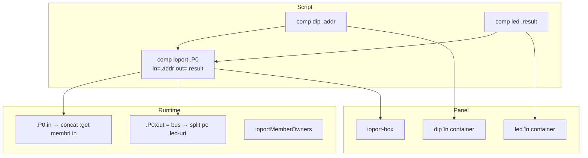

# Plan: componenta `comp [ioport]`

## Obiectiv

Abstracție logică de **port I/O** pentru lab-uri didactice: grupează componente `dip` (intrări) și `led` (ieșiri) sub un singur nume, cu agregare automată pe `:in` / `:out`.

**Nu** modelează GPIO hardware real (direction register, tristate, pull-up/down). Este un **wrapper de grupare + denumire** peste dip/led existente — înlocuiește ideea C3 „GPIO port” din [`future-component-ideas.md`](v0_3_2/doc/future-component-ideas.md).

---

## Decizii confirmate

| Subiect | Decizie |
|---------|---------|
| Membri `in` | Doar `comp [dip]` (v1) |
| Membri `out` | Doar `comp [led]` (v1) |
| Stocare | IOPORT nu stochează valori; citește/scrie prin membri |
| Sintaxă legare | `in = .addr`, `out = .led` în corpul `comp [ioport]` |
| Ordine declarație | Membrii dip/led **înainte** de blocul ioport |
| Ownership | Un dip/led → maxim un ioport |
| UI | Container panel obligatoriu — reparent `dip-wrapper` / `led-wrapper` |
| Debug | `show`, `peek`, `probe` pe `:in` și `:out` |
| Doc instanță | `doc(.P0)` → hartă biți via `formatInstanceDoc` |
| Teste | IDs **1157–1167**, grup `ioport` |

---

## Arhitectură



### Mapare biți

Ordinea din corpul ioport (declarație):

```text
in  = .addr   # 16 bit → poziții 0–15
in  = .data   #  8 bit → poziții 16–23

out = .result #  8 bit → poziții 0–7
out = .flags  #  4 bit → poziții 8–11
```

---

## Implementare (livrat)

### 1. Parser — [`parser.js`](v0_3_2/core/parser.js)

- `IoportComponent.getSpecialParseAttributes()` → `{ bindingAttrs: ['in', 'out'] }`
- După `ID` atribut, dacă urmează `=` (nu `:`): parsează `.component` → `attributes.inMembers[]` / `outMembers[]`

### 2. Componentă — [`ioport.js`](v0_3_2/core/components/ioport.js)

| Hook | Comportament |
|------|--------------|
| `createDevice` | Container panel + `_buildMaps` + `_mountMembers`; `earlyReturn` cu `compInfo` |
| `evalGetProperty('in')` | Concatenează `:get` de la fiecare dip |
| `evalGetProperty('out')` | Read-back concatenat din ref/get led-uri |
| `handleImmediateAssignment('out')` | Split bus → assign pe fiecare led |
| `applyProperties` | Re-eval `pending.out` la propagare (loopback) |
| `getForbidDirectAssign` | Interzice `.P0 = bus` — doar `.P0:out =` |
| `formatInstanceDoc` | Hartă biți pentru `doc(.P0)` |

### 3. Interpreter — [`interpreter.js`](v0_3_2/core/interpreter.js)

- `ioportMemberOwners: Map<memberName, portName>`
- `_registerIoportMember` / `_notifyIoportMemberChange` — la schimbare dip, re-evaluează portul părinte
- `_refreshIoportWireDependents` — actualizează fire `Nwire x = .P0:in` pe **Wave** (unde `updateComponentConnections` sare wire-urile)

### 4. UI — [`renderers.js`](v0_3_2/devices/renderers.js)

- `addIoportContainer({ id, label, nl })`
- `mountIoportMember(containerId, memberName, kind)` — reparent DOM
- CSS: `.ioport-wrapper`, `.ioport-box`, `.ioport-member-row` în [`script_editor_v0_3_2.html`](v0_3_2/script_editor_v0_3_2.html)

### 5. Înregistrare

- [`index.js`](v0_3_2/core/components/index.js), [`run_tests.html`](v0_3_2/run_tests.html), [`script_editor_v0_3_2.html`](v0_3_2/script_editor_v0_3_2.html), [`_run_suite_node.js`](v0_3_2/_run_suite_node.js)

---

## Debug — show / peek / probe

- `:in` / `:out` în `getSupportedProperties` + `getRedirectProperties`
- Probe: `componentComputed` (fără `ref` propriu) → `_readComputedComponentProbeValue` + `_emitComputedComponentProbes`
- La schimbare membru dip: `_notifyIoportMemberChange` → probe + pending `out` re-eval (loopback)

---

## Teste — [`test_suite_ported.js`](v0_3_2/test_suite_ported.js)

| ID | Titlu |
|----|-------|
| 1157 | parse in/out bindings |
| 1158 | input aggregation 16+8=24 |
| 1159 | output split 8+4=12 |
| 1160 | loopback wave |
| 1161 | ownership conflict |
| 1162 | portA → portB |
| 1163 | doc(comp.ioport) |
| 1164 | doc(.P0) bit map |
| 1165 | show peek probe :in |
| 1166 | show peek probe :out |
| 1167 | propagare dip → wire via :in wave |

Registry: teste 200/201/203 actualizate pentru `ioport`.

Regenerare: `node _gen_manifest.js`

---

## Documentație — [`ioport.md`](v0_3_2/doc/ioport.md)

- Index: [`doc-index.json`](v0_3_2/doc/doc-index.json) secțiunea Interactive inputs
- Catalog: [`components.md`](v0_3_2/doc/components.md)
- **9 exemple `logts-play`** (Load / Load & Run în doc viewer):
  - input aggregation, output aggregation
  - debug :in, :in wave, :out
  - doc(.P0), loopback, loopback wave, portA→portB

Regenerare: `node _gen_doc_data.js`

---

## Sintaxă utilizare

```logts
comp [dip] .sw:
  length: 8
  visual: 1
  :

comp [led] .led:
  length: 8
  :

comp [ioport] .P0:
  in  = .sw
  out = .led
  :

.P0:out = .P0:in
```

Echivalent pedagogic fără ioport: `.portA` = dip, `.portB` = led separate; ioport = un nume + widget + bus agregat.

---

## Legături

- [`dip.md`](v0_3_2/doc/dip.md) · [`led.md`](v0_3_2/doc/led.md) · [`debug.md`](v0_3_2/doc/debug.md)
- [`future-component-ideas.md`](v0_3_2/doc/future-component-ideas.md) C3 → link la ioport.md
