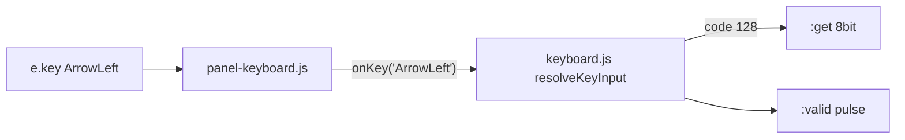

# Plan: taste săgeți + Delete pe keyboard

## Clarificare model (înțelegerea ta vs realitatea browser)

**Nu e chiar așa cum descrii.** Modelul „caracter alfanumeric + al doilea byte cu cod 0” vine din **DOS/BIOS** (taste extinse: `0x00` + scan code) sau din **fluxuri UART/VT** (secvențe multi-byte `ESC [ A`).

În **LogTscript azi**, stratul browser nu expune asta:

- [`panel-keyboard.js`](v0_3_2/devices/panel-keyboard.js) folosește `e.key` (`"ArrowLeft"`, `"Delete"`, `"Backspace"`).
- Săgețile sunt **ignorate explicit** (linia 213: `key.startsWith('Arrow')` → `return`).
- Backspace/Enter funcționează ca **nume de tastă** mapate la un singur byte pe `:get` (8 și 10), nu ca pereche de caractere.

Deci **nu avem nevoie de `:get2`** pentru editorul din browser — alegem noi encoding-ul la granița panel → simulare.



---

## Recomandare: varianta A — coduri rezervate pe `:get`

**De ce nu `:special` / `:isArrow` / `:get2`:**

| Opțiune | Pro | Contra |
|---------|-----|--------|
| **A) coduri pe `:get`** | Identic cu BS/LF; un singur fir `code = .kbd`; `EQ` + `MUX` ca în [test 1653](v0_3_2/test_suite.js); `codesAccepted` LUT whitelist | Doc trebuie să spună că `:get` nu e mereu ASCII printabil |
| B) `:special` + enum | Separă clar ASCII vs special | 2 semnale de citit; `get` ambiguu când `special=1` |
| C) pout-uri booleene | Foarte explicit | 5+ fire noi; scripturi verbose |
| D) `:get2` | Emulează UART byte-cu-byte | Overkill; nu reflectă DOM-ul browser |

**Varianta A** e cea mai aliniată cu [`allowBackspace`](v0_3_2/core/components/keyboard.js) și mini-shell-ul terminal din [`terminal.md`](v0_3_2/doc/terminal.md).

---

## Tabel coduri propus (fără coliziuni)

Zona **128–132** (hex `^80`–`^84`): în afara ASCII printabil (32–126) și distinctă de controlerele deja folosite (BS=8, LF=10).

| Tastă browser | Atribut | `:get` dec | `:get` hex | Bin (8 bit) |
|---------------|---------|------------|------------|-------------|
| `ArrowLeft` | `allowArrows` | 128 | `^80` | `10000000` |
| `ArrowRight` | `allowArrows` | 129 | `^81` | `10000001` |
| `ArrowUp` | `allowArrows` | 130 | `^82` | `10000010` |
| `ArrowDown` | `allowArrows` | 131 | `^83` | `10000011` |
| `Delete` (forward) | `allowDelete` | 132 | `^84` | `10000100` |
| `Backspace` | `allowBackspace` | 8 | `^08` | `00001000` (existent) |
| `Enter` | `allowEnter` | 10 | `^0A` | `00001010` (existent) |

**De ce nu 127 pentru Delete:** 127 e ASCII DEL; pe tastaturi „Delete” în browser e *forward delete*, nu același lucru semantic — evităm confuzia folosind 132.

**De ce e sigur:**
- Litere/cifre rămân 48–57, 65–90 etc. — `EQ(code, ^80)` nu se declanșează la tastare normală.
- `codesAccepted` (LUT depth 1): poți include `^80`–`^84` explicit, ca la `^08` pentru BS.
- `onlyDigits`: săgețile rămân blocate fără `allowArrows` (ca BS fără `allowBackspace`).

Documentăm tabelul în [`keyboard.md`](v0_3_2/doc/keyboard.md) ca **„extended keyboard codes”** (nu „ASCII printabil”).

---

## Integrare terminal (scopul tău)

Extindere mini-shell (pattern [1653](v0_3_2/test_suite.js)):

```logts
comp [keyboard] .kbd:
  allowBackspace
  allowArrows
  allowDelete
  on: 1
  :

8wire code = .kbd
1wire isBS  = EQ(code, ^08)
1wire isLF  = EQ(code, ^0A)
1wire isDel = EQ(code, ^84)
1wire isL   = EQ(code, ^80)
1wire isR   = EQ(code, ^81)
1wire isU   = EQ(code, ^82)
1wire isD   = EQ(code, ^83)

.term:{
  backDelete  = MUX(isBS, 0, \1)
  frontDelete = MUX(isDel, 0, \1)
  moveCursor  = MUX(isL, MUX(isR, MUX(isU, MUX(isD, 0, \4), \3), \2), \1)
  append      = MUX(OR(isBS + isLF + isDel + isL + isR + isU + isD), .kbd, 00000000)
  newline     = isLF
  set         = .kbd:valid
}
```

`MUX(sel, dataFor0, dataFor1)`: `sel=0` → primul operand, `sel=1` → al doilea.

---

## Modificări fișiere

### 1. Core — [`keyboard.js`](v0_3_2/core/components/keyboard.js)
- Constante `KEY_*` (128–132) + map `ArrowLeft`/`Delete`/…
- `resolveKeyInput` / `normalizeKeyToAscii`: taste noi când `allowArrows` / `allowDelete`
- `filterState`: `allowArrows`, `allowDelete`
- `getDef()`: atribute + doc pout `get` (8-bit key code, printable sau extended)
- `createDevice` / `addKeyboard`: propagă flag-urile

### 2. Panel — [`panel-keyboard.js`](v0_3_2/devices/panel-keyboard.js)
- Constructor + `addKeyboard`: `allowArrows`, `allowDelete`
- `_onInputKeyDown`: în loc de `return` pe `Arrow*`, forward la `onKey('ArrowLeft', …)` dacă flag activ
- `Delete`: similar `allowDelete` (distinct de Backspace)
- `preventDefault` când tasta e acceptată (ca BS)

### 3. Parser — [`parser.js`](v0_3_2/core/parser.js)
- Flag-uri `allowArrows`, `allowDelete` în `attributesWithNoValues` (ca `allowBackspace`)

### 4. Teste — [`test_suite.js`](v0_3_2/test_suite.js)
- Parser: atribute noi
- `triggerKeyboardKey`: `ArrowLeft` → `^80`, `Delete` → `^84`, reject fără flag
- `codesAccepted`: săgeți whitelist
- Terminal wave: shell cu săgeți + `moveCursor` + `frontDelete` (test nou ~1656+)
- Nu atinge logica DEC din parser (rămâne: `\2` / `10` în script, `2` în atribute comp)

### 5. Doc
- [`keyboard.md`](v0_3_2/doc/keyboard.md): tabel extended codes, `allowArrows` / `allowDelete`
- [`terminal.md`](v0_3_2/doc/terminal.md): exemplu line-editor complet cu săgeți
- `node _gen_doc_data.js` + `node _gen_manifest.js`

### 6. HTML
- [`run_tests.html`](v0_3_2/run_tests.html): deja include `keyboard.js` (verificat)

---

## Ce NU facem în această fază

- `:get2` / emulare secvențe ESC `[` byte-cu-byte (UART raw) — fază separată dacă vrei RX serial autentic
- `:special` 1-bit — redundant dacă folosim 128–132
- Home/End/PageUp/PageDown — ușor de adăugat ulterior în 133+ dacă e nevoie

---

## Ordine implementare

1. Constante + mapare în `keyboard.js` + flag-uri parser
2. Panel: forward săgeți/Delete
3. Teste unit keyboard (1660+)
4. Test integrare terminal + doc
5. Regen manifest/doc-data
