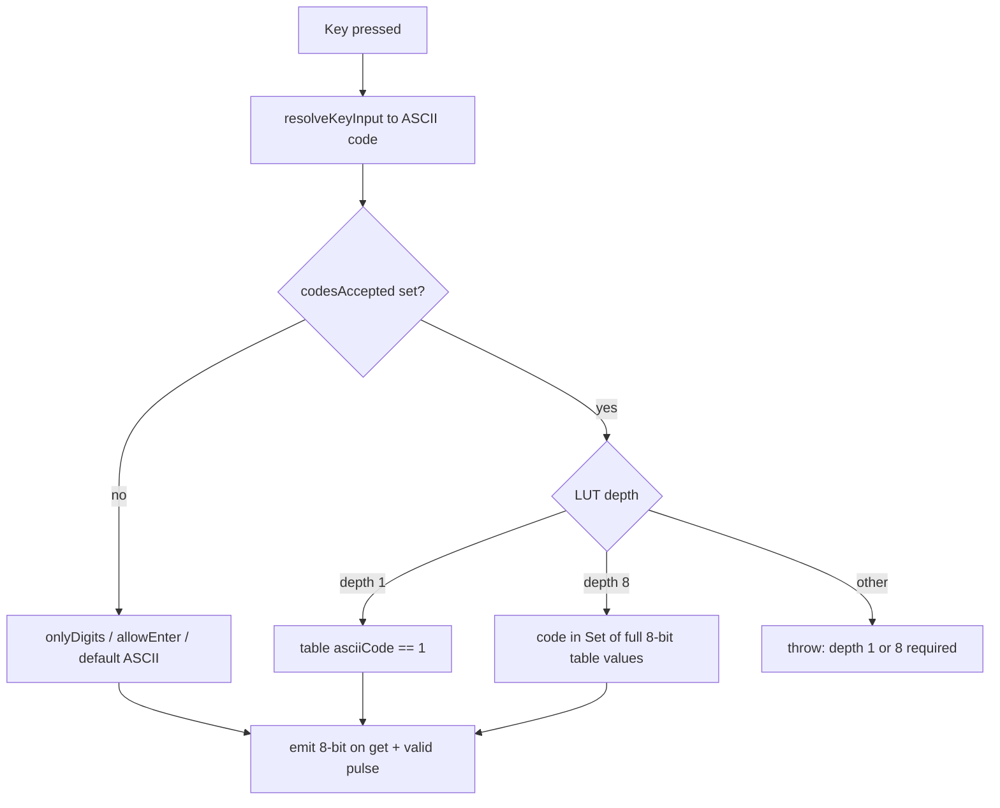

# Keyboard `codesAccepted` — whitelist via LUT

## Două moduri — doar `depth: 1` sau `depth: 8`

| Mod LUT | `depth` | Semantica | Exemplu |
|---------|---------|-----------|---------|
| **bitmap** | **1** | **Adresa** = cod ASCII (0…255); valoare `1` = permis | `length: 256`, `fillwith: 0`, `data { ^30-^39: 1, ^0a: 1 }` |
| **values** | **8** | Fiecare **valoare** din tabel = un cod ASCII permis (8 biți întregi) | `length: 10`, `data { 0: ^30, 1: ^31, … }` |

### Reguli stricte pe `depth`

- **Permis:** `depth === 1` sau `depth === 8` — nimic altceva.
- **Eroare la elaborare** dacă LUT-ul legat are alt `depth` (ex. 4, 16, 9):

  `codesAccepted requires lut with depth 1 or 8`

- **Fără manipulare de biți** pe valorile LUT: nu trunchiem, nu luăm slice `.4/4`, nu comparăm doar LSB. La `depth: 8`, fiecare intrare din `lutTable` e comparată integral cu codul tastei (8-bit ASCII).
- `depth > 8` — aceeași eroare (nu are sens pentru whitelist de caractere).



## Sintaxă (ca ALU `lut = .ref`)

Parser-ul deja suportă `bindingAttrs` → `attrNameMembers` ([parser.js](v0_3_2/core/parser.js) ~1869–1878, model [alu.js](v0_3_2/core/components/alu.js)).

```logts
comp [lut] .lutKeyboardCodes:
  depth: 1
  length: 256
  fillwith: 0
  = data {
    ^30 - ^39: 1
    ^0a: 1
  }
  :

comp [keyboard] .kbd:
  label: 'Console'
  codesAccepted = .lutKeyboardCodes
  allowEnter
  on: 1
  :
```

Notă: sintaxa este **`codesAccepted = .lut`** (cu `=`), nu `:` — la fel ca `lut = .aluFn` în ALU și `in = .addr` în ioport.

## Interacțiune cu `onlyDigits` / `allowEnter`

| Config | Comportament propus |
|--------|---------------------|
| doar `onlyDigits` | ca acum (filtru built-in 0–9) |
| doar `codesAccepted` | **doar LUT** decide (inclusiv Enter — trebuie `^0a: 1` sau în listă) |
| `codesAccepted` + `onlyDigits` | **LUT are prioritate**; `onlyDigits` rămâne doar pentru hint UI mobil (`inputmode=numeric`) dacă e setat |
| `codesAccepted` + `allowEnter` | Enter permis dacă e în LUT; `allowEnter` nu adaugă automat LF dacă LUT e activ (whitelist strict) |

## Implementare

### 1. Parser + definiție componentă — [keyboard.js](v0_3_2/core/components/keyboard.js)

- `getSpecialParseAttributes()` → `{ bindingAttrs: ['codesAccepted'] }`
- `getDef()`: adaugă `{ name: 'codesAccepted', value: '.component (lut)' }`
- `createDevice`:
  - citește `attributes.codesAcceptedMembers` (primul ref, ca ALU `_resolveLutId`)
  - validează că ținta e `comp [lut]` cu `lutTable` / `deviceIds`
  - **validează `depth === 1 || depth === 8`** — altfel throw `codesAccepted requires lut with depth 1 or 8`
  - la init:
    - **bitmap (`depth 1`):** lookup `lutTable[asciiCode] === '1'`
    - **values (`depth 8`):** `Set` din valorile `lutTable` (excl. `fillwith`), fiecare valoare = 8 biți ASCII întregi
  - stochează pe `compInfo`: `codesAcceptedLut`, `codesAcceptedMode` (`bitmap` | `values`), `allowedCodes` (Set, doar pentru mode values)

### 2. Filtrare la `onKey` — [keyboard.js](v0_3_2/core/components/keyboard.js)

1. **Normalizează** tasta la cod ASCII 8-bit
2. **`isCodeAllowed(code)`**:
   - fără LUT: logica actuală (`onlyDigits`, `allowEnter`, ASCII liber)
   - bitmap: `lutTable[code] === '1'`
   - values: `allowedSet.has(codeToBinary(code, 8))` — comparație pe șir binar 8-bit complet, fără slice

### 3. Validare la elaborare

- `codesAccepted = .x` unde `.x` nu e `comp [lut]` → eroare
- `depth` nu e 1 sau 8 → `codesAccepted requires lut with depth 1 or 8`
- bitmap cu `length < 256` — adrese ≥ length respinse implicit (fillwith / slot lipsă)

### 4. UI mobil — [panel-keyboard.js](v0_3_2/devices/panel-keyboard.js)

- `onlyDigits` → `inputmode=numeric` (neschimbat)

### 5. Teste — [test_suite.js](v0_3_2/test_suite.js)

| ID | Scenariu |
|----|----------|
| nou | Parser: `codesAccepted = .lut` → `codesAcceptedMembers` |
| nou | Bitmap depth 1: `^30-^39: 1` — acceptă `5`, respinge `A` |
| nou | Values depth 8: tabel cu `^30`, `^31` — acceptă `0`,`1`, respinge `2` |
| nou | **Eroare:** LUT `depth: 4` + `codesAccepted` → mesaj `depth 1 or 8` |
| nou | **Eroare:** LUT `depth: 16` + `codesAccepted` → același mesaj |
| nou | Bitmap + Enter `^0a: 1` — LF acceptat |
| nou | Bitmap fără `^0a` + `allowEnter` — Enter respins |
| nou | `append = .kbd` + LUT cifre — terminal OK |
| actualizare 1607 | `doc(comp.keyboard)` include `codesAccepted` |

### 6. Documentație

- [keyboard.md](v0_3_2/doc/keyboard.md): secțiune `codesAccepted`, reguli depth 1/8, exemple complete
- Regenerare: `node _gen_doc_data.js`, `node _gen_manifest.js`

## Exemple documentate

### Bitmap (`depth: 1`) — consolă cifre + Enter

```logts
comp [lut] .allowed:
  depth: 1
  length: 256
  fillwith: 0
  = data {
    ^30 - ^39: 1
    ^0a: 1
  }
  :

comp [keyboard] .kbd:
  codesAccepted = .allowed
  allowEnter
  on: 1
  :

comp [terminal] .term:
  rows: 10
  columns: 40
  on: 1
  :

.term:{
  append = .kbd
  set = .kbd:valid
}
```

### Values (`depth: 8`) — listă explicită de coduri permise

Fiecare valoare din LUT e un byte ASCII complet (8 biți). Slot-urile ne-mapate rămân `fillwith` și nu intră în whitelist.

```logts
comp [lut] .digitKeys:
  depth: 8
  length: 10
  fillwith: 00000000
  = data {
    0: ^30
    1: ^31
    2: ^32
    3: ^33
    4: ^34
    5: ^35
    6: ^36
    7: ^37
    8: ^38
    9: ^39
  }
  :

comp [keyboard] .kbd:
  label: 'Digits'
  codesAccepted = .digitKeys
  onlyDigits
  on: 1
  :

comp [queue] .q:
  width: 4
  length: 8
  on: 1
  :

.q:{
  push = .kbd.4/4
  set = .kbd:valid
}
```

Tasta `5` → `:get` = `00110101`; `.kbd.4/4` = `0101` pentru queue width 4.

### Values (`depth: 8`) — subset hex (A–F + cifre)

```logts
comp [lut] .hexKeys:
  depth: 8
  length: 16
  fillwith: 00000000
  = data {
    0: ^30
    1: ^31
    2: ^32
    3: ^33
    4: ^34
    5: ^35
    6: ^36
    7: ^37
    8: ^38
    9: ^39
    10: ^41
    11: ^42
    12: ^43
    13: ^44
    14: ^45
    15: ^46
  }
  :

comp [keyboard] .kbd:
  codesAccepted = .hexKeys
  on: 1
  :
```

## Fișiere atinse

- [v0_3_2/core/components/keyboard.js](v0_3_2/core/components/keyboard.js)
- [v0_3_2/doc/keyboard.md](v0_3_2/doc/keyboard.md) + manifest/doc-data
- [v0_3_2/test_suite.js](v0_3_2/test_suite.js)

Nu atingem engine-ul LUT — doar citim `lutTable` deja construit la elaborare.
