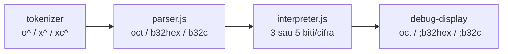
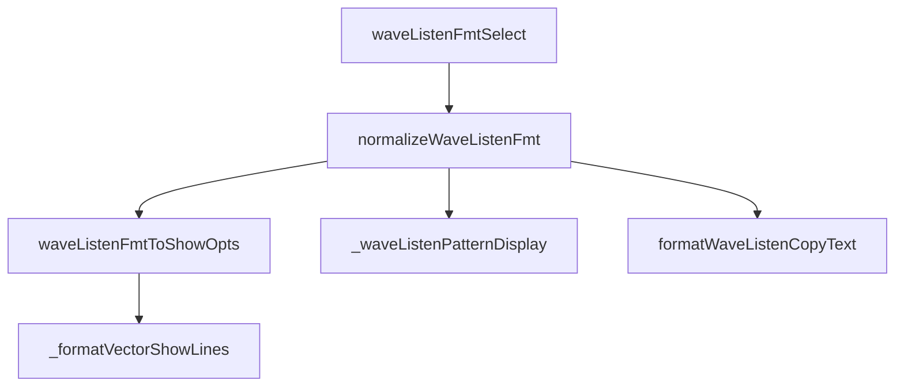

# Plan: literale `o^`, `x^`, `xc^` (v1)

**Status:** implementat (2026-07-10). Teste: `pattern-literals` 2261–2267, `wave-debug` 2268.

## Decizii confirmate v1

| Literal | Bază | Biți/cifră | Alfabet | Tag show |
|---------|------|------------|---------|----------|
| `o^` | oct | 3 | `01234567` | `;oct` |
| `x^` | base32hex (RFC 4648 §7) | 5 | `0123456789ABCDEFGHIJKLMNOPQRSTUV` | `;b32hex` |
| `xc^` | Crockford | 5 | `0123456789ABCDEFGHJKMNPQRSTVWXYZ` | `;b32c` |

- **Unsigned only** în v1 (fără `o^-…`, `x^-…`, `xc^-…`)
- **z-base-32 exclus** din v1
- **RFC §6 base32** clasic exclus

**Exemplu:** `6wire value = o^12` → `001` + `010` = `001010`

---

## Referință alfabete (context)

### base32hex — `x^`
- RFC 4648 §7, denumire oficială **base32hex**
- Proprietate: sortare lexicografică = sortare bitwise
- Continuare naturală a hex `^` (nibble 0–F → extins la A–V)

### Crockford — `xc^`
- Exclude I, L, O, U (lizibilitate umană)
- Același 5 biți/cifră, mapping diferit față de `x^`

### Exclus din v1
- z-base-32 (`z^`, alfabet permutat lowercase)
- RFC §6 base32 MIME (`A-Z` + `2-7`)

---

## Simboluri și tokenizer

### Ordine verificare prefixe

```
xc^  →  B32C      (primul — înainte de x^)
x^   →  B32HEX
o^   →  OCT
^    →  HEX       (existent)
```

`x`, `o`, `xc` ca identificatori rămân valide când nu sunt urmate de `^`.

### Notație scurtă (backticks)

- `[o^12]`
- `[x^AB]`
- `[xc^J0]`

---

## Model implementare (hex `^` ca șablon)



Fișiere cheie:
- [v0_3_2/core/tokenizer.js](v0_3_2/core/tokenizer.js)
- [v0_3_2/core/parser.js](v0_3_2/core/parser.js)
- [v0_3_2/core/wire-literals.js](v0_3_2/core/wire-literals.js)
- [v0_3_2/core/interpreter.js](v0_3_2/core/interpreter.js)
- [v0_3_2/core/debug-display-format.js](v0_3_2/core/debug-display-format.js)
- [v0_3_2/ui/wave-listen-format.js](v0_3_2/ui/wave-listen-format.js)

---

## Specificație funcțională v1

### Literale unsigned (pattern de biți)

| Formă | Exemplu | Rezultat biți |
|-------|---------|---------------|
| `o^DIGITS` | `o^12` | `001010` |
| `x^DIGITS` | `x^A` | `01010` (A = index 10) |
| `xc^DIGITS` | `xc^10` | 5+5 biți conform alfabetului Crockford |

### Sufixe partajate (ca hex)

- **Bit range:** `o^77.0-5`, `x^AB.0/10`, `xc^J0.0/10`
- **Padding unsigned:** `o^1;6` → pad la 6 biți
- **Concatenare mixtă:** `o^12 + ^FF + x^A`

### Tag-uri debug (mutual exclusive în grupul format)

| Comandă | Tag | Output roundtrip |
|---------|-----|------------------|
| `show(w; oct)` | `;oct` | `o^12` |
| `show(w; b32hex)` | `;b32hex` | `x^AB` |
| `show(w; b32c)` | `;b32c` | `xc^AB` |
| `peek` / `probe` | idem | idem |

Comportament afișare (oglindă hex):
- **Wire plat:** string compact `o^…` / `x^…` / `xc^…`
- **Elemente vector/matrix:** per-chunk (3 biți → `o^d`, 5 biți → `x^c` / `xc^c`)

### În afara scope v1

- Signed: `o^-12;6`, `x^-AB;10`, `xc^-AB;10`
- z-base-32
- RFC §6 base32 clasic

---

## Wave Listen (wave trace) — integrare UI

Trace-ul wave = panoul **Wave Listen** (`wave-listen-panel.js` + `wave-listen-format.js`).



### Implementat

- Dropdown: `oct`, `b32hex`, `b32c` după `hex`
- `waveListenFmtToShowOpts` → `{ oct: true }` / `{ b32hex: true }` / `{ b32c: true }`
- `_waveListenPatternDisplay` → `formatDebugDisplayValue`
- Copy: literali fără spații (`o^…`, `x^…`, `xc^…`)
- Expand `[+]`: `wrapLiteralTokenLines`
- `waveListenFormatWidth`: 3 (`oct`), 5 (`b32hex`/`b32c`)

---

## Pași de implementare (finalizați)

1. `wire-literals.js` — conversii + roundtrip
2. `tokenizer.js` → `parser.js` → `interpreter.js`
3. `debug-display-format.js` + whitelist parser
4. `wave-listen-format.js`
5. Documentație: [wire-literals.md](v0_3_2/doc/wire-literals.md), [debug.md](v0_3_2/doc/debug.md)
6. Teste: 2261–2268 în [test_suite.js](v0_3_2/tests/test_suite.js)
