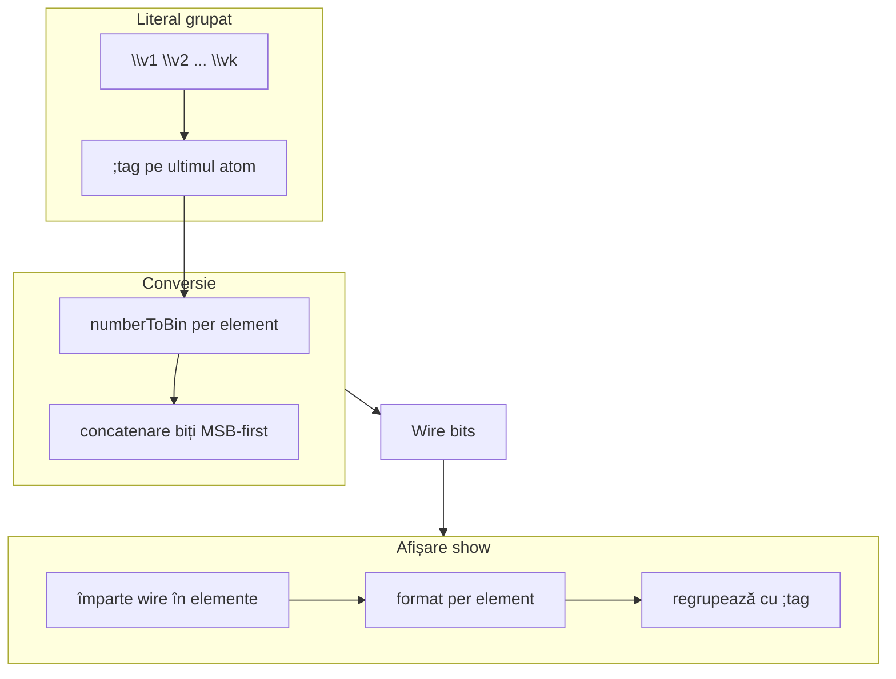

# Literali grupați și afișare unificată (Faze 1–2 revizuite)

Planul de referință: [`numeric_format_display_literals_nformat.plan.md`](numeric_format_display_literals_nformat.plan.md). Fazele 0, 3, 4, 5+ rămân neschimbate. **Această revizuire înlocuiește doar Faza 1 + Faza 2.**

## Verdict

**Da, direcția repară problema centrală:** header-ul vector/matrice nu mai trimite 32 biți la formatter q4p4 de 8 biți — fiecare element e formatat separat, apoi grupat. Input și output folosesc aceeași structură atomică.

---

## Model unificat: „grup literal”

Un **grup** = o secvență de atomi `\value` separate prin spații albe, cu **un singur sufix** pe ultimul atom care se aplică **retroactiv** întregii grupe.

```text
\v1 \v2 ... \vk ; <tag>
```

Cazul `k=1` subsumează literali scalari: `\5;8` = un grup cu un element.



---

## Tabel tag-uri sufix (literali + afișare)

| Sufix | Lățime element | Semnificație | Fracționar | Negativ | Note |
|-------|----------------|--------------|------------|---------|------|
| *(fără sufix, un singur `\N`)* | **minim necesar** | unsigned | nu | nu | `\2`→`10`, `\65`→`1000001` — comportament neschimbat |
| `;M` (M numeric) | M | **unsigned / padding** | nu | **nu** (`\-N;M` → eroare) | `\2 \23 \242;8` ≡ `\2 \23 \242;ascii` |
| `;sM` | M | **signed two's complement** | nu | da | înlocuiește `\-N;M` |
| `;qXpY` | X+Y | fixed-point QX.Y | da | da | ex. `;q4p4` (W=8), `;q8p8` (W=16) |
| `;bfX` | X | brain float | da | da | ex. `;bf16` |
| `;fpX` | X | IEEE float | da | da | ex. `;fp16` |
| `;ascii` | 8 | octet (mod 256) | nu | nu | echivalent `;8` pentru grupuri |

### Regula cheie

> **Sufixul de pe ultimul atom se aplică retroactiv tuturor elementelor din grup.** Fiecare `\N` devine un câmp de lățime fixă `elementW` determinată de tag; biții se concatenează în ordine.

### Separare signed vs unsigned

| Formă | Comportament |
|-------|--------------|
| `\12;8` | unsigned padding 8 biți |
| `\-3;s8` sau `\3;s8` | signed 8 biți |
| `\-3;8` | **Eroare** — folosește `;s8` pentru signed |
| `signed` (tag built-in) | **Neschimbat** — fără lățime specifică la ADD/SUM/show |

---

## Reguli C1–C7 (confirmate)

### C1 — Cardinalitate și sufix

| Input | Semnificație | Rezultat |
|-------|--------------|----------|
| `\N` (un atom) | unsigned, lățime nespecificată | compatibilitate totală cu codul existent |
| `\N \N` sau `\N \N ... \N` (fără sufix) | grup fără lățime | **Eroare**: „Missing width/format tag for grouped literal” |
| `\N \N;M` | unsigned, M biți/element | `\2 \23 \242;8` → fiecare pe 8 biți unsigned |
| `\N \N;sM` | signed, M biți/element | `\2 \-1 \5;s8` |
| `\N \N;q4p4` | q4p4, 8 biți/element | `\2 \-1.5 \0.5;q4p4` |
| `\N \N;ascii` | ascii, 8 biți/element | alias semantic al `;8` |

**Concatenare între grupuri/expresii:** `+` rămâne operatorul de concatenare wire (ex. `\1 \2;8 + ^0F`). Spațiile definesc elemente **în interiorul** unui grup, nu înlocuiesc `+`.

### C3 — Unsigned fără lățime la afișare

- Literal scalar `\N` rămâne cu lățime minimă (neschimbat).
- La afișare grupată unsigned fără tag explicit: grupare max **64 biți**/element (prag existent).
- Pentru roundtrip explicit: `\1 \2 \3 \4;64`.

### C4 — Afișare signed (adaptivă, fără lungime intrinsecă)

`signed` e **special**: nu are lungime fixă, deci displayul îi atribuie una dinamic. `;sM` produs la afișare **este** literal valid (`;s64`, `;s32` etc. se pot scrie și ca input).

Regula display pentru tag `signed`:

| Lățime wire | Afișare | Exemplu |
|-------------|---------|---------|
| ≤ 64 biți | un singur `\value;sW`, W = lățimea reală | `r = \33752329;s32` (wire 32bit) |
| > 64 biți, divizibil | chunk-uri de 64 → `;s64` | `\3 \324325 \-1233424 \33752329;s64 (256bit)` |
| > 64 biți, cu rest | chunk-uri de 64 `;s64` + rest (<64) ca `+ binar` | `\3 \324325 \-1233424 \33752329;s64 + 101 (259bit)` |

- Valori > 64 biți → **chunked** în grupuri de 64.
- Valori ≤ 64 biți → afișate pe lățimea reală (`;sW`), fiindcă signed nu are lungime.
- Restul (<64) după chunk-uri complete → `+ binar` (comportament rest existent).

**Distincție `signed` vs `sX` / alte formate:** `sX`, `q4p4`, `q8p8`, `fp16`, `bf16`, `ascii` au **lungime definită** — ce nu se împarte exact pe lățimea elementului → `+ rest binar/hex`. Doar `signed` (bare tag) e adaptiv.

### C5 — Roundtrip (de biți) uniform

`show(...; <tag>)` produce **literali valizi** → copy-paste reface **exact aceiași biți** pentru toate tag-urile, inclusiv signed:

```text
64wire a  = \33752329;s64            # valid — signed 64bit
128wire b = \-1 \33752329;s64        # valid — două grupuri de 64
8wire[4] v = \2 \-1 \5 \0;s8         # literal per-element
```

**Nuanță structură (signed):** re-parse-ul păstrează biții, dar **re-grupează** în chunk-uri de 64 (sau lățimea reală ≤64), NU în `elementWidth`-ul original al vectorului. Deci:
- roundtrip **de biți** = perfect (poți scrie exact ce afișează header-ul);
- structura vector (`elementWidth`) se poate schimba (ex. `8wire[4]` header → `\...;s64` re-init ca wire de 64).

Pentru păstrarea structurii per-element la signed, **celulele** `:i` afișează `\N;s{elementW}` (roundtrip per-element). La q4p4/q8p8/etc. header și celule coincid deja (elementul format = elementul wire).

Sufixul `(Nbit)` e informativ — ignorat la re-parsare.

### C6 — ASCII

`\65 \66;ascii` ≡ `"AB"` pe wire; afișare cu `;ascii`.

### C7 — Fracționar pe format greșit (mesaje specifice)

| Input | Mesaj eroare |
|-------|--------------|
| `\1.5;8` | `Missing floating point numeric format. The Numeric Width used is for unsigned 8bit` |
| `\1.5;s8` | `Missing floating point numeric format. The Numeric Width used is for signed 8bit` |
| `\1.5;ascii` | `Missing floating point numeric format. The Numeric Width used is for unsigned 8bit` |

(Lățimea `8` din mesaj reflectă lățimea efectivă a tag-ului — pentru `;s32` → „signed 32bit”, pentru `;16` → „unsigned 16bit”.)

---

## Afișare: header vs celulă

### Header (scalar, vector, rând matrice)

- **Întotdeauna grupat** cu `;tag` pe ultimul element + `(Nbit)` total.
- Exemple:

```text
w (8wire) = \1.5;q4p4
r = \2 \1.5 \0 \-1.5;q4p4 (32bit)
r = \33752329;s32 (32bit)                     # signed ≤64 → lățimea reală
r = \3 \324325 \-1233424 \33752329;s64 (256bit)
v = \65 \66;ascii (16bit)
```

#### Signed pe vector / matrice (R6 — confirmat)

| Nivel | Regulă |
|-------|--------|
| **Header** | Concatenează elementele MSB-first → chunk-uri de 64 (`;s64`); dacă wire ≤ 64 → `;sW` cu lățimea reală; rest (<64) → `+ binar` |
| **Celule** `:i` / `:i:j` | Per-element: `\N;s{elementW}` (sau hex/bin după regula `formatW` vs `elementWidth`) |

Exemplu vector `8wire[4]` (32 biți total, ≤ 64):

```text
v (32wire) = \33752329;s32 (32bit)           # header: wire întreg, lățime reală 32
:0 = \2;s8 (8bit)                             # celulă: roundtrip per-element
:1 = \-1;s8 (8bit)
```

### Celulă (`:i` / `:i:j`) — regula generală păstrată

Compară `formatW` (lățime intrinsecă tag) vs `elementWidth`:

| Relație | Afișare celulă | Exemplu signed |
|---------|----------------|----------------|
| `formatW == elementW` | `\N;tag` (roundtrip) | `:0 = \-3;s8 (8bit)` |
| `formatW > elementW` | `^hex` | `:0 = ^FA (4bit)` când elementW=4 |
| `formatW < elementW` | binar brut | `:0 = 10101101 (16bit)` |

Pentru tag `signed` la celulă: `formatW` = `elementWidth` → întotdeauna `\N;s{elementW}` când `elementWidth ≤ 64`; peste 64 biți → `^hex` (prag dec existent).

### Coexistență cu literali existenți

- `^FFAF`, `1011001` — **neschimbate**, literali separați (pattern biți direct).
- `\N` scalar fără sufix — **neschimbat**.
- `+` între expresii — **neschimbat**.

---

## Tag-uri parametrizate — scope pe faze

| Fază | Unde | Tag-uri |
|------|------|---------|
| **1–2** (acest plan) | Literali + afișare show/peek | `;sX`, `;qXpY`, `;bfX`, `;fpX`, `;ascii`, `;M` |
| **2.5** (plan părinte) | Built-in call tags + display tags | `ADD(a,b; s32)`, `SUM(v; q6p2)`, `show(w; fp32)` — vezi [numeric_format_display_literals_nformat.plan.md](numeric_format_display_literals_nformat.plan.md) § Faza 2.5 |
| **3+** | Status 4bit, NFORMAT | Formate parametrizate în conversii |

**Fazele 1–2:** implementăm `parseLiteralTag()` și `formatGroupedShow()` pentru întreaga familie parametrizată.

**Faza 2.5** (după 1–2, înainte de status 4bit): extindere `parseBuiltinCallTags()` + whitelist parser — reutilizează `parseLiteralTag`. Tag-ul bare `signed` (fără lungime) rămâne distinct de `sX`.

**Built-in-uri fixe** (`q4p4`, `q8p8`, `fp16`, `bf16`, `signed`) rămân valide în Faza 2.5 ca alias-uri.

---

## Fișiere de modificat

| Fișier | Schimbare |
|--------|-----------|
| [`tokenizer.js`](../v0_3_2/core/tokenizer.js) | Parsare grup: `\N` / `\N.N` / `\-N`, sufix `;M` / `;sM` / `;qXpY` / `;bfX` / `;fpX` / `;ascii`; respinge `\-N;M`; `\N` singular fără sufix = token existent |
| [`wire-literals.js`](../v0_3_2/core/wire-literals.js) | `groupedLiteralToBits(values[], tag)` — conversie per element + concat |
| [`parser.js`](../v0_3_2/core/parser.js) | AST `GroupedLiteral { values, tag }` |
| [`numeric-formats.js`](../v0_3_2/core/numeric-formats.js) | `parseLiteralTag`, `formatGroupedShow` (signed: chunk-uri `;s64`) |
| [`debug-display-format.js`](../v0_3_2/core/debug-display-format.js) | Delegare formatGroupedShow; regula celulă |
| [`interpreter.js`](../v0_3_2/core/interpreter.js) | Thread elementWidth; header grupat |
| [`wire-literals.md`](../v0_3_2/doc/wire-literals.md), [`debug.md`](../v0_3_2/doc/debug.md) | Sintaxă grupată, exemple — **fără secțiuni de migrare** |
| [`test_suite.js`](../v0_3_2/tests/test_suite.js) | Grup `grouped-literals-display`; actualizare teste/scripturi la noua sintaxă |

---

## Recomandări implementare

1. **`\-N;M` → eroare** cu mesaj acționabil (`Use \\-N;sM for signed, e.g. \\-3;s8`). Doc și teste reflectă direct noua sintaxă — **fără** secțiuni „breaking change” sau „migrare” în `doc/`.
2. **`;8` ≡ `;ascii`:** doar la **grupuri** cu sufix; scalar `\65;8` rămâne padding unsigned.
3. **Validare wire width:** `elementCount * elementW` = lățime wire la inițializare.
4. **Tokenizer lookahead:** după primul `\N`, dacă urmează spațiu + `\` sau `;`, mod grup.
5. **Signed display (adaptiv):** wire ≤64 → un `\value;sW` (lățime reală); wire >64 → segmente TC de 64 (`;s64`) + rest (<64) ca `+ binar`. Distinct de `sX`/formate fixe (rest → `+ binar/hex` mereu).

---

## Clarificări — toate confirmate

| # | Subiect | Decizie |
|---|---------|---------|
| R2 | `;s1` … `;s64` — limite | Validare 1≤M≤64 (sau max wire width) |
| R3 | `qXpY` cu X+Y ≠ 8/16/32 | Permis în literali; built-in rămâne fix |
| R4 | Grup cu un singur element + sufix | `\1.5;q4p4` valid |
| R5 | Spații multiple | Unul sau mai multe whitespace = separator |
| R6 | Signed display vector/matrici | **Header:** concatenare elemente → chunk-uri de 64 (`;s64`); wire ≤64 → `;sW` lățime reală; rest → `+ binar`. **Celule:** `\N;s{elementW}` roundtrip. **Roundtrip de biți: OK** (literali valizi); structura vector se re-grupează la 64 |
| R7 | `;s64` ca literal | Valid — `64wire a = \33752329;s64`, `128wire b = \-1 \33752329;s64`. `;sM` acceptă orice M (1≤M≤64) |

---

## Teste țintă

```logts-play
# Grup unsigned
8wire[4] v = \2 \23 \242 \1;8
show(v)

# Grup signed literal (per-element, roundtrip la celule)
8wire[4] v = \2 \-1 \5 \0;s8
show(v; signed)   # header 32bit ≤64: \...;s32; celule: :0 = \2;s8, :1 = \-1;s8, ...

# Grup q4p4 roundtrip
8wire[4] v = \2 \-1.5 \0.5 \1;q4p4
show(v; q4p4)

# Signed display: ≤64 → lățimea reală, >64 → chunk-uri s64
64wire r = ...
show(r; signed)   # \33752329;s64
256wire big = ...
show(big; signed) # \a \b \c \d;s64 (256bit)

# Roundtrip signed (biți identici)
64wire a  = \33752329;s64
128wire b = \-1 \33752329;s64

# Erori C7
# \1.5;8    → unsigned 8bit
# \1.5;s8   → signed 8bit
# \1.5;ascii → unsigned 8bit
```

Actualizare teste existente: 1907, 1920, 1925, 1946, 1992.

---

## Ordine implementare

1. `parseLiteralTag` + `formatGroupedShow` în `numeric-formats.js`
2. Tokenizer grup + respingere `\-N;M`
3. `wire-literals.js` conversie grup
4. Display header/celulă în `debug-display-format.js` + `interpreter.js`
5. Teste + doc + `_gen_doc_data.js`

După această fază: continuă cu **Faza 2.5** (tag-uri parametrizate pe built-in-uri), apoi **Faza 3** (status 4bit) din planul părinte.
