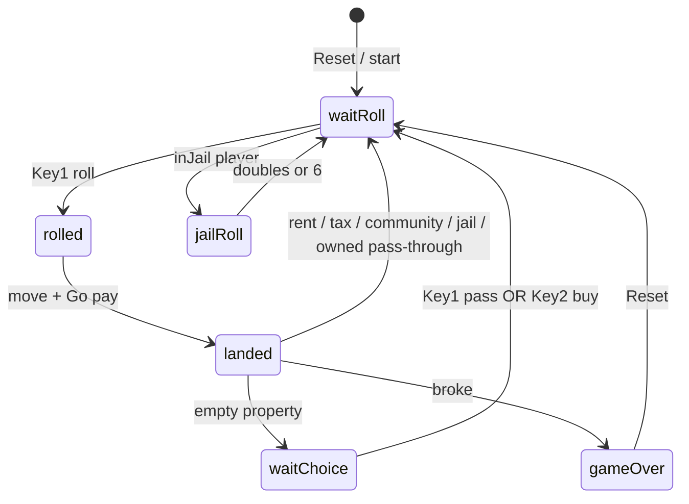
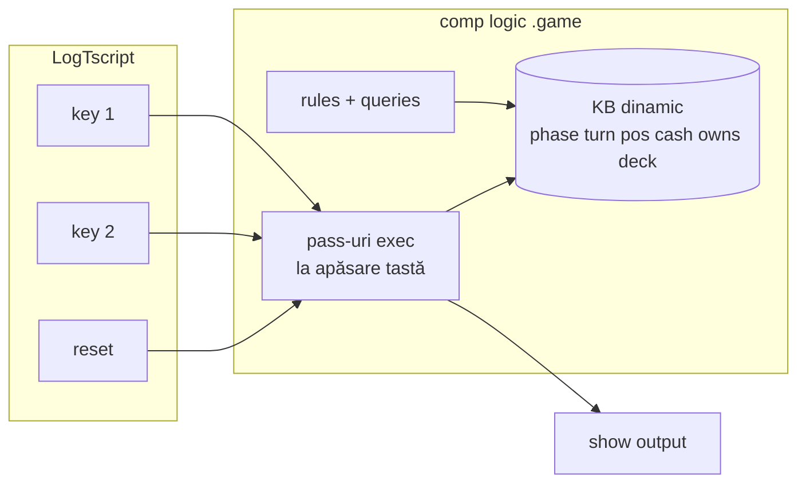

# Plan: Mini Monopoly interactiv (`logic_monopoly_interactiv`)

Document țintă: [mini-monopoly-interactive.md](../v0_3_2/doc/mini-monopoly-interactive.md)  
Tutorial static (referință): [mini-monopoly-logic.md](../v0_3_2/doc/mini-monopoly-logic.md)

---

## Obiectiv

Joc **Monopoly minimal**, **doi jucători** pe același ecran (hot-seat), controlat din **doc viewer** cu tastele **1**, **2**, **reset**. Mesajele apar în output prin **`show/N`** din logic.

**Principiu de arhitectură (simplu):**

| Strat | Rol |
|-------|-----|
| **LogTscript (UI)** | Doar **input**: ce tastă s-a apăsat (`key1`, `key2`, `reset`) — fire / legături minime |
| **Logic (KB + rules)** | **Starea jocului** (`phase`, `turn`, `playerPos`, `playerCash`, `owns`, deck, jail) + **reguli** + mesaje |
| **O componentă** | **`comp [logic] .game`** — toate pass-urile pe același nume de componentă |

Nu multe componente `gameKey1`, `gameRoll`, `gameLand`, … — un singur motor de joc.

---

## Cerințe funcționale

### Board

- **9 pătrate** (index 0…8), loop cu `mod 9`
- Pătrat **3** = Community Chest; **6** = Jail (vizită vs `inJail`)
- **Go (0)**: salariu la trecere / aterizare (configurabil, ~200)
- Proprietăți cu preț + chirie; chirie ≈ jumătate din preț (rotunjit)

### Jucători

- **p1**, **p2** — start **1500** cash, poziție **0** (Go)
- **`turn(P)`** — jucător activ
- Hot-seat: un singur device, schimb tur la final de acțiune (sau pass)

### Controale (doc viewer)

| Tastă | Label | Tip |
|-------|-------|-----|
| **1** | `1` | pulse (`type: 0`) |
| **2** | `2` | pulse |
| **reset** | `reset` | pulse |

### Comportament taste (după fază)

Vezi tabelul **Phase → Key 1 / Key 2** mai jos.

### Community Chest

- Deck **`communityDeck/1`**, shuffle la init (tutorial: seed fix pentru demo)
- Draw = prima carte, rotate la coadă
- Efecte: **`payTax`**, **`go200`**, **`goToJail`** (aliniat la tutorialul static)

### Jail

- Aterizare normală pe 6 = **just visiting**
- **`inJail(P)`** când e trimis (carte / regulă demo)
- Ieșire: **6 pe orice zar** sau **doubles** — apoi mutare normală

### Buy / pass

- La aterizare pe proprietate necumparată: **`waitChoice`** — meniu în output
- **Key 1** = pass · **Key 2** = buy (dacă cash suficient)

### Game over

- Cash **< 0** după plată → **`gameOver`**, mesaj broke + câștigător
- **Reset** → joc nou

### Non-cerințe (scope out / mai târziu)

- Save/load sesiune
- AI / rețea
- UI grafic board (doar text `show`)
- Verify automat complet al gameplay-ului (manual în viewer e OK la început)

---

## Automaton de faze



### Phase — ce face jocul — Key 1 — Key 2

| Phase | Ce se întâmplă | Key **1** | Key **2** |
|-------|----------------|-----------|-----------|
| **`waitRoll`** | Așteaptă zarurile jucătorului la rând | **Roll** — 2 zaruri, mutare, salariu Go dacă trece Go, apoi efect land | — (ignorat) |
| **`rolled`** | *(tranziție scurtă)* plan roll → aplică mutare | — (intern) | — |
| **`landed`** | Procesează pătratul: chirie, taxă, community, jail visit, sau ofertă buy | — (automat spre `waitChoice` sau `waitRoll`) | — |
| **`waitChoice`** | Proprietate cumparabilă, fără owner | **Pass** — refuză, schimbă turul | **Buy** — cumpără dacă legal + cash |
| **`jailRoll`** | Jucătorul e în **`inJail`**, nu se mută încă | **Roll** — zaruri; dacă 6 sau duble → iese din jail; altfel rămâne, turul se încheie | — |
| **`gameOver`** | Un jucător falit | — | — |
| **Reset** (orice fază) | Reinițializare KB: poziții, cash, deck, `turn(p1)`, `phase(waitRoll)` | — | — |

**Note pe faze:**

- **`waitRoll` + `inJail(P)`** → intrare în **`jailRoll`** în loc de mutare normală (până iese).
- După **rent / tax / community / pass-through** pe pătrat deja deținut → direct **`waitRoll`** (tur următor).
- **`landed` → `waitChoice`** doar când **`canBuy`** reușește.

---

## Arhitectură (nivel plan — fără detaliu exec)



**Idei de reținut (fără „cum” încă):**

- Starea persistă în **KB-ul componentei** între click-uri (sesiune doc viewer).
- **Query** = calcule, verificări legale, **`show`** — citire + mesaje.
- **Schimbare stare** (mutare, cash, tur, fază) = commit explicit între pași — nu prin query (limitare engine; detaliu tehnic separat, când implementăm).
- Mai multe **blocuri `.game:{`** pe **aceeași** componentă = pași la un click (roll → move → land), nu mai multe componente.

---

## Livrabile documentație

| Fișier | Conținut |
|--------|----------|
| `mini-monopoly-interactive.md` | Controale, board, cheat sheet mesaje, script `logts-play`, link la plan |
| `node/doc_verify/mini-monopoly-interactive.js` | Elaborare + boot (smoke) |
| `doc-index.json` | Intrare viewer |

---

## Ordine de lucru (high level)

1. **Plan** — cerințe + diagramă + tabel phase/keys ✅  
2. **Rescriere doc** — arhitectură simplă descrisă pentru cititor  
3. **Script MVP** — reset, roll/move, land (tax, buy menu, community simplu), pass, buy  
4. **Extinderi** — jail roll, rent complet p1/p2, toate cărțile community  
5. **Verify + index** — boot/smoke automat  

---

## Mesaje tip (cheat sheet — orientativ)

```text
Game Reset
Player 1 position 0. Money: 1500
Player 2 position 0. Money: 1500
current Player 1. Press 1 to roll dice

Player 1 dice: 4 3
Player 1 position now: 7
Player 1 Go collected +200 . Money now: 1700

1 pass turn
2 buy property short . cost: 160

Player 1 buyProperty short at position 7 cost -160 . Money now: 1540

Player 1 found Community Card: payTax
Player 1 payTax -75 to community . Money now: 1465

Player 2 broke
Player 1 won !
```

Valorile numerice pot diferi ușor față de tutorialul static; important e flow-ul și mesajele clare.

---

## Vezi și

- [mini-monopoly-logic.md](../v0_3_2/doc/mini-monopoly-logic.md) — board, community, jail, mutații demo  
- [key.md](../v0_3_2/doc/key.md) · [comp-logic.md](../v0_3_2/doc/comp-logic.md) · [logic-runtime.md](../v0_3_2/doc/logic-runtime.md)
