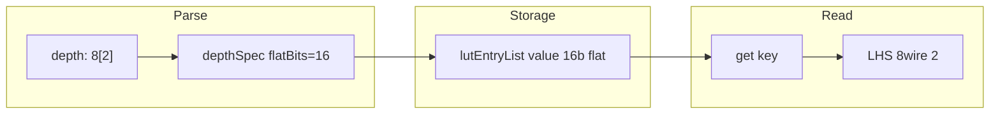

# Plan: LUT depth tensorial (`depth: 8[2]`, `depth: 8[3,2]`)

## Obiectiv

Feature **generic de limbaj** pentru `inline [lut]`: atributul `depth:` acceptă formă tensor (ca la `8wire[2]`), valorile sunt stocate ca blob flat, iar la citire/assign se pot declara wire-uri tipate.

**Nu modifică** scripturi Huffman, protocoale Huffman, doc Huffman, sau planuri existente. Orice migrare a unui consumator concret rămâne **plan separat**, după ce feature-ul e stabil.

---

## Context tehnic (ce există azi)

| Loc | Problemă |
|-----|----------|
| [lut-labels.js](v0_3_2/core/lut-labels.js) L320 | `parseInt("8[2]", 10) → 8` |
| [lut-writable.js](v0_3_2/core/lut-writable.js) L89 | `getInstDepth()` aceeași truncare |
| [lut-decode.js](v0_3_2/core/lut-decode.js) L82 | idem read-only decode |
| [interpreter.js](v0_3_2/core/interpreter.js) L1300 | invoke return width = depth scalar |
| [protocol-assembler.js](v0_3_2/core/protocol-assembler.js) L463 | collapse chunk = parseInt(depth) |

**Stocare:** `lutEntryList[].value` rămâne string binar flat — fără schimbare de model.

**Shape la assign:** metadata tensor pe wire vine din **declarația LHS** (`8wire[2] x = …`), nu din rezultatul expr (pattern existent la `:entries()`). Fix-ul critic e **bitWidth total corect** (`flatBits` = 16, 48…, nu 8).



---

## Decizii scope confirmate

| Decizie | Valoare |
|---------|---------|
| Forme LUT | Doar **`inline [lut]`** — `comp [lut]` rămâne `depth: integer` |
| Forme depth | **`depth: W[N]`** (rank-1) și **`depth: W[R,C]`** (matrice 2D, max 2D ca wire-urile) |
| Stocare | Blob flat în `lutEntryList` |
| `variableDepth` | **Incompatibil** cu depth structurat |
| `prefixFree` | **Incompatibil** cu depth structurat |
| `exprOfLut` / `lutOf` | **Eroare explicită** (ca la variableDepth) |
| Huffman / consumatori | **Out of scope** — feature separat (decizie C confirmată) |

---

## Opțiuni de confirmat (utilizator)

Răspuns scurt așteptat, ex.: `A1, B1, D1` (C e deja separat).

---

### Opțiunea A — Ce acceptă `set` / `add` ca valoare RHS?

#### A1: Ambele — concat flat **și** wire tipat (`8wire[2]`)

**Ce înseamnă:**
- `_ = .lut:set(k, a + b)` — concat flat, ca azi
- `_ = .lut:set(k, typedPair)` — când `typedPair` e wire declarat `8wire[2]` (sau shape compatibil cu `depthSpec`)
- Opțional: literal binar de exact `flatBits` biți
- Opțional: scalar `16wire` flat ca alias (de clarificat la implementare)

**Pro:**
- Aliniat cu restul limbajului (wire-uri tipate)
- Mai puțin concat manual + slice la citire
- Validare naturală: shape RHS trebuie să match-uiască `depthSpec` (ew × rows × cols = flatBits)

**Contra:**
- Validare extra la runtime (verificare elementWidth × dims)
- Trebuie definit comportament când RHS e scalar `Nwire` flat vs tensor declarat

**Recomandare agent:** **A1** — ambele în v1.

**Status:** `pending` — așteaptă confirmare utilizator.

---

#### A2: Doar flat / literal (`flatBits` biți concatenați)

**Ce înseamnă:**
- Doar `_ = .lut:set(k, a + b)` sau literal `1010…` de exact `flatBits` biți
- Fără acceptare wire tipat `8wire[2]` direct

**Pro:**
- Implementare minimă
- Zero logică de shape matching pe RHS

**Contra:**
- Feature-ul e syntax sugar la parse, dar la scriere rămâi pe concat manual
- Utilizatorul trebuie să știe ordinea câmpurilor în blob (row-major, ca wire tensor)

**Recomandare agent:** prea sărac pentru un feature nou de limbaj.

**Status:** `pending` — așteaptă confirmare utilizator.

---

### Opțiunea B — Protocol `expand` / `collapse` în v1?

#### B1: Include în v1

**Ce înseamnă:**
- `collapse(param, .lut, keyWidth)` împarte stream-ul în chunk-uri de **`flatBits`** (16 pentru `8[2]`, 48 pentru `8[3,2]`), nu `parseInt(depth)`
- `expand` analog — fiecare valoare LUT emisă are `flatBits` biți
- `prefixFree` rămâne interzis cu depth structurat (fără impact suplimentar)

**Pro:**
- Comportament consistent — altfel LUT structurat + protocol fixed-depth e silențios greșit
- Fix mic în [protocol-assembler.js](v0_3_2/core/protocol-assembler.js): `getValueBitWidth(depthSpec)` în loc de `parseInt(depth, 10)`
- Evită capcană pentru utilizatori care combină protocol + LUT structurat

**Contra:**
- Puțin scope în plus față de get/set pur
- Necesită 1–2 teste protocol suplimentare

**Recomandare agent:** **B1** — include; efort mic, evită surprize.

**Status:** `pending` — așteaptă confirmare utilizator.

---

#### B2: Amână protocol

**Ce înseamnă:**
- v1 = doar API LUT (get/set/export/decode)
- Protocol rămâne cu comportament greșit pe depth structurat până la un plan ulterior

**Pro:**
- Scope mai mic, livrare mai rapidă

**Contra:**
- Feature incomplet — utilizatorul poate folosi `.lut` în protocol și primește chunk size greșit
- Fix ulterior = aceeași muncă, amânată + documentare limitare interimară

**Recomandare agent:** doar dacă vrei explicit „LUT API first, protocol later”.

**Status:** `pending` — așteaptă confirmare utilizator.

---

### Opțiunea C — Migrare consumatori existenți (Huffman, scripturi, etc.)

#### C1: Separat — feature generic acum, migrare după

**Ce înseamnă:**
- Implementare + doc + teste cu exemple **generice** (pereche `[id, status]`, vector `[x,y,z]`, matrice `[a,b,c]` per intrare)
- **Zero** modificări la huffman-v2, suite Huffman, protocoale SC, planuri Huffman
- Orice adoptare concretă = task/plan separat după stabilizare

**Pro:**
- Scope curat, review ușor
- Teste izolate, fără regresii pe pipeline Huffman
- Feature reutilizabil pentru orice LUT cu valori compuse

**Contra:**
- Beneficiul concret în proiect apare doar când cineva migrează manual

**Recomandare agent:** **C1**.

**Status:** **confirmat** de utilizator — fără legătură Huffman în acest plan.

---

#### C2: Include migrare consumatori în același pas

**Ce înseamnă:**
- Refactor scripturi existente (ex. LUT-uri cu blob flat 16 → `depth: 8[2]`)
- Actualizare teste + doc ale consumatorului în același PR

**Pro:**
- Demonstrație end-to-end imediat

**Contra:**
- Coupling — PR mare, greu de review
- Risc regresii amestecate cu feature de limbaj
- Scope creep

**Recomandare agent:** nu — plan separat după feature stabil.

**Status:** respins — utilizatorul a cerut feature separat.

---

### Opțiunea D — Forma exportului `:values()`

Pentru `depth: 8[2]` cu N intrări, blob-ul intern e N×16 biți row-major (câmp0‖câmp1 per intrare).

#### D1: `8wire[N,2]` — fiecare rând = o intrare, coloane = câmpuri

**Ce înseamnă:**
- Declarație: `8wire[N,2] vs = .lut:values()`
- Coloana 0 = primul câmp, coloana 1 = al doilea (per intrare)
- `flatBits / ew = cols` → shape `[N, cols]`

**Pro:**
- Semantică clară; coloane indexabile (`vs:0`, `vs::1`)
- Compatibil cu `SORT` pe coloane dacă se exportă via `:entries()`
- Aliniat cu modelul tensor existent

**Contra:**
- LHS trebuie declarat corect (ca azi la `:entries()`)

**Recomandare agent:** **D1**.

**Status:** `pending` — așteaptă confirmare utilizator.

---

#### D2: `16wire[N]` — câte un blob flat per intrare

**Ce înseamnă:**
- Declarație: `16wire[N] vs = .lut:values()`
- Fiecare element = blob integral de `flatBits` biți

**Pro:**
- Similar cu scalar, doar width per element mai mare
- LHS mai simplu mental dacă nu vrei câmpuri separate

**Contra:**
- Pierzi semantica „depth structurat” — echivalent cu `depth: 16` flat
- Anulează o parte din motivul feature-ului

**Recomandare agent:** nu ca formă principală; poate rămâne valid implicit dacă LHS e `flatBits wire[N]`.

**Status:** `pending` — așteaptă confirmare utilizator.

---

## Alte puncte (fără fork A/B/C/D — recomandări incluse în plan)

| Punct | Analiză | Decizie plan |
|-------|---------|--------------|
| **`doc(.inst)`** | Azi afișează `depth: 16` (interpretare flat) | Afișează `depth: 8[2]` / `8[3,2]` când e structurat — **Faza 6** |
| **`decode` / `countValue` / `isValid`** | Match pe blob integral `flatBits` | Păstrează în v1; **fără** decode pe câmp individual |
| **`popMin` / `peekMin` / `popMax`** | Compare pe blob integral | OK — heap cu depth scalar rămâne neschimbat |
| **`popMin(; field=0)`** | Compare doar câmpul k | **Backlog** — nu v1 |
| **Partial set** (doar un câmp) | `set` înlocuiește tot blob-ul | **Respinge** în v1; slice pe wire + concat la set |
| **Plumbing `tensorRows` pe return** | LHS decl e suficient pentru `get` | **Nu** over-engineera; doar `bitWidth: flatBits` corect |
| **`:keys()`** | Chei rămân scalar | Neschimbat |
| **`:entries()`** | Matrix `[N,2]` key+value | Coloana valoare la `ew` (sau padded la `max(keyW, ew)`) — documentat |
| **`:valueAt(i)`** | Return typed dacă LHS `8wire[2]` | `bitWidth = flatBits` |
| **Exemple doc/teste** | Generic: LUT map `[id, status]`, `[x,y,z]`, matrice 2D | **Fără** Huffman / compresie / arbore |
| **Rank-1 `8[3]` vs `8[1,3]`** | Aceeași convenție ca wire-uri (`parseTensorShapeSuffix`) | `8[3]` → rows=1, cols=3, singleDim=true |
| **Regresie scalar** | `depth: 4` neschimbat | Test obligatoriu în grup `lut-depth-tensor` |

---

## Model de date

Modul nou **`lut-value-shape.js`**:

```js
// depthSpec — normalizat la parse:
// scalar:  { ew: 4, rows: 1, cols: 1, singleDim: true, flatBits: 4 }
// vector:  { ew: 8, rows: 1, cols: 2, singleDim: true, flatBits: 16 }   // depth: 8[2]
// matrix:  { ew: 8, rows: 3, cols: 2, singleDim: false, flatBits: 48 }  // depth: 8[3,2]

parseLutDepthAttribute(raw)      // "8", "8[2]", "8[3,2]"
normalizeDepthSpec(inst)         // din attributes.depth (number legacy sau object)
getValueBitWidth(depthSpec)      // flatBits
getValueElementWidth(depthSpec)  // ew
getValueTensorShape(depthSpec)   // { rows, cols } | null pentru scalar pur
isStructuredDepth(depthSpec)
formatDepthTypeLabel(depthSpec)  // "8wire[2]", "8wire[3,2]"
```

**Compatibilitate retroactivă:** `depth: 4` rămâne scalar; codul existent folosește accessor central, nu `parseInt` direct pe string.

---

## Comportament metode LUT (depth structurat)

| Metodă | v1 |
|--------|-----|
| `get(key)` / invoke `.lut(key)` | Return blob `flatBits`; LHS `8wire[2]` dă shape la assign |
| `set` / `add` | RHS per **Opțiunea A** (pending) |
| `valueAt(i)` | Blob `flatBits` |
| `:values()` | Export per **Opțiunea D** (pending) |
| `:keys()` | Neschimbat (scalar keys) |
| `:entries()` | `[N,2]` — col 0 key, col 1 value (value la ew sau padded) |
| `decode(value)` | Match integral pe `flatBits` |
| `countValue` / `isValid` | Match integral |
| `popMin` / `peekMin` | Compare integral (typical use: depth scalar heap) |
| `exprOfLut` / `lutOf` | Eroare |

---

## Faze implementare

### Faza 1 — Parser și validare build

**Fișiere:** [lut-value-shape.js](v0_3_2/core/lut-value-shape.js) (nou), [lut-labels.js](v0_3_2/core/lut-labels.js)

- Parse `depth: 8[2]` / `8[3,2]` (logică aliniată cu [parser.js `parseTensorShapeSuffix`](v0_3_2/core/parser.js) L301–331)
- `fillwith`, labels, `data {}`: validare la **`flatBits`**
- Erori: `structured depth + variableDepth`, `structured depth + prefixFree`

### Faza 2 — Runtime core

**Fișiere:** [lut-writable.js](v0_3_2/core/lut-writable.js), [lut-decode.js](v0_3_2/core/lut-decode.js)

- Înlocuiește `getInstDepth()` cu accessor pe `depthSpec` / `flatBits`
- `normalizeValueBits`: pad/truncate la `flatBits`; validare RHS typed (dacă A1)
- Export `:values()` conform **Opțiunea D**
- `decode` / `countValue`: match integral

### Faza 3 — Interpreter

**Fișier:** [interpreter.js](v0_3_2/core/interpreter.js)

- `evalInlineLutInvoke`: `outWidth = flatBits`
- Fără plumbing `tensorRows` pe return — LHS decl + bitWidth corect

### Faza 4 — Protocol

**Fișier:** [protocol-assembler.js](v0_3_2/core/protocol-assembler.js)

- Conform **Opțiunea B** (pending): `expand`/`collapse` fixed-depth folosesc `flatBits`

### Faza 5 — Boolean analysis

**Fișier:** [boolean-lut.js](v0_3_2/core/boolean-lut.js) — respinge structured depth (mesaj clar)

### Faza 6 — Doc + afișare instanță

**Fișiere:** [lut.md](v0_3_2/doc/lut.md), [components/lut.js](v0_3_2/core/components/lut.js)

- Secțiune **Structured value depth** — exemple generice
- `doc(.inst)` / `formatInlineInstanceDoc`: afișează `depth: 8[2]` nu `16`
- Limitări documentate (fără prefixFree, fără exprOfLut, comp neschimbat)

### Faza 7 — Teste

**Fișier:** [tests/test_suite.js](v0_3_2/tests/test_suite.js) — grup `lut-depth-tensor`

| Test | Verifică |
|------|----------|
| parse `8[2]`, `8[3,2]` | `flatBits` corect |
| parse + `variableDepth` | eroare |
| `fillwith` width greșit | eroare |
| `set` + `get` round-trip | blob 16/48 biți |
| `set` cu typed wire | dacă A1 confirmat |
| `:values()` shape | dacă D1 confirmat |
| invoke read-only | `flatBits` width |
| `decode` integral | match corect |
| protocol collapse | dacă B1 confirmat |
| `exprOfLut` | eroare |
| regresie `depth: 4` | zero schimbări |

---

## Out of scope v1

- `comp [lut]` depth tensorial
- Dimensiuni >2D
- `popMin(; field=k)` — compare pe câmp
- Field-level decode / partial set pe un singur câmp
- `prefixFree` + structured depth
- `exprOfLut` / `lutOf` pe depth structurat
- Modificări scripturi / doc / teste Huffman
- Migrare consumatori existenți (plan separat)

---

## Rezumat recomandări agent (pending confirmare A, B, D)

| ID | Recomandare |
|----|-------------|
| **A** | **A1** — flat concat + typed wire la set/add |
| **B** | **B1** — include protocol expand/collapse |
| **C** | **C1** — separat (**confirmat**) |
| **D** | **D1** — `:values()` → `8wire[N,2]` |

După confirmare: marchează deciziile în acest fișier și actualizează todo-urile (elimină „pending”).
