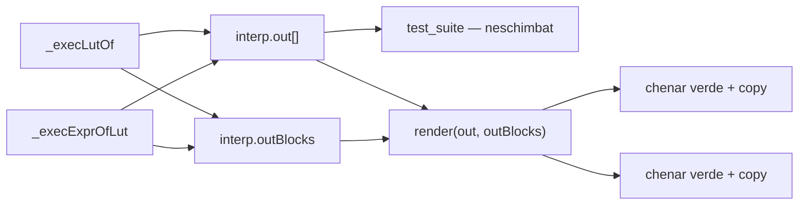
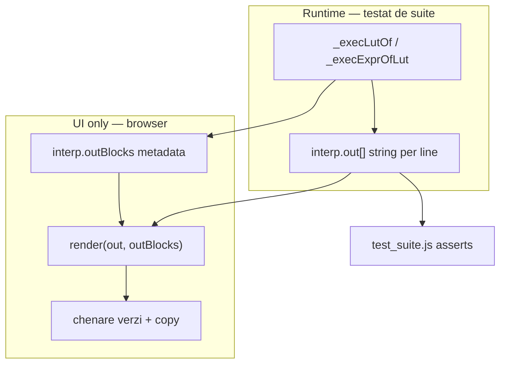

# Chenare copy pentru `lutOf` și `exprOfLut`

## Context

| Funcție | Output actual (`interp.out`) | UI dorit |
|---------|------------------------------|----------|
| `lutOf` | N linii consecutive (`inline [lut] .generated:` … `:`) | **1 chenar** = script complet |
| `exprOfLut` | **2 linii** (`5wire out = \`...\`` + `5wire out = OR(...)`) | **2 chenare** separate |

Generare în [`v0_3_2/core/boolean-lut.js`](v0_3_2/core/boolean-lut.js):

```867:870:v0_3_2/core/boolean-lut.js
  return [
    `${outType} out = \`${shortExpr}\``,
    `${outType} out = ${stdExpr}`
  ];
```

Push în interpreter:

```3356:3358:v0_3_2/core/interpreter.js
      for (const line of text.split('\n')) {
        this.out.push(line);
      }
```

Randare UI în [`v0_3_2/ui/app.js`](v0_3_2/ui/app.js) — `render()` apelează `appendOutputLine()` per linie; fără chenare.

Butonul existent `btncopy()` din [`v0_3_2/ui/editor.js`](v0_3_2/ui/editor.js) copiază **editorul**, nu output-ul — vom adăuga copy per chenar cu același simbol `⿻`, mic.

## Stil text — verde editor

Textul din chenare (script `lutOf` sau liniile `exprOfLut`) se afișează în **același verde** ca editorul CodeMirror:

```17:22:v0_3_2/script_editor_v0_3_2.html
.CodeMirror {
  ...
  color: #0f0;
```

- Culoare chenar: **`#0f0`** pe `.output-copy-block__text`
- Fundal chenar: **`#000`** (ca editorul), nu `#111` — consistență vizuală
- **Fără** syntax highlighting în chenar la MVP — text plain verde uniform (suficient pentru copy-paste)
- Liniile obișnuite din output (`show`, erori etc.) rămân cu stilul actual (gri `#ccc` / roșu erori)

## Abordare recomandată: metadata `outBlocks` (fără schimbări la teste)

**Păstrăm `interp.out` neschimbat** — testele 1091–1122 assert pe `out[0]`, `out[1]`, `out.join('\n')` etc.

Adăugăm paralel un array de metadata pentru UI:

```javascript
// Interpreter constructor
this.outBlocks = [];

// _execLutOf — după push linii
this.outBlocks.push({ kind: 'lutOf', start, end: this.out.length });

// _execExprOfLut — după push 2 linii
this.outBlocks.push({ kind: 'exprOfLut', start, end: start + 2 });
```



Alternativa (respină): detectare heuristă în `render()` după `inline [lut]` / pattern `Nwire out =` — fragilă, risc false-positive.

## Partea 1 — Interpreter

Fișier: [`v0_3_2/core/interpreter.js`](v0_3_2/core/interpreter.js)

- Inițializare `this.outBlocks = []` în constructor (fiecare `run()` creează interpreter nou — array curat automat).
- `_execLutOf`: înregistrează `{ kind: 'lutOf', start, end }` pentru liniile tocmai adăugate.
- `_execExprOfLut`: înregistrează `{ kind: 'exprOfLut', start, end: start + 2 }`.

Nu atingem `boolean-lut.js` — formatul text rămâne identic.

## Partea 2 — UI output panel

Fișier: [`v0_3_2/ui/app.js`](v0_3_2/ui/app.js)

### Helper nou: `copyTextToClipboard(text)`

- `navigator.clipboard.writeText(text)` (același API ca `btncopy()`).
- Fără escape pentru editor — textul din output e copiat literal.

### Helper nou: `appendOutputCopyBlock(text)`

Structură DOM:

```html
<div class="output-copy-block">
  <pre class="output-copy-block__text">…script/expression…</pre>
  <div class="output-copy-block__actions">
    <button type="button" class="btn output-copy-block__btn" title="Copy">⿻</button>
  </div>
</div>
```

- Buton **mic** (`font-size: 11px`, padding redus), stil similar toolbar (`background: #048`).
- Poziționare: rândul de acțiuni **sub** chenar, aliniat **dreapta** (`display: flex; justify-content: flex-end`).

### Refactor `render(lines, blocks?)`

- Semnătură: `render(lines, blocks)`; default `blocks = globalInterp?.outBlocks || []`.
- Construiește set de intervale acoperite de blocks.
- Parcurge `lines` cu index `i`:
  - Dacă `i` începe un block `lutOf` → `appendOutputCopyBlock(lines.slice(start, end).join('\n'))`, sare la `end`.
  - Dacă `i` începe `exprOfLut` → **două** apeluri `appendOutputCopyBlock` (linia short, apoi standard), sare la `end`.
  - Altfel: logică existentă (`Error:` → `appendErrorOutput`, rest → `appendOutputLine`).
- Actualizare apeluri: `render(globalInterp.out, globalInterp.outBlocks)` în `run`, `sendCmd`, `showVars`.

### Opțional UX

- La click copy: `btn.title = 'Copied!'` 1s — fără toast mare.

## Partea 3 — CSS

Fișier: [`v0_3_2/script_editor_v0_3_2.html`](v0_3_2/script_editor_v0_3_2.html) (lângă `.output-panel`)

```css
.output-copy-block {
  margin: 6px 0 14px;
  border: 1px solid #444;
  background: #000;
  padding: 8px 10px;
}
.output-copy-block__text {
  margin: 0;
  white-space: pre;
  color: #0f0;
  font-family: monospace;
  font-size: inherit;
}
.output-copy-block__actions {
  display: flex;
  justify-content: flex-end;
  margin-top: 4px;
}
.output-copy-block__btn {
  font-size: 11px;
  padding: 2px 7px;
  margin: 0;
  font-weight: bold;
  background-color: #048;
}
```

Chenarul rămâne distinct de `.output-line` (nu folosim `output-line` pe textul din box — evităm confuzie cu `getOutputLines()` care citește doar `.output-line`).

## Comportament vizual așteptat

**lutOf(OR(A,B))** — un chenar cu text **verde `#0f0`** pe fundal negru:

```
inline [lut] .generated:          ← verde
  description: A 1b, B 1b -> out 1b
  ...
:                                 [⿻]
```

**exprOfLut** — două chenare verzi:

```
5wire out = `(111) + (!C.3) + ...`     ← verde
                                    [⿻]

5wire out = 111 + NOT(C.3) + OR(...)  ← verde
                                    [⿻]
```

Output mixt (ex. `show` + `lutOf` + `exprOfLut`): liniile obișnuite rămân plain (gri); doar block-urile metadata devin chenare verzi.

## Teste — compatibilitate și ce rămâne verificat

### Principiu: **nu ștergem și nu slăbim testele existente**

Grupul `bool-lut` / `bool-lut-mb` (1091–1153+) assert pe **`session.run(...).out`** — array de string-uri, o linie per element. Runner-ul Node ([`test_session.js`](v0_3_2/test_session.js)) **nu apelează** `render()` din browser; citește direct:

```50:71:v0_3_2/test_session.js
      run(src) {
        ...
        this.out = [];
        this.interp = new Interpreter(p.funcs, this.out, ...);
        ...
        return { out: this.out, interp: this.interp };
      },
```

**Contract de păstrat:**

| Ce testează acum | Exemplu test | Trebuie să rămână identic |
|------------------|--------------|---------------------------|
| Linii individuale | `out[0] === 'inline [lut] .generated:'` (1091) | Da — același `push` în `interp.out` |
| Conținut parțial | `out.some(l => l.trim() === 'length: 4')` | Da |
| Două linii `exprOfLut` | `out.length === 2`, backtick + `OR(` (1096) | Da |
| Round-trip | `session.run('lutOf(...)').out.join('\n')` apoi `exprOfLut(.generated)` (1102, 1119) | Da — `join('\n')` trebuie să producă același script |
| Copy-paste rulabil | `session.run(out[1].replace('out','R'))` (1100–1101) | Da — stringul liniei e neschimbat |

### Separare runtime vs UI



- **`interp.out`** — sursa de adevăr pentru teste; **neschimbat** (aceleași linii, aceeași ordine).
- **`interp.outBlocks`** — metadata adăugată în paralel (`{ kind, start, end }`); folosită **doar** de `render()` pentru chenare.
- **Interzis:** înlocuirea liniilor din `out` cu un singur blob, prefixe magice în `out`, sau mutarea logicii de generare doar în UI.

### Ce rulează la implementare

1. **`node _run_suite_node.js`** — toate testele existente trec fără modificări în `test_suite.js` (țintă: 838/838).
2. **Nicio ștergere** de teste din grupul bool-lut.
3. **Verificare manuală** în editor — aspect chenar; conținutul copiat = `out.slice(start,end).join('\n')` sau linia singulară.

### Teste noi opționale (recomandat, nu înlocuiesc pe cele vechi)

Dacă vrem acoperire explicită a legăturii UI↔runtime, adăugăm **1–2 teste** în `bool-lut` (nu refactor pe cele existente):

```javascript
// Exemplu: după lutOf, outBlocks descrie același text ca join
const { out, interp } = session.run('lutOf(OR(A, B))');
const b = interp.outBlocks.find(x => x.kind === 'lutOf');
h.assert('outBlocks present', String(!!b), 'true');
h.assert('block text', out.slice(b.start, b.end).join('\n'), out.slice(b.start, b.end).join('\n'));
h.assert('wrapper unchanged', out[b.start], 'inline [lut] .generated:');

// Exemplu: exprOfLut — 2 linii, block span 2
const { out, interp } = session.run(INLINE_OR2 + '\nexprOfLut(.or2, A, B)');
const b = interp.outBlocks.find(x => x.kind === 'exprOfLut');
h.assert('expr block len', String(b.end - b.start), '2');
h.assert('short line', out[b.start], out[0]); // dacă singurul output
```

Acestea **completează** testele pe conținut; nu le înlocuiesc.

### Ce NU testăm în Node (doar manual)

- DOM chenar, culoare `#0f0`, poziție buton copy, `navigator.clipboard` — fără teste browser în MVP.

## Fișiere atinse

| Fișier | Schimbare |
|--------|-----------|
| [`v0_3_2/core/interpreter.js`](v0_3_2/core/interpreter.js) | `outBlocks` + înregistrare la `_execLutOf` / `_execExprOfLut` |
| [`v0_3_2/ui/app.js`](v0_3_2/ui/app.js) | `appendOutputCopyBlock`, `copyTextToClipboard`, `render()` cu blocks |
| [`v0_3_2/script_editor_v0_3_2.html`](v0_3_2/script_editor_v0_3_2.html) | CSS chenar + text `#0f0` + buton copy |

## Ordine implementare

1. `outBlocks` în interpreter (lutOf + exprOfLut) — **fără** schimbare la `push` în `out`
2. CSS chenar (verde `#0f0`, fundal `#000`)
3. `appendOutputCopyBlock` + refactor `render()` (doar prezentare)
4. **`node _run_suite_node.js`** — confirmă toate testele bool-lut existente
5. Opțional: 1–2 teste `outBlocks` sync (vezi secțiunea Teste)
6. Verificare manuală chenar + copy în editor
