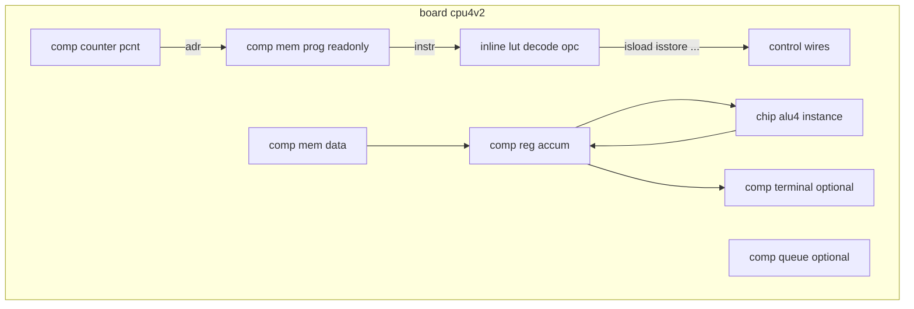

# Plan: documentație Mini CPU v2

## Context

[mini-cpu.md](v0_3_2/doc/mini-cpu.md) (v1) rămâne neschimbat. Este un demo Harvard 4-bit solid (~120 linii în `board +[cpu4]`), dar:

- programul ROM e încă `= ^10334221` (hex manual) în exemplele principale, deși doc-ul menționează ASM doar într-o secțiune separată
- decode-ul folosește **6× `EQ` + lanț `MUX`** — greu de urmărit pentru începători
- **adder/subtract duplicate** în board (chip `alu4` există, dar board-ul are propriile `.add`/`.sub`)
- lipsesc **branch condiționat**, **I/O text**, și legătura cu noile primitive

**Decizii confirmate:**
- livrabil = documentație + scripte `logts-play` + **teste automate E2E** pentru v2
- demo **mai bogat didactic** (ASM+BEQ, terminal, queue opțional)
- **v1 neschimbat:** `mini-cpu.md` și testele **859–866** rămân intacte

---

## Ce aduce v2 față de v1 (funcții deja în engine)

| Capabilitate | Unde e documentată | Rol în v2 |
|--------------|-------------------|-----------|
| ASM + labels + `BEQ`/`S4b` | [asm.md](v0_3_2/doc/asm.md) | Program ROM lizibil, bucle relative |
| `ZERO()` / `EQ` | [builtin-bit-selection-functions.md](v0_3_2/doc/builtin-bit-selection-functions.md) | Flag zero pentru `BEQ` |
| `comp [terminal]` | [terminal.md](v0_3_2/doc/terminal.md) | Afișare ACC / trace în UI |
| `comp [queue]` | [queue.md](v0_3_2/doc/queue.md) | Secțiune opțională „call stack” |
| `mem` multi-port + `readonly` | [mem.md](v0_3_2/doc/mem.md) § Multi-port | Sidebar avansat (fetch+data același pas) |
| `get >=` redirect | mem.md, queue.md | Wiring mai compact în property blocks |
| Operatori `=`, `:=`, `=:` | [assignment-operators.md](v0_3_2/doc/assignment-operators.md) | Init ROM strict vs padding |

**Nu implementăm** componente noi (`comp [alu]`, `ir`, `dpram`) — rămân idei în [future-component-ideas.md](v0_3_2/doc/future-component-ideas.md).

---

## Arhitectură propusă pentru v2 (în documentație)



### Păstrăm din v1 (pedagogie clară)

- Harvard: **`comp [mem] .prog`** + **`comp [mem] .data`** (două instanțe — povestea „program vs date” rămâne simplă)
- 4-bit ACC, 8-bit instrucțiune `[opcode:4][operand:4]`
- `chip +[alu4]` pentru ADD/SUB
- `comp [counter]`, `comp [reg]`, `comp [7seg]`, pin `set`/`rst`, pout `acc`/`pc`/`ir`

### Îmbunătățiri v2 (mai bogat, wiring mai lizibil)

1. **Board folosește instanța chip** — `chip [alu4] .alu:` în loc de adder/subtract duplicate în board (~30 linii mai puțin, același comportament)
2. **Decode via `inline [lut]`** — un singur bloc `.decode(in = opc)` cu ieșiri `isload`, `isstore`, … în loc de 6× `EQ` (pattern din [lut.md](v0_3_2/doc/lut.md); alternativă documentată: păstrare `EQ` pentru comparație v1↔v2)
3. **ROM exclusiv ASM** — `= .cpuisa { … }` cu labels; **fără** `^10334221` în exemplul principal
4. **ISA extinsă** — adaugă `BEQ` (`0110 + S4b` relativ); păstrează NOP/LOAD/STORE/ADDI/SUBI/JMP/HALT din v1
5. **`ZERO(curacc)`** pentru branch — `1wire iszero = ZERO(curacc)` + logică PC: load `pc + 1 + offset` când `BEQ && iszero`
6. **`comp [terminal]`** — instrucțiune pseudo `OUT` (opcode dedicat) sau secțiune „debug I/O” care scrie hex ACC la terminal pe fiecare step
7. **Secțiune opțională queue** — `PUSH`/`POP` PC pe `comp [queue]` (width=4, length=8) pentru lecție „subrutine”; marcată „Advanced”, nu în scriptul minimal

### Sidebar: mem multi-port (avansat)

Scurt exemplu `ports: 2` + `readonly` pe port 1 — **nu** înlocuiește cele două `mem` din scriptul principal (Harvard rămâne povestea default), dar explică cum s-ar face fetch+load în același property block ([mem.md](v0_3_2/doc/mem.md) liniile 315–377).

---

## Program demo v2 (ASM)

Countdown în RAM + buclă `BEQ` (înlocuiește secvența liniară v1):

```logts
inline [asm] .cpuisa:
  NOP   : 0000 + 4b
  LOAD  : 0001 + 4b
  STORE : 0010 + 4b
  ADDI  : 0011 + 4b
  SUBI  : 0100 + 4b
  JMP   : 0101 + 4b
  BEQ   : 0110 + S4b
  HALT  : 0111 + 4b
  :

comp [mem] .prog:
  depth: 8
  length: 8
  = .cpuisa {
    LOAD \0      # ACC = RAM[0] (=3)
  loop:
    SUBI \1
    BEQ done     # iesi cand ACC==0
    JMP loop
  done:
    HALT
  }
  on: raise
  :
```

**Trace așteptat:** ACC 3→2→1→0; PC sare la `done`; 7seg arată `0`; terminal poate afișa „done” sau valoarea ACC la fiecare step.

---

## Structura fișierului nou

Creează [v0_3_2/doc/mini-cpu-v2.md](v0_3_2/doc/mini-cpu-v2.md):

| Secțiune | Conținut |
|----------|----------|
| Intro | Scop, link la v1, tabel „ce e nou” |
| Arhitectură | Tabel blocuri + diagramă mermaid |
| ISA | Tabel opcode + bloc `inline [asm] .cpuisa` |
| Decode | LUT (principal) + notă „v1 folosea EQ” |
| BEQ / flags | `ZERO()`, actualizare PC relativ |
| Terminal I/O | `comp [terminal]` + property block `append` |
| Queue (opțional) | Push/pop PC — 15–20 linii, marcat Advanced |
| Multi-port sidebar | Exemplu scurt `logts-play`, fără board complet |
| Exemple rulabile | (1) ASM-only check, (2) full board Load&Run, (3) oscillator, (4) key/NEXT, (5) terminal |
| v1 vs v2 | Tabel comparativ |
| Related | asm, mem, lut, terminal, queue, builtin-bit-*, mini-cpu.md |

**Constante partajate doc + teste** (în [test_suite_ported.js](v0_3_2/test_suite_ported.js), lângă `CHIP_ALU4` / `BOARD_CPU4`):

| Constantă | Conținut |
|-----------|----------|
| `CHIP_ALU4` | Reutilizat din v1 (neschimbat) |
| `CPUISA_V2` | `inline [asm] .cpuisa:` cu BEQ + mnemonici v2 |
| `LUT_DECODE_CPU` | `inline [lut] .decode:` — ieșiri control din opcode |
| `BOARD_CPU4V2` | Board complet: chip `[alu4]`, ASM ROM, LUT, `ZERO`, terminal opțional în variantă test |
| `cpuV2Step(session, interp, n)` | Helper ca `cpuStep()` existent |

Scriptul din doc și constantele de test trebuie să fie **aceleași** (sau doc face referire explicită la ID-urile de test).

---

## Teste automate (noi)

Pattern: oglindă a suitei v1 ([test_suite_ported.js](v0_3_2/test_suite_ported.js) liniile 2487–2539), cu program countdown + `BEQ`.

**ID-uri propuse:** `1056`–`1063` (după ultimul test queue `1055`).

| ID | Grup | Titlu | Ce verifică |
|----|------|-------|-------------|
| 1056 | `board` | cpu4v2 stare inițială | `acc=0000`, `pc=0000` |
| 1057 | `board` | cpu4v2 un pas LOAD 0 | `acc=0011` (RAM[0]=3), `pc=0001` |
| 1058 | `board` | cpu4v2 countdown complet | după N steps: `acc=0000`, PC la `HALT` |
| 1059 | `board` | cpu4v2 BEQ sare la done | după `acc` devine 0, următorul step: PC ≠ loop (branch luat) |
| 1060 | `probe` | probe(.cpu:acc) cpu4v2 | output `initialised` + acc după 1 step |
| 1061 | `board` | cpu4v2 clock pulse | 4+ pulse pe `clk` → stare finală |
| 1062 | `board` | cpu4v2 NEXT(~) step | 4× `execNext` → stare finală |
| 1063 | `board` | cpu4v2 terminal trace | `getTerminalText()` după step-uri cu `append` (dacă terminal e în board-ul de test) |

**Program de test** (același ca în doc):

- `comp [mem] .data: = ^3` (RAM[0]=3)
- ROM ASM: `LOAD \0` → `loop: SUBI \1` → `BEQ done` → `JMP loop` → `done: HALT`
- **N steps** pentru test 1058: calculat după layout ROM (5 instrucțiuni executate + branch + HALT) — ancorat la implementarea board-ului, nu la estimări din plan

**Assert API** (existent):

- `session.getPcbPout(interp, '.cpu', 'acc'|'pc'|'ir')`
- `session.execStmts(interp, '.cpu:{ set = 1 }')` via `cpuV2Step`
- `getTerminalText(_termId(interp, '.term'))` — pattern din testele 960+

**Fișiere test:**

| Fișier | Schimbare |
|--------|-----------|
| [test_suite_ported.js](v0_3_2/test_suite_ported.js) | Constante + `reg(1056–1063)` |
| [_gen_manifest.js](v0_3_2/_gen_manifest.js) | Opțional: grup `{ id: 'mini-cpu-v2', label: 'Mini CPU v2 demo' }` în `GROUP_META` (altfel rămân în `board`/`probe`) |
| [test_manifest.js](v0_3_2/test_manifest.js) | Regenerat: `node _gen_manifest.js` |

**Doc:** secțiune „Automated tests” în `mini-cpu-v2.md` — `test_suite_ported.js` (1056–1063), la fel ca v1 (859–866).

**Nu adăugăm** teste separate pentru queue/multi-port în v2 — acestea au suite proprii (`queue-stack`, `mem-ports`); doc-ul le citează doar ca sidebar.

---

## Fișiere de actualizat (index / cross-ref)

| Fișier | Schimbare |
|--------|-----------|
| [doc-index.json](v0_3_2/doc/doc-index.json) | Intrare `mini-cpu-v2.md` lângă mini-cpu |
| [components.md](v0_3_2/doc/components.md) | Rând „Mini CPU v2 demo” |
| [mini-cpu.md](v0_3_2/doc/mini-cpu.md) | Doar secțiunea **Related** — link către v2 (1 linie) |
| [mem.md](v0_3_2/doc/mem.md) | Related: link mini-cpu-v2 |
| [asm.md](v0_3_2/doc/asm.md) | Related: link mini-cpu-v2 ca exemplu end-to-end |

Regenerare UI docs:

```bash
node v0_3_2/_gen_doc_data.js
```

---

## Verificare

1. `node _run_suite_node.js` — toate testele verzi, inclusiv **1056–1063** noi și **859–866** v1 neschimbate
2. `node _gen_manifest.js` — manifest actualizat
3. Smoke manual: script din doc în editor → **Load & Run** (7seg, terminal)
4. Blocuri `logts-play` izolate (ASM, LUT, terminal)

---

## Riscuri / decizii de documentat explicit

- **BEQ + PC relativ:** necesită wiring pentru `PC ← PC + 1 + signed_offset` (counter load + eventual adder auxiliar sau pre-calcul în board) — cea mai delicată parte; documentăm pas cu pas în secțiunea BEQ, cu diagramă mică fetch-decode-execute
- **LUT vs EQ:** LUT reduce zgomotul vizual dar introduce al doilea `inline` — menționăm ambele variante
- **Queue call-stack:** doar opțional; nu complică scriptul minimal
- **Lățimi strict `=`:** la init ASM în `8wire`/`16wire`, folosim `=` strict conform [assignment-operators.md](v0_3_2/doc/assignment-operators.md)

---

## Estimare efort

- Board + constante test + 8 teste E2E: ~1 sesiune (2–4 h; partea BEQ/PC relativ e critică)
- `mini-cpu-v2.md` sincronizat cu scriptul de test: ~½ sesiune (1–2 h)
- Index + cross-ref + `_gen_doc_data.js` + `_gen_manifest.js`: ~15 min
- **Zero** modificări engine — doar doc + teste
