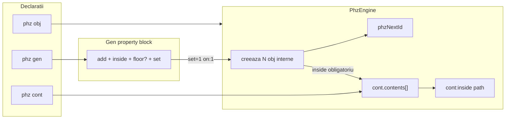

# Plan: modul PHZ — faza 1 (obj + gen + cont)

## Context

PHZ = modul de limbaj nou (ca `chip` / `board`): logică fizică topologică, nu fizică continuă.

**În scope:**
- `phz [obj]`, `phz [gen]`, `phz [cont]`
- Property blocks pe gen / obj / cont
- Assign inline pe atribute: `.obj1:attr = …`
- Acces listă container: `.cont:inside…`
- **Nu:** zone, topologie robot/conveyor, pick/place, `phz +[tip]:`

**Atribute la definire:** sintaxă PHZ simplificată.  
**Atribute la scriere runtime** (property block / inline): **wireLiterals LogTScript**, respectând lățimea pout-ului.

---

## Decizii închise (1–12) + API `:inside` + clarificări edge

| # | Decizie |
|---|--------|
| 1 | `max` pe cont: lățime **16 biți**, default valoare **16** |
| 2 | Overflow (`count + add > max`) → **eroare** |
| 3 | Obiecte generate: **fără instanță vizibilă**; doar listă internă în cont + index |
| 4 | Acces listă via **`.cont:inside…`**; **fără** `.c:count` — doar `:inside:count` / `:inside:empty` |
| 5 | `type: obj` pe gen: **obligatoriu** |
| 6 | Trigger gen: **`on:1` hardcodat** — fiecare property block cu `set: 1` **re-spawn** (noi obiecte) |
| 7 | `add` / `inside` / `set` / `floor?`: **doar în property block** pe gen; **`add` poate fi și wire** |
| 8 | Property block pe **obj** și **cont**; assign inline pe obj/cont denumite |
| 9 | Cont: **atribute custom** da |
| 10 | Gen **obligă** `inside` în block |
| 11 | Floor override în gen block: **da** |
| 12 | Ordine: cont/gen înainte de spawn |

### Clarificări edge (13–22)

| # | Decizie |
|---|--------|
| 13 | `type: obj` **obligatoriu** pe gen (nu implicit) |
| 14 | `add` în block: decimal **sau wire** |
| 15 | `:inside:count` lățime **16 biți** (ca `max`) |
| 16 | Path `:inside…` — **doar citire** în faza 1; scriere pe obiecte din listă = mai târziu |
| 17 | Umplere cont: **doar din gen** acum; mutare fără gen = mai târziu |
| 18 | `show(.c:inside)` — afișare în stil vector/schema **doar ca UX de show**; **nu** unificăm atributele heterogene într-o schemă comună |
| 19 | `id` autoincrement: **global pe tot scriptul**, toate `obj` (denumite + generate) |
| 20 | `set: 1` (level `on:1`): **fiecare** execuție de block cu set=1 face **spawn nou** (adaugă obiecte noi) |
| 21 | Gen: atribute template în **definiție**; cele din execution block le pot override / completa unde e cazul (`floor`); restul template vin din definiție |
| 22 | Nume rezervate pe **cont** (atribute top-level): **`inside`**, **`count`**, **`empty`** interzise. **`first`** / **`last`** **permise** pe cont (ex. `.c:last` ≠ `.c:inside:last`). Pe **obj** nu se rezervă aceste nume. |

---

## Arhitectură



---

## Sintaxă

### obj

```
phz [obj] .o2::
# id auto, floor 0

phz [obj] .o:
  id: 50
  floor: 2
  myAttribute: 3
  someOtherAttribute: "ABC"
  someOtherAttribute3: "ABC" (40)
  myAttribute2: 3 (8)
  myAttribute5: someWire
  :
```

### Scriere pe obj (runtime — wireLiterals)

```
.o:myAttribute = 11
# sau
.o:{
  myAttribute = 11
  floor = ^02
}
```

RHS = literale LogTScript; trebuie să respecte lățimea pout-ului atributului (ca pe chip/comp).

### gen

```
phz [gen] .myGen:
  type: obj          # OBLIGATORIU
  floor: 0
  someAttr: 1        # template — pe obiectele generate
  # id INTERZIS
  :

.myGen:{
  add: 10            # sau wire (ex. addCount)
  inside: .container1
  # floor: 3          # opțional override
  # floor: floorWire  # wire exact 8 biți
  set: 1             # fiecare block cu set=1 → spawn NOU (on:1 level)
}
```

- `type: obj` obligatoriu
- `on:1` hardcodat → la fiecare scriere `set: 1` se face spawn din nou (adaugă obiecte noi în cont)
- `inside` obligatoriu în block; `add` = decimal sau wire
- template din definiție se copiază pe obiectele generate; `floor` din block override dacă e prezent
- obiectele create **nu** apar ca `.nume` în scope; doar în `cont.contents[]` (citire via `:inside`)
- umplere cont: **doar din gen** în faza 1
- path `:inside…` = **read-only** (scriere pe elemente din listă = mai târziu)

### cont

```
phz [cont] .container1:
  floor: 0
  max: 30
  myContAttr: 5
  :
# max omis → default 16 (pe 16 biți)

show(.container1:inside:count)
```

---

## API `.container:inside` (citire / show)

Namespace-ul **`inside`** = lista internă de obiecte din container. Indexare **0-based**.

| Path | Comportament |
|------|----------------|
| `.c:inside` | afișare tip vector/show (UX); **fără** unificare a tuturor atributelor într-o schemă comună |
| `.c:inside:count` | câte obiecte; pout **16 biți** (ca `max`) |
| `.c:inside:empty` | `1` dacă lista e goală, altfel `0` (1 bit) |
| `.c:inside:0` | **toate atributele** ale obiectului de la index 0 |
| `.c:inside:11` | obiectul de la index 11; dacă index inexistent → **eroare** |
| `.c:inside:0:id` | pout `id` al obiectului 0 |
| `.c:inside:0:floor` | pout `floor` al obiectului 0 |
| `.c:inside:0:someAttr` | atribut custom; dacă **acest** obiect nu are atributul → **eroare** `missing attribute named someAttr` (chiar dacă alte obiecte din același cont îl au — gens diferite) |
| `.c:inside:first:floor` | echivalent `.c:inside:0:floor` (eroare dacă empty) |
| `.c:inside:last:floor` | echivalent index `count-1` (eroare dacă empty) |
| `.c:inside:first` / `:last` | toate atributele primului / ultimului obiect |

Exemple:

```
show(.container1:inside:0)
show(.container1:inside:count)
show(.container1:inside:empty)
show(.container1:inside:11)          # eroare dacă nu există index 11
show(.container1:inside)             # vector + schema
show(.container1:inside:0:id)
show(.container1:inside:0:floor)
show(.container1:inside:0:someAttributeDefinedInObject)
show(.container1:inside:12:attrOnlyOnOtherObjs)  # missing attribute named …
show(.container1:inside:first:floor)
show(.container1:inside:last:floor)
```

**Reguli erori:**
- Index numeric ≥ `count` (sau negativ) → eroare (index out of range)
- `first` / `last` pe listă goală → eroare
- Atribut absent pe obiectul rezolvat → `missing attribute named <name>`
- Heterogenitate OK: obiecte din gens diferite pot avea seturi diferite de atribute; validarea e **per obiect**, nu „uniunea” containerului

**Show `.c:inside`:** doar modul de afișare (stil vector); obiectele pot fi heterogene — **nu** construim o schemă unică din uniunea atributelor.

**Fără** pout `.c:count`. Singura cale pentru număr: **`.c:inside:count`** (16 biți).  

**Rezervate pe cont** (atribute la definire / top-level): `inside`, `count`, `empty`. **Permise** pe cont: `first`, `last` (distinct de `:inside:first` / `:inside:last`). Pe **obj** aceste nume **nu** sunt rezervate.

**`:inside…` read-only** în faza 1.

Property block / inline pe cont (atribute custom + floor/max):

```
.container1:myContAttr = \5;16
.container1:{
  myContAttr = 0000000000000101
}
```

---

## Reguli atribute la definire (PHZ simplificat)

| Formă | Lățime | Note |
|-------|--------|------|
| `id` (doar obj) | 16 biți | 1…65535; autoincrement; fără wire / `(W)` |
| `floor` | 8 biți | 0…255; wire exact 8; fără `(W)` |
| `max` (doar cont) | 16 biți | default **16**; fără `(W)` |
| decimal | bitLength | `3` → `11` |
| `N (W)` | W | MSB pad |
| `"str"` | 8×len | ASCII |
| `"str" (W)` | W | LSB pad `\0` |
| wire ref | lățimea wire | la exec |

### Speciale pe tip

| Kind | id | floor | max | type | custom | count |
|------|----|-------|-----|------|--------|-------|
| obj | da | da | nu | nu | da | nu |
| gen | **interzis** | da (template) | nu | **`type: obj` obligatoriu** | da (template în definiție) | nu |
| cont | nu | da | da (def 16) | nu | da | via `:inside:count` / `:inside:empty` |

---

## Runtime gen → cont

1. Block pe gen: `add` (decimal|wire), `inside` (obligatoriu), `floor?`, `set: 1`
2. Dacă `count + add > max` → **eroare**
3. Creează `add` obiecte **interne** (fără `.name` vizibil):
   - `id` = autoincrement **global** pe script
   - `floor` = override din block dacă e, altfel din gen
   - atribute template din **definiția** gen
4. Append în `cont.contents[]`; `:inside:count` (16 biți) crește
5. Alt block ulterior cu `set: 1` → **iar** spawn (obiecte noi, nu replace)

**Acces conținut:** exclusiv citire `.cont:inside…`.

**Obiecte denumite** (`phz [obj] .o:`): instanțe vizibile; `.o:attr` / property block; **nu** intră automat în cont (doar gen, faza 1).

---

## Property blocks — rezumat

| Țintă | Chei speciale | Atribute |
|-------|---------------|----------|
| **gen** | `add` (dec\|wire), `inside`, `set`, `floor?` | template rămâne pe definiție; block nu redefinește tot template-ul |
| **obj** | — | pout-uri; RHS = wireLiteral |
| **cont** | — | `floor`, `max`, custom (nu `inside`/`count`/`empty`); RHS = wireLiteral; lista `:inside` read-only |

---

## Fișiere

### Noi
- [core/phz-width.js](d:\wamp64\www\logic\library\logTscript\v0_3_2\core\phz-width.js)
- [core/phz-engine.js](d:\wamp64\www\logic\library\logTscript\v0_3_2\core\phz-engine.js) — contents[], spawn, overflow check, count

### Modificate
- tokenizer — keyword `phz`
- parser — `obj|gen|cont`; validări; property blocks pe gen/obj/cont
- interpreter — exec, spawn pe set, assign, **rezolvare path multi-segment** `.cont:inside:…` în evalExpr/show
- policy — `phz.type{obj gen cont}`
- HTML bundles + `doc/phz.md` (secțiune `:inside`) + allow-notallow

---

## Teste

| Test | Verifică |
|------|----------|
| `phz [obj] .o2::` | id auto + floor 0 |
| atribute definire | pad MSB/LSB, wire-ref |
| `max` omis | default 16 |
| gen + `id:` | eroare |
| gen fără `type: obj` | eroare |
| gen fără `inside` | eroare |
| cont atribut `inside`/`count`/`empty` | eroare |
| cont atribut `first`/`last` | OK (≠ `:inside:first`) |
| spawn 10 + iar spawn 5 | count = 15 (re-spawn adaugă) |
| `:inside:count` | 16 biți |
| path `:inside` scriere | neimplementat — doar citire |
| `add` din wire | OK |
| overflow | eroare |
| `:inside:empty` | 1 apoi 0 după spawn |
| `:inside:0` | dump atribute obiect 0 |
| `:inside:11` inexistent | eroare |
| `:inside:0:id` / `:floor` | valori corecte |
| missing attr pe obiect A (există pe B) | `missing attribute named …` |
| `:inside:first` / `:last` | pe listă non-empty; eroare pe empty |
| `show(.c:inside)` | afișare tip vector (fără schema unificată) |
| `.o:attr =` / blocks | scriere wireLiteral pe instanțe denumite |
| `NotAllow phz.type{gen}` | eroare |

---

## Faze ulterioare

| Fază | Conținut |
|------|----------|
| 1b | scriere pe `.c:inside:N:attr`; loop citire/scriere |
| 1c | mutare obiect denumit în cont fără gen |
| 2 | zone, posX/posY |
| 3 | topologie |
| 4 | pick/place + holder |
| 5 | tipuri custom |
| 6 | UI PHZ |

---

## Riscuri

- Path multi-segment (`:inside:0:attr`) — parser/eval lanț de property
- `show(.c:inside)` — afișare fără unificare de schemă; obiecte heterogene
- `set:1` level re-spawn — ușor de umplut contul / overflow; documentat
- Confuzie `inside` (cheie gen block) vs `:inside` (path cont) vs atribut rezervat pe cont
- `first`/`last` pe cont vs pe `:inside` — namespace-uri diferite, documentat
