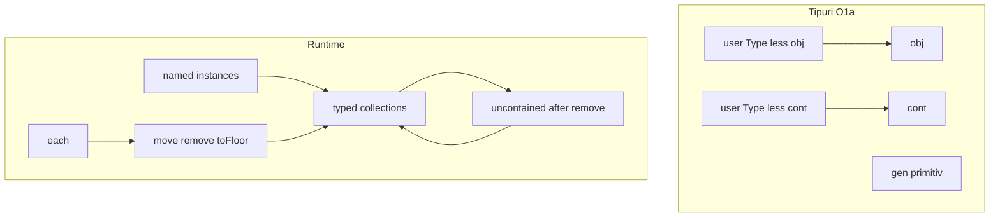

# Plan: PHZ Phase 2 — tipuri, colecții, mișcare

Sursă sketch: [`.cursor/my_ideas/phz_cont_ph2`](d:/wamp64/www/logic/library/logTscript/.cursor/my_ideas/phz_cont_ph2).  
Faza 1: [`doc/phz.md`](d:/wamp64/www/logic/library/logTscript/v0_3_2/doc/phz.md), [`core/phz-engine.js`](d:/wamp64/www/logic/library/logTscript/v0_3_2/core/phz-engine.js).

**Filozofie:** ownership / membership / atribute via property blocks; **nu** fizică continuă.



---

## Decizii închise

| ID | Decizie |
|----|---------|
| **O1a** | Tipuri user: `phz +[T < obj]` sau `phz +[T < cont]` doar. **`gen` nu se extinde.** Built-in rămân sibling (`obj` \| `gen` \| `cont`). O1c era același lucru formulat altfel — rămâne **O1a**. |
| **O2a** | Named objs pot avea **membership** într-o colecție; rămân adresabile ca `.box1` și via path (`:inside:0`). Spawn-urile pot rămâne anonime (acces doar path/`each`); `move = .box1` pentru instanțe denumite. |
| **O3** | `remove` = **doar detach ownership**, nu destroy. Obiectul rămâne; dacă e named (`.box1`) rămâne apelabil; poate fi `move`-uit într-un alt container/colecție. Stare intermediară: **uncontained**. |
| **O4a** | Apartenență **unică**: un obiect în cel mult o colecție; `move` = change membership. |
| **O5** | Gen poate ținti **orice** colecție (`inside = .car1:wheels`). La spawn, obiectul intră în acea listă. Type-check: tipul generat trebuie să fie **compatibil** cu tipul colecției (inclusiv subtipuri — vezi nota O5). |
| **O6** | `:…:type` = **tipul PHZ runtime** (din `gen type: truck` sau din `phz [truck] .t1`). Filtre pe `lot` / `floor` / `id` = atribute normale (ASCII/decimal/special), nu „type”. |
| **O7a** | Cu `each`: snapshot pe colecție; pentru **fiecare** element evaluează `set`; dacă 1, aplică `move`/asignări cu `each` legat de element. `set = EQ(:inside:each:type,"truck")` = predicat per element (nu trigger global O7b). |
| **O8b** | În property block, orice path care începe cu `:` e relativ la **self** (instanța pe care rulează block-ul). `:inside:0` ≈ index pe colecția-vector `inside`, ca `vectorA:0`. |
| **O9a** | Extindem **`comp [motor]`**: păstrăm viteza pe `:get`; adăugăm `maxDistance`, `:distance`, `:laps`. |
| **O10a** | `conveyor` / `elevator` = **tipuri user** (`phz +[conveyor < cont]: …`), nu built-in PHZ. |
| **O11** | `show(.car:wheels)` (și orice colecție) = **vector-like**, ca `:inside`. |
| **O12** | Fără grijă breaking (nimeni nu folosește PHZ încă). Semantică veche→nouă documentată mai jos (capacitate `max` ↔ `inside: obj[16]`, etc.). |

**Toate O1–O12 sunt închise.**

### Notă O5 — compatibilitate tipuri la insert/spawn

Colecție `wheels: wheel[4]` acceptă `wheel` și subtipuri ale lui `wheel`.  
Colecție `trunk: obj[100]` acceptă orice tip care derivează din `obj` (inclusiv `wheel < obj` dacă e cazul).  
Colecție `inside: cont[5]` acceptă tipuri `T < cont` (ex. `wheel < cont`).  
Incompatibil → eroare.

### Notă O1a vs O1c

Ambele spuneau: gen rămâne primitiv, user-types doar din `obj`/`cont`. **Nu există diferență operațională** — planul folosește eticheta **O1a**.

---

## O2a — Named cu membership (închis)

```
phz [obj] .box1::
phz [cont] .room::
.room:{
  move = .box1
  to = .room:inside
  set = 1
}
# .box1 tot adresabil; acum e și membru în .room:inside
16wire id = .box1:id
16wire id2 = .room:inside:0:id   # același obiect
```

Spawn poate continua să creeze **anonime** (doar `:inside:N` / `:each`). Named = create explicit `phz […] .name` (sau tip user), apoi `move` în colecție.

---

## O7a — each + set per element (închis)

Engine: snapshot pe colecție. Pentru fiecare element: leagă `each` → evaluează `set` → dacă 1, aplică `move`/asignări.

```
.conveyor1:{
  move = :inside:each
  to = .conveyor2
  set = EQ(:inside:each:type, "truck")
}
```

(O7b = `set` global fără filtru per element — **respins**.)

**Mitigare:** snapshot la start ca să nu seri/dubleze la mutate în timpul iterației.

---

## O8 — self path (închis O8b)

`:inside:0` pe self = același pattern ca indexarea pe vector. Parserul tratează path-urile PHZ care încep cu `:` ca relative la instanța block-ului.
---

## O12 — Vechea semantică vs noua (fără „breaking” de utilizatori)

Nimeni nu depinde de PHZ; totuși motorul/docs trebuie aliniate.

| Aspect | Faza 1 (azi) | Faza 2 (țintă) |
|--------|----------------|----------------|
| Tipuri | doar `obj`, `gen`, `cont` | + `phz +[T < obj\|cont]` |
| Capacitate | atribut `max` pe cont (default 16) | colecții `name: Type[max]`; default pe `cont`: `inside: obj[16]` (echivalent vechiului max pe lista default) |
| Redeclare `inside` | n/a | `inside: person[4]` pe tip derivat **înlocuiește** tipul element + capacitatea listei `inside` |
| Atributul pout `max` | 16-bit pe cont | **de aliniat:** fie `max` rămâne alias la capacitatea colecției default `inside`, fie dispare în favoarea doar `Type[N]` pe fiecare colecție (de documentat la implementare; preferință: capacitate per colecție, `max` pe cont = capacitatea `inside` pentru compat) |
| Umplere | doar gen → `:inside` | gen → **orice** path de colecție compatibil tip |
| Obiecte în listă | anonime | + move/remove/each; named după O2 |
| Show listă | doar `:inside` | orice colecție, vector-like |
| Motor | viteză `:get` | + `maxDistance`, `:distance`, `:laps` |

---

## Ce aduce faza 2 (features)

| Feature | Intent |
|---------|--------|
| `phz +[New < Base]:` | Base ∈ {`obj`,`cont`} |
| Colecții tipate multiple | `name: Type[max]` |
| `move` / `to` / `toFloor` / `remove` | ownership logic |
| `:each` | iterație internă (O7a) |
| Motor distance/laps | O9a |
| Conveyor/elevator | tipuri user O10a |

---

## Workstreams

### W1 — Tipuri + colecții

- `phz +[car < cont]: inside: person[5]; wheels: wheel[4]; :`
- Instanță `phz [car] .c1:`
- Policy tipuri user
- Fișiere: `parser.js`, `phz-engine.js`, `policy-type-modules.js`

### W2 — Membership

- Apartenență unică (O4a); named cu membership (O2a)
- Stare uncontained după remove (O3)
- Path: `.car1:wheels`, `:count`, `:0:attr`, show vector (O11)

### W3 — move / remove / toFloor + spawn multi-colecție

- Blocks pe cont-like, `on:1`
- Type-check cu subtipuri (O5)
- Gen: `inside = .car1:wheels` (path colecție)

### W4 — each + self path

- O7a + O8b + snapshot
- `EQ(:inside:each:type,"truck")` pe tip PHZ; `EQ(:inside:each:lot,"ABC")` pe attr

### W5 — Motor

- `maxDistance`, `:distance`, `:laps` pe `comp [motor]` (O9a)
- Exemple conveyor/elevator ca tipuri user; citire servo în doc ca `.servo:get` (alias `:value` doar dacă se adaugă explicit)

### W6 — Doc / teste / wave

- `phz.md` faza 2; teste ~3140+; wave pe scenariile cu fire/blocks

---

## Riscuri rămase

| Risc | Mitigare |
|------|----------|
| `each` + mutate listă | snapshot (O7a) |
| Motor viteză vs distance | doc: `:get`=viteză, `:distance`/`:laps`=contori |
| Capacitate `max` vs `Type[N]` | O12: alias `max` ↔ capacitate `inside` |
| Path colecție vs attr scalar | nume de colecție rezervate pe tip |

---

## Criterii de acceptare

- `phz +[T < obj|cont]` (nu `< gen`); instanțe tipate
- Colecții tipate; insert/spawn incompatibil → eroare; subtipuri OK
- Gen țintește orice colecție compatibilă
- `move` / `to` / `toFloor` / `remove` (detach, nu destroy)
- Apartenență unică
- `each` + predicat pe tip PHZ și pe atribute
- Self-path `:…` în blocks
- Show vector pe orice colecție
- Motor `:distance`/`:laps`
- Doc + teste (+ wave)

## Out of scope

- Fizică continuă / coliziuni / `for`/`while`
- Extinderea tipului `gen`
- Built-in `phz [conveyor]` (doar user types)
