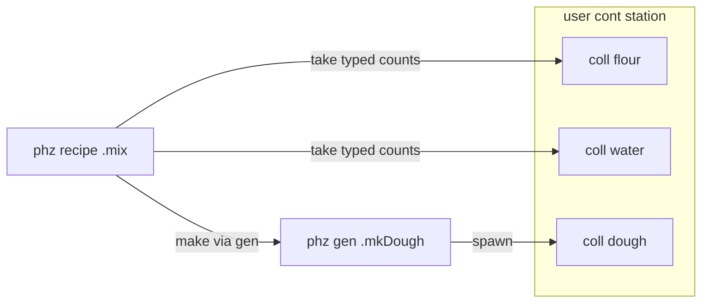
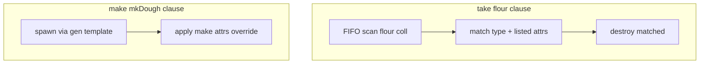

# PHZ: transformări N→M (recipe / stație)

Sursă discuție: plan recipe + review design (aug 2026).  
Doc existent: [`v0_3_2/doc/phz.md`](v0_3_2/doc/phz.md), engine [`v0_3_2/core/phz-engine.js`](v0_3_2/core/phz-engine.js).

## Golul actual

PHZ acoperă deja:

- **creare** — `gen` + `add` / `inside` / `set` (0→N din template)
- **mutare** — `move` / `to` / `toFloor` / `each`
- **detach** — `remove` → uncontained (**nu** distruge)

Nu există o operație **atomică** „consumă N, produce M”. Filozofia din phz.md cere stații ca **user types** `cont`, timing în LogTScript, `gen` doar ca stamp de ieșire.

## Direcție aleasă



1. **Stație** = `phz +[mixer < cont]:` cu colecții tipate (`flour:`, `water:`, `dough:`).
2. **Rețetă** = kind nou **`phz [recipe]`** (named, fără `id`, nu în container, nu se subclass-uiește).
3. **Definiție** = `take:` / `make:` ca **map literals** `{ … }` (multiline sau one-line cu virgule).
4. **Rulare** = property-block pe stație: `run` + `set` + override-uri opționale **`with:`**.
5. **Consume** = **destroy** atomic; **produce** = spawn prin gen-urile listate în **`make:`** (singura locație unde apar gen-urile).

## Sintaxă rețetă — map `{ }`

**Multiline:**

```logts
phz [recipe] .mix:
  take: {
    flour: 1
    water: 1
  }
  make: {
    .mkDough: 1
  }
  :
```

**One-line (virgule în `{ }`):**

```logts
phz [recipe] .mix:
  take: { flour: 1, water: 1 }
  make: { .mkDough: 1, .mkWaste: 1 }
  :
```

### Câmpuri rețetă

| Câmp | Rol |
|------|-----|
| `take: { Type: N, … }` | consumă N obiecte de tip `Type` (user type sau `obj`) din colecția potrivită pe stație |
| `make: { .genName: M, … }` | produce M obiecte spawn-ate prin gen-ul respectiv |

Chei `take` = **nume tip** PHZ. Chei `make` = **referință gen** (`.mkDough`, `.mkWaste`, …). Nu există câmp separat `gen:` — tot ce ține de output stă în `make`.

Parser: extindere la atributele PHZ recipe pentru valori **map literal** `{ key: decimal, … }` (virgule opționale, newlines OK).

## Execuție pe stație — `run` + `with:`

Rețeta e **baza**; la fiecare rulare userul poate devia fără a redefini rețeta:

```logts
.m1:{
  run = .mix
  with:take:flour = 2
  with:make:dough = 2
  set = ready
}
```

### Reguli `with:`

| Formă | Efect |
|-------|--------|
| `with:take:<type> = N` | înlocuiește count-ul din `take` pentru acel tip; dacă tipul nu e în rețetă → **eroare** (nu adaugă take nou în v1) |
| `with:make:<type> = M` | înlocuiește count-ul pentru toate intrările `make` al căror `gen.type` e `<type>` |
| `with:make:.mkDough = M` | override explicit pe gen (când rețeta are mai multe gen-uri) |

Valorile `with:` sunt wireLiterals / expresii ca la celelalte property blocks (ex. `with:take:flour = batchSize`).

**De ce are sens:** rețeta = comportament normal; `with:` = excepții locale fără duplicarea definițiilor `.mix` / `.mixDouble`.

Fără niciun `with:` → counts exact din definiția rețetei.

## Exemplu complet fabrică

```logts
phz +[flour < obj]: :
phz +[water < obj]: :
phz +[dough < obj]: :

phz [gen] .mkDough:
  type: dough
  :

phz [gen] .mkWaste:
  type: obj
  :

phz [recipe] .mix:
  take: { flour: 1, water: 1 }
  make: { .mkDough: 1, .mkWaste: 1 }
  :

phz +[mixer < cont]:
  flour: flour[10]
  water: water[10]
  dough: dough[10]
  :

phz [mixer] .m1::

.m1:{
  run = .mix
  set = ready
}

.m1:{
  run = .mix
  with:take:flour = 2
  with:make:dough = 2
  set = doubleBatch
}
```

## Semantică atomică la `set = 1`

1. Rezolvă counts efective: `recipe` + merge `with:` (override wins).
2. Verifică `take` pe stație (≥ N per tip, FIFO consume).
3. Verifică `make` overflow pe colecțiile de ieșire.
4. Dacă eșuează → eroare, **zero** modificări.
5. Destroy input-uri (named în colecție → eroare v1).
6. Spawn output-uri prin gen-urile din `make`.
7. Signal Trace: `phz recipe .mix on .m1 take flour=2… make dough=2…` (counts **efective**).

`run` fără `set` / `set=0` → no-op.

**Potrivire colecții:** exact o colecție compatibilă per tip; ambiguitate → eroare.

## Ce nu schimbăm

- `gen` — doar template + spawn direct (fără consume)
- `remove` — detach-only
- fără built-in `mixer` / `cutter`
- un pulse = o aplicare (batch repetat = `times` în fază ulterioară)

## Implementare (când se execută planul)

- Parser: kind `recipe`, map literals `{ }`, property fields `run`, `with:take:*`, `with:make:*`
- `v0_3_2/core/phz-engine.js`: `recipes`, `destroyObject`, `runRecipe(host, recipeName, overrides)`
- `v0_3_2/core/interpreter.js`: property-block pe cont-like
- Docs + teste: map one-line/multiline, `with:` override, insufficient/overflow, trace cu counts efective

## Decizii fixate (fază 1)

- **Consume = destroy**
- **Definiție rețetă = `{ }` maps** (indent-only respins pentru take/make)
- **Gen-uri doar în `make:`** — fără câmp `gen:` separat
- **Override la execuție = `with:take:` / `with:make:`** (counts)
- **`with:make:<type>`** rezolvă prin `gen.type`; **`with:make:.gen`** pentru caz multi-gen explicit
- **Fază 1 = tip + count only** — fără filtre/setări de atribute (vezi fază 2 mai jos)

---

## Fază 2 (viitor): atribute la take / make

### Problema

Uneori nu e suficient „1× flour” — trebuie flour **la 22°C pe floor 0**, water **la 50°C**, iar dough produs **la 89°C pe floor 1**. Tipul alone nu descrie starea fizică discretă pe care PHZ o modelează deja prin atribute.

### Propunere: aceeași map, valoare **scalară sau obiect**

Shorthand fază 1 rămâne valid:

```logts
flour: 1          // ≡ flour: { count: 1 }
.mkDough: 1        // ≡ .mkDough: { count: 1 }
```

Fază 2 extinde valoarea la obiect cu `count` + atribute:

```logts
phz [recipe] .mixHot:
  take: {
    flour: { count: 1, temperature: 22, floor: 0 }
    water: { count: 1, temperature: 50 }
  }
  make: {
    .mkDough: { count: 1, temperature: 89, floor: 1 }
  }
  :
```

Cheia rezervată **`count`** e obligatorie când folosești formă obiect (restul = nume atribut PHZ, valori ca la definiția `phz [obj]` — decimal, `(W)`, etc.).

### Semantică take (consum)

Pentru `flour: { count: 1, temperature: 22, floor: 0 }`:

1. Găsește colecția compatibilă cu tipul `flour`.
2. Parcurge obiectele **FIFO** (`:0`, `:1`, …).
3. Un obiect **match-uiește** dacă tipul e compatibil **și** fiecare atribut listat e **egal bit-cu-bit** (după normalizare lățime) cu valoarea cerută.
4. Atribute **nelistate** = wildcard (orice valoare).
5. Consumă exact `count` match-uri; dacă nu găsește destule → eroare atomică (ca overflow).

Exemplu: flour la 22°C ≠ flour la 30°C — nu se amestecă pe tăcute.

### Semantică make (producție)

Pentru `.mkDough: { count: 1, temperature: 89, floor: 1 }`:

1. Spawn `count` obiecte prin gen `.mkDough` (template gen ca acum).
2. După spawn, aplică atributele listate pe fiecare obiect nou — **override** față de template unde e specificat.
3. Atribute nelistate rămân din template gen.

Asta e echivalentul „stamp + post-process”, dar atomic într-o singură tranzacție recipe.

### Override `with:` — counts (fază 1) și atribute (fază 2)

`with:` se scrie **în property-block-ul stației**, alături de `run` și `set`. La `set = 1`, engine-ul construiește mai întâi clauzele **efective** = rețetă + merge `with:` (override câștigă).

#### Counts (fază 1)

```logts
.m1:{
  run = .mix
  with:take:flour = 2
  with:make:dough = 2
  set = ready
}
```

| Formă | Efect |
|-------|--------|
| `with:take:<type> = N` | schimbă `count` pentru singura clauză `take` a tipului `<type>` |
| `with:make:<type> = M` | schimbă `count` pentru toate intrările `make` cu `gen.type == <type>` |
| `with:make:.mkDough = M` | schimbă `count` doar pe gen-ul `.mkDough` |

Valorile pot fi wire / expresie: `with:take:flour = batchSize`.

#### Atribute (fază 2)

Când rețeta are `{ count, temperature, floor, … }`, `with:` poate modifica **count** sau **orice atribut** listat:

```logts
phz [recipe] .mixHot:
  take: {
    flour: { count: 1, temperature: 22, floor: 0 }
    water: { count: 1, temperature: 50 }
  }
  make: {
    .mkDough: { count: 1, temperature: 89, floor: 1 }
  }
  :

.m1:{
  run = .mixHot
  with:take:flour = 2
  with:take:flour:temperature = 24
  with:take:flour:floor = 1
  with:take:water:temperature = 55
  with:make:dough:temperature = 90
  with:make:dough:floor = 2
  with:make:.mkDough:floor = 2
  set = processWire
}
```

| Formă | Efect |
|-------|--------|
| `with:take:<type>:<attr> = V` | pe clauza `take` a tipului `<type>`: setează sau **înlocuiește** constrângerea `<attr> = V` |
| `with:make:<type>:<attr> = V` | pe toate clauzele `make` cu acel tip produs: setează attr la spawn |
| `with:make:.gen:<attr> = V` | doar pe gen-ul respectiv |

**Merge:**

- Rețeta = baseline.
- `with:take:flour = 2` → doar `count` devine 2; `temperature` / `floor` rămân din rețetă dacă nu sunt și ele override-uite.
- `with:take:flour:temperature = 24` → doar temperatura cerută la consum devine 24.
- Attr **nou** prin `with:` (lipsea în rețetă) → se **adaugă** ca filtru suplimentar (strictește take) sau ca valoare la make.

**Array take — două `flour` diferite:** index pe clauză (0-based):

```logts
take: [
  { flour: { count: 1, temperature: 22, floor: 0 } }
  { flour: { count: 1, temperature: 50 } }
]

.m1:{
  run = .mixHot
  with:take:0:flour:temperature = 20
  with:take:1:flour:temperature = 48
  set = ready
}
```

| Formă | Efect |
|-------|--------|
| `with:take:<index>:<type>:<attr> = V` | override doar pe clauza `<index>` din lista `take` |
| `with:take:<index>:<type> = N` | override count pe clauza `<index>` |

Fără index → se aplică clauzei **unice** map pentru acel `<type>` (ca mai sus). Cu index obligatoriu când rețeta folosește `take: [ … ]` și vrei să targetezi o clauză anume.

Aceeași regulă de index pentru `make: [ … ]` dacă e nevoie: `with:make:0:.mkDough:temperature = 90`.

#### Exemplu combinat (lot dublu + temperatură din wire)

```logts
8wire targetTemp = 00011000

.m1:{
  run = .mixHot
  with:take:flour = 2
  with:take:flour:temperature = targetTemp
  with:make:dough:temperature = targetTemp
  set = AND(ready, EQ(targetTemp, 00011000))
}
```

Counts și attrs se rezolvă **înainte** de verificarea take / spawn — trace-ul arată valorile efective.

### Același tip, constrângeri diferite — formă array

Map-ul nu permite două chei `flour`. Când ai nevoie de **două take-uri flour cu temperaturi diferite**, treci la **listă de clause-uri**:

```logts
take: [
  { flour: { count: 1, temperature: 22, floor: 0 } }
  { flour: { count: 1, temperature: 50 } }
  { water: 1 }
]
```

Fază 1 rămâne map-only; array apare doar când e nevoie (fază 2). Parser: `take` / `make` acceptă `{ … }` **sau** `[ { … }, … ]`.

### Ce NU intră în fază 2 inițial

| Exclus (later) | Motiv |
|----------------|--------|
| intervale `temperature: 20..25` | necesită mini-limbaj de predicate |
| „există attr X” fără valoare | mai puțin clar decât egalitate exactă |
| match parțial / fuzzy | contrar modelului discret PHZ |
| copiere attr de la input la output (`temperature: from:flour`) | sugar util, dar fază 3 |

### Trace (fază 2)

```text
phz recipe .mixHot on .m1 take flour=1 temp=22 floor=0 … make dough=1 temp=89 floor=1
```

Afișează constrângerile **efective** (după `with:`).

### Legătură cu filozofia PHZ

- Atributele rămân **biți / pouts** — nu inventăm fizică continuă.
- Rețeta descrie **starea discretă** necesară intrare/ieșire; stația + colecțiile rămân user `cont`.
- `gen` template + override în `make` = același pattern ca spawn + attr write, doar atomic.



### Todo fază 2 (separat de implementarea fază 1)

- Parser: valoare scalar | `{ count, attrs… }` | array de clause-uri
- Engine: `matchObjectsByClause`, `spawnWithAttrs`
- `with:take|make:…:attr` în property block
- Teste: hot/cold flour, wrong temp rejected, make floor override, array duplicate type

---

## Decizii și review design

Review al direcției (fără schimbare de abordare principală). Secțiune pentru ce e de clarificat la implementare și convenții de documentat.

### Ce confirmăm (direcția rămâne)

- **Separare roluri:** rețetă = transformare; stație = topologie; `gen` = șablon obiect; LogTScript = timing (`set`, `ready`, servo/motor).
- **Tranzacție atomică** take+make — fără consum/producție parțială la un singur pulse.
- **`with:`** — rețetă ca default, excepții la call site; evită duplicarea rețetelor.
- **Fază 1 apoi fază 2** — tip+count, apoi attrs / array / `with:` pe attrs.
- **`destroy` la recipe take** vs `remove` detach-only — corect pentru fabrică.

### Probleme / zone neclare de rezolvat

| Zonă | Risc | Direcție propusă |
|------|------|------------------|
| **Routing colecții (take)** | Ambiguitate dacă stația are două colecții compatibile cu același tip (ex. `flour:` + `inside: obj` cu flour) | **Eroare la `run`** dacă nu există **exact o** colecție compatibilă; nu ghicim |
| **Routing colecții (make)** | `.mkDough` + `.mkWaste` — unde merge waste? `obj` generic vs `dough` tipat | **Convenție doc:** colecție dedicată `waste:` / `scrap:` pe stație; altfel match ca la take după `gen.type` |
| **Named în colecție la consume** | User pune `.box1` în hopper — recipe refuză destroy | Păstrăm **eroare v1**; mesaj clar + doc |
| **`with:` lung cu index** | `with:take:1:flour:temperature` greu de citit | Acceptabil v1/v2; sugar `with:take[1]:…` doar dacă deranjează în practică |
| **Map vs array** | Două forme mentale | OK: map 90% cazuri; array când același tip apare de 2+ ori cu attrs diferite |
| **Match exact attrs (fază 2)** | „Orice flour” / „temp ≥ X” imposibil fără intervale | Documentăm limitarea; intervale = fază ulterioară |
| **Rețetă globală vs stație locală** | `.mix` pe alt layout → eșec runtime | Doc: rețeta presupune anumite colecții tipate pe host |
| **Un pulse = o aplicare completă** | Fără „ia cât ai, produce cât poți” | Out of scope v1; rețete mici sau `times` mai târziu |

### Decizii recomandate (fază 1)

1. **Layout stație:** câte un port tipat per material (`flour:`, `water:`, `dough:`); evită `inside: obj` amestecat cu recipe tipat pe aceeași mașină.
2. **Waste / by-product:** stațiile cu `make` multi-gen documentează colecția `waste:` (sau `scrap:`) pentru output `obj` / tipuri auxiliare.
3. **Prim exemplu:** fabrică simplă mix → (opțional cut/pack) înainte de attrs — validează routing-ul înainte de fază 2.
4. **Signal Trace:** linie scurtă; la fază 2 preferă attrs **efective** (post-`with:`), eventual doar cele non-default.
5. **allow/notallow:** include kind `recipe` alături de `obj` / `gen` / `cont`.

### De amânat (fază 2.5+)

- **`from:` / `to:`** pe clauză take/make — doar dacă ambiguitatea colecțiilor apare des în practică.
- **Intervale / predicate** pe attrs (`temperature: 20..25`).
- **Copiere attr** input → output (`temperature: from:flour`).
- **Batch parțial** („consumă cât există”).

### Verdict

Direcția **`recipe` + `run` + `with:` + stații `cont` tipate** rămâne. Prioritate la implementare: **reguli explicite de routing colecții** (take + make) și **convenția waste** — restul (attrs, array, index în `with:`) e evoluție naturală pe același schelet.
