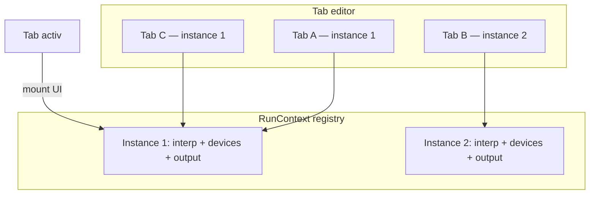

# Plan: instanțe paralele în script editor

## Obiectiv

Permite rularea a 2+ scripturi **în paralel** în aceeași pagină, fiecare pe o **instanță** numerică (default **1**). Fiecare **tab** editor are propriul număr de instanță; tab-uri cu același număr **împart** același runtime (comportament ca azi). La schimbarea tab-ului, UI-ul afișează starea instanței legate de acel tab.



## Model de date

### Per tab ([`ui/editor.js`](v0_3_2/ui/editor.js))

Extindere obiect tab (persistat în `localStorage` `prog/tabs`, `version: 2`):

- `instance: number` — default `1`, range **1–5** (maxim 5 instanțe paralele)
- `astText: string | null` — ultimul AST de la Run pe acest tab (sau parse la cerere)
- (existent) `propagation`, `hasRun`, `code`, etc.

**Selector instanță** în toolbar (lângă Run): dropdown cu opțiuni 1–5; butonul/triggerul afișează **`Inst: N`** (ex. `Inst: 1`). La schimbare → salvează `tab.instance`; la `tabShowCurrent()` restaurează textul și selecția.

### Per instanță — `RunContext` nou în [`ui/app.js`](v0_3_2/ui/app.js)

```javascript
{
  id: 1,
  interp: Interpreter | null,
  out: string[],
  outBlocks: [],
  varsSnapshot: string,      // text pentru #vars
  devicesRoot: HTMLElement,  // subarbore DOM dedicat
  timelineSamples: [...],    // date pentru TimelineAnalyzer
  timelinePaused: boolean,
  lastProcessedSource: string,
  // SEC / NEXT (per instanță — auto-next poate rula în paralel)
  secTimerId: null,
  currentInterval: 1000,
  currentIdx: 0,
}
```

Registry: `Map<number, RunContext>`, `activeContext` pointer pentru tab-ul curent.

`globalInterp` devine proxy sau înlocuit cu `getActiveInterp()` → `activeContext.interp` (păstrăm alias temporar pentru compatibilitate minimă în core).

## Comportament la acțiuni

| Acțiune | Comportament |
|---------|----------------|
| **Run** | Rulează pe `tab.instance`; creează/reînlocuiește `RunContext` pentru acea instanță; **nu** oprește alte instanțe |
| **Tab switch** | Salvează snapshot UI curent → încarcă `RunContext` al `tab.instance` în `#out`, `#vars`, `#devices`, timeline, AST, butoane S/1 |
| **NEXT** | `doNext()` pe interp-ul instanței tab-ului activ |
| **S / 1** (`toggleSEC`, `changeSECINT`) | Timer auto-`doNext` **per instanță**; la switch tab, butonul S reflectă starea instanței vizate |
| **Aceeași instanță, 2 tab-uri** | Același interp, devices, output; AST **per tab** (cod diferit) |
| **Instanțe diferite** | Rulare paralelă; oscilatoare/timere independente |

## Panouri legate de context

La `activateRunContext(ctx)`:

1. **Output** — `render(ctx.out, ctx.outBlocks)` în `#out` (sau swap innerHTML salvat)
2. **Variables** — `#vars.textContent = ctx.varsSnapshot`
3. **Devices** — montează `ctx.devicesRoot` în `#devices` (subarbore per instanță, nu un singur `innerHTML = ''` global la Run)
4. **Timeline** — `timelineAnalyzer.reset(ctx.timelineSamples)` + stare pause ([`ui/timeline-analyzer.js`](v0_3_2/ui/timeline-analyzer.js))
5. **AST** — `#ast` din `tab.astText` (salvat la Run); parse live doar dacă există acțiune explicită
6. **Run button** — `hasRun` per tab; culoare după **instanța tab-ului** (vezi mai jos)

## Culori per instanță (UI)

Înlocuim verdele unic de azi (`btn-run-active`, `tab-run-current`) cu **5 palete** legate de numărul instanței. Verde rămâne instanța **1** — compatibil cu comportamentul actual.

| Instanță | Rol vizual | Culoare (orientativ) |
|----------|------------|----------------------|
| **1** | Verde (existent) | gradient `#3daf5c` / `#2d9448`, border `#5fdc8c` |
| **2** | Albastru | gradient albastru (ex. `#2f80ff` / `#1f66e0`) |
| **3** | Portocaliu | gradient portocaliu (ex. `#e67e22` / `#d35400`) |
| **4** | Indigo | gradient indigo (ex. `#5b6ee8` / `#434fad`) |
| **5** | Cyan | gradient cyan (ex. `#17a2b8` / `#128a9e`) |

**Buton Run** ([`script_editor_v0_3_2.html`](v0_3_2/script_editor_v0_3_2.html) + [`ui/editor.js`](v0_3_2/ui/editor.js)):

- Fără Run pe tab: stil normal (`.btn`)
- După Run reușit (`hasRun`): clasă `btn-run-active btn-run-inst-N` → **background = culoarea instanței** `tab.instance` (nu mereu verde)
- La schimbare instanță pe tab (înainte/după Run): `updateRunButtonUI()` aplică paleta corectă

**Tab-uri** (`fShowTabs()` în [`ui/editor.js`](v0_3_2/ui/editor.js)):

- Tab cu `hasRun` pe **alt** tab: `tab-run tab-run-other tab-run-inst-N` — variantă **muted** a culorii instanței N a acelui tab
- Tab activ cu `hasRun`: `tab-run tab-run-current tab-run-inst-N` — variantă **saturată** (gradient) a instanței N
- Tab fără Run: stil neutru (ca azi, fără `tab-run`)

CSS nou în HTML: `.btn-run-inst-1` … `.btn-run-inst-5`, `.tab-run-inst-1` … `.tab-run-inst-5` (+ variante `-current` / `-other` sau modificatori pe același prefix). Constantă partajată în `ui/run-context.js` sau `ui/instance-colors.js`: `INSTANCE_COLORS = { 1: {...}, ... }`.

**Selector `Inst: N`**: la schimbarea instanței, actualizăm și preview-ul culorii pe Run dacă tab-ul are deja `hasRun` (instant feedback).

## Refactor device-uri (punct critic)

Azi toate widget-urile folosesc Map-uri globale + `document.getElementById('devices')` ([`devices/renderers.js`](v0_3_2/devices/renderers.js), `terminal.js`, `panel-keyboard.js`, `alu-devices.js`, etc.).

**Abordare:** introducem [`ui/run-context.js`](v0_3_2/ui/run-context.js) (nou):

- `getActiveRunContext()` / `setActiveRunContext(id)`
- `createDeviceMaps()` → `{ leds, terminalDisplays, panelKeyboards, panelKeys, clcdDisplays, alus, ... }` per instanță
- Wrapper-e sau patch la funcțiile `addLed`, `addTerminal`, `setLed`, `showDevices` să citească maps din contextul activ

La Run pe instanță: curățăm doar contextul acelei instanțe (nu `leds.clear()` global).

`showVars()` / `render()` din [`ui/app.js`](v0_3_2/ui/app.js) folosesc interp + output din contextul activ.

Core (`interpreter.js`, `signal-propagation.js`, `keyboard.js`) apelează `showVars()` global — rămâne OK dacă `showVars` scrie în contextul activ și doar când instanța respectivă e activă **sau** actualizează snapshot-ul instanței chiar dacă tab-ul e în background (preferat: **actualizează snapshot**, refresh DOM doar dacă e instanța activă).

## UI HTML — toolbar (ordine butoane)

În [`script_editor_v0_3_2.html`](v0_3_2/script_editor_v0_3_2.html), bara de control (stânga → dreapta):

1. **Run**
2. **Inst: N** (selector instanță 1–5)
3. **wave / legacy** (`#propMode`, `togglePropagationMode`)
4. **Next** (`doNext(1)`) — **mutat imediat în dreapta** toggle-ului propagation (azi e înainte de el)
5. **S** / **1** (auto-next SEC)
6. Win ▾, Comp ▾, …

```html
<button onclick="run()" id="runBtn" class="btn">Run</button>
<!-- inst dropdown Inst: N -->
<button type="button" id="propMode" class="btn prop-toggle …" onclick="togglePropagationMode()">wave</button>
<button onclick="doNext(1)" class="btn">Next</button>
<button onclick="toggleSEC()" id="sec" class="btn">S</button>
<button onclick="changeSECINT()" id="secint" class="btn">1</button>
```

Selector instanță (după Run):

```html
<div class="inst-dropdown">
  <button type="button" id="instBtn" class="btn" onclick="toggleInstMenu()">Inst: 1</button>
  <div id="instMenu" class="inst-menu">
    <button type="button" data-inst="1">Inst: 1</button>
    … <!-- până la 5 -->
  </div>
</div>
```

Alternativ: `<select id="runInstance">` stilizat, dar labelul vizibil trebuie să fie mereu **`Inst: N`**. `onInstanceChange()` → `tab.instance = N`, `instBtn.textContent = 'Inst: ' + N`, `updateRunButtonUI()`, `fShowTabs()`.

## Eliminare panou Command

Scoatem complet:

| Fișier | Ce se șterge |
|--------|----------------|
| [`script_editor_v0_3_2.html`](v0_3_2/script_editor_v0_3_2.html) | `#cmdPanel`, `#cmdInput`, buton Send, item Win ▾ → Command |
| [`ui/app.js`](v0_3_2/ui/app.js) | `sendCmd()`, listener `cmdInput`, ramura `panelName === 'command'` |
| [`ui/panels.js`](v0_3_2/ui/panels.js) | `toggleCmd()` |
| Doc (dacă există referințe) | mențiune Command panel în [`doc/`](v0_3_2/doc/) — actualizare minimă |

Nu mai planificăm migrare `sendCmd` la instanțe — panoul dispare.

## Fișiere principale de modificat

1. [`ui/run-context.js`](v0_3_2/ui/run-context.js) — **nou**: registry, activate, snapshot, device maps
2. [`ui/app.js`](v0_3_2/ui/app.js) — `run()`, `doNext`, SEC, `showVars`, `render`, `getActiveInterp`
3. [`ui/editor.js`](v0_3_2/ui/editor.js) — `instance` pe tab, persist v2, `tabShowCurrent` → `activateRunContext`
4. [`script_editor_v0_3_2.html`](v0_3_2/script_editor_v0_3_2.html) — selector `Inst: N` (1–5), CSS culori instanță, toolbar reordonat, ștergere Command
5. [`devices/*.js`](v0_3_2/devices/) — routing prin context activ (batch update fișiere cu `getElementById('devices')`)
6. [`ui/timeline-analyzer.js`](v0_3_2/ui/timeline-analyzer.js) — export/import samples pentru swap instanță (dacă lipsește API)

## Migrare localStorage

- `prog/tabs` `version: 1` → `version: 2`: la restore, `instance: 1` pentru tab-uri vechi
- Opțional: cheie `prog/instances` pentru rehidratare interp (out of scope v1 — instanțele mor la refresh pagină, ca azi)

## Testare manuală

1. Tab A inst 1: Run LED; Tab B inst 2: Run terminal — ambele vizibile după switch
2. Tab C inst 1: același LED state ca Tab A
3. Auto-next (S) pe inst 2 în background; switch la inst 2 — timeline/vars actualizate
4. AST diferit per tab după Run
5. Command panel absent; Win ▾ fără intrare Command
6. Refresh pagină — tab-uri + instance number persistate; runtime gol până la Run
7. Tab inst 2 Run → tab albastru; Run albastru; tab inst 1 rămâne verde
8. Două tab-uri aceeași instanță → aceeași culoare pe ambele (dacă hasRun)
9. Toolbar: ordinea Run → Inst → wave → Next → S → 1

## Ce NU facem în această fază

- Persistență interp între refresh-uri browser
- Instanțe > 5 sau UI dinamic add/remove
- Modificări la `run_tests.html` / `test_session.js` (rămân izolate fără DOM)
