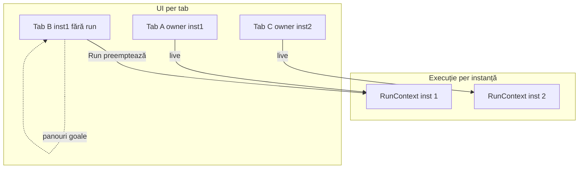

# Plan: instanțe paralele în script editor

## Obiectiv

Două straturi distincte:

| Strat | Rol |
|-------|-----|
| **Instanță (1–5)** | Slot de **execuție** — un singur `RunContext` live per număr; poate rula în background când tab-ul owner nu e vizibil |
| **Tab** | **Afișare UI** — panouri (Output, Variables, Devices, Timeline, AST) și Run verde legate de tab, nu de instanță la switch |

Tab-urile aleg **pe ce instanță** rulează (`Inst: N`), dar **nu** împart panourile live la switch. Comportament azi păstrat: Run verde = **acest tab** rulează acum.



## Model mental (confirmat)

1. **Tab A** Run pe inst 1 → Run **verde** pe A, panouri live, A = **owner** inst 1.
2. **Switch Tab B** (inst 1, fără Run) → panouri **goale**, Run **nu** e verde; inst 1 poate continua în **background** (owner rămâne A).
3. **Revenire Tab A** (încă owner, B n-a făcut Run) → panouri **live** (starea a evoluat în background).
4. **Run Tab B** pe inst 1 → **preempție**: oprește context inst 1, salvează **snapshot înghețat** pe A, A pierde verde (și pe tab strip), B devine owner, panouri live pe B.
5. **Revenire Tab A** după preempție → panouri = **snapshot înghețat** de la ultimul Run al lui A (nu live).

**Instanțe diferite** (A inst 1, C inst 2): execuție paralelă; fiecare tab owner pe instanța lui.

## Ordine implementare

**Faza 0** — Command + toolbar + separator (fără RunContext)

**Faza 1** — `run-context.js`, owner registry, `hasRun`/`isLiveOwner`, selector Inst

**Faza 2** — `tab.panelSnapshot`, `mountTabPanels`, device maps, preempție la Run

**Faza 3** — culori, swatch, Next/S disabled, SEC indicator, titlu tab

## Model de date

### Per tab ([`ui/editor.js`](v0_3_2/ui/editor.js))

Persistat `prog/tabs` `version: 2`:

- `instance: number` — default `1`, range **1–5**
- `astText: string | null` — AST la ultimul Run **pe acest tab**
- `panelSnapshot: null | { out, outBlocks, varsSnapshot, timelineSamples, devicesHtml?, astText }` — stare **înghețată** (la preempție)
- (existent) `propagation`, `code`, …

**Nu** persistăm snapshot în localStorage v1 (prea mare) — doar în sesiune; la refresh snapshot dispare.

**Propagation per tab** — la Run se folosește modul tab-ului care preemptează.

**`isLiveOwner(tab)`** = `instanceOwners.get(tab.instance) === tab.id`

**`hasRun` / Run verde / culoare tab** = `isLiveOwner` (comportament ca azi: verde doar pe tab-ul care **rulează acum** pe instanța lui).

### Registry instanță ([`ui/run-context.js`](v0_3_2/ui/run-context.js))

```javascript
// Care tab deține execuția live pe instanța N
const instanceOwners = new Map(); // instanceId → tabId

{
  id: 1,
  ownerTabId: number | null,
  interp: Interpreter | null,
  out, outBlocks, varsSnapshot,
  devicesRoot, deviceMaps,
  timelineSamples, timelinePaused,
  lastProcessedSource,
  secTimerId, currentInterval, currentIdx,
}
```

La `createInterpreter`: `interp._instanceId = ctx.id`.

### showVars / render (background)

- Actualizează mereu `RunContext` al `interp._instanceId`.
- Refresh DOM **doar** dacă tab-ul activ este `instanceOwners.get(id)` (owner vizibil).
- Altfel execuția avansează în background fără a umple panourile tab-ului curent.

## Comportament la acțiuni

| Acțiune | Comportament |
|---------|----------------|
| **Run** | Pe `tab.instance`; dacă alt tab era owner pe aceeași instanță → **preempție** (stop SEC/osc, snapshot pe vechiul owner, `hasRun=false` acolo) |
| **Run** | Creează/reînlocuiește `RunContext`; tab curent devine owner; `hasRun=true` doar pe el |
| **Run** | **Nu** oprește instanțe cu alt număr |
| **Tab switch** | `mountTabPanels(tab)`: owner → live ctx; snapshot → înghețat; altfel → **gol** |
| **NEXT / S / 1** | Doar dacă tab activ `isLiveOwner` și `ctx.interp`; altfel **disabled+gri** |
| **SEC în background** | Pe instanța owner absent din vedere — timer rulează; indicator discret pe tab owner în strip |
| **Închidere tab** | Dacă era owner → oprește instanța; dacă ultimul tab cu `instance===N` → `registry.delete(N)` |

### Preempție (detaliu)

La Run pe tab B, instanța `N` deținută de tab A:

1. `freezePanelSnapshot(A)` din `RunContext` curent
2. Oprește `secTimerId`, oscilatoare, curăță `RunContext` N
3. `A.hasRun = false` (via clear owner), `fShowTabs()`
4. Rulează programul lui B pe inst N; B devine owner

### mountTabPanels(tab)

```
if isLiveOwner(tab)     → activateRunContext live + astText tab
else if tab.panelSnapshot → render snapshot (read-only vizual)
else                     → clearOutput, clear vars/devices/timeline/ast
```

## Panouri — per tab (nu per instanță la switch)

| Vizualizare tab | Output / Vars / Devices / Timeline | AST |
|-----------------|-----------------------------------|-----|
| Owner live | `RunContext` live | `tab.astText` |
| După preempție | `tab.panelSnapshot` înghețat | din snapshot sau `tab.astText` |
| Niciodată rulat / alt tab activ | **Gol** (ca „nu rulează”) | gol sau `astText` dacă a rulat în trecut în sesiune |

## Culori per instanță (UI)

| Inst | Culoare |
|------|---------|
| 1 | Verde `#3daf5c` / `#2d9448` |
| 2 | Albastru `#2f80ff` / `#1f66e0` |
| 3 | Portocaliu `#e67e22` / `#d35400` |
| 4 | Indigo `#5b6ee8` / `#434fad` |
| 5 | Cyan `#17a2b8` / `#128a9e` |

- Run verde + `btn-run-inst-N` **doar** când `isLiveOwner`
- Tab strip colorat **doar** pe tab-uri `isLiveOwner` (nu pe tab-uri cu doar snapshot)
- Swatch pe selector `Inst: N`; contrast inst 4/5
- SEC: indicator pe tab owner când `secTimerId` activ

## Refactor device-uri

`getDeviceMaps()` / `getDevicesContainer()` din contextul instanței **owner** la Run și la refresh DOM live.

Snapshot devices: serializare HTML subarbore sau re-render static la mount snapshot (preferat: clone `devicesRoot` la freeze).

## UI HTML — toolbar

```
[ Run ] [ Inst: N ] [ wave ]  |  [ Next ] [ S ] [ 1 ]  |  Win ▾ …
```

`updateStepControlsUI()`: enabled doar când `isLiveOwner(currentTab)`.

## Eliminare panou Command

Ca în plan anterior — HTML, `app.js`, `panels.js`, doc.

## Fișiere principale

1. [`ui/run-context.js`](v0_3_2/ui/run-context.js) — nou
2. [`ui/app.js`](v0_3_2/ui/app.js) — run, preempție, mountTabPanels
3. [`ui/editor.js`](v0_3_2/ui/editor.js) — instance, owner, snapshots, tab close
4. [`script_editor_v0_3_2.html`](v0_3_2/script_editor_v0_3_2.html)
5. [`devices/*.js`](v0_3_2/devices/)
6. [`ui/timeline-analyzer.js`](v0_3_2/ui/timeline-analyzer.js)

## Testare manuală

1. A inst1 Run → verde; switch B inst1 fără run → panouri goale, Run normal
2. Revenire A (B n-a rulat) → live, verde, state actualizat în background
3. B Run inst1 → A fără verde; A la revenire → snapshot înghețat
4. C inst2 paralel cu B inst1 — ambele owner, switch corect
5. Next/S disabled pe B înainte de Run; enabled pe B după Run owner
6. Preempție oprește SEC pe vechiul owner
7. Închidere tab owner → instanță eliberată
8. Faza 0 toolbar + fără Command

## Ce NU facem

- Persistență runtime/snapshot la refresh
- Instanțe > 5
- `run_tests.html` / `test_session.js`
- Sync hasRun pe toate tab-urile aceleiași instanțe (model vechi „opțiunea 2” — **respins**)
