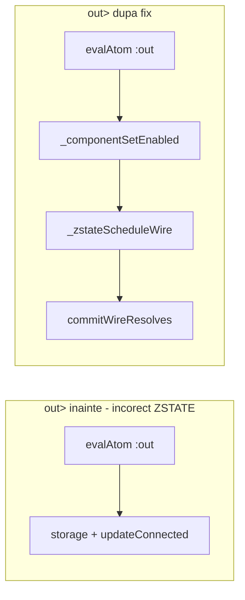

# Plan: finalizare multi-driver-paths (out>=)

**Status:** ✅ implementat — regresie **946/946** verzi.

Plan părinte: [tristate_bus_buffer.plan.md](tristate_bus_buffer.plan.md) (todo `multi-driver-paths`).

## Context

Todo-ul `multi-driver-paths` rămăsese `pending` deși Faza 2 acoperise deja:
- re-assign `bus = a; bus = b` + `resolveWireVector` (teste 1450–1469, 1472)
- `get>=` cu `_zstateScheduleWire` + `_componentSetEnabled` (teste 1459–1467)

**Gap:** blocul `out>` din [`interpreter.js`](../v0_3_2/core/interpreter.js) (~7319–7378) scria direct în `storage` și apela `updateConnectedComponents`, **ocolind** coada de contribuții ZSTATE.

Compară cu `get>=` care folosește pattern-ul corect (~6987–6990):

```javascript
if (this.zstate && this.deferWirePropagation()) {
  if (!this._componentSetEnabled(component)) continue;
  this._zstateScheduleWire(targetName, getValue);
  continue;
}
```

`out>=` în sursă este zahăr sintactic pentru `out>` (parser: [`parser.js`](../v0_3_2/core/parser.js) L899–913).

**În afara scope-ului** (același bug structural, dar planul menționează doar `out>=`):
- `mod>`, `carry>`, `over>` — blocuri paralele fără hook ZSTATE
- `pout>` PCB/board — deja trece prin `publishWireValue` → `scheduleWireChange` → `queueWireContribution` în ZSTATE



## Implementare (livrat)

### 1. Hook ZSTATE pe `out>` în `applyComponentProperties`

Fișier: [`v0_3_2/core/interpreter.js`](../v0_3_2/core/interpreter.js), blocul `if(outTarget)`.

După normalizarea lungimii `outValue`:

```javascript
if (this.zstate && this.deferWirePropagation()) {
  if (this._componentSetEnabled(component)) {
    this._zstateScheduleWire(targetName, outValue);
  }
} else {
  // ramura existentă storage + updateConnectedComponents
}
```

Comportament (aliniat la `get>=`):
- `set = 0` → componenta nu contribuie; bus rămâne `Z`
- `set = 1` → contribuție în coadă, rezolvată la `commitWireResolves`
- multi-driver în același pas → conflict `X`, acord `0/1`, zero driveri → `Z`

### 2. Teste (1498–1503)

Fișier: [`v0_3_2/test_suite.js`](../v0_3_2/test_suite.js), toate cu `ZSTATE_WAVE`.

| ID | Titlu | Scenariu |
|----|-------|----------|
| **1498** | `out>=` shifter single driver | shift cu `set=1`, `out>= bus` → `1` |
| **1499** | `out>=` gated `set=0` | `set=0` → bus `Z` |
| **1500** | dual `out>=` agree | 2 shifter-e, același bit out → `1` |
| **1501** | dual `out>=` conflict | out diferit → `X` |
| **1502** | `out>=` + assign conflict | `bus = 1` + out `0` → `X` |
| **1503** | `get>=` + `out>=` mixed | switch + shifter pe același bus → `X` |

Helper: `ZSTATE_SH` (shifter depth 4). Exemplu real: [`files/fs.js`](../v0_3_2/files/fs.js) L7317–7323.

**Notă:** ID-urile 1498–1503 erau rezervate pentru Faza 6 (filtre bool); Faza 6 renumerotată **1512–1525** în planul principal.

### 3. Regresie

```bash
node v0_3_2/_gen_manifest.js
node v0_3_2/_run_suite_node.js
```

Rezultat: **946/946** verzi.

### 4. Actualizare plan principal

În [`tristate_bus_buffer.plan.md`](tristate_bus_buffer.plan.md):
- `multi-driver-paths` → `status: completed`
- Faza 2: notă `out>=` (teste 1498–1503)
- Faza 6: **1512–1525**

## Fișiere atinse

| Fișier | Modificare |
|--------|------------|
| [`v0_3_2/core/interpreter.js`](../v0_3_2/core/interpreter.js) | hook ZSTATE pe `out>` |
| [`v0_3_2/test_suite.js`](../v0_3_2/test_suite.js) | 6 teste noi 1498–1503 |
| [`v0_3_2/test_manifest.js`](../v0_3_2/test_manifest.js) | regenerat (946 intrări) |
| [`.cursor/plans/tristate_bus_buffer.plan.md`](tristate_bus_buffer.plan.md) | todo + renumerotare Faza 6 |
