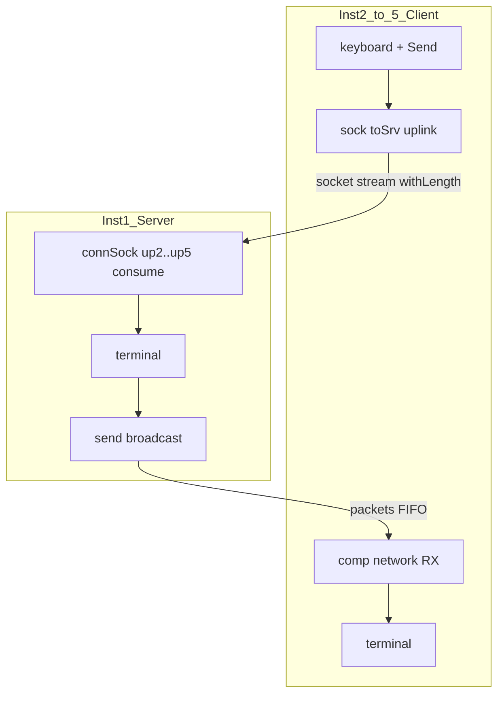

# Plan: Network Chat — socket uplink + demo multi-instancă (wave)

Plan părinte socket: [`.cursor/plans/sock.plan.md`](sock.plan.md). După **1.4+c** (traffic panel sockets).

**Livrabil doc:** [`v0_3_2/doc/network-chat.md`](../v0_3_2/doc/network-chat.md) (de creat).

---

## Context și decizii confirmate

| Decizie | Alegere |
|---------|---------|
| Transport **v1** | **Hibrid:** socket **uplink** (client→server) + pachete **downlink** (server→clienți, broadcast) |
| Transport **v2** (amânat) | Socket bidirecțional dual-socket pe ambele direcții |
| Formatare linii | **Pe server** (`client2> mesaj`, `*client 2 joined`) |
| Numerotare | **clientN** unde **N = instanța** (Inst 2 → `client2`) |
| Join | La **Run** client (frame `JOIN`) |
| Leave | La **Stop** client — necesită extensie engine `SOCKATTACHED` (Faza 0) |
| Server | **Terminal central** + relay către clienți |
| Input | **keyboard** (buffer) + **key Send**; fără Enter; backspace da |
| Mesaje lungi | **Protocol inline** cu `lengthOf` + `withLength` pe uplink socket |
| Doc | [`network-chat.md`](../v0_3_2/doc/network-chat.md) |
| Teste | În timpul implementării (pattern Huffman), grup `socket-chat`, IDs 2528+ |
| Client unic | Același script pe Inst 2–5; [`/instance/`](../v0_3_2/doc/meta-constants.md) |

---

## `/instance/` pe scriptul client

`4wire myInst : /instance/` la Run — port uplink = `myInst`, `clientId` în frame. Server formatează `clientN>` din `clientId` primit.

---

## Arhitectură v1: hibrid socket uplink + pachete downlink

| Direcție | Mecanism v1 |
|----------|-------------|
| Client → server | Socket: client `openSock` + `<<`, server `connSock` + consume |
| Server → clienți | Pachete: `send` **broadcast** (fără `target`) |



**Framing:**

- **Uplink:** `.chatFrame` cu `withLength` (JOIN/CHAT variabil).
- **Downlink:** pachet lățime fixă (ex. 64×8 bit ASCII); un pachet = o linie; fără `withLength` la RX.

**Join / leave:** JOIN pe uplink → server broadcast; leave la Stop via `SOCKATTACHED(upN)` pe server.

---

## Arhitectură v2 (amânat): socket pur dual-socket

8 sock-uri server (down + up per client). Vezi secțiunea dual-socket din istoricul planului.

---

## Mapare porturi uplink

Canal ex. `chat-demo`. Port **N** = număr instanță client (2–5).

| Uplink clientN→server | Inst N `openSock` | Inst 1 `connSock` target=N | port **N** |

Downlink: același `channel`, `send` broadcast către Inst 2–5.

---

## Ce înseamnă `withLength` (uplink)

Prefix de lungime înaintea body-ului pe **stream-ul socket** — mesaje variabile (până la 255 octeți cu prefix `8b`). Vezi [`protocol-assemble.md`](../v0_3_2/doc/protocol-assemble.md).

```logts
inline [protocol] .chatFrame:
  out:
    kind 8b
    clientId 8b
    lengthOf(body) 8b
    body
  :
```

---

## Faza 0 — `SOCKATTACHED(sock)`

Builtin → `1` dacă sock legat live, `0` dacă detached. Poll pe server: edge 1→0 → `*client N left*`.

Fișiere: [`interpreter.js`](../v0_3_2/core/interpreter.js), [`sock.md`](../v0_3_2/doc/sock.md). Teste **2528–2529**.

---

## Faza 1 — Protocol + formatare server

`.chatFrame` / `.chatParse`; linie downlink ASCII. Teste **2530–2531**.

---

## Faza 2 — Script server (Inst 1)

`comp [network]` TX, `sock up2`…`up5`, terminal, osc poll, reg joined. Parse uplink → format → terminal + `send` broadcast.

---

## Faza 3 — Script client (Inst 2–5)

`sock toSrv`, `comp [network]` RX, keyboard, Send, terminal, `/instance/`, osc poll RX.

---

## Faza 4 — Doc `network-chat.md`

Structură ca [`huffman-v2.md`](../v0_3_2/doc/huffman-v2.md): arhitectură hibrid, protocol, SOCKATTACHED, scripturi `logts-play wave`, walkthrough multi-tab, secțiune „De ce socket + pachete?”. Link din [`components.md`](../v0_3_2/doc/components.md).

---

## Faza 5 — Regen + verificare

`_gen_test_manifest.js`, `_gen_doc_data.js`, suite 0 failed, manual 2–3 taburi + Network Traffic sockets.

---

## Teste propuse

| ID | Scenariu |
|----|----------|
| 2528 | `SOCKATTACHED` connected vs close/unregister |
| 2529 | `SOCKATTACHED` producer vs consumer |
| 2530 | `.chatFrame` / `.chatParse` round-trip |
| 2531 | Server format `client2> hi` + LF |
| 2532 | Uplink Inst1+Inst2 JOIN |
| 2533 | CHAT uplink parse |
| 2534 | Downlink broadcast → client pop → terminal |
| 2535 | (opțional) wave keyboard + Send |

---

## Riscuri / v1 vs v2

- Downlink socket → **v2**
- Fan-out un port socket (1.4+a) → amânat
- Uplink >255 octeți → prefix `16b` opțional
- Două mecanisme în demo → documentat explicit

---

## Estimare

| Fază | Efort |
|------|-------|
| 0 — SOCKATTACHED | ~0.5–1 zi |
| 1 — Protocol | ~1 zi |
| 2–3 — Scripturi | ~1.5–2 zile |
| 4–5 — Doc + regen | ~1 zi |
| **Total** | **~4–5 zile** |
