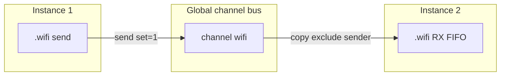

# Plan: componentă `comp [network]`

## Obiectiv

Comunicare **packet-based** între simulări multi-instancă în același browser tab, complementară meta-constantelor [`/instance/`](../v0_3_2/doc/meta-constants.md).



**Confirmat de tine:**
- Expeditorul **nu** primește propriul pachet (unicast către ceilalți pe canal)
- Receptor plin → **drop silențios**; send continuă pentru ceilalți
- Pout nou **`drops`**: contor binar **fără lățime fixă** (`0`→`0`, `1`→`1`, `2`→`10`, `3`→`11`, `4`→`100` = `count.toString(2)`); user mapează cu wire (`4wire dropCount = .net:drops`)
- **Fără UI device** în v1 (headless, ca `queue`)
- **`comp [network]` doar top-level** (nu în chip/pcb/board) — v1
- **Fără persistență** după refresh pagină

---

## De ce doar top-level (nu în board/chip) — impact

**Ce face bus-ul:** la `createDevice`, endpoint-ul se înregistrează cu `interp._instanceId` (instanța tab-ului care a făcut Run) + `channel` + FIFO RX.

**Top-level** — simplu:
- Un Run → o înregistrare clară per `.net`
- Preempție/release instanță → `unregisterNetworkEndpoints(instanceId)` șterge tot pentru slotul 1–5

**Dacă am permite `comp [network]` în board body** — complicații (de aceea am amânat):

| Problemă | Efect |
|----------|--------|
| Board rulează la fiecare `set` / re-exec | Re-înregistrare endpoint, duplicate pe canal, sau endpoint mort |
| Mai multe instanțe board `.cpu` în același script | Mai multe `.net` pe același canal — toate primesc (poate OK, dar greu de controlat) |
| `instanceId` e al editorului, nu al board-ului | Comportament corect, dar mental model confuz în doc |
| Unregister la preempt | Trebuie trackuit ce endpoint-uri a creat fiecare board instance |

**Workaround fără network în board:** pui `comp [network]` **top-level** lângă `board +[...] .cpu:` — UART/WiFi ca periferic extern al plăcii, nu în interiorul corpului board. Pattern uzual pentru multi-instancă.

**Fază 2 (opțional):** network în board cu reguli stricte (o singură înregistrare, unregister la distrugere board instance).

---

## Routing și adresare (v1 vs viitor)

### v1 — bus simplu, protocol în payload

**La send**, bus-ul livrează copia pachetului la **toate** endpoint-urile pe același `channel`, **exceptând expeditorul**. Runtime-ul **nu** interpretează destinația din pachet.

**Nu implementăm în v1:**
- pin / câmp `target` în block-ul de send
- filtrare runtime după destinatie sau sursă
- format de pachet impus (header dest/src)

**La latitudinea userului:** layout payload, dest/src în biți, procesare la receptor — totul în script (ex. `/instance/` pentru `myInst`).

```logts
4wire myInst : /instance/
.net:{ send = packet; set = 1 }
8wire pkt = .net:get
# receptor: logică proprie (dest, src, pop dacă nu e pentru mine)
```

### v2 — `target` în block send

```logts
.net:{
  send = packet
  target = 0010
  set = 1
}
```

Bus livrare selectivă la instanța țintă. Implementat.

---

## Model de date

### Bus global (nou) — [`devices/network-bus.js`](../v0_3_2/devices/network-bus.js)

Stare **partajată în pagină**, independentă de `dm().stores` per instanță:

```javascript
// endpointId = `${instanceId}:${deviceId}`
{
  instanceId, deviceId, channel, width, length,
  rx: { data, head, count },   // FIFO identic queue-storage
  dropCount: 0
}
// channelIndex: Map<channelName, Set<endpointId>>
```

API:

| Funcție | Rol |
|---------|-----|
| `registerNetworkEndpoint({ instanceId, deviceId, channel, width, length })` | la `createDevice` |
| `unregisterNetworkEndpoints(instanceId)` | la preempție / release instanță |
| `networkSend({ fromInstanceId, fromDeviceId, channel, packet })` | fan-out |
| `networkRxPeek/Push/Pop/Clear/...` | operații RX pe endpoint |
| `networkGetDrops(endpointId)` | contor drops |

**`networkSend`:** pentru fiecare endpoint pe `channel`, dacă `endpointId !== sender` → `networkRxPush`; la full → `dropCount++`, fără throw.

**Lifecycle:** apel `unregisterNetworkEndpoints(instanceId)` din [`preemptInstanceForRun`](../v0_3_2/ui/run-context.js) și [`releaseRunContext`](../v0_3_2/ui/run-context.js) (după clear device maps), ca endpoint-urile vechi să nu primească pachete după re-Run.

### Componentă — [`core/components/network.js`](../v0_3_2/core/components/network.js)

Modelat pe [`queue.js`](../v0_3_2/core/components/queue.js), cu diferențe:

| | queue | network |
|--|-------|---------|
| Pin TX | `push` | **`send`** |
| Bus | local instanță | **global channel** |
| Storage | `dm().stores` | **network-bus endpoint** |
| Extra pout | — | **`drops`** |

**Atribute** (din ideas.txt):

| Attr | Default |
|------|---------|
| `width` | 128 |
| `length` | 64 |
| `channel` | `'default'` |
| `on` | `raise` |

**Pins:** `set`, `send` (width), `pop`, `clear`  
**Pouts:** `get`, `front`, `empty`, `full`, `size`, `capacity`, `free`, **`drops`**

**`createDevice`:** validează width/length/channel; `registerNetworkEndpoint` cu `ctx._instanceId` (ca la `/instance/`).

**`applyProperties`:** la `set=1` activ — `send` → `networkSend(...)`, `pop`/`clear` local RX (fără conflict send+pop în același block, ca queue).

**`evalGetProperty`:** citește din endpoint-ul `(interp._instanceId, comp.deviceIds[0])`; `drops` returnează `dropCount.toString(2)` cu `bitWidth` dinamic (`'0'` → 1 bit).

**`getForbidDirectAssign`:** mesaj similar queue (folosește `:send`, `:pop`, `:clear`).

---

## Integrare runtime multi-instancă

- Send rulează în contextul instanței expeditorului (`interp._instanceId` via `runSafely` / `_execInterpStack` — deja fixat pentru devices)
- Livrarea scrie direct în FIFO-urile endpoint-urilor **altor** instanțe — funcționează și când instanța receptor rulează în **background** (tab owner absent)
- Nu necesită refresh DOM pe tab-ul receptor; la revenire, `8wire p = .wifi:get` citește coada acumulată
- Exemplu doc cu `/instance/`:

```logts
4wire inst : /instance/
comp [network] .wifi:
  width: 8
  length: 16
  channel: 'demo'
  on: 1
  :

8wire hdr = inst
.wifi:{ send = hdr; set = txReady }
```

---

## Fișiere de modificat / creat

| Fișier | Acțiune |
|--------|---------|
| [`devices/network-bus.js`](../v0_3_2/devices/network-bus.js) | **nou** — bus + FIFO RX |
| [`core/components/network.js`](../v0_3_2/core/components/network.js) | **nou** — componentă |
| [`core/components/index.js`](../v0_3_2/core/components/index.js) | register `NetworkComponent` |
| [`ui/run-context.js`](../v0_3_2/ui/run-context.js) | `unregisterNetworkEndpoints` la preempt/release |
| [`script_editor_v0_3_2.html`](../v0_3_2/script_editor_v0_3_2.html) | include `network-bus.js` (după `queue-storage.js`) |
| [`run_tests.html`](../v0_3_2/run_tests.html) | idem |
| [`doc/network.md`](../v0_3_2/doc/network.md) | **nou** — spec + exemple multi-instancă |
| [`ui/doc-data.js`](../v0_3_2/ui/doc-data.js) + [`ui/doc-viewer.js`](../v0_3_2/ui/doc-viewer.js) | index doc |
| [`test_suite.js`](../v0_3_2/test_suite.js) + [`test_manifest.js`](../v0_3_2/test_manifest.js) | grup `network` |

**Fără UI panel** în v1 (ca `queue` — headless).

**Refactor mic (opțional, DRY):** extrage FIFO push/pop/peek din [`queue-storage.js`](../v0_3_2/devices/queue-storage.js) sau duplică ~40 linii în network-bus.

---

## Teste (ID-uri noi ~1240+)

| # | Scenariu |
|---|----------|
| parse | `comp [network] .n:` attrs + pins |
| izolare canal | send pe `'a'` nu ajunge la endpoint pe `'b'` |
| cross-instance | `s2.run(def)` → `s1.run(send)` → `s2.getCompProperty('.n','get')` |
| exclude sender | sender RX size rămâne 0 după send |
| pop | `get` neschimbat până la `pop=1` |
| full drop | length 1, 2 senduri la receptor → `drops` = `1` |
| drops width | după 4 drops → `drops` = `100` |
| preempt cleanup | re-Run instanță → endpoint vechi nu mai primește |

Helper test: două `createSession({ instanceId: 1|2 })` + bus global.

---

## Documentație

Bazată pe [ideas.txt (857–1198)](../v0_3_1/ideas.txt), actualizată cu:
- exclude sender
- semantica `drops`
- legătura multi-instancă + `/instance/`
- limitare: doar pagină browser, fără TCP/WS
- notă: la închidere tab/preempție, endpoint-urile instanței sunt eliminate

---

## Out of scope v1

- UI vizual network (LED/link status) — **confirmat: fără**
- `comp [network]` în chip/pcb/board — **confirmat: top-level only, parse error în corp composite**
- Persistență după refresh pagină — **confirmat: fără**
- **`target`** — implementat: unicast 1–5 în block send; omis = broadcast v1
- Network în board body — v2+

## Roadmap v2 (notă)

- ~~Pin `target` în property block la send~~ — **implementat**
- Livrare selectivă la instanța țintă pe canal — **implementat**
- Opțional: `comp [network]` în board cu lifecycle clar

## Estimare efort

- **Realist:** 12–15 h (~2 zile) — bus cross-instance, componentă, teste, doc
- **Optimist:** 9–11 h | **Cu buffer QA:** până la ~3 zile
