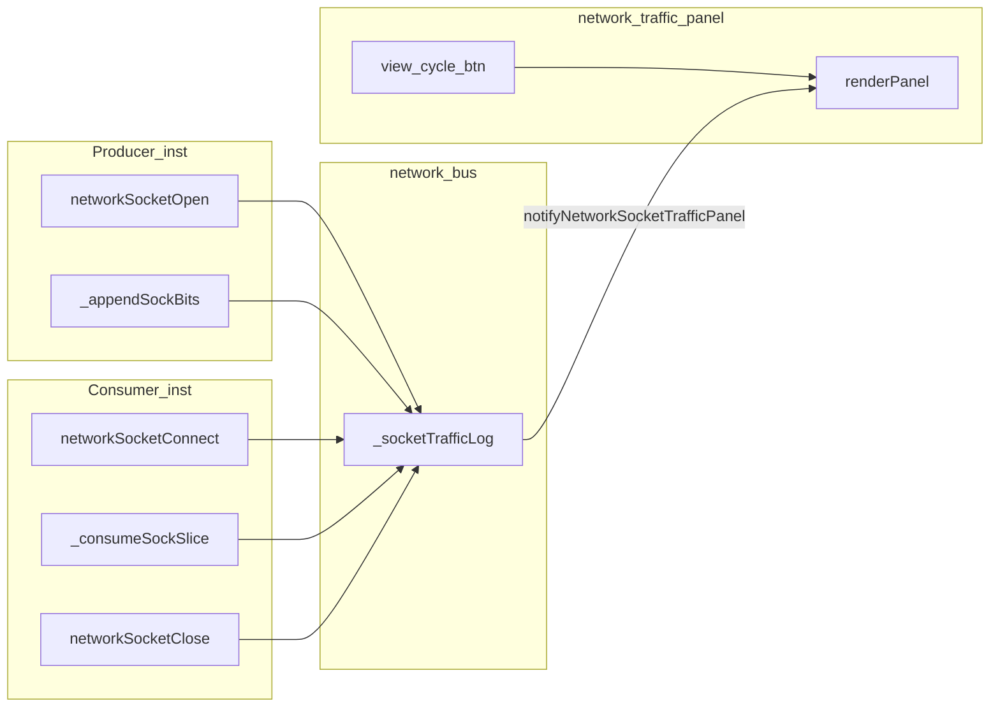

# Faza 1.4+c — Network Traffic: view Sockets

Plan părinte: [`.cursor/plans/sock_network_1.4.plan.md`](sock_network_1.4.plan.md) (R9/G11 — traffic panel socket amânat).

**Context:** Panel-ul existent ([`v0_3_2/ui/network-traffic-panel.js`](../v0_3_2/ui/network-traffic-panel.js)) afișează doar `send` FIFO din `_trafficLog`. Socket-urile din [`v0_3_2/devices/network-bus.js`](../v0_3_2/devices/network-bus.js) (`_socketPorts`) **nu sunt logate** și nu notifică UI-ul.

---

## Decizii confirmate (utilizator)

| ID | Decizie |
|----|---------|
| **D1** | Rânduri = evenimente separate (Open, Connect, Append, Consume, Close) |
| **D2** | Clear per view (Packets vs Sockets) |
| **D3** | Target la Append: instanța consumer dacă connected, altfel `—` |
| **D4** | **Fără** nume sock în coloane (doar instanțe 1–5) |
| **D5** | **Da** — logăm append-uri pre-connect (Target=`—`, Status=Open) |
| **D6** | Close Graceful vs Abrupt în coloana Status |
| **D7** | Titlul panel rămâne **„Network Traffic”** (fără sufix Sockets); doar `(paused)` la Pause |
| **R7** | Log sockets: **SOCKET_TRAFFIC_LOG_MAX=500**, **TRIM=100** (packets rămân 200/50) |
| **D9** | Teste ca grupul `network-traffic` (1258–1270): bus API + helper-e display/filtre; **fără** teste UI/butoane — UI verificat manual de utilizator |

---

## Direcție recomandată (modificări la cerință)

### R1 — Un singur tabel Sockets = **jurnal de evenimente** ✅ confirmat

View-ul **Sockets** = log cronologic (același pattern ca Packets). Fiecare rând = un eveniment; sesiunile închise rămân vizibile prin rânduri `Close`.

| Tip rând | Când apare |
|----------|------------|
| `Open` | `openSock` |
| `Connect` | `connSock` |
| `Append` | producer `chat <<` pe sock legat |
| `Consume` | consumer `wire << chat./N` |
| `Close` | `closeSock` sau `unregister` |

### R2 — **Un singur buton** toggle Packets ↔ Sockets ✅ confirmat (revizuit)

**Nu** două butoane separate — la 3+ view-uri ar deveni aglomerat.

**Pattern:** același model ca **wave / legacy** ([`propMode`](../../v0_3_2/script_editor_v0_3_2.html)) sau **all → 1-line → grid** ([`tabsDisplayModeBtn`](../../v0_3_2/ui/editor.js)):

```
[ packets ]  |  Pause  |  Clear     ← view Packets (o culoare)
[ sockets ]  |  Pause  |  Clear     ← după click (altă culoare)
```

- **Un buton** `networkTrafficViewBtn` în stânga Pause.
- Click → comută view; textul butonului = view-ul **activ** (`packets` / `sockets`).
- Clase CSS dedicate (reutilizare stil `prop-toggle`):
  - `network-traffic-view--packets` — culoare distinctă (ex. albastru/cyan, asociat FIFO)
  - `network-traffic-view--sockets` — culoare distinctă (ex. violet/portocaliu)
- `title`: „Network traffic view: packets (click to switch to sockets)”
- **Extensibil:** array intern `['packets', 'sockets']` — la viitoare view-uri se adaugă în array și cycle (ca `TABS_DISPLAY_MODES`), fără butoane noi în toolbar.

Toolbar final:

```
[ packets|sockets ]  Pause  Clear
```

### R3 — Pause intern la switch view ✅ confirmat

La toggle Packets↔Sockets:

1. Îngheață view-ul curent (`live=false`, `pausedLogSnapshot`).
2. Comută `view`.
3. Pornește **Live** pe view-ul destinație (`live=true`, re-render).

Stare separată per view: `pageIndex`, `filters`, `expandedId`, `live`, `pausedLogSnapshot`, `pendingRefresh`, `lastRenderedMaxId`.

### R4 — Clear per view ✅ confirmat

Clear golește doar logul view-ului activ. Counter-ele Id rămân monoton.

### R5 — Coloane Sockets ✅ confirmat

| Coloană | Filtru |
|---------|--------|
| **Id** | numeric / range |
| **Event** | select (Open/Connect/Append/Consume/Close) |
| **Source** | numeric (instanță) |
| **Target** | numeric sau `—` |
| **Channel** | substring |
| **Port** | numeric |
| **Size** | biți în eveniment |
| **Buf** | `bufferLenAfter` |
| **Status** | select (Open/Connected/Closed/Graceful/Abrupt) |

Expand rând: bitstream la Append / Consume / Close (format ca packet payload). **Fără** coloane sock name (D4).

### R6 — Hook-uri logging ✅ confirmat



- Lifecycle: `networkSocketOpen`, `networkSocketConnect`, `networkSocketClose` (+ `closeReason: 'abrupt'` la unregister).
- Data ops: `_appendSockBits` / `_consumeSockSlice` când `connected && sharedKey`.
- API: `getNetworkSocketTrafficLog()`, `clearNetworkSocketTrafficLog()`, `notifyNetworkSocketTrafficPanel()`.

### R7 — Ring buffer / capacitate log ✅ confirmat (500/100)

#### Packets (neschimbat)

```javascript
TRAFFIC_LOG_MAX = 200
TRAFFIC_LOG_TRIM = 50
```

Un `send` = 1 rând. 200 e suficient pentru FIFO traffic (test **1266** rămâne valid).

#### Sockets ✅ confirmat utilizator

```javascript
SOCKET_TRAFFIC_LOG_MAX = 500
SOCKET_TRAFFIC_LOG_TRIM = 100
```

**De ce nu 200/50 pentru sockets:**

| Factor | Packets | Sockets |
|--------|---------|---------|
| Frecvență evenimente | 1× per `send` | 1× per `<<` append **și** per consume |
| Evenimente per sesiune | 1 rând | minim 3 lifecycle (Open+Connect+Close) + N data ops |
| Multi-socket | N/A | 10 socket-uri × 20 append = 200+ rânduri rapid |

**Comportament identic ca la packets:** la 500 rânduri → șterge primele 100 → rămân ~400 + cel nou. **Id** monoton, **Clear** golește lista fără reset Id.

**Ce NU facem în v1:**

| Opțiune | Motiv amânare |
|---------|----------------|
| Mărire globală 200→500 pentru packets | Regresează test 1266 și așteptările doc packets |
| Log dual (lifecycle + data separate) | Complexitate UI merge/sort — overkill v1 |
| Trim prioritizat (păstrează Close, șterge Append vechi) | **1+a** — util dacă 500 tot nu ajunge |

**Dacă în practică 500 e insuficient** → **1+a**: trim prioritizat sau agregare Append/Consume pe același port într-o fereastră de timp.

---

## Explicații decizii (pentru referință)

### D5 — Pre-connect append ✅ confirmat

Inst 1: `openSock` + `chat << ^41` înainte de `connSock` pe Inst 2 → rând **Append** cu Target=`—`, Status=`Open`, Buf=lungime buffer.

### D9 — Strategie teste (pattern `network-traffic` 1258–1270)

**Automat în Node** — același stil ca panel-ul packets existent:

| Strat | Fișier | Exemple existente | Echivalent sockets |
|-------|--------|-------------------|---------------------|
| Bus log | `network-bus.js` | 1258–1262, 1266 | 2517–2521, 2524–2525 |
| Display helpers | `network-traffic-display.js` | 1263–1265, 1269 | 2522–2523, 2526–2527 |
| Integrare runtime | `test_suite.js` + sesiuni | `sendNet`, `getNetworkTrafficLog` | `openSockNet`, `getNetworkSocketTrafficLog` |

**Helper-e noi în [`test_suite.js`](../v0_3_2/tests/test_suite.js)** (lângă `netSockDef` / grupul `network-traffic`):

```javascript
// bus direct
function seedSocketOpen({ channel, instanceId, port, cap }) { ... }
function lastSocketTrafficEntry() { return getNetworkSocketTrafficLog().slice(-1)[0]; }

// display (date sintetice, ca 1264)
function makeSocketTrafficEntries(n) { ... }
```

Grup test: **`network-socket-traffic`** (IDs 2517–2527), în manifest alături de `network-traffic`.

**UI (toggle, culori, pause-on-switch):** verificare **manuală de utilizator** — nu intră în `test_suite.js`.

**Nu testăm:** click pe `networkTrafficViewBtn`, DOM, CSS — panel-ul packets nici azi nu are astfel de teste.

---

## Arhitectură fișiere

| Fișier | Schimbare |
|--------|-----------|
| [`network-bus.js`](../v0_3_2/devices/network-bus.js) | `_socketTrafficLog`, hooks, getters/clear, notify |
| [`interpreter.js`](../v0_3_2/core/interpreter.js) | `logNetworkSocketDataOp(...)` din append/consume |
| [`network-traffic-display.js`](../v0_3_2/ui/network-traffic-display.js) | coloane/filtre sockets |
| [`network-traffic-panel.js`](../v0_3_2/ui/network-traffic-panel.js) | dual state, `cycleNetworkTrafficView()`, render branch |
| [`script_editor_v0_3_2.html`](../v0_3_2/script_editor_v0_3_2.html) | un buton view + CSS culori |
| [`network-traffic-panel.md`](../v0_3_2/doc/network-traffic-panel.md) | secțiune Sockets |
| [`network.md`](../v0_3_2/doc/network.md) | link scurt |
| [`sock_network_1.4.plan.md`](sock_network_1.4.plan.md) | marchează 1.4+c done |

---

## Faze implementare

### 1.1 — Model date + specificație

- Shape `SocketTrafficEntry` (câmpuri R5).
- Mapare `closedBy` / `closeReason`.
- Deciziile D1–D9 închise (tabel de mai sus).

### 1.2 — Bus: logging lifecycle

- `_socketTrafficLog`, `allocNetworkSocketEventId()`, `_ensureSocketTrafficLogCapacity()` (**500/100**).
- Hooks în open/connect/close.
- Teste 2517–2519.

### 1.3 — Interpreter: logging Append/Consume

- `logNetworkSocketDataOp(...)` în bus.
- Hooks append/consume (inclusiv pre-connect, D5).
- Teste 2520–2521.

### 1.4 — Display helpers + test helpers

- `NETWORK_SOCKET_COLUMNS`, `applySocketTrafficFilters`, `getFilteredSocketTrafficLog`, `socketTrafficCellValue`.
- Reutilizare `getDisplayPage`, `parseNumericFilter`, `wrapFormattedPacket` (sau alias `wrapFormattedSocketBits`).
- Helper-e test în `test_suite.js` (D9).
- Teste 2522–2523, 2526–2527.

### 1.5 — UI: buton unic + dual state

- HTML: `id="networkTrafficViewBtn"` (un singur buton).
- `cycleNetworkTrafficView()` / `toggleNetworkTrafficView()` — pattern `togglePropagationMode()`.
- Culori `network-traffic-view--packets` / `--sockets`.
- Titlu panel: mereu **„Network Traffic”** / **„Network Traffic (paused)”** (D7).
- Pause-on-switch (R3), Clear per view (R4).

### 1.6 — Doc + regen + verificare

- Doc (`SOCKET_TRAFFIC_LOG_MAX=500` în [`network-traffic-panel.md`](../v0_3_2/doc/network-traffic-panel.md)).
- Regen manifest/doc-data; suite 0 failed.
- UI: verificare manuală utilizator (toggle, culori, pause-on-switch).
- Marchează 1.4+c done.

---

## Faze amânate (1+a …)

| Fază | Conținut |
|------|----------|
| **1+a** | **Trim prioritizat** — la 500 rânduri, șterge mai întâi Append/Consume vechi; păstrează Open/Connect/Close în istoric |
| **1+b** | **Agregare** Append/Consume — grupează multe ops pe același port într-un rând sumar (total biți, nr ops) |
| **1+c** | Coloane **ProdSock** / **ConsSock** — numele variabilei sock locale (`chat`, `inbox`); respins v1 (D4); opțional în expand |
| **1+d** | Filtru rapid preset „Connected only” |
| **1+e** | Export CSV / copy log sockets |
| **1+f** | Signal Trace pentru socket ops |
| **1+g** | Probe refresh cross-tab la Append |
| **1+h** | Counters bytes per sesiune în expand |
| **1+i** | Persistare filtre/view în localStorage |
| **1+j** | Creștere configurabilă SOCKET_TRAFFIC_LOG_MAX (dacă 500 e încă mic) |

---

## Teste propuse (IDs după 2516)

| ID | Scenariu |
|----|----------|
| 2517 | bus: open → Event Open, Buf 0 |
| 2518 | bus: connect → Connect, Status Connected |
| 2519 | bus: close consumer → Graceful + snapshotLen |
| 2520 | cross-instance append + consume → 2 data events |
| 2521 | unregister → Close Abrupt |
| 2522 | display: filtre Event=Append |
| 2523 | clear socket log ≠ packet log |
| 2524 | pre-connect append: Target `—`, Status Open (D5) |
| 2525 | trim batch la 500 intrări (echivalent 1266 pentru sockets) |
| 2526 | `getDisplayPage` pe socket entries |
| 2527 | `applySocketTrafficFilters` — Event, Port, Channel, Status |

**Manual (utilizator):** toggle buton, culori, pause-on-switch în editor.

---

## Criteriu done

1. Buton unic **packets/sockets** cu culori distincte; Sockets = log evenimente.
2. Filtre, paginare, expand, Pause/Live — paritate cu Packets.
3. Switch view: vechi paused, nou live automat.
4. Clear per view; titlu neschimbat (D7).
5. Teste 2517–2527 verzi; regresie 1967+; packets 1258–1270 neschimbate.
6. Doc + 1.4+c completed.

---

## Estimare

| Fază | Efort |
|------|-------|
| 1.1 | ~1–2 h |
| 1.2–1.3 | ~4–6 h |
| 1.4–1.5 | ~6–8 h |
| 1.6 | ~2 h |
| **Total** | **~2–3 zile** |
