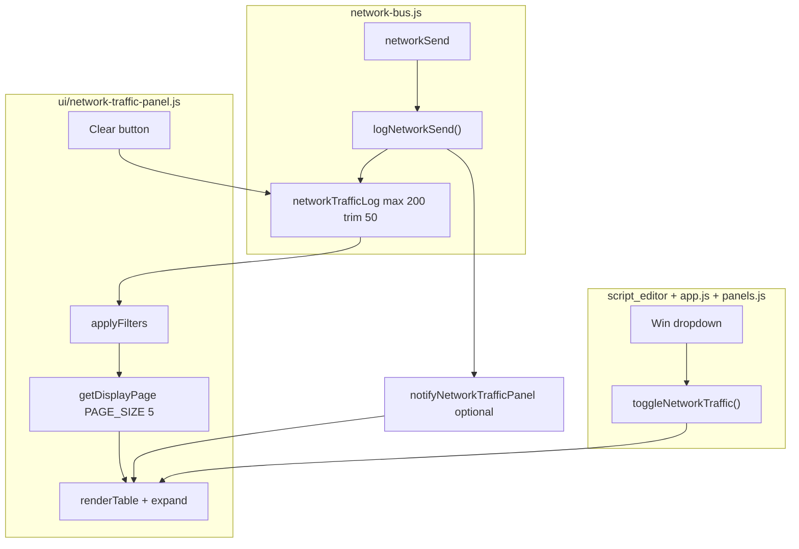

# Plan: panou Network Traffic

## Scop

Panou editor **global** (nu depinde de instanța/tab-ul activ) care listează **fiecare operație `send`** pe bus-ul `comp [network]`, cu filtre pe coloane și expand la click pentru payload formatat ca la `show()`.

**Deschidere:** meniu Win ▾ → „Network Traffic” (ca Timeline, Output, …).

---

## Decizii agreate

| Subiect | Decizie |
|---------|---------|
| Granularitate | **Un rând per `send`** (TX-centric) |
| Target broadcast | Coloana Target = `*` când pinul `target` lipsește |
| Target unicast | Coloana Target = instanța 1–5 |
| Status | Coloană dreapta: **`Received`** sau **`Dropped`** — **fără filtru** |
| Drops / fără receptor | Ambele → **`Dropped`** (0 livrări reușite în RX) |
| Broadcast parțial | Dacă ≥1 receptor acceptă pachetul → **`Received`**; dacă 0 → **`Dropped`** |
| Golire istoric | **Manual** (buton Clear în panou) + la **refresh pagină**; **nu** la Run |
| Persistență tab/instanță | Același log pentru toate tab-urile și instanțele |
| **Id** | **Autoincrement global**, unic per pachet în sesiune; **Clear nu resetează contorul** |
| **Filtre coloane** | **Substring** (case-insensitive) pe Source, Target, Channel, Size |
| **Afișare listă** | **5 rânduri / pagină**; paginare `[ < ] [ > ]`; sumar **`Rows: X - Y . Shown N of Total`** (poziții în listă, **nu Id**) |
| **Ordine UI** | **Cel mai recent sus** — sortare **Id desc** (ex. `5, 4, 3, 2, 1` pe pagina 1) |
| **Layout panou** | În `#outputStack`, **ca Timeline** — lățime coloană Output, deasupra Output |
| **Log backend** | Max **200** intrări; la plin → șterge **50** cu Id minim; `_trafficId` nu se resetează |
| **minWidth coloane** | Da — tabel lizibil; Channel primește restul lățimii |

---

## Id — autoincrement (confirmat)

- Fiecare `send` primește un **Id unic**, alocat din contorul global `_trafficId` (`++_trafficId` la fiecare log).
- **Clear** golește doar lista afișată (`_trafficLog = []`); **contorul rămâne** la ultima valoare atribuită.
- **Refresh pagină** resetează contorul (sesiune nouă).

**Exemplu Id (backend):**

| Moment | Id-uri în log | `_trafficId` după |
|--------|---------------|-------------------|
| 4 send-uri | 1, 2, 3, 4 | 4 |
| Clear | *(log gol)* | 4 |
| 3 send-uri noi | 5, 6, 7 | 7 |

**Exemplu afișare panou (Id desc, max 5 rânduri):**

| Situație | Ce vezi sus → jos |
|----------|-------------------|
| 5 send-uri (id 1…5) | **5, 4, 3, 2, 1** |
| 8 send-uri (id 1…8) | **8, 7, 6, 5, 4** |
| Clear după 1–4 | *(gol)* |
| 2 send-uri noi (id 5, 6) | **6, 5** |
| Clear + 3 send-uri (id 5, 6, 7) | **7, 6, 5** |

Id-ul rămâne crescător în backend; doar **ordinea de afișare** e descendentă. Intrările cu Id mic pot dispărea din log la trim batch — Id-ul **501** poate exista chiar dacă 1–50 au fost eliminate din `_trafficLog`.

---

## `_trafficLog` — limită și trim batch (confirmat)

| Constantă | Valoare | Rol |
|-----------|---------|-----|
| `TRAFFIC_LOG_MAX` | **200** | Număr maxim de intrări păstrate în log |
| `TRAFFIC_LOG_TRIM` | **50** | Câte intrări **cele mai vechi** se șterg când log-ul e plin |

### Algoritm (înainte de `push` intrare nouă)

```js
const TRAFFIC_LOG_MAX = 200;
const TRAFFIC_LOG_TRIM = 50;

function _ensureTrafficLogCapacity() {
  if (_trafficLog.length >= TRAFFIC_LOG_MAX) {
    _trafficLog.splice(0, TRAFFIC_LOG_TRIM);  // elimină primele 50 (Id-uri mici)
  }
}

function logNetworkSend(...) {
  _ensureTrafficLogCapacity();
  _trafficLog.push(entry);  // id: ++_trafficId — contorul nu se resetează
}
```

### Exemplu (limită 200, trim 50)

| Pas | Acțiune | Intrări în log (Id-uri) | `_trafficId` |
|-----|---------|-------------------------|--------------|
| 1 | 200 send-uri | 1 … 200 | 200 |
| 2 | send → id **201** | log plin → **șterge 1–50** → rămân 51…200 → adaugă **201** → **51…201** (151 intrări) | 201 |
| 3 | send-uri 202…250 | … crește până la **51…250** (200 intrări) | 250 |
| 4 | send → id **251** | trim 51–100 → rămân 101…250 → adaugă **251** | 251 |

- **Nu** se șterge câte o intrare (`shift` per packet) — doar **batch de 50** când `length >= 200`.
- **Clear** manual golește tot log-ul; `_trafficId` neschimbat.
- **Refresh pagină** resetează log + contor.

*(Exemplul tău cu 500 + trim 50: același pattern — la limită 200 folosim 200/50 în loc de 500/50.)*

---

## Recomandări (incluse în design)

1. **Log global în `network-bus.js`** — traficul e cross-instance; nu îl punem în `runContext` per instanță.
2. **Reutilizare `Interpreter.formatValue()`** pentru payload expandat — aceeași regulă ca `show()` / Variables (`^` hex, ` + ` binar, grupări 8/16 biți).
3. **Helper nou `wrapFormattedPacket(formatted, maxChars)`** — wrap la ~**40 caractere** (lățimea liniei `^0000 0000 0000 0000 0000 0000 0000 0000` pentru width 128), preferabil la granițe de token (spațiu între grupuri hex, înainte/după ` + `). Continuarea pe rând nou cu indent **2 spații** dacă fragmentul nu începe cu `^`.
4. **Cap istoric backend** — max **200** intrări în `_trafficLog`; la limită se șterg **loturi de 50** (cele mai vechi Id-uri); UI afișează doar **5** (vezi secțiunile de mai jos).
5. **Id** — vezi [Id — autoincrement](#id--autoincrement-confirmat); ștergerea din log **nu reciclează** Id-uri; `_trafficId` continuă mereu.
6. **Coloana Size** — **lățimea pachetului în biți** (`packet.length` / `width` componentă), nu occupancy FIFO.
7. **Nu logăm `pop` / `clear`** — doar evenimente de trimitere.
8. **Panou vizibil la primul send (opțional v1.1)** — la primul eveniment, poate deschide panoul automat; v1: doar manual din Win.

---

## Model date — intrare jurnal

```js
{
  id: 1234,                    // number, monoton unic; nu se resetează la Clear
  source: 1,                   // fromInstanceId
  target: 2 | '*',             // targetInstanceId sau '*' broadcast
  channel: 'wifi',             // string
  size: 32,                    // biți
  status: 'Received' | 'Dropped',
  packet: '01010...',          // string binar raw (pentru expand)
  ts: 1718736000123            // optional, pentru sortare/debug
}
```

### Calcul Status (în `networkSend`)

După loop-ul de livrare:

- **Unicast** (`targetInstanceId` setat): `Received` dacă endpoint-ul țintă (exclus sender) a făcut `_fifoPush` cu succes; altfel `Dropped`.
- **Broadcast** (`target` omis): `Received` dacă **≥1** receptor (exclus sender) a acceptat; `Dropped` dacă **0** acceptări (inclusiv: niciun endpoint pe canal, toate RX pline).

Logarea se face **o singură dată per apel `networkSend`**, indiferent de câți receptori au primit.

---

## Log intern vs afișare UI

Două straturi distincte:

| Strat | Limită | Rol |
|-------|--------|-----|
| **`_trafficLog`** (bus) | **200** max; trim **50** cele mai vechi la plin | Istoric în sesiune; sursă pentru filtre |
| **Panou UI** | **5** rânduri / pagină; paginare prin lista filtrată |

```js
const PAGE_SIZE = 5;

function getFilteredLog(log, filters) {
  return applyFilters(log, filters).sort((a, b) => b.id - a.id);
}

function getDisplayPage(filtered, pageIndex) {
  const total = filtered.length;
  const offset = pageIndex * PAGE_SIZE;
  const entries = filtered.slice(offset, offset + PAGE_SIZE);
  const shown = entries.length;
  const rowStart = shown ? offset + 1 : 0;   // poziție 1-based în listă (1 = cel mai recent)
  const rowEnd = offset + shown;
  return { entries, total, shown, rowStart, rowEnd, pageIndex };
}
```

- **Total** = număr intrări după filtre (`23` filtrate sau `200` fără filtre)
- **Shown** = câte rânduri sunt pe pagina curentă (`5` sau mai puțin pe ultima pagină)
- **`Rows: X - Y`** = **poziția în lista filtrată** (1-based, 1 = intrarea cea mai recentă), **nu** coloana Id
- La schimbare filtru sau **Clear** → `pageIndex = 0`
- La pachet nou → rămânem pe pagina curentă (user poate merge `[ < ]` la pagina 1)

---

## UI — paginare

Sub tabel, bară compactă (fără numere de pagină, fără „Page 2/5”):

```
[ < ] [ > ]    Rows: 6 - 10 . Shown 5 of 23.
```

| Element | Comportament |
|---------|--------------|
| `[ < ]` | Pagina anterioară (`pageIndex--`); **disabled** pe prima pagină |
| `[ > ]` | Pagina următoare (`pageIndex++`); **disabled** când nu mai există rânduri |
| `Rows: X - Y` | Poziții **în lista filtrată** (nu Id-uri): `X = offset+1`, `Y = offset+shown` |
| `Shown N of Total` | `N` = rânduri pe pagina curentă; `Total` = toate intrările filtrate |

### Exemple

Lista filtrată are **23** intrări (sort desc). Coloana **Id** poate arăta 120, 119, … — independent de `Rows`.

| Pagină | Rows | Shown | Id-uri vizibile (exemplu) |
|--------|------|-------|---------------------------|
| 1 | **1 - 5** | 5 of 23 | cele mai recente 5 |
| 2 | **6 - 10** | 5 of 23 | următoarele 5 |
| 5 | **21 - 23** | 3 of 23 | ultimele 3 |

Fără filtre, log plin **200** intrări: pagina 1 → `Rows: 1 - 5 . Shown 5 of 200.`

*(„Rows: 3 - 8” din discuție = format poziții în listă; pe o pagină completă de 5: `3 - 7`, nu Id 3…8.)*

```html
<div class="network-traffic-pager">
  <button type="button" id="networkTrafficPrev" aria-label="Previous page">&lt;</button>
  <button type="button" id="networkTrafficNext" aria-label="Next page">&gt;</button>
  <span id="networkTrafficPagerSummary">Rows: 1 - 5 . Shown 5 of 23.</span>
</div>
```

---

## UI — listă

### Coloane (header fix; max 5 rânduri date)

| Id | Source | Target | Channel | Size | Status |
|----|--------|--------|---------|------|--------|
| 1250 | 3 | * | debug | 16 | Dropped |
| 1240 | 2 | 1 | wifi | 32 | Received |
| 1234 | 1 | 2 | wifi | 32 | Received |

*(exemplu: cel mai recent sus)*

- **Source / Target:** cifre 1–5; Target `*` pentru broadcast.
- **Status:** text simplu, fără dropdown filtru (doar afișare).
- Rând selectat: fundal ușor diferit; **click pe rând** → toggle panou detaliu packet dedesubt (sau sub-rând expandat în tabel).

### Expand packet (toggle)

Format identic `show()`:

```
^FA34 ABD0 0000 0000 +
^34D0 3204 0000 0000 +
  0111011
```

Reguli wrap:

- `maxRowChars = 40` (echivalent `^0000 0000 0000 0000 0000 0000 0000 0000`).
- Funcție: `formatPacketForDisplay(packetBits, size)` → `formatValue` + `wrapFormattedPacket`.
- Font: monospace (ca Output / Variables).

---

## UI — filtre coloane (Excel-like, text liber)

Coloane filtrabile: **Source**, **Target**, **Channel**, **Size**. **Nu** Id, **nu** Status.

### Interacțiune

1. Click pe **numele coloanei** → apare rând sub header:
   ```
   Source
   [3          ][>][x]
   ```
2. User tastează, **Enter** sau **[>]** aplică filtrul.
3. **[x]** șterge filtrul coloanei (ascunde input dacă nu mai e activ).
4. Indicator filtru activ pe header, ex.:
   - `Channel (wifi)` sau
   - `Channel` + badge `wifi` + `[x]` inline

### Semantica match (confirmat)

Toate coloanele filtrabile folosesc **substring, case-insensitive** (`query` apare undeva în valoarea afișată a celulei):

| Coloană | Valoare celulă | Exemplu filtru `fi` → match |
|---------|----------------|----------------------------|
| Source | `"1"` … `"5"` | `1` → sursa 1, 10*(N/A)*; `2` → 2 |
| Target | `"1"` … `"5"` sau `"*"` | `*` → doar broadcast; `2` → target 2 |
| Channel | nume canal | `wifi` → `wifi`, `WiFi-demo` |
| Size | biți ca string | `32` → 32, 132*(nu)* |

- Filtru **gol** = coloana nu filtrează.
- Filtrele se **combină AND**.
- Listă goală → mesaj „No matching traffic”.

---

## Arhitectură



### Fișiere noi

| Fișier | Rol |
|--------|-----|
| [`v0_3_2/ui/network-traffic-panel.js`](../v0_3_2/ui/network-traffic-panel.js) | `getDisplayPage`, filtre, paginare `[<][>]`, sumar Rows, expand, Clear |
| [`v0_3_2/ui/format-packet-display.js`](../v0_3_2/ui/format-packet-display.js) | `wrapFormattedPacket` + `applyFilters` (sau în același fișier ca panel) |

### Fișiere modificate

| Fișier | Modificare |
|--------|------------|
| [`v0_3_2/devices/network-bus.js`](../v0_3_2/devices/network-bus.js) | `networkTrafficLog`, `logNetworkSend`, hook în `networkSend`; export `getNetworkTrafficLog`, `clearNetworkTrafficLog`, `_resetNetworkTrafficForTests` |
| [`v0_3_2/script_editor_v0_3_2.html`](../v0_3_2/script_editor_v0_3_2.html) | Markup `#networkTrafficPanel`, CSS, script tag, item Win ▾ |
| [`v0_3_2/ui/panels.js`](../v0_3_2/ui/panels.js) | `toggleNetworkTraffic()` |
| [`v0_3_2/ui/app.js`](../v0_3_2/ui/app.js) | Branch dropdown `networkTraffic`; init panel la load |
| [`v0_3_2/ui/run-context.js`](../v0_3_2/ui/run-context.js) | Opțional: `notifyNetworkTraffic()` apelează `render` dacă panoul e vizibil (fără legătură de instanță) |
| [`v0_3_2/doc/editorUI.md`](../v0_3_2/doc/editorUI.md) | Secțiune Network Traffic |
| [`v0_3_2/doc/network.md`](../v0_3_2/doc/network.md) | Link către panou + notă Status |

---

## HTML — poziționare panou (ca Timeline)

În [`v0_3_2/script_editor_v0_3_2.html`](../v0_3_2/script_editor_v0_3_2.html), în `#outputStack`, **sub** `timelinePanel`, **deasupra** `outputPanel` — același pattern ca Timeline (linii 2573–2587).

```html
<div class="panel-stack" id="outputStack" style="flex:1">
  <div class="panel timeline-panel" id="timelinePanel" style="display:none">...</div>
  <div class="panel network-traffic-panel" id="networkTrafficPanel" style="display:none">
    <div class="network-traffic-head">
      <h3>Network Traffic</h3>
      <button type="button" id="networkTrafficClear" title="Clear log">Clear</button>
    </div>
    <div class="network-traffic-table-wrap">
      <table class="network-traffic-table">...</table>
    </div>
    <div class="network-traffic-pager">
      <button type="button" id="networkTrafficPrev">&lt;</button>
      <button type="button" id="networkTrafficNext">&gt;</button>
      <span id="networkTrafficPagerSummary">Rows: 1 - 5 . Shown 5 of 0.</span>
    </div>
  </div>
  <div class="panel" id="outputPanel" style="flex:1; min-height:100px;">...</div>
</div>
```

- **Lățime:** 100% din `outputStack` (= aceeași coloană ca Output)
- **Înălțime:** compactă, `flex-shrink: 0` (ca `.timeline-panel`); Output rămâne `flex: 1`

---

## CSS

```css
.network-traffic-panel {
  flex-shrink: 0;
  padding: 8px 10px;
  width: 100%;
}
.network-traffic-table-wrap {
  overflow-x: auto;
  overflow-y: auto;
  max-height: 220px;   /* ~5 rânduri + header, similar canvas Timeline */
}
.network-traffic-table {
  width: 100%;
  table-layout: fixed;
  border-collapse: collapse;
}
```

### minWidth coloane

| Coloană | min-width |
|---------|-----------|
| Id | 44px |
| Source | 52px |
| Target | 52px |
| Channel | 80px (restul lățimii; ellipsis dacă lung) |
| Size | 44px |
| Status | 76px |

- `colgroup` + `min-width`; header sticky în `table-wrap`
- `.network-traffic-pager` — flex, butoane `[<][>]` + sumar; butoane disabled la capete
- `.network-traffic-row--expanded` + `.network-traffic-packet` — monospace, `white-space: pre-wrap`
- `.network-traffic-filter-row` — input + `[>]` `[x]` sub header
- Culori Source/Target opțional: `INSTANCE_COLORS` din `run-context.js`

---

## API bus (schimbare `networkSend`)

Pseudo:

```js
let _trafficId = 0;
const _trafficLog = [];
const TRAFFIC_LOG_MAX = 200;
const TRAFFIC_LOG_TRIM = 50;

function _ensureTrafficLogCapacity() {
  if (_trafficLog.length >= TRAFFIC_LOG_MAX) {
    _trafficLog.splice(0, TRAFFIC_LOG_TRIM);
  }
}

function clearNetworkTrafficLog() {
  _trafficLog.length = 0;
  // _trafficId NU se atinge
}

function logNetworkSend({ fromInstanceId, channel, packet, targetInstanceId, deliveredCount }) {
  const status = deliveredCount > 0 ? 'Received' : 'Dropped';
  const entry = {
    id: ++_trafficId,
    source: fromInstanceId,
    target: targetInstanceId != null ? targetInstanceId : '*',
    channel: String(channel || 'default'),
    size: packet.length,
    status,
    packet,
    ts: Date.now(),
  };
  _ensureTrafficLogCapacity();
  _trafficLog.push(entry);
  if (typeof notifyNetworkTrafficPanel === 'function') notifyNetworkTrafficPanel();
  return entry;
}
```

În loop-ul existent: contor `deliveredCount++` la `_fifoPush` reușit către receptor eligibil.

---

## Teste

| ID | Grup | Scenariu |
|----|------|----------|
| 1258 | network-traffic | send unicast primit → 1 intrare, Status Received, target=2 |
| 1259 | network-traffic | broadcast → target `*`, Received când s2 primește |
| 1260 | network-traffic | RX plin → Status Dropped |
| 1261 | network-traffic | unicast fără endpoint → Dropped |
| 1262 | network-traffic | Clear după id 1–4 → log gol; următoarele send-uri id 5, 6; afișare **6, 5** |
| 1263 | network-traffic | `wrapFormattedPacket` — 128 biți → mai multe rânduri, ≤40 chars |
| 1264 | network-traffic | `getDisplayPage` — 8 intrări, page 0 → ids desc [8..4], `Rows 1-5`, `Shown 5 of 8` |
| 1265 | network-traffic | `getDisplayPage` — page 1 → `Rows 6-8`, `Shown 3 of 8` |
| 1266 | network-traffic | log la 200 + send 201 → trim 50; id 201 prezent; `_trafficId` continuă |

Teste Node în `test_suite.js`; `_resetNetworkTrafficForTests` în teardown network.

---

## Ordine implementare

1. **Bus** — log + Status + export API + teste 1258–1261
2. **`format-packet-display.js`** — wrap + `getDisplayPage` + teste 1263–1266
3. **Panel JS** — tabel 5/pagină, pager `[<][>]`, sumar Rows, minWidth, expand, filtre, Clear
4. **HTML/CSS/panels/app** — integrare Win ▾
5. **Doc** — editorUI + network.md; regen doc-data dacă e cazul

---

## Out of scope v1

- Numere pagină („Page 2/5”), sărituri directe, page size configurabil
- Export CSV / copy all
- Filtru Status (explicit exclus)
- Persistență localStorage după refresh
- Timestamp vizibil în tabel (păstrat în model pentru viitor)
- Rânduri separate per receptor la broadcast
- Deschidere automată panou la primul send

---

## Estimare

~6–8 h (bus + panel + filtre + wrap + teste + doc).
