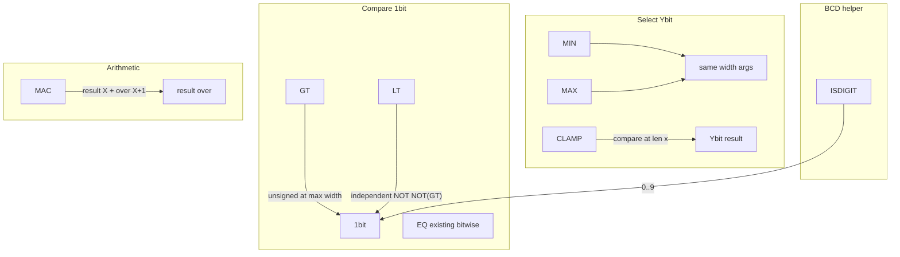

# Number conversion + comparison + MAC builtins

## Part A — Hex conversion (confirmed)

| Topic | Choice |
|-------|--------|
| Names | `CNTN16S`, `N2N16S`, `N16S2N` |
| Signed | Unsigned only |
| Wire model | Binary in/out; packed nibbles (not ASCII) |
| `N2N16S` width | Same as `N2N10S`: `maxHexDigits × 4` where `maxHexDigits = (2^N−1).toString(16).length` |
| Doc file | Rename [`decimal-conversion.md`](../v0_3_2/doc/decimal-conversion.md) → [`number-conversion.md`](../v0_3_2/doc/number-conversion.md) |

Helpers in [`interpreter.js`](../v0_3_2/core/interpreter.js) (~58–102), dispatch ~3866–3898, `_zstateRequireBinary` on all args.

| Input (8 bit) | `N2N16S` (8 bit) | `N2N10S` (12 bit) |
|---------------|------------------|-------------------|
| 245 | `11110101` (F5) | `001001000101` |
| 5 | `00000101` | `000000000101` |
| 0 | `00000000` | `000000000000` |

`N16S2N`: length % 4 === 0; nibbles 0–15 valid; minimal-width result.

Tests **1616–1621** (mirror decimal 1610–1615).

---

## Part B — New comparison / selection builtins (confirmed)

### `GT` / `LT`

```
GT(Xbit a, Xbit b) -> 1bit
LT(Xbit a, Xbit b) -> 1bit
```

- **Unsigned** numeric compare (not bitwise `EQ`).
- Pad both operands to `W = max(len(a), len(b))` with leading `0`, then `unsignedBinToBigInt`.
- `GT` → `1` if `a > b`, else `0`; `LT` → `1` if `a < b`, else `0`.
- **`LT` implemented directly** — do **not** define as `NOT(GT(a,b))` (in `MODE ZSTATE`, `NOT` is bitwise IEEE 1164: `NOT(0)=1`, `NOT(1)=0`, but `Z`/`X` propagate differently).
- **`EQ` unchanged** — already exists ([`builtin-logic-gate-functions.md`](../v0_3_2/doc/builtin-logic-gate-functions.md)); bitwise equality, not numeric ordering.
- `_zstateRequireBinary` on both args (same policy as `ADD` / decimal conversion): **runtime error** if any operand contains `Z` or `X`.

### `MIN` / `MAX`

```
MIN(Xbit a, Xbit b, ...) -> Xbit
MAX(Xbit a, Xbit b, ...) -> Xbit
```

- Variadic, **≥ 2** arguments.
- **All arguments must have the same bit width** — runtime error if lengths differ (no silent pad).
- Unsigned compare; return the **original bit string** of the winning argument (width unchanged).
- `_zstateRequireBinary` on all args.

### `CLAMP`

```
CLAMP(Xbit x, Ybit min, Ybit max) -> Ybit
```

Rules (user-confirmed):

| Rule | Behaviour |
|------|-----------|
| `min` / `max` width | Must be equal (`Y`); **error** if not |
| `x` width | Any width `X` |
| Compare | At width **`X`**: zero-extend `min` and `max` to `X` bits (unsigned, leading `0`) |
| Select | If `x < min` → `min`; if `x > max` → `max`; else → `x` (as unsigned value) |
| Output | Convert chosen value to **`Y` bits** (left-pad with `0` to width `Y`) |

Examples:

- `16wire x = 300`, `8wire y = CLAMP(x, 0, 255)` → `y = 255` (`11111111`)
- `16wire x = 120`, `8wire y = CLAMP(x, 0, 255)` → `y = 120` (`01111000`)

v1: **unsigned zero-extend only** (`signed=1` sign-extend mentioned for future — **out of scope**).

`_zstateRequireBinary` on `x`, `min`, `max`.

Internal composition (conceptual, not necessarily nested calls):

```
CLAMP(x, lo, hi) ≡ toWidthY( MAX_at_X( lo↑X, MIN_at_X( x, hi↑X ) ) )
```

### `ISDIGIT`

```
ISDIGIT(Xbit x) -> 1bit
```

- Returns `1` if unsigned value of `x` is in **0..9** (valid decimal/BCD digit); else `0`.
- Any input width (e.g. 4-bit nibble `1010` → `0`; `1001` → `1`).
- `_zstateRequireBinary` on `x`.
- Document in [`number-conversion.md`](../v0_3_2/doc/number-conversion.md) as BCD helper (optional guard before manual nibble handling; `N10S2N` still errors on invalid nibbles).

---

## Part C — `MAC` multiply-accumulate (confirmed)

Performs **`acc + (a × b)`** (unsigned). Mathematically equivalent to **`ADD(acc, MULTIPLY(a, b))`**; runtime may implement directly or via fusion.

### Syntax

```
MAC(Xbit acc, Xbit a, Xbit b) -> Xbit result, (X+1)bit over
```

**All three operands must have the same bit width `X`** — runtime error if lengths differ (no silent pad).

| Output | Width | Description |
|--------|-------|-------------|
| `result` | `X` | Low `X` bits of `acc + a*b` |
| `over` | `X + 1` | Upper bits that do not fit in `result` (zero-padded to `X+1`) |

**Full value** (reconstruction): bit-concatenate `over` then `result` (MSB → LSB):

```
fullResult = over ++ result   // (X+1) + X = 2X+1 bits max representable span
```

Equivalently: `fullResult = (acc + a*b)` as integer; `result = full & (2^X - 1)`; `over = (full >> X)` encoded in `X+1` bits.

### Reference example (from spec)

```
8wire acc = 250
8wire a = 20
8wire b = 20
8wire result
9wire over
result, over = MAC(acc, a, b)
```

Math: `250 + 20×20 = 650` = `00000001010001010` (binary)

| Wire | Value |
|------|-------|
| `result` | `10001010` (138 = low 8 bits) |
| `over` | `000000010` (2 = bits above position 8) |

`over` ++ `result` → `00000001010001010` (= 650).

### Rules

- Unsigned only
- `_zstateRequireBinary` on `acc`, `a`, `b`
- Assignment **must** use two targets (like `ADD` / `MULTIPLY`)
- `BUILTIN_DOC`: `MAC(Xbit acc, Xbit a, Xbit b) -> Xbit result, (X+1)bit over`

### Implementation note

```javascript
// N = len(acc) === len(a) === len(b)
const full = accNum + aNum * bNum;
const result = (full & maskN).toString(2).padStart(N, '0');
const overVal = full >> BigInt(N);
const over = overVal.toString(2).padStart(N + 1, '0');
```

`(X+1)` bits suffice: max `(full >> N)` for `N`-bit unsigned operands is `< 2^N`, which fits in `N+1` bits.

### Use case — digit accumulator

When the full value fits in `X` bits (`over = 0…0`):

```logts
8wire acc = 1100
4wire digit = 0101
8wire ten = 1010
8wire low
9wire hi
low, hi = MAC(acc, digit, ten)
# 12 + 5*10 = 62 → low = 00111110, hi = 000000000
```

Widen `digit` / `ten` to `8wire` (or use `:=` / pad) so all three MAC operands share width `X`.

Document full section in [`arithmetic.md`](../v0_3_2/doc/arithmetic.md) (user draft above, English).

---

## Interpreter integration

All new names in:

- Builtin dispatch block in [`interpreter.js`](../v0_3_2/core/interpreter.js) (after decimal/hex block or arithmetic block)
- `BUILTIN_DOC` (~10409)
- Global builtin allowlist (~2365)
- Autocomplete array in [`script_editor_v0_3_2.html`](../v0_3_2/script_editor_v0_3_2.html) (~2178)

Shared helpers (top of `interpreter.js` or small module):

- `padUnsignedEqualWidth(a, b)` / `unsignedGt` / `unsignedLt`
- `minMaxUnsigned(values, op)`
- `clampUnsigned(x, lo, hi)` per rules above
- `isDecimalDigit(binStr)`
- `macUnsigned(acc, a, b)` → `{ result: N bits, over: N+1 bits }`; require equal operand widths



---

## Tests

| ID | Group | Title |
|----|-------|-------|
| 1616–1621 | number-conversion | Hex trio (as in Part A) |
| 1622 | compare | `GT` — unsigned greater |
| 1623 | compare | `LT` — unsigned less |
| 1624 | compare | `GT`/`LT` — equal → both `0` |
| 1625 | select | `MIN` / `MAX` — variadic, same width |
| 1626 | select | `MIN`/`MAX` — width mismatch error |
| 1627 | select | `CLAMP` — 300→255, 120→120 (16→8) |
| 1628 | select | `CLAMP` — min≠max width error |
| 1629 | number-conversion | `ISDIGIT` — 0..9 yes, 10+ no |
| 1630 | doc | `BUILTIN_DOC` — GT, LT, MIN, MAX, CLAMP, ISDIGIT, MAC |
| 1631 | compare | `GT`/`LT` with unequal arg widths (pad) |
| 1632 | arithmetic | `MAC` — 250+20×20=650, result/over split + concat |
| 1633 | arithmetic | `MAC` — digit acc 62, over=0 |
| 1634 | arithmetic | `MAC` — operand width mismatch error |
| 1635 | arithmetic | `MAC` full value matches `acc + a*b` BigInt |

Optional: ZSTATE error test if operand has `?X` (expect fail like `ADD`).

---

## Documentation

### [`number-conversion.md`](../v0_3_2/doc/number-conversion.md) (renamed)

- Title: **Number conversion**
- Sections: Decimal (existing), Hex (new), **`ISDIGIT`**
- Cross-link to arithmetic for `GT`/`LT`/`MIN`/`MAX`/`CLAMP`

### [`arithmetic.md`](../v0_3_2/doc/arithmetic.md)

New sections after existing four ops:

- **Ordering**: `GT`, `LT` (+ note: `EQ` is bitwise in logic gates doc)
- **Selection**: `MIN`, `MAX`, `CLAMP` with examples above
- **Multiply-accumulate**: `MAC(acc, a, b)` → `result` (`X` bit) + `over` (`X+1` bit); same-width operands; concat reconstructs full sum; include runnable `250/20/20` example

### [`builtin-functions.md`](../v0_3_2/doc/builtin-functions.md)

- Rename row **Decimal conversion** → **Number conversion**
- Add rows or sub-bullets for hex + `ISDIGIT`
- Add **Comparison / selection** row: `GT`, `LT`, `MIN`, `MAX`, `CLAMP`
- Add **`MAC`** to **Arithmetic** row in catalog (or note in arithmetic.md intro table)

### [`builtin-logic-gate-functions.md`](../v0_3_2/doc/builtin-logic-gate-functions.md)

Short note under `EQ`: numeric ordering uses `GT`/`LT` in [arithmetic.md](../v0_3_2/doc/arithmetic.md), not `EQ`.

### Cross-links

Update: `doc-index.json`, `doc-function.md`, `arithmetic.md`, `pocket-calc.md` → `number-conversion.md`.

Run `node v0_3_2/node/_gen_doc_data.js`.

---

## Implementation order

1. Shared unsigned helpers
2. Hex trio + tests 1616–1621
3. GT/LT/MIN/MAX/CLAMP/ISDIGIT/MAC + tests 1622–1635
4. Doc rename + content + bundle regen
5. Full test suite

---

## Out of scope

- Signed / sign-extend for `CLAMP`
- `LE`, `GE`, `NE` (can add later; `EQ` covers equality)
- Renaming decimal functions
- ASCII output helpers
