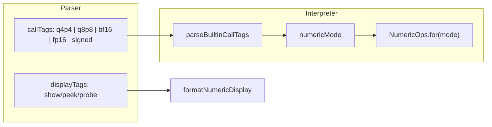

# Plan: tag-uri q4p4 / q8p8 / bf16 / fp16 (faza 1)

**Status:** faza 1 implementată (v0_3_2). Teste: 1471/1471.

## Context

Infrastructura existentă ([`signed-arithmetic.js`](../v0_3_2/core/signed-arithmetic.js)) folosește un flag boolean `signedMode` propagat din `parseBuiltinCallTags()` prin [`interpreter.js`](../v0_3_2/core/interpreter.js) și modulele `*-reduce.js`. Tag-urile `q4p4` / `q8p8` / `bf16` / `fp16` **nu există** încă.

**Decizii confirmate:**

- Tag-uri fix-point: **`q4p4`** (Q4.4, W=8) și **`q8p8`** (Q8.8, W=16) în script; alte Q-uri (`q16p16`, …) — faze ulterioare.
- Faza 1 include **vector / matrix / row / col** (ca la `signed`), nu doar scalar.



---

## Model de design

### Tag-uri mutual exclusive (format numeric)

La un apel, **cel mult un** tag de format:

| Tag | Semnificație | Lățime wire (faza 1) |
|-----|--------------|----------------------|
| *(fără tag)* | unsigned (compatibilitate) | orice W |
| `signed` | two's complement | orice W |
| `q4p4` | fixed-point Q4.4 (4 int + 4 frac, TC pe întreg) | **W = 8** |
| `q8p8` | fixed-point Q8.8 (8 int + 8 frac, TC pe întreg) | **W = 16** |
| `bf16` | brain float 16 | **W = 16** |
| `fp16` | IEEE 754 half | **W = 16** |

Combinabile cu `vector`, `matrix`, `row`, `col`, `index` — la fel ca `signed` azi. Eroare dacă apar două tag-uri de format (`; signed fp16`, `; q4p4 q8p8`, `; q8p8 bf16`, etc.).

### Refactor: `signedMode` → `numericMode`

În loc de `boolean signedMode` peste tot, introducem:

```javascript
// conceptual — în parseBuiltinCallTags sau modul nou
numericMode: 'unsigned' | 'signed' | 'q4p4' | 'q8p8' | 'bf16' | 'fp16'
```

Modulele `vector-reduce.js`, `matrix-reduce.js`, `tensor-axis-reduce.js` primesc `numericMode` (sau un obiect `ops` din registry) în loc de `signed: boolean`. `signedMode` devine `numericMode === 'signed'` pentru compatibilitate internă minimă în ramurile existente.

### Modul nou: `numeric-formats.js`

Fișier central [`v0_3_2/core/numeric-formats.js`](../v0_3_2/core/numeric-formats.js):

| Responsabilitate | Detalii |
|----------------|---------|
| Registry formate | `NUMERIC_FORMATS`, `BUILTIN_FORMAT_TAG_FUNCS` (whitelist faza 1) |
| Validare lățime | `assertWidthForFormat(bin, W, mode)` |
| Codec | `binToNumber` / `numberToBin` per format |
| Operații | `addAtWidth`, `subtractAtWidth`, `sumExpanded`, `pickMinMax`, `compare` |
| Display | `formatForShow(bin, W, mode)` |

**Fixed-point partajat (q4p4 + q8p8):** implementare generică `Qx.y` parametrizată:

| Tag | I (int) | F (frac) | W | Scală | Interval reprezentabil (aprox.) |
|-----|---------|----------|---|-------|--------------------------------|
| `q4p4` | 4 | 4 | 8 | ÷ 16 | −8 … +7.9375 |
| `q8p8` | 8 | 8 | 16 | ÷ 256 | −128 … +127.996… |

Valoare = `signedInt(raw) / 2^F`. Aceeași semantica operațională pentru ambele:

- ADD/SUB = adunare pe reprezentarea întreagă cu **wrap la W biți**
- Al 2-lea return la ADD/SUB = overflow când rezultatul matematic iese din intervalul Q reprezentabil
- SUM: acumulare în precizie extinsă (pattern ca `sumExpanded` signed din [`vector-reduce.js`](../v0_3_2/core/vector-reduce.js)), apoi wrap + flag `over`
- MIN/MAX: comparare pe valoarea fixă

**Semantica float (faza 1):**

- **fp16**: pack/unpack IEEE 754 half (16 biți). ADD/SUB/SUM/MIN/MAX via decode → operație în `float64` → encode înapoi cu rotunjire IEEE. Al 2-lea return la ADD/SUB: `1` dacă rezultatul e `Inf`/`NaN` din operand finit (sau propagare NaN documentată). SUM scalar: acumulare ordine stânga-dreapta cu rotunjire la fiecare pas (simplu, predictibil).
- **bf16**: la fel ca fp16 dar codec bf16 (1+8+7, truncare din float32 — `Math.fround` + re-pack).

**Display** (`show` / `peek` / `probe`):

- `show(w; q4p4)` / `show(w; q8p8)` → fracție zecimală, ex. `1.5`, `\-1.5`, `127.25`
- `show(w; fp16)` / `show(w; bf16)` → reprezentare zecimală float (ex. `3.14`, `inf`, `nan`) — fără a schimba biți pe wire

Adăugare în [`parser.js`](../v0_3_2/core/parser.js) `SHOW_PEEK_DISPLAY_TAGS` / `PROBE_DISPLAY_TAGS` și în [`debug-display-format.js`](../v0_3_2/core/debug-display-format.js) `FORMAT_TAGS`.

---

## Faza 1 — scope implementare

### Built-in-uri cu tag de apel

| Built-in | Variante faza 1 | Al 2-lea return |
|----------|-----------------|-----------------|
| **ADD** | `; q4p4` / `; q8p8` / `; bf16` / `; fp16` + vector/matrix | overflow/inexact (semantica per format) |
| **SUBTRACT** | idem | idem |
| **SUM** | idem + row/col | `over` (fixed-point ca signed; float: flag dacă Inf/NaN) |
| **MIN**, **MAX** | idem + vector/matrix/row/col | un singur return |
| **show**, **peek**, **probe** | display tags `q4p4`, `q8p8`, `bf16`, `fp16` | — |

### Fișiere de modificat (faza 1)

| Fișier | Schimbare |
|--------|-----------|
| **NOU** [`numeric-formats.js`](../v0_3_2/core/numeric-formats.js) | Codec fixed-point (q4p4/q8p8) + float + registry + parse format tags |
| [`signed-arithmetic.js`](../v0_3_2/core/signed-arithmetic.js) | Extinde `parseBuiltinCallTags`: recunoaște `q4p4`/`q8p8`/`bf16`/`fp16`, returnează `numericMode` |
| [`interpreter.js`](../v0_3_2/core/interpreter.js) | Înlocuiește `signedMode` cu `numericMode` pe ramurile ADD/SUB/SUM/MIN/MAX; `BUILTIN_DOC` overload-uri noi |
| [`vector-reduce.js`](../v0_3_2/core/vector-reduce.js) | `sumExpanded`, `minMaxVectorTagged`, `addSubtractVectorTagged` — param `numericMode` |
| [`matrix-reduce.js`](../v0_3_2/core/matrix-reduce.js) | Variante matrix pentru aceleași op-uri |
| [`tensor-axis-reduce.js`](../v0_3_2/core/tensor-axis-reduce.js) | SUM/MIN/MAX pe `; row` / `; col` |
| [`debug-display-format.js`](../v0_3_2/core/debug-display-format.js) | Formatare display pentru cele 4 formate |
| [`parser.js`](../v0_3_2/core/parser.js) | Whitelist display tags |
| [`doc/arithmetic.md`](../v0_3_2/doc/arithmetic.md) + `builtin-ADD.md` etc. | Semnături `; q4p4` / `; q8p8` / `; bf16` / `; fp16`, exemple `logts-play` |
| [`doc/builtin-tagged-index.md`](../v0_3_2/doc/builtin-tagged-index.md) | Index tag-uri noi |
| [`tests/test_suite.js`](../v0_3_2/tests/test_suite.js) | Grup nou `builtin-numeric-formats` |

### Ordine implementare recomandată

1. **`numeric-formats.js`** — handler generic fixed-point (q4p4 + q8p8) + codec float; teste izolate (q4p4: 1.5+0.5; q8p8: 1.25+0.75; fp16/bf16 edge)
2. **Display** — `show(w; q4p4)` / `show(w; q8p8)` etc. (rapid de verificat vizual)
3. **`parseBuiltinCallTags` + ADD/SUBTRACT scalar** — cel mai simplu flux 2-operand
4. **MIN/MAX scalar** — comparare per format
5. **SUM scalar** — `sumExpanded` generalizat
6. **Vector/matrix/axis** — reutilizare pattern `signed`
7. **Doc + teste integrare** — regresie: fără tag = unsigned neschimbat; `signed` neschimbat

### Exemple țintă (doc / teste)

```logts-play
8wire a = 00011000   # 1.5 în q4p4
8wire b = 00001000   # 0.5
8wire s, 1wire ovf = ADD(a, b; q4p4)
show(s; q4p4)
show(ovf)
```

```logts-play
16wire a = 0000000101000000   # 1.25 în q8p8
16wire b = 0000000001100000   # 0.75
16wire s, 1wire ovf = ADD(a, b; q8p8)
show(s; q8p8)
show(ovf)
```

```logts-play
16wire x = ...   # 1.0 fp16
16wire y = ...   # 2.0 fp16
16wire z, 1wire flag = ADD(x, y; fp16)
show(z; fp16)
```

```logts-play
8wire[4] v = ...
8wire total, 8wire over = SUM(v; q4p4)
8wire maxVal = MAX(v; q4p4)
```

```logts-play
16wire[4] w = ...
16wire total, 16wire over = SUM(w; q8p8)
16wire maxVal = MAX(w; q8p8)
```

---

## Estimare efort (faza 1)

**Total realist: 4,5–6,5 zile** de lucru focusat (≈ **35–50 ore**). q8p8 adaugă puțin față de estimarea inițială (același motor fixed-point ca q4p4, dar teste + doc suplimentare).

| Bloc | Efort | Note |
|------|-------|------|
| `numeric-formats.js` | 1,5–2 zile | Motor Q generic (q4p4+q8p8); fp16/bf16 codec |
| Tag parsing + `numericMode` | 0,5 zi | Mutual exclusion, extindere parser |
| Display show/peek/probe | 0,5 zi | Pattern existent, +q8p8 |
| Scalar ADD/SUB/SUM/MIN/MAX | 1 zi | Refactor `interpreter.js` |
| Vector / matrix / axis | 1–1,5 zile | 3 module reduce |
| Teste + doc | 1 zi | Regresie unsigned/signed |

**Livrare incrementală (risc redus):**

| Pas | Livrabil | Timp |
|-----|----------|------|
| 1 | Display + fixed-point scalar ADD/SUB (q4p4 + q8p8) | ~1,5 zile |
| 2 | q4p4/q8p8 SUM/MIN/MAX + vector | ~1 zi |
| 3 | fp16/bf16 scalar | ~1 zi |
| 4 | fp16/bf16 vector/matrix + doc/teste | ~1,5 zile |

---

## Faze ulterioare (în afara scope-ului faza 1)

| Fază | Conținut |
|------|----------|
| **2** | GT, LT, CLAMP, MULTIPLY, MAC, DOT, DIVIDE, ABS, RSHIFT, ARGMAX, ARGMIN cu tag-uri format |
| **3** | Familie Q extinsă: `q16p16` și altele (reutilizare motor `Qx.y` generic) |
| **4** | Literali sursă pentru inițializare (ex. `1.5` în q4p4) în [`wire-literals.js`](../v0_3_2/core/wire-literals.js) |
| **5** | Overload-uri user `def` cu tag `q4p4`/`q8p8`/`fp16` ([`user-func-overloads.js`](../v0_3_2/core/user-func-overloads.js)) |

**Explicit fără format tags (ca la signed):** porți logice, MUX/REG, LSHIFT, rotații, N2N10S, ZCONNECT.

Vezi și: [user_def_tag_overloads.plan.md](user_def_tag_overloads.plan.md) (faza `signed` implementată).

---

## Teste (faza 1)

Grup `builtin-numeric-formats` în [`test_suite.js`](../v0_3_2/tests/test_suite.js):

- q4p4: ADD 1.5+0.5=2.0, overflow la depășire ±8, MIN/MAX pe vector
- q8p8: ADD 1.25+0.75=2.0, overflow la depășire ±128, MIN/MAX pe vector 16wire
- fp16/bf16: ADD finit, NaN propagation, lățime greșită → eroare
- display: `show(w; q4p4)` / `q8p8` / `fp16` / `bf16`
- mutual exclusion: `; signed q4p4`, `; q4p4 q8p8` → eroare
- regresie: `ADD` fără tag și `; signed` neschimbate

---

## Riscuri / atenție

- **Lățime fixă:** q4p4 → W=8, q8p8/bf16/fp16 → W=16; validare clară la runtime (`ADD: ; q8p8 requires 16-bit operands, got 8`).
- **q8p8 vs bf16/fp16** pe același wire de 16 biți: interpretarea depinde **doar** de tag (wire agnostic, ca la `signed`).
- Refactorul `signedMode` → `numericMode` atinge multe linii în `interpreter.js`; merită făcut incremental (display → scalar → vector) cu teste după fiecare pas.
