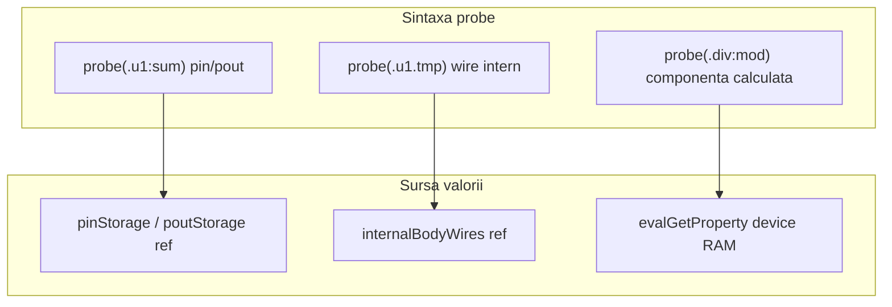
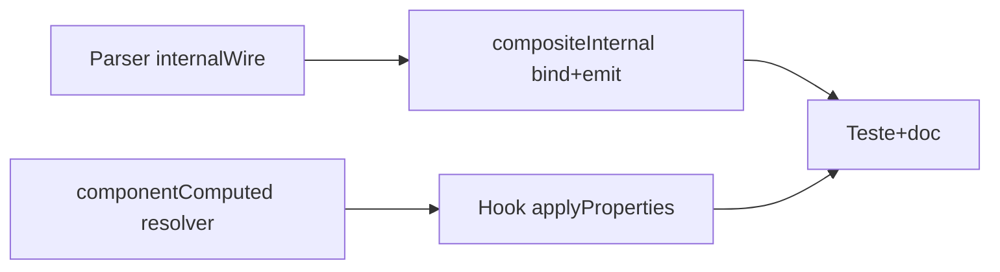

# Plan: probe faza 2 — componente fără storage + fire interne chip/PCB

## Context (ce există deja)

În [`v0_3_2/core/interpreter.js`](v0_3_2/core/interpreter.js) probe are kind-uri: `wire`, `ref`, `component` (doar `:get` + `comp.ref`), `composite` (pin/pout instanță via `probe(.u1:sum)`).

**Lipsește:**
- `probe(.div:mod)` — parser OK, resolver ignoră (test 825)
- `probe(.u1.tmp)` — **parser nu acceptă**; după `.u1` urmează doar bit numeric (`.0`) sau `:prop`

Firele interne sunt persistate per instanță în `instance.internalBodyWires` la finalul [`executeChipBody`](v0_3_2/core/interpreter.js) / [`executePcbBody`](v0_3_2/core/interpreter.js) — **nu** în `this.wires` global.



## Convenții sintaxă (confirmate)

| Formă | Semnificație |
|-------|----------------|
| `probe(.u1:sum)` | pin sau pout declarat — **deja implementat** |
| `probe(.u1.tmp)` | wire intern din body (nu pin/pout) — **nou** |
| `probe(.div:mod)` | proprietate componentă fără ref — **nou** |
| `probe(.div:get)` | la fel pentru quotient etc. |

**Fără fallback:** `.u1.sum` nu se mapează la pout `sum`; pout-urile rămân exclusiv cu `:`.

---

## Partea A — Parser: atom `.inst.wire`

**Fișier:** [`v0_3_2/core/parser.js`](v0_3_2/core/parser.js) — `atom()`, ramura `SYM '.'` + `compName`.

Înainte de bit-range (`.0`, `.2-4`), dacă tokenul după al doilea `.` este **ID** (nu BIN/DEC):

```javascript
{ var: '.u1', internalWire: 'tmp' }
```

- `probe(.u1.tmp.0)` — slice pe wire intern: faza 2 poate amâna bit-range; documentăm „fără slice” inițial (ca la componente faza 1).
- Test parser nou: `probe(.u1.tmp)` → atom cu `internalWire: 'tmp'`.

**PCB body:** nu colectează `probe` în `parser.probes` (spre deosebire de chip). Nu e necesar pentru sintaxa externă; opțional aliniere ulterioară.

---

## Partea B — Probe fire interne chip/PCB

### B1. Resolver și target

În [`interpreter.js`](v0_3_2/core/interpreter.js):

- `_resolveProbeInternalWireTarget(atom)` — kind `compositeInternal`
  - `instanceName` = `atom.var`
  - `wireName` = `atom.internalWire`
  - caută în `chipInstances` / `pcbInstances` → `instance.internalBodyWires.get(wireName)`
  - **nu** caută în `pinStorage` / `poutStorage` (conform alegerii utilizatorului)
  - dacă lipsește la `activateProbes` → target pending cu `ref: null` (înregistrare amânată)

- Label output: `# .u1.tmp = 1010 (&N) - reason`

- Cheie unică: `xi:.u1:tmp`

### B2. Legare ref după exec body

`internalBodyWires` se populează doar după prima rulare body. Strategie:

1. **`_bindInternalProbeTargets(instanceName)`** — apelat la sfârșitul `executeChipBody` și `executePcbBody`:
   - pentru target-uri `compositeInternal` ale instanței, actualizează `ref` + `bitWidth` din `internalBodyWires`
   - dacă `ref` nou și valoare diferită → emite (`initialised` sau `changed`)

2. **`activateProbes`** (postExecSrc) — pentru target-uri `compositeInternal` fără ref, reîncearcă bind pe toate instanțele existente, apoi emite `initialised`

3. **Emisie la schimbare** — reutilizare `_emitProbeForRef` (extinde kind `compositeInternal` alături de `composite` / `component`)

### B3. Ordinea în script

Documentat: instanța + cel puțin un exec body (la `chip [x] .u1::` sau property block `set`) **înainte** ca `internalBodyWires` să conțină wire-ul. `probe(.u1.tmp)` poate apărea oriunde în RUN; bind-ul final la `postExecSrc` + după fiecare re-exec body.

### B4. Exemplu test (chip)

Extinde pattern [`CHIP_HALFADD`](v0_3_2/test_suite_ported.js) cu wire intermediar:

```logts
chip +[halfAddDbg]:
  ...
  4wire partial = .add:get   // intern, nu e pout
  sum = partial
  carry = .add:carry
  :4bit sum

chip [halfAddDbg] .u1::
probe(.u1.partial)
.u1:{ a=0101 b=0011 set=1 }
```

Assert: `# .u1.partial = 1000 - initialised`; după al doilea pulse pe `set` → `changed`.

Test PCB similar (`pcb +[passthrough]` cu `4wire shadow = NOT(data)` + `probe(.q.shadow)`).

---

## Partea C — Probe componente fără storage

### C1. Extindere resolver

Modifică `_resolveProbeComponentTarget` în [`interpreter.js`](v0_3_2/core/interpreter.js):

- Dacă `comp.ref` lipsește **și** `componentRegistry.supportsProperty(type, property)`:
  - kind `componentComputed`
  - `key: 'cc:.div:mod'`, `label: '.div:mod'`, `ref: null`
  - permite **orice** proprietate din `getSupportedProperties()`, nu doar `:get`

- Dacă `comp.ref` există → păstrează kind `component` (faza 1)

**Componente vizate** (toate `ref: null` la `createDevice`):

| Tip | Proprietăți probe |
|-----|-------------------|
| divider | `:get`, `:mod` |
| adder, subtract | `:get`, `:carry` |
| multiplier | `:get`, `:over` |
| shifter | `:get`, `:out` |
| mem, reg, counter | `:get` |
| osc | `:counter` (`:get` are ref — rămâne faza 1) |
| 7seg, lcd, dots, ledBar, 14seg | `:get` (display) |

### C2. Citire valoare

`_readComputedComponentProbeValue(target)` → `evalGetProperty(comp, property, …)` (deja folosit parțial în `_readComponentProbeValue`).

### C3. Hook emisie (fără ref)

Funcție centrală **`_emitComputedComponentProbes(compName)`**:

- iterează `probeTargets` cu `kind === 'componentComputed'` și `compName` potrivit
- citește valoare curentă, `_emitProbeTarget` dacă diferă

**Apeluri** după recalcul device:

| Loc | Motiv |
|-----|--------|
| După `handler.applyProperties(…)` în fluxul property block (~5844) | divider/adder la `:set` |
| După `executeChipBody` / `executePcbBody` | componente interne prefixed din body |
| Opțional: după `reEvalWiresDependingOnChip/Pcb` | dacă testele arată gap |

**Motiv probe:** `changed` la recalcul; `edge committed` doar dacă emisia e în property block cu `probeReasonContext === 'edge_block'` (mem/reg) — aliniat cu fire REG.

### C4. Exemplu test

```logts
comp [divider] .div:
  depth:4
  on:1
  :
probe(.div:mod)
.div:{ a=1100 b=0011 set=1 }
```

Assert `# .div:mod = 0010 - initialised`; schimbare `a` + pulse `set` → `changed`.

---

## Partea D — Documentație și teste

**Fișier:** [`v0_3_2/doc/debug.md`](v0_3_2/doc/debug.md)

- Tabel sintaxă: `:` = pin/pout/proprietate componentă; `.` după instanță = wire intern
- Secțiune componente fără storage (înlocuiește „nu (faza 2)”)
- Exemple `logts-play` pentru divider `:mod` și chip cu `partial`
- Notă: `probe(.u1.tmp)` ≠ `probe(.u1:tmp)` (al doilea ar căuta port numit `tmp`)

**Teste** în [`test_suite_ported.js`](v0_3_2/test_suite_ported.js) + [`test_manifest.js`](v0_3_2/test_manifest.js), ID **831+**:

| ID | Scenariu |
|----|----------|
| 831 | Parser `probe(.u1.tmp)` |
| 832–833 | Chip wire intern legacy/wave |
| 834–835 | PCB wire intern legacy/wave |
| 836–837 | `probe(.div:mod)` legacy/wave |
| 838 | `probe(.add:carry)` adder |
| 839 | `probe(.u1:sum)` vs `probe(.u1.sum)` — al doilea ignorat dacă `sum` e doar pout |

**Helper:** [`test_session.js`](v0_3_2/test_session.js) — `execStmts` există deja.

După editare `.md`: `node v0_3_2/_gen_doc_data.js`

**Validare:** `node v0_3_2/_run_suite_node.js` → țintă 350+ teste.

---

## Ordine implementare recomandată



1. Parser + `compositeInternal` (izolat, teste chip/PCB)
2. `componentComputed` + hook `applyProperties` (teste divider/adder)
3. Documentație + manifest
4. (Opțional viitor) `probe(wire)` **în** body chip — probe scoped pe definiție; **în afara scope-ului** acestui plan

---

## Riscuri / limitări

- **Timing:** wire intern inexistent la primul `activateProbes` dacă body nu a rulat — documentat; bind la următorul exec body
- **Display `:get`:** emite la fiecare recalcul property block, nu la fiecare pixel UI — acceptabil pentru debug
- **Coliziune nume:** `tmp` în două instanțe → probe separate per `instanceName`
- **Nu implementăm:** slice `probe(.u1.tmp.0)`, probe nested `.outer.inner`, fallback `.u1.sum` → pout
