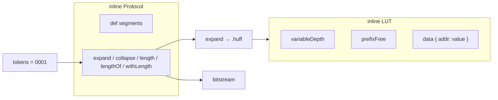
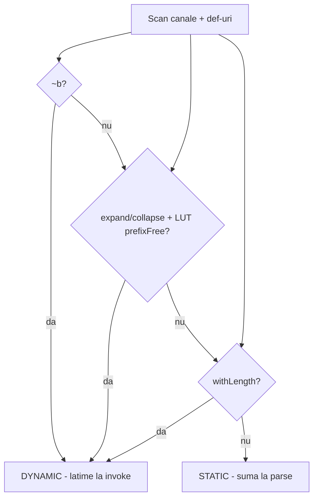

# Plan: LUT variableDepth/prefixFree + Protocol Extensions (v0.3.2)

## Schimbare de direcție față de planul anterior

**Eliminat complet:**

- `prefixFree` ca mod protocol cu invocare simbolică `{ A B C }`
- `concat()`, `padLeft()`, `padRight()`, `crc()`
- **`checksum()`** — nu intră în protocol
- **`variableLength`** ca atribut protocol separat
- **Extinderea `:decode()`** la generatoarele noi — vezi § Politică `:decode` mai jos
- Sintaxă LUT nouă `00 : 0` la nivel de corp — **păstrăm `data { }`**

**Model unificat:**

- **LUT** stochează mapări cheie → valoare (cu `variableDepth` / `prefixFree`)
- **Protocol** transformă biți la invoke `{ param = bits }` (același model ca UART/SPI)
- Transformarea „inversă” = **alt protocol** (ex. `.huffRecover` cu `withLength` + `collapse`), nu `:decode()`
- Limbajul **nu distinge** encoder vs decoder — utilizatorul definește protocoale separate



---

## Politică `:decode()` (neschimbat)

**Ce există azi:** `.uart8n1:decode(bits)` — astăzi în [`decode.md`](v0_3_2/doc/decode.md) (fișier separat). Teste **945–946**. Funcționează pentru segmente existente (`reverse`, `parityEven`, literale, etc.).

**Decizie:** **nu extindem** `decodeChannel` / `decodeProtocol` pentru `length`, `lengthOf`, `withLength`, `expand`, `collapse`. Corectitudinea unui decode generic devine prea complexă prea repede.

| Mecanism | Când |
|----------|------|
| `.uart8n1:decode(...)` | Protocoale simple existente (UART) — **păstrat ca atare** |
| `.huffRecover { data = ... }` | Transformări complexe — **protocol separat** cu generatoare |
| Regresie | Testele 945–946 rămân verzi; opțional un test 1091 de regresie |

---

## Partea 1 — LUT: `variableDepth` și `prefixFree`

### Fișiere: [`lut-labels.js`](v0_3_2/core/lut-labels.js), [`lut-decode.js`](v0_3_2/core/lut-decode.js), [`lut.js`](v0_3_2/core/components/lut.js), [`interpreter.js`](v0_3_2/core/interpreter.js)

### Atribute noi (boolean flags, linie fără valoare)

| Atribut | Efect |
|---------|-------|
| `variableDepth` | Valorile din `data { }` pot avea lățimi diferite; `depth:` interzis |
| `prefixFree` | Valorile trebuie prefix-free; **implică** `variableDepth`; `depth:` interzis |

### Reguli validare (parse time)

- `depth: N` + `variableDepth` → `variableDepth cannot be combined with depth`
- `depth: N` + `prefixFree` → `prefixFree cannot be combined with depth`
- `prefixFree`: valoare `v1` prefix strict al `v2` → `prefixFree violation: value '…' is a prefix of value '…'`
- Valori goale interzise

### Sintaxă LUT — **neschimbată** (`data { }`)

```logts
inline [lut] .huff:
  prefixFree
  data {
    00: 0
    01: 10
    10: 110
    11: 111
  }
:
```

### Implementare tehnică

1. **`parseLutBody`**: `variableDepth`, `prefixFree`
2. **`parseLutDataWithLabels`**: fără `value.length === depth` când `variableDepth`
3. **Lookup forward** (`expand`): `lutTable[addr]` → valoare variabilă
4. **`collapse` prefixFree**: greedy match pe valori → chei `keyWidth` biți
5. **`lutDecode` fixed depth**: neschimbat (folosit intern de `collapse` pe LUT fix)
6. **`doc(.huff)`**: afișează atribute + intrări

### Exemple LUT (documentație)

**`variableDepth` — valid:**

```logts
inline [lut] .example:
  variableDepth
  data {
    00: 0
    01: 101
    10: 11
  }
:
```

**`prefixFree` — invalid:**

```logts
inline [lut] .bad:
  prefixFree
  data {
    00: 0
    01: 01
    10: 11
  }
:
```

→ `prefixFree violation: value '0' is a prefix of value '01'`

**`doc(.huff)`:**

```text
.huff (inline [lut])
  prefixFree
  00 -> 0
  01 -> 10
  10 -> 110
  11 -> 111
```

---

## Partea 2 — Protocol: `def` (segmente locale)

### Fișier: [`protocol-assembler.js`](v0_3_2/core/protocol-assembler.js)

```logts
def payload:
  length(data) 8b
  data
```

- Parse înainte de canale; `def` nu emite singur — doar când e referit (`out: payload`, `lengthOf(payload)`)

### Exemplu `def` (documentație)

```logts
inline [protocol] .packet:
  def payload:
    length(data) 8b
    data
  out:
    payload
:
```

Output: `length(data)` + `data` (concatenare automată).

---

## Partea 3 — Generatoare protocol

Toate în [`protocol-assembler.js`](v0_3_2/core/protocol-assembler.js): `parseSegmentLine`, `evalSegment` — **doar la generate/invoke**, fără extindere `:decode`.

### Parametri `data ~b`

| Declarație | Semnificație |
|------------|--------------|
| `data 8b` | fix 8 biți |
| `tokens 2b` | fix 2 biți |
| `data ~b` | variabil — `arg.length` la invoke |

### `length(param) Nb`

- Emite `bitLength(param)` pe `N` biți (pad stânga)
- Fix / variabil (`~b`); eroare dacă depășește `2^N-1`

### `lengthOf(segment) Nb`

- Lungimea **output-ului generat** de segment/def
- Evaluare în două faze (cache — fără dublare biți)

### `withLength(data, Nb)`

- Citește `N` biți → `L`; returnează următorii `L` biți; rest ignorat

### `expand(data, .lut, keyWidth)` / `collapse(data, .lut, keyWidth)`

- **expand**: split `keyWidth` → lookup LUT → concat valori
- **collapse fix depth**: split pe `depth` → reverse lookup
- **collapse prefixFree**: greedy pe valori

### Lățime protocol: statică la parse vs runtime

Lățimea totală se calculează **la parse** când e posibil; **la invoke** doar când definiția conține un declanșator dinamic.

#### Scan (parse time)

Parcurge **canale + toate `def`-urile** (referințele la `def` se expandă pentru scan). Dacă apare **oricare** declanșator → protocolul/canalul e **`DYNAMIC`**:

| # | Declanșator | Exemplu |
|---|-------------|---------|
| 1 | parametru **`~b`** | `data ~b` în canal sau în `def` |
| 2 | **`expand` / `collapse`** pe LUT cu **`prefixFree`** | `expand(tokens, .huff, 2b)` — rezolvă `.huff` din inline instances |
| 3 | **`withLength(...)`** | `withLength(data, 8b)` |

Nu e nevoie de verificare separată „`encoded` e static” — un `def encoded` cu `expand(..., .huff, ...)` e prins de declanșatorul 2.

#### STATIC (fără declanșatori)

- Sumă la **parse** lățimile segmentelor: literali, `data Nb`, `length(x) Nb`, `reverse`/`parity`/`clock`/`repeat`, `expand`/`collapse` pe LUT cu **`depth` fix** (nu `prefixFree`), `lengthOf(x) Nb` (contribuie `Nb` + lățimea statică a lui `x`)
- Exemple: `.uart8n1` → 10 biți; `expand(tokens 8b, .table depth:4, 2b)` → 16 biți
- Verificare assignment: `10wire tx = .uart8n1 { ... }` — mismatch la **parse** dacă lățimea wire ≠ suma statică

#### DYNAMIC (≥1 declanșator)

- `generateProtocol` calculează `totalWidth` la **invoke**
- Verificare assignment: egalitate exactă `wireValue.length === bits` la invoke; `=:` / `:=` pentru pad ([`assignment-operators.md`](v0_3_2/doc/assignment-operators.md))
- Exemple: `.packet { data ~b }`; `.huffPacket` (prefixFree în `def encoded`)



**Implementare:** `inferProtocolWidth(inst)` în `protocol-assembler.js` → `{ kind: 'static', width }` sau `{ kind: 'dynamic' }`; stocat pe instanța inline; folosit în interpreter la assignment.

### Exemple protocol (documentație)

#### `length(param) Nb` — variabil

```logts
inline [protocol] .packet:
  out:
    length(data) 16b
    data
:
```

`.packet { data = 101010 }` → `0000000000000110` + `101010`

#### `lengthOf(segment) Nb`

```logts
inline [protocol] .packet:
  def encoded:
    expand(tokens, .huff, 2b)
  out:
    lengthOf(encoded) 8b
    encoded
:
```

`encoded = 010` → `00000011` + `010`

#### `length()` vs `lengthOf()`

Pe același invoke, `length(tokens)` și `lengthOf(encoded)` **pot diferi**.

#### `withLength(data, Nb)`

`00000011 01000000` + `withLength(data, 8b)` → payload `010`

#### `expand` / `collapse`

Input `000110`, `.huff`, `2b` → `010110`

`collapse(010110, .huff, 2b)` → `000110`

#### Exemplu combinat (round-trip)

```logts
inline [lut] .huff:
  prefixFree
  data { 00: 0  01: 10  10: 110  11: 111 }
:

inline [protocol] .huffPacket:
  def encoded:
    expand(tokens, .huff, 2b)
  out:
    lengthOf(encoded) 8b
    encoded
:

inline [protocol] .huffRecover:
  out:
    collapse(withLength(data, 8b), .huff, 2b)
:
```

```logts
4wire source = 0001
11wire encoded = .huffPacket { tokens = source }
4wire recovered = .huffRecover { data = 0000001101000000 }
```

`recovered` = `0001` = `source`

#### Nu intră în scope

`concat()`, `padLeft()`, `padRight()`, **`checksum()`**, extindere `:decode()` la generatoare noi.

---

## Partea 4 — Documentație

### Exemple rulabile (`logts-play`)

Orice exemplu pe care utilizatorul îl poate rula în editor folosește fence **`logts-play`** (nu `logts`). Viewer-ul (`doc-viewer.js` → `enhancePlayBlocks`) adaugă butoane **Load** și **Load & Run**.

| Tip conținut | Fence |
|--------------|-------|
| Script complet rulabil | ` ```logts-play ` |
| Sintaxă / fragment non-rulabil | ` ```logts ` sau ` ```text ` |
| Output așteptat, mesaje eroare | ` ```text ` |

**Reguli:**

- Fiecare secțiune „Runnable” din tabelele de mai jos = **cel puțin un** bloc `logts-play` cu script autocontinut (prelude + invoke unde e cazul)
- Exemple combinate (Huffman round-trip): un bloc sau două (`huffPacket` / `huffRecover`) — ambele `logts-play`
- Migrare din `decode.md`: exemplele UART / I2C / LUT decode / ASM `show(.cpu:decode(...))` → `logts-play`
- După editare: `node v0_3_2/_gen_doc_data.js`
- Nu descrie în prose butoanele Load — UI-ul le oferă implicit pe `logts-play`

### Migrare `decode.md` → inline per tip

**Decizie:** eliminăm [`decode.md`](v0_3_2/doc/decode.md). Conținutul merge în documentația fiecărui inline — un fișier separat nu ajută utilizatorul.

| Sursă din `decode.md` | Destinație | Acțiune |
|----------------------|------------|---------|
| Protocol `:decode(channels...)` | [`protocol.md`](v0_3_2/doc/protocol.md) | Secțiune nouă + `logts-play` UART / I2C; erori; notă: **nu** extins la generatoare noi — transformare inversă = alt protocol (`.huffRecover`) |
| LUT `:decode(value [, matchIndex])` | [`lut.md`](v0_3_2/doc/lut.md) | Extinde secțiunea existentă (~L190); scoate linkurile către `decode.md`; păstrează/adaaugă `logts-play`; erori; `matchIndex` |
| ASM `:decode(instruction)` | [`asm.md`](v0_3_2/doc/asm.md) | Secțiune nouă + **`logts-play`**; doar `show()` / `doc()`; eroare la assignment pe wire |
| Tabel comparativ inline + `doc()` decode hints | Scurt în fiecare fișier la `doc()` | Protocol/LUT/ASM fiecare cu propriul „decode: supported” |

**Ștergere / actualizări index:**

- Șterge `v0_3_2/doc/decode.md`
- [`doc-index.json`](v0_3_2/doc/doc-index.json) — scoate intrarea `decode.md`; mută `searchExtra` decode în `lut` / `protocol` / `asm`
- [`doc-viewer.js`](v0_3_2/ui/doc-viewer.js) — scoate `decode.md` din `DOC_SECTIONS` (sau via `_gen_doc_data.js`)
- [`lut.md`](v0_3_2/doc/lut.md) Related — înlocuiește link `decode.md` cu „vezi secțiunea `:decode` mai sus”
- Verifică referințe rămase: `doc-data.js` regenerat, `lut.md` L192/L491

### [`lut.md`](v0_3_2/doc/lut.md) — extensii noi

| Secțiune | Runnable `logts-play` |
|----------|------------------------|
| `variableDepth` | `.example` cu valori 0, 101, 11 |
| `prefixFree` | `.huff` + eroare prefix |
| Cross-ref | → protocol.md (`expand` / `collapse`) |

### [`protocol.md`](v0_3_2/doc/protocol.md) — extensii noi

| Secțiune | Runnable `logts-play` |
|----------|------------------------|
| **`:decode()`** (din fostul decode.md) | `.uart8n1:decode(0100000101)`; notă limită + `.huffRecover` ca alternativă |
| `def` | `.packet` cu `def payload` |
| `length()` | fix `8b` + variabil `data ~b` |
| `lengthOf()` | `def encoded` + `expand` |
| `length` vs `lengthOf` | side-by-side |
| `withLength()` | 8b / 16b |
| `expand()` / `collapse()` | `.huff` + `.table` |
| **Combined** | `.huffPacket` / `.huffRecover` |
| **Lățime statică vs dinamică** | UART static 10b; `.huffPacket` dinamic (prefixFree) |
| **Not Included** | concat, padLeft, padRight, checksum |

### [`asm.md`](v0_3_2/doc/asm.md) — `:decode`

| Secțiune | `logts-play` |
|----------|----------------|
| **`:decode(instruction)`** | `show(.cpu:decode(00010111))` — prelude ISA minimal + show |
| Erori | exemplu rulabil comentat sau secțiune text (assignment interzis) |

- `doc-index.json`, `_gen_doc_data.js`
- **Nu** recrea `decode.md`

---

## Partea 5 — Teste (ID-uri de la **1067**)

### Grup `lut-ext` (8 teste)

| ID | Titlu |
|----|-------|
| 1067 | `variableDepth` — valori de lățimi diferite |
| 1068 | `variableDepth` + `depth:` → eroare |
| 1069 | `prefixFree` — Huffman valid |
| 1070 | `prefixFree` — violare prefix |
| 1071 | `prefixFree` + `depth:` → eroare |
| 1072 | `prefixFree` implică `variableDepth` |
| 1073 | `doc(.huff)` |
| 1074 | `.huff(in=01)` → `10` |

### Grup `protocol-ext` (16 teste)

| ID | Titlu |
|----|-------|
| 1075 | `def` — `length(data) 8b` + `data` în `payload` |
| 1076 | `length(data) 16b` + `data ~b` = `101010` |
| 1077 | `length(data) 8b` fix → `00001000` |
| 1078 | `lengthOf(encoded) 8b` — `010` → `00000011` + `010` |
| 1079 | `length(tokens)` ≠ `lengthOf(encoded)` |
| 1080 | `expand` — `000110` → `010110` |
| 1081 | `expand` — input nu e multiplu de keyWidth → eroare |
| 1082 | `collapse` — fixed depth LUT |
| 1083 | `collapse` — prefixFree greedy |
| 1084 | `withLength(data, 8b)` → `010` |
| 1085 | `withLength(data, 16b)` |
| 1086 | **Round-trip** `0001` → `00000011010` → `0001` |
| 1087 | lățime **STATIC** — `expand` + LUT `depth:4`, `tokens 8b` → 16 biți la parse |
| 1088 | lățime **DYNAMIC** — `.huffPacket` marcat dynamic (prefixFree în def) |
| 1089 | `doc(inline.protocol)` — generatoare noi |
| 1090 | regresie `:decode` UART (945) — neschimbat |

După: `_gen_manifest.js`, `_run_suite_node.js`.

---

## Fișiere de modificat

| Fișier | Schimbări |
|--------|-----------|
| `lut-labels.js` | variableDepth, prefixFree |
| `lut-decode.js` | helper collapse prefixFree |
| `protocol-assembler.js` | def, generatoare, `inferProtocolWidth`, eval |
| `interpreter.js` | assignment STATIC la parse / DYNAMIC la invoke; LUT ref expand |
| `lut.md`, `protocol.md`, `asm.md` | extensii + `:decode` inline; **șterge decode.md** |
| `test_suite_ported.js` | 1067–1090 |

**În afara scope-ului:** `checksum()`, `concat()`, `padLeft()`, `padRight()`, `crc()`, extindere `:decode()`, `comp [uart]` runtime.

---

## Ordine implementare

1. LUT `variableDepth` + `prefixFree`
2. Protocol `def` + parametri `~b`
3. `expand` / `collapse`
4. `length` / `lengthOf` / `withLength` + `inferProtocolWidth`
5. Documentație (`logts-play` pe toate exemplele rulabile; migrare `decode.md`) + teste + manifest

## Riscuri

- **`inferProtocolWidth`**: la scan, rezolvă LUT-uri inline referite în `expand`/`collapse` (definiția LUT trebuie să preceadă protocolul sau același script)
- **`lengthOf` + `def` + `expand`**: evaluare la invoke cu cache — round-trip 1086 devreme
- **Greedy collapse**: match pe valori din `lutTable`, nu pe chei
- **Regresie**: UART static 10b + teste `:decode` 945–946 rămân verzi
