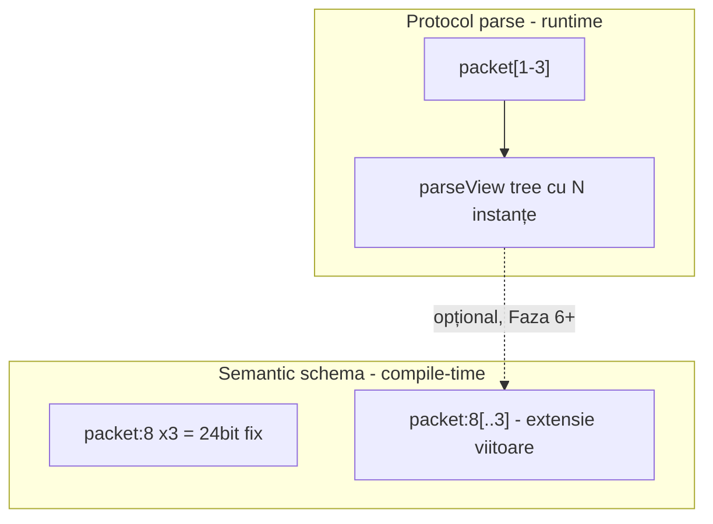
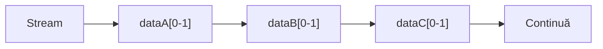
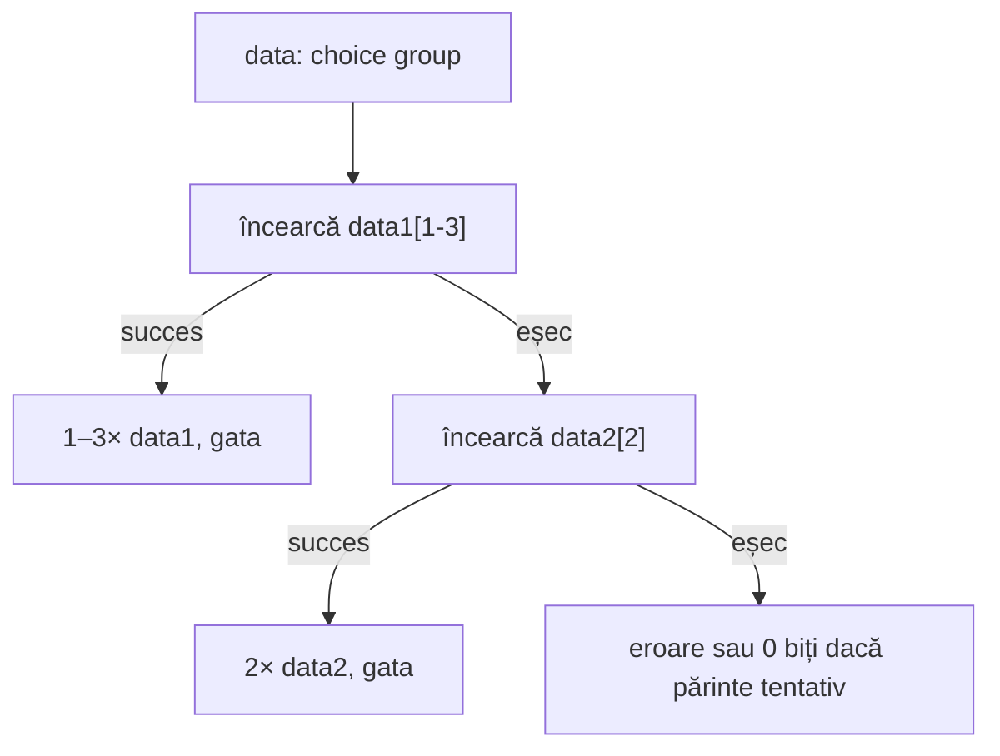
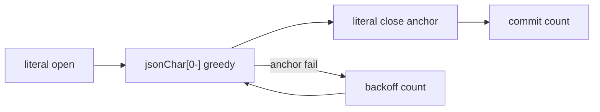
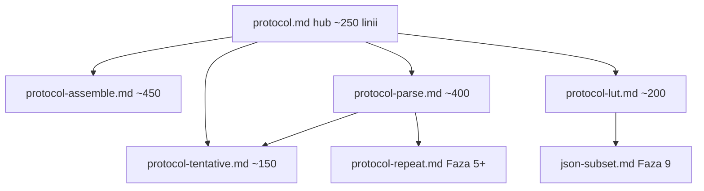
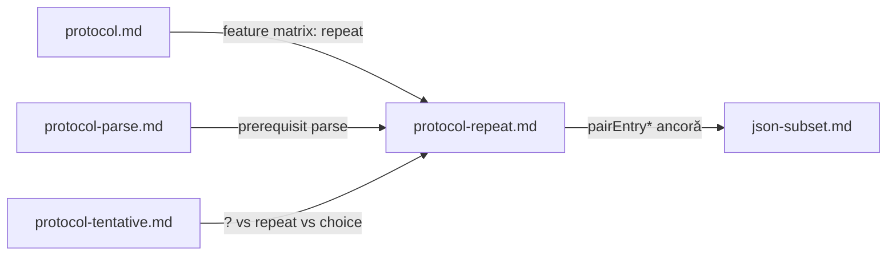
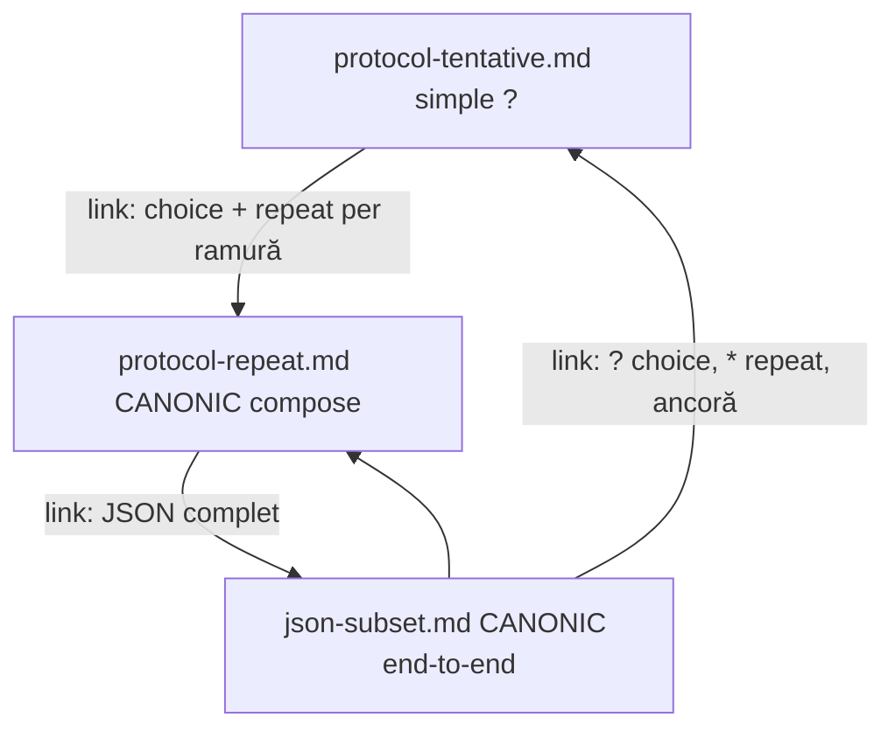

# Plan: Repetări secțiuni protocol + vectori în parseView/schema

**Continuare:** [protocol_tentative_sections.plan.md](protocol_tentative_sections.plan.md) (Fazele 1–4 ✅).

## Verdict scurt: are sens, dar pe două straturi diferite

**Da**, direcția e solidă și se aliniază cu ce există deja în limbaj (vectori pe wire: `16wire[3]<opcode>`). **Nu** recomand să unificăm totul într-o singură sintaxă sau să forțăm `packet:8[3]` în `<test>:` ca prim pas — repetarea e **runtime parse**, schema semantică e **compile-time fixă**.



---

## 1. Maparea sintaxei tale — ce e clar, ce e ambiguu

| Sintaxă propusă | Semantica ta | Recomandare |
|-----------------|--------------|-------------|
| `packet[3]` | exact 3 ori | **Păstrează** — clar, prioritate Faza 5a |
| `packet[1-3]` | min 1, max 3 | **Păstrează** — motor greedy (vezi §3) |
| `packet[0-1]` | ≈ opțional 0–1 | **Sugar valid**, dar **nu** echivalent cu `packet?` (vezi §2) |
| `packet[0-]` | 0..∞ | **Păstrează**; echivalent cu `packet*` |
| `packet[-3]` | 0..3 | **Respinge** — folosește `packet[0-3]` (min explicit) |
| `packet[-]` | eroare | **Da** — mesaj: „folosește `*` sau `[0-]`” |
| `packet*` | 0..∞ | **Sugar** pentru `[0-]` |
| `packet+` | 1..∞ | **Sugar** pentru `[1-]` |

**De ce resping `[-3]`:** notația `[-N]` sugerează „doar max, min implicit 0”, dar se confundă cu index negativ și cu range deschis `[0-]`. Un singur model: **`[min]`**, **`[min-max]`**, **`[min-]`** — toate capetele explicite sau omisiune controlată.

**Canon recomandat (EBNF conceptual):**

```
sectionUse ::= name repeatSpec?
repeatSpec ::= '[' n ']' | '[' min '-' max ']' | '[' min '-]' | '*' | '+'
```

`?` rămâne **marcaj tentativ/choice**, nu repetare.

---

## 2. Două mecanisme distincte: secvență vs choice

Motorul distinge **cum sunt grupate itemii** în listă, nu doar ce scrie pe fiecare linie.

### 2a. `[0-1]` consecutive **fără** `?` — opționale independente, ordine fixă

```text
dataA[0-1]
dataB[0-1]
dataC[0-1]
```

Comportament (greedy max-first **per secțiune**, stânga → dreapta):

1. `dataA`: încearcă 1× → reușit = 1 instanță; eșec = 0 biți, continuă
2. `dataB`: la fel, pe streamul rămas
3. `dataC`: la fel

**Rezultat:** 0–3 secțiuni prezente, **ordinea impusă** (A înainte de B înainte de C). Nu sunt mutual exclusive — pot apărea toate trei, sau doar B, etc.



**Caz tipic:** header opțional, body opțional, footer opțional — fiecare poate lipsi independent.

### 2b. `?` consecutive — **choice group** (deja implementat Faza 1–4)

```text
object?
number?
string?
bool?
```

În [`parseItemsList`](v0_3_2/core/protocol-assembler.js), itemii tentativi consecutivi formează **un singur grup choice**:

1. Încearcă `object` → eșec → rollback
2. Încearcă `number` → eșec → rollback
3. … prima reușită **câștigă**; restul nu se mai încearcă

**Rezultat:** **0 sau 1** ramură din grup (0 dacă părintele e tentativ și toate eșuează). **Mutual exclusive** — nu poți avea `object` și `number` în același grup.

### 2c. JSON — direcția corectă

Pentru **valoare JSON** (exact una din tipuri), vrei **choice (2b)**, nu secvență (2a):

```text
def jsonValue:
  mode: parse
  parseView: tree
  object?
  number?
  string?
  bool?
  null?
  array?
```

`object?[0-1]` pe fiecare linie **nu schimbă** semantica față de `object?` în choice: fiecare alternativă e oricum încercată **o singură dată**. `[0-1]` pe ramură choice = **redundant** în v1; recomandare: **nu combina** `?` + `[0-1]` în același item (eroare de compilare sau ignoră `[0-1]` cu warning).

**Structură ierarhică** (conceptual, pe biți/ASCII):

```text
def jsonObject:
  sym open 8b      # {
  pair[0-]         # cheie:string, valoare — repetare secvență
  sym close 8b     # }

def jsonArray:
  sym open 8b      # [
  jsonValue[0-]    # elemente separate — repetare + choice imbricat
  sym close 8b     # ]
```

`jsonValue` = choice între tipuri; `pair[0-]` / `jsonValue[0-]` = repetare secvențială (2a extins la `*`).

### 2d. Ordinea contează: `data1[1-3]?` DA — `data1?[1-3]` NU

**Regulă sintactică:**

```
sectionUse ::= name repeatSpec? tentativMark?
tentativMark ::= '?'          # mereu la SFÂRȘIT
repeatSpec   ::= '[' n ']' | '[' min '-' max ']' | '[' min '-]' | '*' | '+'
```

| Formă | Semnificație |
|-------|--------------|
| `data1[1-3]?` | ramură **choice**; dacă câștigă → repetă `data1` de 1–3 ori |
| `data2[2]?` | ramură **choice**; dacă câștigă → repetă `data2` exact de 2 ori |
| `data1[1-3]` | **fără** `?` → repetare obligatorie în secvență (nu choice) |
| `data1?` | choice; o singură instanță (echivalent `data1[1-1]?` conceptual) |
| `data1?[1-3]` | **eroare compile** — ordine greșită |
| `data1+?`, `data1*?` | **respinse** — folosește `[0-]` / `[1-]` |

**Exemplul tău — fără wrapper def:**

```text
def data1:
  kind 8b

def data2:
  idx 3b
  1
  short 4b

data:
  data1[1-3]?
  data2[2]?
```

Echivalent cu varianta `type1Data` / `type2Data`, dar **direct** — nu e nevoie de def intermediar doar pentru choice + repetare.



**Motor:** la fiecare alternativă tentativă, rulezi mai întâi logica `repeatSpec`, apoi commit ca ramură choice (același rollback ca azi).

### 2d-b. Ce rămâne respins / redundant

| Pattern | Verdict | Motiv |
|---------|---------|-------|
| `data1[1-3]?` + `data2[2]?` în choice | **DA** | repetare diferită per ramură |
| `def t: data1[1-3]` + `t?` | **DA** (opțional) | același efect, mai verbos — util la reutilizare |
| `packet[0-4]` fără `?` în secvență | **DA** | opțional secvențial, fără choice |
| `packet[1-4]?` singur (fără alt `?`) | echivalent `def t: packet[1-4]` + `t?` | opțional bloc cu min 1 când activ |
| `packet[0-4]?` | redundant | folosește `packet[0-4]` |
| `packet+?`, `packet*?` | **respinse** | folosește `*` / `+` / `[0-]` |
| `object?[0-1]` în choice JSON | redundant | `object?` e suficient |

**Nu confunda:**

- `data1[1-3]?` + `data2[2]?` = alege **una** din două moduri de repetare (choice)
- `data1[1-3]` apoi `data2[2]` = **ambele** în ordine, fiecare cu repetarea lui (secvență)
- `data1[0-1]` + `data2[0-1]` = două opționale independente în secvență (nu choice)

### 2e. `data[0-1]` ≠ `data?` — confirmat

| Construct | Mecanism | Când |
|-----------|----------|------|
| `packet[0-1]` | repetare secvențială | secțiune opțională, fără alternative |
| `packet?` singur (fără vecini `?`) | o încercare tentativă | similar 0–1 la suprafață, alt mecanism |
| `ipv4?` / `ipv6?` | choice | una din variante |

**Da — ai înțeles corect:** `data[0-1]` ≠ `data?`. Primul = repetare 0–1 a aceleiași secțiuni în secvență; al doilea = tentativ (choice dacă are vecini `?`, altfel o încercare opțională).

---

## 3. Semantica motorului de repetare (rollback)

### 3.1 Bounded `[min-max]` — greedy max-first (decizie §10.1)

```
packet[1-3]:
  for count = 3 down to min:
    checkpoint
    try count × packet consecutive
    if success: commit
  throw "min repetitions not met"
```

`packet[3]`: fără backoff — eșec la orice iterație = eroare.

### 3.2 Unbounded `[0-]` / `*` — **ancoră obligatorie** (nu `scanUntil` separat)

**Nu implementăm `scanUntil`.** Delimitarea = același mecanism ca secvență cu repetare + segment obligatoriu după:

```text
out:
  a
  b[0-]
  c
```

`c` e **ancoră**: loop-ul `b[0-]` încearcă greedy (multe `b`), apoi verifică dacă `c` parsează; dacă nu → backoff (mai puține `b`) până `c` reușește sau count=0 eșuează pe `c`.

**String JSON — același lucru:**

```text
def jsonString:
  "\""
  jsonChar[0-]
  "\""
```

`jsonChar[0-]` se oprește când `"` final (ancoră) se potrivește — nu e nevoie de primitiv separat.



| Context | Comportament `[0-]` / `*` |
|---------|---------------------------|
| Urmează segment **obligatoriu** (`c`, `"`, `}`) | backoff până ancora parsează |
| **Ultimul** segment din def/canale | eșec la iterația următoare = stop (0+ valid) |

**Exemplu:** `a` + `b[0-]` + `c` ≡ delimitare până la `c`. Pentru `b[0-]?` + `c`: `?` e **redundant** dacă `[0-]` permite deja 0 — preferă `b[0-]` + `c`.

**Limitare Faza 9:** fără escape `\"` în string — `"` în conținut rupe ancora (JSON invalid oricum fără escape).

**Checkpoint per iterație:** fiecare iterație = `stream.save()` + `fields.snapshot()`; la succes parțial în loop `[min-max]`, commit doar la count final valid.

**LUT / collapse:** repetările în interiorul unei secțiuni expandate trebuie să respecte același `pendingLutEntries` — flush la succesul întregului grup repetat, rollback la eșecul count-ului curent.

---

## 4. parseView tree — da, vectori indexați

Azi [`resolveParseViewSlice`](v0_3_2/core/protocol-assembler.js) caută copil cu `children.find(c => c.name === part)` — **un singur nod per nume**. Repetările sparg asta.

**Model recomandat pentru tree:**

```yaml
# parse din packet[1-3] cu 2 reușite
children:
  - name: packet
    index: 0          # NOU
    width: 96
    children: [...]
  - name: packet
    index: 1
    width: 96
    children: [...]
```

**Acces câmpuri** (aliniat la wire vectors `rom:1:alu`):

```
parsed:packet:0:src
parsed:packet:1:src
```

Implementare minimă în [`interpreter.js`](v0_3_2/core/interpreter.js) `_resolveParseViewFieldRange`: după `packet`, următorul segment numeric = index, apoi câmp.

**`show` tree:** afișează `packet[0]`, `packet[1]` (sau `packet:0` consistent cu accesul).

**Câmpuri plate `ParseFields`:** ultima iterație câștigă pentru `src` simplu — documentat. Datele per-index rămân în parseView; pentru scripturi care au nevoie de toate instanțele, folosesc `parsed:packet:N:field`.

---

## 5. Vectori în semantic schema (`<test>: packet:8[3]`)

**Ce există azi** ([`semantic-schemas.md`](v0_3_2/doc/semantic-schemas.md)):

- Câmp: `name:width` (biți fixi)
- Vector pe **wire**: `16wire[3]<opcode>` — fiecare element = o instanță schema
- **Nu** există `packet:8[3]` în definiția schema

**Are sens conceptual:** `packet:8[3]` = 3 × 8 biți = 24 biți total în schema compilată (static).

**Problema:** protocolul cu `packet[1-3]` produce **lățime variabilă** (1–3 instanțe). Schema `packet:8[3]` e **fixă** — mismatch.

| Scenariu | Schema | Protocol |
|----------|--------|----------|
| Fix 3 pachete | `packet:8[3]` sau 3 câmpuri | `packet[3]` |
| Variabil 1–3 | nu încă în `<test>:` | `packet[1-3]` + parseView |
| Opțional 0–N | nu încă | `packet*` + parseView |

**Recomandare în 3 trepte:**

1. **Faza 5** — repetare protocol + parseView indexat; **fără** extensie schema
2. **Faza 6** — schema cu array **fix** `field:W[N]` pentru wires cu `8wire[N]<schema>` (simetrie wire↔schema)
3. **Faza 7+** — schema variabilă `field:W[min..max]` sau schema generată din protocol (`parseViewId` deja pe wire) — evaluare după experiență Faza 5

**Nu** lega obligatoriu `<test>:` de protocol repetition în prima iterație — parseView e sursa de adevăr pentru formă variabilă la runtime.

---

## 6. Diferență față de `repeat()` existent

[`protocol.md`](v0_3_2/doc/protocol.md): `repeat(0101, 8b)` = **pattern tiling** în assemble — aceeași secvență de biți repetată ca **literal**, nu secțiune structurată.

Repetarea de secțiune = **re-invocare** `def packet` cu câmpuri/LUT/children proprii fiecărei iterații. Nume diferit în documentație: „section repeat” vs „bit repeat”.

---

## 7. Impact cod — fișiere cheie

| Fișier | Schimbări |
|--------|-----------|
| [`protocol-assembler.js`](v0_3_2/core/protocol-assembler.js) | `parseBodyItem`: `name[min-max]?`, `name[n]?`, `name*?` în choice; AST `localRef { repeat, tentative }`; loop repetare înainte de commit choice; parseView cu `index` |
| [`interpreter.js`](v0_3_2/core/interpreter.js) | `_resolveParseViewFieldRange` / `resolveParseViewSlice`: index numeric după nume secțiune; `formatParseViewShow` cu `[i]` |
| [`semantic-schemas.js`](v0_3_2/core/semantic-schemas.js) | Faza 6: `field:W[N]` în parser schema |
| [`protocol.md`](v0_3_2/doc/protocol.md) | Tabel sintaxă repetare, separare de `?` și `repeat()` |
| [`test_suite.js`](v0_3_2/tests/test_suite.js) | 2157+: `[3]`, `[1-3]`, `*`, `+`, parseView index, erori `[-]` |

**Fără schimbări** la tentative choice groups pentru Faza 5a — repetarea e un nou `kind` de item (ex. `repeatedSection`), nu extensie a `isTentativeItem`.

---

## 8. Fazare propusă

### Faza 5a — repetare obligatorie bounded + exact + choice cu repetare
- cod (protocol-assembler, interpreter, teste 2157+)
- **doc:** `protocol-repeat.md` — fiecare exemplu în ` ```logts-play legacy ` + test `session.run()` echivalent

### Faza 5b — sugar și unbounded
- `packet*`, `packet+`, `packet[0-]`
- eroare explicită pentru `[-]` (mesaj: folosește `*` sau `[0-]`)
- `inferProtocolWidth` dynamic

### Faza 5c — lanțuri `[0-1]` + doc choice vs secvență + **linkuri cross-doc**
- Teste: `dataA[0-1] dataB[0-1] dataC[0-1]` (0–3 independente)
- **protocol-tentative.md** ↔ **protocol-repeat.md**: linkuri reciproc + tabel ? vs [0-1]
- Eroare compile: `?[min-max]` ordine greșită (`data1?[3]`), `+?`, `*?`

### Faza 6 — schema fixă `field:W[N]`
- Doar pentru width total cunoscut la compile
- Validare `8wire[3]<test>` cu `<test>: cell:8[3]`

### Faza 7+ (amânat)
- `parseTag`, schema union, `field:W[min..max]`, `rest -footer`
- ~~`scanUntil`~~ — **respins**; folosim ancoră + `[0-]` (§3.2)

### Faza 8 — wire literals în protocol (**prerequisit JSON**)

**Scop:** aceiași literali ca în [`wire-literals.md`](v0_3_2/doc/wire-literals.md) — **fără** helper `ascii()` separat.

| Prioritate | Formă | Utilitate |
|------------|-------|-----------|
| P0 | `"{"` / `"true"` / `'x'` string 8b/char | JSON, bool, punctuație |
| P1 | `\123;8` padding explicit | lățime fixă per byte |
| P2 | `^7B;8` hex cu padding | alternative la binar verbos |
| P3 | `\-3;s8`, `\-1.5;q4p4` | mai puțin în parse structură |

**Implementare:** `parseLiteralToken` → delegare `wire-literals.js`; parse cu `stream.read(W)` la lățimea literalului.

**Ordine:** Faza 5 (repetare) + Faza 8 (literali) → **Faza 9 JSON subset**.

### Faza 9 — JSON subset (integrare + documentație)

**Livrabile:**
- Protocol `.jsonSubset` (după Faza 5 + 8)
- **[`json-subset.md`](v0_3_2/doc/json-subset.md)** — pagină separată ca [huffman-v2.md](v0_3_2/doc/huffman-v2.md): protocol complet, layout biți/ASCII, runnable `logts-play`, round-trip parse + `show` parseView, suite tests
- Link din [`protocol.md`](v0_3_2/doc/protocol.md) (ca Huffman) — nu tot JSONul în protocol.md
- `doc-data_generated.js` + test doc

**Conținut doc:** choice `jsonValue`, `pairEntry*` / `arrayEntry*`, string cu ancoră `"`, fără whitespace, fără number.

---

## 9. Exemplu end-to-end (țintă Faza 5)

```text
def packet:
  mode: parse
  parseView: tree
  sym src 32b

def frame:
  mode: parse
  parseView: tree
  sym hdr 16b
  packet[1-3]
  sym fcs 16b
```

După parse cu 2 pachete: `show(parsed)` → `packet[0]` … `packet[1]`; `parsed:packet:1:src` returnează biții corecți.

---

## 10. Decizii închise

### 10.1 Greedy max-first — **DA** (decizie asistent)

Pentru `[min-max]`, motorul încearcă **count = max**, apoi scade până la min. Motiv: consistent cu tentative/rollback existent; pe stream ambiguu, min-first ar produce mai multe instanțe decât intenția (ex. `packet[1-3]` pe graniță de secțiune).

### 10.2 Index 0-based în parseView — **DA** (confirmat)

`parsed:packet:0:kind`, `packet[0]` în `show` — aliniat la `vector:0:field` pe wires.

### 10.3 Câmpuri plate `ParseFields` — ultima iterație câștigă

**Două straturi de date după parse:**

| Strat | Ce e | Exemplu `packet[1-3]` cu 2 reușite |
|-------|------|-------------------------------------|
| **ParseFields** (plat) | un singur slot per nume câmp | `kind` = valoarea din **ultima** iterație (a 2-a) |
| **parseView tree** | istoric complet indexat | `packet[0].kind`, `packet[1].kind` |

De ce: `ParseFields` e modelul vechi, simplu, folosit de checksum/LUT/câmpuri imediate — nu e array. Repetarea adaugă istoric în **parseView**; acces per-index: `parsed:packet:1:kind`.

Dacă scriptul folosește doar `kind` fără index, primește ultima — documentat, nu surpriză. Pentru toate instanțele → parseView.

### 10.4 Schema variabilă `field:W[min..max]` — **amânat**

**`<test>:` semantic schema** = lățime **fixă** la compile (`kind:8` → 8 biți total cunoscuți).

**Protocol parse** = formă **variabilă** la runtime (`packet[1-3]` → 1–3 instanțe).

Nu forțăm schema să descrie variabilitatea protocolului în Faza 6–7. Sursa de adevăr runtime = **parseView** (+ `parseViewId` pe wire). Schema cu `[min..max]` doar când avem caz concret de wire + validare compile (ex. consumer care declară `64wire<jsonProto>` și vrea verificare statică).

---

## 10b. Închis la implementare

| # | Subiect | Decizie |
|---|---------|-----------|
| A | **String JSON** | `"` + `jsonChar[0-]` + `"` — ancoră §3.2, **fără** `scanUntil` |
| B | **Obiect gol `{}`** | `pairList?` unde `pairList = jsonPair pairEntry*` |
| C | **Array gol `[]`** | `valueList?` simetric |
| D | **`inferProtocolWidth`** | `[min-max]` cu min≠max → `dynamic` |
| E | **parseView choice+repeat** | ramură câștigătoare + `index` pe instanțe |
| F | **Doc JSON** | pagină dedicată `json-subset.md` (model huffman-v2) |

---

## 11. Exemplu: JSON subset (Faza 9 — după Faza 5 + Faza 8)

**Prerequisit:** repetare (`pairEntry*`, `jsonChar[0-]`) + wire string literals (`"{"`, `"true"`, `","`).

**JSON minimal** — fără whitespace, fără number, fără `ascii()` helper.

### 11.1 Document țintă (compact)

```json
{"active":true,"tags":["x","y"],"meta":{"ok":false}}
```

### 11.2 Protocol (wire-literals + repetare)

```text
inline [protocol] .jsonSubset:
  mode: parse
  parseView: tree

  def jsonBool:
    "true"?
    "false"?

  def jsonChar:
    byte 8b
  def jsonString:
    "\""
    jsonChar[0-]
    "\""

  def jsonValue:
    jsonObject?
    jsonArray?
    jsonString?
    jsonBool?

  def jsonPair:
    jsonString
    ":"
    jsonValue

  def pairEntry:
    ","
    jsonPair

  def pairList:
    jsonPair
    pairEntry*

  def jsonObject:
    "{"
    pairList?
    "}"

  def arrayEntry:
    ","
    jsonValue

  def valueList:
    jsonValue
    arrayEntry*

  def jsonArray:
    "["
    valueList?
    "]"

  out:
    jsonObject
  :
```

**Virgule:** primul element obligatoriu în `pairList` / `valueList`; restul via `pairEntry*` / `arrayEntry*`. Obiect/array gol: `pairList?` / `valueList?` omis.

**Whitespace:** nu — tokeni consecutivi pe wire (JSON minim).

### 11.3 Mecanisme

| Fragment | Mecanism |
|----------|----------|
| `jsonValue` choice | `object?` / `array?` / … |
| `pairEntry*` / `arrayEntry*` | repetare Faza 5, separator în def |
| `"true"` / `"{"` | wire-literals Faza 8 |
| `jsonChar[0-]` | conținut string între ghilimele |

### 11.4 parseView tree așteptat (conceptual)

```text
jsonObject
  jsonPair[0] → jsonString "active" + jsonBool
  jsonPair[1] → jsonString "tags" + jsonArray …
  jsonPair[2] → jsonString "meta" + jsonObject …
```

Acces: `parsed:jsonPair:1:jsonArray:0:…` (index 0-based).

---

## 12. Literali protocol azi vs wire literals

În protocol **nu** merge `"{"`, `\-1.5;q4p4`, `\-3;s8`, `\10;8` — doar subsetul din `parseLiteralToken` ([`protocol-assembler.js`](v0_3_2/core/protocol-assembler.js)).

| Formă | Wire literals | Protocol azi |
|-------|---------------|--------------|
| `01010101` | da | da |
| `^7B` | da (+ `;p` opțional) | da, **fără padding** → `^7B` = 7 biți, nu 8 |
| `\10` | da (+ `;8` etc.) | da, doar unsigned → `\10` = `1010` (4 biți) |
| `"{"` string | da | **nu** |
| `\-1.5;q4p4` | da | **nu** |
| `\-3;s8` signed | da | **nu** |

Parse: `stream.read(W)` + match exact — fără tag-uri q4p4.

**Planificat Faza 8:** bridge la wire-literals — **fără** `ascii()`; `"true"`, `"{"` direct în protocol.

---

## 13. Restructurare documentație `protocol.md` (~1550 linii)

**Problemă:** o singură pagină acoperă assemble, parse, tentative, LUT, Huffman SC, checksum — greu de navigat. **Model:** [huffman.md](v0_3_2/doc/huffman.md) + [huffman-v2.md](v0_3_2/doc/huffman-v2.md).

### 13.1 Propunere: hub + 4 pagini tematice



| Fișier | Conținut (mutat din `protocol.md`) | Linii aprox. |
|--------|-----------------------------------|--------------|
| **[protocol.md](v0_3_2/doc/protocol.md)** (hub) | Intro, naming, declare/use, canale, atribute (tabel + link), quick start UART, **feature matrix** cu linkuri, `doc()`, erori comune (scurt), vs ASM, **index navigare** | ~250 |
| **[protocol-assemble.md](v0_3_2/doc/protocol-assemble.md)** | Segmente, literali, parametri, generatoare (`reverse`, `parity`, `clock`, `repeat`), exemple UART/SPI/I2C, `def`, `length`/`lengthOf`, `withLength` (encode), `:decode`, `data ~b`, `inferProtocolWidth`, `checksum` encode | ~450 |
| **[protocol-parse.md](v0_3_2/doc/protocol-parse.md)** | `mode: parse`, cursor `stream` vs `data`, câmpuri parse, `parseResult`, `codebookLoad`, `withLength` parse, `validateChecksum`, `rest ~` / `rest -Nb`, `execStmts` | ~400 |
| **[protocol-tentative.md](v0_3_2/doc/protocol-tentative.md)** | Secțiuni `?`, choice, mandatory/tentativ, `parseView: tree`, `parsed:…` field access, erori tentative | ~150 |
| **[protocol-lut.md](v0_3_2/doc/protocol-lut.md)** | `expand` / `collapse`, `keyWidth b`, prefixFree; link la huffman — **nu** duplică `.huffRecoverSC` (rămâne în huffman-v2) | ~200 |
| **json-subset.md** | Faza 9 — exemplu protocol JSON | nou |
| **protocol-repeat.md** | Faza 5+ — `[n]`, `*`, ancoră, choice+repeat | viitor |

### 13.2 Ce scoatem / nu duplicăm

- **§ Complex example `.huffRecoverSC`** (~120 linii) — deja în [huffman-v2.md](v0_3_2/doc/huffman-v2.md); în `protocol-parse.md` doar link + 2 propoziții.
- **§ Combined Huffman round-trip** — mutat în [huffman.md](v0_3_2/doc/huffman.md) sau doar link din `protocol-lut.md`.
- **Tentative** — pagină separată (ca feature distinct), nu îngropată la mijlocul parse.

### 13.3 Index doc viewer + `doc(inline.protocol)`

- `components.md` / index: `protocol` → hub; sub-linkuri opționale în tabel Storage.
- `doc(inline.protocol)` rămâne pe **hub** (template + linkuri către sub-pagini).
- Actualizare anchor-uri în huffman.md, huffman-v2.md, lut.md, signal-propagation.md.
- Regenerare `doc-data_generated.js` + test doc (ex. 2156 pattern).

### 13.4 Când — split doc vs feature docs

| Moment | Ce |
|--------|-----|
| **Faza doc** (opțional, înainte de 5a) | Split `protocol.md` → hub + assemble + parse + tentative + lut (**mutare** conținut existent) — **livrată ✅** |
| **Faza 5a–5c** | Conținut nou → **`protocol-repeat.md`** (nu înapoi în monolit) |
| **Faza 8** | Notă literali în `protocol-parse.md` + `protocol-assemble.md` (secțiune scurtă) |
| **Faza 9** | **`json-subset.md`** — exemplu care *folosește* repeat + tentative + wire-literals |

### 13.5 Unde intră **protocol section repetition** (Fazele 5–5c)

**Pagină dedicată:** [`protocol-repeat.md`](v0_3_2/doc/protocol-repeat.md) — la fel cum `?` are [`protocol-tentative.md`](v0_3_2/doc/protocol-tentative.md), nu amestecăm repetarea în hub.



**Ce documentăm în `protocol-repeat.md` (din acest plan):**

| Capitol | Sursă plan | Fază doc |
|---------|------------|----------|
| Sintaxă `[n]`, `[min-max]`, `[0-]`, `*`, `+` | §1 | 5a–5b |
| Secvență vs choice; `data1[1-3]?` | §2 | 5a |
| `data[0-1]` ≠ `data?` | §2e | 5c |
| Greedy max-first; **ancoră** (`b[0-]` + `c`, string JSON) | §3 | 5b |
| parseView `packet[0]`, `parsed:packet:0:field` | §4 | 5a |
| `pairEntry*` / virgule | §11 | 5c + 9 |
| Erori `[-]`, `data1?[3]`, `+?` | §2d | 5b–5c |
| Deosebire `repeat()` bit tiling vs section repeat | §6 | 5a |

**Ce rămâne în alte pagini (linkuri, nu duplicare):**

| Pagină | Mențiune scurtă despre repeat |
|--------|------------------------------|
| **protocol.md** (hub) | Rând în feature matrix: „Section repeat — parse only → [protocol-repeat.md](protocol-repeat.md)” |
| **protocol-parse.md** | „Pentru repetări de secțiune `def`, vezi protocol-repeat.md”; `rest` și cursor rămân aici |
| **protocol-tentative.md** | Tabel `?` vs `[0-1]` vs `data1[1-3]?` + link la protocol-repeat §choice |
| **protocol-assemble.md** | **Nimic** (repetarea e parse-only); mențiune că `repeat(…)` e bit tiling, nu section repeat |
| **json-subset.md** | Exemplu integrat; link înapoi la protocol-repeat (ancoră, `pairEntry*`) |

**Ordine recomandată:**

1. **Faza doc** — split paginile vechi (fără repeat încă).
2. **Faza 5a** — creezi `protocol-repeat.md` cu conținut minimal + crești pe măsură ce implementezi.
3. **Faza 5c** — completezi tabele choice vs secvență.
4. **Faza 9** — `json-subset.md` ca „exemplu cookbook” care trimite la protocol-repeat pentru mecanisme.

**Teste doc:** 2157+ (repeat) în manifest; opțional `doc(inline.protocol)` pe hub listează sub-paginile parse (tentative, repeat).

### 13.6 Exemple compuse (tentative + repeat) — un loc canonic + linkuri

La split, **nu** duplicăm același runnable în tentative și repeat. Un exemplu **compus** are **un singur home**; celelalte pagini au 1 paragraf + link.



| Exemplu | Unde trăiește (canonic) | Ce acoperă | Linkuri din |
|---------|-------------------------|------------|-------------|
| **L3 / ethernet `ipv4?` / `ipv6?`** | `protocol-tentative.md` | choice simplu, fără repeat | hub, protocol-parse |
| **`data1[1-3]?` + `data2[2]?`** | **`protocol-repeat.md` § *Composing with tentative*** | choice + **repeat diferit** per ramură | `protocol-tentative.md` („când ramurile repetă altfel”), hub |
| **`dataA[0-1]` secvențial** (nu choice) | `protocol-repeat.md` § secvență | opționale independente | `protocol-tentative.md` (tabel ? vs [0-1]) |
| **Ancoră `b[0-]` + `c`** | `protocol-repeat.md` § ancoră | delimitare / string | `protocol-parse.md`, viitor `json-subset` |
| **JSON complet** | **`json-subset.md`** | choice `jsonValue?` + `pairEntry*` + `"` ancoră + nesting | `protocol-tentative.md`, `protocol-repeat.md`, `protocol-parse` (literali Faza 8) |

**Reguli cross-link:**

1. **`protocol-tentative.md`** — exemple **doar cu `?`** (fără `[n]` pe aceeași linie). La final: *„Choice cu repetări diferite pe ramură → [Composing with tentative](protocol-repeat.md#composing-with-tentative)”*.
2. **`protocol-repeat.md`** — secțiune dedicată **`## Composing with tentative`** cu runnable `data1`/`data2` + tabel „când folosești tentative vs repeat vs ambele”. Link înapoi: *„Choice de bază → [protocol-tentative.md](protocol-tentative.md)”*.
3. **`protocol.md` (hub)** — rând în index: *„Tentative + repeat together → protocol-repeat.md#composing-with-tentative; full JSON → json-subset.md”*.
4. **`json-subset.md`** — nu re-explică mecanismele; secțiune *„Building blocks”* cu 3 linkuri (tentative, repeat, wire-literals).
5. **Anchor stabil:** `#composing-with-tentative` pe repeat; `#choice-groups` pe tentative; `#building-blocks` pe json-subset — pentru linkuri din teste doc și din huffman/protocol-parse.

**Faza doc (split):** mutăm exemplele **simple** în paginile tematice; **nu** creăm încă compose-ul (vine la Faza 5a când există cod). La 5a adăugăm secțiunea compose în `protocol-repeat.md` + link din `protocol-tentative.md`.

### 13.7 Exemple documentație — `logts-play` + verificare fără erori

**Cerință (utilizator):** toate exemplele **noi** au butoane **Load** / **Load & Run** în doc viewer; exemplele **funcționează** și **nu dau erori**.

| Regulă | Detaliu |
|--------|---------|
| **Fence obligatoriu** | Exemple runnable: ` ```logts-play ` sau ` ```logts-play legacy ` (parse/protocol = de obicei **legacy**). Fără `logts-play` → **nu** apar butoanele. |
| **Snippet non-runnable** | Doar fragmente sintaxă (EBNF, erori așteptate) în fence plain ` ```text ` / ` ```logts ` — **fără** script complet de rulat. |
| **Paritate test ↔ doc** | Fiecare `logts-play` important = același script în [`test_suite.js`](v0_3_2/tests/test_suite.js) via `session.run()` (pattern teste 2147–2156, huffman). |
| **Teste doc pagină** | După split / pagină nouă: `reg(…, 'doc(protocol-repeat.md) — …')` sau `runDoc('doc(inline.protocol)')` actualizat pe hub. |
| **Gate per fază** | `node node/_gen_test_manifest.js` + `node node/_run_test_suite_node.js` — **0 erori** înainte de fază următoare. |
| **Migrare split** | La **Faza doc**: fiecare bloc `logts-play` mutat se rerulează; fix sau actualizare dacă API s-a schimbat. |

**Checklist livrabil doc (Fazele 5a, 5c, 8, 9, doc-split):**

1. Exemple noi în `logts-play` (Load / Load & Run vizibile în viewer).
2. Test `test_suite.js` care execută scriptul (nu doar `runDoc` grep text).
3. `doc-data_generated.js` regenerat.
4. Suite completă verde.

**Exemple minime de acoperit cu `logts-play` + test:**

| Fază | Exemplu doc | Test |
|------|-------------|------|
| 5a | `packet[3]`, `data1[1-3]?` choice, `parsed:packet:0:field` | 2157–2159 |
| 5b | `packet*`, ancoră `b[0-]` + `c` | 2160–2161 |
| 5c | `dataA[0-1]` lanț, compose tentative+repeat | 2162 + doc cross-link |
| doc-split | UART quick start (hub), L3 (tentative) — migrate | rerulare blocuri existente |
| 8 | `"{"` literal în protocol | 2163 |
| 9 | `.jsonSubset` parse + `show(parsed)` | 2164 + `json-subset.md` |
