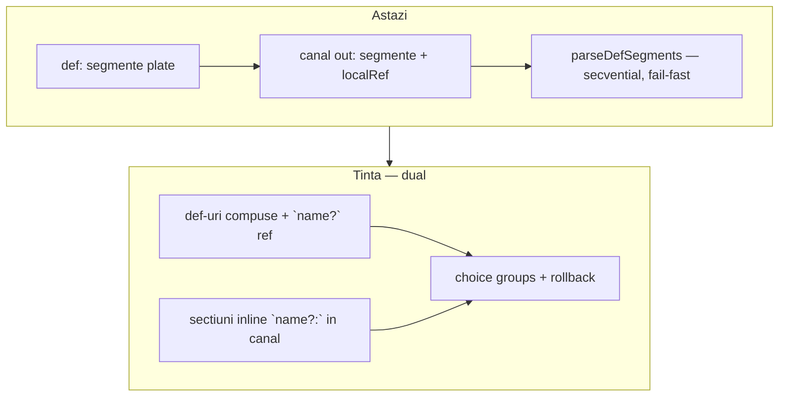
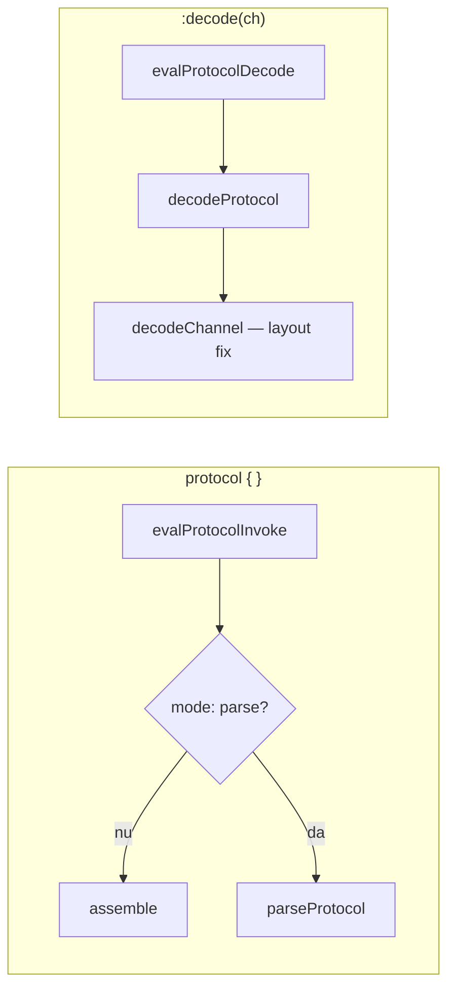

# Plan: Protocol Tentative Sections (`?`)

## Context — ce există azi

Motorul protocol este **complet implementat** în [`v0_3_2/core/protocol-assembler.js`](v0_3_2/core/protocol-assembler.js):

- **Assemble** (default): parametri → biți pe canale (`tx:`, `mosi:`, `out:`)
- **Parse** (`mode: parse`): `ParseStream` + `parseSegment()` — citire secvențială, literale = verificare, `sym 8b` = câmp extras
- **`def`**: segmente reutilizabile (`localRef`)
- Extensii v2: `length`, `lengthOf`, `withLength`, `expand`, `collapse`, `checksum`

Sketch-ul din [`.cursor/my_ideas/protocol tentative sections`](.cursor/my_ideas/protocol tentative sections) este **doar design** — zero cod, zero teste, zero mențiuni în [`protocol.md`](v0_3_2/doc/protocol.md).



---

## Model actual — cum funcționează `def` și canalele

Un protocol are structura **fixă, plată**:

```logts
inline [protocol] .pkt:
  mode: parse          # atribute (înainte de def/canale)

  def payload:         # bloc reutilizabil — listă plată de segmente
    length(data) 8b
    data 8b

  out:                 # canal output — tot listă plată
    payload            # localRef → expandează def inline
    checksum(crc16, data)
  :
```

**Reguli din cod** ([`parseProtocolBody`](v0_3_2/core/protocol-assembler.js)):

| Regulă | Efect |
|--------|-------|
| `def` înainte de canale | `seenChannel` blochează `def` noi după primul canal |
| Corp `def` = linii segment | nu există „sub-secțiuni” în interior |
| Referință `foo` (cuvânt singur) | `{ kind: 'localRef', name: 'foo' }` — **obligatoriu**, expandare inline |
| `parseDefSegments` | parcurge segmentele **secvențial**; orice eșec = throw global |
| Canale | doar la nivel top; fiecare canal = listă de segmente |

**Ce NU face modelul actual:**
- nu are nesting structural (doar compoziție prin `localRef`)
- nu are choice / backtracking
- `def` nu produce output singur — doar când e referit din canal
- `lengthOf(payload)` funcționează; `lengthOf` pe ceva tentative nu există

---

## Direcție — două forme complementare

### Forma A — inline în canal/def (cazuri simple, fără `def` wrapper)

Direct în corpul unui canal sau `def`, cu header `?:` și segmente dedesubt — ca în sketch-ul original:

```logts
inline [protocol] .l3dispatch:
  mode: parse
  out:
    ipv4?:
      0100
      src 32b
      dst 32b
    ipv6?:
      0110
      src 128b
      dst 128b
    unknown:          # secțiune inline obligatorie (fallback)
      rest ~
  :
```

### Forma B — compoziție prin `def` + `name?` (cazuri complexe / reutilizare)

```logts
def ipv4:
  0100
  src 32b
  dst 32b

def ethernet:
  vlan?
  ipv4?
  arp?

out:
  dst 48b
  ethernet
```

### Când folosești ce

| Situație | Recomandare |
|----------|-------------|
| Dispatch simplu, ramuri folosite o singură dată | **Forma A** — `ipv4?:` direct în `out:` |
| Logică reutilizată, nesting adânc, mai multe protocoale | **Forma B** — `def` + `name?` |
| Mix | `def vlan` + inline `ipv4?:` în același corp — permis |

### Sintaxă — disambiguare

| Formă | Semnificație |
|-------|--------------|
| `foo` | `localRef` obligatoriu la `def foo` |
| `foo?` | referință tentativă la `def foo` (o singură linie, fără `:`) |
| `foo?:` | secțiune inline tentativă — liniile următoare până la următorul sibling `bar?:` / `bar:` |
| `foo:` | secțiune inline obligatorie — același mecanism, fără rollback la eșec |

**Reguli:**
- `foo?` și `foo?:` sunt distincte — `:` marchează bloc inline vs referință
- `def foo:` la declarare rămâne **fără `?`**
- secțiunile inline (`name:` / `name?:`) sunt permise în **corpul canalului** și în **corpul oricărui `def`** (parse mode)
- la nivel protocol top, `tx:` / `out:` rămân canale output (ca azi) — nu se confundă cu inline `header:` din interior

---

## Direcție revizuită — nesting prin `def` + `name?` (cazuri complexe)

```logts
inline [protocol] .ethParse:
  mode: parse

  def qinq:
    outerTag 16b
    innerTag 16b

  def vlan:
    qinq?           # tentative localRef — încearcă qinq, rollback dacă eșuează
    tag 16b         # VLAN simplu dacă qinq nu match-uiește

  def ipv4:
    ver 4b
    src 32b
    dst 32b

  def arp:
    ...

  def ethernet:
    vlan?           # strat opțional
    ipv4?
    arp?

  out:
    dst 48b
    src 48b
    ethertype 16b
    ethernet        # localRef obligatoriu — conține tot choice-ul L2/L3
  :
```

**De ce ambele forme:**
- **Forma A** = ergonomie pentru sketch-ul original și protocoale mici
- **Forma B** = reutilizare, nesting (`vlan?` → `qinq?`), aliniere cu schema composition
- același runtime (`parseSegmentList` + choice groups) deservește ambele

---

## Ce propune sketch-ul (rezumat)

| Element | Semnificație |
|---------|--------------|
| `section:` | obligatoriu — eșec = protocol eșuează |
| `section?:` | tentativ — eșec = restore poziție stream, încearcă următorul sibling |
| `def name?:` | același comportament pentru definiții locale |
| Nesting | fiecare `?` are propriul checkpoint; rollback local |
| Determinism | primul sibling tentativ care reușește este „committed”; nu se revine la alternative anterioare |

**Cazuri de utilizare:** dispatch IPv4/IPv6/ARP, extensii opționale, layout-uri alternative, decodare instrucțiuni.

Filosofie: **choice declarativ** fără `if`/`switch`/`case` — aliniat cu stilul LogTScript.

---

## Analiză critică — lacune în sketch și recomandări

### 1. Imbricare — `def` compuse + secțiuni inline în canal/def

**Decizie:** două mecanisme complementare (vezi § Direcție — două forme).

| Sketch original | Implementare |
|-----------------|--------------|
| `ipv4?:` cu body în canal | **Forma A** — inlineSection tentativ |
| `ethernet:` cu `vlan?:` nested | **Forma B** sau inline nested în `def ethernet` |
| `def` reutilizabil | **Forma B** — `def ipv4:` + `ipv4?` |

Parserul corpului canalului/`def` devine listă de **items** (nu doar segmente plate):
- segment obișnuit
- `tentativeLocalRef` / `localRef`
- `inlineSection { name, tentative, segments[] }` — poate conține la rândul său items nested

---

### 2. Rollback doar pe stream — insuficient (recomandare de extindere)

Sketch: *„Only the stream position is restored.”*

**Problemă:** în parse mode, `parseField` scrie în `ParseFields` (`fields.set(sym, val)`). O încercare tentativă care citește 3 câmpuri apoi eșuează la literalul 4 lăsă **câmpuri fantomă** pentru secțiunea obligatorie următoare.

**Recomandare:** la fiecare checkpoint, salvează/restaurează **ambele**:
- `ParseStream.pos`
- snapshot `ParseFields` (și eventual `cache` pentru `expand`/`collapse` dacă devine relevant)

`ParseStream` are deja `fork()` pentru sub-regiuni; adăugăm `save()` / `restore(pos)` pentru checkpoint-uri ușoare.

---

### 3. Restricție parse-only + politică invocare (decizie)

`?` nu are semantică clară în **assemble** (nu „emiți opțional” — alt mecanism).

**Decizie:**
- `?` permis doar când `mode: parse`
- în `mode: assemble` → eroare la `parseProtocolBody`: `tentative sections require mode: parse`
- `:decode()` rămâne neschimbat ca mecanism — dar **nu se aplică** protocoalelor cu tentative (vezi § Comportament la invocare)

---

## Comportament la invocare: `protocol { }` vs `protocol:decode`

### Context — trei mecanisme existente azi

| Mecanism | Sintaxă | Direcție | Motor |
|----------|---------|----------|-------|
| **assemble** (default) | `.uart8n1 { data = ^41 }` | parametri invoke → biți pe canale | `generateProtocol` → eval segmente |
| **mode: parse** | `.parseHdr { data = packet }` | bitstring invoke → câmpuri extrase | `generateProtocol` → `parseProtocol` |
| **:decode** | `.uart8n1:decode(tx)` | biți canal (de la encode) → parametri concatenați | `decodeProtocol` → `decodeChannel` |

Important: **invocarea directă `{ }` și `:decode()` sunt căi diferite** — nu e același cod. `generateProtocol` verifică `mode: parse` și delegă la `parseProtocol`; `:decode` ignoră `mode` și folosește mereu `decodeChannel` (doar segmente simple: literal, param, reverse, parity, clock, repeat).



### Tentative sections → doar invocare directă cu `mode: parse`

**Calea corectă** pentru protocoale cu `?`:

```logts
inline [protocol] .l3dispatch:
  mode: parse
  out:
    ipv4?:
      0100
      src 32b
    ipv6?:
      0110
      src 128b
    unknown:
      rest ~
  :

32wire extracted = .l3dispatch { data = packet }
```

**Comportament:**
1. `evalProtocolInvoke` primește `data` / `stream` = packetul întreg
2. `generateProtocol` → `parseProtocol` → `parseItemList` cu choice groups
3. tentative eșuate → rollback stream + fields; nu raportează eroare
4. ramura committed → câmpurile ei intră în output
5. **output wire** = `blob` concatenați din câmpurile parse-ate (ca parse mode azi) — doar din ramura care a reușit

Câmpurile din ramuri tentative eșuate **nu** apar în `blob` (rollback pe `ParseFields`).

### `:decode()` — NU suportat pentru protocoale cu tentative

**Decizie fermă:** protocoalele care conțin `?` (tentativeLocalRef, inlineSection tentative) **nu pot** fi folosite cu `:decode()`.

| Motiv | Explicație |
|-------|------------|
| Layout fix | `:decode` presupune structură deterministă de la **encode** assemble — știi exact ordinea și lățimile |
| Tentative = dispatch | `?` există pentru formate variabile pe wire — e problema `mode: parse`, nu a decode |
| Politică existentă | `:decode` nu suportă deja `def`, `expand`, `withLength` — tentative e același nivel de complexitate |
| Fără encode | protocoale cu `?` sunt parse-only — nu există encoder simetric de inversat |

**Eroare la runtime** (sau la declarare dacă setăm flag `hasTentative`):

```text
Protocol decode does not support tentative sections — use { data = ... } on a mode: parse protocol
```

**Ce se întâmplă azi** dacă apelezi `:decode` pe un protocol `mode: parse` fără tentative: deja eșuează (`decodeChannel` nu suportă `parseField`). Tentative ar adăuga doar confuzie — documentăm explicit separarea.

### Pattern recomandat: encoder + decoder

Aliniat cu politica Huffman / protocol extensions:

```logts
// TX — assemble, layout fix, fără ?
inline [protocol] .ethTx:
  out:
    dst 48b
    src 48b
    payload 8b
  :

// RX — parse, cu dispatch tentative
inline [protocol] .ethRx:
  mode: parse
  out:
    dst 48b
    src 48b
    ipv4?:
      ...
    arp?:
      ...
  :

// encode
Nwire frame = .ethTx { dst = ..., src = ..., payload = ... }

// decode/dispatch — NU :decode, ci invoke direct
Mwire l3 = .ethRx { data = capturedFrame }
```

| Operație | Protocol | Mecanism |
|----------|----------|----------|
| Construiește frame | `.ethTx` (assemble) | `{ dst = ..., ... }` |
| Extrage parametri din frame fix | `.ethTx` | opțional `:decode(frame)` dacă layout simplu |
| Dispatch variabil pe wire | `.ethRx` (parse + `?`) | `{ data = capturedFrame }` |
| `:decode` pe `.ethRx` | — | **interzis** |

### Un singur protocol cu tentative?

Da — pentru **parse/dispatch pur** (nu ai nevoie de encoder în același inline):

```logts
32wire result = .l3dispatch { data = packet }
```

Nu există `:decode` echivalent — și nu e nevoie; invocarea directă **este** decode-ul.

### Output și câmpuri individuale

Limitare **existentă** parse mode (nu introdusă de tentative): `evalProtocolInvoke` expune `blob` concatenați, nu câmpuri numite în script. Tentative nu schimbă asta — doar ce intră în `blob` depinde de ramura committed.

Multi-wire assignment pe output funcționează dacă lățimile sunt determinabile (static sau dinamic).

### Tabel feature matrix extins (cu tentative)

| Construct | `mode: assemble` + `{ }` | `mode: parse` + `{ data }` | `:decode(ch)` |
|-----------|--------------------------|----------------------------|---------------|
| segmente simple | emit | verify + read | extract |
| `def` / localRef | compose | parse | ✗ |
| tentative `?` | ✗ eroare declarare | **choice + rollback** | ✗ eroare explicită |
| inline `ipv4?:` | ✗ eroare declarare | **choice + rollback** | ✗ eroare explicită |

---

### 4. Comportament când toate alternativele tentative eșuează

Sketch-ul arată pattern-ul corect cu fallback obligatoriu:

```logts
ipv4?: ...
ipv6?: ...
unknown: ...    // mandatory catch-all
```

**Recomandare:** dacă un grup consecutiv de siblings `?` eșuează pe rând și urmează o secțiune obligatorie, parsing continuă normal. Dacă **nu** există fallback și toate tentativele eșuează → eroare:

```text
parse: no matching alternative in section 'ethernet' (tried: vlan, ipv4, arp)
```

Mesajul listează alternativele încercate — util la debug.

---

### 5. Ce înseamnă „succes” pentru o secțiune tentativă

**Recomandare:** o secțiune reușește dacă **toate** segmentele/secțiunile copil sunt parse-ate fără excepție. Nu există „match parțial”.

Excepții care declanșează rollback (nu eroare globală):
- literal mismatch
- `parse: need N bits but only M remain`
- `validateChecksum` eșuat
- `withLength` sub-stream neconsumat
- orice `throw` din `parseSegment`

---

### 6. Semantica `def name?:` la declarare — nu e necesară

**Decizie:** tentativitatea se marchează la **use-site** (`vlan?`), nu la declarare (`def vlan:`).

| Formă | Verdict |
|-------|---------|
| `def ipv4:` + `ipv4?` în părinte | **preferat** — un singur loc pentru `?` |
| `def ipv4?:` la declarare | redundant; poate induce confuzie („def-ul e opțional mereu?”) |

Sketch-ul original permitea `def ipv4?:` — acceptăm ca **alias** opțional sau respingem cu mesaj „use ipv4? at reference site”.

---

### 7. Interacțiune cu `withLength` / nesting existent

`withLength(stream, 16b, entry)` folosește deja `fork(len)` — sub-stream izolat.

**Recomandare:** tentative sections operează pe **cursorul curent** (principal sau sub-stream activ). Rollback-ul unui `extension?` din sketch **nu** afectează checkpoint-ul `packet?` — exact cum descrie sketch-ul. Implementare: checkpoint stack per apel recursiv `parseSection()`.

---

### 8. Grupuri de choice — care siblings formează o alternativă

**Recomandare:** choice-ul e **local la lista de copii** a unei secțiuni. Secvența:

```logts
header:        // mandatory
ipv4?:         // choice group start
ipv6?:         // same group
arp?:          // same group
crc:           // mandatory — rulează după ce unul din grup reușește SAU toate eșuează
```

Algoritm pentru copii `[c1, c2, c3, c4]`:
1. Parse `header` (mandatory)
2. Pentru grupul `[ipv4?, ipv6?, arp?]`: încearcă în ordine; la primul succes → **break** din grup
3. Dacă niciunul nu reușește → continuă (nu eșua încă) — `crc` poate salva
4. Parse `crc` (mandatory)

**Important:** după un succes în grup, **nu** se încearcă celelalte alternative — committed choice (ca PEG `/`, fără backtracking după commit).

---

### 9. Legătura cu Semantic Schemas

Sketch-ul din [`.cursor/my_ideas/schema composition_`](.cursor/my_ideas/schema composition_) descrie compoziție **compile-time** (merge `<schema>`, nested `field:<schema>`).

| Mecanism | Când | Rol |
|----------|------|-----|
| Schema composition | compile-time | layout câmpuri, offsets, acces `instr:flags:carry` |
| Tentative sections | runtime parse | dispatch pe wire |

**Recomandare:** menționăm complementaritatea în docs, dar **fără integrare automată** în v1 — schemas nu influențează parserul protocol.

---

## Arhitectură propusă (dual: inline + def ref)

### AST — item types în corp canal/def

```javascript
// segment existent (literal, parseField, ...)
{ kind: 'segment', seg: { ... } }

// referință def (existent + nou)
{ kind: 'localRef', name: 'payload' }
{ kind: 'tentativeLocalRef', name: 'ipv4' }

// secțiune inline (nou) — în canal sau def body
{
  kind: 'inlineSection',
  name: 'ipv4',
  tentative: true,   // false pentru `unknown:`
  items: [ ... ]     // segmente + inlineSection nested recursiv
}
```

Canalul și `def`-ul stochează `items[]` în loc de `segments[]` plat (sau `segments` devine alias pentru compatibilitate internă).

### Parser — două niveluri

**1. `parseProtocolBody`** (canale top-level — neschimbat structural):
- `out:` = canal output
- regex canal: `^(\w+)\s*:\s*$` (ca azi)

**2. `parseBodyItems(lines)`** (nou — pentru corp canal și corp `def`):
- `^(\w+)\?\s*:\s*$` → începe `inlineSection` tentativ; colectează linii până la sibling header
- `^(\w+)\s*:\s*$` → `inlineSection` obligatoriu (doar în parse mode cu tentative activ)
- `^(\w+)\?$` → `tentativeLocalRef`
- `^(\w+)$` (def cunoscut) → `localRef`
- altfel → `parseSegmentLine` ca azi

Nesting: `inlineSection.items` se parsează recursiv cu același `parseBodyItems`.

### Runtime — `parseItemList(items, stream, fields, ...)`

Înlocuiește bucla plată din `parseDefSegments` / `parseProtocol`:

```javascript
function tryParseLocalRef(defName, stream, fields, ...) {
  const pos = stream.save();
  const snap = fields.snapshot();
  try {
    parseDefSegments(defName, stream, fields, ...);
    return true;
  } catch (e) {
    stream.restore(pos);
    fields.restore(snap);
    return false;
  }
}

// choice group = items consecutive cu tentative:true
//   (tentativeLocalRef SAU inlineSection tentative)
// la primul succes → committed choice, break
// inlineSection obligatoriu → parse fără rollback
```

Recursivitate: `inlineSection` → `parseItemList(items)`; `tentativeLocalRef` → `tryParseLocalRef(defName)`; nesting `vlan?:` în `def ethernet` funcționează în ambele forme.

### Assemble / doc / infer width

- **Assemble:** respinge `?` la declarare
- **`inferProtocolWidth`:** protocoale cu `?` → `dynamic` (nu se poate suma static)
- **`formatProtocolInstanceDoc`:** afișează `ipv4?` în listing
- **Backward compat:** protocoale existente = secțiuni cu `tentative: false`, copii = segmente — zero schimbare comportamentală

---

## Faze de implementare

### Faza 1 — Fundație: ambele forme + choice groups

- `ParseStream.save/restore`, `ParseFields.snapshot/restore`
- `parseBodyItems()` — inline `name?:` / `name:` + `name?` ref
- `parseItemList()` cu choice groups
- Teste:
  - **Forma A:** `out: ipv4?: ... ipv6?: ... unknown: rest ~`
  - **Forma B:** `def ipv4` + `out: ipv4? ipv6? unknown`
  - rollback câmpuri, committed choice, all-fail fără fallback

### Faza 2 — Compoziție imbricată (`vlan?` → `qinq?`, `ethernet`)

- Exemplul utilizatorului: `def vlan` / `def ethernet` / `def qinq`
- Teste nesting 2–3 nivele, rollback izolat (eșec `qinq?` nu afectează retry `vlan` la nivel superior)

### Faza 3 — Documentație și polish

- Secțiune nouă în [`protocol.md`](v0_3_2/doc/protocol.md): sintaxă, semantica, exemple runnable `logts-play`
- `doc(inline.protocol)` template actualizat
- Tabel feature matrix: adaugă rând `tentative section (?)` — doar `mode: parse`
- Erori noi documentate

---

## Exemple țintă pentru teste/docs

**Dispatch L3 (Faza 1) — Forma A, inline în canal:**

```logts
inline [protocol] .l3inline:
  mode: parse
  out:
    ipv4?:
      0100
      src 32b
      dst 32b
    ipv6?:
      0110
      src 128b
      dst 128b
    unknown:
      rest ~
  :
```

**Dispatch L3 (Faza 1) — Forma B, prin def-uri:**

```logts
inline [protocol] .l3dispatch:
  mode: parse
  def ipv4:
    0100
    src 32b
    dst 32b
  def ipv6:
    0110
    src 128b
    dst 128b
  def unknown:
    rest ~
  out:
    ipv4?
    ipv6?
    unknown
  :
```

**Ethernet imbricat (Faza 2) — propunerea utilizatorului:**

```logts
inline [protocol] .ethParse:
  mode: parse
  def qinq:
    outerTag 16b
    innerTag 16b
  def vlan:
    qinq?
    tag 16b
  def ipv4:
    ver 4b
    src 32b
    dst 32b
  def arp:
    ...
  def ethernet:
    vlan?
    ipv4?
    arp?
  out:
    dst 48b
    src 48b
    ethertype 16b
    ethernet
  :
```

---

## Riscuri și mitigări

| Risc | Mitigare |
|------|----------|
| Complexitate parser structural | Evitat — extindem `localRef`, nu arbore de secțiuni |
| Performanță (re-parse la fiecare tentativă) | Acceptabil pentru simulare; protocoalele sunt mici |
| Confuzie `foo?` vs `foo?:` | Tabel sintaxă în docs; eroare clară dacă `foo?` nu e def cunoscut |
| Confuzie inline `header:` vs canal top `out:` | Inline doar în corp canal/def; top-level `out:` rămâne canal wire |
| Complexitate parser corp | `parseBodyItems` unificat pentru canal + def — o singură implementare |
| Interacțiune `codebookLoad` + tentative | Test explicit: tentative care populează LUT parțial trebuie să facă rollback și la side-effects LUT — **recomandare Faza 2**: `onParseEntry` doar după commit secțiune |

---

## Decizii deschise (pentru discuție — nu blocante pentru Faza 1)

1. **`?` pe parametri/câmpuri individuale** (`src? 32b`) — sketch-ul spune explicit NU; păstrăm restricția.
2. **Metadata „care ramură a match-uit”** — util (`fields.set('_matched', 'ipv4')`)? Propun **nu în v1**; utilizatorul extrage din câmpuri specifice ramurii sau din structura output-ului.
3. **Side-effects LUT la rollback** — dacă o tentativă apelează `withLength(..., entry)` cu `codebookLoad`, trebuie golit LUT-ul la restore. De tratat în Faza 2 când avem nesting + codebook.
4. **`:decode` pe protocol parse fără tentative** — rămâne comportamentul actual (eșec pe parseField); nu extindem decode la parse mode.

---

## Fișiere afectate

| Fișier | Schimbare |
|--------|-----------|
| [`v0_3_2/core/protocol-assembler.js`](v0_3_2/core/protocol-assembler.js) | AST, parseSection, checkpoint, validare |
| [`v0_3_2/tests/test_suite.js`](v0_3_2/tests/test_suite.js) | teste noi ~2150+ |
| [`v0_3_2/doc/protocol.md`](v0_3_2/doc/protocol.md) | spec + exemple |
| [`v0_3_2/ui/doc-data_generated.js`](v0_3_2/ui/doc-data_generated.js) | regenerare via `_gen_doc_data.js` |

**Nu se ating:** `parser.js`, `interpreter.js` (doar dacă vrem erori mai devreme), `:decode()`, Semantic Schemas.
