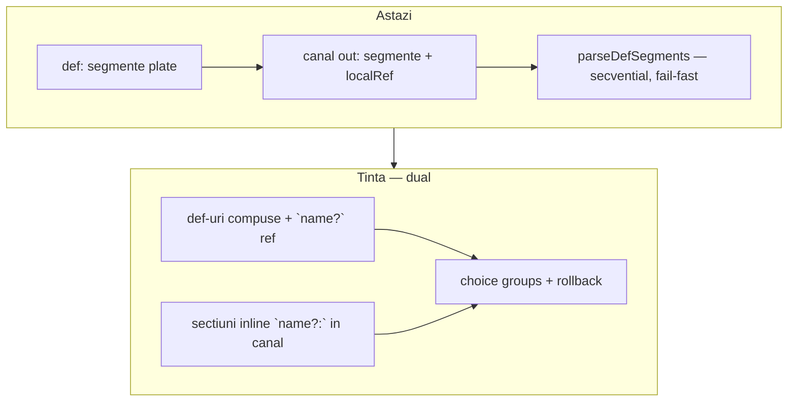
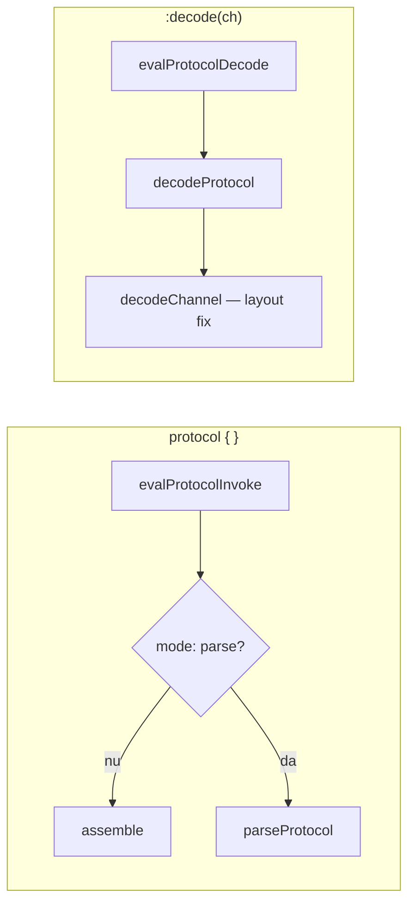
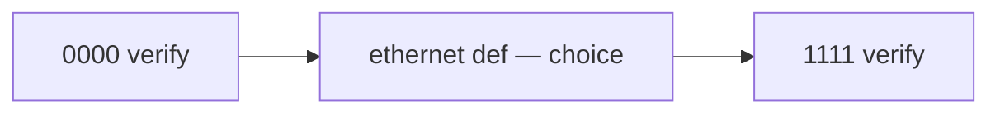

# Plan: Protocol Tentative Sections (`?`)

## Status implementare (2026-07-12)

| Fază | Status | Teste |
|------|--------|-------|
| **Faza 1** — tentative `?`, choice, mandatory/tentativ | ✅ | 2147–2151 |
| **Faza 2** — nesting, `rest -Nb`, LUT amânat | ✅ | 2152–2153 |
| **Faza 3** — `parseView: tree` | ✅ | 2154–2155 |
| **Faza 4** — documentație | ✅ | 2156 |
| **Faza 4+** — `parseTag`, schema union, `rest -footer` | ⏳ amânat | — |

**Suite:** 1734/1734 teste trec (`node node/_run_test_suite_node.js`).

### Notă: `rest -footer` — amânat

**Decizie:** sugar-ul `rest -footer` (suffix-ul `1111` din `out:` devine referință; motorul calculează lățimea automat) **nu a fost implementat** în Faza 2.

**Ce folosim acum:** `rest -4b` explicit — utilizatorul sincronizează manual `N` cu footer-ul (`1111` → `4b`).

**Viitor:** `rest -footer` poate fi adăugat ca îmbunătățire ergonomică (Faza 4+), fără a schimba semantica `rest -Nb`.

---

## Context — ce există azi

Motorul protocol este **complet implementat** în [`v0_3_2/core/protocol-assembler.js`](v0_3_2/core/protocol-assembler.js):

- **Assemble** (default): parametri → biți pe canale (`tx:`, `mosi:`, `out:`)
- **Parse** (`mode: parse`): `ParseStream` + `parseSegment()` — citire secvențială, literale = verificare, `sym 8b` = câmp extras
- **`def`**: segmente reutilizabile (`localRef`)
- Extensii v2: `length`, `lengthOf`, `withLength`, `expand`, `collapse`, `checksum`

Sketch-ul din [`.cursor/my_ideas/protocol tentative sections`](.cursor/my_ideas/protocol tentative sections) este **doar design** — zero cod, zero teste, zero mențiuni în [`protocol.md`](v0_3_2/doc/protocol.md).



---

## Model actual — cum funcționează `def` și canalele

Un protocol are structura **fixă, plată**:

```logts
inline [protocol] .pkt:
  mode: parse          # atribute (înainte de def/canale)

  def payload:         # bloc reutilizabil — listă plată de segmente
    length(data) 8b
    data 8b

  out:                 # canal output — tot listă plată
    payload            # localRef → expandează def inline
    checksum(crc16, data)
  :
```

**Reguli din cod** ([`parseProtocolBody`](v0_3_2/core/protocol-assembler.js)):

| Regulă | Efect |
|--------|-------|
| `def` înainte de canale | `seenChannel` blochează `def` noi după primul canal |
| Corp `def` = linii segment | nu există „sub-secțiuni” în interior |
| Referință `foo` (cuvânt singur) | `{ kind: 'localRef', name: 'foo' }` — **obligatoriu**, expandare inline |
| `parseDefSegments` | parcurge segmentele **secvențial**; orice eșec = throw global |
| Canale | doar la nivel top; fiecare canal = listă de segmente |

**Ce NU face modelul actual:**
- nu are nesting structural (doar compoziție prin `localRef`)
- nu are choice / backtracking
- `def` nu produce output singur — doar când e referit din canal
- `lengthOf(payload)` funcționează; `lengthOf` pe ceva tentative nu există

---

## Direcție — două forme complementare

### Forma A — inline în canal/def (cazuri simple, fără `def` wrapper)

Direct în corpul unui canal sau `def`, cu header `?:` și segmente dedesubt — ca în sketch-ul original:

```logts
inline [protocol] .l3dispatch:
  mode: parse
  out:
    ipv4?:
      0100
      src 32b
      dst 32b
    ipv6?:
      0110
      src 128b
      dst 128b
    unknown:          # secțiune inline obligatorie (fallback)
      rest ~
  :
```

### Forma B — compoziție prin `def` + `name?` (cazuri complexe / reutilizare)

```logts
def ipv4:
  0100
  src 32b
  dst 32b

def ethernet:
  vlan?
  ipv4?
  arp?

out:
  dst 48b
  ethernet
```

### Când folosești ce

| Situație | Recomandare |
|----------|-------------|
| Dispatch simplu, ramuri folosite o singură dată | **Forma A** — `ipv4?:` direct în `out:` |
| Logică reutilizată, nesting adânc, mai multe protocoale | **Forma B** — `def` + `name?` |
| Mix | `def vlan` + inline `ipv4?:` în același corp — permis |

### Sintaxă — disambiguare

| Formă | Semnificație |
|-------|--------------|
| `foo` | `localRef` obligatoriu la `def foo` |
| `foo?` | referință tentativă la `def foo` (o singură linie, fără `:`) |
| `foo?:` | secțiune inline tentativă — liniile următoare până la următorul sibling `bar?:` / `bar:` |
| `foo:` | secțiune inline obligatorie — același mecanism, fără rollback la eșec |

**Reguli:**
- `foo?` și `foo?:` sunt distincte — `:` marchează bloc inline vs referință
- `def foo:` la declarare rămâne **fără `?`**
- secțiunile inline (`name:` / `name?:`) sunt permise în **corpul canalului** și în **corpul oricărui `def`** (parse mode)
- la nivel protocol top, `tx:` / `out:` rămân canale output (ca azi) — nu se confundă cu inline `header:` din interior

---

## Direcție revizuită — nesting prin `def` + `name?` (cazuri complexe)

```logts
inline [protocol] .ethParse:
  mode: parse

  def qinq:
    outerTag 16b
    innerTag 16b

  def vlan:
    qinq?           # tentative localRef — încearcă qinq, rollback dacă eșuează
    tag 16b         # VLAN simplu dacă qinq nu match-uiește

  def ipv4:
    ver 4b
    src 32b
    dst 32b

  def arp:
    ...

  def ethernet:
    vlan?           # strat opțional
    ipv4?
    arp?

  out:
    dst 48b
    src 48b
    ethertype 16b
    ethernet        # localRef obligatoriu — conține tot choice-ul L2/L3
  :
```

**De ce ambele forme:**
- **Forma A** = ergonomie pentru sketch-ul original și protocoale mici
- **Forma B** = reutilizare, nesting (`vlan?` → `qinq?`), aliniere cu schema composition
- același runtime (`parseSegmentList` + choice groups) deservește ambele

---

## Ce propune sketch-ul (rezumat)

| Element | Semnificație |
|---------|--------------|
| `section:` | obligatoriu — eșec = protocol eșuează |
| `section?:` | tentativ — eșec = restore poziție stream, încearcă următorul sibling |
| `def name?:` | același comportament pentru definiții locale |
| Nesting | fiecare `?` are propriul checkpoint; rollback local |
| Determinism | primul sibling tentativ care reușește este „committed”; nu se revine la alternative anterioare |

**Cazuri de utilizare:** dispatch IPv4/IPv6/ARP, extensii opționale, layout-uri alternative, decodare instrucțiuni.

Filosofie: **choice declarativ** fără `if`/`switch`/`case` — aliniat cu stilul LogTScript.

---

## Analiză critică — lacune în sketch și recomandări

### 1. Imbricare — `def` compuse + secțiuni inline în canal/def

**Decizie:** două mecanisme complementare (vezi § Direcție — două forme).

| Sketch original | Implementare |
|-----------------|--------------|
| `ipv4?:` cu body în canal | **Forma A** — inlineSection tentativ |
| `ethernet:` cu `vlan?:` nested | **Forma B** sau inline nested în `def ethernet` |
| `def` reutilizabil | **Forma B** — `def ipv4:` + `ipv4?` |

Parserul corpului canalului/`def` devine listă de **items** (nu doar segmente plate):
- segment obișnuit
- `tentativeLocalRef` / `localRef`
- `inlineSection { name, tentative, segments[] }` — poate conține la rândul său items nested

---

### 2. Rollback doar pe stream — insuficient (recomandare de extindere)

Sketch: *„Only the stream position is restored.”*

**Problemă:** în parse mode, `parseField` scrie în `ParseFields` (`fields.set(sym, val)`). O încercare tentativă care citește 3 câmpuri apoi eșuează la literalul 4 lăsă **câmpuri fantomă** pentru secțiunea obligatorie următoare.

**Recomandare:** la fiecare checkpoint, salvează/restaurează **ambele**:
- `ParseStream.pos`
- snapshot `ParseFields` (și eventual `cache` pentru `expand`/`collapse` dacă devine relevant)

`ParseStream` are deja `fork()` pentru sub-regiuni; adăugăm `save()` / `restore(pos)` pentru checkpoint-uri ușoare.

---

### 3. Restricție parse-only + politică invocare (decizie)

`?` nu are semantică clară în **assemble** (nu „emiți opțional” — alt mecanism).

**Decizie:**
- `?` permis doar când `mode: parse`
- în `mode: assemble` → eroare la `parseProtocolBody`: `tentative sections require mode: parse`
- `:decode()` rămâne neschimbat ca mecanism — dar **nu se aplică** protocoalelor cu tentative (vezi § Comportament la invocare)

---

## Comportament la invocare: `protocol { }` vs `protocol:decode`

### Context — trei mecanisme existente azi

| Mecanism | Sintaxă | Direcție | Motor |
|----------|---------|----------|-------|
| **assemble** (default) | `.uart8n1 { data = ^41 }` | parametri invoke → biți pe canale | `generateProtocol` → eval segmente |
| **mode: parse** | `.parseHdr { data = packet }` | bitstring invoke → câmpuri extrase | `generateProtocol` → `parseProtocol` |
| **:decode** | `.uart8n1:decode(tx)` | biți canal (de la encode) → parametri concatenați | `decodeProtocol` → `decodeChannel` |

Important: **invocarea directă `{ }` și `:decode()` sunt căi diferite** — nu e același cod. `generateProtocol` verifică `mode: parse` și delegă la `parseProtocol`; `:decode` ignoră `mode` și folosește mereu `decodeChannel` (doar segmente simple: literal, param, reverse, parity, clock, repeat).



### Tentative sections → doar invocare directă cu `mode: parse`

**Calea corectă** pentru protocoale cu `?`:

```logts
inline [protocol] .l3dispatch:
  mode: parse
  out:
    ipv4?:
      0100
      src 32b
    ipv6?:
      0110
      src 128b
    unknown:
      rest ~
  :

32wire extracted = .l3dispatch { data = packet }
```

**Comportament:**
1. `evalProtocolInvoke` primește `data` / `stream` = packetul întreg
2. `generateProtocol` → `parseProtocol` → `parseItemList` cu choice groups
3. tentative eșuate → rollback stream + fields; nu raportează eroare
4. ramura committed → câmpurile ei intră în output
5. **output wire** = `blob` concatenați din câmpurile parse-ate (ca parse mode azi) — doar din ramura care a reușit

Câmpurile din ramuri tentative eșuate **nu** apar în `blob` (rollback pe `ParseFields`).

### `:decode()` — NU suportat pentru protocoale cu tentative

**Decizie fermă:** protocoalele care conțin `?` (tentativeLocalRef, inlineSection tentative) **nu pot** fi folosite cu `:decode()`.

| Motiv | Explicație |
|-------|------------|
| Layout fix | `:decode` presupune structură deterministă de la **encode** assemble — știi exact ordinea și lățimile |
| Tentative = dispatch | `?` există pentru formate variabile pe wire — e problema `mode: parse`, nu a decode |
| Politică existentă | `:decode` nu suportă deja `def`, `expand`, `withLength` — tentative e același nivel de complexitate |
| Fără encode | protocoale cu `?` sunt parse-only — nu există encoder simetric de inversat |

**Eroare la runtime** (sau la declarare dacă setăm flag `hasTentative`):

```text
Protocol decode does not support tentative sections — use { data = ... } on a mode: parse protocol
```

**Ce se întâmplă azi** dacă apelezi `:decode` pe un protocol `mode: parse` fără tentative: deja eșuează (`decodeChannel` nu suportă `parseField`). Tentative ar adăuga doar confuzie — documentăm explicit separarea.

### Pattern recomandat: encoder + decoder

Aliniat cu politica Huffman / protocol extensions:

```logts
// TX — assemble, layout fix, fără ?
inline [protocol] .ethTx:
  out:
    dst 48b
    src 48b
    payload 8b
  :

// RX — parse, cu dispatch tentative
inline [protocol] .ethRx:
  mode: parse
  out:
    dst 48b
    src 48b
    ipv4?:
      ...
    arp?:
      ...
  :

// encode
Nwire frame = .ethTx { dst = ..., src = ..., payload = ... }

// decode/dispatch — NU :decode, ci invoke direct
Mwire l3 = .ethRx { data = capturedFrame }
```

| Operație | Protocol | Mecanism |
|----------|----------|----------|
| Construiește frame | `.ethTx` (assemble) | `{ dst = ..., ... }` |
| Extrage parametri din frame fix | `.ethTx` | opțional `:decode(frame)` dacă layout simplu |
| Dispatch variabil pe wire | `.ethRx` (parse + `?`) | `{ data = capturedFrame }` |
| `:decode` pe `.ethRx` | — | **interzis** |

### Un singur protocol cu tentative?

Da — pentru **parse/dispatch pur** (nu ai nevoie de encoder în același inline):

```logts
32wire result = .l3dispatch { data = packet }
```

Nu există `:decode` echivalent — și nu e nevoie; invocarea directă **este** decode-ul.

### Output și câmpuri individuale

Limitare **existentă** parse mode (nu introdusă de tentative): `evalProtocolInvoke` expune `blob` concatenați, nu câmpuri numite în script. Tentative nu schimbă asta — doar ce intră în `blob` depinde de ramura committed.

Multi-wire assignment pe output funcționează dacă lățimile sunt determinabile (static sau dinamic).

### Tabel feature matrix extins (cu tentative)

| Construct | `mode: assemble` + `{ }` | `mode: parse` + `{ data }` | `:decode(ch)` |
|-----------|--------------------------|----------------------------|---------------|
| segmente simple | emit | verify + read | extract |
| `def` / localRef | compose | parse | ✗ |
| tentative `?` | ✗ eroare declarare | **choice + rollback** | ✗ eroare explicită |
| inline `ipv4?:` | ✗ eroare declarare | **choice + rollback** | ✗ eroare explicită |

---

### 4. Comportament când toate alternativele tentative eșuează

Sketch-ul arată pattern-ul corect cu fallback obligatoriu:

```logts
ipv4?: ...
ipv6?: ...
unknown: ...    // mandatory catch-all
```

**Recomandare:** dacă un grup consecutiv de siblings `?` eșuează pe rând și urmează o secțiune obligatorie, parsing continuă normal. Dacă **nu** există fallback și toate tentativele eșuează → eroare:

```text
parse: no matching alternative in section 'ethernet' (tried: vlan, ipv4, arp)
```

Mesajul listează alternativele încercate — util la debug.

---

### 5. Ce înseamnă „succes” pentru o secțiune tentativă

**Recomandare:** o secțiune reușește dacă **toate** segmentele/secțiunile copil sunt parse-ate fără excepție. Nu există „match parțial”.

Excepții care declanșează rollback (nu eroare globală):
- literal mismatch
- `parse: need N bits but only M remain`
- `validateChecksum` eșuat
- `withLength` sub-stream neconsumat
- orice `throw` din `parseSegment`

---

### 6. Semantica `def name?:` la declarare — nu e necesară

**Decizie:** tentativitatea se marchează la **use-site** (`vlan?`), nu la declarare (`def vlan:`).

| Formă | Verdict |
|-------|---------|
| `def ipv4:` + `ipv4?` în părinte | **preferat** — un singur loc pentru `?` |
**Decizie:** `def ipv4?:` la declarare — **respins**. Doar `def ipv4:` + `ipv4?` la use-site. Eroare la declarare dacă apare `?` pe `def`.

Sketch-ul original permitea `def ipv4?:` — **nu** acceptăm ca alias.

---

### 7. Interacțiune cu `withLength` / nesting existent

`withLength(stream, 16b, entry)` folosește deja `fork(len)` — sub-stream izolat.

**Recomandare:** tentative sections operează pe **cursorul curent** (principal sau sub-stream activ). Rollback-ul unui `extension?` din sketch **nu** afectează checkpoint-ul `packet?` — exact cum descrie sketch-ul. Implementare: checkpoint stack per apel recursiv `parseSection()`.

---

### 8. Grupuri de choice — care siblings formează o alternativă

**Recomandare:** choice-ul e **local la lista de copii** a unei secțiuni. Secvența:

```logts
header:        // mandatory
ipv4?:         // choice group start
ipv6?:         // same group
arp?:          // same group
crc:           // mandatory — rulează după ce unul din grup reușește SAU toate eșuează
```

Algoritm pentru copii `[c1, c2, c3, c4]`:
1. Parse `header` (mandatory)
2. Pentru grupul `[ipv4?, ipv6?, arp?]`: încearcă în ordine; la primul succes → **break** din grup
3. Dacă niciunul nu reușește → continuă (nu eșua încă) — `crc` poate salva
4. Parse `crc` (mandatory)

**Important:** după un succes în grup, **nu** se încearcă celelalte alternative — committed choice (ca PEG `/`, fără backtracking după commit).

---

### 10. Prefix / body tentative / suffix (încadrare)

Exemplu utilizator:

```logts
def ethernet:
  vlan?
  ipv4?
  arp?

out:
  0000          # prefix obligatoriu
  ethernet      # body cu choice
  1111          # suffix obligatoriu (footer)
```

**Nu e nevoie de `ends:` separat** — suffix-ul e secvență obligatorie **după** `ethernet` în același corp `out:` (sau secțiune inline `footer:` / `ends:` cu `1111` dedesubt — echivalent).

**Comportament (secvențial):**



1. verifică `0000`
2. parsează `ethernet` (**obligatoriu** — fără `?` la use-site) — cel puțin o ramură tentative din def trebuie să reușească
3. cursorul continuă la `1111`
4. verifică `1111` — eșec aici = eroare globală

**`?` la use-site** controlează dacă secțiunea e obligatorie — **fără** atribut separat `requireChoice`.

| La use-site | Toate ramurile tentative eșuează |
|-------------|----------------------------------|
| `ethernet` (fără `?`) | **EROARE** — secțiune obligatorie, niciun match |
| `ethernet?` | **OK** — 0 biți consumați, continuă la următorul segment (ex. footer `1111`) |
| `ipv4:` inline obligatoriu | **EROARE** dacă body-ul nu match-uiește |
| `ipv4?:` inline tentativ | 0 biți dacă nu match-uiește |

#### Toate tentativele din `ethernet` eșuează — depinde de `?` la invocare

```logts
def ethernet:
  vlan?
  ipv4?
  arp?
```

**Invocare obligatorie** (`ethernet` fără `?`):

```logts
out:
  0000
  ethernet      # obligatoriu
  1111
```

| Wire după `0000` | Rezultat |
|------------------|----------|
| `1111` imediat | **EROARE** — ethernet obligatoriu, niciun match în vlan/ipv4/arp |
| payload valid + `1111` | **OK** — ramura match-uiește, apoi footer |

**Invocare tentativă** (`ethernet?`):

```logts
out:
  0000
  ethernet?     # opțional
  1111
```

| Wire după `0000` | Rezultat |
|------------------|----------|
| `1111` imediat | **OK** — ethernet consumă 0 biți, apoi `1111` |
| biți care nu permit `1111` | **Eroare** la suffix `1111` |

**Decizie:** obligatoriu vs opțional = **`?` la use-site** (`name` vs `name?`, `name:` vs `name?:`). **Nu** introducem `requireChoice`.

#### `unknown: rest ~` în `ethernet` + footer `1111` — **CONFLICT**

```logts
def ethernet:
  vlan?
  ipv4?
  arp?
  unknown:
    rest ~
out:
  0000
  ethernet
  1111
```

`rest ~` consumă **tot** până la EOF — inclusiv `1111`. Footer-ul nu mai poate fi verificat.

**Regulă:** `rest ~` = consumă până la **EOF** — doar ca ultim segment al întregului protocol.

#### `rest -Nb` — rest cu rezervă pentru footer

Pentru body variabil **înainte** de un suffix fix (`1111` = 4b), `~` nu e potrivit. Simbol nou:

| Sintaxă | Semnificație |
|---------|--------------|
| `rest ~` | toți biții rămași până la EOF |
| **`rest -Nb`** | consumă tot **minus ultimii N** biți (`remaining − N`); lasă N biți pentru părinte/footer |

`rest -4b` = „ia tot până la −4 biți” — exact comportamentul vizual.

```logts
def ethernet:
  vlan?
  ipv4?
  arp?
  unknown?:
    rest -4b        # lasă 4 biți pentru footer-ul 1111 din out:

out:
  0000
  ethernet
  1111
```

**Exemple** (prefix `0000` deja consumat, ethernet rulează pe tail):

| Wire complet | După `0000` | `rest -4` consumă | Footer `1111` |
|--------------|-------------|-----------------|---------------|
| `00001111` | `1111` (4b) | 0 biți | OK |
| `000001111` | `01111` (5b) | `0` (1b) | OK |
| `000011111` | `111111` (6b) | `11` (2b) | OK |
| `0000` + mult + `1111` | payload + `1111` | toți payload | OK |

**Eșec:** `remaining < N` → eroare (`rest -4: need 4 bits reserved for footer but only M remain`).

**Tentativă:** `unknown?:` cu `rest -4b` — dacă vlan/ipv4/arp eșuează, unknown consumă payload variabil; dacă nu pot lăsa 4 biți, rollback (sau eșec secțiune).

**Coupling footer width:** `4` trebuie să coincidă cu `1111`.

| Sintaxă | Status |
|---------|--------|
| **`rest -4b`** | ✅ implementat Faza 2 |
| **`rest -footer`** | ⏳ **amânat** — suffix `1111` din `out:` ca referință automată; până atunci `rest -4b` explicit |

#### Alternative evaluate

| Sintaxă | Pro | Contra |
|---------|-----|--------|
| **`rest -Nb`** | intuitiv („tot minus N”), footer fix | N trebuie sincron cu suffix |
| `rest until 1111` | delimiter vizual | ambiguu dacă `1111` apare în payload |
| `framed:` la nivel `out:` | encapsulare prefix/body/suffix | sintaxă nouă mai mare |

**Decizie:** introducem **`rest -Nb`** în Faza 2, alături de tentative. `~` rămâne doar EOF.

#### Câmpuri zero biți (`rest -4` consumă 0, `unknown` gol)

Caz: `00001111` → `rest -4b` consumă **0 biți** — secțiunea `unknown` match-uiește fără payload.

| Strat | 0 biți | Comportament |
|-------|--------|--------------|
| **show** (`parseView: tree`) | da | afișează ramura: `unknown = empty (0bit)` — vizibil în tree |
| **`parsed:unknown`** | **nu** | eroare: `parseView: field 'unknown' has no bits` — nu e accesibil ca slice |
| **`parsed:unknown:sub`** | nu | idem — părinte fără biți |
| **Semantic Schemas** (`<schema>:`) | nu azi | `width < 1` → eroare (neschimbat) |

**Regulă:** în ParseView, nodurile **secțiune** cu `width === 0` sunt **doar pentru afișare** (știi ce ramură a mers). Accesul `wire:path` funcționează **doar** pentru noduri cu `width > 0` (câmpuri cu biți reali).

```text
show(parsed):
  magic   = 0000
  unknown = empty (0bit)     ← vizibil

parsed:unknown               ← EROARE (0 biți, nu există ca field)
4wire payload = parsed:unknown:data   ← EROARE
```

Când `rest -4b` consumă **> 0** biți, `parsed:unknown` devine valid (slice pe payload).

**Implementare:** `resolveParseViewPath()` returnează eroare dacă `node.width === 0`; `formatParseViewShow()` afișează `empty (0bit)` pentru astfel de noduri.

#### Fallback `unknown` gol (payload zero biți)

Pentru `0000` + `1111` (nimic între ele):

```logts
def ethernet:
  vlan?
  ipv4?
  arp?
  unknown:          # secțiune obligatorie, 0 segmente = match cu 0 biți
```

| Wire | Rezultat |
|------|----------|
| `00001111` | **OK** — vlan/ipv4/arp eșuează, `unknown` match 0 biți, `1111` OK |
| `000001111` | **Eroare** la `1111` — bitul `0` din mijloc |

**Nu** folosi `rest ~` pentru „acceptă gol” când urmează footer — folosește secțiune `unknown:` **fără segmente** (zero-width match).

#### `0000 0 1111` cu `unknown` gol

- după `0000`, ethernet: tentative eșuează, `unknown` consumă 0 biți
- următorul segment așteaptă `1111`, dar pe wire urmează `0` → **eroare** la footer (corect)

Pentru a accepta un bit opțional între body și footer, trebuie modelat explicit (ex. câmp `pad 1b` sau ramură tentativă) — nu `rest ~`.

---

### 9. Legătura cu Semantic Schemas

Sketch-ul din [`.cursor/my_ideas/schema composition_`](.cursor/my_ideas/schema composition_) descrie compoziție **compile-time** (merge `<schema>`, nested `field:<schema>`).

| Mecanism | Când | Rol |
|----------|------|-----|
| Schema composition | compile-time | layout câmpuri, offsets, acces `instr:flags:carry` |
| Tentative sections | runtime parse | dispatch pe wire |

**Recomandare:** menționăm complementaritatea în docs, dar **fără integrare automată** în v1 — schemas nu influențează parserul protocol.

---

## Arhitectură propusă (dual: inline + def ref)

### AST — item types în corp canal/def

```javascript
// segment existent (literal, parseField, ...)
{ kind: 'segment', seg: { ... } }

// referință def (existent + nou)
{ kind: 'localRef', name: 'payload' }
{ kind: 'tentativeLocalRef', name: 'ipv4' }

// secțiune inline (nou) — în canal sau def body
{
  kind: 'inlineSection',
  name: 'ipv4',
  tentative: true,   // false pentru `unknown:`
  items: [ ... ]     // segmente + inlineSection nested recursiv
}
```

Canalul și `def`-ul stochează `items[]` în loc de `segments[]` plat (sau `segments` devine alias pentru compatibilitate internă).

### Parser — două niveluri

**1. `parseProtocolBody`** (canale top-level — neschimbat structural):
- `out:` = canal output
- regex canal: `^(\w+)\s*:\s*$` (ca azi)

**2. `parseBodyItems(lines)`** (nou — pentru corp canal și corp `def`):
- `^(\w+)\?\s*:\s*$` → începe `inlineSection` tentativ; colectează linii până la sibling header
- `^(\w+)\s*:\s*$` → `inlineSection` obligatoriu (doar în parse mode cu tentative activ)
- `^(\w+)\?$` → `tentativeLocalRef`
- `^(\w+)$` (def cunoscut) → `localRef`
- altfel → `parseSegmentLine` ca azi

Nesting: `inlineSection.items` se parsează recursiv cu același `parseBodyItems`.

### Runtime — `parseItemList(items, stream, fields, ...)`

Înlocuiește bucla plată din `parseDefSegments` / `parseProtocol`:

```javascript
function tryParseLocalRef(defName, stream, fields, ...) {
  const pos = stream.save();
  const snap = fields.snapshot();
  try {
    parseDefSegments(defName, stream, fields, ...);
    return true;
  } catch (e) {
    stream.restore(pos);
    fields.restore(snap);
    return false;
  }
}

// choice group = items consecutive cu tentative:true
//   (tentativeLocalRef SAU inlineSection tentative)
// la primul succes → committed choice, break
// inlineSection obligatoriu → parse fără rollback
```

Recursivitate: `inlineSection` → `parseItemList(items)`; `tentativeLocalRef` → `tryParseLocalRef(defName)`; nesting `vlan?:` în `def ethernet` funcționează în ambele forme.

### Assemble / doc / infer width

- **Assemble:** respinge `?` la declarare
- **`inferProtocolWidth`:** protocoale cu `?` → `dynamic` (nu se poate suma static)
- **`formatProtocolInstanceDoc`:** afișează `ipv4?` în listing
- **Backward compat:** protocoale existente = secțiuni cu `tentative: false`, copii = segmente — zero schimbare comportamentală

---

## Faze de implementare

### Faza 1 — Fundație: ambele forme + choice groups ✅

- `ParseStream.save/restore`, `ParseFields.snapshot/restore`
- `parseBodyItems()` — inline `name?:` / `name:` + `name?` ref
- `parseItemList()` cu choice groups
- **`interpreter.js`:** guard `:decode()` — `hasTentativeSections(inst)` → eroare clară în `evalProtocolDecode`
- Teste:
  - **Forma A:** `out: ipv4?: ... ipv6?: ... unknown: rest ~`
  - **Forma B:** `def ipv4` + `out: ipv4? ipv6? unknown`
  - **`ethernet` obligatoriu** + all-fail → eroare; **`ethernet?`** + all-fail → 0 biți + footer OK
  - rollback câmpuri, committed choice

### Faza 2 — Compoziție imbricată + `rest -Nb` ✅

- Exemplul utilizatorului: `def vlan` / `def ethernet` / `def qinq`
- **`rest -4b`** explicit — implementat
- **`rest -footer`** — **nu implementat** (amânat; vezi secțiunea „Notă: `rest -footer`” de mai sus)
- LUT commit amânat (`pendingLutEntries` + flush înainte de `collapse`)
- Teste: **2152–2153**

### Faza 3 — `parseView: tree` (opțional) ✅

- Atribut **`parseView: tree`** (sau `true`) — doar cu `mode: parse`
- **Fără atribut:** comportament actual (blob plat) — **neschimbat**
- `parseViewId` pe wire, registry `parseViews` în interpreter
- `show(parsed)` → tree cu nume ramură; **fără literale** de verificare în tree
- `parsed:typeA:dataA` — field access când `parseView: tree` activ

### Faza 4 — Documentație ✅

- Secțiune nouă în [`protocol.md`](v0_3_2/doc/protocol.md): sintaxă, semantica mandatory/tentative, exemple runnable `logts-play`
- `doc(inline.protocol)` template actualizat
- Tabel feature matrix: `tentative section (?)` — doar `mode: parse`
- Erori noi documentate

### Faza 4+ — Metadata ramură (amânat)

- `parseTag`, schema union, inferență avansată „care ramură” — **nu** în Faza 1–3

---

## Exemple țintă pentru teste/docs

**Dispatch L3 (Faza 1) — Forma A, inline în canal:**

```logts
inline [protocol] .l3inline:
  mode: parse
  out:
    ipv4?:
      0100
      src 32b
      dst 32b
    ipv6?:
      0110
      src 128b
      dst 128b
    unknown:
      rest ~
  :
```

**Dispatch L3 (Faza 1) — Forma B, prin def-uri:**

```logts
inline [protocol] .l3dispatch:
  mode: parse
  def ipv4:
    0100
    src 32b
    dst 32b
  def ipv6:
    0110
    src 128b
    dst 128b
  def unknown:
    rest ~
  out:
    ipv4?
    ipv6?
    unknown
  :
```

**Ethernet imbricat (Faza 2) — propunerea utilizatorului:**

```logts
inline [protocol] .ethParse:
  mode: parse
  def qinq:
    outerTag 16b
    innerTag 16b
  def vlan:
    qinq?
    tag 16b
  def ipv4:
    ver 4b
    src 32b
    dst 32b
  def arp:
    ...
  def ethernet:
    vlan?
    ipv4?
    arp?
  out:
    dst 48b
    src 48b
    ethertype 16b
    ethernet
  :
```

---

## Riscuri și mitigări

| Risc | Mitigare |
|------|----------|
| Complexitate parser structural | Evitat — extindem `localRef`, nu arbore de secțiuni |
| Performanță (re-parse la fiecare tentativă) | Acceptabil pentru simulare; protocoalele sunt mici |
| Confuzie `foo?` vs `foo?:` | Tabel sintaxă în docs; eroare clară dacă `foo?` nu e def cunoscut |
| Confuzie inline `header:` vs canal top `out:` | Inline doar în corp canal/def; top-level `out:` rămâne canal wire |
| Complexitate parser corp | `parseBodyItems` unificat pentru canal + def — o singură implementare |
| Interacțiune `codebookLoad` + tentative | **Commit LUT amânat** — buffer în parse, flush doar la succes total; fără rollback LUT |

---

## Discriminare ramură la output (choice → ce returnează wire-ul)

### Ce intră în `blob` azi (`parseResult: all`)

| Segment | În output wire? |
|---------|-----------------|
| `magic 3b` (parseField) | **da** — 3 biți |
| `00000001` (literal) | **nu** — doar verificare |
| `kind 8b` (parseField) | **da** — 8 biți |
| `dataA 32b` (parseField) | **da** — 32 biți |
| `validateChecksum` | **nu** |

### Exemplu utilizator — două variante

**Varianta greșită pentru dispatch** (`kind 8b` fără literal):

```logts
typeA?:
  kind 8b      # citește ORICE 8 biți — typeA reușește mereu primul!
  dataA 32b
```

**Varianta corectă pentru dispatch:**

```logts
typeA?:
  00000001     # literal — eșec → rollback, încearcă typeB
  dataA 32b
typeB?:
  00000010
  dataB 64b
```

| Input | Output wire (`all`) | Lățime |
|-------|---------------------|--------|
| `111` + typeA payload | `111` + `dataA` (32b) | **35** |
| `111` + typeB payload | `111` + `dataB` (64b) | **67** |

**Nu** returnează `111 00000001` dacă `00000001` e **literal** — discriminatorul nu e în blob.  
**Da** returnează `111 00000001 ...` dacă `kind 8b` e **parseField** — dar atunci dispatch-ul tentative e broken (typeA absorbă tot).

### Problema: nu știi explicit „typeA” vs „typeB”

Cu designul actual:
- inferi din **lățimea wire-ului** (35 vs 67) sau
- pui discriminator ca **parseField** în fiecare ramură (dar dispatch trebuie făcut cu **literale** la începutul ramurii, apoi câmpuri)

**Nu există round-trip** — decode validează + extrage; nu reconstruiește automat pachetul identic.

### Opțiuni (v1 → v2)

| Opțiune | Descriere | Verdict |
|---------|-----------|---------|
| **A. Pattern v1 (fără motor nou)** | Literale pentru match; payload ca parseField; inferență din lățime sau citire manuală slice | **Faza 1** — documentat în protocol.md |
| **B. `parseTag: branchName`** | Atribut protocol; tag fix pe ramură | **Faza 4+** — amânat |
| **C. Al doilea canal output** | `out:` + `tag:` canal mic cu ID ramură | posibil dar awkward pentru parse |
| **D. Schema union generată** | `<packetUnion>` cu variante — necesită extensie schemas (tagged union) | **v2+** — complementar cu schema composition |
| **E. `_matched` în `fields`** | expunere în script (nu doar blob) | necesită API nou pe invoke — **v2** |

### Schema semantică — ce merge acum

Schemas cer **lățime fixă** pe wire (`43wire<typeA>` ≠ `75wire<typeB>`). Un singur `Nwire<union>` nu acoperă ramuri cu lățimi diferite.

**Pattern v1 recomandat:**

```logts
<typeAPayload>:
  dataA:32
:

<typeBPayload>:
  dataB:64
:

# după parse — știi ramura din lățime sau ai citit discriminator separat
35wire raw = .myProtocolPackageDecode { data = packet }
show(raw)<typeAPayload>    # dacă 35b
# sau
67wire raw = .myProtocolPackageDecode { data = packet }
show(raw)<typeBPayload>    # dacă 67b
```

**Viitor (schema union):** sketch în [schema composition](.cursor/my_ideas/schema composition_) — `variant:<typeA>|<typeB>` cu tag — **nu în Faza 1 tentative**.

### Decizie Faza 1–3

- **Faza 1:** output blob plat; inferență ramură din lățime/câmpuri (documentat)
- **Faza 3:** `parseView: tree` opțional — show tree + field access; fără atribut = neschimbat
- **Faza 4+:** `parseTag`, schema union — amânat

---

## `parseView` — afișare structurată (fost „withSchema”)

### Denumire atribut — de ce NU `withSchema`

| Problemă | Explicație |
|----------|------------|
| Confuzie cu Semantic Schemas | `<opcode>:`, `16wire<opcode>` — alt feature, compile-time |
| „Schema” implică definiție utilizator | aici e **vedere runtime** generată automat |
| `with*` neobișnuit în protocol | atributele existente sunt `mode:`, `parseResult:`, `codebookLoad:` |

**Recomandare: `parseView: tree`** (sau boolean `parseView: true` ca prescurtare).

Alternative evaluate:

| Nume | Pro | Contra |
|------|-----|--------|
| **`parseView: tree`** | clar, paralel cu ParseView intern; nu collide cu schemas | — |
| `parseResult: view` | extinde familia `parseResult` (`all`, `collapseOnly`) | `parseResult` controlează și blob-ul — amestec roluri |
| `structured: true` | scurt | prea generic |
| `withSchema` | — | confuzie majoră cu `<schema>` |
| `fieldTree` | descriptiv | nu sugerează legătura cu show/debug |

**Intern:** `parseViewId` pe wire (analog `asmModuleId`), registry `parseViews` în interpreter.

### Sintaxă propusă

```logts
inline [protocol] .myTest2:
  mode: parse
  parseView: tree
  out:
    magic 3b
    typeA?:
      11
      01
      dataA 2b
    unknown:
      rest ~
  :
```

### Intenție

```logts
inline [protocol] .myTest2:
  mode: parse
  parseView: tree
  out:
    magic 3b
    typeA?:
      11
      01
      dataA 2b
    typeB?:
      10
      10
      dataB 2b
    unknown:
      rest ~
  :

9wire raw = 101110001
9wire parsed = .myTest2 { data = raw }
show(parsed)
```

**Afișare dorită** (tree, nu blob plat):

```text
(7wire<myTest2>) (ref: &1)
  magic  = 101
  typeA
       kind: 01      # literal verificat, opțional în tree
       dataA: 01
```

Pentru `1010000010` (typeA/typeB eșuează):

```text
(10wire<myTest2>) (ref: &1)
  magic   = 101
  unknown = 0000010
```

**`<gen>` / `<myTest2>`** = schemă **ephemerală** legată de valoare — **nu** definită de utilizator în `<schema>:` — analog **`asmModuleId`** (metadata pe wire, nu doar biți).

### Paralel cu ASM (precedent existent)

| ASM | Protocol `withSchema` |
|-----|----------------------|
| `8wire prg = .myisa { NOP }` | `9wire parsed = .myTest2 { data = raw }` |
| Wire poartă `asmModuleId` | Wire poartă `parseViewId` |
| `asmModules` Map în interpreter | `parseViews` Map în interpreter |
| `show(prg)` folosește metadata instrucțiuni | `show(parsed)` folosește tree câmpuri + ramură |
| Blob = biți program | Blob = biți câmpuri (sau același ca azi) |

### Model ParseView (runtime)

La parse cu `parseView: tree`, motorul construiește un **arbore** (nu schemă compile-time fixă):

```javascript
{
  protocolRef: '.myTest2',
  branch: 'typeA',           // secțiune committed; null dacă doar câmpuri plate
  fields: [
    { name: 'magic', bits: '101', width: 3 },
    { name: 'typeA', kind: 'section', branch: 'typeA', children: [
        { name: 'dataA', bits: '01', width: 2 }
    ]},
  ],
  blob: '10101',             // concatenație pentru wire (dacă păstrăm compat)
  totalWidth: 7
}
```

**Reguli afișare:**
- câmpuri obligatorii (`magic`) — la rădăcină
- secțiune tentative reușită — **numele ramurii** ca header (`typeA`, `unknown`)
- copii = parseField-uri din ramură; **literalele de verificare** (ex. `11`, `0100`) **nu** apar în ParseView tree — **decizie închisă**
- ramuri eșuate — **absente** din tree (rollback)

### Ce se poate / ce e greu

| Aspect | Fezabil? | Notă |
|--------|----------|------|
| `show()` tree cu nume ramură | **da** | ca ASM metadata |
| `<gen>` ephemeral per valoare | **da** | `parseViewId`, nu schema registry |
| Lățimi diferite per ramură | **da** | view are `totalWidth` propriu; wire width = dynamic |
| `parsed:typeA:dataA` field access | **da în v2** | extindere path ca `wire:field` din schemas |
| Schema union compile-time | separat | schema composition viitor |
| Round-trip | **nu** | validare + vizualizare, nu reconstrucție |

### Acces câmpuri: `parsed:typeA`, `parsed:typeA:dataA`

**Da — are sens.** Refolosește sintaxa existentă `wire:field:subfield` (ca `instr:flags:carry` la Semantic Schemas). Parserul deja construiește `schemaFieldPath: ['typeA', 'dataA']` via `_attachSchemaFieldPath` — **fără sintaxă nouă**.

```logts
9wire parsed = .myTest2 { data = raw }

parsed:magic           # 3b — câmp rădăcină
parsed:typeA           # secțiune committed — biți concatenați ai copiilor (fără literale verify)
parsed:typeA:dataA     # câmp frunză în ramură
4wire dataA = parsed:typeA:dataA
~wire branch = parsed:typeA   # dacă lățimea secțiunii variază între protocoale/ramuri
```

**Rezolvare runtime** (paralel `_resolveSchemaFieldAbsoluteRange`):

1. wire are `parseViewId` → lookup ParseView
2. path `['typeA', 'dataA']` → nod în arbore
3. returnează slice din blob-ul wire-ului (offseturi din ParseView)

**Erori (important):**

| Expresie | `unknown` 0 biți | `unknown` cu payload | Ramura `typeA` |
|----------|------------------|----------------------|----------------|
| `parsed:magic` | OK | OK | OK |
| `parsed:unknown` | **eroare** — `has no bits` | OK | **eroare** — not present |
| `parsed:typeA` | **eroare** — not present | **eroare** — not present | OK (dacă width > 0) |
| `parsed:typeA:dataA` | **eroare** | **eroare** | OK |

Mesaje:
- ramură absentă: `parseView: field 'typeA' is not present (matched branch: unknown)`
- ramură prezentă dar 0 biți: `parseView: field 'unknown' has no bits` — vizibil doar la **show** ca `empty (0bit)`

**Lățime la assignment:**

- `4wire x = parsed:typeA:dataA` — OK dacă `dataA` are lățime fixă (2b)
- `6wire typeA = parsed:typeA` — OK dacă secțiunea `typeA` are lățime fixă pe wire (sumă câmpuri, fără literale)
- ramuri cu lățimi diferite → `~wire` sau verificare runtime (ca protocoale dynamic)

**Prioritate rezolvare** pe wire (mutual exclusiv):

1. `parseViewId` → ParseView path
2. `schemaRef` → Semantic Schema path
3. altfel → `bitRange` / wire întreg

**Implementare:** Faza 3+ odată cu `parseView: tree` — `resolveParseViewPath()` în `protocol-assembler.js` sau modul `parse-view.js`.

### Atribut `parseView`

- doar cu `mode: parse`
- valori: `tree` (sau `true` ca alias)
- opțional — fără el, comportament actual (blob plat)
- `show` detectează `parseViewId` pe wire → format tree
- Wave Listen `fmt: auto` — extensie ulterioară (ca schemas)

### Faze

| Fază | Scope | Status |
|------|-------|--------|
| **Faza 1** | tentative `?`, choice + rollback; mandatory vs optional la use-site | ✅ |
| **Faza 2** | nesting, `rest -Nb`, LUT amânat | ✅ (`rest -footer` amânat) |
| **Faza 3** | `parseView: tree` opțional + show + field access | ✅ |
| **Faza 4** | documentație | ✅ |
| **Faza 4+** | `parseTag`, schema union, **`rest -footer`** | ⏳ |

### Literale în ramură (exemplul dificil)

Pentru ca `101 11 00010` să ajungă la `unknown` (nu typeA), discriminarea în ramură trebuie făcută cu **literale** secvențiale:

```logts
typeA?:
  11       # match
  01       # match — dacă lipsește, rollback la unknown
  dataA 2b
```

`kind 2b` ca parseField **nu** eșuează la `00` — absoarbe orice. Comentariul `# 01` = literal, nu câmp.

---

## Decizii închise

1. **`?` pe parametri/câmpuri** (`src? 32b`) — **respins**.
2. **`def name?:` la declarare** — **respins**; `def name:` + `name?` la use-site.
3. **Obligatoriu vs opțional** — **`?` la use-site** (`ethernet` vs `ethernet?`); **fără `requireChoice`**.
4. **Side-effects LUT** — commit amânat la succes total.
5. **`:decode` pe `mode: parse`** — rămâne eroare; pe protocoale cu `?` — interzis explicit.
6. **`parseView: tree`** — Faza 3, opțional; fără el = blob plat neschimbat.
7. **Literale în ParseView tree** — **nu**; doar câmpuri cu biți.
8. **`rest -4b`** — implementat Faza 2.

## Decizii amânate (Faza 4+)

1. **`parseTag` / schema union** — metadata explicită ramură.
2. **`rest -footer`** — sugar: suffix din `out:` referibil automat (în loc de `rest -4b` manual). **Nu implementat**; `rest -4b` explicit rămâne calea suportată.

---

## Fișiere afectate

| Fișier | Schimbare |
|--------|-----------|
| [`v0_3_2/core/protocol-assembler.js`](v0_3_2/core/protocol-assembler.js) | AST, parseSection, checkpoint, validare, helper `hasTentativeSections` |
| [`v0_3_2/core/interpreter.js`](v0_3_2/core/interpreter.js) | **Faza 1:** guard `:decode()`; **Faza 2:** LUT amânat; **Faza 3:** `parseViewId`, `parseViews`, `show` tree |
| [`v0_3_2/tests/test_suite.js`](v0_3_2/tests/test_suite.js) | teste **2147–2156** |
| [`v0_3_2/doc/protocol.md`](v0_3_2/doc/protocol.md) | spec + exemple |
| [`v0_3_2/ui/doc-data_generated.js`](v0_3_2/ui/doc-data_generated.js) | regenerare via `_gen_doc_data.js` |

**Nu se ating:** `parser.js` (sintaxa `?` e deja în body protocol, parsată de `parseProtocolBody`). **`:decode()`** pe protocoale cu tentative — respins explicit; pe `mode: parse` fără tentative rămâne comportamentul actual (eroare).
