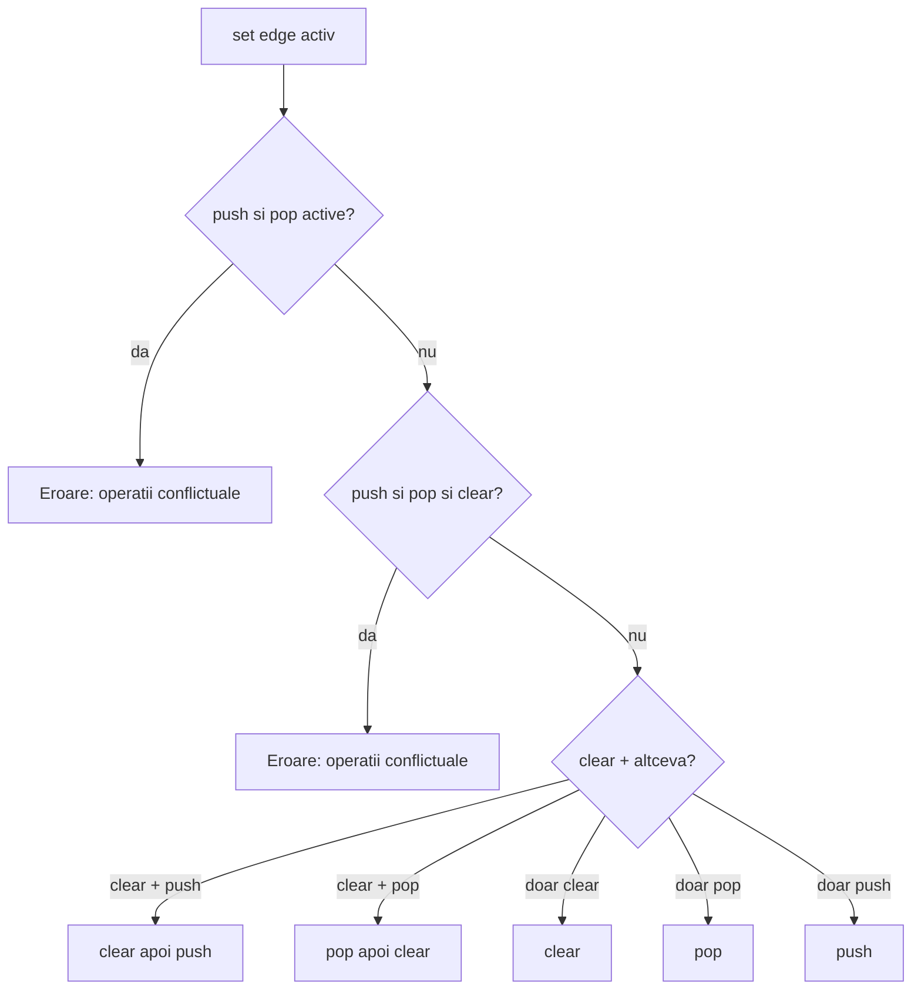
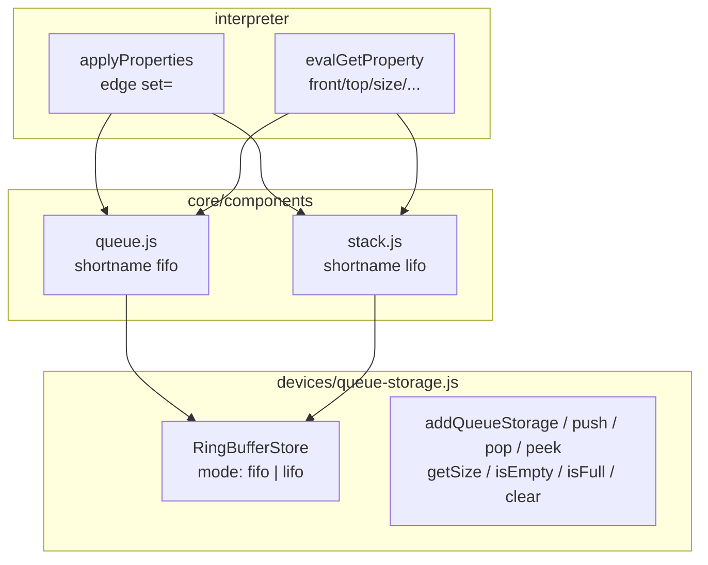

# Plan: componente `comp [queue]` și `comp [stack]`

## Obiectiv

Două componente de stocare ordonată, **fără panel UI** în v1 (logic only), pe același model ca [`reg.js`](v0_3_2/core/components/reg.js) / [`counter.js`](v0_3_2/core/components/counter.js):

| Componentă | Tip | Shortname | Mod |
|--------------|-----|-----------|-----|
| Queue (FIFO) | `queue` | `fifo` | first-in, first-out |
| Stack (LIFO) | `stack` | `lifo` | last-in, first-out |

**Redenumire documentație:** peste tot unde apare `fifo` ca nume de componentă → `queue` (inclusiv [`future-component-ideas.md`](v0_3_2/doc/future-component-ideas.md), [`doc-index.json`](v0_3_2/doc/doc-index.json), [`ui/doc-viewer.js`](v0_3_2/ui/doc-viewer.js)).

---

## Decizii confirmate (din spec + clarificări)

### Atribute

```logts
comp [queue] .q:
  width: 8      # lățimea fiecărui element (min 1, default 8)
  length: 64    # capacitate maximă în elemente (min 1, default 64)
  :
```

Stack: aceleași atribute (`width`, `length`).

### Ieșiri (combinational, `evalGetProperty`)

| Pout | Queue | Stack | Lățime | Notă |
|------|-------|-------|--------|------|
| Citire standard | **`get`** | **`get`** | `width` | alias LogTScript (ca mem/reg/counter); **aceeași valoare** ca `front`/`top` |
| Nume domeniu | `front` | `top` | `width` | peek — valoarea pe care `pop` ar scoate-o, **fără** eliminare |
| Gol | `empty` | `empty` | 1 | |
| Plin | `full` | `full` | 1 | |
| Număr elemente | `size` | `size` | `sizeWidth` | |
| Capacitate max | `capacity` | `capacity` | `sizeWidth` | |
| Locuri libere | `free` | `free` | `sizeWidth` | |

**Redirect `prop >= wire` în property blocks** (toate pout-urile)

Orice pout din `getRedirectProperties()` acceptă **`prop >= wire`** / **`prop>`** în property blocks — la fel ca `get >=` la mem sau `mod >=` la divider:

| Queue | Stack | Exemplu |
|-------|-------|---------|
| `get >=` | `get >=` | valoare peek (≈ front/top) |
| `front >=` | — | același conținut ca `get >=` |
| — | `top >=` | același conținut ca `get >=` |
| `empty >=` | `empty >=` | flag 1-bit |
| `full >=` | `full >=` | flag 1-bit |
| `size >=` | `size >=` | `sizeWidth` biți |
| `capacity >=` | `capacity >=` | `sizeWidth` biți |
| `free >=` | `free >=` | `sizeWidth` biți |

**Nu** în v1: `end`, `back`, `tail` (nu există ca pout).

```logts
.q:{
  front >= data
  size >= n
  free >= slots
  pop = 1
  set = 1
}
```

**Implementare redirect (refactor mic în runtime):**

1. **Parser** [`parser.js`](v0_3_2/core/parser.js): în loc de listă fixă `REDIRECT_PROPS = {mod, carry, …}`, acceptă **`prop >=`** pentru orice `prop` care e pout valid al componentei (la parse, validare după tip componentă dacă e disponibil; fallback: extinde setul cu `front`, `top`, `empty`, `full`, `size`, `capacity`, `free` + păstrează `get`/`mod`/… existente).

2. **Interpreter** [`interpreter.js`](v0_3_2/core/interpreter.js): generalizează bucla `get>` (~5918) într-o buclă **`prop>`** unică:
   - pentru fiecare `prop.property` care se termină în `>` (excl. `pout>`),
   - `baseProp = prop.property.slice(0, -1)`,
   - verifică `componentRegistry.supportsRedirect(comp.type, baseProp)`,
   - `evalAtom({ var, property: baseProp })` → scrie pe wire țintă (padding/trunc ca la `get>`).

3. **Componente** queue/stack: `getRedirectProperties()` returnează **aceeași listă** ca pout-urile citibile:

```javascript
// queue.js
getRedirectProperties() {
  return ['get', 'front', 'empty', 'full', 'size', 'capacity', 'free'];
}
// stack.js
getRedirectProperties() {
  return ['get', 'top', 'empty', 'full', 'size', 'capacity', 'free'];
}
```

**Ordine în același block:** `push`/`pop`/`clear` rulează în `applyProperties`; apoi toate `prop >=` citesc starea **actualizată**. Pentru valoarea **înainte** de pop: block separat cu `front >=` / `get >=`, sau `8wire x = .q:front` înainte de pop.

**`:get` vs `:front` / `:top`**

- **`:get`** = convenția standard (`8wire x = .q:get`, `doc(comp.queue)` → `Xpout get`).
- **`:front`** / **`:top`** = nume domeniu; **aceeași valoare** ca `:get` la peek.
- Niciunul **nu** face `pop`. Gol → zero-padded la `width`; verifică `:empty`.

**`sizeWidth`** = `bitIndexWidth(length + 1)` — helper existent în [`interpreter.js`](v0_3_2/core/interpreter.js) (folosește `Math.clz32`, **nu** `Math.log2`):

```javascript
function bitIndexWidth(len) {
  return len <= 1 ? 1 : 32 - Math.clz32(len - 1);
}
```

Pentru `:size`, `:capacity` și `:free` reprezentăm valorile `0 .. length` (inclusiv), deci argumentul e `length + 1`. Ex.: `length: 16` → `bitIndexWidth(17)` = **5 biți** (`00000`…`10000`); 3 elemente → `:size` = `00011`, `:capacity` = `10000`, `:free` = `01101` (13 locuri libere).

- `:size` = numărul curent de elemente, zero-padded la `sizeWidth`.
- `:capacity` = `length` în binar, zero-padded la aceeași lățime.
- `:free` = `length - size` (locuri rămase până la plin), zero-padded la `sizeWidth`. Invariant: `size + free = capacity` (numeric). Când plin: `:free` = `0`; când gol: `:free` = `:capacity`.
- `:front` / `:top` pe coadă/stivă goală: **zero-padded la `width`**; utilizatorul verifică `:empty` înainte (documentat explicit).

**`:sp`** = *stack pointer* — **nu** în v1 (redundant cu `:size`); vezi discuție plan. **`:free`** înlocuiește nevoia de a calcula `capacity - size` în script.

### Intrări (property blocks, edge pe `set`)

```logts
.q:{
  push = ^41    # valoare de inserat (lățime = width)
  set = 1
}
.q:{
  pop = 1
  set = 1
}
.q:{
  clear = 1
  set = 1
}
```

Trigger: același pattern ca reg/counter — `set` activ când ultimul bit e `1`.

### Reguli combinații în același block (`set` edge)



### Erori runtime

| Situație | Mesaj |
|----------|-------|
| `width <= 0` / `length <= 0` | la `createDevice` |
| push, valoare ≠ `width` | `push value width mismatch` |
| push când plin | `Queue is full` / `Stack is full` |
| pop când gol | `Queue is empty` / `Stack is empty` |
| pin necunoscut | `Unknown queue property` / `Unknown stack property` |
| push + pop în același block | `Conflicting queue operations` |

---

## Arhitectură



| Strat | Fișier nou | Rol |
|-------|------------|-----|
| Motor | [`devices/queue-storage.js`](v0_3_2/devices/queue-storage.js) | Ring buffer partajat; `mode: 'fifo' \| 'lifo'` |
| Queue | [`core/components/queue.js`](v0_3_2/core/components/queue.js) | `type='queue'`, `shortnames: { fifo: 'queue' }` |
| Stack | [`core/components/stack.js`](v0_3_2/core/components/stack.js) | `type='stack'`, `shortnames: { lifo: 'stack' }` |
| Registry | [`core/components/index.js`](v0_3_2/core/components/index.js) | `register(QueueComponent)`, `register(StackComponent)` |
| HTML | [`script_editor_v0_3_2.html`](v0_3_2/script_editor_v0_3_2.html), [`run_tests.html`](v0_3_2/run_tests.html) | script tags |
| Node runner | [`_run_suite_node.js`](v0_3_2/_run_suite_node.js), [`_compare_tests.js`](v0_3_2/_compare_tests.js) | include fișiere noi |

**Motor intern (concept):**

- Stocare: `Array(length)` de string-uri binare (`width` biți).
- FIFO: `head`, `count` — push la `(head+count)%length`, pop de la `head`.
- LIFO: `count` ca stack pointer — push la `count`, pop `count-1`.
- `peek()` = `front`/`top` fără modificare; `''` → zero-pad la `width` dacă gol.

**Fără modificări majore în** [`interpreter.js`](v0_3_2/core/interpreter.js) — componentele noi folosesc doar registry (`createDevice`, `applyProperties`, `evalGetProperty`), ca reg/counter.

---

## Implementare pe faze

### Faza 1 — Motor de stocare + teste unitare

Fișier [`devices/queue-storage.js`](v0_3_2/devices/queue-storage.js):

```javascript
addQueueStorage({ id, width, length, mode })
queuePush(id, value)   // throw overflow / width mismatch
queuePop(id)           // throw underflow; return removed value
queuePeek(id)          // zero-pad if empty
queueGetSize(id)       // 0..length
queueGetFree(id)       // length - size, sau derivat în evalGetProperty
queueIsEmpty(id) / queueIsFull(id)  // '0' | '1'
queueClear(id)
// sizeWidth: bitIndexWidth(length + 1) — reutilizat din interpreter.js, nu helper duplicat
```

Teste în [`test_suite.js`](v0_3_2/test_suite.js) (grup `queue-storage`, IDs ~251–260):
- FIFO push/pop ordine A,B,C
- LIFO push/pop ordine C,B,A
- overflow / underflow throw, stare neschimbată
- `bitIndexWidth(17) === 5` (pentru `length: 16`)

### Faza 2 — `comp [queue]`

[`core/components/queue.js`](v0_3_2/core/components/queue.js):

- `getDef()` — attrs `width`, `length`; pins `set`, `push`, `pop`, `clear`; pouts **`get`**, `front`, `empty`, `full`, `size`, `capacity`, `free` (+ `returns: 'Xbit'` pe valoarea principală)
- `getSupportedProperties()` — `get`, `front`, `empty`, `full`, `size`, `capacity`, `free`
- `getRedirectProperties()` — **aceeași listă** (toate suportă `prop >=`)
- `createDevice` — validare attrs, `addQueueStorage({ mode: 'fifo' })`
- `applyProperties` — logica combinațiilor de mai sus; `_isActive()` ca terminal
- `getForbidDirectAssign()` — mesaj clar (ca counter)
- `evalGetProperty` — mapare pout → API motor

### Faza 3 — `comp [stack]`

[`core/components/stack.js`](v0_3_2/core/components/stack.js) — `get` + `top` + flags; `getRedirectProperties()` = `['get','top','empty','full','size','capacity','free']`.

### Faza 2b — Redirect generic `prop >=` (parser + interpreter)

Înainte sau împreună cu componentele queue/stack:

- Refactor buclă `prop>` în [`interpreter.js`](v0_3_2/core/interpreter.js) (înlocuiește/extinde `get>` + poate unifică `mod>`/`carry>` pe termen lung).
- Parser [`parser.js`](v0_3_2/core/parser.js) — recunoaște `front >=`, `size >=`, etc.
- Teste regresie: mem `get >=`, divider `mod >=` încă funcționează.
- Teste noi: queue `front >=` + `size >=` în același block; stack `top >=` + `free >=`.

### Faza 4 — Teste E2E (Load & Run)

[`test_suite_ported.js`](v0_3_2/test_suite_ported.js), grupuri noi în [`_gen_manifest.js`](v0_3_2/_gen_manifest.js):

**Queue (IDs 1020–1040):**

| ID | Scenariu |
|----|----------|
| 1020 | registry `queue` + shortname `fifo` parse |
| 1021 | push A,B,C → `:get` = `:front` = A |
| 1022 | pop → `:get` devine B |
| 1023 | `:size` după 3 push = `00011` (length 16) |
| 1024 | `:capacity` = `10000`, `:free` = `01101` după 3 push (length 16) |
| 1025 | `:empty` / `:full` / `:free` = `:capacity` când gol |
| 1026 | overflow push → throw `Queue is full` |
| 1027 | underflow pop → throw `Queue is empty` |
| 1028 | `clear` + `push` în același block |
| 1029 | `pop` + `clear` în același block |
| 1030 | `push` + `pop` același block → eroare |
| 1031 | shortname `comp [fifo]` funcțional |
| 1032 | queue + terminal (producer/consumer); `get >=` într-un block |
| 1033 | `front >= v` + `pop` în același block — `v` = noul front după pop |
| 1034 | `size >=` / `free >=` în property block |
| 1035 | wave propagation |
| 1036 | `doc(comp.queue)` — `Xpout get` + `Xpout front` |
| 1037 | `doc(comp.fifo)` shortname |
| 1038 | `probe(.q:get)` / `probe(.q:front)` |
| 1039 | `probe(.q:size)` / `probe(.q:free)` |
| 1040 | regresie parser: `empty >= flag` pe queue |

**Stack (IDs 1041–1054):** mirror — `top >=`, `get >=`, `size >=`, etc.

Variante **wave** pe scenarii cu propagare.

### Faza 4b — `doc()` și `probe()`

Fără cod special în interpreter — funcționează prin contractul `BuiltinComponent` (ca divider `:mod`, osc `:counter`):

| Funcție | Cerință componentă | Exemplu |
|---------|-------------------|---------|
| `doc(comp.queue)` | `getDef()` complet | `doc(comp.fifo)` via shortname |
| `doc(comp.stack)` | idem | `doc(comp.lifo)` via shortname |
| `probe(.q:get)` | `getSupportedProperties` + `evalGetProperty` | echivalent `:front` |
| `probe(.q:front)` | idem | alias domeniu |
| `probe(.q:size)` | `bitWidth` = `bitIndexWidth(length+1)` | actualizare la push/pop |
| `probe(.q:free)` | idem; valoare = `length - size` | plin → `0`, gol → `capacity` |
| `probe(.s:top)` | stack — proprietate `top` | idem |

**Probe:** după `push`/`pop`, `_readComputedComponentProbeValue` re-evaluează `evalGetProperty` — teste verifică `initialised` + `changed` (pattern teste 825–828 pe `probe(.div:mod)`).

**Doc:** `doc(comp.queue)` conține `Xpout get`, `Xpout front`, `Xpin push`; `doc(comp)` index listează `comp.queue` / `comp.fifo`.

### Exemplu — `front >=` și `size >=`

```logts
comp [queue] .q:
  width: 8
  length: 16
  :

.q:{ push = ^41
  set = 1 }
.q:{ push = ^42
  set = 1 }

4wire data
5wire n
5wire slots
.q:{
  front >= data
  size >= n
  free >= slots
  set = 1
}
show(data)
show(n)
show(slots)
```

Stack echivalent: `top >= data`, `size >= n`, `free >= slots`.

### Faza 5 — Documentație

Fișiere noi:
- [`doc/queue.md`](v0_3_2/doc/queue.md) — spec completă (`fifo`→`queue`, `:size`, `:capacity`, `:free`)
- [`doc/stack.md`](v0_3_2/doc/stack.md) — spec stack + relația cu queue

Fiecare secțiune runnable cu blocuri `logts-play` (Load & Run), după modelul [`counter.md`](v0_3_2/doc/counter.md):
- simple push / pop
- size, empty, full, capacity, free
- UART TX buffer (queue)
- terminal serial monitor (queue + terminal)
- CPU call stack (stack)

Actualizări index:
- [`doc/components.md`](v0_3_2/doc/components.md) — rânduri `queue`/`fifo`, `stack`/`lifo` în secțiunea Storage
- [`future-component-ideas.md`](v0_3_2/doc/future-component-ideas.md) — marchează D1/A7 ca implementate, redenumește FIFO→queue
- [`doc/doc-index.json`](v0_3_2/doc/doc-index.json) + `node _gen_doc_data.js`

---

## Exemplu referință — property block push

```logts-play
comp [queue] .q:
  width: 8
  length: 8
  :

.q:{ push = ^41
  set = 1 }
.q:{ push = ^42
  set = 1 }

8wire x = .q:get
show(x)
```

Rezultat: `01000001` (^41 = `A`). `:get` și `:front` returnează același lucru.

### Exemplu — `:free`

```logts-play
comp [queue] .q:
  width: 8
  length: 16
  :

.q:{ push = ^41
  set = 1 }
.q:{ push = ^42
  set = 1 }
.q:{ push = ^43
  set = 1 }

5wire sz = .q:size
5wire fr = .q:free
show(sz)
show(fr)
```

Rezultat: `sz` = `00011` (3 elemente), `fr` = `01101` (13 locuri libere). Aceleași pout-uri pe `comp [stack]`.

---

## Verificare finală

```powershell
cd v0_3_2
node _run_suite_node.js
node _gen_manifest.js
node _gen_doc_data.js
```

Manual în editor: Load & Run pe exemplele din `queue.md` / `stack.md`.

---

## Note de implementare

- **Lățime push:** strict — valoarea trebuie să aibă exact `width` biți (eroare la mismatch); fără padding implicit.
- **Wave:** după push/pop, propagare prin `updateConnectedComponents` pe fire legate la `:front`/`:size` etc. (citirile sunt combinational din motor).
- **Reserved names:** `queue` și `stack` ca tipuri; shortnames `fifo`/`lifo` în `shortnames` map (pattern counter `=`).
- **Lățime size/capacity/free:** `bitIndexWidth(length + 1)` — `:free` = `length - size`, padded; invariant `size + free = capacity`.
- **doc / probe / prop>=:** toate pout-urile în `getRedirectProperties()`; refactor buclă generică `prop>` în interpreter.
- **Fără** duplicare logică legacy în interpreter — doar registry.
