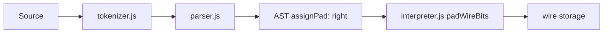

# Plan: operator `=:` (right-pad assignment) — Faza 1

## Context și scope

**Stare actuală** ([`v0_3_2/core/interpreter.js`](v0_3_2/core/interpreter.js)):

| Operator | Unde | Padding la mismatch |
|----------|------|---------------------|
| `:=` | doar declarație wire, literal (`initExpr`) | `padStart` (left) |
| `=` | declarație wire cu expresie + re-asignare | `padStart` în decl/execWireStatement; re-asignare directă cere lățime exactă |
| `=:` | **nu există** | — |

**Faza 1 (acest plan):** introduce `=:` cu **right-pad** (`padEnd`), folosit oriunde funcționează astăzi `=` pentru fire (declarație, re-asignare, re-exec wave/legacy). **Nu** modificăm `=`, `:=` sau `:`.

**Confirmat de utilizator:** `:=` rămâne „initial assignment” doar la declarație; `=` și `=:` sunt operatori de asignare folosibili oriunde (decl + re-asignare).

**Comportament dorit** (din specificație):

| Exemplu | Rezultat |
|---------|----------|
| `3wire q =: 1` | `100` |
| `3wire q =: 10` | `100` |
| `8wire q =: 101` | `10100000` |
| `8wire q =: 11110000` | `11110000` (fără padding) |

### Padding vs truncare (decizie confirmată)

| Situație | `=` | `=:` |
|----------|-----|------|
| Prea scurt (`3wire` + `1`) | `001` (left-pad) | `100` (right-pad) |
| Prea lung — depinde de calea de execuție (vezi nota de mai jos) | ca acum | **aceeași truncare** ca `=` în acel punct |

**Truncare:** **nu se modifică** și **nu se unifică** în Faza 1. Singura diferență nouă între `=` și `=:` este **padding-ul** (stânga vs dreapta). La `=:` copiem truncarea existentă din fiecare punct de cod unde intră deja `=` — fără logică nouă pe `assignPad`.

### Notă: truncare inconsistentă în codul existent (nu rezolvăm acum)

Audit în [`interpreter.js`](v0_3_2/core/interpreter.js) și [`signal-propagation.js`](v0_3_2/core/signal-propagation.js): truncarea nu e uniformă.

| Expresie | Efect | Exemple de locații |
|----------|-------|-------------------|
| `substring(0, bits)` | păstrează **primii** biți (taie din dreapta) | ~3092 NEXT re-exec; ~4304 `execWireStatement` re-asignare; `signal-propagation.js` ~835 |
| `substring(length - bits)` | păstrează **ultimii** biți (taie din stânga) | ~3983 `:=` init; ~4156 decl `=` + expr; ~4401 decl re-exec; ~6396 `publishFromWs` |

Exemplu `3wire` + `11001`:

- cale MSB (`substring(0,3)`) → `110`
- cale LSB (`substring(2)`) → `001`

**Implicație Faza 1:** helper-ul de mai jos gestionează doar **padding**; truncarea rămâne expresia deja prezentă în fiecare ramură (copiată 1:1 pentru `=:`).

**Faza 3 (viitor, out of scope acum):** unificare truncare la o singură regulă documentată în tot runtime-ul (fire, wave, PCB pins, aritmetică etc.) + teste de regresie.

### ASM pe wire — comportament actual vs `=:`

**Corecție:** în editor (propagare **wave**, calea dominantă via `execWireStatement`), ASM **mai scurt** decât wire-ul **nu dă eroare** — se face **left-pad** (`padStart`), la fel ca la literale.

Exemplu real (confirmat):

```logts
inline [asm] .myisa:
  NOP   : 0000 + 4b
  LOAD  : 0001 + R2b + A2b
  ...

16wire x = .myisa { LOAD R1 A2 }
show(x)   # → x (16wire) = ^00 + ^16
```

- `LOAD R1 A2` asamblat = **8 biți** (`00010110` = `^16`)
- wire **16 biți** → `padStart` adaugă un octet `^00` la **stânga**
- rezultat: `[00][16]` = `00000000` + `00010110`

**Cu `=:` (Faza 1):** același blob 8 biți în `16wire` → `padEnd` → `^16 + ^00` (program la stânga, zerouri la dreapta).

| Declarație | Blob 8 bit → `16wire` | Layout |
|------------|------------------------|--------|
| `16wire x = .myisa { LOAD R1 A2 }` | `^00 + ^16` | left-pad (actual) |
| `16wire x =: .myisa { LOAD R1 A2 }` | `^16 + ^00` | right-pad (nou) |

**Notă legacy:** există o ramură separată (~4141) cu `hasAsmBlob` + throw la mismatch; e pe calea decl `=` cu `computeRefs` (ex. interior PCB / legacy). La `=:` acolo: `padEnd` în loc de throw când blob **mai scurt** (aliniere cu wave). Calea wave (`execWireStatement` ~4398) folosește deja `padStart` — acolo `=:` → `padEnd`.

**De decis în Faza 3:** unificare comportament ASM + `=` între legacy și wave (vezi secțiunea Out of scope → Faza 3).



---

## 1. Tokenizer — [`v0_3_2/core/tokenizer.js`](v0_3_2/core/tokenizer.js)

Înainte de linia generică `'=,+():-...'` (care consumă `=` singur), tratare specială:

```javascript
if (c === '=') {
  this.next();
  if (!this.eof() && this.peek() === ':') {
    this.next();
    return this.token('SYM', '=:');
  }
  return this.token('SYM', '=');
}
```

Ordinea e importantă: `:=` e deja tratat la `:` + `=`; `=:` e `=` + `:`.

---

## 2. Parser — [`v0_3_2/core/parser.js`](v0_3_2/core/parser.js)

### 2a. Declarație wire (`wireDecl`, ~linia 1069)

Între ramura `:=` și `=`, adăugăm:

```javascript
} else if (this.c.value === '=:') {
  this.eat('SYM', '=:');
  return { decls, expr: this.expr(), assignPad: 'right', line, col };
}
```

### 2b. Re-asignare (`assignment()`, ~linia 971)

Înlocuim `this.eat('SYM', '=')` rigid cu:

```javascript
let assignPad = 'left'; // default = comportament curent =
if (this.c.value === '=:') {
  this.eat('SYM', '=:');
  assignPad = 'right';
} else {
  this.eat('SYM', '=');
}
return { assignment: { target: targetAtom, expr, assignPad } };
```

(`assignment0()` rămâne cu `=` — nu e folosit pentru wire `=:` în practică.)

---

## 3. Interpreter — [`v0_3_2/core/interpreter.js`](v0_3_2/core/interpreter.js)

### 3a. Helper central — doar padding (lângă alți helperi de biți)

```javascript
function padWireBits(value, bits, assignPad) {
  if (!value) return '0'.repeat(bits);
  if (value.length >= bits) return value; // truncarea rămâne la caller
  return assignPad === 'right'
    ? value.padEnd(bits, '0')
    : value.padStart(bits, '0');
}
```

**Truncarea** nu intră în helper — în fiecare punct de cod păstrăm expresia existentă (`substring(0, bits)` sau `substring(length - bits)`) și o aplicăm identic pentru `=` și `=:`.

### 3b. Puncte de aplicare (propagăm `assignPad` din AST)

| Locație | ~linii | Acțiune |
|---------|--------|---------|
| Declarație wire cu `expr` | 4137–4157 | legacy: `padWireBits` + `assignPad`; dacă `asmBlob` mai scurt + `right` → `padEnd` nu throw; truncare neschimbată |
| `execWireStatement` — `s.assignment` | 4304–4305 | truncare `substring(0, bits)` neschimbată; `padWireBits` cu `assignPad` |
| `execWireStatement` — decl (wave) | 4397–4401 | `padStart` → `padWireBits` cu `assignPad` (ASM + literale); truncare neschimbată |
| NEXT re-exec loop | 3088–3092 | truncare `substring(0, bits)` neschimbată; `assignPad` doar pentru padding (`padEnd` vs `padStart`) |
| `publishFromWs` (wave) | 6395–6396, 6421 | truncare `substring(length - bits)` neschimbată; `padWireBits` cu `assignPad` |
| Re-asignare directă `s.assignment` | ~3808–3814 | dacă `!range` și `assignPad === 'right'`: `padWireBits` înainte de slice; truncare ca la `=` |

**Notă:** la slice parțial (`q.0-1 =: 1`) păstrăm regula strictă de lățime slice (ca la `=`).

---

## 4. Teste

### 4a. [`v0_3_2/test_suite.js`](v0_3_2/test_suite.js) — grup nou `right-pad-assign` (ID **235–245**)

| ID | Tip | Ce verifică |
|----|-----|-------------|
| 235 | tokenizer | `=:` e un singur token `SYM(=:)` |
| 236 | tokenizer | `3wire q =: 1` — fără token `:` separat după `=` |
| 237 | tokenizer | `:=` și `=:` coexistă fără interferență |
| 238 | parser | `3wire q =: 1` → `expr` prezent, `assignPad: 'right'`, fără `initExpr` |
| 239 | parser | `q =: 1` → `assignment.assignPad === 'right'` |
| 240 | parser | `3wire q = 1` → fără `assignPad` (sau `'left'`) |
| 241–245 | unit helper | `padWireBits`: exemple padding; pereche control `=` vs `=:` pe aceeași cale de execuție |

### 4b. [`v0_3_2/test_suite_ported.js`](v0_3_2/test_suite_ported.js) — E2E (ID **832–838**, grup `right-pad-assign`)

| ID | Scenariu | Așteptat |
|----|----------|----------|
| 832 | `3wire q =: 1` | `100` |
| 833 | `3wire q =: 10` | `100` |
| 834 | `8wire q =: 101` | `10100000` |
| 835 | `8wire q =: 11110000` | `11110000` |
| 836 | Decl + re-asignare `q =: 11` pe `4wire` | right-pad la re-asignare |
| 837 | `3wire q =: 11001` (prea lung, decl) | același rezultat ca `3wire q = 11001` pe aceeași cale (`001` la decl ~4156) |
| 838 | ASM: `16wire x =: .myisa { LOAD R1 A2 }` | `^16 + ^00` (vs `=` → `^00 + ^16`) |

Comparație de control: același script cu `=` trebuie să dea left-pad (comportament neschimbat).

### 4c. [`v0_3_2/_gen_manifest.js`](v0_3_2/_gen_manifest.js)

```javascript
{ id: 'right-pad-assign', label: '=: right-pad assignment' }
```

---

## 5. Documentație (engleză, ca restul doc-urilor)

### Fișier nou: [`v0_3_2/doc/assignment-operators.md`](v0_3_2/doc/assignment-operators.md)

Conținut bazat pe specificația utilizatorului, structurat:

- **`=:`** — documentat complet (syntax, exemple padding, ASM, `logts-play` runnable)
- Secțiune clară: truncarea e **aceeași** ca la `=` în fiecare context; doar padding-ul diferă; mențiune scurtă că unificarea truncării e planificată Faza 3
- **`=`**, **`:=`**, **`:`** — descriere cu notă clară:
  - *Phase 1 (current):* `=` = left-pad la declarație; `:=` = initial literal-only; `:` neschimbat; `=:` = right-pad (nou)
  - *Phase 2 (planned):* strict `=`, `:` initial assignment (conform roadmap)
  - *Phase 3 (incomplete):* unificare truncare (o singură regulă în tot runtime-ul); unificare ASM + `=` între legacy și wave (azi wave left-pad vs legacy eroare la mismatch) — de decis; documentație actualizată când se implementează

### Actualizări index

- [`v0_3_2/doc/doc-index.json`](v0_3_2/doc/doc-index.json) — intrare în secțiunea **Reference**
- [`v0_3_2/doc/signal-propagation.md`](v0_3_2/doc/signal-propagation.md) — o propoziție + link la assignment-operators (mențiune `=:`)
- [`v0_3_2/doc/asm.md`](v0_3_2/doc/asm.md) — exemplu cross-link `32wire prog =: .myisa { ... }` (secțiune load program)
- Regenerare: `node v0_3_2/_gen_doc_data.js`

---

## 6. Verificare finală

```bash
node v0_3_2/_gen_manifest.js
node v0_3_2/_run_suite_node.js
```

Toate testele existente + noile 235–245 / 832–838 trebuie să treacă; zero regresii pe `:=` (grup `wire-init` 82–101) și pe `=` left-pad.

---

## Out of scope

### Faza 2

- `=` strict (fără padding, eroare la mismatch)
- `:` ca initial assignment (înlocuitor `:=`)
- Redenumire / restricții noi pe `:=`
- `=:` pe `.mem =:`, property blocks comp, etc. (doar fire în Faza 1)

### Faza 3

- **Unificare truncare** — o singură regulă în `interpreter.js`, `signal-propagation.js`, component handlers etc. (azi coexistă `substring(0, bits)` și `substring(length - bits)`)
- **Unificare ASM + `=` (legacy vs wave)** — inconsistență descoperită la planificare:
  - **Wave** (`execWireStatement`, editor implicit): ASM mai scurt decât wire → **left-pad** (`padStart`), ex. `16wire x = .myisa { LOAD R1 A2 }` → `^00 + ^16`
  - **Legacy** (decl cu `computeRefs`, ~4141): același caz → **eroare** `Bit-width mismatch` (`hasAsmBlob`)
  - De evaluat: eroare la **ambele** căi când `=` + ASM și `blob.length !== wire.width` (aliniere cu `=` strict din Faza 2); `=:` rămâne pentru slot lat cu right-pad
  - Breaking change posibil: scripturi care astăzi fac pad în wave vor necesita lățime exactă sau `=:`
  - Teste cross-mod (legacy / wave) + documentație
- Teste de regresie cross-mod (legacy / wave) după unificare
- Documentație actualizată cu regulile canonice (truncare + ASM)
