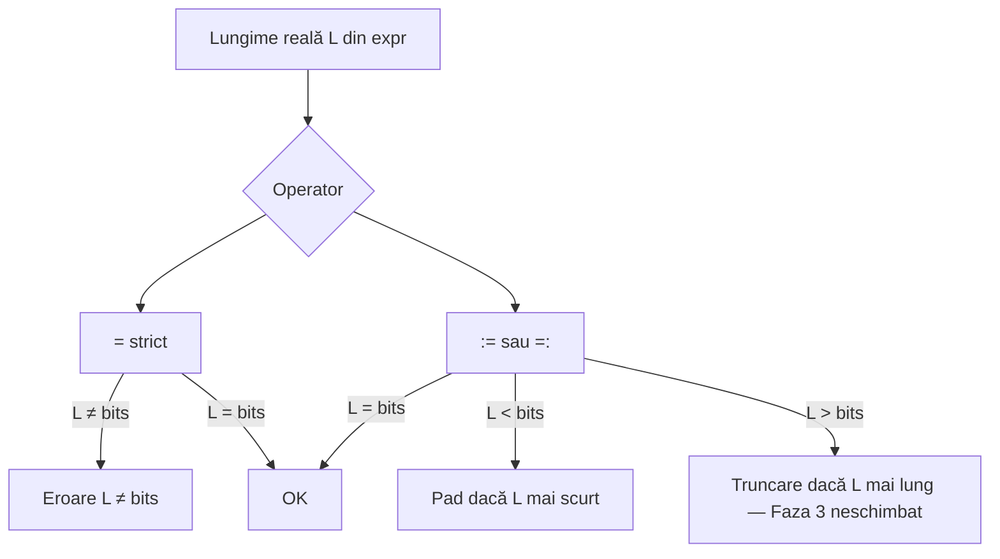

# Plan: operatori de asignare

## Specificație țintă

| Operator | Prea scurt | Exact | Prea lung |
|----------|------------|-------|-----------|
| `=` | **Eroare** | OK | **Eroare** (Faza 2.5) |
| `:=` | Left-pad | OK | Truncare (Faza 3 — neschimbat până atunci) |
| `=:` | Right-pad | OK | Truncare (Faza 3 — neschimbat până atunci) |
| `:` | Left-pad la init | OK | Truncare la init |

| Operator | Unde |
|----------|------|
| `=` | declarație, re-asignare — **lățime exactă** |
| `:=` | declarație, re-asignare — left-pad |
| `=:` | declarație, re-asignare — right-pad |
| `:` | declarație wire — init literal only |

### Exemple canonice

```logts
3wire q = 001          # OK
3wire q = 1            # EROARE (prea scurt)
4wire q = 11111        # EROARE (prea lung) — Faza 2.5

3wire q := 1           # 001
3wire q =: 1           # 100
3wire q : 1            # init

8wire prog = .myisa { LOAD R1 A2 }     # OK — exact
16wire slot := .myisa { LOAD R1 A2 }   # left-pad
16wire slot =: .myisa { LOAD R1 A2 }   # right-pad
23wire x = .myisa { NOP; NOP; BEQ }     # EROARE (24 > 23) — Faza 2.5
24wire x = .myisa { NOP; NOP; BEQ }     # OK
```

---

## Faza 1 — COMPLETĂ

Operator `=:` (right-pad). Teste 235–245, 1000–1010.

---

## Faza 2 — COMPLETĂ (562/562)

Implementat în ordine:

1. **`:`** init literal (fost `:=` init)
2. **`=`** strict la **prea scurt** + unificare ASM legacy/wave la mismatch
3. **`:=`** left-pad repurposed

Fișiere: [`parser.js`](v0_3_2/core/parser.js), [`interpreter.js`](v0_3_2/core/interpreter.js), [`signal-propagation.js`](v0_3_2/core/signal-propagation.js), teste, [`assignment-operators.md`](v0_3_2/doc/assignment-operators.md), `ex_dv_7seg` șters din [`fs.js`](v0_3_2/files/fs.js).

### Lacună cunoscută (motiv Faza 2.5)

`=` e strict doar la **prea scurt**. La **prea lung**, wave taie **înainte** de verificare:

```javascript
// execWireStatement ~4452 — PROBLEMA
const valueBits = totalValue.substring(bitOffset, bitOffset + bits);
if (declPad === 'strict') {
  if (wireValue.length !== bits) throw ...  // vede deja 4 caractere, nu 5
}
```

Exemple care **nu** dau eroare azi dar ar trebui:

- `4wire q = 11111` → afișează `1111`
- `23wire x = .myisa { NOP; NOP; BEQ loop }` → truncare silențioasă

Legacy la literale/ASM cu `=` aruncă deja la `length !== bits` pe blob întreg; **wave** ocolesc prin pre-slice.

---

## Faza 2.5 — `=` strict simetric (următoare implementare)

### Decizie

- **`=`** = eroare la **orice** `length !== bits` (mai scurt **și** mai lung)
- **Nu modificăm** truncarea pentru `:=` / `=:` — rămâne pentru **Faza 3**
- **Nu** introducem operator nou de truncare



### Implementare

**Principiu:** verificare strict pe lungimea **completă** înainte de `substring` / pad.

| Locație | [`interpreter.js`](v0_3_2/core/interpreter.js) ~linii | Schimbare |
|---------|--------------------------------------------------------|-----------|
| `execWireStatement` decl | ~4452–4465 | extrage `raw` din `totalValue` (slice fără trunchiere); dacă `strict` și `raw.length !== bits` → throw; altfel `wireValue = raw` |
| `execWireStatement` assignment | ~4355–4360 | idem — nu `substring(0, bits)` înainte de strict |
| NEXT re-exec | ~3104–3126 | verificare pe valoare completă înainte de trunc |
| `publishFromWs` | ~6457–6497 | idem |
| Legacy decl literals | ~4200 | deja OK — păstrează |
| `hasAsmBlob` + `=` | ~4187–4191 | deja OK — păstrează |
| [`signal-propagation.js`](v0_3_2/core/signal-propagation.js) | ~832–910 | aliniere: strict înainte de slice |

Helper sugerat (evită duplicare):

```javascript
function enforceWireStrictOrFit(raw, bits, assignPad, truncateFrom) {
  if (assignPad === 'strict') {
    if (raw.length !== bits) throw Error(wireBitsMismatchError(bits, raw.length));
    return raw;
  }
  // := / =: — logică existentă (pad + truncare neschimbată)
}
```

**Out of scope 2.5:** schimbarea regulii MSB vs LSB la trunc pe `:=` / `=:` (Faza 3).

### Teste noi

| ID | Scenariu | Așteptat |
|----|----------|----------|
| 1016 | `4wire q = 11111` | throw legacy + wave |
| 1017 | `23wire x = .myisa { NOP; NOP; BEQ loop }` | throw |
| 1018 | `4wire q := 11111` | trunc OK (comportament neschimbat) |
| 1015 | `4wire q = 1111` | OK (deja existent) |

### Migrare teste și documentație

**Regulă:** nu înlocui global `=` cu `:=`. Doar unde intenția era pad/truncare:

| Situație | Acțiune |
|----------|---------|
| Lățime deja exactă (`4wire = 1010`) | **Păstrează `=`** — majoritatea doc/testelor |
| Prea scurt, vrei pad | `:=` / `=:` / `:` sau literal exact pentru `=` |
| Prea lung, accepti truncare | `:=` sau `=:` — **nu** `=` |
| Prea lung, vrei tot programul | mărește `Nwire` sau scurtează expr |

**Audit minim:**

```bash
# literale BIN mai lungi decât Nwire cu =
# ASM unde instrCount × wordWidth > Nwire cu =
```

Impact estimat: **mic** — suite-ul folosește deja 8/16/24wire potrivite la ASM; doc folosește literale exacte.

**Doc de actualizat:**

- [`assignment-operators.md`](v0_3_2/doc/assignment-operators.md) — tabel: `=` → Error la „longer value”; exemplu `4wire q = 11111`
- [`asm.md`](v0_3_2/doc/asm.md) — `=` + program mai lung decât wire → eroare
- `_gen_doc_data.js`

### Verificare

```bash
node v0_3_2/_gen_manifest.js
node v0_3_2/_run_suite_node.js
node v0_3_2/_gen_doc_data.js
```

---

## Faza 3 — Unificare truncare (out of scope 2.5)

- O singură regulă documentată: `substring(0, bits)` vs `substring(length - bits)` pentru **`:=` și `=:`** (și `:` init)
- **`=` strict** rămâne fără truncare — doar eroare
- Teste cross-cale legacy/wave pentru pad/trunc

**Rezolvat în Faza 2:** unificare ASM + `=` legacy vs wave (eroare la mismatch scurt).

**Rezolvat în Faza 2.5:** `=` strict și la prea lung; wave nu mai taie silențios.

---

## Checklist

### Faza 2 (done)

- [x] `:` init
- [x] `=` strict prea scurt
- [x] `:=` left-pad
- [x] Doc + fs + 562 teste

### Faza 2.5 (pending)

- [ ] Strict simetric `=` — verificare înainte de substring (interpreter + signal-propagation)
- [ ] Teste 1016–1018 + 1015 confirmat
- [ ] Doc tabel + exemple eroare prea lung
- [ ] Audit grep migrări (puține așteptate)
- [ ] Suite verde

### Faza 3 (pending)

- [ ] Unificare truncare `:=` / `=:`

---

## Referință tehnică (arhivă)

`padWireBits`, `wireBitsMismatchError`, `stmtAssignPad` default `'strict'`, `peekNextIsAssign` recunoaște `:=`.

Grupuri manifest: `wire-init`, `left-pad-assign`, `strict-assign`, `right-pad-assign`.
