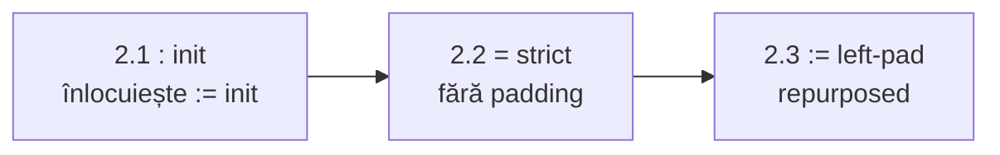

# Plan: operatori de asignare

## Specificație țintă (sursă utilizator)

| Operator | Comportament | Unde |
|----------|--------------|------|
| `=` | **Strict** — lățime exactă, fără padding; eroare la mismatch | declarație, re-asignare |
| `:=` | **Left-pad** — zerouri la stânga când valoarea e mai scurtă | declarație, re-asignare |
| `=:` | **Right-pad** — zerouri la dreapta când valoarea e mai scurtă | declarație, re-asignare |
| `:` | **Initial assignment** — valoare inițială literală la declarație wire | declarație wire only |

### Exemple canonice

```logts
3wire q = 001          # OK — strict exact
3wire q = 1            # EROARE: Expected 3 bits, got 1 bit

3wire q := 1           # 001 — left-pad
3wire q =: 1           # 100 — right-pad

3wire q : 1            # init literal (echivalent fost 1wire s := 1)

32wire prog =: .myisa { LOAD \0; ADDI \3; ... }   # ASM right-pad în slot lat
8wire prog = .myisa { LOAD R1 A2 }                # ASM lățime exactă
16wire slot := .myisa { LOAD R1 A2 }              # ASM left-pad în slot lat (Faza 2.3)
16wire slot = .myisa { LOAD R1 A2 }               # EROARE — strict
```

---

## Faza 1 — COMPLETĂ (553/553)

Implementat: `=:` (right-pad). `=` încă left-pad (comportament vechi). `:=` încă init literal.

Teste: 235–245, 1000–1010. Doc: [`assignment-operators.md`](v0_3_2/doc/assignment-operators.md) (notă Phase 2).

---

## Faza 2 — Ordine obligatorie de implementare



**De ce această ordine:**

1. **`:` preia init-ul** — eliberează tokenul `:=` fără a schimba încă semantica lui `:=` în cod
2. **`=` devine strict** — elimină padding-ul de pe `=` (și unifică legacy/wave la ASM + `=`)
3. **`:=` devine left-pad** — reutilizează tokenul pentru comportamentul care azi e pe `=` (padStart)

**Fereastră între 2.2 și 2.3:** după `=` strict, left-pad temporar indisponibil până la 2.3 — folosiți `=:` sau lățime exactă; ideal implementați 2.2 + 2.3 în același PR sau imediat consecutiv.

---

### Faza 2.1 — `:` initial assignment (înlocuiește `:=` init)

**Stare actuală:** `:=` în `wireDecl` → `initExpr` (literal only), `initOnly: true`.

**Țintă:** `3wire q : 1` — aceeași logică ca `3wire q := 1` azi.

| Fișier | Acțiune |
|--------|---------|
| [`parser.js`](v0_3_2/core/parser.js) | `wireDecl`: ramură `:` (SYM după nume wire) → `initExpr`; disambiguare față de `comp [...] .x:` |
| [`tokenizer.js`](v0_3_2/core/tokenizer.js) | verifică că `:` după ID wire e parsabil (nu confundat cu label ASM) |
| [`interpreter.js`](v0_3_2/core/interpreter.js) | același path `initExpr` / `initOnly` |
| **Migrație** | doc, `test_suite.js` wire-init 82–101, `fs.js` (`:=` → `:` pentru init) |
| **Compat** | `:=` init: deprecated cu mesaj „use `:`” sau alias temporar până la 2.3 |

**To-do:** `p2-step1-colon-parser`, `p2-step1-colon-interpreter`, `p2-step1-colon-migrate`, `p2-step1-colon-tests`

---

### Faza 2.2 — `=` strict

**Țintă:** `3wire q = 1` → eroare; `3wire q = 001` → OK.

| Fișier | Acțiune |
|--------|---------|
| [`parser.js`](v0_3_2/core/parser.js) | `=` → fără `assignPad: 'left'` implicit; strict flag sau lipsă assignPad |
| [`interpreter.js`](v0_3_2/core/interpreter.js) | elimină `padWireBits` când operator e `=`; throw `Expected N bits, got M bits` la decl, re-asignare, `execWireStatement`, NEXT, `publishFromWs` |
| [`interpreter.js`](v0_3_2/core/interpreter.js) ~4163 | `hasAsmBlob` + `=` → mereu throw la mismatch (legacy = wave) |
| [`signal-propagation.js`](v0_3_2/core/signal-propagation.js) | aliniere wave |

**Teste de rescris:**

| ID | Acțiune |
|----|---------|
| 1008 | șters — left-pad pe `=` nu mai există |
| 1010 | păstrat + extins la wave |
| teste `3wire q = 1` → left-pad | devin eroare sau `3wire q = 001` |

**To-do:** `p2-step2-strict-parser`, `p2-step2-strict-interpreter`, `p2-step2-strict-tests`

---

### Faza 2.3 — `:=` left-pad assignment (repurposed)

**Țintă:** comportamentul left-pad care **azi** e pe `=` devine pe `:=`.

| Fișier | Acțiune |
|--------|---------|
| [`parser.js`](v0_3_2/core/parser.js) | `wireDecl`: `:=` → `{ expr, assignPad: 'left' }` (nu `initExpr`); `assignment()`: `:=` → `assignPad: 'left'` |
| [`interpreter.js`](v0_3_2/core/interpreter.js) | `:=` → `padWireBits(..., 'left')` în toate căile unde azi `assignPad === 'left'` sau default `=` |
| **ASM** | `16wire x := .myisa { LOAD R1 A2 }` → `^00 + ^16` (left-pad); unificat legacy + wave |

**Teste noi (grup `left-pad-assign` sau extindere):**

| Exemplu | Așteptat |
|---------|----------|
| `3wire q := 1` | `001` |
| `3wire q := 10` | `010` |
| `8wire q := 101` | `00000101` |
| `16wire x := .myisa { LOAD R1 A2 }` | `0000000000010110` (înlocuiește vechiul 1008) |

**To-do:** `p2-step3-coloneq-parser`, `p2-step3-coloneq-interpreter`, `p2-step3-coloneq-asm`, `p2-step3-coloneq-tests`

---

### Faza 2 — Documentație

Rescrie [`assignment-operators.md`](v0_3_2/doc/assignment-operators.md) după spec completă utilizator (secțiuni `=`, `:=`, `=:` , `:` + Summary table + ASM example cu `=:`).

| Fișier | Acțiune |
|--------|---------|
| [`asm.md`](v0_3_2/doc/asm.md) | `=` strict; `:=` left-pad ASM; `=:` right-pad; lățimi exacte în exemple |
| [`signal-propagation.md`](v0_3_2/doc/signal-propagation.md) | operatori identici legacy/wave |
| `_gen_doc_data.js` | regenerare |

**To-do:** `p2-docs`

---

### Faza 2 — Curățare fs.js

Șterge `ex_dv_7seg` (~3603–3671 în [`files/fs.js`](v0_3_2/files/fs.js)) — exemplu exploratoriu (`16wire as = .as`); a motivat investigația padding.

**To-do:** `p2-fs-cleanup`

---

### Faza 2 — Verificare

```bash
node v0_3_2/_gen_manifest.js
node v0_3_2/_run_suite_node.js
node v0_3_2/_gen_doc_data.js
```

**To-do:** `p2-verify`

---

## Faza 3 — Unificare truncare (out of scope Faza 2)

- O singură regulă `substring(0,bits)` vs `substring(length-bits)` în [`interpreter.js`](v0_3_2/core/interpreter.js), [`signal-propagation.js`](v0_3_2/core/signal-propagation.js), handlers
- Teste regresie + doc

**To-do:** `p3-truncation`

**Rezolvat în Faza 2 (nu mai e Faza 3):** unificare ASM + `=` legacy vs wave → `=` strict + `:=`/`=:` pentru padding.

---

## Checklist vizibil Faza 2

- [ ] **2.1** `:` init — parser, interpreter, migrație doc/teste/fs, teste wire-init
- [ ] **2.2** `=` strict — interpreter toate căile, teste eroare + 1010 wave
- [ ] **2.3** `:=` left-pad — parser repurposed, interpreter, teste + ASM `:=`
- [ ] Doc completă după spec utilizator
- [ ] Șterge `ex_dv_7seg` din fs.js
- [ ] Suite 553+ verde

---

## Referință Faza 1 (arhivă)

`padWireBits`, token `=:`, teste 1000–1010 — vezi git history / secțiunea Faza 1 completă mai sus.
