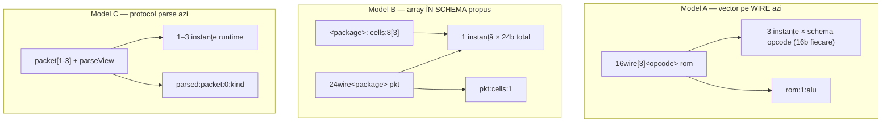
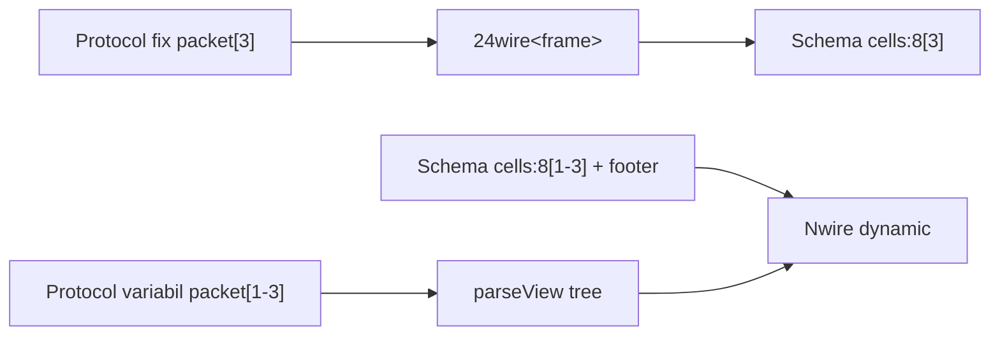

# Plan: `field:W[N]` și `field:W[N,M]` în semantic schema

## Context și numerotare

| Etichetă | Semnificație |
|----------|--------------|
| **Faza 6** (umbrelă) | Același nume ca în [`protocol_section_repetition.plan.md`](protocol_section_repetition.plan.md) §8 — **acest fișier = detalierea completă** a Fazei 6 |
| **Faza 6.0 … 6.6** | Sub-faze **ale acestui plan** — ordine de implementare |
| **Faza 7a**, **7b** | Sub-faze **livrate** ✅ — vezi § Faza 7 |
| **Faza 7++** (grouped schema literals) | **Livrată ✅** — [`grouped_schema_literals.plan.md`](grouped_schema_literals.plan.md) |
| **Faza 7+** (range variabil) | **↗** [`schema_variable_range.plan.md`](schema_variable_range.plan.md) — plan dedicat |
| **7b+** (bridge protocol → schema) | Amânat |
| **↗ alt plan** | Referință la fază din alt document; nu se implementează aici |

### Legături cu alte planuri

| Fază externă | Plan sursă | Raport cu acest plan |
|--------------|------------|----------------------|
| Faza 5 protocol (5a–5c) | [`protocol_section_repetition.plan.md`](protocol_section_repetition.plan.md) | **Prerequisit îndeplinit** ✅ — repetare secțiuni + parseView; **nu se modifică** în Faza 6 |
| Faza 8–9 protocol | același plan | **Independent** — literali protocol + JSON subset; deja livrate |
| Doc split protocol | [`protocol_section_repetition.plan.md`](protocol_section_repetition.plan.md) | **Livrată ✅** — hub ~236 linii + `protocol-assemble.md` + `protocol-lut.md`; parse/tentative/repeat/json deja existente |
| Faza 7++ grouped literals | [`grouped_schema_literals.plan.md`](grouped_schema_literals.plan.md) | **Livrată ✅** — `{ elem0 } { elem1 }<schema>`; teste 2308–2318 |
| Faza 7+ range variabil | [`schema_variable_range.plan.md`](schema_variable_range.plan.md) | **Faza 1 ✅ livrată**; **Faza 2.0–2.4** (matrice 2D, slice, scalar count) |

### Ce înseamnă propoziția despre ordine

> *Faza 6 după ce Faza 5 protocol e stabilă (deja e) — nu depinde de protocol, poate merge în paralel cu doc split rămas.*

| Fragment | Înțeles |
|----------|---------|
| **„după Faza 5 protocol”** | Notă de **secvențiere istorică** din planul protocol: array-urile în schema erau planificate după repetarea de secțiuni. Faza 5 e **deja livrată** → putem începe Faza 6.0 oricând. |
| **„nu depinde de protocol”** | Implementarea `field:W[N]` atinge **parser schema**, **semantic-schemas**, **interpreter** — **zero** schimbări obligatorii în `protocol-assembler.js`. Protocolul variabil (`packet[1-3]`) rămâne pe parseView. |
| **„în paralel cu doc split”** | Restul de documentație protocol (pagini separate rămase) e **muncă de doc** din alt plan; **nu trebuie terminată** înainte de codul Fazei 6.x. |

---

## Verdict scurt

**Da, direcția e bună** — `field:8[3]` și `field:8[2,3]` completează modelul existent, nu îl înlocuiesc.

**La protocol:** ajută pentru layout-uri **fixe** (compile-time); **nu înlocuiește** `packet[1-3]` / `parseView` pentru forme **variabile**. Nu se încurcă dacă păstrăm straturile separate (vezi diagrama de mai jos).

---

## Două modele — nu le amesteca



| Model | Declarație | Lățime | Acces tipic |
|-------|------------|--------|-------------|
| **A** (există) | `16wire[3]<opcode>` | 3×16 = 48b | `rom:1:alu` |
| **B** (nou) | `24wire<package>` + `cells:8[3]` | 24b într-un record | `pkt:cells:1` |
| **C** (există) | `mode: parse` + `packet[1-3]` | dinamic | `parsed:packet:0:kind` |

**Echivalență de layout (nu de tip):** `8wire[3]<cell>` cu `<cell>: x:8` ≈ același bitstream ca `24wire<buf>` cu `<buf>: x:8[3]` — dar semantica de acces/`show` diferă (3 obiecte schema vs. 1 obiect cu câmp indexat).

---

## Ce există azi (baseline)

- Parser schema: doar `name:width`, `name:<nested>`, merge `<ref>` — vezi [`parseSchemaDecl()`](v0_3_2/core/parser.js) l.170–173.
- Rezolvare: [`semantic-schemas.js`](v0_3_2/core/semantic-schemas.js) — `leaf` / `nested` / `merge`, `leafPaths` cu path plat `['alu']`.
- Vector/matrix pe **wire**: `parseTensorShapeSuffix()` — `[3]` = vector (rows=1, cols=3), `[2,3]` = matrice — [`parser.js`](v0_3_2/core/parser.js) l.441–471.
- Acces: `grid:0:1:jump` = indici **wire** apoi câmp; documentat în [`semantic-schemas.md`](v0_3_2/doc/semantic-schemas.md) § Vectors and matrices.
- Anticipat în plan protocol: Faza 6 acolo = **acest plan** (detaliat mai jos).

---

## Sintaxă propusă (aliniată la wire)

**`W` înainte de `[` = același lucru ca `W` în `Wwire`** — lățimea **unui element** (slot/celulă), nu a întregului tensor.

| Declarație | `W` (elementWidth) | Formă | total biți |
|------------|-------------------|-------|------------|
| `16wire[2,3]<opcode> grid` | **16** pe wire | 2×3 sloturi | 16×2×3 = **96** |
| `grid:16[2,3]` în `<package>:` | **16** pe câmp | 2×3 celule în record | 16×2×3 = **96** |
| `8wire[3]<cell>` | **8** | vector 3 | 24 |
| `cells:8[3]` în schema | **8** | vector 3 | 24 |

```logts
<package>:
    header: 16
    cells: 8[3]       # vector: 3 × 8b = 24b în record
    grid: 16[2,3]      # matrice 2×3 × 16b = 96b — echivalent conceptual la 16wire[2,3]
:
```

| Formă | Semnificație | totalWidth câmp |
|-------|--------------|-----------------|
| `x:8` | leaf scalar (ca azi) | 8 |
| `x:8[3]` | 3 elemente × 8b | 24 |
| `x:16[2,3]` | matrice 2×3 × 16b | 96 |

**Reguli (recomandate):**

- Dimensiuni **constante** `>= 1` (DEC/BIN), la fel ca wire `[N]`.
- **MSB-left**, elemente consecutive în ordinea index (0..N-1; rând-major pentru matrice) — consistent cu layout-ul wire.
- **v1: doar frunze** `field:W[N]` / `field:W[N,M]` — nu `<subschema>[N]` (→ **Faza 7+**).
- Eroare dacă `W*N` / `W*N*M` depășește limite rezonabile sau overflow la `totalWidth`.

---

## Acces câmpuri (path colon)

### Regulă unificată: aceiași indici ca pe wire (non-schema)

Indicii numerici după `:` folosesc **aceeași convenție** ca [`wire-vectors.md`](v0_3_2/doc/wire-vectors.md) / `resolveAtomWireSlice` — 0-based, rând-major, `:r:c` pentru matrice, `:i` pentru vector rank-1.

Diferența nu e *cum* numerăm, ci **la ce nivel** aplicăm tensorul:

| Nivel | Când | Exemplu |
|-------|------|---------|
| **Wire** | wire declarat `Wwire[R,C]` sau `Wwire[N]` | `grid:0:1:alu` pe `16wire[2,3]<opcode> grid` |
| **Schema array** | după segment identificator care e câmp `kind:'array'` | `pkt:grid:0:1` pe `96wire<package> pkt` cu `grid:16[2,3]` |

**Implementare (Faza 6.1–6.2):** la intrarea într-un nod `array`, delegare la aceeași logică de indexare ca wire tensor (`rows`, `cols`, `singleDim`, bounds check) — nu un algoritm paralel.

```logts
# Model A — indici wire, apoi câmpuri schema în fiecare slot
16wire[2,3]<opcode> grid
4wire x = grid:0:1:alu        # același :0:1 ca matrixA:0:1 pe wire

# Model B — câmp array în record; indici identici după numele câmpului
<package>:
    grid: 16[2,3]
:
96wire<package> pkt
16wire x = pkt:grid:0:1       # aceeași :0:1 — dar pe slice-ul câmpului grid (16b)
4wire c = pkt:cells:2         # vector: același :i ca vectorB:i
```

### Tabel path — consum secvențial

| Path | Wire | Rezultat |
|------|------|----------|
| `grid:0:1:alu` | `16wire[2,3]<opcode>` | slot wire (0,1) → câmp leaf `alu` în schema opcode |
| `pkt:grid:0:1` | `96wire<package>` scalar | câmp `grid` → celulă (0,1) → 16b leaf |
| `pkt:cells:2` | `48wire<package>` scalar | câmp `cells:8[3]` → element 2 → 8b |
| `pkt:0:1` | `48wire<package>` scalar | **eroare** — nu există câmpuri `0`/`1`; indicii wire nu se aplică pe wire scalar |
| `pktb:1:cells:1` | `48wire[2]<frame> pktb` | index wire **1** → al 2-lea frame → câmp `cells` → element **1** → 8b |
| `pktb:0:grid:1:0` | `48wire[2]<frame> pktb` | frame 0 → matrice `grid` → celulă (1,0) → 4b |

**Compunere Model A + B:** tensor pe wire **și** array în schema — indicii se consumă **în ordine**: mai întâi slotul wire (`:1` pe `48wire[2]`), apoi path schema (`cells:1`). Același mecanism ca `rom:1:alu` azi, extins cu câmpuri `array` în schema.

**Echivalență layout (frunză plată):** `16wire[2,3]` cu schema 16b anonimă ≈ un singur câmp `grid:16[2,3]` pe `96wire` — același bitstream; diferă doar dacă fiecare slot are sub-câmpuri (`<opcode>` cu `alu`, `jump` → rămâne model A sau **7+** `<schema>[N]`).

---

## Exemplu complet (referință — comportament planificat Faza 6.x)

> **Notă:** scriptul de mai jos descrie **ținta** după Fazele 6.0–6.2; nu rulează încă în codul curent.

### Schema + wire

```logts
<frame>:
    tag: 8              # scalar, 8b
    cells: 8[3]         # vector 3×8b = 24b
    grid: 4[2,2]        # matrice 2×2×4b = 16b
:                        # total schema = 8+24+16 = 48b

48wire<frame> pkt := 0
```

**Layout biți (MSB-left, rând-major pe `grid`):**

| Câmp | Interval biți | Lățime |
|------|---------------|--------|
| `tag` | 0–7 | 8 |
| `cells:0` | 8–15 | 8 |
| `cells:1` | 16–23 | 8 |
| `cells:2` | 24–31 | 8 |
| `grid:0:0` | 32–35 | 4 |
| `grid:0:1` | 36–39 | 4 |
| `grid:1:0` | 40–43 | 4 |
| `grid:1:1` | 44–47 | 4 |

### Inițializare (per câmp, slice, întreg)

```logts
# --- scalar ---
pkt:tag := \42                    # 00101010

# --- vector: per element (ca field scalar) ---
pkt:cells:0 := \15                # 00001111
pkt:cells:1 := \240               # 11110000
pkt:cells:2 := \170               # 10101010

# --- vector: slice întreg (Faza 6.3, ca 4wire[3] = ^FF0) ---
# pkt:cells = 00001111 11110000 10101010
# pkt:cells = ^0FF0AA                 # 24b concat

# --- matrice: per celulă ---
pkt:grid:0:0 := \5                  # 0101
pkt:grid:0:1 := \6                  # 0110
pkt:grid:1:0 := \15                 # 1111
pkt:grid:1:1 := \0                  # 0000

# --- matrice: slice (Faza 6.3) ---
# pkt:grid = 0101 0110 1111 0000
# pkt:grid = ^56F0                    # 16b concat

# --- record întreg ---
# pkt = ^2A0FF0AA56F0                 # 48b = tag + cells + grid (dacă valorile de mai sus)
```

### Citiri

```logts
8wire t = pkt:tag
8wire c1 = pkt:cells:1              # al 2-lea element vector
4wire g = pkt:grid:0:1              # celula rând 0, col 1
```

### `show` / `peek` / `probe` — format (decizie utilizator ✅, rev. 4)

**Regulă unificată (toate elementele indexate cu schema):** pe linia `:i` / `:r:c` → **valoare flat** (`:0 = … (Wbit)`); **dedesubt**, indentat → câmpurile schemei. **Nu** inline `alu=… jump=…` pe aceeași linie.

Se aplică la:
- vector/matrix wire + `<schema>` — ex. `show(rom)` pe `16wire[3]<opcode>`
- array în schema (6.x frunză = doar flat, fără sub-câmpuri)
- array de `<schema>` (7+), `show(pktb)`, `peek`/`probe` pe același path

| Tip element | Linia index | Dedesubt |
|-------------|-------------|----------|
| frunză `8[3]` (v1) | `:0 = 00001111 (8bit)` | nimic |
| wire `16wire[3]<opcode>` | `:0 = … (16bit)` flat | `alu`, `jump`, … |
| matrice `16wire[2,2]<opcode>` | `:0:0 = … (16bit)` flat | câmpuri opcode indentate |
| `<cellSchema>[3]` (7+) | `:0 = … (16bit)` flat | câmpuri cellSchema |
| `48wire[2]<frame>` | `:0 = … (48bit)` flat | tree `<frame>` |

| Context | Header secțiune | Elemente | Footer |
|---------|-----------------|----------|--------|
| `show(pkt)` — array frunză | `cells` / `grid` | `:0 =` flat | nu |
| `show(pkt:cells)` frunză | `pkt:cells = … (24bit)` | `:0 =` flat | `has length [3]` |
| `show(pkt:cells)` 7+ schema | `pkt:cells = … (48bit)` | `:0 =` flat + câmpuri indent | `has length [3]` |

**Scalar `48wire<frame> pkt` — `show(pkt)` (v1 frunză):**

```text
pkt (48wire<frame>)
  tag       = 00101010
  cells
    :0     = 00001111 (8bit)
    :1     = 11110000 (8bit)
    :2     = 10101010 (8bit)
  grid
    :0:0   = 0101 (4bit)
    :0:1   = 0110 (4bit)
    :1:0   = 1111 (4bit)
    :1:1   = 0000 (4bit)
```

**7+ — `cells: <cellSchema>[3]` în `show(pkt)`:**

```text
pkt (…wire<frame>)
  cells
    :0     = 0101011011110000 (16bit)
      alu     = 0101
      jump    = 0
      …
    :1     = 0000000111110001 (16bit)
      alu     = 0000
      jump    = 1
      …
```

**`show(pkt:cells)` — frunză (v1):** ca wire `8wire[3]`:

```text
pkt:cells = 000011111111000010101010 (24bit)
:0 = 00001111 (8bit)
:1 = 11110000 (8bit)
:2 = 10101010 (8bit)
pkt:cells has length [3]
```

**`show(pkt:cells)` — array de schema (7+):**

```text
pkt:cells = … (48bit)
:0 = 0101011011110000 (16bit)
    alu     = 0101
    jump    = 0
:1 = … (16bit)
    alu     = …
:2 = … (16bit)
    …
pkt:cells has length [3]
```

**`show(pkt:grid)`** — frunză matrice (v1): ca `4wire[2,2]` — doar `:0:0 =` flat, fără sub-câmpuri.

**`show(pkt:cells:1)`** — path la o frunză sau la un element-schema (fără linie `:1` de container):

```text
# v1 frunză:
pkt:cells:1 = 11110000 (8bit)

# element / slot cu schema (ca show(rom:1)):
pkt:cells:1 (16wire<cellSchema>)
  alu     = 0101
  jump    = 0
```

**`show(rom)` pe `16wire[3]<opcode>`** — **același format** (rev. 4, înlocuiește inline azi):

```text
rom (16wire[3]<opcode>)
:0 = 0000000000000000 (16bit)
    alu     = 0000
    jump    = 0
    write   = 0
    cycles  = 00
    reserved= 00000000
:1 = 0000010100000011 (16bit)
    alu     = 0101
    jump    = 0
    write   = 0
    cycles  = 11
    reserved= 00000000
:2 = … (16bit)
    …
rom has length [3]
```

**`show(rom:1)`** — doar tree schema (fără prefix `:1 =` flat), ca înainte.

**`show(grid)` pe `16wire[2,2]<opcode>`** — celule matrice, flat + tree per celulă:

```text
grid (16wire[2,2]<opcode>)
:0:0 = … (16bit)
    alu     = …
    …
:0:1 = … (16bit)
    …
grid has shape [2,2]
```

**`show(pktb)` pe `48wire[2]<frame>`:**

```text
pktb (48wire[2]<frame>)
:0 = … (48bit)
  tag     = 00101010
  cells
    :0   = 00001111 (8bit)
    …
  grid
    :0:0 = 0101 (4bit)
    …
:1 = … (48bit)
  tag     = …
  …
pktb has length [2]
```

**Implementare (Faza 6.2):**

1. **Unificare wire vector/matrix + schema:** refactor `_formatVectorShowLines` / `_formatVectorElementLine` — în loc de `_formatElementValueWithSchema` inline pe o linie, emite `:i = flat (Wbit)` apoi `appendSchemaShowTreeLines` indentat (helper comun `emitIndexedSchemaElement`).
2. `appendSchemaShowTreeLines`: nod `array` frunză → `:i =` flat.
3. Nod `array` de schema (7+): `:i =` flat + sub-tree.
4. `show(pkt:cells)` / `show(pkt:grid)`: delegare wire-style + sub-tree când elementul are schema.
5. **`peek` / `probe`:** același layout ca `show` pe path indexat (fără inline).
6. Footer `has length` / `has shape` doar la `show` pe slice / wire vector integral.

**Regresie doc/teste (6.5–6.6):** actualizare teste **2253**, **2254** (vector show inline), alte assert-uri `:1 = alu=0101`; [`semantic-schemas.md`](v0_3_2/doc/semantic-schemas.md) § Vectors — descriere flat+tree; Wave Listen **inline** pe vector schema: fie păstrează compact flat pe o linie, fie tree — de aliniat la `show` (preferat: expand = tree, inline = flat sumar pe `:i` fără câmpuri amestecate).

**Slice rând/coloană (Faza 7a):** `show(pkt:grid:0)` / `show(pkt:grid::1)` — paritate wire; rând/col cu `:r:c =` flat; footer `pkt:grid has shape [R,C]`.

### Array de **frunză** vs array de **schema** (7+)

| Declarație | Faza | `:i` în show |
|------------|------|--------------|
| `cells: 8[3]` | **6.x** | doar flat `(8bit)` |
| `cells: <cellSchema>[3]` | **7+** | flat `(Wbit)` + câmpuri schema indentate dedesubt |

**Regulă show:** container → indici **wire**; element cu schema → **flat pe linia index** + **tree schema dedesubt** (rev. 3).

Sintaxă declarație 7+ (de detaliat): `cells: <cellSchema>[3]`.

### `show` — alte exemple punctuale

### Comparație cu Model A (wire tensor — există azi)

Același layout 48b, dar 3 instanțe separate de schema pe wire vs un record:

```logts
16wire[3]<slot> bank := 0
bank:1:field := \5
show(bank)    # :1 = flat (16bit) + câmpuri schema dedesubt
```

Model B (`pkt:cells:1`) păstrează **aceiași indici** (`:1`), dar indicii sunt pe **câmpul** `cells`, nu pe wire.

### Model A + B compus — vector de record-uri cu array-uri în schema

Două frame-uri identice pe wire; acces combinat wire-index + array-index:

```logts
48wire[2]<frame> pktb := ^2A0FF0AA56F0 2A0FF0AA56F0
# 96b total = 2 × 48b; fiecare frame are tag + cells[3] + grid[2,2]

8wire x = pktb:1:cells:1           # frame 1, al 2-lea byte din cells
4wire y = pktb:0:grid:1:0          # frame 0, grid celula (1,0)

show(pktb)                         # :0/:1 flat + tree frame dedesubt (ca show(rom))
show(pktb:1)                       # breakdown complet al frame-ului 1 (tag, cells:0..2, grid:…)
show(pktb:1:cells:1)               # doar 8b — al 2-lea element cells din frame 1
```

**`show(pktb:1:cells:1)`** — output așteptat (dacă ambele frame-uri = valorile din exemplul scalar):

```text
pktb:1:cells:1 (8wire)
  = 11110000
```

**`show(pktb)`** — ambele instanțe: vezi format ierarhic de mai sus (`:0` / `:1` + tree schema dedesubt).

---

## Decizii confirmate vs deschise

### ✅ Confirmat (gata de implementare)

| Subiect | Decizie |
|---------|---------|
| Sintaxă `field:W[N]` / `W[N,M]` | `W` = elementWidth (= `Wwire`) |
| Indici | 0-based; aceeași logică ca wire tensor; compunere `pktb:1:cells:1` |
| v1 scope | Doar frunze array; fără `{ cells=[...] }`; literali wire pe slice (6.3) |
| `show` | **Unificat rev. 4:** `:i =` flat + câmpuri schema indentate — wire `rom`, array schema, `pktb` |
| Wire parse + schema | **Da** — vezi § mai jos |
| Index, chip, wave | Confirmat în conversație |
| **Faza 6.x livrată** | Frunze `W[N]` / `W[N,M]`; literali concat pe slice; 1757 teste ✅ |

### ✅ Confirmat Faza 7b — `field:<schema>[N]` / `[R,C]` (conversație 2026-07-13)

| Subiect | Decizie |
|---------|---------|
| **A. Sintaxă declarație** | `slots: <opcode>[3]` — același `<schema>` ca la nested scalar `meta:<flags>` |
| **B. Dimensiuni** | Vector **`[N]`** și matrice **`[R,C]`** — ambele în 7b |
| **C. Slice întreg** | `pkt:slots = ^…` sau `a + b + c` — **da** (aceeași lățime `N × subSchema.totalWidth`) |
| **C. Literal structurat pe slice** | **Livrat în 7++** ✅ — grouped `{ alu=\5 } { cycles=\3 }<opcode>` (nu `{ slots=[…] }`); vezi [`grouped_schema_literals.plan.md`](grouped_schema_literals.plan.md) |
| **C. Paritate Model A** | `16wire[2]<opcode> bank = ^…` / `s0 + s1` / `bank:0 = { … }<opcode>` — **aceleași reguli** pentru `pkt:slots` în 7b |
| **D. Erori** | La fel ca azi — mesaj + sugestie path (`use pkt:slots:1:alu`) |
| **E. Regresie mixed** | Exemplu obligatoriu: `tag:8` + `slots:<opcode>[2]` + `meta:<flags>` pe același `<frame>` |
| **Show per element** | `:i = flat (Wbit)` + tree sub-schemă dedesubt (rev. 4) |
| **Faza 7b livrată** | `slots:<opcode>[N]` / `[R,C]`; teste 2296–2303; **1771 teste** ✅ |

### ✅ Confirmat Faza 7a — slice rând/coloană (conversație 2026-07-13)

| Subiect | Decizie |
|---------|---------|
| **Sintaxă** | `pkt:grid:0` (rând), `pkt:grid::1` (coloană) — dublu `:` ca wire `matrixA::1` |
| **Scope** | **read + assign + show** pe ambele (rând și coloană) |
| **Show** | Același layout ca wire matrix slice: header flat pe slice, linii `:r:c = …` per celulă, footer `has shape` |
| **Index dinamic** | **Da** — `pkt:grid:(rowIdx)`, `pkt:grid::(colIdx)` — paritate wire `(index)` |
| **Ordine path** | `field:row:col:subfield` — ca wire matrix + schema; ex. `pkt:tiles:0:1:alu` (7b) |
| **Footer show** | `pkt:grid has shape [R,C]` — **forma părinte** a matricei (ca `show(matrixA:0)` → `matrixA has shape [2,2]`), nu doar slice-ul |
| **Ordine fază** | **7a înainte de 7b** |

**Exemple țintă (`grid:4[2,2]`):**

```logts
pkt:grid:0 = 0101 + 0110          # assign rând (8b)
pkt:grid::1 = 0110 + 1111         # assign coloană (8b, non-contiguu)
4wire c = pkt:grid:0:1
12wire col = pkt:grid::1
show(pkt:grid:0)
show(pkt:grid::1)
```

**Show așteptat (valori exemplu):**

```text
pkt:grid:0 = 01010110 (8bit)
:0:0 = 0101 (4bit)
:0:1 = 0110 (4bit)
pkt:grid has shape [2,2]

pkt:grid::1 = 01101111 (8bit)
:0:1 = 0110 (4bit)
:1:1 = 1111 (4bit)
pkt:grid has shape [2,2]
```

**Compunere wire + schema:** `pktb:1:grid::0` — index wire, apoi câmp array, apoi coloană.

### Wire protocol parse + schema array (opțiunea A — explicație)

Două mecanisme **paralele** pe același wire, nu se înlocuiesc:

| Mecanism | Path exemplu | Ce navighează |
|----------|--------------|---------------|
| **parseView** | `parsed:packet:0:kind` | arborele **protocol** (secțiuni repetate, choice) — deja există |
| **schemaRef** | `parsed:cells:1` | layout-ul **bit fix** al schemei `<frame>` pe întregul wire |

**Când merge `parsed:cells:1` (schema path):**

1. Wire-ul are `schemaRef` (ex. `<frame>`).
2. Lățimea wire-ului = `schema.totalWidth` (ex. 48b) — blob **fix**, nu variabil.
3. Biții de la `cells:1` sunt la offset-ul calculat din schema (ca pe orice `48wire<frame>`).

```logts
# Protocol cu output fix 48b → același frame ca în exemple
48wire<frame> parsed =: .fixedFrameProto { … }

parsed:cells:1 := \5          # schema path — OK dacă rezultatul e 48b
parsed:packet:0:field         # parseView — OK dacă protocolul definește packet[…]
```

**Când NU merge:** protocol variabil (`packet[1-3]`) → lățime necunoscută la compile → schema cu `cells:8[3]` fix nu se potrivește; rămâne **doar parseView** (`parsed:packet:0:…`).

**Faza 6.x:** implementăm schema path pe orice wire cu `schemaRef` + lățime potrivită (inclusiv după `=: .proto`); test cu proto fix 48b + `parsed:cells:1`.

### ⏳ Amânat explicit

| Subiect | Unde |
|---------|------|
| Range variabil `field:W[min-max]` / `[min-]` | **↗** [`schema_variable_range.plan.md`](schema_variable_range.plan.md) |
| Literal structurat vector/matrix în `{ }<schema>` | **7++ livrat ✅** — grouped `{…}{…}<schema>`; [`grouped_schema_literals.plan.md`](grouped_schema_literals.plan.md) |
| Bridge protocol → schema tooling | **7b+** |
| Doc split protocol | plan protocol, paralel |

### 🔧 La implementare (fără blocaj)

- Limită numerică max `N`, `M` (overflow `totalWidth`) — alege prag rezonabil (ex. ca wire tensor 16384 biți total).

---


| Fază | Conținut | Fișiere principale | Risc |
|------|----------|-------------------|------|
| **6.0** | Parser + AST `kind: 'array'` | [`parser.js`](v0_3_2/core/parser.js) | mic |
| **6.1** | Rezolvare: nod array, `leafPaths`, `resolveSchemaView`, `totalWidth` | [`semantic-schemas.js`](v0_3_2/core/semantic-schemas.js) | mediu |
| **6.2** | Interpreter + **show unificat** (wire `rom` flat+tree, array în schema, peek/probe) | [`interpreter.js`](v0_3_2/core/interpreter.js), `semantic-schemas.js` | mediu |
| **6.3** | Literali wire-style pe slice array — **fără** `{ cells=[...] }` | interpreter + pipeline wire-literals | mediu |
| **6.4** | Validare wire ↔ schema (model A vs B) | semantic-schemas + interpreter | mic |
| **6.5** | Teste ~2180+ | [`test_suite.js`](v0_3_2/tests/test_suite.js) | mic |
| **6.6** | Documentație | [`semantic-schemas.md`](v0_3_2/doc/semantic-schemas.md) | mic |

**Ordine recomandată:** 6.0 → 6.1 → 6.2 → 6.3 → 6.4 → 6.5 → 6.6 (6.3 poate începe după 6.1 dacă assign-ul de bază e în 6.2).

---

### Faza 6.0 — parser + AST

**Fișier:** [`v0_3_2/core/parser.js`](v0_3_2/core/parser.js)

- După `width` (DEC/BIN), parse opțional `parseSchemaArraySuffix()` — copie adaptată din `parseTensorShapeSuffix` (fără prefix `wire`).
- AST câmp nou, ex. `{ kind: 'array', name, elementWidth, rows, cols, singleDim }`.

### Faza 6.1 — rezolvare schema

**Fișier:** [`v0_3_2/core/semantic-schemas.js`](v0_3_2/core/semantic-schemas.js)

- `buildResolvedSchema`: nod `kind: 'array'` în `structure`; expandare `leafPaths` cu path indexat:
  - vector: `cells` → `cells:0`, `cells:1`, …
  - matrix: `grid:0:0`, `grid:0:1`, …
- `totalWidth` schema += `elementWidth * count`.
- `resolveSchemaView`: recunoaște nod `array` în mijlocul path-ului; calculează `bitStart` = base + index * elementWidth (sau r*cols+c).

### Faza 6.2 — interpreter + show

**Fișier:** [`v0_3_2/core/interpreter.js`](v0_3_2/core/interpreter.js)

- `_resolveSchemaFieldAbsoluteRange`, assign/read `instr:cells:1` — folosește `resolveSchemaView` extins.
- `show` / `peek` / `probe`: breakdown pentru `cells[1]` sau linii `cells:0`, `cells:1` (similar parseView `packet[0]`).

### Faza 6.3 — literali: reutilizare wire (decizie utilizator)

**Respins explicit — nu implementăm:**

```logts
pkt = { cells=[\1, \2, \3] }<package>     # listă în schema literal
pkt = { grid=[[\1,\2], [\3,\4]] }<package> # matrice imbricată în { }
```

**Folosim aceleași forme ca la wire vector/matrix azi** ([`wire-literals.md`](v0_3_2/doc/wire-literals.md), teste `4wire[3] vectorA = ^FF0`):

| Țintă | Exemplu RHS | Lățime așteptată |
|-------|-------------|------------------|
| Wire vector (model A) | `4wire[3] v = ^FF0` | 3 × 4b = 12b |
| Wire vector, binar | `4wire[3] v = 0101 0011 1111` | concat pe elemente |
| Wire matrice | `4wire[2,2] m = ^1234` | 4 × 4b = 16b |
| Grupat + tag | `4wire[2] v = \1.5 \-1.5;q4p4` | 2 × 8b (q4p4) |
| Record întreg (model B) | `24wire<pkg> pkt = ^ABCDEF` | `schema.totalWidth` |
| **Câmp array ca slice** | `pkt:cells = ^ABC` sau `pkt:cells = 0101 0101 1111` | `W × N` (ex. 8×3=24) |
| Per-element (sub-câmp) | `pkt:cells:1 := \5` | `W` biți (ca field scalar azi) |

**Implementare (fără parser nou pentru `{ [...] }`):**

1. **`resolveSchemaView`** pe path fără index final (`pkt:cells`) → view `kind: 'array'`, `width = W×N`.
2. **Assign** la slice array: același pipeline ca assign pe wire de lățime `W×N`.
3. **Grupat + tag**: delegare la `groupedLiteralToBits` — număr atomi = `N` sau `rows×cols`.
4. **Schema literal `{ alu=\5 }`** rămâne doar scalar/nested (ca azi).

### Faza 6.4 — validare wire ↔ schema

| Declarație wire | Schema | Valid? |
|-----------------|--------|--------|
| `24wire<package>` | `cells:8[3]` + alte câmpuri → total 24+ | da |
| `8wire[3]<cell>` | `<cell>: x:8` (width 8) | da (model A, ca azi) |
| `8wire[3]<package>` | `cells:8[3]` (total 24) | **nu** — element width 8 ≠ schema 24 |
| `24wire<package>` | `cells:8[1-3]` | **nu** — variabil → **Faza 7+** |

Mesaj eroare explicit: *schema total width X vs wire element width Y*.

### Faza 6.5 — teste

**Teste** în [`test_suite.js`](v0_3_2/tests/test_suite.js) (ID-uri noi ~2180+):

1. `<t>: cell:8[3]` — parse + totalWidth 24
2. `24wire<t>` attach + `pkt:cell:2` read/write
3. `<m>: g:4[2,2]` — `pkt:g:1:0` access
4. Eroare `cell:8[3]` pe `8wire[3]<t>`
5. `show(pkt)` + `show(rom)` — format flat+tree (nu inline); actualizare **2253**, **2254**
6. **6.3:** `pkt:cells = ^...`; grouped `q4p4` pe `cells:4[2]`
7. Regresie comportament: `4wire[3] vectorA = ^FF0` neschimbat; `16wire[3]<opcode>` assign/read neschimbat

### Faza 6.6 — doc

[`semantic-schemas.md`](v0_3_2/doc/semantic-schemas.md):

- Secțiune „Array fields inside schema” (model B)
- **Rev. 4 show:** § Vectors — `show(rom)` flat+tree (nu inline); exemple `logts-play` actualizate
- Tabel **literali acceptați** vs **respins** (`{ cells=[...] }`)
- Link la [`wire-literals.md`](v0_3_2/doc/wire-literals.md) și [`protocol-repeat.md`](v0_3_2/doc/protocol-repeat.md) pentru variabil

---

## Faza 7 — următorul pas (design confirmat, neimplementat)

**Ordine:** **7a → 7b** (7a e incremental pe array-uri frunză din 6.x; 7b adaugă sub-scheme).

### Faza 7a — slice rând / coloană pe câmp array (punct 3) ✅ design închis

**Țintă:** paritate completă cu wire tensor (`matrixA:0`, `matrixA::1`, `matrixA:(i)`, `matrixA::(j)`).

| Path | Lățime slice | Stare după 6.x |
|------|--------------|----------------|
| `pkt:grid:0:1` | `W` (celulă) | ✅ |
| `pkt:grid:0` | `cols × W` (rând) | parțial — assign/show/footer de aliniat la wire |
| `pkt:grid::1` | `rows × W` (coloană) | ❌ parser `::` + `array_col` + scatter assign |
| `pkt:grid:(r)` / `pkt:grid::(c)` | ca mai sus | ❌ — include în 7a |
| `pktb:1:grid::0` | compunere wire + schema | ❌ — test regresie |

**Implementare:**

1. **Parser:** după nume câmp array în path, acceptă `:DEC` (rând) sau `::DEC` / `::(wire)` (coloană) înainte de eventual `:subfield` (7b).
2. **semantic-schemas:** `resolveArrayElementView` → `array_row` / `array_col`; `formatSchemaArrayColSliceShow` (simetric `formatSchemaArrayRowSliceShow`).
3. **interpreter:** assign coloană non-contiguu (reutilizare `scatterColumnBits` / logică `tensorSlice: 'col'`).
4. **Show footer:** `displayName` fără sufix slice + `has shape [R,C]` — **identic wire** (`matrixA has shape [2,2]` pe `show(matrixA:0)`).

**Literali slice (ca 6.3):** `pkt:grid:0 = 0101 + 0110`, `pkt:grid::1 = ^56F0` — concat pe lățimea slice-ului.

**Teste ~2190+:**

1. read/write `pkt:grid:0`, `pkt:grid::1`
2. assign rând + coloană (splice, nu corup restul recordului)
3. `show(pkt:grid:0)` + `show(pkt:grid::1)` — header, `:r:c`, footer shape
4. index dinamic `(idx)`
5. `pktb:1:grid:0:1` compunere
6. regresie wire `matrixA::1` neschimbat

### Faza 7b — array de sub-scheme `field:<schema>[N]` / `[R,C]` (punct 1)

**Declarație:**

```logts
<opcode>:
    alu:4
    jump:1
    write:1
    cycles:2
    reserved:8
:

<frame>:
    tag: 8
    slots: <opcode>[2]       # 2 × 16b = 32b
    tiles: <opcode>[2,2]     # 4 × 16b = 64b (opțional același release)
    meta: <flags>            # nested scalar — regresie E
:
```

**Acces:** `pkt:slots:1:alu`, `pkt:tiles:0:1:cycles` (**ordine `field:row:col:subfield`** — ca wire), compunere `pktb:1:slots:0:alu`.

**Inițializare (paritate Model A — confirmat):**

| Țintă | Forme acceptate | Respins în 7b |
|-------|-----------------|---------------|
| `16wire[2]<opcode> bank` | `bank = ^…`, `s0 + s1`, `bank:0 = { alu=\5 }<opcode>`, `bank:1:alu := \5` | `{ bank=[…] }` |
| `pkt:slots` (slice întreg) | `pkt:slots = ^…`, `pkt:slots = a + b` | `{ slots=[…] }<frame>` |
| Per element | `pkt:slots:1 = { cycles=\3 alu=\5 }<opcode>`, `pkt:slots:1:alu := \5` | — |

**Implementare:**

1. **Parser:** după `<schema>`, `parseSchemaArraySuffix()` — `kind: 'schema_array'`, `elementRef`, `rows`, `cols`.
2. **semantic-schemas:** nod `array` cu `elementSchema` (resolved); `leafPaths` → `slots.0.alu`, …; `elementWidth = subSchema.totalWidth`.
3. **Show:** `appendSchemaArrayElementLines(..., subSchema)` — hook deja pregătit în cod.
4. **Assign slice:** pipeline lățime `N × elementWidth` (ca 6.3 pe frunză).

**Teste 2296–2303:** parse width, read/write câmpuri, slice concat, literal pe element, show flat+tree, matrice `tiles`, regresie mixed `tag`+`slots`+`meta`, echivalență layout cu `16wire[2]<opcode>`. **1771 teste ✅**

### Faze în alte planuri

| Fază | Plan | Status |
|------|------|--------|
| **7+** | [`schema_variable_range.plan.md`](schema_variable_range.plan.md) | **Faza 1 ✅**; **Faza 2.0–2.4** (matrice 2D, slice 7a, scalar count) |
| **7++** | [`grouped_schema_literals.plan.md`](grouped_schema_literals.plan.md) | **Livrat ✅** |
| **7b+** | (viitor) | Bridge protocol → schema |

**Nu implementăm în 6.x / 7a–7b:** mapare automată protocol variabil → schema; `parseTag`; `rest -footer`.

Detalii range variabil (package2, package3, `varArrayCounts`, fazare **1.0–1.5 ✅**, **2.0–2.4**): **↗** [`schema_variable_range.plan.md`](schema_variable_range.plan.md).

---

## Relația cu protocol — ajută sau încurcă?

### Ajută (layout fix)

| Protocol | Schema | Wire după parse |
|----------|--------|-----------------|
| `def cell: x 8b` + `cell[3]` în `out` | `cells:8[3]` | `24wire<frame>` dacă output = 3×8b fix |
| JSON `pairEntry*` cu N fix cunoscut | perechi ca `key:8[4]` (rar) | doar dacă N e fix la compile |

Flux manual rezonabil:

```logts
# protocol produce blob; dacă știi că sunt exact 3 celule de 8b:
24wire<frame> parsed =: .myProto { data = pkt }
4wire k1 = parsed:cells:0
```

### Nu ajută / nu înlocuiește (variabil)

| Protocol | De ce schema fixă nu merge |
|----------|---------------------------|
| `packet[1-3]` | 1–3 instanțe → lățime variabilă |
| `pairEntry*` | număr perechi necunoscut la compile |
| `parseView` indexat | sursa de adevăr runtime deja există |

**Nu se încurcă** dacă documentăm:

- **Protocol variabil** → `parseView` + `parsed:section:N:field` (↗ Faza 5 protocol, **implementat**).
- **Schema fixă** → `field:W[N]` (Faza 6.x, **acest plan**).
- **Variabil în schema** → **↗** [`schema_variable_range.plan.md`](schema_variable_range.plan.md) (Faza 7+).



---

## Riscuri de clarificat în implementare

1. **Două niveluri de tensor în același path** — `grid:0:1:alu` (wire) vs `pkt:grid:0:1` (schema). **Mitigare:** consum secvențial + reutilizare reguli wire; indici numerici **la început** doar dacă wire-ul are `tensor`/`vector` în declarație; indici **după nume de câmp `array`** folosesc aceeași logică `resolveAtomWireSlice`. v1 fără `<schema>[N]` pe wire + array imbricat simultan.
2. **Index 0-based** — ca wire vectors și parseView ✅ confirmat.
3. **Chip/internal wires** — același `schemaRef` ✅ confirmat; test similar 2241 după 6.2.
4. **Wave listen / show tags** — `show(w; auto)` pe array field ✅ confirmat; extinde `formatSchemaShow`.

---

## Concluzie

- **`field:W[N]` și `field:W[N,M]`** — da, merită implementat; completează modelul A (vector pe wire) cu modelul B (array în record).
- **Protocol:** nu blochează și nu dublează parseView; **ajută** doar unde layout-ul e **fix**; pentru JSON/repeat variabil rămâne parseView.
- **Faza 6.0–6.6:** livrată ✅ — frunze `W[N]` / `W[N,M]`.
- **Faza 7a:** slice rând/coloană ✅ design închis — `pkt:grid:0`, `pkt:grid::1`, show/assign, index dinamic, footer `has shape [R,C]`.
- **Faza 7b:** `field:<schema>[N]` / `[R,C]` — **livrată** ✅; inițializare = concat / per-element / schema literal pe slot (ca `16wire[N]<schema>`); teste 2296–2303.
- **Faza 7++:** grouped schema literals ✅ — [`grouped_schema_literals.plan.md`](grouped_schema_literals.plan.md).
- **Faza 7+:** range variabil — plan dedicat [`schema_variable_range.plan.md`](schema_variable_range.plan.md).
