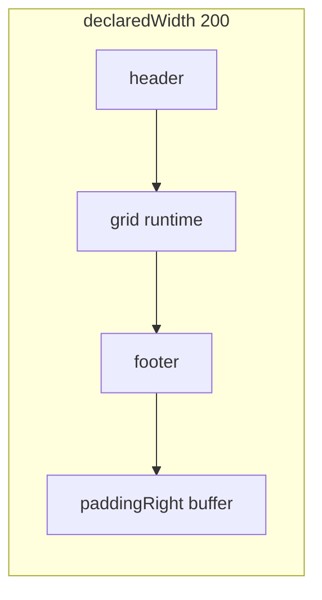

# Plan: Schema frame padding + resize grid (Faza 2.5)

## Legături cu planurile existente

| Plan | Relație |
|------|---------|
| [`schema_variable_range.plan.md`](schema_variable_range.plan.md) | **Model D**, Convenția A — **revizuim** § padding cu schema |
| [`schema_field_arrays.plan.md`](schema_field_arrays.plan.md) | 7b `grid: <cell>[R,C]` — cazul reproducerii |
| [`schema_protocol_bridge.plan.md`](schema_protocol_bridge.plan.md) | Același model **cadru + buffer** reutilizabil după 2.5 |

**Numerotare:** **Faza 2.5** (post 2.3, înainte de 2.4 opțional / 7c bridge).

---

## Decizii confirmate (utilizator)

### D1 — Model **buffer** (`:= 0` pe `200wire<schema>` variabil)

**Model mental confirmat:**

```text
declaredWidth (200) = schemaUsedWidth (runtime) + paddingRight (buffer)
```

| Aspect | Regulă |
|--------|--------|
| **Buffer** | `paddingRight = declaredWidth − schemaUsedWidth`; există când surplus **≥ 1 bit** |
| **La `:= 0`** | Wire = zerouri; **schemaUsedWidth = `minWidth`** (layout minim din declarație); **buffer = 200 − minWidth** de la început — nu așteptăm primul assign pe grid |
| **Grow/shrink** | Doar pe **scheme variabile** (`hasVarArray`): grid/count crește → ia biți din buffer; scade → biți eliberați revin în buffer |
| **Schema fixă** | `schemaUsedWidth` constant; buffer **static** (nimic nu schimbă lungimea payload-ului schema) |

**Exemplu** `200wire<frameVarGrid>` cu `grid:<cell8>[1-3,2]`, header/footer 2b:

- `minWidth` ≈ 2 + 1×2×8 + 2 = 12 (min grid 1×2)
- La `pkt := 0`: `paddingRightWidth = 188`, payload schema = 12b (toate zero, layout minim)
- După `pkt:grid = [2,2]{…}`: `schemaUsedWidth` = 2+32+2 = 36; `paddingRightWidth` = 164

### D2 — `show(pkt)` și **count**

**Clarificare** față de întrebarea anterioară („fără count”):

- **Azi în cod:** `show(pkt:grid)` fără niciun assign care setează grid → `varArrayCounts` gol → eroare *„no runtime count”*.
- **După orice init cu valori** (literal `{… grid=[2,2]…}`, sau `pkt:grid = …`) → **count există mereu**; `show(pkt)` / `show(pkt; u8)` afișează layout complet + buffer.

**Regulă planificată:**

| Stare wire | `show(pkt)` |
|------------|-------------|
| Doar `:= 0` (fără assign pe câmpuri variabile) | Layout **minWidth** + `has length [min]` pe grid + linie **`paddingRight`** (buffer maxim) — **nu** eroare |
| După init / assign cu shape | Layout la **count runtime** + `paddingRight` recalculat |
| `show(pkt:grid)` înainte de count | **Eroare** (ca azi) — acces pe slice cere count explicit |

**Permitem fix `[3,2]` pe `200wire`:** da — payload fix 96b + buffer 104b, fără grow/shrink (D1).

---

## Problema raportată (confirmată în cod)

### Comportament observat

| Scenariu | Rezultat azi | Așteptat |
|----------|--------------|----------|
| `36wire` + `grid:[2-3,2]`, assign `[3,2]` | Fără eroare, `show` nemodificat | **Eroare** (wire strâns, fără buffer) |
| `[2,2]` → valori noi (count egal) | OK | OK |
| `36wire` + shrink `[1,2]` | Silent / nemodificat | **Eroare** sau relayout (doar cu buffer) |
| `200wire`, `show(pkt)` după init | Eroare max vs 200 | Tree + **paddingRight** |

### Cauza root

[`_tryAssignVarArraySchemaField`](../../v0_3_2/core/interpreter.js) — splice `substring(0,off)+rhs+substring(off+width)` presupune **count constant**. La schimbare count: date stale, footer greșit, fără validare `newUsed <= declaredWidth`.

---

## Decizie de design: Schema frame + buffer



### Reguli

| Regulă | Detaliu |
|--------|---------|
| **Cadru** | `declaredWidth` = slot rezervat (ex. 200) |
| **Payload schema** | `schemaUsedWidth` = sum(câmpuri la count runtime sau **minWidth** după `:= 0`) |
| **Buffer** | `paddingRightWidth = declaredWidth − schemaUsedWidth` (≥ 1) |
| **`=:`** | `[payload bit 0][paddingRight]` |
| **`:=`** | `[paddingLeft][payload]` (simetric; rar) |
| **Inferență flat / count** | Doar pe payload schema, **exclude** buffer |
| **`=` strict** | Fără buffer; exact N biți |

### Revizuire Convenția A ([`schema_variable_range.plan.md`](schema_variable_range.plan.md))

- **Wire strâns** (`36wire` = exact layout curent): **fără buffer**; schimbare count → **eroare**
- **Wire cadru** (`200wire`): **cu buffer**; grow/shrink permis în limitele bufferului

---

## Resize grid (grow / shrink)

### Wire cadru (cu buffer)

| Tranziție | Comportament |
|-----------|--------------|
| `[2,2]` → `[3,2]` | `schemaUsedWidth` ↑; biți din **paddingRight**; footer relocat |
| `[2,2]` → `[1,2]` | `schemaUsedWidth` ↓; surplus → **paddingRight** |
| Grow, buffer insuficient | Eroare clară |

### Wire strâns (fără buffer)

| Tranziție | Comportament |
|-----------|--------------|
| Count diferit | **Eroare** — nu silent fail |
| Count egal | Splice (fast path) |

### Algoritm assign

1. `oldCounts` / `newCounts` din RHS + shape
2. `newUsed = totalRuntimeWidth(schema, newCounts)`
3. Dacă `newUsed > declaredWidth` → throw
4. Dacă count schimbat → **rebuild** (serialize câmpuri, recalc `paddingRightWidth`)
5. Count egal → splice segment

### Assign explicit pe `pkt:grid` (IN scope 2.5)

Orice assign **direct pe câmpul variabil** `pkt:grid` folosește **același** rebuild + buffer ca literalul cu shape — indiferent de forma RHS:

| RHS | Count / lungime | Grow/shrink (wire cadru) |
|-----|-----------------|---------------------------|
| `pkt:grid = [3,2]{ … }<cell8>` | Din shape `[R,C]` + elemente | Da |
| `pkt:grid = ^AABBCCDD` (flat) | Din `bitLen / elementWidth` (matrice: shape obligatoriu sau inferență validă) | Da, dacă lungimea diferă |
| `pkt:grid = .myProto { … }` | Din lungimea blob-ului proto evaluat pe slice | Da, dacă proto dă altă lungime |

**Exemplu:**

```logts
200wire<frame> pkt := 0
pkt:grid = [2,2]{ v=\1 … }<cell8>     # 32b grid → buffer 164b
pkt:grid = .tokenProto { data = x }   # proto 48b → grow din buffer (dacă încape)
pkt:grid = ^001122334455667788        # flat 48b → același tratament
```

**Notă matrice:** pentru `grid:<sub>[Rmin-Rmax, C]`, flat/proto **fără** shape `[R,C]` rămâne supus regulilor de ambiguitate existente (eroare dacă nu se poate deduce rows×cols).

**Separat — plan 7c:** `pkt =: .proto { … }` pe **întreg** wire-ul (fără `:grid`) → sync count din parseView; **nu** e acoperit de 2.5.

---

## Faze

### Faza 2.5.0 — Fail loud (~1–2 zile)

- `totalRuntimeWidth()` + validare înainte de splice
- Teste **2429–2432** (36wire strâns → eroare la resize)
- Doc: count change pe wire strâns

### Faza 2.5.1 — Buffer + show (~3–4 zile)

- `paddingRightWidth` pe wire cu `schemaRef` + buffer ≥ 1
- La `:= 0`: `schemaUsedWidth = minWidth`, buffer = rest
- `validateSchemaWidthForShow`: permite `wireWidth > maxWidth` când există buffer
- `show`/`peek`/Wave Listen: tree + `paddingRight`
- Teste **2433–2437**

### Faza 2.5.2 — Resize + relayout (~3–5 zile)

- Rebuild la schimbare count; accounting buffer grow/shrink
- Același path pentru `pkt:grid = [R,C]{…}`, `pkt:grid = flat`, `pkt:grid = .proto {…}`
- Teste **2438–2442** (+ opțional: proto/flat pe `pkt:grid` cu lungime variabilă)

### Faza 2.5.3 — Consolidare

- Sync [`schema_variable_range.plan.md`](schema_variable_range.plan.md)
- Regresie 2368–2369

---

## Ce NU intră în 2.5

- **Resize fără assign explicit pe `pkt:grid`** — ex.: `pkt = ^…` sau `pkt =: .proto { … }` pe **tot** recordul (sync count pe wire întreg → plan **7c**, nu 2.5)
- Inferență automată de count doar din assign pe `header` / `footer` / alte câmpuri
- Convenția B — cancelled
- Bridge 7c — plan separat

---

## Criterii de done

1. Zero silent fail pe wire strâns + schimbare count
2. `200wire` + `:= 0` → `show(pkt)` cu layout min + buffer vizibil
3. Grow/shrink pe wire cadru cu buffer corect
4. ~1887 + teste noi verzi

**Estimare:** ~1.5–2 săptămâni.
