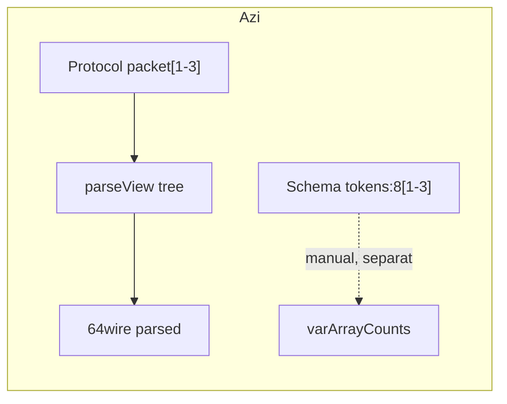
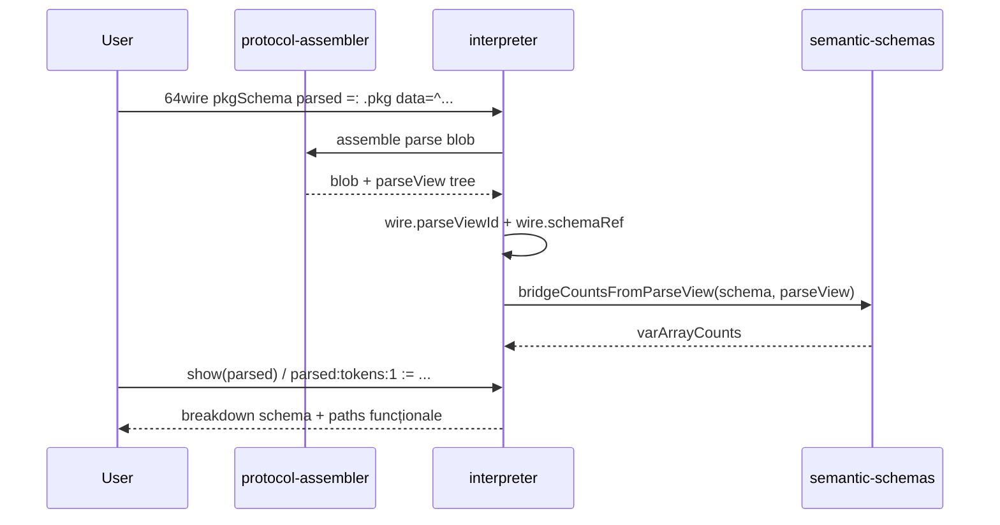

# Plan: Bridge protocol variabil → schema (Faza 7c)

## Legături cu planurile existente

| Plan | Relație |
|------|---------|
| [`schema_field_arrays.plan.md`](schema_field_arrays.plan.md) | Părinte conceptual — Fazele **6.x**, **7a**, **7b** ✅; acest plan înlocuiește itemul amânat **„7b+ bridge”** |
| [`schema_variable_range.plan.md`](schema_variable_range.plan.md) | **Model D** (`8[1-]`, countRef, flat vs structurat) ✅ — mecanismul `varArrayCounts` pe care îl alimentează bridge-ul |
| [`protocol_section_repetition.plan.md`](protocol_section_repetition.plan.md) | Sursa parseView — `packet[1-3]`, `pairEntry*`, §10.4 (schema variabilă amânată → acoperită acum de 7c) |
| [`wwidth_schema_parseview.plan.md`](wwidth_schema_parseview.plan.md) | Prioritate path: **parseView întâi**, apoi schema — păstrăm |
| [`grouped_schema_literals.plan.md`](grouped_schema_literals.plan.md) | Literali `{…}{…}<schema>` — compatibili post-bridge pe același wire |

**Numerotare:** **7c** = bridge runtime (MVP); **7c+** = codegen / choice (amânat).

---

## Context — ce lipsește azi

Două straturi **paralele**, fără legătură automată:



| Strat | Path | Stare |
|-------|------|-------|
| parseView | `parsed:packet:1:kind` | ✅ livrat (Faza 5 protocol) |
| schemaRef | `parsed:tokens:1` | ✅ pe wire cu `<schema>`, dar **count** vine din flat assign / assign per-câmp — **nu** din parseView |

După `=: .proto {…}` wire-ul primește `parseViewId` ([`interpreter.js` `_syncParseViewMeta`](../v0_3_2/core/interpreter.js)); `varArrayCounts` se populează doar via [`_syncVarArrayCountsFromFlatAssign`](../v0_3_2/core/interpreter.js) sau assign structurat pe câmp — **nu există** `_syncVarArrayCountsFromParseView`.

---

## Decizii MVP (din conversația anterioară)

| # | Decizie | Alegere |
|---|---------|---------|
| D1 | Scope prima livrare | **Nivel 2** — sync runtime parseView → schema + show/assign |
| D2 | Legătură schema ↔ protocol | **C2** — schema **explicită** la declarație wire; mapare câmpuri **by name** (protocol section → schema `var_array` / `schema_array`) |
| D3 | Repetări variabile | **`[min-max]` și `[N]` fix** din start; open `[1-]` / `*` când count vine din parseView |
| D4 | Sub-structuri repetate | **7b** — `packets:<cell>[1-3]`, nu flatten manual |
| D5 | Choice / tentative protocol | **Exclus din MVP** (F1) — doar secțiuni fixe + repetări |
| D6 | Prioritate path | **parseView întâi** ([`evalAtom` ~4235](../v0_3_2/core/interpreter.js)) — schema path pentru nume de câmp **schema**, protocol path pentru secțiuni indexate `section:N:field` |
| D7 | Cadru wire | **Convenția A** — `declaredWidth` (64b), pad sintetic la `=:` fără schema pe LHS; cu schema, payload la bit 0 ([`schema_variable_range.plan.md`](schema_variable_range.plan.md) § padding) |
| D8 | Erori sync | **Fail hard** — count parseView în afara `[min,max]` schema → eroare runtime clară |

**Amânat 7c+:** codegen `derive schema from .proto`; choice auto; `pairEntry*` fără mapare explicită; path unificat (Nivel 4).

---

## Țintă MVP — flux după 7c



### Sintaxă țintă (exemplu)

```logts
inline [protocol] .pkg:
  mode: parse
  parseView: tree
  def token: byte 8b
  out:
    token[1-3]
    footer 8b
  :

<pkgSchema>:
    tokens: 8[1-3]
    footer: 8
:

64wire<pkgSchema> parsed =: .pkg { data = ^AABBCCFF }
show(parsed)                    # tree schema + has length [N]
8wire t1 = parsed:tokens:1
parsed:tokens:0 := ^AA           # schema assign
parsed:token:0:byte              # parseView path (protocol) — încă funcțional
```

### Exemplu 7b (sub-schemă)

```logts
<cell>:
    alu: 4
    jump: 1
    write: 1
    cycles: 2

<frame>:
    packets: <cell>[1-3]
    footer: 8
:

64wire<frame> parsed =: .frameProto { ... }
# count packets din parseView.section "packet" → varArrayCounts.packets
parsed:packets:1:alu := \5
```

---

## Mapare protocol → schema (reguli 7c.0)

| Protocol (out) | Schema echivalentă | Count sync |
|----------------|-------------------|------------|
| `section[N]` fix | `field:W[N]` sau `field:<sub>[N]` | N constant |
| `section[min-max]` | `field:W[min-max]` | `#children` în parseView |
| `section[1-]` / `+` | `field:W[1-]` | `#children` |
| `section[0-]` / `*` | `field:W[0-]` | `#children` (0 permis) |
| câmp fix în def | câmp leaf fix | fără count |
| sub-def repetat | `<subSchema>[…]` (7b) | per secțiune |

**Mapare nume (C2):** implicit `protocol.out sectionName` → `schema.fieldName` cu **același identificator**. Dacă numele diferă (ex. protocol `token` vs schema `tokens`), MVP: **alias explicit** în schemă (7c.1):

```logts
<pkgSchema>:
    tokens: 8[1-3] from token    # propunere sintaxă — sau tabel în wire decl
```

Alternativă MVP mai simplă (fără alias): **nume identice obligatoriu** în prima fază; alias în 7c.2.

**Validare la sync:** pentru fiecare câmp `var_array` / `schema_array` mapat, `count` din parseView trebuie ∈ `[minCount, maxCount]`; suma layout + suffix fix ≤ `wire.declaredWidth`; `effectiveBitLen` = lățime payload parse (blobWidth din parseView).

---

## Faze de implementare

### Faza 7c.0 — Specificație + doc convenții (~1 zi)

- Fișier nou: [`v0_3_2/doc/schema-protocol-bridge.md`](../v0_3_2/doc/schema-protocol-bridge.md)
- Tabele mapare (secțiunea de mai sus), exemple fix + variabil + 7b
- Secțiune „când NU folosi bridge” (choice, JSON `pairEntry*`, protocol fără parseView tree)
- Link înapoi la [`protocol-repeat.md`](../v0_3_2/doc/protocol-repeat.md) și [`schema-variable-arrays.md`](../v0_3_2/doc/schema-variable-arrays.md)
- Actualizare one-liner în [`schema_field_arrays.plan.md`](schema_field_arrays.plan.md) §7b+ → „↗ schema_protocol_bridge.plan.md”

### Faza 7c.1 — Sync parseView → varArrayCounts (~3–5 zile)

**Fișier principal:** [`v0_3_2/core/semantic-schemas.js`](../v0_3_2/core/semantic-schemas.js)

- Funcție nouă `bridgeVarArrayCountsFromParseView(schema, parseView, options)`:
  - parcurge `schema.structure` pentru noduri `var_array` și `schema_array` (7b)
  - pentru fiecare, găsește nodul parseView cu același nume (sau alias)
  - `count = (node.children || []).filter(c => c.name === sectionName).length` — reutilizează helper din [`protocol-assembler.js`](../v0_3_2/core/protocol-assembler.js) (`findParseViewChildrenByName` pattern ~1874)
  - validează min/max; aruncă eroare explicită la fail hard (D8)

**Fișier:** [`v0_3_2/core/interpreter.js`](../v0_3_2/core/interpreter.js)

- Hook după protocol assign (`=: .proto` / `:=` cu protocol blob):
  - dacă wire are **și** `schemaRef` **și** `parseViewId` → apel bridge sync
  - `_mergeVarArrayCounts(wire, counts)`; set `wire.effectiveBitLen = parseView.blobWidth`
- Wire poate avea simultan `schemaRef` + `parseViewId` (validare nouă: `hasVarArray` sau `minWidth` compatibil cu declared width)
- Nu apela `_syncVarArrayCountsFromFlatAssign` când counts vin deja din bridge (flag sau prioritate)

**Fișier:** [`v0_3_2/core/parser.js`](../v0_3_2/core/parser.js) — doar dacă alias `from token` e în MVP; altfel amânat.

### Faza 7c.2 — Show / read / assign / Wave Listen (~3–4 zile)

- **`show` / `peek` / `probe`:** dacă wire are `schemaRef` + `varArrayCounts` populate (inclus post-bridge), breakdown schema ca azi — indiferent de parseView
- **Wave Listen `auto`:** deja folosește schemaRef ([`wave-listen-format.js`](../v0_3_2/ui/wave-listen-format.js)) — verificare cu wire parsat + counts din bridge
- **Read assign:** `parsed:tokens:1 := …` — folosește counts bridge (deja parțial în [`_tryAssignVarArraySchemaField`](../v0_3_2/core/interpreter.js))
- **parseView paths** rămân pentru debug: `parsed:token:0:byte` — prioritate parseView când path match parseView tree (D6)
- **paddingRight/Left sintetic:** păstrăm regula — doar când LHS **fără** `<schema>`; cu `<schema>` pe LHS, padding nu e expus ca nod sintetic

### Faza 7c.3 — Sub-scheme 7b + teste (~3–4 zile)

- Extinde bridge pentru `schema_array` (element = sub-schemă): count instanțe din parseView; show recursiv sub-câmpuri (hook existent `appendSchemaArrayElementLines`)
- **Teste noi** ~2420+ în [`test_suite.js`](../v0_3_2/tests/test_suite.js):

| ID | Scenariu | Mod |
|----|----------|-----|
| 2420 | protocol `token[2]` fix + schema `tokens:8[2]` — sync count | legacy + wave |
| 2421 | protocol `token[1-3]` variabil — count 2 din parseView | legacy + wave |
| 2422 | count 4 când max=3 — eroare fail hard | legacy |
| 2423 | show(parsed) breakdown schema după bridge | legacy + wave |
| 2424 | assign `parsed:tokens:0 := …` post-bridge | legacy + wave |
| 2425 | parseView path `parsed:token:0:byte` încă funcțional | legacy |
| 2426 | 7b `packets:<cell>[1-2]` + proto repetat | legacy + wave |
| 2427 | wire fără schema — regresie parseView-only | legacy |
| 2428 | Wave Listen auto pe wire bridged | UI smoke |

- Regresie: teste existente 2368–2369 (parseView padding **fără** schema) — neschimbate

### Faza 7c+ — Amânat (plan separat, fără dată)

| Item | Descriere |
|------|-----------|
| **7c+.1** | `derive schema <name> from .proto` — codegen definiție schema |
| **7c+.2** | Alias map în protocol (`schema: pkgSchema`) sau `bridgeMap:` |
| **7c+.3** | Choice — schema pe ramura câștigătoare only |
| **7c+.4** | `pairEntry*` / secțiuni nelimitate — sync count fără max declarativ |

---

## Fișiere atinse (rezumat)

| Fișier | Schimbări |
|--------|-----------|
| [`semantic-schemas.js`](../v0_3_2/core/semantic-schemas.js) | `bridgeVarArrayCountsFromParseView`, validare mapare |
| [`interpreter.js`](../v0_3_2/core/interpreter.js) | hook post-protocol assign; wire dual meta |
| [`protocol-assembler.js`](../v0_3_2/core/protocol-assembler.js) | export helper count children (readonly API) |
| [`test_suite.js`](../v0_3_2/tests/test_suite.js) | ~2420–2428 |
| [`schema-protocol-bridge.md`](../v0_3_2/doc/schema-protocol-bridge.md) | doc nou |
| [`semantic-schemas.md`](../v0_3_2/doc/semantic-schemas.md) | paragraf link bridge |
| Planuri existente | one-line cross-link 7b+ → acest plan |

---

## Ce NU intră în 7c

- Mapare automată fără `<schema>` explicit pe wire
- Înlocuirea parseView cu schema (Nivel 4)
- Parser protocol modificat să emită schema
- Convenția B (`effectiveBitLen`-only resolve) — rămâne amânată ([`schema_variable_range`](schema_variable_range.plan.md) 2+a cancelled)
- JSON `pairEntry*` end-to-end fără max count în schema

---

## Criterii de done MVP

1. `64wire<schema> parsed =: .proto {…}` populează `varArrayCounts` din parseView fără assign manual per-câmp
2. `show(parsed)` / Wave Listen auto afișează breakdown schema cu `has length [N]` corect
3. Assign/read pe path schema (`parsed:field:i`) funcționează cu counts bridge
4. Path parseView (`parsed:section:i:field`) rămâne funcțional (regresie)
5. Erori clare la count out-of-range sau nume nemapate
6. **~1887 + 9 teste** verzi; doc publicat

---

## Ordine recomandată

**7c.0 → 7c.1 → 7c.2 → 7c.3** (7c.2 poate începe parțial după primul test verde din 7c.1)

Estimare totală MVP: **~2 săptămâni**.
