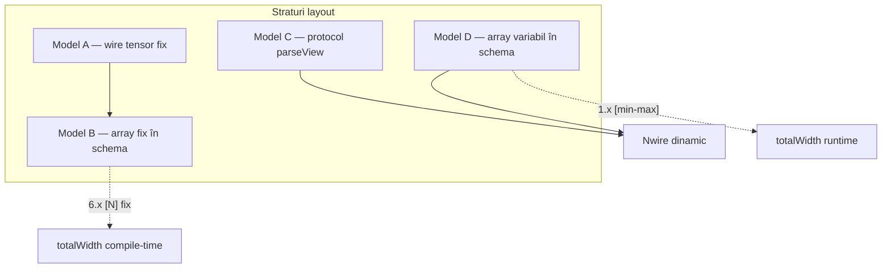
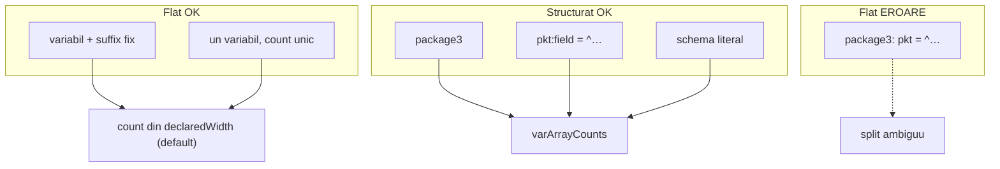
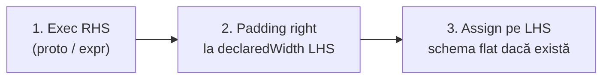
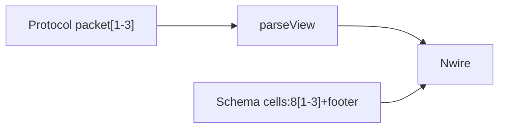

# Plan: Range variabil în semantic schema

**Status:** amânat explicit („la urmă”) — **design** activ; acest fișier e hub-ul pentru tot ce ține de range variabil în schema.

**Plan părinte:** `[schema_field_arrays.plan.md](schema_field_arrays.plan.md)` — Fazele 6.x / 7a / 7b (array fix) sunt **prerequisit** ✅.

---

## Numerotare (acest plan)


| Etichetă aici           | Semnificație                                         | Mapare externă                                                              |
| ----------------------- | ---------------------------------------------------- | --------------------------------------------------------------------------- |
| **Faza 1** (umbrelă)    | Tot acest plan                                       | **Faza 7+** în `[schema_field_arrays.plan.md](schema_field_arrays.plan.md)` |
| **Faza 1.0 … 1.10**     | Sub-faze **de implementare** — ordine 1.0 → 1.1 → …  | —                                                                           |
| **Faza 1+a … 1+z** | Subiecte **amânate** — design, fără ordine fixă | — |


> Spațiu pentru până la **1.10** dacă apare nevoia. Sub-fazele **1.0–1.5** acoperă MVP-ul propus.

**Planuri înrudite:**


| Plan                                                                         | Raport                                             |
| ---------------------------------------------------------------------------- | -------------------------------------------------- |
| `[schema_field_arrays.plan.md](schema_field_arrays.plan.md)`                 | Array fix `field:W[N]` / `<schema>[N]` — baza      |
| `[grouped_schema_literals.plan.md](grouped_schema_literals.plan.md)`         | Literali grouped — complement la assign structurat |
| `[protocol_section_repetition.plan.md](protocol_section_repetition.plan.md)` | Sintaxă `[1-3]` / `[1-]` la protocol — referință   |
| Bridge protocol → schema                                                     | **extern** — plan viitor 7b+ (nu 1.x)              |


---

## Verdict scurt

**Da** — `cells:8[1-3]` și `cells:8[1-]` completează modelul B (array fix din Faza 6) cu **Model D**: număr de elemente variabil la runtime, layout binar secvențial.

**Nu înlocuiește parseView** pentru choice, tentative, JSON `pairEntry`*, etc.

**Sintaxă:** aceeași ca protocol — `[1-3]`, `[1-]`, **nu** `..` (ex. respins `8[1..3]`).

---

## Model D — în peisajul existent




| Model              | Exemplu                   | `totalWidth`   | Acces                    |
| ------------------ | ------------------------- | -------------- | ------------------------ |
| **B** (6.x ✅)      | `cells:8[3]`              | 24 fix         | `pkt:cells:1`            |
| **D** (Faza 1)     | `cells:8[1-3]`            | min–max + rest | `pkt:cells:1` după count |
| **C** (protocol ✅) | `packet[1-3]` + parseView | dinamic        | `parsed:packet:0:kind`   |


---

## Sintaxă — aliniată protocol

Referință: `[protocol-repeat.md](../v0_3_2/doc/protocol-repeat.md)`.


| Declarație schema | Echivalent protocol  | Semnificație    |
| ----------------- | -------------------- | --------------- |
| `cells: 8[1-3]`   | `cell[1-3]`          | 1–3 × 8b        |
| `cells: 8[1-]`    | `cell+` / `cell[1-]` | ≥1, max deschis |
| `cells: 8[0-]`    | `cell*` / `cell[0-]` | 0..∞            |
| `cells: 8[3]`     | `cell[3]`            | fix (Faza 6)    |


Sugar opțional: `8+` → `8[1-]`, `8*` → `8[0-]` — paritate protocol ✅ **confirmat Faza 1.0**.

**Parser (Faza 1.0):** extinde `parseSchemaArraySuffix()` — `[min-max]` cu `min`/`max` DEC sau `-` (open bound), aceeași gramatică ca `parseSectionRepeat` din `protocol-assembler.js`.

**AST propus:** `kind: 'var_array'`, `elementWidth`, `minCount`, `maxCount` (`null` = ∞), plus variantă `schema_var_array` pentru `<opcode>[1-3]`.

---

## Cum știm unde se termină un câmp variabil?

### Cazul A — variabil + suffix fix ✅ (flat determinist)

```logts
<package2>:
    cells: 8[1-]
    footer: 8
:
```

**Analog protocol:** `cell[1-]` + `footer 8b`, sau `rest -8b` înainte de footer.

**Algoritm (suffix-anchored):**

1. Prefix fix → offset cunoscut.
2. Suffix fix (`footer: 8`) → rezervă 8b de la sfârșitul wire-ului.
3. `payload = wireLen − prefixWidth − suffixWidth`.
4. `count = payload / elementWidth` — trebuie întreg.
5. Validare: `min ≤ count ≤ max`.


| Wire (biți) | cells count      | footer     |
| ----------- | ---------------- | ---------- |
| 32          | (32−8)/8 = **3** | 8          |
| 24          | **2**            | 8          |
| 16          | **1**            | 8          |
| 20          | 12/8 = 1.5       | **eroare** |


**Flat assign pe `pkt = ^…`:** permis — split unic.

### Cazul B — un singur variabil, fără suffix ✅ (determinist per N)

```logts
<package1>:
    cells: 8[1-3]
:

24wire pkt = ^AABBCC     # RHS 24b = wire 24b → count = 3, UNIC
16wire pkt = ^AABB       # → count = 2, UNIC
8wire  pkt = ^AA         # → count = 1, UNIC
```

**Nu e ambiguu** când wire-ul are **N fix** și assign flat `=` cere **width match** (RHS exact N biți) — count = `N / W` (dacă singurul câmp e `cells` și umple wire-ul).


| Situație                                     | Comportament                                                                                                                                |
| -------------------------------------------- | ------------------------------------------------------------------------------------------------------------------------------------------- |
| `Nwire` cu N cunoscut la runtime             | count dedus din N — la fel ca wire fix, N finit                                                                                             |
| Schema acceptă 8 / 16 / 24b (`[1-3]`)        | **Nu** ambiguitate la același N — fiecare N dă un count unic                                                                                |
| „Mai multe count posibile” (formulare veche) | **Retras** — se referea greșit la același N; corect: schema permite **mai multe lățimi wire** valide, nu același N cu interpretări multiple |


**Padding:** `:= 0` / `=:` știu ținta **N** declarată; nu există padding „la infinit” decât dacă N însuși ar fi infinit (nu există).

**Compile vs runtime:** la `=: .dynProto` lățimea **ieșirii** poate fi 8–24 la compile (necunoscută); **după parse** N e concret și count se deduce — limitarea e validarea statică a indexilor, nu ambiguitatea count.

### Cazul C — două variabile (`package3`) ✅ schemă; ⚠️ flat ambiguu

```logts
<package3>:
    tokens: 8[1-]
    codeDatas: 8[1-]
:
```


| `wireLen` | tokens | codeDatas |
| --------- | ------ | --------- |
| 32        | 1      | 3         |
| 32        | 2      | 2         |
| 32        | 3      | 1         |


**Decizie confirmată (2026-07-14):** declarația e **validă**; ambiguitatea e doar la **assign/read flat** pe întreg `pkt`.


| Operație                                     | Comportament               |
| -------------------------------------------- | -------------------------- |
| `<package3>:`                                | permis la compile          |
| `pkt:tokens = ^…`, `pkt:codeDatas = ^…`      | permis — count per câmp    |
| `pkt = { tokens=^… codeDatas=^… }<package3>` | permis                     |
| `pkt = ^AABBCC`                              | **eroare** — split ambiguu |


```logts
pkt:tokens    = ^AABB          # count tokens = 2
pkt:codeDatas = ^CC            # count codeDatas = 1
```

**Metadata runtime:** `varArrayCounts: { tokens: 2, codeDatas: 1 }` pe wire după assign structurat.

### Cazul D — ultimul câmp `[1-]` ✅

```logts
<tail>:
    cells: 8[1-]
:
```

Assign per câmp: `count = literalWidth / W`. La flat cu un singur variabil: `count = (wireLen − prefix) / W`.

---

## Trei moduri de assign


| Mod                  | Exemplu                        | package2     | package3                                    |
| -------------------- | ------------------------------ | ------------ | ------------------------------------------- |
| **Flat întreg**      | `pkt = ^…`                     | ✅ suffix fix | ❌ ambiguu                                   |
| **Per câmp**         | `pkt:tokens = ^…`              | ✅            | ✅                                           |
| **Schema literal**   | `pkt = { … }<pkg>`             | ✅            | ✅                                           |
| **Grouped pe slice** | `pkt:tokens = { … }{ … }<tok>` | ✅ (1.2)      | ✅ — count = **nr. grupuri**, nu din wireLen |


Ambiguitatea e problemă a **operației flat**, nu a declarației schema. Paritate cu 6.x/7b: `pkt:cells:1 := \5`, `{ slots={…} }<frame>`.

**Ordine assign per câmp:** offset secvențial — `tokens` înainte de `codeDatas`. Assign pe `codeDatas` înainte de `tokens` → **eroare** (câmp anterior variabil fără count).

---

## Reguli compile vs runtime (rezumat)

```text
COMPILE
1. Ordine câmpuri = ordine biți.
2. Mai multe [min-max] / [min-] în aceeași schemă → PERMIS (package3).
3. totalWidth → minWidth / maxWidth.

RUNTIME — structurat
4. pkt:field = ^… → count = literalWidth / W; validare min..max.
5. `{ field=… }<schema>` → count per câmp din sub-literal sau grouped `{…}{…}` (nr. grupuri).
6. varArrayCounts pe wire; offset-uri secvențiale.

RUNTIME — flat
7. Un variabil + suffix fix → split unic din N (`declaredWidth` default; vezi § Wire, =: și :=).
8. Un singur variabil, wire = doar cells, N fix + `pkt = ^…` strict → count = N/W → flat OK.
9. Mai multe câmpuri variabile fără split unic (package3) → EROARE la flat pe întreg record.
10. Read pkt:tokens:0 după counts stabilite → OK.
```

---

## Flat vs parseView


| Întrebare                                | Răspuns                                            |
| ---------------------------------------- | -------------------------------------------------- |
| Parser protocol pentru schema variabilă? | **Nu** — `varArrayCounts` + suffix anchor          |
| package2 flat?                           | **Da**                                             |
| package3 flat?                           | **Nu** — structurat sau literal                    |
| parseView?                               | Model C separat; bridge protocol → plan extern 7b+ |





---

## Fazare implementare (Faza 1.0 – 1.5)

**Ordine recomandată:** 1.0 → 1.1 → 1.2 → 1.3 → 1.4 → 1.5.


| Sub-fază | Conținut                                                                                                   | Fișiere                                                     |
| -------- | ---------------------------------------------------------------------------------------------------------- | ----------------------------------------------------------- |
| **1.0**  | Parser `[min-max]`, `[min-]`                                                                               | `[parser.js](../v0_3_2/core/parser.js)`                     |
| **1.1**  | `minWidth`/`maxWidth`; `varArrayCounts`; resolve; `Nwire<schema>` validare `N≥minWidth`; `effectiveBitLen` | `[semantic-schemas.js](../v0_3_2/core/semantic-schemas.js)` |
| **1.2**  | Assign, show de bază, `=:`/`:=` + schema variabilă, eroare flat package3                                   | `[interpreter.js](../v0_3_2/core/interpreter.js)`           |
| **1.3**  | `slots: <opcode>[1-3]` — aceleași reguli ca frunză                                                         | semantic-schemas + interpreter                              |
| **1.4**  | Show tags + Signal Trace (wave listen) pe `var_array`                                                        | semantic-schemas, interpreter, wave-listen-format.js        |
| **1.5**  | Teste + doc                                                                                                | test_suite, semantic-schemas.md                             |


### Faza 1.0 — parser

- `parseSchemaArraySuffix()` acceptă `[min-max]`, `[min-]`, `[0-]`.
- Sugar: `8+` → `8[1-]`, `8*` → `8[0-]`.
- AST: `kind: 'var_array'` / `schema_var_array`.

### Faza 1.1 — resolve

- `minWidth` / `maxWidth` pe schemă.
- Validare wire: `declaredWidth >= minWidth` (eroare); `declaredWidth > maxWidth` permis; la `Nwire<schema>` runtime: `N >= minWidth`.
- `varArrayCounts` pe wire după assign structurat.
- Suffix anchor pentru flat determinist (package2) — pe `**declaredWidth**` (Convenția A, default).
- `effectiveBitLen` setat la assign `=:` / `=` / proto invoke — **metadata informativă**; la resolve activ doar cu opt-in (W1).

### Faza 1.2 — interpreter

- Assign per câmp → count din lățime literal **sau** din numărul de grupuri grouped (`{…}{…}`).
- Eroare `pkt = ^…` când split ambiguu (package3).
- `show` / `peek` / `probe` cu `has length [N]` dinamic (bază — tree complet + tags în **1.4**).
- Reguli `:=` înainte de `=:` (doar cu N declarat); interzis `:=` fără țintă.
- `paddingRight` / `paddingLeft` sintetic în show/read când parseView + `=:` / `:=` fără schema.

### Faza 1.3 — array de sub-schemă variabil

- `slots: <opcode>[1-3]` / `[1-]` — paritate reguli cu frunză.

### Faza 1.4 — show tags + Signal Trace

- `appendSchemaArrayElementLines` / `formatSchemaShow*` — loop pe `varArrayCounts`, nu `elementCount` fix.
- `validateSchemaWidthForShow` — `minWidth`–`maxWidth` / `declaredWidth`, nu doar `totalWidth`.
- Offset-uri câmpuri variabile din `varArrayCounts` la show tree.
- **Signal Trace:** `varArrayCounts` în payload wave; expand `[+]` Fmt **auto** — paritate array fix (test 2233).
- Fișiere: [`wave-listen-format.js`](../v0_3_2/ui/wave-listen-format.js), [`signal-propagation.js`](../v0_3_2/core/signal-propagation.js).

**Show așteptat** (`cells:8[1-3]`, count=2):

```text
pkt (24wire<package2>)
  cells
    :0     = … (8bit)
    :1     = … (8bit)
  footer   = …
pkt:cells has length [2]
```

### Faza 1.5 — teste și doc

**Teste țintă (~2335+):**

1. package2 — flat OK, suffix anchor
2. package3 — structurat OK, flat eroare
3. `{ tokens=^… codeDatas=^… }<package3>`
4. `slots: <opcode>[1-2]` — show flat+tree dinamic
5. regresie `cells:8[3]` neschimbat
6. `WWIDTH(pkt:tokens)` / `WWIDTH(pkt:tokens:0)` pe `var_array` → `elementWidth` (8)
7. `BITSIZE(pkt:tokens)` → total runtime (`count × W`)
8. Signal Trace expand pe wire `<schema>` cu `cells:8[1-3]` count=2 (Fmt auto)

---

## Decizii confirmate


| Subiect                        | Decizie                                                                                                                              |
| ------------------------------ | ------------------------------------------------------------------------------------------------------------------------------------ |
| Sintaxă                        | `[1-3]`, `[1-]` — ca protocol, nu `..`                                                                                               |
| Două `8[1-]` în schemă         | Permis (`package3`)                                                                                                                  |
| Ambiguitate count              | **Doar** package3 flat pe întreg record — **nu** Cazul B cu N fix                                                                    |
| Assign structurat              | Count dedus per câmp; `varArrayCounts`                                                                                               |
| Eroare flat package3           | `pkt = ^…` când split neunic între câmpuri variabile                                                                                 |
| **N finit → count dedus**      | `Nwire` cu N la runtime = la fel ca `24wire`; padding la N, nu la infinit                                                            |
| **Flat `=`**                   | RHS trebuie să match-uiască **exact** lățimea wire-ului declarată; count unic din N                                                  |
| `**:=` / `=:**`                | Țintă = lățimea wire **declarată** (N); `=:` right-pad = umple cadrul declarat cu 0 — **parte din layout**, nu „date ignorate”       |
| **Resolve pe wire lat**        | **Convenția A confirmată** — `declaredWidth`; proto scurt + pad = sloturi zero rezervate                                             |
| **Pipeline `LHS =: RHS`**      | (1) exec RHS → valoare + parseView; (2) padding right la `declaredWidth` LHS; (3) assign flat pe schema LHS (dacă există)            |
| **parseView fără schema**      | La `=:` → `paddingRight`; la `:=` → `paddingLeft` — **doar** când LHS **nu** are `<schema>`                                          |
| **Padding sintetic + schema**  | Dacă LHS are schema → **fără** `paddingRight`/`paddingLeft`; resolve câmpuri de la **bit 0** pe `declaredWidth`                      |
| **Lățime la compile**          | `24wire` = N fix; `=: .proto` variabil = N efectiv **după** parse; nu „fără lățime”, ci **necunoscută static**                       |
| `**:=` fără lățime declarată** | `pkt := 0` sau `:=` înainte de `=:` **fără** `Nwire`/`64wire` → **eroare** — nu există țintă de padding                              |
| **Sugar `8+` / `8*`**          | Da — în **Faza 1.0** (`8+` → `8[1-]`, `8`* → `8[0-]`)                                                                                |
| `**[0-]` pe câmp non-final**   | Declarație permisă; assign **structurat** da; flat pe întreg record → **eroare** (split ambiguu față de suffix)                      |
| **Ordine assign per câmp**     | Secvențial în schemă — `pkt:codeDatas = …` înainte de `pkt:tokens = …` → **eroare** (câmp variabil anterior fără count)              |
| `**WWIDTH` vs `BITSIZE**`      | Vector/matrix (wire sau schema array): **WWIDTH** = `elementWidth` (ex. `8` din `8[1-3]`); **BITSIZE** = total runtime (`count × W`) |


---

## Wire, `=:` și `:=` — Convenția A ✅

### Pipeline assign `LHS =: RHS` (confirmat)




| Pas            | Ce se întâmplă                                                                                                                |
| -------------- | ----------------------------------------------------------------------------------------------------------------------------- |
| **1. RHS**     | exec ca acum → `value`, `bitWidth` efectiv, opțional `parseView` (`blobWidth` = lățimea proto)                                |
| **2. Padding** | dacă `assignPad = right` (`=:`) → `padWireBits(value, LHS.declaredWidth, 'right')`                                            |
| **3. Assign**  | valoarea pad-uită intră în storage wire; dacă LHS are **schema** → resolve flat pe **întregul** `declaredWidth` (Convenția A) |


**Fără schema pe LHS:** wire primește biții pad-uiți + `parseViewId` (dacă RHS era proto). Schema nu participă la pasul 3.

### Comportament existent (baseline)


| Operator     | Padding                                     | Exemplu                        |
| ------------ | ------------------------------------------- | ------------------------------ |
| `=`          | **strict** — exact N biți                   | `24wire pkt = ^AABBCC`         |
| `=:`         | **right-pad** cu 0 până la N declarat       | `8wire q =: 101` → `10100000`  |
| `:=` / `: 0` | umple wire-ul declarat (left-pad la assign) | `64wire pkt := 0` → 64 zerouri |


Referință: `[protocol-parse.md](../v0_3_2/doc/protocol-parse.md)` — *„Use `=:` when the declared wire is wider than extracted fields”*; teste right-pad-assign 1000+.

### `:=` înainte de `=: ?`


| Pattern                                                  | Permis?    | Notă                                                                   |
| -------------------------------------------------------- | ---------- | ---------------------------------------------------------------------- |
| `64wire<frame> pkt := 0` apoi `pkt =: .proto {…}`        | **Da**     | N=64 la compile; `:=` opțional (zero init)                             |
| `64wire pkt =: .proto {…}` fără `:=`                     | **Da**     | proto + right-pad la 64 direct                                         |
| `pkt =: .proto` **fără** `64wire`                        | **Da**     | N = lățimea declarată dacă există, altfel N din output parse (dinamic) |
| `pkt := 0` **înainte** de `=:` **fără** lățime declarată | **Eroare** | nu există țintă de padding                                             |


**Concluzie provizorie:** `:=` înainte de `=:` are sens doar când wire-ul are **N declarat la compile** (`64wire`). Nu e obligatoriu — `=:` singur umple/pad-uiește la N.

### `64wire =: .proto` (24b efectiv) + schemă variabilă — două convenții valide

```logts
<frame>:
    tag: 8
    cells: 8[1-]
    footer: 8
:

64wire<frame> parsed =: .fixedProto { data = pkt }   # proto extrage 24b
```

**Layout după `=:` (MSB-left, right-pad):**

```text
[ 24b payload proto ][ 40b zero padding ]  = 64b wire declarat
```

**Nu există o singură interpretare „corectă”.** `64wire` + `=:` right-pad poate fi intenția utilizatorului de a rezerva un **cadru fix de 64b**, nu doar de a transporta payload-ul proto.

#### Convenția A — **frame** ✅ confirmată: `wireLen = declaredWidth`

Schema se aplică pe **întregul wire declarat** (64b). Zerourile din padding **fac parte din layout** — nu sunt „ignorate”.


| Efect                                                 | Exemplu                                                                       |
| ----------------------------------------------------- | ----------------------------------------------------------------------------- |
| `footer` la sfârșitul fizic al wire-ului (biți 56–63) | citește **0** din pad — poate fi **voit** (slot footer gol, rezervat)         |
| `cells` între prefix și suffix                        | count = `(64 − tag − footer) / W` — sloturi suplimentare umplute cu 0 din pad |
| Proto 24b = tag + 2×cells                             | primele sloturi au date; restul cells = 0 (rezervat)                          |


```text
64wire, proto 24b (tag 8 + 2 cells 16), footer slot la 56–63:
  tag     @ 0–7     = din proto
  cells:0 @ 8–15    = din proto
  cells:1 @ 16–23   = din proto
  cells:2..5        = 0 (padding — sloturi rezervate)
  footer  @ 56–63   = 0 (padding — slot footer gol, voit)
```

**De ce are sens:** utilizatorul a ales `64wire` și `=:` tocmai ca să **umple cadrul** la 64b cu zerouri; schema variabilă descrie **întregul cadru**, nu doar ce a extras proto-ul.

**Validare:** `count` dedus din 64 trebuie să respecte `[min-max]` — ex. `cells:8[1-3]` pe 64wire cu suffix → count=6 → **eroare** (depășește max). Utilizatorul trebuie să declare `[1-]` sau `maxWidth` compatibil cu `64wire`, sau să folosească `32wire`.

#### Convenția B — **payload** (amânat **1+e**): `wireLen = effectiveBitLen`

Schema se aplică doar pe biții **semnificativi** (24b din proto, înainte de pad). Padding-ul e invizibil la resolve. **Nu e default** — opt-in viitor.


| Efect         | Exemplu                                                     |
| ------------- | ----------------------------------------------------------- |
| `footer`      | în zona payload (ex. biți 16–23) — match cu layout-ul proto |
| `cells` count | din `(24 − tag − footer) / W` = 2                           |
| biți 24–63    | ignorați la schema resolve                                  |


**Când are sens:** proto + schema descriu **exact** payload-ul extras; `64wire` e doar container de transport, nu cadru semantic complet.

#### Implicație pentru design


|                      | Convenția A (frame)                              | Convenția B (payload)                  |
| -------------------- | ------------------------------------------------ | -------------------------------------- |
| `wireLen` la resolve | `declaredWidth` (64)                             | `effectiveBitLen` (24)                 |
| Footer din padding   | **feature**, nu bug                              | nedorit / ignorat                      |
| `=:` right-pad       | umple cadrul declarat                            | separă payload de rezervă              |
| Metadata opțională   | `effectiveBitLen` informativ (proto a scris 24b) | `effectiveBitLen` **activ** la resolve |


**Decizie (2026-07-14):** **Convenția A** — `declaredWidth` la resolve; `effectiveBitLen` = metadata informativă (`blobWidth` proto), nu schimbă resolve.

**Flux Convenția A:**

```logts
64wire<frame> parsed =: .proto { data = pkt }
# declaredWidth=64 — folosit la resolve schema
# effectiveBitLen=24 — proto a scris 24b; restul e pad voit
# cells count = (64-8-8)/8 = 6 (dacă [1-]); cells 2..5 = 0
# footer @ 56-63 = 0 — slot rezervat, voit
```

### parseView fără schema + padding sintetic (`=:` / `:=`)

**Caz:** `64wire parsed =: .proto {…}` sau `64wire parsed := .proto {…}` — LHS **fără** `<schema>`, RHS proto cu `parseView: tree`, proto returnează 24b.

**Problema actuală:** `show(parsed)` folosește `formatParseViewShow` — arborele parseView acoperă doar `blobWidth` (24b). Biții de padding **nu apar** structurat; se pierde vizibilitatea cadrului complet.

**Decizie:** păstrăm parseView intact + expunem padding-ul ca nod sintetic din **layer assign** (nu protocol), simetric pe operator — **numai dacă LHS nu are schema** (`64wire parsed`, nu `64wire<frame> parsed`).


| Operator | Padding | Nod show           | Layout fizic (MSB-left)      |
| -------- | ------- | ------------------ | ---------------------------- |
| `=:`     | right   | `**paddingRight**` | `[ payload 24b ][ pad 40b ]` |
| `:=`     | left    | `**paddingLeft**`  | `[ pad 40b ][ payload 24b ]` |


#### `=:` → `paddingRight`

```text
parsed (64wire<.repeatPv>)
  packet
    :0
      kind = 10101010 (8bit)
    :1
      kind = 11110000 (8bit)
  paddingRight = 000...0 (40bit)
```


| Aspect               | Regulă                                                           |
| -------------------- | ---------------------------------------------------------------- |
| **Condiție**         | `assignPad = right` **și** `declaredWidth > blobWidth`           |
| **show**             | parseView tree, apoi `paddingRight` la final                     |
| **read**             | `parsed:paddingRight` → `[blobWidth .. declaredWidth−1]`         |
| **parseView offset** | neschimbat — payload la bit 0; `parsed:packet:0` → wire offset 0 |


#### `:=` → `paddingLeft` (doar fără schema)

```text
parsed (64wire)          # fără <schema>
  paddingLeft = 000...0 (40bit)
  packet
    :0
      kind = 10101010 (8bit)
    :1
      kind = 11110000 (8bit)
```


| Aspect               | Regulă                                                                                           |
| -------------------- | ------------------------------------------------------------------------------------------------ |
| **Condiție**         | LHS **fără** schema **și** `assignPad = left` **și** `declaredWidth > blobWidth`                 |
| **show**             | `paddingLeft` la început, apoi parseView tree                                                    |
| **read**             | `parsed:paddingLeft` → `[0 .. declaredWidth−blobWidth−1]`                                        |
| **parseView offset** | payload la `paddingLeftWidth` în wire; `parsed:packet:0` → `paddingLeftWidth + parseView.offset` |


#### Cu schema pe LHS — offset de la 0, fără shift parseView

Când LHS are `<schema>` (`64wire<frame> parsed := .proto` sau `=: .proto`):


| Aspect               | Regulă                                                                                                        |
| -------------------- | ------------------------------------------------------------------------------------------------------------- |
| **padding sintetic** | **nu** — nici `paddingLeft`, nici `paddingRight`                                                              |
| **resolve câmpuri**  | schema pe `declaredWidth`, de la **bit 0** (Convenția A)                                                      |
| **parseView**        | poate rămâne atașat (metadata), dar **nu** ajustează offset-uri pentru padding                                |
| **read**             | `parsed:cells:0`, `parsed:packet:0` etc. → offset **0** în wire conform **schema**, nu `paddingLeftWidth + …` |


La `=:` + schema: payload tot la bit 0 (right-pad după) — parseView și schema coincid natural la începutul wire-ului.

La `:=` + schema: left-pad în wire, dar **schema citește de la 0** — primii biți pot fi zerouri din pad, interpretate ca prefix/câmpuri schema (ex. tag gol, cells rezervate).

#### Reguli comune


| Aspect               | Regulă                                                                                                                                 |
| -------------------- | -------------------------------------------------------------------------------------------------------------------------------------- |
| **Sursă**            | sintetic — pasul 2 (padding), nu protocol-assembler                                                                                    |
| **wave / trace**     | aceleași noduri la expand (paritate show)                                                                                              |
| **Cu schema pe LHS** | **Fără excepție:** nici `paddingRight`, nici `paddingLeft` — show/resolve pe schema; pad = câmpuri zero (footer, cells rezervate etc.) |
| `**=` strict**       | `declaredWidth === blobWidth` → fără noduri padding                                                                                    |


**Metadata wire (1.2):**

```js
wire.declaredWidth      // 64 — din declarație
wire.effectiveBitLen    // 24 — blobWidth proto (pre-pad)
wire.paddingRightWidth  // 40 — dacă =: (declaredWidth − effectiveBitLen)
wire.paddingLeftWidth   // 40 — dacă := (declaredWidth − effectiveBitLen)
// mutual exclusiv: un wire are cel mult unul ≠ 0 per assign
```

Nodurile padding în show **nu înlocuiesc** parseView — îl **completează**, astfel nu pierdem structura proto și nici cadrul declarat.

### Opțiuni de design (revizuit)


| ID     | Opțiune                                              | Descriere                                                        |
| ------ | ---------------------------------------------------- | ---------------------------------------------------------------- |
| **W0** | `**declaredWidth`** (Convenția A) ✅                  | Suffix anchor + count din N declarat; padding = parte din layout |
| **W1** | `effectiveBitLen` la resolve (Convenția B) | Amânat **1+e** — opt-in payload-only |
| **W2** | Wire declarat = `maxWidth` schema                    | `32wire` nu `64wire` dacă max schema e 32                        |
| **W4** | Suffix anchor interzis când `rhsLen < declaredWidth` | Forțează assign structurat — prea restrictiv dacă A e default    |
| **W5** | `=:` interzis pe wire cu schemă variabilă            | respins — contrazice cazul frame intenționat                     |


### `:=` pe sub-câmpuri după `=:`

```logts
64wire<frame> parsed =: .proto { data = pkt }
parsed:cells:1 := \5          # OK — path schema, nu re-pad la 64 întreg
parsed:footer := \FF          # OK
```

Assign structurat pe câmpuri **nu** trece prin pad pe întreg record — deja suportat conceptual (6.x/7b).

## Decizii deschise (la implementare 1.x)

*Nimic deschis momentan — pe măsură ce apar întrebări noi, se adaugă aici câte un rând; la confirmare, mutăm în § Decizii confirmate.*

---

## Faze amânate (1+a … 1+z)

> Sub-fazele **1.0–1.5** = MVP. Amânate = **1+a**, **1+b**, … **1+z** (litere, nu `++`).

| Fază | Subiect | Note |
|------|---------|------|
| **1+a** | Count din câmp scalar: `nTokens:4` + `tokens:8[nTokens]` | flat determinist package3 — vezi § 1+a |
| **1+b** | Range variabil pe matrice 2D | vezi § 1+b — max o dim variabilă; `[1-,1-]` → **1+a** |
| **1+c** | Slice rând/coloană (paritate 7a) pe `var_array` / matrice variabilă | vezi § 1+c — **altceva** decât 1+a |
| **1+e** | Convenția B — resolve pe `effectiveBitLen` (payload-only) | opt-in explicit |

**Absorbite în MVP (fără literă):** grouped literal → **1.2**; WWIDTH + validare `Nwire` → **1.1** / **1.5**; show tags + wave → **1.4**.

*Subiecte noi: **1+f**, **1+g**, … până la **1+z**.*

### 1+a — count din scalar (flat package3)

**Problema:** două câmpuri `8[1-]` — split ambiguu la `pkt = ^…` (package3).

**Soluție:** prefix scalar în wire:

```logts
<package3det>:
    nTokens: 4
    tokens: 8[nTokens]
    codeDatas: 8[1-]
:

44wire pkt = ^0010AABBCCDDEEFF112233
# nTokens=2 → tokens 16b → codeDatas 24b — flat UNIC
```

**Nu e legat de slice 7a** — e doar header de count pentru flat assign.

### 1+b — matrice variabilă: ce merge și ce nu

Analogie cu package3: ambiguitatea apare când **două dimensiuni** trebuie deduse dintr-un singur `wireLen`.


| Sintaxă            | Flat `pkt = ^…` | Structurat                      | Notă                                 |
| ------------------ | --------------- | ------------------------------- | ------------------------------------ |
| `grid:8[2, 3]`     | ✅               | ✅                               | fix (Faza 6) — 48b                   |
| `grid:8[1-3, 2]`   | ✅               | ✅                               | cols fixe — `rows = payload / (2×8)` |
| `grid:8[2, 1-3]`   | ✅               | ✅                               | rows fixe — `cols = payload / (2×8)` |
| `grid:8[1-3, 1-3]` | ❌ ambiguu       | ✅                               | `72b` → 3×3 sau 9×1 sau 1×9…         |
| `grid:8[1-, 2]`    | ✅ (ultim câmp)  | ✅                               | rows din rest / 16 — ca `[1-]` 1D    |
| `grid:8[1-, 1-]` | ❌ flat | ✅ literal cu **formă explicită** (vezi § 1+b literali) | factorizare nedeterministă fără shape |

**Flat `grid:8[1-, 1-]`** — fără shape la assign: respins (ca package3). **Cu literal grouped + `[R,C]`** sau rânduri delimitate: OK.

**Regulă 1+b (minimal):** max **o dimensiune variabilă** per matrice la **flat**; ambele variabile flat → **1+a** (`nRows`, `nCols` în wire) **sau** assign literal cu formă.

#### Literali grouped — formă explicită (propunere 2026-07-14)

**Problema:** `{}{}{}{}<cell>` pe `grid:8[1-,1-]` — parser știe 4 elemente, **nu** 2×2 vs 4×1.

**Soluție A — suffix `[R,C]` / `[N]`** (recomandat, paritate `16wire[2,2]`):

```logts
# vector variabil
pkt:cells = { }{ }{ }[3]<cell>              # count=3, validare [min-max]

# matrice variabilă — forma la assign
test:matrix2_2 = { }{ }{ }{ }[2,2]<cell>    # R=2, C=2; #grupuri === R×C
pkt:grid = { alu=\5 }{ cycles=\3 }{ jump=1 }{ write=1 }[2,2]<opcode>
```

| Regulă | Detaliu |
|--------|---------|
| Poziție | după ultimul `{…}`, **înainte** de `<schema>` |
| Vector | `[N]` — N grupuri |
| Matrice | `[R,C]` — R×C grupuri, ordine rând-major (ca 7++) |
| Validare | `#grupuri === R×C`; `[R,C]` în bounds schema `[min-max, min-max]` |
| Ținte | `wire = …`, `pkt:field = …`, `{ grid=… }<frame>` — aceleași reguli |

**Soluție B — delimitator rând `,`** (opțional, lizibilitate):

```logts
grid = { { alu=\5 }{ cycles=\3 } , { jump=1 }{ write=1 } }<opcode>
# virgula = trecere la rândul următor (NU listă cu virgulă 7++ respinsă)
# infer R = nr. segmente; C = grupuri per segment; dreptunghiular obligatoriu
```

| | Soluția A `[R,C]` | Soluția B `,` rând |
|--|-------------------|---------------------|
| Explicit | da | inferat |
| `[1-,1-]` | ✅ | ✅ dacă dreptunghiular |
| Parser | extinde grouped 7++ | nou: grupuri de rând |
| Conflict 7++ | nu (suffix nou) | virgula **doar** între rânduri, nu între elemente |

**Recomandare:** **A obligatoriu** pentru `[1-,1-]`; **B opțional** sugar. Ambele pe aceleași ținte literal.

**Efort 1+b:** ~**3–5 zile** (o dim variabilă flat) + ~**2–3 zile** suffix `[R,C]` / rând `,` (extinde [`grouped_schema_literals.plan.md`](grouped_schema_literals.plan.md)).

### 1+c — slice rând/coloană (7a) pe count runtime

**7a ✅ azi** = array **fix** `grid:8[2,3]`:

```logts
pkt:grid:0 = ^...          # rând 0 (3×8 = 24b) — offset fix la compile
pkt:grid::1                # coloană 1 (2×8 = 16b, gather)
show(pkt:grid)             # has shape [2, 3]
```

**Problema la variabil** `grid:8[1-3, 2]` — **R** (rows) e runtime (`varArrayCounts`):

```logts
<frame>:
    grid: 8[1-3, 2]    # rows 1–3, cols fix 2
:

# după assign: R = 2 (nu 3)
48wire pkt = ^...       # 2×2×8 = 32b (+ prefix dacă e)

pkt:grid:0              # rând 0 — lățime 2×8=16, offset OK dacă știm R=2
pkt:grid:2              # EROARE — index 2, dar R=2 (max index 1)
pkt:grid::1             # coloană 1 — gather peste R=2 rânduri (nu R=3)
show(pkt:grid)          # has shape [2, 2] — dinamic, nu [?, 2] la compile
pkt:grid:(rowIdx)       # index dinamic — bounds din R runtime, nu din [1-3] static
```

| Ce lipsește față de 7a fix | De ce amânăm |
|----------------------------|---------------|
| `array_row` / `array_col` cu `rows` din `varArrayCounts` | offset-uri depind de R efectiv |
| Bounds `pkt:grid:2` când R=2 | eroare runtime, nu compile-time |
| `show` → `has shape [R, C]` dinamic | nu `[2, 3]` fix |
| `pkt:grid::1` gather | pașii între rânduri = `cols×W` fix, dar **câți rânduri** = R |

**Ce intră în MVP 1.2 (nu 1+c):** index simplu 1D `pkt:tokens:0` pe `8[1-]` — bounds din count; **fără** `::` coloană, **fără** matrice variabilă.

**Legătură cu 1+a:** doar la **`grid:8[1-, 1-]`** — acolo **1+a** rezolvă flat (scalar count); **1+c** e separat — acces rând/coloană după ce forma e deja cunoscută.

**Efort 1+c:** ~**2–4 zile** — extinde 7a existent cu `varArrayCounts` + shape dinamic în show.

**Extern (nu 1.x):** bridge protocol `packet[1-3]` → schema variabilă automată — plan viitor **7b+**.

---

## Relația cu protocol


| Flux                         | Strat                             |
| ---------------------------- | --------------------------------- |
| `packet[1-3]` + parseView    | Model C — rămâne                  |
| `cells:8[3]` fix             | Model B — schema_field_arrays     |
| `cells:8[1-3]` + `footer:8`  | Model D — **acest plan (Faza 1)** |
| Proto variabil → schema auto | 7b+ — extern                      |





---

## Concluzie

- **Faza 1** (acest plan) = range variabil în schema, **Model D**; mapare externă **Faza 7+**.
- **Implementare:** 1.0 → 1.5 (MVP); spațiu până la **1.10** dacă e nevoie.
- **Amânat:** **1+a** … **1+z** — litere, separat de sub-fazele 1.0–1.5.
- **Flat** doar când split-ul e unic; **structurat** mereu pentru `package3`.

