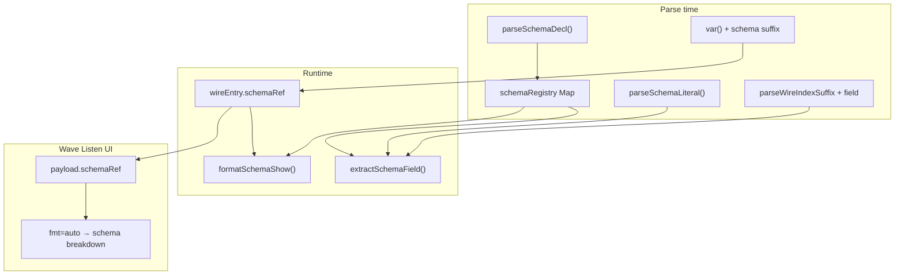

# Plan: Semantic Schemas

## Rezumat

Feature-ul adaugă un strat **semantic** deasupra biților: câmpuri numite, literali structurați, acces tip slice, afișare debug pe câmpuri. **Nu modifică aritmetica** — spre deosebire de tag-urile numerice (`s8`, `q4p4`, `fp16`), care rămân independente.

**Decizii confirmate (2026-07-09):**
- Lățimea schema = lățimea wire **exact** — nepotrivire = **eroare** (ex. `width mismatch between opcode (13bit) and definition (16bit)`)
- Ordinea biților: **MSB stânga, index 0** — aceeași convenție ca `bitRange` / [`short-notation.md`](v0_3_2/doc/short-notation.md)
- Wave Listen: opțiune fmt **`auto`** — folosește schema atașată wire-ului; altfel dropdown global ca acum
- Acces câmp: indici **numerici** = index vector/tensor; ultimul segment = **nume câmp** (niciodată index numeric pentru field)
- Assignment câmp: RHS = expresie/literal complet din limbaj (nu integer simplu)
- `show` / `peek` / `probe`: același comportament pentru schema + tag-uri numerice
- Sintaxă schema **`<name>`** confirmată finală (fără alternative)

**Notă terminologie:** în cod există **Wave Listen** (nu „WaveTrace”) — [`wave-listen-panel.js`](v0_3_2/ui/wave-listen-panel.js), [`wave-listen-format.js`](v0_3_2/ui/wave-listen-format.js).

---

## Erori width mismatch (documentație + implementare)

Exemplul sketch cu `<opcode>` = 13 biți pe `16wire` este **caz greșit intenționat** — trebuie documentat ca eroare, nu „corectat” silent:

```
# EROARE compile-time la declarație:
# width mismatch between opcode (13bit) and definition (16bit)
<opcode>:
    alu:4
    jump:1
    write:1
    cycles:2
    reserved:5
:
16wire<opcode> instr   # ← eroare
```

Exemplu **valid** (16 biți):

```
<opcode>:
    alu:4
    jump:1
    write:1
    cycles:2
    reserved:8
:
16wire<opcode> instr
```

La `show(instr; <opcode2>)` — verificare că `opcode2.totalWidth === wire.bitWidth`; altfel eroare, ex.:
`opcode2 (15bit) width incompatible with wire (16bit)`

---

## Arhitectură



### Separare față de formate numerice

| | Numeric formats | Semantic schemas |
|--|-----------------|------------------|
| Modul existent | [`numeric-formats.js`](v0_3_2/core/numeric-formats.js) | **nou** `semantic-schemas.js` |
| Atașare wire | Nu (doar la literal/apel/show) | Da — `wireEntry.schemaRef` |
| Literali | `\1.5;q4p4` | `{ alu=5 }<opcode>` |
| show | `show(w; fp16)` | `show(w)` auto + `show(w; <alt>)` |

**Nu reutilizăm** [`protocol-assembler.js`](v0_3_2/core/protocol-assembler.js) direct — e orientat pachete variabile; pattern mental similar (`name:` + segmente cu lățime).

---

## Faza 1 — Registry și declarație schema

### Fișier nou: [`v0_3_2/core/semantic-schemas.js`](v0_3_2/core/semantic-schemas.js)

Responsabilități:
- `parseSchemaBody(source)` — parse text între `<name>:` … `:`
- `SchemaDef { name, fields: [{ name, width, bitStart, bitEnd }], totalWidth }`
- `validateSchemaWidth(schema, wireWidth)` → eroare dacă `totalWidth !== wireWidth`
- `extractField(bits, schema, fieldName)` / `packField(bits, schema, fieldName, value)`
- `validateFieldValue(field, value)` — overflow compile-time (ex. `cycles=\8` pe câmp 2-bit)
- `formatSchemaFieldValue(fieldBits, fieldWidth, numericFormat?)` — **refolosește logica show flat** când lățimea câmpului ≠ lățimea formatului (ca `show(a; s8)` pe `2wire` → afișează `00`, nu forțează signed 8-bit pe tot wire-ul)
- `formatSchemaShow(bits, schema, numericFormat?)` — output multi-linie

Layout biți: câmpurile se plasează **consecutiv de la MSB** (stânga), index 0 = MSB.

### Parser — declarație top-level

În [`parser.js`](v0_3_2/core/parser.js) `parse()`:
- Detectăm `<` ID `>:` la început de statement (înainte de `TYPE`)
- Schema ref = secvență `<` + `ID` + `>` (token-uri `SYM` + `ID` + `SYM` existente)

Registry global pe `Parser` / `Interpreter`: `schemaRegistry.set(name, SchemaDef)`.

---

## Faza 2 — Fire cu schema atașată

### Sintaxă

```
16wire<opcode> instr
16wire[64]<opcode> rom
```

### Modificări

- [`parser.js`](v0_3_2/core/parser.js) `var()` / `mixedVar()`: după `TYPE` + tensor suffix, parse opțional `<schemaName>`
- AST decl: `{ type, name, schemaRef?, ... }`
- [`interpreter.js`](v0_3_2/core/interpreter.js): la creare wire → `wireEntry.schemaRef = name`; **validare width** vs schema din registry

Propagare la assignment `a = b`:
- Același `schemaRef` pe ambele → păstrat
- Scheme diferite → copiere biți, **schema LHS neschimbată**

---

## Faza 3 — Literali schema

### Sintaxă

```
16wire<opcode> instr = {
    cycles=\3
    alu=0
    reserved=^FF
}<opcode>
```

### Parser

- Atom nou în `atom()`: `{` … `}` urmat **obligatoriu** de `<schemaName>` (fără prefix `.` — spre deosebire de protocol `.name { }` sau ASM `= .isa { }`)
- Câmpuri: `ID = expr`
- RHS complet independent de LHS

### Runtime

- `buildSchemaLiteral(fields, schemaRef)` → șir binar
- Câmpuri omise → **0**
- Validare overflow per câmp la compile-time când valorile sunt constante

---

## Faza 4 — Acces câmp

### Sintaxă (ultimul segment = nume câmp, nu index)

```
instr:alu                    # scalar, field direct
vector:2:alu                 # vector index 2, field alu
matrix:2:5:red               # tensor row 2, col 5, field red
```

**Regulă:** segmentele intermediare sunt **întotdeauna indici** (DEC/BIN sau `(wire)`); ultimul segment după `:` este **întotdeauna nume câmp** (ID). Nu există `wire:2:5` ca field access — `2:5` = celulă tensor 2D.

### Disambiguare în `parseWireIndexSuffix()` ([`parser.js`](v0_3_2/core/parser.js) L370+)

Extindere după index/indices + bitRange opțional:
- Dacă urmează `: ID` (nume câmp) → `schemaField`
- `wire:alu` — primul segment e ID (nu DEC/BIN) → field direct, fără index

### Assignment câmp (RHS complet)

```
instr:alu = \5
instr:alu = ^5
instr:float = \-1.5;q4p4
instr:wire = AND(en, powerOn)
```

- RHS evaluează ca expresie wire/literal normală
- Rezultatul se **pack** în câmp (validare lățime câmp vs valoare)
- Celelalte câmpuri din element rămân neschimbate

---

## Faza 5 — Debug output (`show` / `peek` / `probe`)

Aceleași reguli pentru toate trei.

### Comportament show + schema + format numeric

**Wire cu schema atașată:**

| Apel | Efect |
|------|-------|
| `show(instr)` | Breakdown câmpuri din schema wire (`opcode`) |
| `show(instr; s8)` | Breakdown câmpuri; fiecare câmp formatat cu `s8` **dacă lățimea câmpului permite** — altfel fallback ca show flat actual (ex. câmp 4-bit → afișare bin/hex/dec, nu forțat s8) |
| `show(instr; q4p4)` | Idem per câmp cu q4p4 (8-bit); câmpuri ≠ 8 bit → fallback |
| `show(instr; dec)` | Idem per câmp cu `\N` unsigned |
| `show(instr; <opcode2>)` | Reinterpretare ca `opcode2`; **width check** obligatoriu |
| `show(instr; s8 <opcode2>)` | Ordinea tag-urilor **nu contează** — echivalent `show(instr; <opcode2> s8)` |
| `show(instr; <opcode2> q4p4)` | Câmpuri opcode2 + format q4p4 per câmp |

**Wire fără schema** — comportament **neschimbat** (show flat existent):

```
2wire a := 0
show(a; s8)    # → a (2wire) = 00
show(a; q4p4)  # → a (2wire) = 00
show(a; dec)   # → a (2wire) = \0
```

**Implementare format per câmp:** delegăm la [`debug-display-format.js`](v0_3_2/core/debug-display-format.js) / `formatGroupedShow` pe biții câmpului — aceeași ramură ca pentru wire-uri cu lățime ≠ format width (ex. `11wire` + `s8` → `^0 ^0 + 010`).

### Modificări parser/display

- [`parser.js`](v0_3_2/core/parser.js) `parseDebugDisplayTags()`:
  - Acceptă tag schema `<name>` (token sequence)
  - Tag schema + tag numeric **coexistă** (nu mutual exclusive)
  - **Ordinea irelevantă** — normalizăm la parse
- [`debug-display-format.js`](v0_3_2/core/debug-display-format.js): `schemaRef` + `numericFormat` în opts
- [`interpreter.js`](v0_3_2/core/interpreter.js) `_formatShowWireValue()`: dacă `schemaRef` (din wire sau tag explicit) → `formatSchemaShow()`

Header output:

```
instr (16wire<opcode>)
  alu       = 0
  jump      = 0
  ...
```

---

## Faza 6 — Wave Listen fmt `auto`

### Modificări

1. [`signal-propagation.js`](v0_3_2/core/signal-propagation.js) `_buildWaveListenValuePayload()`: adaugă `schemaRef` din `wireEntry`
2. [`wave-listen-format.js`](v0_3_2/ui/wave-listen-format.js):
   - `WAVE_LISTEN_FMT_OPTIONS` += `'auto'`
   - `fmt === 'auto'` + `entry.schemaRef` → breakdown câmpuri (inline compact + expand multi-linie)
   - Fallback fără schema → hex
3. [`wave-listen-panel.js`](v0_3_2/ui/wave-listen-panel.js): persistență `prog/waveListenFmt` acceptă `auto`

### Recomandare suplimentară (post-MVP)

Refactor `waveListenFmtToShowOpts()` să delegheze la `normalizeShowDisplayTags()`.

---

## Faza 7 — Documentație și teste

### Doc nou: [`v0_3_2/doc/semantic-schemas.md`](v0_3_2/doc/semantic-schemas.md)

Include:
- Caz eroare 13bit schema / 16wire
- Regula MSB / index 0
- Exemple show cu s8, q4p4, dec (wire cu/fără schema)
- Assignment câmp cu RHS expresie
- Link din [`debug.md`](v0_3_2/doc/debug.md)

### Teste (`test_suite.js`) — grup `semantic-schemas`

- Declarație width mismatch → eroare mesaj explicit
- Literal parțial + overflow field
- Field access: `vector:2:alu`, `matrix:2:5:red`
- Field write: `instr:alu = \5`, `instr:x = AND(a,b)`
- Assignment cross-schema (biți only)
- `show()` auto; `show(w; <alt>)` width incompatible
- `show(w; s8)` / `show(w; q4p4)` / `show(w; dec)` — cu schema (per-field) și fără (flat, regresie)
- Tag order: `show(w; s8 <alt>)` === `show(w; <alt> s8)`
- Wave Listen `auto`

---

## Sintaxă `<name>` — confirmată

**Decizie (2026-07-09):** forma `<opcode>` / `<name>` este sintaxa finală pentru referințe schema — **fără rezerve sau alternative de evitat**.

Utilizări:
- Declarație: `<opcode>:` … `:`
- Wire: `16wire<opcode> instr`
- Literal: `{ alu=0 }<opcode>`
- Show tag: `show(instr; <opcode2> s8)`

Coexistă cu alte utilizări existente ale `<` / `>` în limbaj, fiecare în **context propriu** (fără ambiguitate la parse):

| Context | Exemplu |
|---------|---------|
| Schema ref | `<opcode>`, `16wire<opcode>`, `}<opcode>` |
| LSHIFT / RSHIFT | `a < 2`, `a > 1` |
| Redirect props | `get >= c` (în `{ }` component) |

Comparațiile numerice rămân funcții **`GT()` / `LT()`** — nu există operator `<`/`>` pentru comparație.

**Indici vs câmpuri:** ultimul segment după `:` = nume câmp (ID); segmentele numerice = index vector/tensor.

---

## Ordine implementare recomandată

1. `semantic-schemas.js` + declarație + registry + erori width
2. Wire decl cu `<schema>` + validare width
3. Literali `{...}<schema>`
4. Field access read → write (RHS expresie)
5. show / peek / probe (schema + numeric per câmp)
6. Wave Listen `auto`
7. Doc + teste

Estimare: feature mare, livrabil incremental — MVP funcțional după pașii 1–5.
