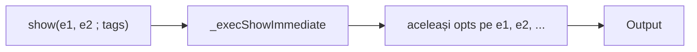

# Tag-uri afișare pentru show / peek / probe

## Principiu de design (decizie utilizator)

**Tag-urile stau o singură dată, la final, după ultimul argument** — nu per argument, nu pe alte funcții decât cele trei debug statements.

```
show(vectorA; dec)
show(a, b, c; elAll dec)       # aceleași tag-uri pentru toate argumentele din apel
peek(matrixA; elNonZero hex)

show(a; dec)                   # formate diferite → apeluri separate
show(0011; hex)

probe(vectorA; dec multiline)  # un singur expr + tags (ca azi)
```

**De ce:** evită confuzia „unele apeluri acceptă `;` pe fiecare argument, altele nu”. Tag-urile există **doar** pe `show`, `peek`, `probe` — nicăieri altundeva (nu pe builtin `ADD`, etc.).

## Context existent

- Formatare vector/matrici: `_formatVectorShowLines` în [`interpreter.js`](v0_3_2/core/interpreter.js)
- `show()` / `peek()`: `expr, expr, …` fără tag-uri
- `probe`: un expr, blob plat, fără elemente
- Wrap network: `PACKET_WRAP_MAX_CHARS = 40` în [`network-traffic-display.js`](v0_3_2/ui/network-traffic-display.js) — replicăm algoritmul, **constantă separată**



## Comportament implicit (fără tag-uri) — neschimbat

`show` / `peek` fără tag-uri folosesc în continuare [`formatValue`](v0_3_2/core/interpreter.js) (hex grupat pe fire ≥32 bit):

```
408wire a := \123
show(a)
# a (408wire) = ^0000 0000 … 0000 7B (ref: &0)
```

Tag-urile `dec` / `decSigned` / `hex` sunt **opt-in** și înlocuiesc formatarea implicită doar când sunt prezente.

## Sintaxă

```
show(expr)
show(expr, expr, … ; tag tag …)
peek(expr, … ; tag tag …)
probe(expr ; tag tag …)
```

- Tag-uri **spațiu-separate** după **un singur** `;`: `show(m; elAll dec multiline)`
- **Nu** valid: `show(a; dec, b)` sau `show(a, b; dec, c; hex)`

| Tag | show / peek | probe | Efect |
|-----|-------------|-------|-------|
| `dec` | da | da | Zecimal **unsigned** — vezi reguli mai jos |
| `decSigned` | da | da | Zecimal **signed** (two's complement) — aceeași structură ca `dec` |
| `hex` | da | da | Nibbles pe celule vector; wire plat = hex grupat `^0000 0000 …` (4 hex chars) |
| `elAll` | da | **eroare** | Toate elementele/celule — fără `..` |
| `elNonZero` | da | **eroare** | Doar celule ≠ zero |
| `multiline` | da | da | Wrap la 40 caractere (modul dedicat) |

### Constante formatare zecimal

| Constantă | Valoare | Rol |
|-----------|---------|-----|
| `SHOW_DEC_SCALAR_MAX_BITS` | 64 | Max biți pentru **un** zecimal (scalar sau element) |
| `SHOW_DEC_CHUNK_BITS` | 64 | Dimensiune grup pe wire plat când W &gt; 64 |

### Reguli `dec` / `decSigned` (vector, matrice, wire plat)

**Vector / matrice (per element):**

- W ≤ 64: un `\N` per celulă — unsigned (`dec`) sau signed (`decSigned`), sufix `(Wbit)` când util (ex. `4wire[3]`)
- W &gt; 64: **fallback hex** pe element — `^… (Wbit)` (nu chunk zecimal în interiorul celulei)

**Wire plat (scalar, fără elemente):**

- W ≤ 64: **un singur** `\N` (unsigned sau signed)
- W &gt; 64: grupe **64 bit** MSB→LSB, fiecare `\N`; dacă rest R ∈ [1..63]: `+ \N (Rbit)` — `+` marchează explicit coada parțială

Exemple wire plat:

```
24wire   →  \11259375
128wire  →  \chunk0 \chunk1          # fără + (multiplu exact de 64)
127wire  →  \chunk0 + \rest (63bit)
408wire  →  \c0 \c1 \c2 \c3 … + \rest (Rbit)   # show(a; dec) — nu hex implicit
```

**Reguli generale:**

- `dec` | `decSigned` | `hex` → **mutual exclusive** (exact unul)
- `dec` + `decSigned` → eroare
- `elAll` + `elNonZero` → eroare
- `el*` pe wire scalar în show/peek → ignorat
- `el*` pe probe → eroare parse
- `elAll` / `elNonZero` / `multiline` pot coexista cu un singur tag numeric (`dec` sau `decSigned` sau `hex`)

**Multi-arg show/peek:** lista de expr-uri ca azi (wire, literal, slice, …); **aceleași** `displayTags` se aplică la fiecare argument afișat (unde tag-ul are efect).

**Formate diferite pe valori diferite:** două statements, ex. `show(a; dec)` apoi `show(0011; hex)`.

## Wrap `multiline`

- [`core/debug-display-wrap.js`](v0_3_2/core/debug-display-wrap.js): `DEBUG_DISPLAY_WRAP_MAX_CHARS = 40`, `wrapDebugDisplayValue(formatted)`
- Algoritm ca `wrapFormattedPacket` (split ` + `, indent `  `)
- Partajat **doar** show / peek / probe — **nu** import din network traffic

## 1. Parser — [`parser.js`](v0_3_2/core/parser.js)

După toate expr-urile comma-separated, înainte de `)`:

```js
// show / peek
{ show: { args: [expr, ...], displayTags?: string[] } }
{ peek: { args: [expr, ...], displayTags?: string[] } }

// probe — un expr, apoi optional ; tags
{ probe: { expr, displayTags?: string[] } }
```

*(Migrare AST: `s.show` devine obiect sau `s.show` + `s.showDisplayTags` — actualizăm toate citirile în interpreter.)*

- Whitelist show/peek: `dec`, `decSigned`, `hex`, `elAll`, `elNonZero`, `multiline`
- Whitelist probe: `dec`, `decSigned`, `hex`, `multiline`

## 2. Interpreter

- `normalizeShowDisplayTags` → flags partajate pentru tot statement-ul
- `_execShowImmediate`: loop `args`, fiecare cu **aceleași** opts
- `_formatVectorShowLines(wireName, valueStr, opts)` — elAll / elNonZero / dec / decSigned / hex / multiline
- **probe:** stochează tags pe target; emit blob plat + dec/decSigned/hex/multiline; **fără** listă elemente

## 3. `doc(show)` — `Interpreter.DEBUG_DOC`

```
show(expr, … ; dec decSigned hex elAll elNonZero multiline) — tags once after all args
peek(expr, … ; tags…) — same
probe(expr ; dec decSigned hex multiline) — single expr; no el* tags
```

## 4. Teste

| Test | Verifică |
|------|----------|
| `show(vectorA; dec)` | format dec per element W≤64 |
| `show(wideVec; dec)` | element W&gt;64 → hex pe celulă |
| `show(a; decSigned)` | signed two's complement per element |
| `show(24wire; dec)` | scalar un singur `\N` |
| `show(408wire; dec)` | chunk 64 + `+ \N (Rbit)` (nu hex implicit) |
| `show(127wire; decSigned)` | `\c0 + \rest (63bit)` signed |
| `show(128wire; dec)` | două grupe, fără `+` |
| `show(a, b; dec)` | **ambele** cu dec (nu per-arg) |
| `show(m; elAll dec)` | toate celulele |
| `show(bits; elAll)` | fără `..` |
| `show(a; dec)` + `show(b; hex)` | apeluri separate (doc example) |
| `show(a; dec hex)` / `dec decSigned` | eroare |
| `show(long; dec multiline)` | wrap |
| `peek(vectorA; decSigned)` | ca show |
| `probe(v; dec)` | blob, fără elemente |
| `probe(v; elAll)` | eroare |
| `show(408wire)` fără tag | rămâne `formatValue` hex (regresie zero) |
| `doc(show)` | semnături |

**Eliminat:** test `show(a; dec, b)` cu tag doar pe `a`.

## 5. Documentație

[`debug.md`](v0_3_2/doc/debug.md): emphasize — tags **only** on show/peek/probe, **once at end**; mixed formats → multiple `show` lines.

## Fișiere

| Fișier | Schimbare |
|--------|-----------|
| `core/parser.js` | AST show/peek/probe + tags la final |
| `core/debug-display-wrap.js` | nou |
| `core/interpreter.js` | format + exec + DEBUG_DOC |
| `tests/test_suite.js` | teste |
| `doc/debug.md`, `doc/wire-vectors.md` | docs |

## Decizii confirmate

- Tag-uri **statement-level** (după ultimul argument), nu per argument
- Multi-arg + tags: **doar show și peek**
- Formate mixte: **apeluri show separate**
- Probe: dec/decSigned/hex/multiline; fără el*
- **Fără tag-uri:** `formatValue` neschimbat (ex. 408wire → hex grupat)
- `dec` | `decSigned` | `hex` — mutual exclusive
- Vector/matrici: zecimal per element dacă W≤64; W&gt;64 → hex pe element
- Wire plat: W≤64 → un zecimal; W&gt;64 → chunk 64 bit + `+ \N (Rbit)` pe rest (1..63 bit)
- Hex tag remainder &lt; 4 biți; wrap 40 chars constantă separată
