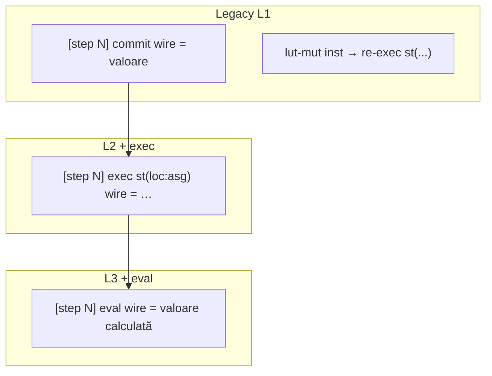

# Signal Trace — Legacy + componente

**Plan înrudit:** [wave_debug_tooling.plan.md](wave_debug_tooling.plan.md) (Wave Listen / deps / probe cause — strat 1 DONE).

**Nume panou:** **Signal Trace** (fost Wave Listen). Buton armare rămâne **ON/OFF**; badge devine **Tracing…**.

## Situația actuală

Panoul **Wave Listen** este dezactivat explicit în Legacy în [`wave-listen-panel.js`](../v0_3_2/ui/wave-listen-panel.js):

```232:236:v0_3_2/ui/wave-listen-panel.js
  if (legacy) {
    appendWaveListenStatus(`* Script runs in mode legacy, listen is ${armed ? 'ON' : 'OFF'}`);
    ctx.waveListenActive = false;
    if (ctx.interp) ctx.interp.waveListenActive = false;
    return;
```

Motivul tehnic: `LegacyCascadePropagationStrategy.propagate()` este gol — nu există buclă wave, iar emisiile `_emitWaveListen*` din [`signal-propagation.js`](../v0_3_2/core/signal-propagation.js) nu sunt apelate niciodată. Cascada Legacy rulează imediat prin `updateConnectedComponents` (același fișier, ~L1910+).

**Decizie redenumire:** panoul devine **Signal Trace**. Prefix linii: `[wave N]` (Wave) vs `[step N]` (Legacy).

---

## Redenumire: Wave Listen → Signal Trace

**Decizie finală:** **Signal Trace** — nume de panou (substantiv compus, aliniat la signal propagation). **Trace Signal** exclus. Pill-ul Wave/Legacy din toolbar nu se redenumește.

Buton toolbar: **ON/OFF** (armează Signal Trace pentru următorul Run). Badge: `Tracing… inst N`.

### Scope redenumire (faza curentă)

**UI + docs (obligatoriu):**
- Meniu Win: `Signal Trace`
- Titlu panou `<h3>`, tooltip buton ON
- [`debug.md`](../v0_3_2/doc/debug.md), linkuri din `huffman-v2.md`, `doc-viewer`

**Cod intern (opțional, faza separată — nu blochează feature-ul):**
- Fișiere `wave-listen-*.js` → `trace-listen-*.js` (sau alias re-export)
- Identificatori `waveListenActive` → `traceListenActive` cu alias deprecat
- CSS `.wave-listen-*` — păstrăm clasele interne sau redenumim gradual

Prioritate: **label-uri user-facing** în această fază; refactor simboluri JS doar dacă e ieftin (search-replace controlat).

---

## Ce afișăm în Legacy (decizii finale)

### Prefix linii

| Mod | Prefix commit/exec | Motiv |
|-----|-------------------|-------|
| **Wave** | `[wave N] commit wireName` | N = index val (settle) |
| **Legacy** | `[step N] commit wireName` | N = pas monoton de cascadă (fără valuri) |

Funcțiile de prefix din [`wave-listen-format.js`](../v0_3_2/ui/wave-listen-format.js) (`waveListenPayloadPrefix`) și [`wave-listen-panel.js`](../v0_3_2/ui/wave-listen-panel.js) (`_waveListenValuePrefix`) vor folosi `entry.mode` (`'wave'` | `'legacy'`) pentru a alege formatul.

### Niveluri L1 / L2 / L3 (paritate cu Wave unde are sens)



| Nivel | Wave (existent) | Legacy (nou) |
|-------|-----------------|--------------|
| **L1** | commit wire, lut-mut, init, flush show | **commit** la fiecare schimbare reală de valoare; **lut-mut** (hook existent în [`interpreter.js`](../v0_3_2/core/interpreter.js) L972) |
| **L2** | + exec statements, commit component | **+ exec** la re-eval cascadă în `updateConnectedComponents` |
| **L3** | + schedule (valori înainte de commit) | **+ eval** — valoarea produsă de `execWireStatement` înainte de comparație old/new |

### Ce NU afișăm în Legacy

- `[wave 0] RUN init → recompute all wires` — Legacy nu face bulk recompute la start.
- `flush deferred show(...)` — `show` e imediat (`deferShow = false`).
- Linii `schedule` — înlocuite de `eval` la L3.

### Linii de status / meta (panou)

- La Run start (armed + legacy): `* Run start (legacy cascade) — trace is ON`
- La Run complet (armed): `* Run complete — trace stays ON (interactive updates)` — **și în Legacy**
- Badge toolbar: `Tracing… inst N`; opțional sufix discret `(legacy)` dacă pill-ul editorului e verde

### Ce rămâne identic

- Dropdown **Fmt**, butoane **[+]/[-]**, **[cpy]**, culori CSS (`commit` verde, `lut-mut` portocaliu, `exec` gri etc.).
- `deps()` — deja funcționează în ambele moduri.

---

## Implementare tehnică — Faza 1

### 1. Deblocare UI — [`wave-listen-panel.js`](../v0_3_2/ui/wave-listen-panel.js)

- Eliminăm blocul `if (legacy) { … return; }` din `beginWaveListenRun`.
- `_syncWaveListenToActiveInterps`: activăm când `armed && running` **indiferent de legacy**.
- `endWaveListenRun`: `keepTracing = armed && reason === 'complete'` (fără excludere legacy).
- `beginWaveListenRun`: dacă legacy, status informativ + reset contor step pe strategie.
- `_waveListenValuePrefix`: `[step N]` când `entry.mode === 'legacy'`.

### 2. Motor Legacy — [`signal-propagation.js`](../v0_3_2/core/signal-propagation.js)

Adăugăm pe `SignalPropagationStrategy`:

- `_listenStepCounter` (reset la început de Run)
- `resetListenTrace()` — apelat din `beginWaveListenRun`
- `_isLegacyListen()` → `!this.deferWireWrites`
- `_emitLegacyListenValueEntry(name, val, kind, minLevel, isComponent)` — `mode: 'legacy'`, `wave: stepCounter`, `traceCategory: 'wire'`
- `_emitLegacyListen(text, kind, minLevel)` — pentru exec/lut-mut text

**Hook-uri în `updateConnectedComponents`** (cascadă Legacy, ~L2066–2125):

- Înainte de `execWireStatement(ds)` la L2+: `_emitLegacyListen('exec …', 'exec', 2)`
- După exec, la L3+: emite `eval` pentru fiecare output din statement
- Când `newValue !== oldValue`: `_emitLegacyListenValueEntry(..., 'commit', 1)`

**Hook scrieri directe** în [`interpreter.js`](../v0_3_2/core/interpreter.js):

- Helper `strategy.notifyLegacyWireChange(name, val, opts)` apelat când `old !== new` și `!deferWirePropagation()`

### 3. Prefix formatare — [`wave-listen-format.js`](../v0_3_2/ui/wave-listen-format.js)

```javascript
function waveListenPayloadPrefix(payload) {
  const label = payload.label || 'commit';
  const name = payload.name != null ? payload.name : '?';
  if (payload.mode === 'legacy') {
    const step = payload.wave != null ? payload.wave : '?';
    return `[step ${step}] ${label} ${name}`;
  }
  const wave = payload.wave != null ? payload.wave : '?';
  return `[wave ${wave}] ${label} ${name}`;
}
```

`lut-mut` — fără prefix `[step]`; format curent păstrat.

### 4. Documentație — [`debug.md`](../v0_3_2/doc/debug.md)

Exemplu Legacy:

```text
* Run start (legacy cascade) — trace is ON
[step 1] commit a = ^3
[step 2] exec st(2:asg) b = …
[step 2] commit b = ^0
lut-mut .huff:clear → re-exec st(5:asg) packetEncoded := …
* Run complete — trace stays ON (interactive updates)
```

### 5. Teste — [`test_suite.js`](../v0_3_2/tests/test_suite.js)

- **2207** — `2wire a = 11\n2wire b = a`, `{ propagation: 'legacy' }`, L1 → `commit`, prefix `[step`
- **2207b** — `a = 1` + `b = NOT(a)` → linie `exec` la L2

---

## Faza 2 (ulterioară): trace componente — pachet complet (A–F)

**Decizie:** toate tipurile de linii + **filtru toolbar obligatoriu** (Wave + Legacy).

### Tipuri de linii

| ID | Format linie | Nivel | `kind` CSS |
|----|--------------|-------|------------|
| **A** | `[step N] commit component alu1 = ^…` | L2 | `commit` |
| **B** | `[step N] prop keyboard1.data = ^…` | L2 | `prop` |
| **C** | `[step N] connect alu1:o → result` | L2 | `connect` |
| **D** | `[step N] exec block counter1.on:raise` | L3 | `exec` |
| **E** | `lut-mut .huff:clear → re-exec …` | L1 | `lut-mut` |
| **F** | `[step N] state mem1[3] = ^…` | L3 | `state` |

### Filtru toolbar — Wave **și** Legacy

| Valoare | Ce afișează |
|---------|-------------|
| **All** (default) | Tot |
| **Wires** | commit/exec/eval wire, init, flush, schedule, lut-mut |
| **Components** | commit component, prop, connect, lut-mut |
| **Internals** | eval L3, block exec, state/mem, schedule (wave L3) |

Persistență: `prog/signalTraceFilter` în `sdb`. Fiecare entry: `traceCategory: 'wire' | 'component' | 'internal'`.

### Teste faza 2

- **2208** — REG/slider: `prop` + `commit component`
- **2209** — ALU `:get` redirect: `connect`
- **2210** — `on:raise` block: `exec block` la L3
- **2211** — mem write: `state` la L3; filtru Internals

### CSS nou (faza 2)

- `.wave-listen-line--prop` — albastru deschis
- `.wave-listen-line--connect` — cyan
- `.wave-listen-line--state` — mov deschis

---

## Fișiere modificate

| Fișier | Faza |
|--------|------|
| [`v0_3_2/script_editor_v0_3_2.html`](../v0_3_2/script_editor_v0_3_2.html) | 1: rename; 2: Filter dropdown |
| [`v0_3_2/ui/wave-listen-panel.js`](../v0_3_2/ui/wave-listen-panel.js) | 1 + 2 |
| [`v0_3_2/ui/wave-listen-format.js`](../v0_3_2/ui/wave-listen-format.js) | 1 |
| [`v0_3_2/core/signal-propagation.js`](../v0_3_2/core/signal-propagation.js) | 1 + 2 |
| [`v0_3_2/core/interpreter.js`](../v0_3_2/core/interpreter.js) | 1 + 2 |
| [`v0_3_2/doc/debug.md`](../v0_3_2/doc/debug.md) | 1 + 2 |
| [`v0_3_2/tests/test_suite.js`](../v0_3_2/tests/test_suite.js) | 1 + 2 |

---

## Decizii închise

| Subiect | Decizie |
|---------|---------|
| Nume panou | **Signal Trace** |
| Legacy trace | `[step N]`, L1/L2/L3 |
| Componente | A–F în faza 2 |
| Filtru | All / Wires / Components / Internals — Wave + Legacy |
| Badge | `Tracing… inst N` |
| ID-uri interne | Păstrate în faza 1 |
| Livrare | Faza 1: rename + Legacy fire; Faza 2: componente + filtru |
