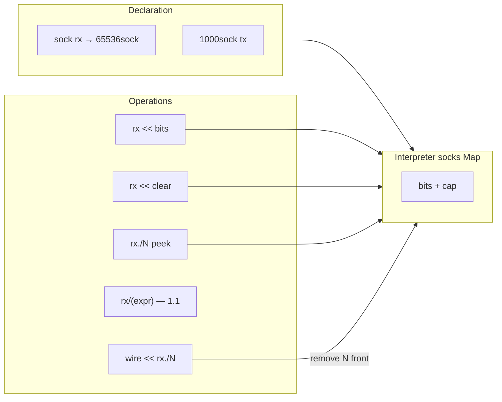

# Plan: Socket (`sock`) — dynamic bit stream

## Numerotare faze

| Notație | Semnificație |
|---------|--------------|
| **1**, **1.1**, **1.2**, … | Faze **planificate** în ordinea implementării |
| **1+a**, **1+b**, … | Doar pentru itemi **amânați** / out-of-scope v1 (backlog explicit) |

---

## Decizii confirmate (utilizator)

| Subiect | Decizie |
|---------|---------|
| **Slice canonical** | **`rx./N`** — primii N biți de la front; **fără** `rx/N`, **fără** `rx.0/N` |
| **Consume** | **Doar** `wire << rx./N` (sau `wire << rx/(expr)` după **1.1**) |
| **Capacitate** | **`1000sock tx`** → cap 1000 bit; **`sock rx`** = sugar **`65536sock rx`** |
| **Clear** | **`rx << clear`** — keyword `clear` **doar** după `<<`; fallback **`rx:clear`** |
| **Lungime dinamică** | **`rx/(expr)`** — **Faza 1.1** |
| **Debug tooling** | probe / watch / Wave Listen — **Faza 1.2** |
| **Documentație** | Doar [`sock.md`](../../v0_3_2/doc/sock.md) — **Faza 1**; fără `stream.md` |
| **MODE ZSTATE** | Sock = **bitstream transmis** — stocare **doar `0`/`1`**; **`Z`/`X` la append → eroare** |
| **BITSIZE / WWIDTH** | Pe **sock** ambele = **lungime runtime** (bit count curent), **inclusiv 0** — nu cap declarat |
| **Show tags** | `show` / `peek` / `probe` pe sock acceptă tag-uri display ca la wire (`; u8`, `; dec`, `; hex`, `; s8`, `; q4p4`, `; b32c`, …) |
| **Protocol + sock** | **`{ data = rx }`** = peek (fără tăiere); **`{ data << rx }`** = parse + consume — **Faza 1.3** |

---

## Tip limbaj vs componentă

**`sock`** = tip de limbaj (ca `8wire`), **nu** `comp [sock]`.

| | `comp [queue]` | `sock` |
|--|----------------|--------|
| Unitate | elemente fixe `width` | biți (stream) |
| Scriere | `.q:{ push=… set=1 }` | `rx << …` |
| Citire front | `:get` / `:front` | peek `rx./N` |
| Consum | `pop` + property block | `wire << rx./N` |
| Capacitate | `length` (elemente) | `Nsock` la decl (biți) |

---

## Sintaxă slice — `rx./N`

| Expresie | Semantica |
|----------|-----------|
| `4wire x = rx./4` | **Peek** — socket neschimbat |
| `show(rx./4)`, `TEST(rx./4, …)` | Peek |
| `opcode << rx./4` | **Consume** |
| `rx/(len)` | Peek/consume dinamic — **Faza 1.1** |

**Consume exclusiv prin `<<`.**

---

## Declarație și capacitate

```logts
sock rx              # sugar → 65536sock rx
65536sock rx         # explicit default
1000sock tx          # cap 1000 bit
```

Tokenizer: `\d+sock`; standalone `sock` → cap **65536** (`DEFAULT_SOCK_CAP`).

---

## Operator `<<`

| Formă | Semnificație |
|-------|--------------|
| `sock << expr` | Append |
| `sock << clear` | Golește (**Faza 1**) |
| `Nwire dest << sockSlice` | Consume |

### Clear — `rx << clear`

Parser: după `<<`, token **`clear`** acceptat doar în acest context (ID `clear` rămâne liber). Fallback: **`rx:clear`**.

---

## MODE ZSTATE — sock rămâne binar

**Model (confirmat):** sock = biți **transmiși** pe un bitstream serial. Tristate (`Z`, `X`) descrie firele în simulare logică, **nu** payload-ul pe canal.

| Aspect | Regulă |
|--------|--------|
| **Stocare** | `sock.bits` — **numai** `'0'` și `'1'` |
| **`show` / `peek` / Wave Listen** | Niciodată `Z`/`X` în conținutul afișat al sock |
| **`rx << expr`** | Dacă RHS conține **`Z` sau `X`** → **eroare** (indiferent de MODE) |
| **Consume → wire** | Biții din sock sunt `0`/`1`; assign pe wire urmează regulile wire/ZSTATE |
| **Mapare Z→0, X→1** | **Respinsă** — contrazice modelul bitstream; ascunde bug-uri de propagare |

**De ce eroare, nu transformare:** utilizatorul trebuie să rezolve wire-ul (sau să folosească o sursă definită) înainte de append: `rx << cleanWire`, nu `rx << floatingBus`.

**Nu planificăm:** multi-driver / `ZCONNECT` pe sock (fost 1+b amânat — **anulat**).

**Faza 1:** validare la append + test `MODE ZSTATE` + append din wire cu `Z`.

---

## BITSIZE / WWIDTH pe sock

Pe **wire**, `WWIDTH` = lățime declarată/statică, `BITSIZE` = lungimea șirului de biți. Pe **sock**, ambele builtins raportează **lungimea runtime** a bufferului (câți biți sunt stocați **acum**), **nu** capacitatea `Nsock`.

| Builtin | Pe sock | N = 0 (sock gol) |
|---------|---------|------------------|
| **`BITSIZE(rx)`** | N — encoding standard BITSIZE (`bitIndexWidth` + pad) | **`0`** (1 bit width index, ca wire gol) |
| **`WWIDTH(rx)`** | **Aceeași semantica N** (lungime runtime, excepție față de wire) | **`0`** |

**Capacitatea** (`65536sock`, `1000sock`) rămâne metadata internă — vizibilă doar la **overflow**, nu prin WWIDTH.

Implementare: ramură în `evalAtom` / `_inferExprStaticBitWidth` când operandul e sock (sau slice `rx./N` → N fix/dinamic).

```logts
sock rx
show(BITSIZE(rx))    # 0
rx << ^FF
show(BITSIZE(rx))    # 8
8wire w = WWIDTH(rx) # 8 — runtime, nu 65536
```

---

## Show / peek / probe — display tags

Reutilizare [`debug-display-format.js`](../../v0_3_2/core/debug-display-format.js) / [`debug.md`](../../v0_3_2/doc/debug.md) — aceleași **format tags** ca pe wire:

```logts
show(rx)
show(rx; u8)
show(rx; dec)
show(rx; hex)
show(rx./16; s8)
peek(rx; q4p4)
probe(rx; b32c)
```

| Formă | Comportament |
|-------|--------------|
| **`show(sock)`** | Bin raw + suffix `(Nbit)` — N = lungime runtime |
| **`show(sock; tag)`** | Grupare pe elemente conform tag (`u8` → octeți MSB-first din front); lungime nealiniată → rest ca la wire lung (chunks + `+ \N (Rbit)`) |
| **`show(sock./W; tag)`** | Tag pe slice peek |
| **`peek(sock; …)`** | Identic show ca formatare |
| **`probe(sock; …)`** | Snapshot non-destructiv + tag — **Faza 1.2** (infra tags din Faza 1) |

**Reguli:** sock conține doar `0`/`1` → formatele numerice nu văd niciodată `Z`/`X` în sursă. Tag-uri layout (`multiline`, `maxWidth`, …) — aceleași restricții ca [`debug.md`](../../v0_3_2/doc/debug.md).

**Faza 1:** `show` / `peek` + tags; **Faza 1.2:** `probe` + Wave Listen cu aceleași formate.

---

## Arhitectură



---

## Faze planificate

### Faza 1 — Core limbaj + documentație (~1–2 săpt.)

1. Decl `sock` / `Nsock` + sugar 65536
2. `rx << expr`, `rx << clear`
3. `rx./N` peek; `wire << rx./N` consume
4. **`BITSIZE(sock)`**, **`WWIDTH(sock)`** — lungime runtime (0 OK)
5. **`show` / `peek`** + **display tags** (`; u8`, `; dec`, `; hex`, …)
6. Overflow / underflow
7. Validare **Z/X la append** → eroare
8. **`doc/sock.md`** + Load & Run (secțiune tags + builtins)

**Teste 2450–2466** (inclusiv 2463 Z/X append error; wave 2464–2466).

| ID | Titlu |
|----|-------|
| 2450–2458 | decl, append, peek, consume, clear, overflow, on:1 |
| 2459 | `BITSIZE`/`WWIDTH` pe sock gol → 0 |
| 2460 | `show(rx; u8)` / `show(rx; dec)` după append |
| 2461 | `show(rx./8; hex)` slice + tag |
| 2462 | TEST + on:1 consume |
| 2463 | append wire cu `Z` → eroare |
| 2464–2466 | wave perechi |

---

### Faza 1.1 — Slice dinamic `rx/(expr)` (~3–5 zile)

Lungime N evaluată runtime — peek, consume, show, TEST.

```logts
opcode << rx/(lenField)
length << rx/(8)
```

**Teste 2469–2475** (2467–2468 rezervate wave). Doc: secțiune în `sock.md`.

---

### Faza 1.2 — probe / watch / Wave Listen (~3–5 zile)

- `probe(rx)` — snapshot non-destructiv
- **`probe(rx; tag)`** — aceleași display tags ca Faza 1 (`u8`, `dec`, `hex`, …)
- `watch rx` — timeline Wave debug
- Wave Listen — format sock în panoul wave ([`wave-listen-format.js`](../../v0_3_2/core/wave-listen-format.js)); respectă tag/context dacă aplicabil

**Teste 2476–2481** — inclusiv `probe(rx; u8)`, watch după append/consume. Doc: `sock.md` + [`debug.md`](../../v0_3_2/doc/debug.md).

---

### Faza 1.3 — Protocol + sock: peek vs consume (~1 săpt.)

**Plan detaliat:** [`sock_protocol_1.3.plan.md`](sock_protocol_1.3.plan.md)

#### Problema (azi vs sock)

**Azi** (`mode: parse`):

```logts
24wire out =: .parseHdr { data = packet }
```

- `packet` e **wire** — șir de biți **fix**, copiat la invoke.
- [`ParseStream`](../../v0_3_2/core/protocol-assembler.js) avansează **`pos`** pe copie; **`packet` nu se modifică**.
- Tot inputul trebuie deja într-un wire; parse **one-shot** pe blob static.

**Cu sock** vrem **parsare secvențială pe buffer live**: header consume din front, payload **rămâne în sock** pentru streaming / Wave.

#### Semantica invoke: `=` vs `<<`

| Invoke | Semantica pe **sock** | Semantica pe **wire** (ca azi) |
|--------|----------------------|--------------------------------|
| `{ data = rx }` | **Peek** — snapshot; parse pe copie; **`rx` nemodificat** | Copie bitstring în `ParseStream` |
| `{ data << rx }` | **Consume** — fiecare `read(n)` taie N biți din front | N/A |

**Anti-pattern Wave:** `payload << rx/(hdr:len)` — copiază payload întreg în wire; pierzi streaming. Payload **rămâne în `rx`**; al doilea `.proto` sau chunk-uri.

#### Exemplu streaming

```logts
inline [protocol] .parseHdr:
  mode: parse
  parseView: tree
  def packet:
    magic 8b
    opcode 4b
    len 8b
:

sock rx

# Peek (optional validate)
# hdrTry =: .parseHdr { data = rx }

# Consume — productie
20wire hdr =: .parseHdr { data << rx }
# rx -20b; payload (hdr:len) INCĂ in rx

body =: .parseBody { data << rx, maxBits = hdr:len }
```

#### Wave: parse incremental + așteptare

Invoke **nu** face loop infinit. Pattern Wave:

```logts
on:1, ready, BITSIZE(rx) >= 20 {
  hdr =: .parseHdr { data << rx }
  show hdr:opcode
}
```

Guard `BITSIZE >= N` → aștepți append; la biți noi, re-invoke consume. Underflow cu `<<` → **tranzacție** (zero tăiere parțială).

#### Implementare (rezumat)

1. **`parseProtocolInvoke`** — acceptă `=` și `<<`; AST `{ expr, consume }`.
2. **`evalProtocolInvoke`** — sock + peek → `ParseStream(snapshot)`; sock + `<<` → **`SockParseStream`** (read+cut, rollback la eroare).
3. **`generateProtocol`** — fără schimbări majore; același cursor, alt backend.
4. **Output** — wire + opțional `parseViewId`.

#### Ce NU e 1.3

- **Nu** e protocol nou — aceeași `inline [protocol]` cu `mode: parse`.
- **Nu** consume fără `{ data << rx }` explicit.
- **Nu** bridge UART/file (→ 1.4).

#### Teste 2480–2486

| ID | Scenariu |
|----|----------|
| 2480 | `{ data << rx }` — `BITSIZE(rx)` scade corect |
| 2481 | `{ data = rx }` — peek; `BITSIZE(rx)` neschimbat |
| 2482 | literal mismatch + `<<` → tranzacție; sock nemodificat |
| 2483 | underflow + `<<` → eroare; sock nemodificat |
| 2484 | parseView după consume parțial |
| 2485 | wave: append incremental + `on:1` + `{ data << rx }` |
| 2486 | wave: tail rămâne în sock, fără wire payload gigant |

**Doc:** `sock.md` + [`protocol-parse.md`](../../v0_3_2/doc/protocol-parse.md).

---

### Faza 1.4 — Bridge I/O → sock (~1 săpt.)

`comp [network]` RX → `rx << .wifi:get`; exemple keyboard/terminal.

**Teste 2487–2490**.

---

## Faze amânate (1+a …)

Itemi **out of scope v1** — numerotare **1+a**, **1+b** doar aici:

| Fază | Conținut |
|------|----------|
| **1+a** | `comp [uart]` / `comp [file]` ca producători sock |
| **1+b** | Random access / insert mid-stream |

(ZSTATE multi-driver pe sock — **anulat**; regula binară + eroare la append e în **Faza 1**.)

---

## Ce NU intră (fără fază)

- `stream.md`
- `rx/N`, `rx.0/N`
- `comp [sock]` ca componentă

---

## Criterii done Faza 1

1. `sock rx` ≡ `65536sock rx`; `1000sock tx` cap explicit
2. Slice **doar** `rx./N`; consume **doar** `<<`
3. `rx << clear` (sau fallback documentat)
4. Peek vs consume distinct; erori overflow/underflow
5. **`BITSIZE`/`WWIDTH`** = lungime runtime (0 valid)
6. **`show`/`peek` + tags** (`u8`, `dec`, `hex`, …)
7. Append respinge `Z`/`X`
8. **`sock.md`** cu Load & Run
9. Teste 2450–2466 + regresie 1901

---

## Estimare

| Fază | Durată |
|------|--------|
| 1 | ~1–2 săpt |
| 1.1 | ~3–5 zile |
| 1.2 | ~3–5 zile |
| 1.3 | ~1 săpt |
| 1.4 | ~1 săpt |

**Ordine:** 1 → 1.1 → 1.2 → 1.3 → 1.4.

---

## Legături planuri

| Plan | Relație |
|------|---------|
| [`sock_protocol_1.3.plan.md`](sock_protocol_1.3.plan.md) | Detaliu Faza 1.3 — peek/consume, Wave streaming |
| [`schema_protocol_bridge.plan.md`](schema_protocol_bridge.plan.md) | După 1.3 |
| [`network_component.plan.md`](network_component.plan.md) | Pattern 1.4 |
| [`queue_stack.plan.md`](queue_stack.plan.md) | Comparație doc |
