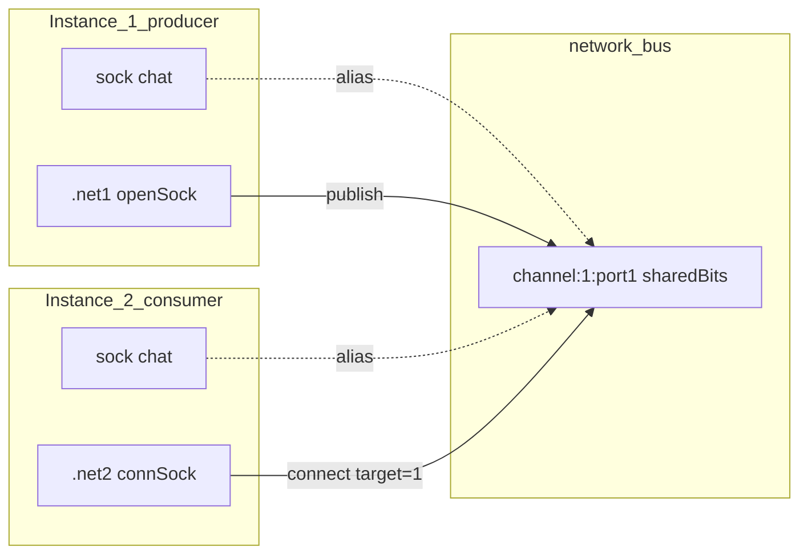

# Faza 1.4 — Network socket connections (shared sock)

Plan părinte: [`.cursor/plans/sock.plan.md`](sock.plan.md) §1.4.

---

## Decizie de direcție (fixă)

| Subiect | Decizie |
|---------|---------|
| **Obiectiv 1.4** | Conexiuni **socket partajate** între instanțe — nu drain FIFO→sock |
| **Pattern vechi** (`rx << .net:get` + `pop`) | **Rămâne valid**, funcționează deja; documentat ca alternativă user-level, **fără cod nou** |
| **Bus pachete** (`send`/`pop`/`get`) | **Păstrat integral** — mod paralel pe același `comp [network]` |
| **Ce implementăm** | Broker intern + aliasing sock + pinuri `openSock` / `connSock` / `port` |

---

## Analiză stare curentă

### Ce există deja

- **`sock`** (faze 1–1.3): buffer local per interpreter în `Interpreter.socks` — `{ type, bits, cap }` ([`interpreter.js`](../../v0_3_2/core/interpreter.js) ~5372–5518).
- **`comp [network]`**: bus FIFO pachete pe `channel`, `target` unicast 1–5, cross-instance via [`network-bus.js`](../../v0_3_2/devices/network-bus.js).
- **Lifecycle**: `unregisterNetworkEndpoints(instanceId)` la preempt/release ([`run-context.js`](../../v0_3_2/ui/run-context.js)).

### Ce lipsește pentru direcția nouă

- Registry de **porturi socket** în bus (distinct de FIFO RX).
- **Buffer partajat** accesibil din două interpretoare.
- Legătură `openSock` / `connSock` → nume sock local.
- **Enforcement** rol producer vs consumer pe același stream.
- Parser/component pins noi; teste 2489+.

### De ce planul vechi 1.4 nu implementa nimic

Exemplele A/B/C din planul vechi sunt **compoziție** peste API existent:

```logts
on:1 { AND(drain, NOT(.net:empty)), rx << .net:get, .net:{ pop = 1; set = 1 } }
```

Așteptare: **merge as-is** (append `rx << expr` acceptă pout `.net:get`). Verificare rapidă în 1.4.1, fără feature nou. Focusul implementării = socket connections.

---

## Model țintă (sketch utilizator, rafinat)

### Principiu



- **`network`** = broker discovery + connection establishment.
- **`sock`** rămâne tip limbaj normal; runtime expune **un obiect buffer partajat** per conexiune stabilită.
- **Fără copiere** între FIFO network și sock — fluxul socket ocolește FIFO-ul.

### Channel

```logts
comp [network] .net1:
  channel: 'intranet'
  on: 1
  :
```

Doar instanțe pe același `channel` pot conecta.

### Deschidere port (producer)

```logts
sock chat

.net1:{
  openSock <- chat
  port = 1
  set = 1
}
```

Publică `chat` pe **port 1** al instanței curente. Socketul rămâne local; în bus devine vizibil `(channel, instanceId, port)`.

**Precondiție:** `BITSIZE(chat) === 0` la momentul `openSock` — altfel eroare.

### Conectare (consumer)

```logts
sock chat

.net2:{
  target = 1
  connSock -> chat
  port = 1
  set = 1
}
```

`target` = instanța remote care a făcut `openSock`. `port` selectează portul. `connSock -> chat` leagă sock-ul local de același buffer.

**Precondiție:** `BITSIZE(chat) === 0` la momentul `connSock` — altfel eroare.

### Închidere conexiune (`closeSock`)

Ambele capete pot apela `closeSock`; semantica diferă după rol:

```logts
# închidere corectă — pe componenta care a făcut connSock (consumer)
.net2:{ closeSock = 1; port = 1; set = 1 }

# închidere incorectă — pe componenta care a făcut openSock (producer)
.net1:{ closeSock = 1; port = 1; set = 1 }
```

| Cine închide | Tip | Sock producer (s2) | Sock consumer (s1) | După close |
|--------------|-----|--------------------|--------------------|------------|
| **Consumer** (`connSock`) | **corect** | **clear** | **păstrează** biții rămași la momentul close | `s2 <<` nu mai ajunge în `s1`; ambele **detached** |
| **Producer** (`openSock`) | **incorect** | **clear** | **păstrează** biții rămași | la fel — stream rupt |
| **Producer**, sock gol la close | **parțial-corect** | clear (deja 0) | păstrează | fără date pierdute pe wire |

`closeSock` folosește `=` (pin acțiune, ca `set`/`pop`), nu operator bind.

### Comportament runtime

```
net1:chat  ═══════════════  net2:chat   (același bits[])
```

```logts
# producer (inst 1)
chat << ^A5

# consumer (inst 2) — imediat
8wire data << chat./8
```

### Producer / consumer — permisiuni

| Rol | Setat prin | Append (`sock <<`) | Consume (`wire << sock./N`) | Clear (`sock << clear`) | Peek / `BITSIZE` / `show` / `peek` / `probe` |
|-----|------------|--------------------|-----------------------------|-------------------------|-----------------------------------------------|
| **Producer** | `openSock <-` | ✅ dacă connected | ❌ eroare | ❌ dacă connected; ✅ dacă detached | ✅ mereu (connected → shared; detached → local) |
| **Consumer** | `connSock ->` | ❌ eroare | ✅ dacă connected | ❌ dacă connected; ✅ dacă detached | ✅ mereu (connected → shared; detached → snapshot) |

**Regulă:** restricțiile țintesc doar **mutațiile** (append, consume, clear pe connected). **Debug-ul nu se interzice niciodată** pe niciun capăt.

Evită multi-writer; aliniat cu modelul sock serial.

### Buffer înainte de `connSock`

Producer poate face `openSock` și `chat << …` **înainte** ca consumerul să apeleze `connSock`. Datele se acumulează în bufferul partajat al portului. La connect, consumerul vede **imediat** tot ce era deja în buffer (nu pornește de la zero). **De documentat** în `network.md` / `sock.md`.

### Identificator conexiune

```
channel → target (instanceId) → port
```

Mai multe porturi per instanță = conexiuni independente.

---

## Recomandări — decizii confirmate

### R1 — Property block: `=` pentru valori, `:` doar în pseudocod ✅ confirmat

Pinuri obișnuite (`port`, `target`, `set`, `closeSock`) folosesc **`=`** canonic, ca restul componentelor:

```logts
.net1:{ openSock <- chat; port = 1; set = 1 }
```

### R2 — Bind sock: operatori direcționali, nu `=` ✅ confirmat

`openSock` / `connSock` **nu sunt asignări** — sunt legături de referință. Sintaxă canonică:

| Pin | Sintaxă | Semnificație (flux date) |
|-----|---------|--------------------------|
| `openSock` | **`openSock <- chat`** | portul **sursează** din sock local (producer scrie în `chat`) |
| `connSock` | **`connSock -> chat`** | conexiunea **livrează** în sock local (consumer citește din `chat`) |

**De ce acești operatori:** direcția săgeții = direcția datelor; distinct de `=`; aliniat intuitiv cu `chat << data` (producer) și `wire << chat./N` (consumer).

**Alternativă respinsă:** `openSock <= chat` / `connSock >= chat` — mai puțin clar pe rol producer/consumer.

**Implementare parser:** în `parsePropertyBlock`, handler dedicat pentru `openSock` + `SYM` `<-` + atom, respectiv `connSock` + `SYM` `->` + atom. Tokenizer: adaugă `<-` și `->` ca `SYM` (prioritate față de `-`/`>` izolate).

Valoarea = **atom simplu** (nume sock), fără slice/expresie. Validare runtime: sock declarat, `BITSIZE === 0`.

### R3 — Pin `port`: 8 bit (1–255) ✅ confirmat

- **`port`**: **8 bit**, validare `1..255`.
- Faza **1.4+a** (port extins) **anulată** — 255 porturi per instanță e suficient v1.

### R4 — Capacitate buffer partajat ✅ confirmat

- **Cap = `cap` al sock-ului producer** (declarat la `openSock`).
- La `connSock`: sock consumer trebuie **`cap >= cap producer`** — altfel eroare la connect.

### R5 — **Fără `clear` pe sock conectat** + `closeSock` bilateral ✅ confirmat

**Decizie:** `sock << clear` este **interzis** pe orice sock **conectat** (`sharedKey` + `connected`) — **și producer, și consumer**.

Reset / sfârșit sesiune = **`closeSock`**, nu clear.

| Stare sock | `sock << clear` |
|------------|-----------------|
| **Neconectat** (local normal) | ✅ permis (comportament sock 1.x) |
| **Conectat** (producer sau consumer) | ❌ **eroare** |

**De ce:** elimină ambiguitatea „cine golește bufferul partajat”, race-ul clear ↔ protocol rollback cross-instance, și diferența confuză clear vs close. Un singur mecanism de teardown: `closeSock`.

**`closeSock` (pin 1, cu `port` + `set=1`):**
- Disponibil pe **ambele** componente network ale conexiunii.
- **Consumer close** = închidere **corectă** (graceful).
- **Producer close** = închidere **incorectă** (abrupt); **parțial-corectă** dacă `BITSIZE(producer_sock) === 0` la close.
- După close: ambele sock-uri **detached**; producer sock **clear**; consumer sock **păstrează** snapshot biți; append producer nu mai propagă.

**Reconectare după close:**

```logts
# ambele capete: sock trebuie gol (BITSIZE=0) înainte de re-bind
.net1:{ openSock <- chat; port = 1; set = 1 }
.net2:{ target = 1; connSock -> chat; port = 1; set = 1 }
```

Dacă consumer păstrează biți după close, trebuie `chat << clear` **local** (sock neconectat) înainte de noul `connSock`.

**Precondiție bind:** la `openSock` / `connSock`, sock referit trebuie **`BITSIZE === 0`**.

### R5b — (înlocuit) Motiv renunțare la clear conectat

Problema inițială (producer clear golește consumer mid-parse, rollback revive biți) **dispare** — nu mai există clear pe buffer partajat. Protocolul pe consumer lucrează pe stream stabil până la `closeSock`.

### R6 — Ordine și idempotență ✅

| Situație | Comportament |
|----------|--------------|
| Consumer înainte de producer | **Eroare** la `connSock`: port indisponibil |
| `openSock` repetat același port | **Idempotent** dacă același sock; **eroare** dacă port ocupat de alt sock |
| Două `connSock` pe același port remote | **Eroare** — un consumer per conexiune (v1) |
| Re-Run instanță | `unregister` → echivalent **close abrupt** pe toate porturile; consumer detached |
| Operații pe sock detached | **Eroare** explicită „socket disconnected” |

`closeSock` graceful (consumer) e calea preferată; `detach` la re-Run = același efect ca close abrupt.

### R7 — `target` reutilizat ✅

În block cu `connSock`: `target` = instanceId remote (1–5). În block cu `send`: destinatar pachet. **Mutual exclusive** în același block (vezi R11).

### R8 — Fără Wave auto la append remote ✅

Consumer citește **doar când are trigger** (`on:1`, oscilator, switch). Backlog Wave: **1.4+b**.

### R9 — Traffic panel ✅ done (1.4+c)

Socket events apar în Network Traffic — view **sockets** (plan [`network_socket_traffic_1.4c.plan.md`](network_socket_traffic_1.4c.plan.md), teste 2517–2527).

### R10 — `openSock` / `connSock` ✅

Nu `openConn`.

### R11 — Decizii implicite ✅ confirmat

**R11a — Buffer pre-connect:** da — producer poate scrie după `openSock` înainte de `connSock`; consumer vede tot la connect. Documentat explicit.

**R11b — Un singur tip de operație socket per property block:** da — mutual exclusive: `openSock` / `connSock` / `closeSock` / `send` / `pop` / `clear` (FIFO) — combinații interzise în același `{ … set=1 }` (ca `send` + `pop`).

**R11c — Debug mereu permis:** `show`, `peek`, `probe`, `BITSIZE`, `WWIDTH`, peek slice `sock./N` în expresii **fără** `<<` — permis pe **ambele** roluri, **connected sau detached**. La detached, consumer citește **snapshot-ul local**; producer citește buffer local (gol după close). **Nu** interzicem peek pe producer.

---

## Arhitectură implementare

### 1. [`network-bus.js`](../../v0_3_2/devices/network-bus.js) — registry socket

```javascript
// cheie: `${channel}:${producerInstanceId}:${port}`
_socketPorts = Map → {
  channel, producerInstanceId, port,
  shared: { bits: '', cap },
  producer: { instanceId, deviceId, sockName },
  consumer: { instanceId, deviceId, sockName } | null,
}
```

API nou:

| Funcție | Rol |
|---------|-----|
| `networkSocketOpen({ channel, instanceId, deviceId, port, sockName, cap })` | publică port |
| `networkSocketConnect({ channel, targetInstanceId, port, instanceId, deviceId, sockName, cap })` | leagă consumer |
| `networkSocketClose({ channel, producerInstanceId, port, closedBy: 'producer'|'consumer' })` | închidere graceful/abrupt |
| `networkSocketCloseForInstance(instanceId)` | la unregister (abrupt) |
| `getSharedSockState(socketKey)` | pentru interpreter alias |
| `isSocketPortOpen(key)` | lookup conn |

Stare conexiune: `connected` | `closed_graceful` | `closed_abrupt` | `detached`

### 2. [`interpreter.js`](../../v0_3_2/core/interpreter.js) — aliasing

Extindere entry sock:

```javascript
{ type, bits, cap, sharedKey?, role?: 'producer'|'consumer', connected?: boolean }
```

- Dacă `sharedKey` + `connected`: read/write/clear/BITSIZE/probe pe `shared.bits`.
- După close/detach: `sharedKey` șters; `connected = false`; consumer păstrează `bits` locale (snapshot); producer `bits = ''`.

### 3. [`network.js`](../../v0_3_2/core/components/network.js)

Pinuri noi în `getDef()`:

| Pin | Lățime | Rol |
|-----|--------|-----|
| `openSock` | bind (`<-`) | sock producer |
| `connSock` | bind (`->`) | sock consumer |
| `port` | 8 | număr port 1–255 |
| `closeSock` | 1 | închide conexiunea pe `port` |

`applyProperties` la `set=1`:

1. Dacă `closeSock` activ → `networkSocketClose` (rol producer vs consumer).
2. Altfel: rezolvă `openSock <-` / `connSock ->` (atom var); validează `BITSIZE(sock)===0`, cap, conflicte.
3. Apelează bus API; setează `sharedKey` + `role` + `connected=true`.

### 4. Restricții rol — [`interpreter.js`](../../v0_3_2/core/interpreter.js)

- `_appendSockBits`: `role === 'consumer'` → throw; `!connected` → throw detached.
- `_consumeSockSlice` / `lshiftAssign` din sock: `role === 'producer'` → throw; `!connected` → throw detached.
- `_clearSock`: pe sock **conectat** → **eroare**; permis doar **detached** (local).
- **Peek / `BITSIZE` / `show` / `peek` / `probe`:** mereu permis — connected → citește `shared.bits`; detached → citește `entry.bits` (snapshot consumer / local producer).

### 5. Parser — [`parser.js`](../../v0_3_2/core/parser.js) + [`tokenizer.js`](../../v0_3_2/core/tokenizer.js)

- Token-uri noi: `<-`, `->`.
- În `parsePropertyBlock`: înainte de `eat('=')`, detectează `openSock` + `<-` + atom și `connSock` + `->` + atom.
- AST: `{ property: 'openSock', bind: 'from', target: atom }` / `{ property: 'connSock', bind: 'to', target: atom }`.

---

## Goluri — decizii închise

| # | Subiect | Decizie |
|---|---------|---------|
| G1 | Syntaxă bind | `openSock <- chat` / `connSock -> chat`; `=` pentru `port`/`closeSock`/`set` |
| G2 | Cap buffer | cap producer; consumer `cap >= producer` |
| G3 | Multi-consumer | respins v1 |
| G4 | Conn înainte de open | eroare |
| G5 | Re-Run | close abrupt + detach |
| G6 | clear pe sock conectat | **interzis** (ambele roluri); reset = `closeSock` |
| G7 | closeSock consumer | corect: producer clear, consumer păstrează biți |
| G8 | closeSock producer | incorect; parțial-corect dacă producer sock gol |
| G9 | Bind precondiție | `BITSIZE(sock) === 0` obligatoriu |
| G10 | După closeSock | consumer păstrează snapshot; clear local permis doar **detached** |
| G11 | Traffic panel | **done** — view Sockets (1.4+c, teste 2517–2527) |
| G12 | Teste | 2489–2516 (legacy + wave) |
| G16 | Teste wave | perechi legacy/wave; `createSession({ propagation: 'wave' })` |
| G17 | Doc exemple | `logts-play wave` + Load & Run verificat manual |
| G13 | Buffer pre-connect | da — documentat; consumer vede acumulat la `connSock` |
| G14 | Property block socket | un singur tip operație per block (R11b) |
| G15 | Debug peek/BITSIZE | mereu permis ambele roluri, connected sau detached (R11c) |

---

## Teste — legacy **și** wave

**Cerință:** nu doar `propagation: 'legacy'` (default). Fiecare scenariu important are **variantă wave** — `reg(..., { propagation: 'wave' })` sau `createSession({ instanceId, propagation: 'wave' })` (vezi teste sock 2487–2488, network cu `test_session.js`).

| Grup | Legacy | Wave (oglindă) |
|------|--------|----------------|
| Core stream | 2489–2492 | 2506–2509 |
| Edge / close / pre-connect | 2493–2504 | 2510–2514 |
| Protocol / detach / debug | 2501–2502, 2505 | 2515–2516 |

**Wave-specific minim:**

| ID | Scenariu |
|----|----------|
| 2506 | s1/s2 wave: `openSock`/`connSock` + `chat <<` + consumer `wire << chat./8` |
| 2507 | wave: consumer `on:1 { NOT(empty), wire << chat./8 }` după append producer (trigger explicit) |
| 2508 | wave: `closeSock` consumer + `show(BITSIZE(chat))` pe snapshot |
| 2509 | wave: producer append interzis pe consumer / consume interzis pe producer |
| 2510–2514 | oglinzi wave pentru 2493–2497, 2504 (pre-connect) |
| 2515 | wave: `{ data << chat }` cu `on:1` după `BITSIZE` threshold |
| 2516 | wave: re-Run producer → consumer detached error |

Cross-instance rămâne `createSession` ×2; wave = ambele sesiuni cu `propagation: 'wave'`.

---

## Documentație — exemple `logts-play wave` (Load & Run)

**Cerință:** toate exemplele noi folosesc **`` ```logts-play wave ``** (buton **Load & Run** în doc viewer). **Fiecare exemplu trebuie verificat** — Load & Run trece fără eroare înainte de merge.

**Unde:** [`network.md`](../../v0_3_2/doc/network.md) secțiune **Socket connections**; link din [`sock.md`](../../v0_3_2/doc/sock.md).

### Exemplu A — producer (o instanță, runnable singur)

```logts-play wave
comp [network] .net:
  channel: 'sock-demo'
  on: 1
  :

sock chat

.net:{ openSock <- chat
  port = 1
  set = 1 }

chat << ^41
show(BITSIZE(chat))
probe(chat)
```

### Exemplu B — consumer cu trigger `on:1` (wave)

```logts-play wave
comp [network] .net:
  channel: 'sock-demo'
  on: 1
  :

sock chat
8wire byte : 0
1wire go : 0

.net:{ target = 1
  connSock -> chat
  port = 1
  set = 1 }

on:1 {
  AND(go, GT(BITSIZE(chat), 111)),
  byte << chat./8
}

go = 1
show(byte; u8)
```

*Notă doc:* pentru delivery cross-instance, rulează **Inst 1** (Ex. A) apoi **Inst 2** (Ex. B) — același `channel`. Text explicativ obligatoriu lângă exemple multi-inst.

### Exemplu C — buffer pre-connect (R11a)

Text: Inst 1 face `openSock` + `chat << ^41`; apoi Inst 2 `connSock` → `BITSIZE(chat)=8` imediat.

### Exemplu D — `closeSock` graceful (consumer)

```logts-play wave
comp [network] .net:
  channel: 'sock-demo'
  on: 1
  :

sock chat

.net:{ target = 1
  connSock -> chat
  port = 1
  set = 1 }

.net:{ closeSock = 1
  port = 1
  set = 1 }

show(BITSIZE(chat))
```

### Exemplu E — alternativă FIFO drain (funcționează **azi**, fără socket mode)

```logts-play wave
comp [network] .net:
  width: 8
  length: 8
  channel: 'sock-demo'
  on: 1
  :

sock rx
1wire drain : 0

on:1 {
  AND(drain, NOT(.net:empty)),
  rx << .net:get,
  .net:{ pop = 1
    set = 1 }
}

drain = 1
show(BITSIZE(rx))
probe(rx)
```

**Verificare 1.4.10:** checklist Load & Run pe fiecare bloc; regen `doc-data.js`; `node node/_run_test_suite_node.js` → 0 failed.

---

### 1.4.1 — Verificare baseline + doc sketch

- Confirmă pattern drain manual merge (smoke, fără feature nou).
- Adaugă secțiune draft **Socket connections** în [`network.md`](../../v0_3_2/doc/network.md) + link din [`sock.md`](../../v0_3_2/doc/sock.md) — include **buffer pre-connect** (R11a) și tabel permisiuni.
- Actualizează [`sock.plan.md`](sock.plan.md) §1.4 cu noua direcție.

### 1.4.2 — Bus: registry socket + shared buffer

- `_socketPorts`, API open/connect/close.
- Unit-style tests în `test_suite` (bus direct, fără interpreter).

### 1.4.3 — Parser bind + component pins

- Tokenizer `<-` / `->`; parser handlers în `parsePropertyBlock`.
- `openSock`, `connSock`, `port`, `closeSock` în `network.js`.
- Validări: mutual exclusive (R11b), target required, `BITSIZE===0`.

### 1.4.4 — Interpreter sock aliasing

- `sharedKey`, rutare read/write/clear/BITSIZE/probe pe buffer partajat cât timp `connected`.
- După close: consumer păstrează snapshot local; producer clear.

### 1.4.5 — Restricții producer/consumer

- Erori clare: append pe consumer; consume pe producer; **clear pe connected**; operații pe detached.

### 1.4.6 — Lifecycle: closeSock + detach

- `closeSock` graceful (consumer) vs abrupt (producer); parțial-corect dacă producer sock gol.
- `unregisterNetworkEndpoints` → close abrupt toate porturile instanței.

### 1.4.7 — Teste core (2489–2492 legacy + 2506–2509 wave)

| ID | Scenariu |
|----|----------|
| 2489 | s1 `openSock <- chat`; s2 `connSock -> chat`; s1 `chat << ^41`; s2 bits = `01000001` |
| 2490 | două append-uri producer; consumer consume `chat./8` ×2 → 16 biți |
| 2491 | consumer append → eroare; producer consume → eroare |
| 2492 | producer/consumer `clear` connected → **eroare** |

| ID | Scenariu (wave) |
|----|-----------------|
| 2506 | wave s1/s2: stream de bază `openSock`/`connSock` |
| 2507 | wave: consumer citește pe `on:1` după append producer |
| 2508 | wave: `closeSock` + `show(BITSIZE)` snapshot |
| 2509 | wave: restricții append/consume rol |

### 1.4.8 — Teste edge (2493–2504 legacy + 2510–2514 wave)

| ID | Scenariu |
|----|----------|
| 2493 | conn înainte de open → eroare |
| 2494 | cap consumer < producer → eroare |
| 2495 | openSock port ocupat alt sock → eroare |
| 2496 | channel diferit → conn eșuează |
| 2497 | openSock cu `BITSIZE(chat)>0` → eroare |
| 2498 | consumer `closeSock` → producer clear; consumer păstrează; append nu propagă |
| 2499 | producer `closeSock` cu date în buffer → incorect; detached |
| 2500 | producer `closeSock` cu sock gol → parțial-corect |
| 2503 | după `closeSock`, `chat << clear` local (detached) → OK; re-bind cu BITSIZE=0 |
| 2504 | pre-connect: s1 append înainte de s2 `connSock` |

| ID | Scenariu (wave) |
|----|-----------------|
| 2510–2513 | oglinzi wave 2493–2496 |
| 2514 | wave pre-connect (2504) |

### 1.4.9 — Teste protocol (2501–2502, 2505 legacy + 2515–2516 wave)

| ID | Scenariu |
|----|----------|
| 2501 | stream header 20b; consumer `{ data << chat }` parse |
| 2502 | re-Run producer; consumer operație pe chat → eroare detached |
| 2505 | după `closeSock`, consumer `show`/`BITSIZE` pe snapshot |

| ID | Scenariu (wave) |
|----|-----------------|
| 2515 | wave: protocol `{ data << chat }` cu `on:1` |
| 2516 | wave: re-Run producer → detached |

### 1.4.10 — Doc + regen + verificare

- Exemple **Socket connections** în `network.md` + link `sock.md` — toate `logts-play wave`, verificate Load & Run.
- Exemplu E (FIFO drain) — runnable imediat la 1.4.1.
- `_gen_test_manifest.js`, `_gen_doc_data.js`.
- `node node/_run_test_suite_node.js` — **0 failed** (inclusiv 2489–2516).
- Marchează todo `1.4` completed în `sock.plan.md`.

---

### Faza 1.4+c — Network Traffic panel (Sockets view) ✅ done

View **Sockets** în panoul Network Traffic: log evenimente (Open/Connect/Append/Consume/Close), toggle unic packets/sockets, filtre ca la Packets.

**Detaliu:** [`network_socket_traffic_1.4c.plan.md`](network_socket_traffic_1.4c.plan.md)

**Teste:** 2517–2527 (1978 total suite).

---

## Faze amânate

| Fază | Conținut |
|------|----------|
| **1.4+a** | Multi-consumer (fan-out) pe același port |
| **1.4+b** | Wave re-exec când append remote modifică sock consumer |
| **1.4+c** | ~~Traffic panel~~ — **done** (teste 2517–2527) |
| **1.4+d** | Auto-connect la declarație (fără block manual `set=1`) |
| **1.4+e** | `comp [network]` în board body cu socket lifecycle |
| **1.4+f** | Notificare opțională consumer la append (probe refresh cross-tab) |

---

## Ce NU e 1.4

- Auto-bind `sock ← .net` la deliver FIFO.
- Înlocuirea bus-ului de pachete.
- UART / file → rămâne **1+a** din sock.plan.
- TCP/WebSocket — out of scope.

---

## Criteriu done

1. Doc socket connections în `network.md` + referință `sock.md` — exemple `logts-play wave` verificate Load & Run.
2. Pattern drain manual (Ex. E) documentat ca alternativă.
3. Teste **2489–2516** verzi (legacy + wave); `node node/_run_test_suite_node.js` → 0 failed; fără regresii network 1240+ și sock 2450–2488.
4. Todo `1.4` completed.

---

## Estimare

| Fază | Efort |
|------|-------|
| 1.4.1 | ~2–3 h |
| 1.4.2–1.4.3 | ~4–6 h |
| 1.4.4–1.4.6 | ~6–8 h |
| 1.4.7–1.4.9 | ~4–6 h |
| 1.4.10 | ~2 h |
| **Total** | **~3–4 zile** |
