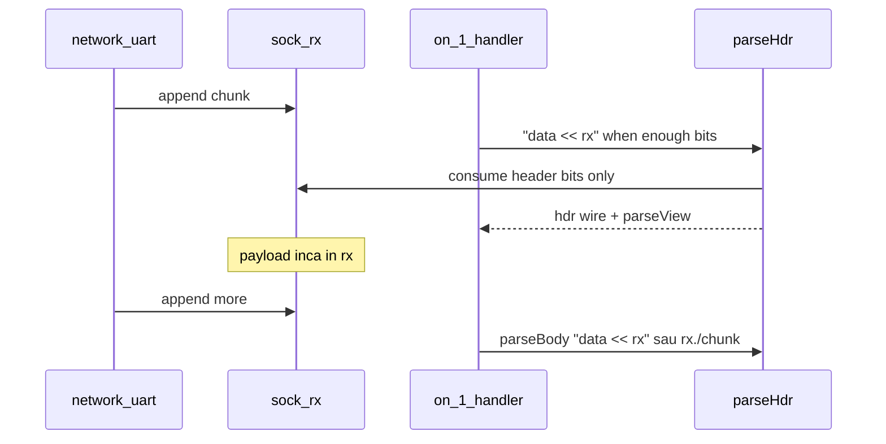

# Faza 1.3 — Protocol + sock (refinare)

Plan părinte: [`.cursor/plans/sock.plan.md`](sock.plan.md)

## Problema (azi vs sock)

**Azi** (`mode: parse`):

```logts
24wire out =: .parseHdr { data = packet }
```

- `packet` e **wire** — șir de biți **fix**, copiat la invoke.
- [`ParseStream`](../../v0_3_2/core/protocol-assembler.js) avansează **`pos`** pe copie; **`packet` nu se modifică**.
- Tot inputul trebuie deja într-un wire; parse **one-shot** pe blob static.

**Cu sock** vrem **parsare secvențială pe buffer live**: header consume din front, payload **rămâne în sock** pentru streaming / Wave.

---

## Semantica invoke: `=` vs `<<`

| Invoke | Semantica pe **sock** | Semantica pe **wire** (ca azi) |
|--------|----------------------|--------------------------------|
| `{ data = rx }` | **Peek** — snapshot la momentul invoke; parse pe copie; **`rx` nemodificat** | Copie bitstring în `ParseStream` |
| `{ data << rx }` | **Consume** — fiecare `read(n)` taie N biți din front; la succes, exact ce s-a parsat a ieșit din sock | N/A (wire nu suportă `<<` aici) |

**`payload << rx/(payloadLen)` după parse** — funcționează ca one-shot manual, dar e **anti-pattern în Wave**: materializezi payload-ul întreg într-un wire (copie masivă, pierzi streaming). Pentru modul wave, payload-ul **rămâne în `rx`**; procesezi incremental.

---

## Flux recomandat (streaming)



**Exemplu:**

```logts
inline [protocol] .parseHdr:
  mode: parse
  parseView: tree
  def packet:
    magic 8b
    opcode 4b
    len 8b
:

sock rx

# Peek — validate fara tăiere (optional)
# hdrTry =: .parseHdr { data = rx }

# Consume — productie
20wire hdr =: .parseHdr { data << rx }
# rx a pierdut 20b; payload (len = hdr:len) INCĂ in rx

# NU: payload << rx/(hdr:len)   # anti-pattern wave

# DA: al doilea proto sau chunk-uri
body =: .parseBody { data << rx, maxBits = hdr:len }
# sau procesare field-by-field fara wire gigant
```

**Incremental** = poți parsa **doar header-ul** într-un invoke; tail-ul rămâne în `rx` — **fără** copiere automată în wire.

---

## Wave: bucla „parse până nu mai poate, apoi așteaptă”

Invoke-ul **nu** pornește singur un loop infinit. Bucla e **naturală în Wave** când re-invoci la fiecare append / schimbare `BITSIZE`.

### Sintaxă validă (logTscript azi)

Blocul `on:` ([`conditional-assignment.md`](../../v0_3_2/doc/conditional-assignment.md)) — **nu** virgule în header; primul element din `{ … }` = trigger, restul = assignments:

```logts
on:<mode> {
  triggerExpr,
  assignment[, assignment…]
}
```

`show` e **apel funcție** cu paranteze ([`debug.md`](../../v0_3_2/doc/debug.md)) — **nu** stă în interiorul `on:` (blocul acceptă doar assignments).

**Exemplu Wave (syntax corectă, self-contained pentru doc `logts-play wave`):**

```logts-play wave
inline [protocol] .parseHdr:
  mode: parse
  parseView: tree
  out:
    magic 8b
    opcode 4b
    len 8b
  :

sock rx
1wire ready : 0
20wire hdr : 0

on:1 {
  AND(ready, GT(BITSIZE(rx), 10011)),
  hdr =: .parseHdr { data << rx }
}

ready = 1
rx << 0100100010101100000111110000

show(BITSIZE(rx))
show(hdr:opcode)
```

**Load & Run — ce demonstrează:**

1. `ready = 1` — pregătește trigger-ul (LSB=1 când și sock are destui biți).
2. `rx << …` — append 28 biți: header 20b (`magic`/`opcode`/`len`) + payload 8b.
3. `on:1` re-focusează când `AND(ready, GT(BITSIZE(rx), 10011))` trece 0→1 → `{ data << rx }` consumă **doar** header-ul.
4. `show(BITSIZE(rx))` → `1000` (8 biți payload rămas în sock, **fără** wire intermediar).
5. `show(hdr:opcode)` → `1010` — parseView pe wire-ul `hdr`.

**Pattern „parse până nu mai poate, apoi așteaptă”:** la fiecare append nou, dacă trigger-ul se schimbă din nou (biți suficienți), handler-ul poate re-invoca același `.proto`; când nu mai sunt biți, trigger rămâne 0 și aștepți următorul chunk.

| Pseudocod / intent greșit în draft | În limbaj |
|-------------------------------------|-----------|
| `on:1, ready, BITSIZE(rx) >= 20 { … }` | `on:1 { trigger, assign }` — virgulele sunt **înăuntrul** acoladelor |
| `BITSIZE(rx) >= 20` | `GT(BITSIZE(rx), 10011)` — `10011` = 19 → `GT` ⇒ ≥ 20 biți ([`builtin-GT.md`](../../v0_3_2/doc/builtin-GT.md); fără operator `>=`) |
| `show hdr:opcode` | `show(hdr:opcode)` — paranteze obligatorii |
| `show` în același `{ … }` cu assign | `show(...)` **după** blocul `on:` (statement separat) |

**Comportament (intent neschimbat):**

- Când trigger LSB = 0 → blocul **nu rulează** → aștepți append / `ready`.
- La `on:1`, trigger trebuie să **se schimbe** (LSB=1 și valoare nouă) — re-fire natural când cresc biții sau `ready` ([`conditional-assignment.md`](../../v0_3_2/doc/conditional-assignment.md)).
- După consume header, payload rămâne în `rx` pentru următorul ciclu / alt `.proto`.

**Underflow la `{ data << rx }`:** eroare **tranzacție** — zero tăiere parțială (identic cu `save`/`restore` din `ParseStream`). Nu „skip silent” în 1.3 — Wave folosește guard pe trigger (`GT(BITSIZE(rx), …)`).

*(Opțional viitor 1.3.1: atribut `short: skip` pe protocol pentru skip fără eroare — doar dacă apare nevoie reală.)*

---

## Modificări tehnice

### 1. Parser — [`parseProtocolInvoke`](../../v0_3_2/core/parser.js) (~4471)

Astăzi acceptă doar `argName = expr`. Extindere:

```logts
{ data = rx }    // peek
{ data << rx }   // consume
```

AST: `args[argName] = { expr, consume: true|false }`.

### 2. Interpreter — [`evalProtocolInvoke`](../../v0_3_2/core/interpreter.js) (~1389)

- Dacă `argExpr` e referință **sock** + `consume: false` → `ParseStream(snapshotBits)` — fără touch la buffer.
- Dacă sock + `consume: true` → **`SockParseStream`**:
  - `read(n)` → taie din `interpreter.socks.get(name)`
  - `save`/`restore` pentru rollback la eroare
  - `remaining` → `BITSIZE(rx)` live
- Dacă expr e wire/bitstring → comportament actual (copie statică).

### 3. `SockParseStream`

Nou în [`protocol-assembler.js`](../../v0_3_2/core/protocol-assembler.js) sau `interpreter.js`. Interfață identică cu `ParseStream` (linii 850–875) — `generateProtocol` rămâne neschimbat.

### 4. Doc

- [`sock.md`](../../v0_3_2/doc/sock.md) — înlocuiește secțiunea „Example — conditional consume (wave)” + adaugă secțiune **Protocol + sock** cu tabel `=` vs `<<`, anti-pattern payload→wire, și blocul `logts-play wave` self-contained de mai sus (Load / Load & Run).
- [`protocol-parse.md`](../../v0_3_2/doc/protocol-parse.md) — subsecțiune **Parse from sock**: param `data` poate fi referință sock; `{ data = rx }` peek; `{ data << rx }` consume + rollback.
- Regenerare: `node v0_3_2/node/_gen_doc_data.js` + `node v0_3_2/node/_gen_test_manifest.js`.

---

## Teste 2482–2488

**Notă:** ID-urile **2480–2481** sunt ocupate de Faza 1.2 (`watch(rx)`). Suite 1.3 pornește de la **2482**.

| ID | Scenariu |
|----|----------|
| 2482 | `{ data << rx }` — header consume; `BITSIZE(rx)` scade corect |
| 2483 | `{ data = rx }` — peek; după parse reușit, `BITSIZE(rx)` **neschimbat** |
| 2484 | literal mismatch cu `<<` → tranzacție; sock nemodificat |
| 2485 | underflow cu `<<` → eroare; sock nemodificat |
| 2486 | parseView `show(hdr:opcode)` după consume parțial |
| 2487 | wave: append incremental + `on:1 { AND(ready, GT(BITSIZE…)), hdr =: … { data << rx } }` |
| 2488 | wave: fără copiere payload în wire mare (verifică sock-only tail) |

---

## Ce NU e 1.3

- **Nu** e un protocol nou de tip — e **aceeași** `inline [protocol]` cu `mode: parse`.
- **Nu** consumă automat din sock fără invoke explicit `{ data << rx }`.
- **Nu** include bridge UART/file (→ 1.4 / amânat 1+a).

---

## Alternativa manuală (Fazele 1 / 1.1 — fără 1.3)

```logts
4wire opcode << rx./4
8wire len    << rx./8
```

Funcționează, dar **repeti** lățimi din protocol; 1.3 **sincronizează** parse cu definiția `.proto`.
