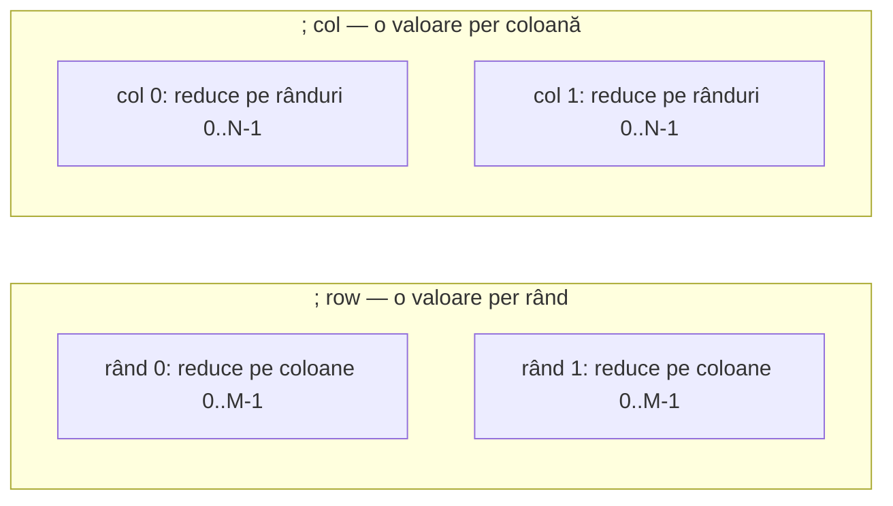
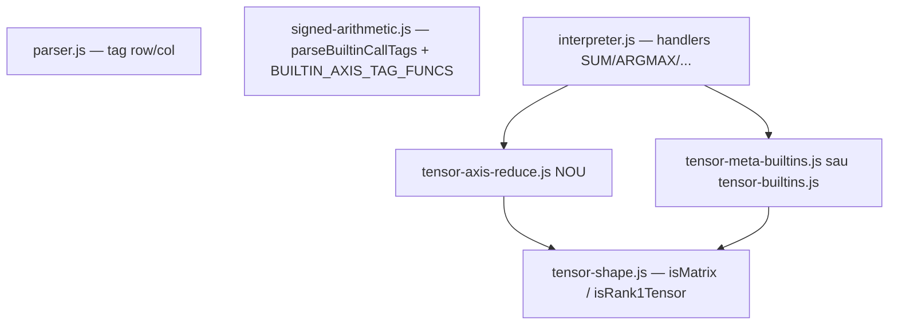

Plan: SHAPE / RANK + reduceri pe axă
---
name: Tensor meta și axe
overview: Adăugăm built-in-uri de metadata tensor (SHAPE, RANK) cu returnări scalare, plus tag-uri noi `; row` / `; col` pentru reduceri pe axă la SUM, MIN, MAX, ARGMAX și ARGMIN — aliniate cu convenția de indexare existentă din wire-vectors.md.
todos:
  - id: axis-tags
    content: Extinde parseBuiltinCallTags cu ; row / ; col + mutual exclusivity în signed-arithmetic.js
    status: completed
  - id: axis-reduce-module
    content: Creează tensor-axis-reduce.js (SUM/MIN/MAX/ARGMAX/ARGMIN pe axă)
    status: completed
  - id: meta-builtins
    content: Implementează SHAPE și RANK în interpreter + tensor-builtins helpers
    status: completed
  - id: interpreter-wire
    content: Ramuri axisMode în interpreter.js + BUILTIN_DOC + încărcare modul în test runner
    status: completed
  - id: tests
    content: Teste 1972+ pentru metadata, SUM/ARGMAX/MIN/MAX/ARGMIN pe row/col și erori
    status: completed
  - id: docs
    content: Doc hub + pagini builtin + tagged-index + node/_gen_doc_data.js
    status: completed
isProject: false
---

# Plan: SHAPE / RANK + reduceri pe axă

## Ce face fiecare funcție metadata (explicație)

Citesc **metadata din declarația wire-ului** la runtime (nu calculează din valoarea biților). Pentru `4wire[3,2] m`:


| Funcție   | Return                     | Semnificație                                                                                                     | Exemplu `4wire[3,2]` | Exemplu `4wire[5]` (rank-1) |
| --------- | -------------------------- | ---------------------------------------------------------------------------------------------------------------- | -------------------- | --------------------------- |
| **SHAPE** | `rows`, `cols` (2 scalari) | Dimensiunile tensorului în modelul intern row-major (axa 0 = rows, axa 1 = cols)                                 | `3`, `2`             | `1`, `5`                    |
| **RANK**  | 1 scalar                   | Număr de **axe semnificative**: `1` = rank-1 (`[N]`, `[1,N]`, `[N,1]`); `2` = matrice adevărată (`R>1` și `C>1`) | `2`                  | `1`                         |


**DIMS** — nu se implementează; ar fi fost alias la SHAPE (aceeași pereche `rows`, `cols`). Păstrăm doar **SHAPE**.

Lățimea scalarilor SHAPE: `bitIndexWidth(max(rows, cols))` (aceeași regulă ca la `ARGMAX(...; index)`). RANK: `1wire` sau `2wire` (suficient pentru valorile 1 și 2).

Semnături:

```
SHAPE(Wwire tensor) -> bit rows, bit cols
RANK(Wwire tensor)  -> 1wire scalar
```

Cerință: argument **whole tensor** (aceeași validare ca `TRACE` / `ARGMAX` — folosește `MR.isWholeTensorWireArg` + `VR.isWholeVectorWireArg`).

---

## Reduceri pe axă — semantica tag-urilor

Tag-uri noi: `**; row**` și `**; col**` (mutual exclusive între ele și cu `; vector` / `; matrix`).

Convenție aliniată cu [wire-vectors.md](v0_3_2/doc/wire-vectors.md) (`m:r` = rând, `m::c` = coloană):




| Apel                         | Input                | Output                              | Semnificație                             |
| ---------------------------- | -------------------- | ----------------------------------- | ---------------------------------------- |
| `SUM(m; row)`                | `4wire[N,M]` matrice | `Wbit[N]` + `Wbit[N] over`          | sumă pe fiecare **rând** (pe coloane)    |
| `SUM(m; col)`                | matrice              | `Wbit[M]` + `Wbit[M] over`          | sumă pe fiecare **coloană** (pe rânduri) |
| `MIN/MAX(m; row|col)`        | matrice              | `Wbit[N]` sau `Wbit[M]`             | min/max pe axă                           |
| `ARGMAX(m; row)`             | matrice              | `1wire[M]` packed × N **sau** index | per rând: one-hot pe coloane (default)   |
| `ARGMAX(m; row; index)`      | matrice              | `bitIndexWidth(M) wire[N]`          | index coloană câștigătoare per rând      |
| `ARGMAX(m; col)` / `; index` | matrice              | simetric pe coloane                 | index rând per coloană                   |
| `ARGMIN(...)`                |                      |                                     | același pattern ca ARGMAX                |


**Constrângeri V1:**

- Reducerile pe axă cer **matrice** (`R>1`, `C>1`) — pe rank-1 → eroare: `use scalar SUM / ARGMAX without col|row tag` (același text pentru MIN/MAX/ARGMIN unde e cazul).
- `; signed` combinat cu `; row` / `; col` unde funcția acceptă deja `signed`.
- `; index` doar pe ARGMAX/ARGMIN (ca azi).

**Default ARGMAX pe axă:** fără `; index`, return **one-hot pe axa redusă**, packed row-major:

- `ARGMAX(m; row)` → `1wire[N×M]` cu exact **un** `1` per rând (în segmentul de `M` biți al rândului).
- `ARGMAX(m; col)` → `1wire[N×M]` cu un `1` per coloană.

Cu `; index row` / `; index col` → vector de indici (mai util în ML).

---

## Arhitectură cod




### Fișiere principale

1. **[signed-arithmetic.js](v0_3_2/core/signed-arithmetic.js)**
  - `BUILTIN_AXIS_TAG_FUNCS` = `SUM`, `MIN`, `MAX`, `ARGMAX`, `ARGMIN`
  - Extinde `parseBuiltinCallTags` cu `row` / `col` (mutual exclusive: `row`+`col`, `row`+`vector`, `row`+`matrix`, etc.)
  - Propagă `axisMode: null | 'row' | 'col'` în interpreter
2. **[tensor-axis-reduce.js](v0_3_2/core/tensor-axis-reduce.js)** (modul nou)
  - `sumAxisTagged`, `minMaxAxisTagged`, `argExtremumAxisTagged`
  - Reutilizează `VR.sumExpanded`, compare helpers, `evalCell` din `_matrixTaggedEvalFns()`
  - Validare shape + lățimi output
3. **[tensor-builtins.js](v0_3_2/core/tensor-builtins.js)** (extindere)
  - `readShapeScalars(meta)` → `{ rows, cols, rank }`
  - Helpers pentru lățime index
4. **[interpreter.js](v0_3_2/core/interpreter.js)**
  - Handlers `SHAPE`, `RANK` (înainte de fold-ul generic)
  - Ramuri `axisMode` în `SUM`, `MIN`, `MAX`, `ARGMAX`, `ARGMIN` (înainte de scalar / vector / matrix existente)
  - `BUILTIN_DOC` + lista `isBuiltin` (~linia 3486)
  - Încărcare script HTML/test runner pentru noul modul JS
5. **Teste** — [test_suite.js](v0_3_2/tests/test_suite.js) (~1972+)
  - Metadata: `4wire[3,2]`, `4wire[5]`, `4wire[3,1]`
  - `SUM(m; row)` / `SUM(m; col)` — valori cunoscute 2×2
  - `ARGMAX(m; row; index)` / `; col; index`
  - `MIN`/`MAX` pe axă + `signed`
  - Erori: rank-1 + `; row` (mesaj `without col|row tag`), `; row` + `; matrix`
6. **Documentație**
  - [builtin-SHAPE.md](v0_3_2/doc/builtin-SHAPE.md), [builtin-RANK.md](v0_3_2/doc/builtin-RANK.md) (sau hub scurt `tensor-metadata.md`)
  - [vector-reduction.md](v0_3_2/doc/vector-reduction.md) — secțiune „Axis reduction (`; row` / `; col`)”
  - [matrix-reduction.md](v0_3_2/doc/matrix-reduction.md) — tabel axe
  - [builtin-tagged-index.md](v0_3_2/doc/builtin-tagged-index.md) — coloane `row` / `col`
  - [builtin-functions.md](v0_3_2/doc/builtin-functions.md) — categorie Tensor
  - `node/_gen_doc_data.js`

---

## Exemple țintă (doc + teste)

```logts
4wire[2,2] m = 0001 + 0010 + 0100 + 1000
1wire r, 1wire c = SHAPE(m)          # r=1, c=2 (bitIndexWidth)
1wire rank = RANK(m)                 # 2

4wire[2] rowSum, 4wire[2] ov = SUM(m; row)
1wire[2] colIdx = ARGMAX(m; row; index)
4wire[2] colMin = MIN(m; col)
```

---

## Ordine implementare

1. Tag parser (`row`/`col`) + modul axis reduce + teste unitare SUM/ARGMAX
2. MIN/MAX + ARGMIN pe axă
3. SHAPE + RANK + teste metadata
4. Documentație + regen manifest/doc

## Note de design

- **Doar SHAPE** pentru perechea `rows`/`cols` — fără alias DIMS.
- **ROI**: înlocuiește pattern-ul manual `MSLICE` + `ARGMAX` pe fiecare rând/coloană.
- **Viitor (out of scope)**: `PREFIX` scan, `WHERE` masked select, reduceri pe axă pentru `DOT` — nu în acest plan.

