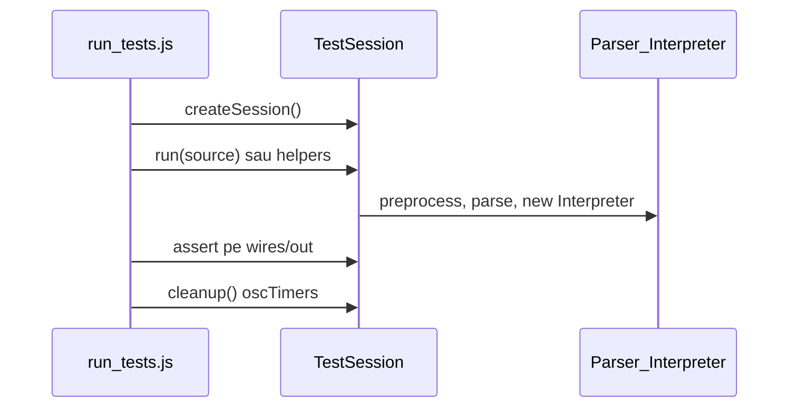

# Plan: Test runner browser cu TestSession izolat

## Ideea centrală

Fiecare rulare de test = **obiect nou**, fără `vm`:



Echivalentul din editor ([`app.js`](d:\wamp64\www\logic\library\logTscript\v0_3_2\ui\app.js) L99–112), dar **per test**, nu `globalInterp` partajat.

---

## Răspuns detaliat la întrebarea 4 (surse LogTScript)

La portare, fiecare test are un **string sursă** LogTScript (sau input pentru tokenizer/preprocessor). Există două strategii:

| Strategie | Ce înseamnă | Avantaje | Dezavantaje |
|-----------|-------------|----------|-------------|
| **A — Copiere literală** | Copiezi din [`test_repeat.js`](d:\wamp64\www\logic\library\logTscript\v0_3_2\test_repeat.js) exact același `src` / `preprocessRepeat(\`...\`)` | Paritate ușor de verificat cu `node test_repeat.js`; acoperi același caz limită | Stringuri lungi, uneori greu de citit |
| **B — Rescriere simplificată** | Rescrii sursa păstrând **intenția** (ex. 3 wire-uri în cascadă, nu neapărat aceleași nume) | Teste mai scurte, mai clare în `test_suite.js` | Risc să testezi altceva subtil; trebuie revalidat manual |
| **C — Hibrid (recomandat)** | **Implicit A** pentru teste cu surse scurte sau cazuri sensibile (PCB, padding, repeat, bitrange). **B** doar când sursa originală e redundantă sau doar pentru lizibilitate, cu comentariu scurt „intent: …” | Echilibru între paritate și mentenanță | Necesită judecată per test |

**Recomandare pentru implementare:** strategia C. La rescriere, păstrezi obligatoriu:
- ce **intrare** se dă (sursă / wire setat)
- ce **ieșire** se verifică (wire, pout, `out[]`, throw message)
- **titlul** și **id-ul** din manifest (ca în CLI)

Nu traducem linie cu linie `run500` / `getPcbPout500` — înlocuim cu `session.run(src)` + `session.getWire()` / `session.getPcbPout()`.

---

## Arhitectură fișiere

| Fișier | Rol |
|--------|-----|
| [`test_session.js`](d:\wamp64\www\logic\library\logTscript\v0_3_2\test_session.js) | **Nou** — `TestSession` + `createSession()` |
| [`test_manifest.js`](d:\wamp64\www\logic\library\logTscript\v0_3_2\test_manifest.js) | **Nou** — listă completă `{ id, title, groupId }` extrasă din test_repeat (fără teste comentate 1–5, 11–12, 18) |
| [`test_suite.js`](d:\wamp64\www\logic\library\logTscript\v0_3_2\test_suite.js) | Doar `reg(id, group, title, run(h, session))` — rescrise manual, incremental |
| [`run_tests.js`](d:\wamp64\www\logic\library\logTscript\v0_3_2\run_tests.js) | Harness + UI; **session nou per test**; placeholder-e |
| [`run_tests.html`](d:\wamp64\www\logic\library\logTscript\v0_3_2\run_tests.html) | Încărcare core complet (ca [`script_editor_v0_3_2.html`](d:\wamp64\www\logic\library\logTscript\v0_3_2\script_editor_v0_3_2.html)) |
| [`_gen_test_suite.js`](d:\wamp64\www\logic\library\logTscript\v0_3_2\_gen_test_suite.js) | Opțional: generează doar `test_manifest.js` din headers; **nu** mai generează corpuri test |

### TestSession (API propus)

```js
function createSession() {
  return {
    registry: createComponentRegistry(),  // nou per test
    interp: null,
    out: [],

    tokenize(src) { ... },               // preprocessor-only tests
    parse(src) { ... },                   // parser-only
    run(src) { ... },                     // parse + exec → interp
    runDoc(src) { return this.run(src).out; },

    getWire(name) { ... },
    setWire(name, val) { ... },           // + updateConnectedComponents
    getPcbPout(instance, pout) { ... },

    cleanup() {                           // clearTimeout pe oscTimers
      if (this.interp?.oscTimers) { ... }
    }
  };
}
```

Pattern din app pentru cleanup osc ([`app.js`](d:\wamp64\www\logic\library\logTscript\v0_3_2\ui\app.js) L85–89) — apelat în `finally` după fiecare test.

### Semnătura test (păstrată ca acum)

```js
reg(600, 'signal', 'wire simplu — propagare cascadat', function(h, session) {
  const { interp } = session.run(`
1wire a = 0
1wire b = NOT(a)
1wire c = NOT(b)`);
  session.setWire(interp, 'a', '1');
  h.assert('600 b dupa a=1', session.getWire(interp, 'b'), '0');
  h.assert('600 c cascadat', session.getWire(interp, 'c'), '1');
});
```

Helpers pure (`gate`, `lshift`) rămân pe `session` sau funcții module-level în `test_suite.js` (ca acum pe `ctx`).

---

## UI: manifest + placeholder-e (alegerea ta)

Flux:

1. `test_manifest.js` — toate testele active din `test_repeat.js` (~280 intrări, fără blocurile comentate).
2. `test_suite.js` — map `id → run function` doar pentru cele portate.
3. `run_tests.js` construiește lista din **manifest**, nu doar din `suite.tests`:
   - **Portat** — dot gri, buton ▶, rulează `run(h, createSession())`
   - **Neportat** — dot gri, text „not ported”, fără ▶ (sau ▶ disabled)
   - După run — verde/roșu ca acum

Grupurile în **ordinea numerică** din test_repeat:

1. `repeat` (6–21)
2. `gates-reduce` (22–37)
3. `shifts` (40–52)
4. `bitrange` (53–60)
5. `bit-ops` (61–81)
6. `wire-init` (82–101)
7. `short-notation` (102–133)
8. `osc` (134–153)
9. `registry` (200–223)
10. `doc` (300–352)
11. `doc-comp` (400–427)
12. `pcb` (500–515)
13. `signal` (600–606)
14. `reg` (700–703)

`rangeLabel` în header grup = min–max id din manifest pentru acel grup (inclusiv neportate).

---

## Modificări în run_tests.js (important)

**Acum:** un singur `ctx = suite.createContext()` partajat (L10) — preprocessor-only OK, dar **greșit** pentru viitoarele teste interpreter.

**După:**

```js
async function runOneTest(test) {
  const session = suite.createSession();
  const h = createHarness();
  try {
    if (test.run) test.run(h, session);
    else { /* not ported — skip */ }
  } catch (e) { h.setUnexpected(e); }
  finally { session.cleanup(); }
}
```

`Run group` / `Run All` — rulează doar testele cu `test.run` definit; opțional buton separat „Run ported only”.

---

## run_tests.html — încărcare scripturi

Pentru teste interpreter/PCB/signal/REG, încarcă același stack ca editorul:

- `tokenizer.js`, `preprocessor.js`
- toate `core/components/*.js`, `parser.js`, `interpreter.js`, `signal-propagation.js`
- `test_session.js`, `test_manifest.js`, `test_suite.js`, `run_tests.js`

Subsetul preprocessor (6–153 parțial) funcționează și cu stack complet încărcat.

---

## Migrare incrementală (fără prioritate forțată, ordine numerică)

### Faza 0 — Infrastructură
- Implementează `test_session.js` + `createSession()` exportat din `test_suite.js` (sau global `LogTScriptTestSuite.createSession`)
- Generează `test_manifest.js` (script mic care parsează headers din test_repeat, exclude `/* */`)
- Actualizează `run_tests.js` + `run_tests.html`
- Refactor: cele **120 teste** existente → `run(h, session)`; înlocuiește `ctx` cu `session` (API echivalent pentru tokenize/gate)

### Faza 1 — Completare grupuri „ușoare” (fără Interpreter)
- Portare manuală: **90–101** (parser via `session.parse`), **134–142, 148–152** (osc parser)
- Sursă: strategie C, copiere literală din test_repeat unde e scurt

### Faza 2 — Registry **200–223**
- Teste pe `session.registry`, `session.parse`, handler `applyProperties` cu mock-uri locale (fără interpreter)
- Registry nou per test deja asigurat

### Faza 3 — Interpreter: doc **300–352**, doc-comp **400–427**
- `session.runDoc()`, assert pe `session.out`
- `Interpreter.getDocLines` — static read-only, fără izolare specială

### Faza 4 — PCB **500–515**
- `session.run(src)`, `session.getPcbPout`, `session.setWire` pentru scenarii alternative
- Sursi LogTScript — preferat copiere literală (comportament PCB sensibil)

### Faza 5 — Signal **600–606** + REG **700–703**
- `setWire` + propagare; verificare `getWire`
- cleanup osc după fiecare test

### Faza 6 — Validare paritate (opțional)
- Script Node mic care rulează aceleași assert-uri pe session API vs test_repeat pentru grupuri portate
- Nu e obligatoriu dacă rescrierea e după intenție cu surse copiate

---

## Ce NU mai facem

- **Nu** convertim mecanic tot `test_repeat.js` cu `_gen_test_suite.js`
- **Nu** folosim `vm` / `fs` în browser
- **Nu** modificăm [`test_repeat.js`](d:\wamp64\www\logic\library\logTscript\v0_3_2\test_repeat.js) (rămâne pentru Node până la deprecare)

---

## Riscuri și mitigări

| Risc | Mitigare |
|------|----------|
| `setTimeout` osc rămâne activ între teste | `session.cleanup()` în `finally` |
| Test rescris diferit de original | Strategie C + comparare cu test_repeat la portare |
| `run_tests.js` lent la Run All cu osc | cleanup + `await` 0 între teste (deja există) |
| Manifest dezactualizat când se adaugă teste în test_repeat | Regenerare manifest: `node _gen_manifest.js` |

---

## Criterii de „gata” per test portat

1. Apare în manifest cu ▶ activ
2. `run(h, session)` folosește `createSession()` izolat (nu state partajat)
3. Assert-urile reflectă aceeași intenție ca titlul din test_repeat
4. Pass în browser; pentru grupuri critice, spot-check vs Node
