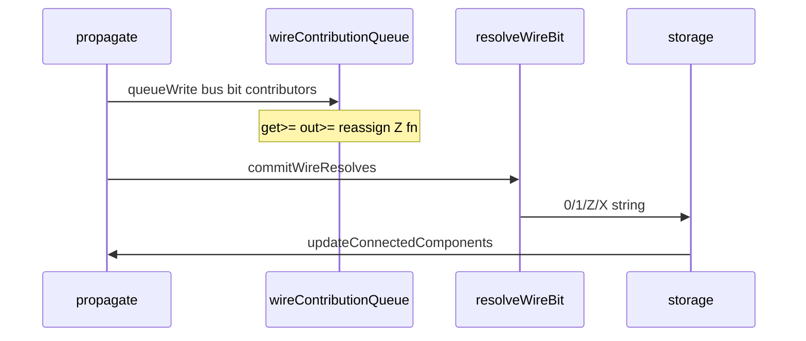
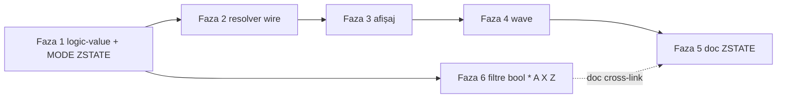

# Tristate / ZSTATE — plan engine (B4)

Referință: [future-component-ideas.md](v0_3_2/doc/future-component-ideas.md) secțiunea B4.

**Revizie plan (confirmată):** fără varianta MUX, fără `comp [bus]` / `comp [buffer]`. Totul în engine sub `MODE ZSTATE`.

---

## Decizii de design

| Subiect | Decizie |
|---------|---------|
| Activare | **`MODE ZSTATE`** opt-in (ca `MODE WIREWRITE` / `MODE STRICT`) — scripturile existente neschimbate |
| Init wire | În ZSTATE: `8wire databus` **fără** `=` → `ZZZZZZZZ` |
| Fără driver în pas | **Z pe toți biții** (tristate real, nu hold) |
| Multi-driver | Permis în ZSTATE: `get>=` / `out>=`, re-assign, mai multe surse în **același pas** de propagare |
| Conflict | 2+ surse cu valori diferite pe același bit → **`X`**, fără eroare runtime |
| Acord | 2+ surse cu aceeași valoare pe bit → `0` sau `1` |
| Eliberare explicită | Built-in **`Z(wireName)`** — setează toți biții la Z |
| Porți logice | **IEEE 1164** când operanzii conțin Z/X (în ZSTATE sau global pe fire cu Z/X) |
| Componente noi | **Niciuna** |
| **X pe wire** | **Nu e sticky** — se recalculează la fiecare commit; un singur driver curat în pasul următor → `0`/`1` |
| **Folosire X** | **show/peek/probe/watch** — mereu OK; **porți** — IEEE (fără eroare); **arithmetic/MUX/LUT/REG/shift** — **eroare la eval** |
| **Literal Z/X în sursă** | Prefix **`?`** obligatoriu când literalul începe cu `Z` sau `X`; doar în `MODE ZSTATE` |

---

## Semantica valorii `X` (conflict)

`X` = rezultatul resolverului când 2+ surse au pus valori diferite pe același bit **în același pas**. Nu e o „stare permanentă” a firelui.

### Poate fi „resetat” la 0 sau 1?

**Da**, în trei moduri — fără operator special:

1. **Pasul următor, un singur driver** — conflictul dispare, resolverul produce `0` sau `1` pe biții respectivi.
2. **`Z(wireName)`** — eliberare explicită → toți biții `Z` (nu `0`/`1`, dar scoate `X`).
3. **Niciun driver în pas** → `Z` (conform regulii `z_always`).

`X` nu „blochează” firele; la commit-ul următor se reevaluează din contribuțiile pasului curent.

```logts
// Pas 1: cpuEn=1 ramEn=1, valori diferite pe bit0 → databus[0]=X
// Pas 2: cpuEn=1 ramEn=0 → un singur driver → databus[0]=0 sau 1 (reset natural)
```

### Eroare la folosirea unui wire cu `X`?

**Nu la citire pentru afișaj** — scopul pedagogic e să vezi conflictul:

```logts
show(databus)   // OK → 101X01ZZ
probe(databus)  // OK
```

**Nu la porți logice** — IEEE 1164 propagă `X` (ex. `OR(1, X) = 1`, `AND(1, X) = X`). Elevul vede efectul conflictului în logică.

**Da — eroare la eval** pentru operații care presupun binar pur (nu au semantica IEEE definită):

| Categorie | Exemple | Comportament |
|-----------|---------|--------------|
| Aritmetică | `ADD`, `SUBTRACT`, `+`, `parseInt` | Eroare dacă operandul conține `X` sau `Z` |
| Rutare | `MUX`, `DEMUX` (sel sau date cu X) | Eroare |
| Secvențial | `REG`, `LATCH`, mem address | Eroare |
| LUT / ASM | adresă cu X | Eroare |
| Shift / rotate | operand cu X | Eroare |

Mesaj tip: `Wire 'databus' has unresolved value (X) at bit 3` sau `cannot use wire with Z/X in ADD`.

**Nu** dăm eroare „la următoarea folosire” generică — doar când expresia **necesită** binar definit. `show` după conflict rămâne mereu valid.

**Confirmat:** varianta strictă (eroare la orice citire a unui wire cu `X`, inclusiv porți) — **respinsă**. Rămâne modelul de mai sus.

### Rezumat

| Acțiune | Wire cu `X` |
|---------|-------------|
| `show` / `peek` / `probe` / `watch` | OK |
| `AND` / `OR` / `NOT` / … | IEEE, fără eroare |
| `ADD` / `MUX` / `REG` / … | Eroare la eval |
| Pas nou, un driver curat | `X` → `0`/`1` automat |
| `Z(wire)` | `X` → `Z` |

---

## Literal `Z` / `X` în declarație wire

### Are sens?

**Da**, dar cu roluri diferite:

| Literal | Rol pedagogic |
|---------|----------------|
| **`Z`** | Echivalent explicit cu wire fără `=` sau cu `Z(wire)` — „nedrivit” |
| **`X`** | **Seed pentru teste/demo** (`show`, `probe`, porți IEEE) — în scenarii reale X vine de la **resolver** (conflict), nu din sursă |

Nu înlocuiește conflictul din multi-driver; îl **simulează** la init pentru laborator.

### Sintaxă — **confirmat**

Prefix **`?`** când literalul **începe cu `Z` sau `X`** (lexerul altfel le citește ca identificator):

```logts
MODE ZSTATE

3wire btest = ?X1X      // MSB→LSB: X, 1, X
8wire bus   = ?ZZZZZZZZ // echivalent 8wire bus fără =
3wire mix   = ?Z01      // începe cu Z → necesită ?
```

Dacă literalul **începe cu `0` sau `1`**, rămâne sintaxa binară existentă, extinsă cu `Z`/`X` în mijloc:

```logts
3wire mix2 = 10Z      // fără ? — token digit-started
3wire ok   = 101      // binar pur, ca azi
```

Reguli:
- Permis **doar** cu `MODE ZSTATE` activ
- Caractere permise în literal logic: `0`, `1`, `Z`, `X`
- Lățimea = lățimea wire
- **`?` + `Z(wire)`** — fără conflict (prefix vs apel funcție)

**Confirmat de user:** varianta cu `?` înainte când începe cu `X` sau `Z`.

### Comportament după init

Literalul `?X1X` setează starea inițială; la pasul următor cu multi-driver, resolverul **suprascrie** din contribuții.

---

## Comportament față de modul curent

```mermaid
flowchart TB
  subgraph default [Mod curent - fara ZSTATE]
    W1[8wire q = 1010] --> S1[un singur driver]
    S1 --> L1[ultimul castiga binar 0/1]
  end
  subgraph zstate [MODE ZSTATE]
    W2[8wire bus fara =] --> Z0[init ZZZZ]
    D1[get>= bus cpu] --> Q[queue contributii]
    D2[bus = ramData] --> Q
    Zfn[Z bus explicit] --> Q
    Q --> R[commitWireResolves]
    R --> Out["0/1/Z/X per bit"]
  end
```

**Exemplu țintă:**

```logts
MODE ZSTATE

8wire databus
8wire cpuData = 10101010
8wire ramData = 11001100
1wire cpuEn
1wire ramEn

.cpu:{ get >= databus
  set = cpuEn }
.ram:{ get >= databus
  set = ramEn }

// cpuEn=1 ramEn=0 → databus = cpuData
// ambele 1 și valori diferite → biți conflict = X
// ambele 0, nimeni nu scrie → databus = ZZZZZZZZ
// explicit release:
Z(databus)
```

**Enable fără componentă buffer:** când `en=0`, sursa **nu contribuie** în pasul curent (nu face assign / redirect). Dacă niciun contributor pe wire → Z. Pentru eliberare explicită din logică: `Z(databus)`.

---

## Arhitectură engine

### Resolver per wire, per pas (precedent mem)

Model [mem multi-port](v0_3_2/core/components/mem.js): colectare în pas, commit la sfârșit.



**Reguli `resolveWireBit(contributors[])` per bit:**

| Contributori activi (0/1) | Rezultat |
|---------------------------|----------|
| niciunul (doar Z sau absenți) | `Z` |
| unul singur | valoarea lui |
| 2+ cu aceeași valoare | `0` sau `1` |
| 2+ cu valori diferite | `X` |

`Z(wireName)` înregistrează contribuție Z pe toți biții (echivalent „release bus”).

### Relație `MODE ZSTATE` ↔ `MODE WIREWRITE`

- ZSTATE **include** re-assign pe același wire (ca WIREWRITE).
- În ZSTATE, re-assign-urile multiple din același pas **nu** suprascriu silențios — intră în coadă și se rezolvă.
- Fără ZSTATE: comportament actual (ultimul câștigă, binar).

---

## Faze de implementare

### Faza 1 — `logic-value.js` + `MODE ZSTATE` + `Z()` (~4–5 zile)

**Fișiere:**
- [core/logic-value.js](v0_3_2/core/logic-value.js) — **nou**
- [core/tokenizer.js](v0_3_2/core/tokenizer.js) — keyword `ZSTATE`
- [core/parser.js](v0_3_2/core/parser.js) — `MODE ZSTATE` (alături de STRICT/WIREWRITE)
- [core/interpreter.js](v0_3_2/core/interpreter.js) — `this.mode` / flag `zstate`, built-in `Z(wire)`

**Porți IEEE 1164** (activ când operanzii au Z/X):

| Gate | Regulă |
|------|--------|
| AND | orice `0`→`0`; toate `1`→`1`; altfel `X` |
| OR | orice `1`→`1`; toate `0`→`0`; altfel `X` |
| NOT | `0`↔`1`; `Z`→`X`; `X`→`X` |
| XOR | `X` dacă operand necunoscut și nu e caz trivial |

**Teste:** 1222–1240 (mode flag, Z(), porți 1-bit și vectoriale).

### Faza 2 — Init Z + coadă contribuții + commit (~5–6 zile)

**Fișiere:**
- [core/interpreter.js](v0_3_2/core/interpreter.js) — `ensureWireSlot` init Z în ZSTATE; `queueWireContribution`, `commitWireResolves`; hook în `scheduleWireChange` / redirect `get>=`
- [core/signal-propagation.js](v0_3_2/core/signal-propagation.js) — `beginWireResolvePhase` / `commitWireResolves` în `_finishPropagate` și bucla Wave (model `beginAllMemWritePhases`)

**Puncte de intrare multi-driver:**
- Redirect `get>=` / `out>=` / `top>=` etc.
- Re-assign `wire = expr` în același pas
- Apel `Z(wireName)`

**Teste:** 1241–1265 (~25): init Z, un driver, dual agree, dual conflict→X, triple, zero driveri→Z, tranziție en on/off, wave ordering.

### Faza 3 — Storage, afișaj, timeline (~4–5 zile)

| Zonă | Fișier | Schimbare |
|------|--------|-----------|
| formatValue / hex | `interpreter.js` | Z/X literal; hex doar pe biți 0/1 |
| show / peek / probe | `interpreter.js` | Afișează `101X01ZZ` |
| watch | `interpreter.js` | `_watchCollapsedBit`: 0, 1, Z, X |
| timeline | [ui/timeline-analyzer.js](v0_3_2/ui/timeline-analyzer.js) | stiluri Z (gri?), X (roșu?) |
| app | [ui/app.js](v0_3_2/ui/app.js) | `showVars` |

**Teste:** 1266–1280.

### Faza 4 — Wave + device fallback (~3–4 zile)

- Edge detect: tranziții implică doar 0↔1; Z/X documentate
- LED / 7seg: Z/X → off sau caracter special
- `parseInt(_,2)` pe fire cu Z/X → eroare clară la arithmetic (nu în porți)

**Teste:** 1281–1290.

### Faza 5 — Documentație + regresie (~2–3 zile)

- [doc/zstate.md](v0_3_2/doc/zstate.md) — **nou**: MODE, Z(), multi-driver, conflicte, vs mod binar
- [doc/assignment-operators.md](v0_3_2/doc/assignment-operators.md) — ZSTATE + WIREWRITE
- [doc/builtin-functions.md](v0_3_2/doc/builtin-functions.md) — Z(), logic multi-valoare
- [doc/signal-propagation.md](v0_3_2/doc/signal-propagation.md) — fază commit wire
- [doc/future-component-ideas.md](v0_3_2/doc/future-component-ideas.md) — B4 → engine ZSTATE
- `script_editor_v0_3_2.html` — autocomplete MODE ZSTATE, Z(
- Regresie: **779+** teste existente verzi (fără MODE ZSTATE în ele)

### Faza 6 — Filtre analiză booleană `*` / `A` / `X` / `Z` (~3–4 zile)

Plan detaliat: [filtre_boolean_xz.plan.md](filtre_boolean_xz.plan.md).

**Scop:** `truthTableOf`, `lutOf`, `exprOfLut`, `simplify` — alfabet pattern extins, eval IEEE în analiză.

| Simbol | Rol |
|--------|-----|
| `*` | don't-care binar (0 sau 1) — înlocuiește vechiul `x`; **singurul** simbol care devine variabilă la `exprOfLut` |
| `A` | don't-care toate valorile (0, 1, X, Z) — enumerate în LUT, nu variabile QM |
| `X`, `Z` | valori fixe în pattern (ex. `A=01X11`) |
| `0`, `1` | fix binar |

**exprOfLut + `filters:`:** trebuie actualizat `varyingBitLabels`, `buildFilteredOutputsByMinterm`, `enumerateFilteredEnvs` (partajat cu `lutOf`) — vezi plan detaliat secțiunea 3.

**Dependență:** Faza 1 (`logic-value.js` — tabele IEEE 1164).

**Fișiere:** [boolean-lut.js](v0_3_2/core/boolean-lut.js), [boolean-analysis.js](v0_3_2/core/boolean-analysis.js), doc + teste 1291–1300.

**Nu afectează** runtime ZSTATE / fire. `simplify`/`exprOfLut`: literal X/Z dacă ieșire uniformă, altfel eroare.

---

## Ordine livrare (relația între cele două planuri)

| Document | Rol |
|----------|-----|
| [tristate_bus_buffer.plan.md](tristate_bus_buffer.plan.md) | Plan **principal** — faze 1–6 |
| [filtre_boolean_xz.plan.md](filtre_boolean_xz.plan.md) | Plan **detaliu** doar pentru Faza 6 (nu se livrează separat după ZSTATE) |

**Nu e:** tot ZSTATE → apoi un al doilea proiect independent.

**Este:**



| Ordine recomandată | Motiv |
|--------------------|-------|
| **1 → 2 → 3 → 4 → 5 → 6** | Linear, ZSTATE complet apoi analiză booleană |
| **1 → 6** (apoi 2–5) | Valid dacă vrei rapid `lutOf`/`exprOfLut` cu `*`/`X`/`Z` — Faza 6 depinde **doar** de `logic-value.js` (Faza 1), nu de resolver/timeline |
| **1 → 2 … 5** fără 6 | MVP ZSTATE fără extensia filtrelor (scripturile actuale cu `x` rămân până la Faza 6) |

**Dependență hard:** Faza 6 **după** Faza 1 (IEEE în `logic-value.js`). Fazele 2–5 și 6 sunt independente între ele.

---

## Efort estimat

| Fază | Zile (dev) | Teste |
|------|------------|-------|
| 1 logic + MODE + Z() | 4–5 | 1222–1240 |
| 2 resolver engine | 5–6 | 1241–1265 |
| 3 afișaj / timeline | 4–5 | 1266–1280 |
| 4 wave + devices | 3–4 | 1281–1290 |
| 5 doc + regresie | 2–3 | — |
| 6 filtre bool `*`/`A`/`X`/`Z` | 3–4 | 1291–1300 |
| Buffer fix regresie | 2–3 | — |
| **Total** | **~21–30 zile** | **~80 teste** |

Mai mic decât planul vechi cu `comp [bus]`/`[buffer]` (~4–5 zile economisești la componente/devices), dar tot **mare** — în special timeline și regresia.

**MVP funcțional headless** (faze 1–2, fără timeline fancy): **~10–12 zile**.

---

## Riscuri

1. Interacțiune `MODE ZSTATE` + `MODE WIREWRITE` + `MODE STRICT` — combinații de documentat și testat
2. Fire cu Z/X în `ADD`/`MUX`/`parseInt` — erori clare sau restricții
3. ~~`boolean-lut.js` — `x` don't-care ≠ wire Z~~ — **rezolvat în Faza 6:** `*` (binar), `A` (toate), `X`/`Z` (fixe); fără `toLowerCase` pe pattern
4. Propagare cascade: ordinea contribuțiilor în același pas nu trebuie să schimbe rezultatul resolverului
5. Regresie suite — ZSTATE strict opt-in

---

## Out of scope

- `comp [bus]`, `comp [buffer]` — respins
- Pattern MUX ca livrabil — respins (poate menționat în doc ca alternativă istorică)
- Pull-up / pull-down pe Z
- Built-in `BUS(en1,d1,...)` agregat
- Tristate în `comp [ioport]`
- ~~Literal sursă Z/X~~ — **în scope**: prefix `?` în ZSTATE (vezi secțiunea de mai sus)

---

## ID test alocate

- **1222–1290** (rezervat; ajustat la implementare)
