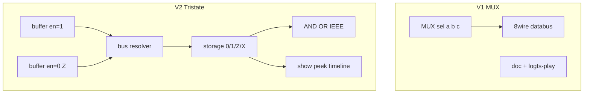
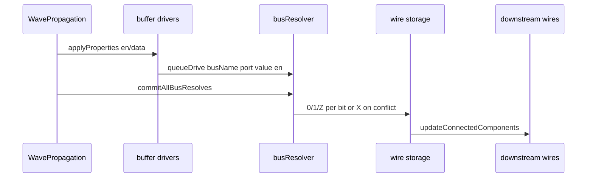

# Tristate / Bus Buffer (B4) — plan dual cu efort

Referință: [future-component-ideas.md](v0_3_2/doc/future-component-ideas.md) secțiunea B4.

Decizii deja luate în explorare:
- **Z real** în simulare (nu doar afișaj)
- **Porți logice**: model IEEE 1164 (0 domină AND, 1 domină OR, altfel X)
- **Arhitectură V2**: `comp [bus]` hub + `comp [buffer]` cu resolver la commit (precedent [mem multi-port](v0_3_2/core/components/mem.js) + [mem-devices.js](v0_3_2/devices/mem-devices.js))

---

## Comparație rapidă

| | **V1 — MUX pattern** | **V2 — Tristate complet** |
|---|---|---|
| Scop | Predare bus partajat fără schimbări engine | Model hardware: high-Z, conflict, porți multi-valoare |
| Engine | Niciuna | Storage, eval, propagare, tokenizer |
| Componente noi | 0 | `comp [bus]`, `comp [buffer]` |
| Teste noi | ~3–5 | ~35–50 |
| Doc | 1 pagină + exemple | pagină componentă + secțiuni engine |
| **Efort total** | **~1–2 zile** | **~18–28 zile** |



---

## V1 — Pattern MUX (documentație + exemple)

### Ce livrăm

Fără cod engine. Documentăm că bus partajat CPU/RAM/I/O se modelează astăzi cu `MUX()` — selectare explicită, nu high-Z.

Exemplu țintă (`logts-play`):

```logts
1wire cpuEn
1wire ramEn
1wire ioEn
2wire driveSel = cpuEn + (ramEn * 2) + (ioEn * 4)  // one-hot presupus

8wire cpuData = ...
8wire ramData = .ram:get
8wire ioData  = ...

8wire databus = MUX(driveSel, cpuData, ramData, ioData)
```

### Fișiere

| Fișier | Acțiune |
|--------|---------|
| [doc/bus-mux-pattern.md](v0_3_2/doc/bus-mux-pattern.md) | **nou** — pattern, limitări, comparație cu tristate real |
| [doc/future-component-ideas.md](v0_3_2/doc/future-component-ideas.md) | Link V1 done / V2 planned |
| [doc/mini-cpu-v2.md](v0_3_2/doc/mini-cpu-v2.md) sau [builtin-routing-functions.md](v0_3_2/doc/builtin-routing-functions.md) | Secțiune scurtă „shared bus via MUX” |
| [doc/doc-index.json](v0_3_2/doc/doc-index.json) + `_gen_doc_data.js` | Regenerare doc bundle |
| [test_suite.js](v0_3_2/test_suite.js) | 1222–1226: MUX 3-way bus, one-hot, width mismatch guard |

### Limitări documentate explicit

- Nu predă „două output-uri pe același fir fizic”
- Nu detectează conflict (două `en=1` simultan)
- Nu afișează Z
- Echivalent funcțional când `driveSel` e one-hot

### Efort V1 (detaliu)

| Task | Ore |
|------|-----|
| `bus-mux-pattern.md` + exemple playable | 4–6 |
| Actualizări doc încrucișate | 1–2 |
| Teste 1222–1226 + manifest | 2–3 |
| Review pedagogic | 1 |
| **Total V1** | **8–12 ore (~1–2 zile)** |

---

## V2 — Tristate complet (Z/X real + bus + buffer)

### Arhitectură



**Resolver per bit** (la commit, ca `commitMemWrites`):
- 0 driveri activi (`en=1`) pe bit → `Z`
- 1 driver activ → valoarea lui (0 sau 1)
- 2+ driveri activi cu valori diferite pe bit → `X` (sau eroare `Bus contention on .databus bit N` — recomandat: **X pe bit + warning opțional**, eroare strictă doar în `MODE STRICT`)

**Componente:**

```logts
comp [bus] .databus:
  width: 8
  :

comp [buffer] .cpuBuf:
  width: 8
  on: 1
  :

.cpuBuf:{ bus = .databus; data = cpuOut; en = cpuDrive; set = 1 }
.ramBuf:{ bus = .databus; data = ramOut; en = ramDrive; set = 1 }

8wire readData = .databus:get
```

| Componentă | Pins | Pouts | Note |
|------------|------|-------|------|
| `comp [bus]` shortname `[bus]` | — | `get` | Hub; starea rezolvată |
| `comp [buffer]` shortname `[buf]` | `bus`, `data`, `en`, `set` | `out` (opțional mirror) | Înregistrare driver la `bus` |

Alternativă respinsă pentru V2: doar `out>= wire` fără hub — nu permite rezolvare centralizată și conflict detection.

### Faza 2A — Modul logic multi-valoare (~4–5 zile)

**Fișier nou:** [core/logic-value.js](v0_3_2/core/logic-value.js)

- Alfabet: `0`, `1`, `Z`, `X`
- `resolveBusBit(drivers[])` → `{0,1,Z,X}`
- Truth tables IEEE pentru: `AND`, `OR`, `XOR`, `NXOR`, `NAND`, `NOR`, `NOT`, `EQ`
- `parseLogicString`, `formatLogicString`, `padLogic`, `toDisplayHex` (hex doar pe biți 0/1; Z/X afișate literal)

Reguli porți (fixate în plan):

| Gate | Regulă |
|------|--------|
| AND | orice `0`→`0`; toate `1`→`1`; altfel `X` |
| OR | orice `1`→`1`; toate `0`→`0`; altfel `X` |
| NOT | `0`↔`1`; `Z`→`X`; `X`→`X` |
| XOR | `X` dacă orice operand `Z`/`X` și nu e caz trivial |

Integrare în [interpreter.js](v0_3_2/core/interpreter.js) `call()` pentru porți — înlocuiește `x === '1'` cu evaluator din `logic-value.js` când orice operand conține Z/X.

**Teste:** 1227–1240 (porți 1-bit și vectoriale).

### Faza 2B — Storage și fire bus (~3–4 zile)

- Metadata wire: `wire.isBus` sau tip nou `8bus` (recomandat: **atribut pe declarație** `bus` pe `comp [bus]` + fire legate prin `:get`, nu tip lexer nou — mai puțin invaziv)
- [interpreter.js](v0_3_2/core/interpreter.js): `writeWireStable`, `fitWireAssignBits`, `formatValue`, `getWireStableValue` — acceptă Z/X; nu face `parseInt(s,2)` pe șiruri mixte
- [tokenizer.js](v0_3_2/core/tokenizer.js): opțional literal `8'b01Z0` sau sufix `Z` pe biți în show-only (minim: Z/X doar din resolver, nu din sursă literală în V2.0)

**Fișiere:** `interpreter.js`, `logic-value.js`, `signal-propagation.js` (padding paths).

**Teste:** 1241–1250.

### Faza 2C — Bus resolver + componente (~5–7 zile)

**Fișiere noi:**
- [core/components/bus.js](v0_3_2/core/components/bus.js)
- [core/components/buffer.js](v0_3_2/core/components/buffer.js)
- [devices/bus-resolver.js](v0_3_2/devices/bus-resolver.js) — registry driveri, queue, commit

**Integrări** (model mem):
- [core/interpreter.js](v0_3_2/core/interpreter.js): `busWriteBatching` flag analog `memWriteBatching`
- [core/signal-propagation.js](v0_3_2/core/signal-propagation.js): `beginAllBusPhases` / `commitAllBusResolves` în `_finishPropagate` / wave loop
- [core/components/index.js](v0_3_2/core/components/index.js): register

**Panel:** widget simplu pentru `bus` — afișaj valoare cu Z/X colorat (similar LED strip); `buffer` — formă buffer tri-state (opțional V2.1, poate fi doar `doc()` fără device complex la început).

**Teste:** 1251–1275 (~25 teste): un driver, zero driveri→Z, tranziție en, conflict→X, width mismatch, dual buffer mutual exclusive, `.databus:get` redirect, wave step ordering.

### Faza 2D — Afișaj debug (~3–4 zile)

| Zonă | Fișier | Schimbare |
|------|--------|-----------|
| show / peek / probe | `interpreter.js` | `formatValue` afișează Z/X |
| watch | `interpreter.js` `_watchCollapsedBit` | stări extinse: 0, 1, Z, X |
| timeline | [ui/timeline-analyzer.js](v0_3_2/ui/timeline-analyzer.js) | culori/stiluri Z (gri dashed?), X (roșu?) |
| app | [ui/app.js](v0_3_2/ui/app.js) | `showVars` compatibil |

**Teste:** 1276–1285 (show/probe/watch cu Z).

### Faza 2E — Wave și propagare (~3–5 zile)

- [signal-propagation.js](v0_3_2/core/signal-propagation.js): edge detect `prevBit==='0' && newBit==='1'` — ignoră tranziții din/în Z; documentează semantica
- `updateConnectedComponents`: propagă șiruri Z/X; componente LED/7seg primesc doar 0/1 sau se stinge la Z/X
- Coordonare cu [wave_signal_propagation plan](wave_signal_propagation_5efca976.plan.md) — evită regresii

**Teste:** 1286–1295.

### Faza 2F — Documentație și integrare (~2–3 zile)

- [doc/bus.md](v0_3_2/doc/bus.md), [doc/buffer.md](v0_3_2/doc/buffer.md)
- [doc/builtin-functions.md](v0_3_2/doc/builtin-functions.md) — secțiune logic multi-valoare
- [doc/future-component-ideas.md](v0_3_2/doc/future-component-ideas.md) — B4 marcat done
- [doc/signal-propagation.md](v0_3_2/doc/signal-propagation.md) — bus commit phase
- `script_editor_v0_3_2.html`, `_run_suite_node.js`, `run_tests.html`, `_gen_manifest.js`, `_gen_doc_data.js`

### Riscuri V2 (de ce e mult)

1. **~30+ funcții** în interpreter/signal-propagation presupun binar
2. **Regression suite** — 779+ teste existente trebuie să rămână verzi (Z/X doar pe fire bus, nu pe toate firele)
3. **Timeline UI** — cel mai mare efort vizual
4. **ASM / LUT / arithmetic** — `parseInt(_,2)` pe fire cu Z trebuie eroare clară sau exclus
5. **boolean-lut.js** — `x` don't-care ≠ wire Z; fără amestec

### Efort V2 (detaliu)

| Fază | Zile (dev) | Teste noi |
|------|------------|-----------|
| 2A logic-value + porți | 4–5 | 1227–1240 |
| 2B storage / wires | 3–4 | 1241–1250 |
| 2C bus + buffer + resolver | 5–7 | 1251–1275 |
| 2D show/peek/probe/timeline | 3–4 | 1276–1285 |
| 2E wave / propagare | 3–5 | 1286–1295 |
| 2F doc + integrare + regresie | 2–3 | — |
| Buffer regresie full suite | 2–3 | fixuri |
| **Total V2** | **22–31 zile** | **~70 teste** |

Estimare realistă: **~3–5 săptămâni** full-time pentru V2 complet; **~1–2 zile** pentru V1.

---

## Ordine recomandată de implementare

1. **V1 întâi** — valoare imediată, zero risc regresie
2. **V2A + V2B** — fundație logică fără UI
3. **V2C** — componente (MVP funcțional headless)
4. **V2D + 2E** — polish vizual și wave
5. **V2F** — doc final

V2 poate fi livrat incremental: **V2-MVP** = 2A+2B+2C fără timeline fancy (~12–16 zile).

---

## Out of scope (V2.0)

- Built-in `BUS(en1,d1,...)` — duplică resolver; amânăm
- Pull-up/pull-down pe bus Z
- Analog / rezistențe
- Tristate în `comp [ioport]`
- Ripple delay pe buffer

---

## ID test alocate

- V1: **1222–1226**
- V2: **1227–1295** (rezervat; ajustat la implementare)
