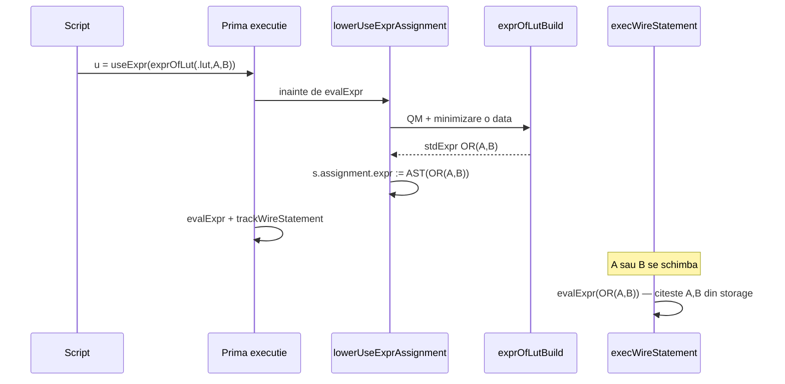
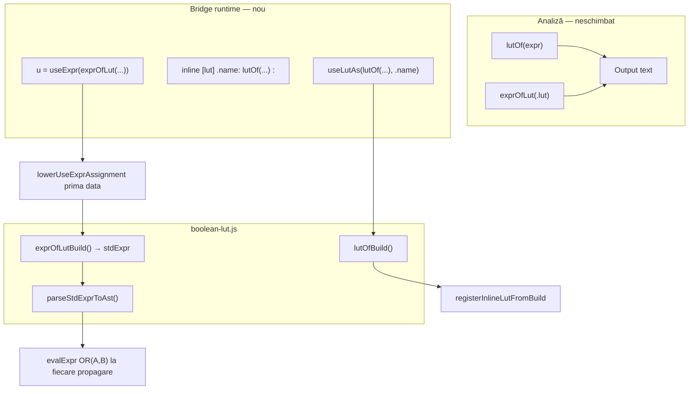

# Plan: `useLutAs` / `useExpr` — bridge runtime pentru boolean LUT

## Context

Astăzi [`lutOf`](v0_3_2/core/boolean-lut.js) și [`exprOfLut`](v0_3_2/core/boolean-lut.js) sunt **doar analiză**: emit text copy-pasteable în **Output** (vezi [`boolean-lut.md`](v0_3_2/doc/boolean-lut.md)). Round-trip-ul necesită lipire manuală.

**Obiectiv:** noi constructe care aplică același motor de generare **direct în runtime**, în același script, fără copy-paste — păstrând `lutOf`/`exprOfLut` neschimbate.

### Decizii confirmate

| Subiect | Decizie |
|---------|---------|
| `lutOf` / `exprOfLut` | **Neschimbate** — continuă să emită Output |
| `useLutAs` / `useExpr` | Bridge runtime + toolkit analiză; **nu** emit Output |
| `useExpr` formă | **Doar RHS** în asignare: `Nw u = useExpr(exprOfLut(...))` sau `u = useExpr(...)` după declarație |
| Nume instanță LUT | Ales de utilizator (ex. `.gen`, `.myLut`) |
| Notație runtime `useExpr` | **Standard** (`OR`, `AND`, …) — evaluabilă de `interpreter.call()` |
| **Re-executare `useExpr`** | **Lowering la prima execuție** — vezi secțiunea dedicată |
| Limite | Aceleași ca `lutOf`/`exprOfLut`: max 256 rânduri, max 8 biți intrare |

---

## Comportament la re-executare (`useExpr`)

### Problema

Asignările wire sunt urmărite în `wireStatements` și re-executate la propagare prin [`execWireStatement`](v0_3_2/core/interpreter.js) (linia ~4921), care apelează:

```javascript
const exprResult = this.evalExpr(s.assignment.expr, false);
```

Dacă AST-ul rămâne `{ useExpr: { exprOfLut: … } }`, la fiecare schimbare a lui `A` sau `B` s-ar re-rula **QM + citire LUT** — incorect și costisitor.

### Soluție: lowering la prima execuție

La **prima** evaluare a asignării (înainte de `evalExpr` și înainte de `trackWireStatement`):

1. Detectează `s.assignment.expr.useExpr`
2. Apelează `exprOfLutBuild(lutInst, varSpecs, widthResolver)` **o singură dată**
3. Parsează expresia standard rezultată (`OR(A, B)`, etc.) în AST normal via `parseStdExprToAst(stdExpr)`
4. **Înlocuiește** `s.assignment.expr` cu AST-ul lowered (mutare in-place pe statement)
5. Evaluează AST-ul lowered ca orice asignare wire



### Exemplu split declarație

```logts
1wire A := 0
1wire B := 1
1wire u
u = useExpr(exprOfLut(.myLut, A, B))
```

- Prima linie `1wire u` — declară wire (fără expr în `wireStatements`)
- A doua linie — la prima execuție: lowering → `u = OR(A, B)` în AST; apoi `trackWireStatement`
- Propagări ulterioare: doar `OR(A, B)` cu valorile curente ale lui `A` și `B`

### Implicații

| Aspect | Comportament |
|--------|--------------|
| `exprOfLut` / QM | O singură dată per statement |
| Dependențe propagare | După lowering: `A`, `B` (ca la `u = OR(A,B)` direct) |
| LUT modificat după lowering | Expresia lowered **nu** se actualizează — LUT trebuie definit înainte de `useExpr` |
| `collectExprDependencies` | Funcționează corect după lowering |
| Debug / show AST | Opțional: păstrăm `s.assignment.exprSource = 'useExpr(...)'` doar pentru doc, fără efect runtime |

### API intern

```javascript
// boolean-lut.js
function exprOfLutBuild(lutInst, varSpecs, widthResolver) {
  // return { depth, stdExpr }  // ex. "OR(A, B)" sau "OR(A, B) + OR(NOT(A), C)" multi-bit
}

// interpreter.js
lowerUseExprAssignment(s) {
  const expr = s.assignment?.expr;
  if (!expr?.useExpr) return;
  const lutInst = this._resolveLutInstance(expr.useExpr.exprOfLut.lutRef);
  const { depth, stdExpr } = exprOfLutBuild(lutInst, expr.useExpr.exprOfLut.varSpecs, this._makeWidthResolver());
  // verificare depth vs wire width
  s.assignment.expr = parseStdExprToAst(stdExpr);  // Parser mini-instance
  s.assignment._loweredFromUseExpr = true;         // optional flag
}
```

Apel în handler asignare wire (~linia 4406), **înainte** de `evalExpr` și `trackWireStatement` (~4479).

`execWireStatement` **nu** apelează lowering — expr e deja normalizat după prima execuție.

---

## Sintaxă țintă

### 1. `useLutAs(lutOf(expr [, filtre]), .nume)`

```logts-play
useLutAs(lutOf(OR(A, B)), .gen)
1wire a := 0
1wire b := 1
1wire y = .gen(in = `ab`)
show(y)
```

### 2. `inline [lut] .nume: lutOf(...) :`

```logts-play
inline [lut] .gen:
  lutOf(`A & B`)
  :
```

### 3. `Nw u = useExpr(exprOfLut(.lut [, vars…]))`

```logts-play
inline [lut] .myLut:
  depth: 1
  length: 4
  data { 00:0, 01:1, 10:1, 11:1 }
  :

1wire A := 0
1wire B := 1
1wire u = useExpr(exprOfLut(.myLut, A, B))
show(u)
```

---

## Arhitectură



---

## Estimare efort

| Fază | Lucru | Ore |
|------|-------|-----|
| **F0** Refactor `boolean-lut.js` | `lutOfBuild`, `exprOfLutBuild`, `parseStdExprToAst` | 4–5 |
| **F1** Parser | `useLutAs`, `parseLutOfCall`, `useExpr` în expr, inline body `lutOf` | 5–7 |
| **F2** Interpreter | `registerInlineLutFromBuild`, `_execUseLutAs`, **`lowerUseExprAssignment`** | 5–6 |
| **F3** Teste | 1192–1204 în [`test_suite.js`](v0_3_2/test_suite.js) | 4–5 |
| **F4** Documentație | [`boolean-lut.md`](v0_3_2/doc/boolean-lut.md) + lowering explicat | 2 |
| **Total** | | **20–25 ore** |

---

## Faza 0 — Refactor [`boolean-lut.js`](v0_3_2/core/boolean-lut.js)

- `lutOfBuild()` → structură pentru `registerInlineLutFromBuild`
- `exprOfLutBuild()` → `{ depth, stdExpr }` (fără formatare assignment)
- `lutOfGenerate` / `exprOfLutGenerate` — wrapper-e text neschimbate ca output
- `parseStdExprToAst(stdExpr)` — `new Parser(new Tokenizer(stdExpr)).expr()` sau helper dedicat

---

## Faza 1 — Parser [`parser.js`](v0_3_2/core/parser.js)

- `useLutAs(lutOf(...), .name)` — statement
- `parseLutOfCall()`, `parseExprOfLutCall()` — reutilizabile
- `useExpr(exprOfLut(...))` — nod în `expr()`, nu statement standalone
- `inline [lut]` body `lutOf(...)` — în `resolveLutBody`

---

## Faza 2 — Interpreter [`interpreter.js`](v0_3_2/core/interpreter.js)

- `registerInlineLutFromBuild(name, built)` — comun pentru `useLutAs` și inline body `lutOf`
- `_execUseLutAs(s)`
- **`lowerUseExprAssignment(s)`** — apelat din handler asignare wire, înainte de eval + track
- `evalExpr` — **fără** branch special `useExpr` (lowering face totul)

---

## Faza 3 — Teste (ID **1192–1204**)

Grup: `bool-lut-use`

| ID | Titlu |
|----|-------|
| 1192 | `useLutAs(lutOf(OR(A,B)), .gen)` — invocare |
| 1193 | `useLutAs` cu filtre |
| 1194 | `inline [lut] .gen: lutOf(\`A \| B\`) :` |
| 1195 | `useLutAs` — eroare LUT prea mare |
| 1196 | `1wire u = useExpr(exprOfLut(.lut, A, B))` — valoare inițială |
| 1197 | `useExpr` multi-bit |
| 1198 | `useExpr(exprOfLut(.lut))` cu `filters:` |
| 1199 | `useExpr` — width mismatch |
| 1200 | Round-trip `useLutAs` + `useExpr` |
| 1201 | `useExpr(...)` ca statement — parse error |
| 1202 | `inline [lut] .x: lutOf(...)` + wave dip |
| **1203** | **Propagare: `A`/`B` dip → `u` se actualizează fără re-QM** |
| **1204** | **Split decl: `1wire u` + `u = useExpr(...)` + propagare** |
| 1205 | Doc smoke |

Test 1203: după prima execuție, verificăm că `wireStatements[…].assignment.expr` **nu** mai conține `useExpr`; schimbăm `A` via dip/wire și assert `u` urmează `OR(A,B)`.

---

## Faza 4 — Documentație

Secțiune **Runtime bridge** în [`boolean-lut.md`](v0_3_2/doc/boolean-lut.md):

- Explică lowering: „`useExpr` compilează o dată; propagarea folosește expresia booleană”
- Exemplu split `1wire u` / `u = useExpr(...)` cu `logts-play`
- Tabel: `lutOf` vs `useLutAs` vs `useExpr`

Regenerare: `node v0_3_2/_gen_doc_data.js`

---

## Fișiere modificate

| Fișier | Schimbări |
|--------|-----------|
| [`v0_3_2/core/boolean-lut.js`](v0_3_2/core/boolean-lut.js) | `lutOfBuild`, `exprOfLutBuild`, `parseStdExprToAst` |
| [`v0_3_2/core/lut-labels.js`](v0_3_2/core/lut-labels.js) | body `lutOf(...)` |
| [`v0_3_2/core/parser.js`](v0_3_2/core/parser.js) | `useLutAs`, `useExpr` |
| [`v0_3_2/core/interpreter.js`](v0_3_2/core/interpreter.js) | `_execUseLutAs`, **`lowerUseExprAssignment`** |
| [`v0_3_2/test_suite.js`](v0_3_2/test_suite.js) | 1192–1205 |
| [`v0_3_2/doc/boolean-lut.md`](v0_3_2/doc/boolean-lut.md) | secțiune nouă |

---

## Ordine implementare

1. F0 refactor + `parseStdExprToAst`
2. F2 `lowerUseExprAssignment` + test propagare (TDD pe 1203)
3. F2 `registerInlineLutFromBuild` + `_execUseLutAs`
4. F1 parser
5. F3 restul testelor
6. F4 doc
