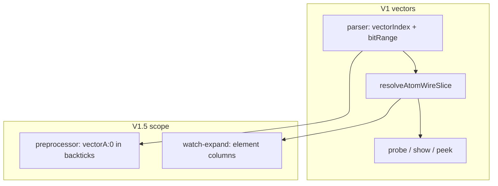

# V1.5 — Short notation + watch pentru vectori 1D

> Plan canonic (repo): [`.cursor/plans/v1.5_shortnotation_watch.plan.md`](v1.5_shortnotation_watch.plan.md)  
> Predecesor: [wire_vectors_1d.plan.md](wire_vectors_1d.plan.md) (V1 livrat)

## Context

**V1 vectors** (livrat) oferă `vectorA:0`, `vectorA:(index)`, `vectorA:1.0/2` **în script normal** — parser + [`resolveAtomWireSlice`](v0_3_2/core/interpreter.js) + probe/show/Zlist.

Două zone rămân **în afara V1**, documentate explicit în [wire_vectors_1d.plan.md](wire_vectors_1d.plan.md) secțiunea 9:

| Subiect V1 | Stare actuală |
|------------|---------------|
| `` `vectorA:0` `` în short notation | **Nu** — tokenizer oprește la `:` |
| `watch(vectorA:0)` | **Nu** — [`watch-expand.js`](v0_3_2/core/watch-expand.js) ignoră `vectorIndex`; `buildWireWidthMapFromStmts` folosește `4wire` nu `12` pentru decl `4wire[3]` |

**V1.5** = milestone mic, focalizat: paritate short notation + watch cu vectorii, aliniat cu probe (deja funcțional via `resolveAtomWireSlice` în `_resolveProbeExpr`).



---

## Ce NU este V1.5

Păstrăm explicit **out of scope** (documentat, fără implementare):

- `` `vectorA:(indexWire)` `` în backticks (index dinamic în preprocessor text)
- `` `a.(expr)/4` `` — deja interzis în [short-notation.md](v0_3_2/doc/short-notation.md) Limitations
- Multidim `4wire[3,3]`, ZCONN pe element, chip pins vector
- Timeline UX din [evaluare_timeline_watch.plan.md](evaluare_timeline_watch.plan.md) (motive probe, click-to-inspect, zoom) — **opțional V1.6+**, nu blocker pentru V1.5
- `watch(.dip.0)` slice pe componentă — problemă separată de vectori
- `watch(vectorA:(index))` expand la elaborare (index dinamic → 1 canal, ca acum)
- Grouping vizual `watch(vectorA)` pe elemente în Timeline — V2 UX

---

## Partea 1 — Short notation

### Problema

[`tokenizeShort`](v0_3_2/core/preprocessor.js) acceptă operanzi `[a-zA-Z0-9._\/?~%$;-]` dar **nu** `:`. Expresia `` `vectorA:0 | vectorA:1` `` eșuează la `:`.

### Comportament țintă V1.5

Operand passthrough (ca `a.0/4` astăzi):

| În backticks | Expansiune |
|--------------|------------|
| `` `vectorA:0` `` | `vectorA:0` |
| `` `vectorA:1.0/2` `` | `vectorA:1.0/2` |
| `` `vectorA:0 & vectorA:1` `` | `AND(vectorA:0,vectorA:1)` |
| `` `vectorA:1;8 & 1111` `` | `AND(vectorA:1;8,1111)` |

Parserul existent preia de aici — **fără** logică vector în preprocessor.

### Implementare

1. **`preprocessor.js`** — adaugă `:` în clasa de caractere operanzi (linia ~102):

```javascript
if (/[a-zA-Z0-9._\/?~%$;:]/.test(c) || c === '\\') {
```

2. **Teste** — grup `short-notation`, ID **1707–1710** (după 1706):

| ID | Scop |
|----|------|
| 1707 | `` `vectorA:0` `` passthrough |
| 1708 | `` `vectorA:1.0/2` `` passthrough |
| 1709 | `` `vectorA:0 \| vectorA:1` `` → `OR(vectorA:0,vectorA:1)` |
| 1710 | Runnable: `4wire y = \`vectorA:0 & vectorA:1\`` pe vector declarat |

3. **Doc** — [short-notation.md](v0_3_2/doc/short-notation.md):
   - Secțiune nouă „Vector element access” cu exemple
   - Actualizează Limitations: scoate interdicția pe `vectorA:0`; păstrează `vectorA:(wire)` și `a.(expr)/4` ca viitor

---

## Partea 2 — watch

### Problema

[`expandWatchExpr`](v0_3_2/core/watch-expand.js) tratează doar:
- wire plat + `bitRange` pe wire
- expandare la lățimea din `wireWidths`

Atom cu `vectorIndex` (ex. `watch(vectorA:0)`) nu e recunoscut → fie 1 canal greșit, fie expandare la toți cei 12 biți ai wire-ului.

`activateWatches` deja folosește `getBitWidth(wire.type)` (12 pentru vector) și `_resolveProbeExpr` post-expand — deci **infrastructura probe slice există**, lipsește doar expandarea corectă înainte de înregistrare.

### Comportament țintă V1.5

| Expresie | Coloane Timeline | Label |
|----------|-------------------|-------|
| `watch(vectorA)` pe `4wire[3]` | **12** (wire subiacent) | `vectorA.0` … `vectorA.11` |
| `watch(vectorA:0)` | **4** (un element) | `vectorA:0.0` … `vectorA:0.3` |
| `watch(vectorA:1.0/2)` | **2** (sub-range în element) | `vectorA:1.0`, `vectorA:1.1` |
| `watch(vectorA:1)` | **4** | `vectorA:1.0` … `vectorA:1.3` |

**Decizie:** `watch(vectorA)` rămâne expandare **flat pe biți** (echivalent `12wire`). V1.5 nu introduce grouping vizual pe elemente; elementul explicit se folosește via `:index`.

### Implementare

1. **`core/vector-slice.js`** (nou) — helpers statici partajați:
   - `resolveAtomWireSliceStatic(atom, vectorMeta, resolveRange)`
   - `formatVectorElementBitLabel(atom, relBit)`
   - Evită duplicarea formulei `elemStart + relStart` față de `resolveAtomWireSlice` din interpreter

2. **`watch-expand.js`** — extinderi:
   - `buildVectorMetaMapFromStmts(stmts)` — `{ elementWidth, elementCount }` din `decl.vectorCount`
   - `getDeclBitWidth(d)` — `parseWireTypeBits(type) * vectorCount` în `buildWireWidthMapFromStmts`
   - `isVectorElementAtom(atom)` — `vectorIndex` static (nu `vectorIndexExpr`)
   - `expandWatchExpr`: dacă `atom.vectorIndex` → N expr-uri per bit element:
     ```javascript
     { var: 'vectorA', vectorIndex: 0, bitRange: { start: b, end: b } }
     // → label vectorA:0.b, slice absolut via _resolveProbeExpr
     ```
   - `labelFromWatchExpr` / `watchTargetKeyFromExpr`: prefix `vectorA:1.0`, key `w:vectorA:v:1:0-0`
   - Param opțional `vectorMetas` (Map) pe lanțul expand/dedupe/labels

3. **Bundle** — adaugă `vector-slice.js` **înainte** de `watch-expand.js` în:
   - [`test_runtime_bundle_generated.js`](v0_3_2/tests/test_runtime_bundle_generated.js)
   - [`run_tests.html`](v0_3_2/run_tests.html)
   - [`script_editor_v0_3_2.html`](v0_3_2/script_editor_v0_3_2.html)

4. **`interpreter.js` — `activateWatches`**:
   - Construiește `vectorMetas` din `this.wires` (sau stmts la test expand)
   - Pasează la `WE.expandWatchExprs(..., vectorMetas)`

### Atom expandat (important)

**Nu** expanda la `vectorA.4` (wire flat label). `_resolveProbeExpr` folosește deja `resolveAtomWireSlice` pentru `vectorIndex` + `bitRange` relativ la element.

### Teste — ID 1711–1714 (grup `debug`)

| ID | Scop |
|----|------|
| 1711 | Parser: `watch(vectorA:0)` în `watches[]` |
| 1712 | Expand: 4 canale, label `vectorA:0.0`…`0.3` (`watchLabelsFromExprs`) |
| 1713 | `watch(vectorA:1.0/2)` → 2 canale |
| 1714 | Samples la schimbare element (`vectorA:1 = …`, pattern test 1179) |

Pattern: teste **1176–1183** existente + `watchLabelsFromExprs` / `dedupeExpandedWatchExprs`.

### Doc

[debug.md](v0_3_2/doc/debug.md) secțiunea `watch`:
- Tabel cu `watch(vectorA:0)`, `watch(vectorA:1.0/2)`
- Notă: `watch(vectorA)` = 12 coloane flat
- Cross-link [wire-vectors.md](v0_3_2/doc/wire-vectors.md)

---

## Ordine implementare

1. Short notation tokenizer (`:`) + teste 1707–1710 + short-notation.md
2. `vector-slice.js` + bundle entries
3. watch-expand vector branches + `activateWatches`
4. Teste watch 1711–1714 + debug.md + wire-vectors cross-link
5. `node v0_3_2/node/_gen_test_manifest.js` + suite verde (1184 → 1188 teste)

---

## Criterii de done V1.5

- [ ] `` `vectorA:0` `` și `` `vectorA:1.0/2` `` funcționează în backticks (expand + run)
- [ ] `watch(vectorA:0)` și `watch(vectorA:1.0/2)` produc coloane corecte în Timeline
- [ ] Label-uri watch aliniate cu probe (`vectorA:1.0-1`)
- [ ] Documentație actualizată (short-notation + debug + wire-vectors cross-link)
- [ ] Fără regresii teste short-notation 102–133 / watch 1176–1187 / wire-vectors 1684–1706

---

## Viitor după V1.5 (notă în plan, fără implementare)

| Subiect | Milestone sugerat |
|---------|-------------------|
| `` `vectorA:(idx)` `` în short notation | V1.6 — necesită lexer mai inteligent |
| Timeline: motive probe + inspect rând | V1.6 — [evaluare_timeline_watch.plan.md](evaluare_timeline_watch.plan.md) |
| `watch(vectorA)` grouping vizual pe elemente | V2 UX — nu schimbă semantica |
| Short notation: vectori în `lutOf(\`...\`)` | funcționează după V1.5 dacă backtick expand e corect |
