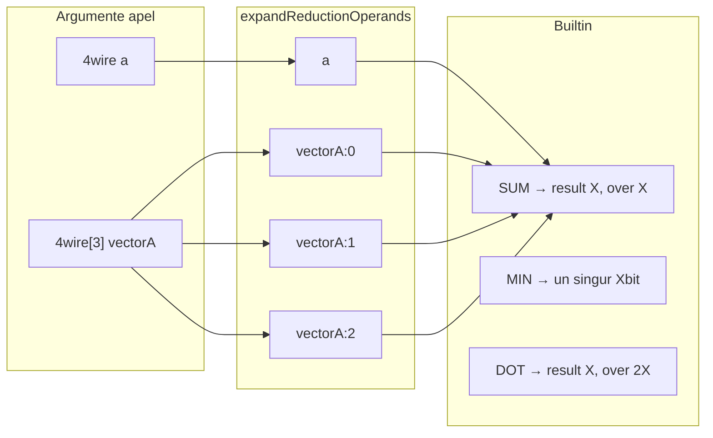

# Vector reduction functions (SUM, MIN, MAX, DOT)

> Plan canonic (repo): [`.cursor/plans/vector_reduction_functions.plan.md`](vector_reduction_functions.plan.md)  
> Copie Cursor IDE: `c:\Users\adypa\.cursor\plans\vector_reduction_functions_810b39c0.plan.md` — mențineți ambele sincronizate.  
> Predecesor: [wire_vectors_1d.plan.md](wire_vectors_1d.plan.md) (V1 livrat), [v1.5_shortnotation_watch.plan.md](v1.5_shortnotation_watch.plan.md) (livrat)

## Context

Spec-ul utilizatorului descrie **funcții de reducere** care acceptă wire-uri individuale, vectori întregi sau mix, cu **expandare implicită**: un argument `vectorA` (`4wire[3]`) devine trei operanzi (`vectorA:0`, `:1`, `:2`).

**Stare actuală în cod:**

| Funcție | Există? | Comportament actual vs. țintă |
|---------|---------|-------------------------------|
| `SUM` | **Nu** | — |
| `DOT` | **Nu** | — |
| `MIN` / `MAX` | Da ([`interpreter.js`](v0_3_2/core/interpreter.js) ~4468) | Variadic, same width; **fără** expandare vector — `MIN(vectorA)` compară **12 biți** ca un singur operand |
| `MAC` | Da | Model pentru sumă parțială + `over`; relație conceptuală cu `DOT` |

Apelul builtin evaluează argumentele în [`call()`](v0_3_2/core/interpreter.js) (~3758) ca string-uri binare concatenate — **identitatea vectorului se pierde** după eval. Expandarea trebuie făcută **pe AST-ul argumentului**, înainte de join.



---

## Decizii de design (confirmate)

### Expandare operanzi

**Model mental (confirmat):** orice `vectorA:i` sau `vectorA:i.relRange` este un **wire slice** — același mecanism ca `data.4/4` pe wire plat, via [`resolveAtomWireSlice`](v0_3_2/core/interpreter.js). `vectorA:0` fără sufix = element întreg = bit-range relativ `[0 .. elementWidth-1]` pe acel element.

| Argument la apel | Tratare |
|------------------|---------|
| Wire plat `a` sau `a.1/3` / `a.1-3` | 1 operand (lățime = wire sau slice) |
| Vector întreg `vectorA` (atom `{ var }` only, fără `:index`) | **Expandare:** `elementCount` operanzi — câte un element `vectorA:0 … vectorA:n-1` |
| Element `vectorA:0` | 1 operand = element întreg (`elementWidth` biți) — echivalent `vectorA:0.0/(W-1)` |
| Sub-range element `vectorA:0.1/3`, `vectorA:0.1-3` | 1 operand = biți relativi 1–3 din element 0 (3 biți) — **fără** expandare |
| Expresie compusă (ex. `a + b`, `` `...` ``) | 1 operand = valoarea evaluată (comportament actual) |
| Mix `SUM(vectorA, vectorA:0.1/2, x)` | expandare doar pe `vectorA` whole; slice-urile rămân operanzi individuali |

**Evaluare slice (toate reducerile SUM/MIN/MAX):** un singur atom `{ var, vectorIndex, bitRange? }` → `evalAtom` / `resolveAtomWireSlice` → string binar; **nu** duplicăm logica de bit-range.

Helpers:

```javascript
isWholeVectorWireArg(argExpr)
  // atom simplu { var }, wire.vector, fără vectorIndex / bitRange

isVectorSliceArg(argExpr)
  // atom cu vectorIndex (± bitRange relativ la element)

evalReductionOperand(argExpr) → string
  // whole-vector → expand; slice → resolveAtomWireSlice; altfel evalExpr
```

**Lățime comună:** după expandare, toți operanzii trebuie **aceeași lățime** (`requireSameBitWidth`). Ex.: `SUM(vectorA:0, vectorA:1.0/2)` → 4 biți vs 3 biți → **eroare**. `SUM(vectorA:0.1/2, vectorA:1.1/2)` → ambele 2 biți → OK; `X=2` pentru SUM result/over.

**DOT:** rămâne **doar vectori întregi** (2 args whole-vector); slice-uri ca `DOT(vectorA:0, vectorB:0)` **nu** sunt DOT — ar fi un singur produs; out of scope (folosiți `MULTIPLY` / `MAC`).

### Lățimi rezultat (regulă simplificată — confirmată)

Fie `X` = lățimea comună a operanzilor expandați (toți trebuie să aibă aceeași lățime; eroare altfel).

| Funcție | Semnătură outputs | Total biți |
|---------|-------------------|------------|
| **SUM** | `Xbit result`, `Xbit over` | **2X** |
| **DOT** | `Xbit result`, `2Xbit over` | **3X** |
| **MIN / MAX** | `Xbit` (un singur output) | X |

Reconstrucție sumă completă (SUM / DOT): concatenare **`over` apoi `result`** (MSB → LSB), ca la [`MAC`](v0_3_2/doc/arithmetic.md).

**Overflow:** dacă suma matematică necesită mai mult de 2X (SUM) sau 3X (DOT) biți → **eroare runtime**. Nu trunchiere silențioasă.

**Formule capacitate (worst-case unsigned, toate elementele la maxim):**

| Funcție | Biți necesari rezultat matematic | Output declarat | Condiție încăpere |
|---------|-----------------------------------|-----------------|-------------------|
| **SUM** | `X + ceil(log2(k))` | **2X** | `k ≤ 2^X` (ex. `X=16` → până la **65536** operanzi) |
| **DOT** | `2X + ceil(log2(n))` | **3X** | `n ≤ 2^X` (ex. `X=64`, `n=50` → trivial) |

Unde `k` = operanzi după expandare, `n` = `elementCount`.

### Scală perceptron / rețea — BigInt suficient?

**Da — matematic și la runtime JS, pentru exemplele tale BigInt nu e limita.**

JavaScript `BigInt` nu are plafon de biți (spre deosebire de `Number`, sigur doar până la 2⁵³−1). [`macUnsigned`](v0_3_2/core/interpreter.js) folosește deja BigInt pentru `MAC`; `SUM`/`DOT` extind același pattern cu **un singur acumulator** în buclă (fără alocări BigInt per element).

| Config | Elemente | DOT: produse + sumă | Output 3X | BigInt OK? | Performanță estimată (1 apel) |
|--------|----------|---------------------|-----------|------------|-------------------------------|
| `16wire[100]` | 100 × 16 bit | ~39 bit necesari | 48 bit | Da | Neglijabil (~100 MAC) |
| `32wire[50]` | 50 × 32 bit | ~70 bit necesari | 96 bit | Da | Foarte rapid (~50 MAC × 32b) |
| `64wire[50]` | 50 × 64 bit | ~134 bit necesari | 192 bit | Da | OK (~50 MAC × 64b; ms sub) |

**SUM** pe același vector (ex. `SUM(weight)` peste 100 elemente 16-bit): maxim ~23 bit necesari, output **2X=32** — larg suficient.

**Unde devine problematic (notă plan, nu blocker V1):**

| Factor | Prag orientativ | Mitigare viitoare (out of scope V1) |
|--------|-----------------|-------------------------------------|
| **Număr elemente `n`** | `n > 10⁴–10⁵` per apel DOT în interpreter pur JS | layer dedicat / WASM / batch offline |
| **Lățime `X > 128`** | BigInt multiply mai lent (O(n²) pe limbs) | rar în perceptron fix-point; doc limită soft |
| **Multe straturi în RUN** | timp simulare, nu overflow | normal pentru logTscript ca simulator didactic |

**Recomandare implementare:**

1. **Un acumulator `BigInt acc = 0n`**, buclă `acc += a * b` — același stil ca `macUnsigned`, fără string-uri intermediare per termen.
2. **Parse operand o dată** per element (sau citește din ref wire); evită `join('')` repetat pe vector întreg în DOT.
3. **Test de scală în suite:** `1731` — `DOT` pe `16wire[100]` valori random/margin; `1732` — `32wire[50]`; opțional `1733` smoke `64wire[50]` (fără assert timing, doar corectitudine).
4. **Doc V1:** secțiune scurtă „Perceptron / fixed-point” — formule capacitate + referință la **V2** pentru exemplu complet (vezi mai jos).

**Concluzie pentru NN mic/mediu:** `16wire[100]`, `32wire[50]`, `64wire[50]` sunt **în confortul BigInt** — problema nu e precizia, ci doar viteza dacă rulezi mii de forward-pass-uri consecutive (acceptabil pentru prototip didactic).

### MIN / MAX pe vectori

- `MIN(vectorA)` ≡ `MIN(vectorA:0, vectorA:1, vectorA:2)` — expandare whole-vector.
- `MIN(vectorA:0.1/3)` — un singur operand (3 biți); necesită ≥2 operanzi total → combină cu alți args.
- Slice-uri și elemente folosesc **aceeași** cale `resolveAtomWireSlice` ca probe/show.
- Comparare unsigned via `pickMinMaxUnsigned` ([`interpreter.js`](v0_3_2/core/interpreter.js) ~168).

### DOT

- Exact **2** argumente; ambele **vectori întregi** (whole-vector args).
- Aceeași `elementWidth` și `elementCount`; altfel eroare: `DOT: vectors must have same shape`.
- Algoritm: pentru fiecare `i`, acumulează `acc += vectorA:i * vectorB:i` (unsigned); la final split în `result` (low X) + `over` (următorii 2X biți).
- Implementare internă: buclă `MAC(acc, ai, bi)` sau helper `dotUnsigned` partajat cu `macUnsigned` (~203).

### Relație MAC

Documentăm echivalența conceptuală (spec user): `DOT` = lanț de `MAC(acc, vectorA:i, vectorB:i)` cu `acc` inițial 0; implementarea poate fuziona într-o singură trecere BigInt.

---

## Ce NU este în scope

- **Reduce „along axis” multidimensional** — ex. `4wire[3,3]` sau reducere automată pe sub-dimension; slice-uri explicite `vectorA:0.1/2` ca operanzi **sunt** în scope
- **Operanzi de lățimi diferite** în același apel după evaluare (ex. `SUM(vectorA:0, vectorA:1.0/2)`)
- **`DOT` pe slice-uri** — doar perechi de vectori întregi de aceeași formă
- **`SUM` / `DOT` în short notation backticks** — apelul normal `SUM(...)` funcționează; nu testăm/menționăm `` `SUM(...)` `` în backticks pentru acest milestone

### Clarificări (întrebări frecvente)

**„`doc(SUM)` în `lutOf` — nu e necesar”** — ce înseamnă:

- `doc(MAC)` / `doc(SUM)` = builtin-ul existent care **afișează semnătura** funcției în Output (`doc(SUM)` → linie tip `SUM(Wbit ...) -> ...`). Asta **intră** în milestone (autocomplete + `BUILTIN_DOC`).
- `lutOf(...)` = utilitar **boolean** — generează tabel LUT din expresii logice (`lutOf(OR(A,B))`). `SUM`/`DOT` sunt **aritmetice**, nu booleene.
- Out of scope = **nu** implementăm / testăm combinații invalide gen `lutOf(SUM(a,b))` sau integrare SUM în pipeline-ul LUT. Nu e o funcționalitate cerută.

**„Optimizări hardware / componente `adder`”** — ce înseamnă:

- `SUM`/`DOT` rulează ca **built-in combinational** în [`interpreter.js`](v0_3_2/core/interpreter.js) (`call()` + BigInt), la fel ca `ADD`/`MAC` astăzi.
- **Nu** delegăm la componenta simulată `adder` / `multiplier` din editor, **nu** adăugăm propagare wave specială, **nu** „fuse” în hardware virtual.
- Motiv: simplitate, determinism imediat, aliniere cu restul aritmeticii built-in.

---

## Implementare

### 1. Modul nou [`v0_3_2/core/vector-reduce.js`](v0_3_2/core/vector-reduce.js)

Funcții exportate (testabile fără interpreter):

- `isWholeVectorWireArg(argExpr)` / `isVectorSliceArg(argExpr)`
- `expandReductionOperands(argExprs, ctx)` → `string[]` — whole-vector expand; slice via `resolveAtomWireSlice`; wire plat/slice via `evalAtom`
- `sumUnsignedExpanded(values, X)` → `{ result, over }` (2X biți)
- `dotUnsignedExpanded(pairs, X)` → `{ result, over }` (3X biți) — `pairs` = array `[a0,b0,a1,b1,…]` sau structură `{ aVals, bVals }`

### 2. [`interpreter.js`](v0_3_2/core/interpreter.js) — `call()`

- Helper instanță `_expandReductionArgValues(args)` folosind `vector-reduce.js` + `this.wires` / `evalAtom`
- **SUM**: variadic (≥ 1 operand după expand); return `[result, over]`; `_zstateRequireBinary` pe operanzi
- **DOT**: 2 args whole-vector; expand perechi element; return `[result, over]`
- **MIN / MAX**: înlocuiește colectarea `argValues` directă cu lista expandată (păstrează ≥ 2 check)
- `isBuiltinFunction`: adaugă `SUM`, `DOT`
- `BUILTIN_DOC` / `getDocLines`: semnături noi

Semnături doc:

```text
SUM(Wbit ...) -> Wbit result, Wbit over
DOT(Wbit[n] a, Wbit[n] b) -> Wbit result, (2W)bit over
MIN(Wbit ...) -> Wbit    # extins: vector whole-arg → elemente
MAX(Wbit ...) -> Wbit
```

### 3. Bundle

Adaugă `core/vector-reduce.js` **înainte** de `interpreter.js` în:

- [`tests/test_scripts.json`](v0_3_2/tests/test_scripts.json)
- [`script_editor_v0_3_2.html`](v0_3_2/script_editor_v0_3_2.html) (manual, ca `vector-slice.js`)

Regenerare: `node v0_3_2/node/_gen_test_manifest.js`

### 4. Teste — grup `vector-reduction`, ID **1715–1730** (estimare)

| ID | Scop |
|----|------|
| 1715 | `SUM(a, b)` — 2 wire-uri 4bit, verifică result/over (2X=8 biți total) |
| 1716 | `SUM(vectorA)` — 3 elemente, echivalent sumă manuală |
| 1717 | `SUM(vectorA, vectorB)` — expandare multi-vector |
| 1718 | `SUM(vectorA, x, vectorB)` — mix |
| 1719 | SUM overflow → eroare când suma > 2X |
| 1720 | `MIN(vectorA)` — minimum element |
| 1721 | `MAX(vectorA, vectorB)` — mix multi-vector |
| 1722 | MIN width mismatch după expand → eroare |
| 1723 | `DOT(vectorA, vectorB)` — result + over 3X |
| 1724 | DOT shape mismatch → eroare |
| 1725 | DOT echivalent lanț MAC (valoare numerică) |
| 1726 | `4wire[1]` + MIN → eroare ≥2 operanzi |
| 1727 | `SUM(vectorA:0, vectorA:1)` — elemente explicite, fără expand whole-vector |
| 1727b | `SUM(vectorA:0.1/2, vectorA:1.1/2)` — sub-range element, lățime comună 2 |
| 1727c | `SUM(vectorA:0, vectorA:1.0/2)` — lățimi diferite → eroare |
| 1728 | `doc(SUM)` semnătură + autocomplete smoke (nu `lutOf(SUM(...))`) |
| 1729–1730 | regresie MIN/MAX wire plat (1625 pattern) + vector ne-vector arg |
| 1731 | `DOT(16wire[100], 16wire[100])` — corectitudine perceptron-scale |
| 1732 | `DOT(32wire[50], 32wire[50])` — corectitudine |
| 1733 | `DOT(64wire[50], 64wire[50])` — smoke BigInt 64-bit element (corectitudine, nu benchmark) |

Pattern existente: teste aritmetice ~12838 (MAC), wire-vectors 1686–1706.

### 5. Documentație (engleză, user-facing)

**Fișier nou:** [`v0_3_2/doc/vector-reduction.md`](v0_3_2/doc/vector-reduction.md) — conținut din **Appendix A** (adaptat la regulile 2X / 3X).

**Actualizări cross-link:**

- [`wire-vectors.md`](v0_3_2/doc/wire-vectors.md) — secțiune nouă „Reduction functions” → link doc
- [`arithmetic.md`](v0_3_2/doc/arithmetic.md) — SUM/DOT + notă MIN/MAX vector-aware; link MAC ↔ DOT
- [`doc-index.json`](v0_3_2/doc/doc-index.json) — intrare nouă
- Regenerare: `node v0_3_2/node/_gen_doc_data.js` (sau scriptul doc existent din repo)

---

## Ordine implementare

1. `vector-reduce.js` + unit logic (sum/dot split 2X/3X)
2. `interpreter.js` expand + SUM/DOT + MIN/MAX hook
3. Bundle + autocomplete/doc lines
4. Teste 1715–1730
5. `vector-reduction.md` + cross-links + gen doc
6. Manifest + suite verde

---

## V2 — Viitor (out of scope V1)

> **Nu implementăm acum** — milestone separat după livrarea builtin-urilor SUM/DOT/MIN/MAX. Alte dependințe (TBD) pot preceda V2.

### Exemplu perceptron (single neuron, fixed-point)

Scop: doc `logts-play` + eventual fișier bibliotecă `files/examples/perceptron-dot.logts` — demonstrează `DOT(weights, inputs)` ca weighted sum, tipic rețea mică.

```logts
# Perceptron 1 neuron — V2 demo (not implemented in V1)
# 8-bit signed-ish fixed point via unsigned + bias offset (simplified)

16wire[4] weights = 0010 + 0011 + 1100 + 0001   # w0..w3
16wire[4] inputs  = 0001 + 0010 + 0011 + 0100   # x0..x3
16wire bias       = 0000000000010000              # +16 offset example

16wire dotLo
32wire dotHi
dotLo, dotHi = DOT(weights, inputs)

# acc = dot + bias  (V2 doc: compose with ADD or MAC pattern)
16wire accLo
16wire accOver
accLo, accOver = SUM(dotLo, bias)   # or wider wiring per actual dotLo width

# Activation threshold — V2: GT(accLo, threshold) → 1bit out
1wire threshold = 1
1wire out = GT(accLo, threshold)

show(out)
show(dotLo)
```

**V1 livrează doar primitives** (`DOT`, `SUM`, `GT` existent). **V2 adaugă:**

| Item V2 | Descriere |
|---------|-----------|
| Doc capitol | „Perceptron example” în [`vector-reduction.md`](v0_3_2/doc/vector-reduction.md) sau doc dedicat `perceptron.md` |
| `logts-play` | Exemplu runnable verificat în editor |
| Opțional | Layer cu `16wire[N]` / `32wire[N]` preset-uri (MNIST-toy N=100) |
| Opțional | Notă bias + overflow `3X` la alegerea lățimii |

**Alte candidati V2 (fără implementare acum):** `AVG`, `PRODUCT`; short notation `` `DOT(w,i)` ``; benchmark opțional DOT la `n > 10⁴`.

---

## Recomandări suplimentare

1. **Overflow explicit** — mesaj tip `SUM: result requires 2X bits (X=4); value needs 5 bits` — ajută la dimensionare fire.
2. **Nu reutiliza `+` chain** pentru SUM intern — un singur BigInt pe operanzi expandați evită propagări intermediare și e mai clar pentru overflow.
3. **Test MAC-equivalence DOT** — ancoră de regresie pentru refactor viitor.
4. **Viitor V2+:** vezi secțiunea **V2** de mai sus; short notation `` `SUM(vectorA:0, vectorA:1)` `` funcționează ca apel normal după V1.
5. **Actualizare** [wire_vectors_1d.plan.md](wire_vectors_1d.plan.md) secțiune viitor — link la acest plan.

---

## Criterii de done (V1)

- `SUM`, `DOT` builtin noi; `MIN`/`MAX` expandă vectori whole-arg + slice-uri element
- Semnături lățime: SUM 2X, DOT 3X; overflow → eroare
- Doc [`vector-reduction.md`](v0_3_2/doc/vector-reduction.md) + cross-links (fără exemplu perceptron complet — **V2**)
- Teste 1715–1733 verzi; fără regresii wire-vectors / arithmetic / select 1625–1626
- Editor: autocomplete + `doc(SUM)` / `doc(DOT)`
- **Nu** include: demo perceptron runnable, `files/examples/perceptron*.logts` (→ V2)

---

## Appendix A — User spec (sursă documentație)

> Text original cerut de utilizator. La implementare, adaptați exemplele la regulile de lățime **SUM: result X + over X (2X total)**, **DOT: result X + over 2X (3X total)** — vezi secțiunea „Lățimi rezultat”.

# Vector reduction functions

Reduction functions operate on one or more values and return a single result.

Arguments may be:

* individual wires
* wire vectors
* a mix of both

When a vector is passed, each of its elements participates in the operation independently.

## SUM

Returns the sum of all supplied values.

### Syntax

```text
SUM(value1, value2, ...)
```

### Examples

Individual wires:

```logts
4wire a = 0011
4wire b = 0101

4wire result
3wire over

result, over = SUM(a, b)
```

Equivalent to:

```text
a + b
```

Single vector:

```logts
4wire[3] vectorA =
    0001 +
    0010 +
    0011

4wire result
2wire over

result, over = SUM(vectorA)
```

Equivalent to:

```text
vectorA:0 +
vectorA:1 +
vectorA:2
```

Multiple vectors:

```logts
SUM(vectorA, vectorB)
```

Equivalent to:

```text
vectorA:0 +
vectorA:1 +
vectorA:2 +
vectorB:0 +
vectorB:1 +
...
```

Mixed arguments:

```logts
SUM(vectorA, value, vectorB)
```

Equivalent to:

```text
vectorA:0 +
vectorA:1 +
...
value +
vectorB:0 +
...
```

The result is returned as:

* **result** – low N bits
* **over** – remaining high bits

The complete mathematical sum is obtained by concatenating `over` and `result`.

> **Plan note:** N = X (operand width). Output fixed **X + X = 2X** bits total (`result` low X, `over` next X). Exemplele cu `3wire over` / `2wire over` din spec sunt orientative — la implementare folosiți **Xbit over** pentru SUM.

---

## MIN

Returns the smallest supplied value.

### Syntax

```text
MIN(value1, value2, ...)
```

### Examples

Two wires:

```logts
4wire m = MIN(a, b)
```

Vector:

```logts
4wire m = MIN(vectorA)
```

Equivalent to:

```text
MIN(
    vectorA:0,
    vectorA:1,
    vectorA:2
)
```

Multiple vectors:

```logts
4wire m = MIN(vectorA, vectorB)
```

Equivalent to:

```text
MIN(
    vectorA:0,
    vectorA:1,
    vectorA:2,
    vectorB:0,
    vectorB:1,
    ...
)
```

Mixed values:

```logts
4wire m = MIN(vectorA, x, vectorB, y)
```

Returns the minimum element across all supplied values.

---

## MAX

Returns the largest supplied value.

### Syntax

```text
MAX(value1, value2, ...)
```

Examples follow the same rules as `MIN`.

```logts
4wire m = MAX(vectorA)
```

```logts
4wire m = MAX(vectorA, vectorB)
```

```logts
4wire m = MAX(vectorA, x, vectorB)
```

Returns the maximum element across all supplied values.

---

## DOT

Computes the dot (scalar) product of two vectors.

### Syntax

```text
DOT(vectorA, vectorB)
    -> result, over
```

Both vectors must:

* have the same element width;
* contain the same number of elements.

### Example

```logts
4wire[3] vectorA =
    0001 +
    0010 +
    0011

4wire[3] vectorB =
    0100 +
    0101 +
    0110

4wire result
5wire over

result, over = DOT(vectorA, vectorB)
```

Equivalent to:

```text
(vectorA:0 × vectorB:0)
+
(vectorA:1 × vectorB:1)
+
(vectorA:2 × vectorB:2)
```

The complete mathematical result is obtained by concatenating `over` and `result`.

> **Plan note:** Output fixed **X + 2X = 3X** bits total (`result` low X, `over` next 2X). Exemplul cu `5wire over` din spec → la implementare **2Xbit over** când element width X=4.

---

## Relationship with MAC

`MAC()` performs a single multiply-accumulate operation:

```text
acc + (a × b)
```

Conceptually, `DOT()` can be viewed as repeatedly applying `MAC()` over each pair of vector elements:

```text
acc = 0

acc = MAC(acc, vectorA:0, vectorB:0)
acc = MAC(acc, vectorA:1, vectorB:1)
acc = MAC(acc, vectorA:2, vectorB:2)

...
```

although implementations may optimize the computation internally.
