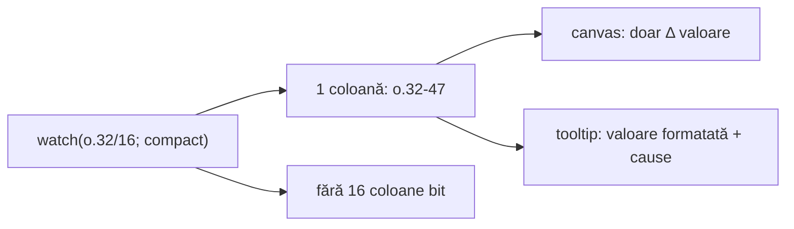

# Watch `compact` — plan propus

**Status:** ⏳ de implementat (după **Strat 2.1** tooltip — ✅ livrat).

**Plan părinte:** [wave_debug_tooling.plan.md](wave_debug_tooling.plan.md) — Strat 2.5 (watch compact).

**Nu confunda** cu `show(v; compact)` din [`debug-display-format.js`](v0_3_2/core/debug-display-format.js) (header tensor fără celule `:i`).

---

## Context

- **Acum:** [`watch-expand.js`](v0_3_2/core/watch-expand.js) expandează automat orice wire/slice multi-bit în coloane per bit (`o.0`…`o.31`, sau 16 coloane pentru `o.32/16`).
- **Strat 2 (implementat):** `@watch` în Output + tooltip cause pe Timeline; canvas rămâne grafic.
- **Strat 2.1 (implementat):** tooltip aliniat rând + coloană, scalare CSS/canvas, touch, clamp viewport.
- **`compact` pe watch = NOU** — tag opțional pe `watch()`.



---

## Principiu de design (confirmat 2026-07-08)

- **Expresia ta = granița canalului.** `compact` oprește expand-ul, nu „forțează tot wire-ul”.
- **Fără text mare pe canvas** — valori imense (123wire packet) doar în tooltip / Output.
- **Slice explicit permis:** `watch(o.32/16; compact)` → 1 coloană, nu 16 biți — nu „dă peste mână” expand-ul implicit.

Exemple:

| Script | Coloane Timeline |
|--------|------------------|
| `watch(o)` | 32 coloane (ca acum) |
| `watch(o; compact)` | 1 coloană `o` |
| `watch(o.32/16; compact)` | 1 coloană `o.32-47` |
| `watch(o.0..3)` | 4 coloane (ca acum) |
| `watch(o.0..3; compact)` | 1 coloană slice (4 biți ca blob) |
| `watch(packetEncoded; compact; level=2)` | 1 coloană + cause tooltip / `@watch` |

---

## Analiza opțiunilor vizuale (canvas)

### A — Edge + fill neutru constant ✅ **MVP (confirmat)**

**Ce vezi:** între schimbări, bară gri închis uniformă; la fiecare commit cu valoare nouă, linie de edge colorată (ca acum la biți). Hover / tap → tooltip cu valoarea completă (+ cause dacă `level≥1`).

| Pro | Contra |
|-----|--------|
| Consistent cu Timeline actual (HIGH/LOW devine „stabil / s-a schimbat”) | Nu distingi vizual *care* valoare e activă fără hover |
| Zero clutter; scalează la 123+ biți | Perioade lungi fără schimbare arată „plat” (dar corect) |
| Implementare simplă: `edge = valueStr !== prevValueStr` | |
| Nu poluează banda seq din dreapta | |

**Când e suficient:** `packetEncoded`, LUT, vectori — vrei să vezi *când* s-a schimbat, nu pattern-ul biților.

---

### B — Edge + hex scurt în banda seq (dreapta)

**Ce vezi:** la rândurile cu Δ, lângă `#seq` apare prefix scurt (`^ABCD…`, max ~8–12 caractere).

| Pro | Contra |
|-----|--------|
| Identifici valoarea fără hover | Text pe canvas — contrazice principiul „fără valoare pe canvas” |
| Util la scroll rapid prin istoric | Aglomerare când multe canale compact + seq markers |
| | Valori ASCII / simbolice greu de truncat util |

**Decizie:** amânat; eventual toggle UI „show delta hint”, nu default.

---

### C — Edge + flash colorat pe rând (fără text)

**Ce vezi:** la schimbare, bandă subtilă colorată (ex. portocaliu re-eval) pe rândul Δ; fill neutru altfel.

| Pro | Contra |
|-----|--------|
| „Ceva s-a întâmplat” foarte vizibil | Nu encodezi valoarea — tot hover pentru detaliu |
| Poate combina cu banda cause Strat 2 | Risc confuzie cu semantica HIGH/LOW veche |

**Decizie:** opțional ulterior — refolosește banda portocalie re-eval deja existentă.

---

## Recomandare finală

1. **Livrează A ca MVP** — edge-on-value-change + fill neutru + tooltip cu valoare formatată.
2. **Opțional ulterior:** C pentru rânduri cu cause re-eval (portocaliu).
3. **Evită B** ca default.

**Tooltip compact (obligatoriu la MVP):**

```text
o.32-47  seq 12  cycle 3
^4808 ABCD …        ← formatValue (hex grupat)
— changed
  re-eval ← .huff:clear
```

Trunchiere: prag similar Wave Listen (>256 bit → trunc în tooltip, nu pe canvas).

**Format tooltip:** default `formatValue` (ca `show`); fază 2 opțional: `watch(…; compact; hex)` (subset tag-uri probe, fără `el*`).

---

## Implementare tehnică

### 1. Parser — [`parser.js`](v0_3_2/core/parser.js)

- Extinde `WATCH_DISPLAY_TAGS` cu `compact` (flag boolean).
- Opțional fază 2: `hex`, `bin` pentru formatare tooltip.

### 2. Expand — [`watch-expand.js`](v0_3_2/core/watch-expand.js)

- `expandWatchExpr` / `dedupeExpandedWatchExprs`: dacă item are `displayTags.compact`, **returnează expresia neschimbată** (fără expand pe biți).
- `watchTargetKeyFromExpr`: cheie stabilă pentru slice compact (`w:var:start-end`).
- `watchLabelsFromExprs`: label = expresia rezolvată (`o.32-47`), nu `o.32`…`o.47`.
- `activateWatches` ([`interpreter.js`](v0_3_2/core/interpreter.js)): propagă `displayTags.compact` pe target.

### 3. Engine — [`interpreter.js`](v0_3_2/core/interpreter.js)

- Target kinds existente (`wire`, `wireSlice`, `componentComputedSlice`) citesc slice-ul ca blob (`_readWireSliceValue`).
- `_recordWatchBatch`: pentru compact, `edge` = `valueStr !== lastWatchValue` (nu tranziție logică per bit).
- Payload channel: `{ compact: true, valueStr, bitWidth, edge, … }`.
- `@watch` / cause (Strat 2): neschimbat — un canal compact = un nume în linia `@watch`.

### 4. Timeline — [`timeline-analyzer.js`](v0_3_2/ui/timeline-analyzer.js)

- Mod render compact:
  - **Fill:** culoare neutră (`#3d2020`) când stabil; Z/X păstrează culorile existente.
  - **Edge:** la `edge === true` (schimbare valoare), linie sus pe rând (ca acum).
  - **Tooltip:** extinde `_tooltipTextForRow` — label canal + valoare formatată + seq/cycle + cause.
- Fără text desenat pe canvas în MVP (opțiunea A).

### 5. Doc — [`debug.md`](v0_3_2/doc/debug.md)

- Secțiune „Watch compact” cu tabel expr → coloane.
- Clarificare: `compact` watch ≠ `compact` show.
- Exemplu: `watch(packetEncoded; compact; level=2)`.

### 6. Teste (2219+)

| ID | Scop |
|----|------|
| 2219 | Parser: `watch(o; compact)`, `watch(o.32/16; compact)` |
| 2220 | Expand: 32wire + compact → 1 target; fără compact → 32 |
| 2221 | Slice compact: schimbare doar în slice → 1 sample, label corect |
| 2222 | Engine: edge la valoare nouă, nu la flip bit individual |
| 2223 | Timeline ingest: `compact: true` + tooltip valueStr |
| 2224 | Regresie: `watch(o.0..3)` fără compact → încă 4 coloane |

---

## Acceptance

- `watch(sym; compact)` pe Huffman / packet — **8 coloane** (`sym.0`…`sym.7`) devin **1 coloană** `sym` (sau N coloane dacă N expr în script).
- `watch(o.32/16; compact)` — **1 coloană** `o.32-47`, fără 16 bare bit.
- Canvas: fără text permanent; edge vizibil la schimbare valoare.
- Tooltip: valoare formatată + cause (cu `level≥1`).
- Regresie: watch fără `compact` — comportament identic cu acum.

---

## Ordine implementare

| # | Task | Fișier(e) |
|---|------|-----------|
| 1 | Parse `compact` | `parser.js` |
| 2 | Skip expand + labels | `watch-expand.js` |
| 3 | Batch + edge logic | `interpreter.js` |
| 4 | Render + tooltip | `timeline-analyzer.js` |
| 5 | Doc + teste | `debug.md`, `test_suite.js` |

**Efort estimat:** strat mic (~1 sesiune), fără impact pe probe sau Wave Listen.

---

## Legături

- [wave_debug_tooling.plan.md](wave_debug_tooling.plan.md) — Strat 2 / 2.1
- [evaluare_timeline_watch.plan.md](evaluare_timeline_watch.plan.md) — evaluare watch / Timeline
- [debug.md](v0_3_2/doc/debug.md) — `watch()` existent
